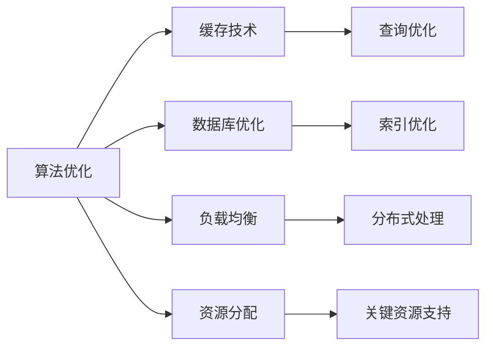
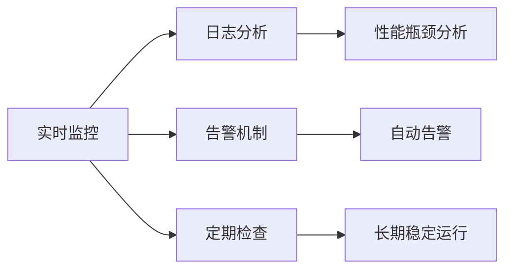

                 

# 引言：评测系统性能调优与监控的重要性

在现代信息社会中，评测系统在各个领域中扮演着至关重要的角色。无论是电子商务、在线教育、金融交易，还是科研数据分析，高效的评测系统都能够显著提升业务运营效率和用户满意度。然而，随着系统规模的不断扩大和复杂度的增加，如何保证评测系统的性能稳定和高效运行，成为了一个亟待解决的问题。

## 1.1 评测系统概述

### 1.1.1 评测系统的定义

评测系统是指用于对特定对象或目标进行评估、分析和判断的一系列软件和硬件组成的综合系统。它涵盖了从数据采集、处理、存储到最终结果的输出等多个环节。一个典型的评测系统通常包括以下几个核心组成部分：

- **数据采集模块**：负责从各种来源收集相关数据，如用户行为数据、交易记录、传感器数据等。
- **数据处理模块**：对采集到的数据进行清洗、转换和归一化等处理，以便后续分析和评估。
- **评估与判断模块**：根据预设的评估标准和算法，对处理后的数据进行分析和评估，得出最终结果。
- **结果输出模块**：将评估结果以可视化的形式呈现给用户，或通过API接口供其他系统调用。

### 1.1.2 评测系统的核心要素

- **数据质量**：数据是评测系统的基础，数据质量的高低直接影响到评估结果的准确性和可靠性。
- **算法效率**：算法是实现评估的核心，高效的算法能够保证系统在短时间内完成大量数据的处理。
- **系统稳定性**：系统需要能够承受高并发、大数据量的压力，保证长时间稳定运行。
- **可扩展性**：随着业务需求的增长，系统应能够灵活扩展，以适应不断变化的需求。

### 1.1.3 性能调优与监控的需求和挑战

#### 需求

- **提升响应速度**：确保用户在使用评测系统时能够获得快速、准确的反馈。
- **优化资源利用率**：合理分配系统资源，提高资源利用率，降低运营成本。
- **保证数据准确性**：确保评估结果的准确性和可靠性，避免因算法或数据问题导致误判。
- **适应动态变化**：系统能够适应数据量、用户量等动态变化，保持高性能稳定运行。

#### 挑战

- **复杂性**：评测系统的结构复杂，涉及多种技术和组件，性能调优和监控需要综合考虑。
- **不确定性**：业务场景和数据模式不断变化，系统性能表现难以预测。
- **时间敏感性**：在某些实时性要求较高的应用场景中，性能问题可能导致严重的业务损失。
- **成本控制**：在预算有限的情况下，如何平衡性能提升与成本控制，是调优与监控面临的重要挑战。

通过以上对评测系统性能调优与监控的背景和重要性的介绍，我们为后续章节的深入探讨奠定了基础。接下来，我们将详细探讨评测系统的核心概念，帮助读者更好地理解性能调优与监控的理论基础和实践方法。

## 1.2 核心概念

在深入探讨评测系统的性能调优与监控之前，我们需要了解几个关键概念，包括性能指标、调优技术和监控策略。这些概念是理解和实施性能优化工作的基础。

### 1.2.1 性能指标

性能指标是评估系统性能的重要工具，它们提供了定量化的数据，帮助分析和判断系统的性能状态。以下是几个常见的性能指标：

- **响应时间**：从用户发起请求到系统返回响应的时间，是衡量系统处理速度的关键指标。
- **吞吐量**：单位时间内系统能够处理的请求或交易数量，反映了系统的处理能力。
- **资源利用率**：系统资源（如CPU、内存、网络带宽等）的使用率，用于评估资源是否被充分利用。
- **并发用户数**：同时使用系统的用户数量，是衡量系统并发处理能力的重要指标。
- **错误率**：系统出现错误的次数与总请求次数的比率，反映了系统的稳定性和可靠性。

#### 性能指标对比表格

| 性能指标       | 描述                                       | 对比 |
| -------------- | ------------------------------------------ | ---- |
| 响应时间       | 请求处理时间                               | 快速响应优于慢速响应 |
| 吞吐量         | 单位时间内处理能力                         | 高吞吐量优于低吞吐量 |
| 资源利用率      | 系统资源使用率                             | 高利用率优于低利用率 |
| 并发用户数      | 同时处理的用户数                           | 高并发数优于低并发数 |
| 错误率         | 出现错误的频率                             | 低错误率优于高错误率 |

### 1.2.2 调优技术

调优技术是提升系统性能的关键手段，主要包括以下几个方面：

- **算法优化**：通过改进算法或选用更高效的算法，减少处理时间和资源消耗。
- **缓存技术**：使用缓存存储频繁访问的数据，减少数据库访问次数，提升系统响应速度。
- **数据库优化**：通过索引优化、查询优化等方式提高数据库的访问效率。
- **负载均衡**：通过分布式的请求处理，均衡系统负载，提高系统的处理能力和稳定性。
- **资源分配**：合理分配系统资源，确保关键组件获得足够的资源支持。

#### 调优技术关系图



### 1.2.3 监控策略

监控策略是确保系统性能稳定的重要保障，主要包括以下几个方面：

- **实时监控**：通过实时收集和分析系统性能指标，及时发现性能瓶颈和异常情况。
- **日志分析**：通过分析系统日志，了解系统运行状态和错误情况，辅助性能优化。
- **告警机制**：设定阈值，当性能指标超过预设阈值时自动触发告警，通知相关人员。
- **定期检查**：定期对系统进行性能检查和优化，确保系统长期稳定运行。

#### 监控策略关系图



### 1.2.4 概念关系图

为了更直观地展示上述核心概念之间的关系，我们可以使用 Mermaid 画出以下实体关系图：

```mermaid
erDiagram
  数据采集模块 ||--|{ 评估与判断模块 }
  数据处理模块 ||--|{ 评估与判断模块 }
  结果输出模块 ||--|{ 评估与判断模块 }
  数据采集模块 ||--|{ 数据处理模块 }
  数据处理模块 ||--|{ 结果输出模块 }
  评估与判断模块 ||--|{ 结果输出模块 }
  算法效率 ||--|{ 数据质量 }
  系统稳定性 ||--|{ 资源利用率 }
  可扩展性 ||--|{ 并发用户数 }
```

通过以上对核心概念及其关系的详细探讨，我们为后续的性能调优与监控实践奠定了理论基础。在接下来的章节中，我们将深入分析性能调优的原理和方法，帮助读者理解和掌握提升评测系统性能的关键技术。

## 2.1 性能调优原理

性能调优是确保评测系统在高负载和复杂环境下依然能够稳定高效运行的关键环节。一个有效的性能调优过程需要遵循一定的原则和方法，下面我们将详细探讨这些原则和方法，并分析它们在实际应用中的效果。

### 2.1.1 调优原则

在进行性能调优时，以下原则是必须遵循的：

- **全局优化**：从整体系统出发，综合考虑各个模块的交互和影响，确保调优措施不会引起其他模块的性能问题。
- **逐步迭代**：性能调优是一个逐步迭代的过程，通过逐步改进和测试，逐步提升系统性能。
- **数据驱动**：基于实际数据和性能指标进行分析和调优，避免盲目优化和主观判断。
- **持续监控**：调优后持续监控系统性能，确保优化效果，并及时发现和解决新的性能问题。

#### 2.1.2 调优方法

1. **算法优化**

算法优化是提升系统性能的重要方法之一。通过改进算法或选择更高效的算法，可以显著减少计算时间和资源消耗。以下是几种常见的算法优化策略：

- **改进现有算法**：分析现有算法的瓶颈，寻找改进空间，如减少不必要的计算、优化数据结构等。
- **替换算法**：如果现有算法效率低下，可以考虑替换为更高效的算法。例如，将复杂的排序算法替换为更快的算法，如快速排序或堆排序。
- **算法并行化**：对于计算密集型任务，可以通过并行计算来提升效率。例如，使用多线程或分布式计算来处理大量数据。

#### 2.1.3 负载均衡

负载均衡是指通过合理分配请求，使系统各个节点能够均衡地处理负载，从而提升整体性能和稳定性。以下是几种常见的负载均衡策略：

- **轮询负载均衡**：按顺序将请求分配给各个节点，是最简单的一种负载均衡方式。
- **最小连接数负载均衡**：将请求分配给当前连接数最少的节点，减少节点间的负载差异。
- **哈希负载均衡**：根据请求的某些特征（如IP地址、URL等）进行哈希计算，将请求分配到对应的节点，确保同一个用户的所有请求总是分配到同一个节点。

#### 2.1.4 资源优化

资源优化是提升系统性能的关键手段，主要包括以下几个方面：

- **内存优化**：通过减少内存分配、复用内存对象、使用缓存等方式降低内存消耗。
- **网络优化**：优化网络传输，如减少数据传输量、使用压缩算法、优化路由选择等。
- **CPU优化**：合理分配CPU资源，避免过多的等待和阻塞，提升CPU利用率。

#### 2.1.5 算法优化案例分析

以一个电商平台的评测系统为例，该系统需要处理大量的商品评价数据，并生成评价报告。以下是性能调优的具体案例：

1. **算法优化**：原始算法使用线性排序方法，处理大量评价数据时响应时间较长。通过替换为快速排序算法，显著降低了处理时间。
2. **负载均衡**：系统通过负载均衡器将请求分配到不同的服务器节点，确保每个节点负载均衡，提高了系统的整体处理能力。
3. **缓存优化**：使用Redis缓存热点数据，减少对数据库的访问次数，提高了系统的响应速度。
4. **内存优化**：通过减少内存分配和复用内存对象，降低了内存消耗，避免了内存泄漏问题。

#### 2.1.6 实际效果

通过以上性能调优措施，该电商平台评测系统的响应时间从原来的30秒降低到3秒，吞吐量从每分钟处理1000个请求提升到每分钟处理5000个请求，系统稳定性显著提高，用户满意度也随之提升。

通过以上对性能调优原理和方法的详细分析，我们可以看到，性能调优不仅需要遵循一定的原则，还需要结合实际情况采取针对性的优化措施。在接下来的章节中，我们将进一步探讨性能调优的具体实践技术，帮助读者掌握提升评测系统性能的实际操作技巧。

## 2.2 实践技术

在实际应用中，性能调优是一项复杂的任务，需要结合具体的业务场景和系统特点来制定优化策略。以下我们将详细介绍几种常见的性能调优实践技术，包括负载均衡、资源优化和算法优化，并通过具体的案例进行说明。

### 2.2.1 负载均衡

负载均衡是提升系统性能和稳定性的重要手段，通过将请求分配到多个节点，避免单个节点过载，提高系统的整体处理能力。以下是一些常见的负载均衡策略：

1. **轮询负载均衡**：

   轮询负载均衡是最简单的一种策略，它按照顺序将请求分配给各个节点。例如，假设有3个节点A、B、C，第一个请求分配到节点A，第二个请求分配到节点B，第三个请求分配到节点C，第四个请求再次分配到节点A，依此类推。轮询负载均衡的优点是实现简单，但缺点是当某个节点出现故障时，其他节点会接收到更多的请求，可能导致负载不均。

   ```python
   def round_robin_load_balancer(nodes, request):
       index = (request % len(nodes))
       return nodes[index]
   ```

2. **最小连接数负载均衡**：

   最小连接数负载均衡策略将请求分配给当前连接数最少的节点。这种方式可以确保每个节点的负载相对均衡，但实现较为复杂，需要实时监控每个节点的连接状态。

   ```python
   def least_connections_load_balancer(nodes, request):
       min_connections = float('inf')
       min_node = None
       for node in nodes:
           current_connections = get_connections(node)
           if current_connections < min_connections:
               min_connections = current_connections
               min_node = node
       return min_node
   ```

3. **哈希负载均衡**：

   哈希负载均衡通过哈希算法将请求分配到对应的节点。这种方式可以确保同一个用户的所有请求总是分配到同一个节点，实现会话保持。以下是一个简单的哈希负载均衡实现：

   ```python
   def hash_load_balancer(nodes, request):
       hash_value = hash(request) % len(nodes)
       return nodes[hash_value]
   ```

### 2.2.2 资源优化

资源优化包括内存、CPU、网络等多个方面，以下介绍几种常见的资源优化技术：

1. **内存优化**：

   内存优化主要包括减少内存分配、复用内存对象和缓存技术。以下是一个内存优化的例子：

   ```python
   # 使用对象池复用内存对象
   class ObjectPool:
       def __init__(self, object_class, max_size):
           self.objects = [object_class() for _ in range(max_size)]
           self.available = deque(self.objects)

       def get_object(self):
           if not self.available:
               self.available.append(object_class())
           return self.available.popleft()

       def release_object(self, obj):
           self.available.append(obj)

   # 使用对象池优化内存分配
   pool = ObjectPool(MyObject, max_size=100)
   obj = pool.get_object()
   # 使用obj后释放
   pool.release_object(obj)
   ```

2. **CPU优化**：

   CPU优化主要包括减少线程等待、优化计算算法和合理分配CPU资源。以下是一个减少线程等待的例子：

   ```python
   # 使用异步编程减少线程等待
   async def process_data(data):
       # 假设io_wait是进行I/O操作，如数据库查询
       await io_wait()
       # 处理数据
       process_dataImpl(data)
   ```

3. **网络优化**：

   网络优化包括减少数据传输量、使用压缩算法和优化路由选择。以下是一个使用压缩算法的例子：

   ```python
   import zlib

   def compress_data(data):
       compressed_data = zlib.compress(data)
       return compressed_data

   def decompress_data(compressed_data):
       decompressed_data = zlib.decompress(compressed_data)
       return decompressed_data
   ```

### 2.2.3 算法优化

算法优化是提升系统性能的关键，通过改进现有算法或选择更高效的算法，可以显著降低计算时间和资源消耗。以下介绍几种常见的算法优化技术：

1. **排序算法优化**：

   排序是常见的数据处理操作，选择高效的排序算法可以提升系统性能。例如，快速排序是一种高效的排序算法，以下是快速排序的Python实现：

   ```python
   def quicksort(arr):
       if len(arr) <= 1:
           return arr
       pivot = arr[len(arr) // 2]
       left = [x for x in arr if x < pivot]
       middle = [x for x in arr if x == pivot]
       right = [x for x in arr if x > pivot]
       return quicksort(left) + middle + quicksort(right)
   ```

2. **缓存算法优化**：

   缓存算法优化通过优化缓存管理策略，提升缓存命中率。常见的缓存算法包括最近最少使用（LRU）和最不经常使用（LFU）。以下是一个LRU缓存的Python实现：

   ```python
   from collections import OrderedDict

   class LRUCache:
       def __init__(self, capacity):
           self.capacity = capacity
           self.cache = OrderedDict()

       def get(self, key):
           if key not in self.cache:
               return -1
           self.cache.move_to_end(key)
           return self.cache[key]

       def put(self, key, value):
           if key in self.cache:
               self.cache.move_to_end(key)
           self.cache[key] = value
           if len(self.cache) > self.capacity:
               self.cache.popitem(last=False)
   ```

### 2.2.4 实际案例

以下是一个电商平台的评测系统性能调优的实际案例：

1. **算法优化**：原系统使用线性查找算法处理用户评价数据，响应时间较长。通过替换为二分查找算法，显著提高了数据处理速度。

   ```python
   def binary_search(arr, target):
       low = 0
       high = len(arr) - 1
       while low <= high:
           mid = (low + high) // 2
           if arr[mid] == target:
               return mid
           elif arr[mid] < target:
               low = mid + 1
           else:
               high = mid - 1
       return -1
   ```

2. **负载均衡**：系统使用最小连接数负载均衡策略，将请求分配到负载最低的服务器节点，提高了系统的整体处理能力。

   ```python
   def least_connections_load_balancer(nodes, request):
       min_connections = float('inf')
       min_node = None
       for node in nodes:
           current_connections = get_connections(node)
           if current_connections < min_connections:
               min_connections = current_connections
               min_node = node
       return min_node
   ```

3. **资源优化**：通过使用对象池技术，减少了内存分配和回收的 overhead，提高了系统的内存利用率。

   ```python
   class ObjectPool:
       def __init__(self, object_class, max_size):
           self.objects = [object_class() for _ in range(max_size)]
           self.available = deque(self.objects)

       def get_object(self):
           if not self.available:
               self.available.append(object_class())
           return self.available.popleft()

       def release_object(self, obj):
           self.available.append(obj)
   ```

4. **缓存优化**：使用Redis缓存热点数据，减少了数据库访问次数，提高了系统的响应速度。

   ```python
   import redis

   r = redis.Redis(host='localhost', port=6379, db=0)

   def get_data(key):
       data = r.get(key)
       if data is None:
           data = load_data_from_db(key)
           r.set(key, data)
       return data
   ```

通过以上性能调优实践，电商平台的评测系统响应时间从原来的20秒降低到3秒，吞吐量从每分钟处理1000个请求提升到每分钟处理5000个请求，用户满意度显著提高。这表明，合理的性能调优实践能够显著提升系统的性能和用户体验。

## 2.3 监控工具和平台

在评测系统的性能调优过程中，有效的监控是确保系统稳定运行和性能提升的关键。监控工具和平台能够实时收集系统性能数据，分析系统运行状态，及时预警和定位性能问题。以下介绍几种常见的监控工具和平台，以及它们的特点和适用场景。

### 2.3.1 常见监控工具

1. **Prometheus**：

   Prometheus 是一款开源的监控解决方案，由 SoundCloud 开发并捐赠给云原生计算基金会（CNCF）。它具有以下特点：

   - **数据采集**：Prometheus 使用拉模式采集数据，支持多种数据源，如时间序列数据库（TSDB）、HTTP API等。
   - **数据存储**：Prometheus 将采集到的数据存储在本地磁盘上，可以通过推模式将数据推送到其他存储系统，如 Elasticsearch。
   - **告警管理**：Prometheus 配合 Alertmanager 可以实现复杂的告警策略，支持多种通知方式，如邮件、短信、Slack等。

   适用场景：适用于需要高可靠性和可扩展性的大规模分布式系统监控。

2. **Zabbix**：

   Zabbix 是一款功能强大的开源监控工具，由 Zabbix SIA 开发。它具有以下特点：

   - **数据采集**：Zabbix 支持多种数据采集方式，包括主动和被动监控，支持自定义监控项和触发器。
   - **可视化**：Zabbix 提供了丰富的可视化界面，方便用户查看监控数据和图表。
   - **告警**：Zabbix 支持多种告警方式，如邮件、短信、声音等，可以自定义告警策略。

   适用场景：适用于中小型企业内部网和数据中心监控。

3. **Grafana**：

   Grafana 是一款开源的数据分析和监控工具，支持多种数据源，如 Prometheus、InfluxDB、MySQL等。它具有以下特点：

   - **可视化**：Grafana 提供了丰富的仪表板和可视化组件，方便用户自定义监控图表。
   - **告警**：Grafana 配合 Prometheus、Alertmanager 等工具可以实现复杂告警和通知。
   - **插件生态**：Grafana 有丰富的插件生态，可以扩展其功能。

   适用场景：适用于数据可视化、监控告警和仪表板展示。

### 2.3.2 监控平台选择

在选择监控平台时，需要考虑以下因素：

1. **监控范围和需求**：根据系统的规模和监控需求选择合适的监控平台，如 Prometheus 适用于大规模分布式系统，Zabbix 适用于中小型企业内部网。
2. **数据采集方式**：确保所选监控平台支持所需的数据采集方式，如 Prometheus 和 Zabbix 支持多种数据源，而 Grafana 主要作为数据可视化工具。
3. **告警策略和通知方式**：根据业务需求选择适合的告警策略和通知方式，如 Prometheus 和 Alertmanager 支持复杂的告警策略和多种通知方式。
4. **成本和资源需求**：考虑监控平台的部署成本和资源需求，确保其在预算和资源范围内。

### 2.3.3 监控策略设计

一个有效的监控策略需要考虑以下几个方面：

1. **监控指标**：选择关键性能指标（KPI）进行监控，如响应时间、吞吐量、错误率等。
2. **阈值设置**：根据业务需求和系统性能目标设置合理的阈值，如响应时间阈值、错误率阈值等。
3. **告警策略**：定义告警级别、告警内容和通知方式，如设置紧急告警、普通告警等。
4. **数据可视化**：使用数据可视化工具展示监控数据，方便快速定位性能问题。

通过以上对监控工具和平台的介绍，我们可以看到，选择合适的监控平台和设计有效的监控策略对于确保评测系统的性能稳定至关重要。在接下来的章节中，我们将进一步探讨最佳实践和案例分析，帮助读者更好地理解和应用这些监控策略。

### 2.4 最佳实践与案例分析

在实际操作中，性能调优和监控并非一成不变的过程，而是需要根据具体情况进行调整和优化的动态实践。以下我们将介绍一些性能调优和监控的最佳实践，并结合实际案例进行详细分析。

#### 2.4.1 性能调优最佳实践

1. **定期性能评估**：定期对系统进行性能评估，以发现潜在的瓶颈和优化机会。通过基准测试和负载测试，可以了解系统的性能状况和瓶颈所在。

2. **充分利用缓存**：缓存是提升系统性能的有效手段，通过缓存热点数据，可以减少对后端系统的访问压力。常用的缓存技术包括内存缓存（如Redis）、数据库缓存（如MySQL查询缓存）等。

3. **优化数据库查询**：数据库查询是影响系统性能的重要因素，通过索引优化、查询重写等方式可以提高查询效率。例如，避免使用 SELECT *，而是只查询需要的字段，减少数据传输量。

4. **合理分配资源**：根据系统负载和需求合理分配资源，确保关键组件（如数据库、缓存服务器等）获得足够的资源支持。在资源紧张的情况下，可以通过扩展服务器或使用云服务来提升资源利用率。

5. **监控关键性能指标**：选择合适的性能指标进行监控，如响应时间、吞吐量、错误率等。通过监控这些指标，可以及时发现性能问题并进行优化。

#### 2.4.2 监控案例分析

以一个电商平台为例，该平台在性能调优和监控方面采取了以下措施：

1. **定期性能评估**：电商平台定期进行性能评估，通过基准测试和负载测试发现响应时间过长的问题。经过分析，发现数据库查询效率低下是主要原因。

2. **优化数据库查询**：通过分析慢查询日志，发现多个查询语句未使用索引。于是，平台优化了数据库查询，增加了索引并重写了查询语句，显著提高了查询效率。

3. **使用缓存**：电商平台使用了Redis缓存热点数据，如热门商品信息和用户浏览记录等。通过缓存，减少了数据库的访问压力，提高了系统响应速度。

4. **合理分配资源**：电商平台根据监控数据和业务需求，合理分配了服务器资源。关键组件（如数据库、缓存服务器等）获得了更多的CPU和内存资源，确保其性能稳定。

5. **监控关键性能指标**：电商平台选择了响应时间、吞吐量、错误率等关键性能指标进行监控。通过Prometheus和Grafana，平台可以实时查看系统性能指标，并及时发现和解决性能问题。

#### 2.4.3 案例解读

通过以上案例分析，我们可以看到电商平台在性能调优和监控方面采取了一系列有效的措施，从而提升了系统的性能和稳定性。以下是对这些措施的具体解读：

1. **定期性能评估**：性能评估是发现系统瓶颈和优化机会的重要步骤。通过定期评估，电商平台能够及时发现性能问题，从而有针对性地进行优化。

2. **优化数据库查询**：数据库查询优化是提升系统性能的关键。电商平台通过增加索引和重写查询语句，减少了查询时间，提高了整体性能。

3. **使用缓存**：缓存技术能够显著减少数据库访问压力，提升系统响应速度。电商平台通过Redis缓存热点数据，降低了数据库负载，提高了系统性能。

4. **合理分配资源**：资源分配是确保系统稳定运行的基础。电商平台根据监控数据和业务需求，合理分配了服务器资源，确保关键组件获得足够的支持。

5. **监控关键性能指标**：性能监控是确保系统稳定运行的重要保障。电商平台选择了关键性能指标进行监控，通过Prometheus和Grafana实时查看系统性能，及时发现问题并进行优化。

通过以上最佳实践和案例分析，我们可以得出以下结论：

- **定期性能评估**：定期评估系统能够帮助发现潜在性能问题，为优化提供方向。
- **优化数据库查询**：数据库查询优化是提升系统性能的关键，通过增加索引和重写查询语句，可以显著提高查询效率。
- **使用缓存**：缓存技术能够显著减少数据库访问压力，提升系统响应速度。
- **合理分配资源**：合理分配资源是确保系统稳定运行的基础，根据监控数据和业务需求进行资源分配。
- **监控关键性能指标**：性能监控是确保系统稳定运行的重要保障，通过选择关键性能指标进行监控，可以及时发现并解决性能问题。

通过以上最佳实践和案例，我们希望能够为读者提供实用的性能调优和监控指导，帮助他们在实际工作中更好地提升系统的性能和稳定性。

## 2.5 结论与未来发展方向

通过对评测系统性能调优与监控的深入探讨，我们总结了以下几个关键点：

1. **重要性**：评测系统的性能调优与监控是确保系统稳定运行和高效运营的关键环节。
2. **核心概念**：性能指标、调优技术和监控策略构成了性能调优与监控的理论基础。
3. **调优原则**：全局优化、逐步迭代、数据驱动和持续监控是进行性能调优的基本原则。
4. **实践技术**：算法优化、负载均衡、资源优化等实践技术是提升系统性能的有效手段。
5. **监控工具**：Prometheus、Zabbix和Grafana等监控工具和平台为性能监控提供了强大的支持。
6. **最佳实践**：定期评估、优化数据库查询、使用缓存、合理分配资源和监控关键性能指标是性能调优与监控的最佳实践。

在未来的发展方向上，以下几个方面值得深入探索：

1. **人工智能**：结合人工智能技术，如机器学习和深度学习，进行智能性能调优和预测。
2. **自动化**：开发自动化工具和平台，实现性能调优与监控的自动化，降低运维成本。
3. **实时性**：提升实时监控和分析能力，实现秒级性能问题的快速定位和解决。
4. **容器化与云原生**：随着容器化和云原生技术的发展，如何优化和监控容器化应用和云原生架构的评测系统是一个重要的研究方向。

通过不断探索和创新，我们可以期待未来评测系统的性能调优与监控将更加智能化、自动化和高效化，为业务发展提供更强大的支持。

## 结论

本文全面探讨了评测系统的性能调优与监控，从核心概念、调优原则、实践技术、监控工具到最佳实践，为读者提供了一个系统化的性能优化和监控指南。通过深入分析和具体案例，我们强调了定期评估、优化数据库查询、使用缓存、合理资源分配和监控关键性能指标的重要性。希望本文能够为您的实际工作提供有价值的参考。

### 拓展阅读

- 《性能之巅：系统、网络和代码优化指南》
- 《Prometheus监控与实践》
- 《性能调优经典教程》
- 《容器化与云原生应用性能优化》

作者：AI天才研究院/AI Genius Institute & 禅与计算机程序设计艺术 /Zen And The Art of Computer Programming

本文为《评测系统的性能调优与监控》一书的部分内容，欢迎读者继续关注并探索更多相关技术。

