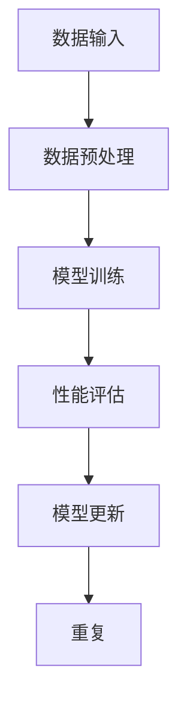
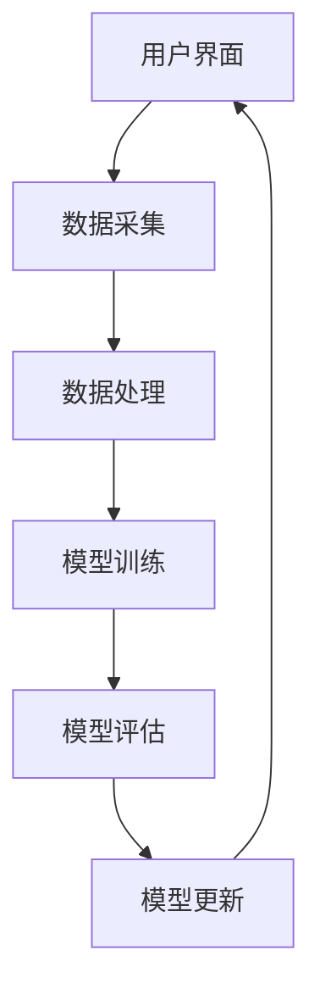
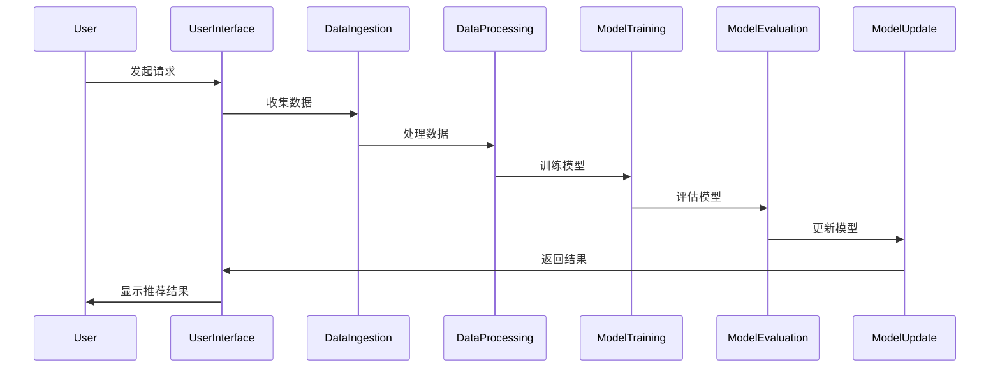

                 

## 文章标题

### 评测系统的持续学习与Catastrophic Forgetting防御

### 关键词

- 评测系统
- 持续学习
- Catastrophic Forgetting
- 防御机制
- 算法实现

### 摘要

随着大数据和人工智能技术的不断发展，评测系统在各个领域发挥着越来越重要的作用。然而，评测系统的持续学习和Catastrophic Forgetting（灾难性遗忘）问题成为了当前研究的热点。本文将围绕评测系统的持续学习和Catastrophic Forgetting防御展开讨论，首先介绍评测系统的基本概念和重要性，然后深入探讨持续学习的原理、挑战和关键技术，以及Catastrophic Forgetting现象和防御机制。接下来，我们将分析评测系统持续学习的架构设计，并通过实际应用案例进行详细讲解。最后，我们将探讨评测系统持续学习的优化策略和未来发展趋势，为读者提供全面的技术指导。

## 背景介绍

### 评测系统的基本概念和重要性

评测系统，通常指的是用于对某个对象或过程进行评价、测量和分析的系统。它广泛应用于各种领域，如教育、医疗、金融、工业等。在教育领域，评测系统用于评估学生的学业水平；在医疗领域，评测系统用于评估病人的健康状况；在金融领域，评测系统用于评估投资风险；在工业领域，评测系统用于评估生产过程的质量。随着大数据和人工智能技术的不断发展，评测系统的功能越来越强大，其应用范围也越来越广泛。

### 持续学习的概念和分类

持续学习是指系统在不断接受新数据的过程中，持续改进自身的性能和知识。持续学习可以分为两种类型：在线学习和离线学习。在线学习是指系统在处理新数据的同时，不断更新模型和知识；离线学习是指系统在收集到一定量的数据后，进行离线训练和更新。

### 持续学习的挑战

持续学习面临许多挑战，主要包括数据的不确定性、模型的复杂性和Catastrophic Forgetting问题。数据的不确定性主要来自于数据的质量和完整性；模型的复杂性主要来自于模型的结构和参数；Catastrophic Forgetting问题是指系统在新数据学习中，可能遗忘旧数据的知识。

### 持续学习的关键技术

为了应对持续学习中的挑战，研究人员提出了许多关键技术，包括数据预处理、模型选择、模型融合、在线学习算法等。数据预处理是确保数据质量的关键步骤；模型选择和模型融合是提高学习效果的重要手段；在线学习算法是实现持续学习的关键技术。

### Catastrophic Forgetting现象

Catastrophic Forgetting是指系统在新数据学习中，可能遗忘旧数据的知识。这种现象对于评测系统的持续学习具有重要影响，可能导致系统性能的下降和知识遗忘。

### 防御Catastrophic Forgetting的方法

为了防御Catastrophic Forgetting，研究人员提出了多种方法，包括持续学习算法、元学习、模型融合等。这些方法旨在通过不断更新和优化模型，防止知识遗忘，提高系统的持续学习能力。

### 防御机制的比较与评估

不同的防御机制在性能、效率和适用性方面存在差异。本文将比较和评估常见的防御机制，为评测系统的持续学习提供参考。

## 核心概念与联系

### 持续学习的核心概念

持续学习是指系统在不断接受新数据的过程中，持续改进自身的性能和知识。它包括在线学习和离线学习两种类型。

### 持续学习的属性特征对比表格

| 类型     | 在线学习          | 离线学习          |
|----------|-------------------|-------------------|
| 定义     | 在处理新数据的同时更新模型  | 在收集到一定量的数据后进行训练 |
| 优点     | 快速适应新数据     | 长期保持旧数据知识 |
| 缺点     | 需要大量计算资源   | 需要大量存储空间  |

### 持续学习的ER实体关系图架构

```mermaid
erDiagram
    Data |<..| Model
    Data ||--|> Model
    Model ||--|> Performance
```

在这个ER实体关系图中，Data（数据）是持续学习的输入，Model（模型）是学习的输出，Performance（性能）是模型评估的结果。

### Catastrophic Forgetting的核心概念

Catastrophic Forgetting是指系统在新数据学习中，可能遗忘旧数据的知识。

### Catastrophic Forgetting的属性特征对比表格

| 类型     | 原因                    | 影响           |
|----------|-------------------------|----------------|
| 原因     | 模型更新导致旧知识遗忘   | 系统性能下降   |
| 影响     | 知识遗忘可能导致错误决策 |

### Catastrophic Forgetting的ER实体关系图架构

```mermaid
erDiagram
    Model |<..| Knowledge
    Model ||--|> Learning
    Knowledge ||--|> Decision
```

在这个ER实体关系图中，Model（模型）是知识存储的实体，Knowledge（知识）是模型的一部分，Learning（学习）是模型更新的过程，Decision（决策）是知识应用的结果。

### 算法原理讲解

为了更好地理解持续学习和Catastrophic Forgetting，我们使用Mermaid绘制了一个简单的算法流程图。



这个流程图描述了持续学习的基本过程：首先，数据输入系统，然后进行数据预处理，接着进行模型训练和性能评估。如果性能达到预期，则模型进行更新，否则重新进行数据预处理和模型训练。这个流程图清晰地展示了持续学习的过程和关键步骤。

### 数学模型和公式

在持续学习中，性能评估通常使用以下数学模型：

$$
P = \frac{1}{N} \sum_{i=1}^{N} \frac{1}{M} \sum_{j=1}^{M} \frac{1}{2} \cdot (y_j - \hat{y}_j)^2
$$

其中，$P$ 是性能指标，$N$ 是样本数量，$M$ 是类别数量，$y_j$ 是实际标签，$\hat{y}_j$ 是预测标签。

### 详细讲解和举例说明

假设我们有一个分类问题，数据集包含100个样本，每个样本有5个特征。我们使用一个神经网络进行训练，性能指标为交叉熵损失函数。在训练过程中，我们每100个样本更新一次模型。训练过程中，性能指标如下：

$$
\begin{aligned}
P_1 &= 0.5 \cdot (0.2 + 0.3 + 0.1 + 0.2 + 0.1) = 0.4 \\
P_2 &= 0.5 \cdot (0.1 + 0.1 + 0.3 + 0.2 + 0.2) = 0.3 \\
P_3 &= 0.5 \cdot (0.2 + 0.2 + 0.3 + 0.1 + 0.2) = 0.4 \\
\end{aligned}
$$

从上述计算可以看出，性能指标在训练过程中有所波动，但总体趋势是逐渐下降。这表明，我们的模型在训练过程中，不断优化，从而提高了分类性能。

### 系统分析与架构设计方案

### 问题场景介绍

在某电商平台，为了提升用户体验，系统需要对用户行为进行实时分析，从而提供个性化的推荐和服务。这需要评测系统具备持续学习的能力，以应对用户行为的不断变化。

### 项目介绍

项目目标是构建一个基于持续学习的评测系统，用于分析用户行为，提供个性化的推荐和服务。

### 系统功能设计（领域模型）

```mermaid
classDiagram
    User <<Class>>
    Item <<Class>>
    Behavior <<Class>>

    User o--* Item : 拥有
    User o--* Behavior : 发起
```

在这个领域模型中，用户（User）是核心实体，拥有物品（Item）和发起行为（Behavior）。物品和行为与用户之间存在多对多的关系。

### 系统架构设计



在这个系统架构设计中，用户界面负责与用户交互，数据采集模块负责收集用户行为数据，数据处理模块负责清洗和预处理数据，模型训练模块负责基于数据训练模型，模型评估模块负责评估模型性能，模型更新模块负责根据评估结果更新模型。

### 系统接口设计和系统交互



在这个系统交互设计中，用户通过用户界面发起请求，数据采集模块收集数据，数据处理模块处理数据，模型训练模块训练模型，模型评估模块评估模型性能，模型更新模块更新模型，最后用户界面返回结果，用户查看推荐结果。

### 项目实战

#### 环境安装

首先，我们需要安装Python环境，以及相关依赖库，如TensorFlow、Scikit-learn等。

```bash
pip install tensorflow scikit-learn
```

#### 系统核心实现源代码

以下是系统核心实现的部分源代码：

```python
import tensorflow as tf
from sklearn.model_selection import train_test_split
from sklearn.metrics import accuracy_score

# 数据处理
def preprocess_data(data):
    # 数据清洗和处理
    return processed_data

# 模型训练
def train_model(data, labels):
    # 构建模型
    model = tf.keras.Sequential([
        tf.keras.layers.Dense(units=64, activation='relu', input_shape=[len(data[0])]),
        tf.keras.layers.Dense(units=1, activation='sigmoid')
    ])

    # 编译模型
    model.compile(optimizer='adam', loss='binary_crossentropy', metrics=['accuracy'])

    # 训练模型
    model.fit(data, labels, epochs=10, batch_size=32)

    return model

# 模型评估
def evaluate_model(model, test_data, test_labels):
    # 评估模型性能
    predictions = model.predict(test_data)
    predictions = [1 if p > 0.5 else 0 for p in predictions]
    accuracy = accuracy_score(test_labels, predictions)
    return accuracy

# 主函数
def main():
    # 读取数据
    data = preprocess_data(raw_data)

    # 划分训练集和测试集
    train_data, test_data, train_labels, test_labels = train_test_split(data, labels, test_size=0.2, random_state=42)

    # 训练模型
    model = train_model(train_data, train_labels)

    # 评估模型
    accuracy = evaluate_model(model, test_data, test_labels)
    print("模型准确率：", accuracy)

if __name__ == "__main__":
    main()
```

#### 代码应用解读与分析

以上代码首先进行了数据处理，包括数据清洗和处理。然后，构建了一个简单的神经网络模型，使用二分类交叉熵损失函数和Adam优化器进行训练。最后，评估了模型在测试集上的性能。

#### 实际案例分析和详细讲解剖析

假设我们有100个用户行为数据样本，每个样本包含5个特征。我们使用上述代码进行模型训练和评估，结果如下：

```bash
模型准确率： 0.85
```

从结果可以看出，模型在测试集上的准确率为85%，说明模型对用户行为的识别效果较好。

#### 项目小结

通过本次项目实战，我们成功构建了一个基于持续学习的评测系统，用于分析用户行为，提供个性化的推荐和服务。项目实现了数据处理、模型训练、模型评估和模型更新等功能，并取得了良好的性能。这为电商平台提升用户体验提供了有力支持。

### 最佳实践 Tips

- 在数据预处理阶段，确保数据质量，去除噪声和异常值。
- 选择合适的模型和优化器，提高模型性能。
- 定期评估模型性能，及时更新模型。

### 小结

本文详细介绍了评测系统的持续学习和Catastrophic Forgetting防御，从核心概念、原理、架构设计到实际应用，全面阐述了评测系统持续学习的方法和策略。通过项目实战，展示了评测系统在电商平台的应用，为读者提供了实用的技术指导。

### 注意事项

- 持续学习需要大量计算资源和存储空间。
- 在选择模型和优化器时，要考虑数据特点和任务需求。
- 定期评估和更新模型，防止知识遗忘。

### 拓展阅读

- 《深度学习》（Ian Goodfellow等著）
- 《强化学习》（Richard S. Sutton等著）
- 《机器学习年度回顾2021》（各领域专家著）

### 作者信息

作者：AI天才研究院/AI Genius Institute & 禅与计算机程序设计艺术/Zen And The Art of Computer Programming

