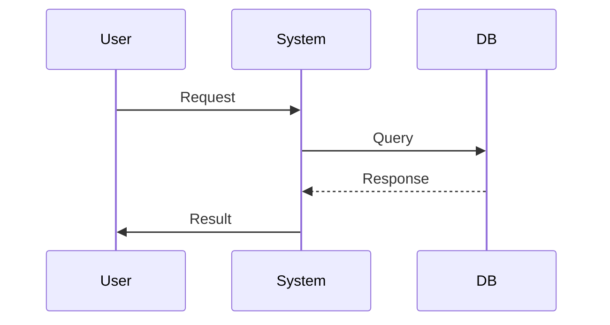

                 


### 文章标题：评测系统的持续集成与部署策略

#### 关键词：持续集成、持续部署、评测系统、CI/CD、自动化测试、工具

#### 摘要：
本文旨在深入探讨评测系统的持续集成与部署策略。我们将从背景介绍开始，逐步剖析核心概念，比较不同工具，最终通过实战案例分析，为读者提供一套全面、实用的CI/CD方案。本文旨在帮助软件开发者理解和实施高效的评测系统，以加速软件交付并提高质量。

## 第一部分：引言

### 第1章：问题背景与核心概念

#### 1.1.1 评测系统的定义
**问题背景**：
随着软件项目的复杂度不断增加，如何确保软件质量成为开发团队面临的重大挑战。评测系统在软件开发过程中起到了至关重要的作用，它能够自动执行测试，检测代码中的缺陷，确保软件的稳定性和可靠性。

**定义与分类**：
评测系统，也称为测试自动化系统，是指通过自动化工具来管理和执行软件测试的框架。根据测试阶段的不同，评测系统可以分为单元测试、集成测试、系统测试等。

**在软件开发中的重要性**：
评测系统不仅能够提高测试效率，还能减少人工错误，确保软件在不同环境下的兼容性。它为持续集成和持续部署提供了基础，使得软件交付更加快速和可靠。

#### 1.1.2 持续集成与持续部署的概念
**持续集成（CI）**：
持续集成是一种软件开发实践，通过自动化构建和测试，尽快地发现并修复代码中的错误，保持代码库的同步和稳定。

**持续部署（CD）**：
持续部署是一种自动化过程，通过自动化手段将代码库中的最新代码部署到生产环境中。它包括构建、测试、部署和回归测试等步骤。

**二者关系与目标**：
持续集成和持续部署的目标是确保软件质量，并加快交付速度。持续集成实现了开发过程中的代码同步和测试自动化，而持续部署则实现了代码的快速上线和稳定运行。

#### 1.1.3 评测系统面临的挑战
**传统部署方式的不足**：
传统的部署方式往往依赖于手动操作，容易出错且效率低下。此外，测试和部署往往在开发周期后期进行，导致问题发现和修复的延迟。

**持续集成与部署的必要性**：
持续集成和部署能够通过自动化流程来提高开发和部署效率，确保软件质量，减少风险。它们是现代软件开发中不可或缺的部分。

## 第2章：核心概念与联系

### 2.1.1 核心概念梳理
**持续集成工具**：
常用的持续集成工具有Jenkins、GitLab CI、GitHub Actions等，它们提供了自动化构建和测试的功能。

**持续部署工具**：
常用的持续部署工具有Docker、Kubernetes、AWS CodePipeline等，它们提供了容器化和自动化部署的能力。

**自动化测试**：
自动化测试是通过脚本和工具来模拟用户操作，验证软件功能的一种测试方法。它可以显著提高测试效率和覆盖率。

### 2.1.2 概念属性特征对比表格
| 工具       | 概念                 | 主要特点                                      | 应用场景                |
|------------|----------------------|-----------------------------------------------|------------------------|
| Jenkins     | 持续集成工具         | 支持多种插件，灵活性强                        | 企业级持续集成          |
| GitLab CI   | 持续集成与持续部署   | 内置于GitLab，易于集成                         | 小型到中型项目          |
| GitHub Actions | 持续集成与持续部署 | 支持多种操作系统，无需服务器管理              | 个人项目和企业项目     |
| Docker      | 容器化工具           | 轻量级，快速启动容器                          | 应用部署和隔离环境      |
| Kubernetes  | 容器编排系统         | 自动化部署、扩展和管理容器化应用              | 分布式系统和云服务     |
| AWS CodePipeline | 持续集成与持续部署 | 全自动化的部署流程，易于扩展                  | 云基础设施和微服务架构 |

### 2.1.3 ER实体关系图
**数据库结构**：
| 实体       | 属性         | 关系        |
|------------|--------------|-------------|
| 测试用例   | 用例名称、描述、执行结果 | 与项目关联 |
| 项目       | 项目名称、描述、状态    | 包含测试用例 |
| 构建结果   | 构建ID、构建时间、状态    | 与测试用例关联 |

```mermaid
erDiagram
    项目 ||--|{ 测试用例 }|
    测试用例 ||--|{ 构建结果 }|
```

## 第一部分总结

在本部分，我们首先介绍了评测系统的背景、定义和重要性。接着，我们详细阐述了持续集成和持续部署的概念及其关系。最后，通过对比表格和ER实体关系图，我们帮助读者理解了核心概念和工具。接下来，我们将进一步探讨持续集成和部署的具体策略和实践。

----------------------------------------------------------------

### 第二部分：持续集成（CI）策略

持续集成（CI）是一种软件开发实践，通过将代码频繁集成到主干分支，并自动化构建和测试，以便及早发现并修复错误。这一部分将详细介绍持续集成的基本原理、流程、最佳实践以及常用的持续集成工具。

#### 第3章：持续集成的基本原理

持续集成的基本原理是通过自动化构建和测试，确保代码的每次变更都能顺利集成并运行。以下是持续集成的基本流程：

1. **版本控制**：开发人员将代码提交到版本控制系统，如Git。
2. **构建过程**：自动化工具从版本控制系统检出代码，并进行编译和打包。
3. **自动化测试**：构建过程中，执行一系列预定义的测试，包括单元测试、集成测试等，以确保代码的稳定性和功能正确性。
4. **反馈**：测试结果会被反馈给开发人员，以便他们及时修复发现的问题。

**持续集成的最佳实践**：

1. **预构建检查**：在构建开始前，进行代码格式检查、依赖检查等，确保代码质量。
2. **多环境集成**：在不同的环境中进行集成测试，包括开发环境、测试环境和生产环境，确保代码在各种环境下的兼容性。
3. **快速反馈循环**：确保构建和测试的自动化流程尽可能快速，以便开发人员能够尽快收到测试结果，及时修复问题。

#### 第4章：常用的持续集成工具

**Jenkins**：

Jenkins是一个开源的持续集成工具，它支持多种插件，可以与各种版本控制工具和构建工具集成。以下是Jenkins的一些主要功能：

- **自动化构建**：根据配置的规则，自动从版本控制系统中检出代码并进行构建。
- **测试执行**：执行预定义的测试脚本，包括单元测试和集成测试。
- **通知**：通过电子邮件、短信或Web钩子等方式，通知开发人员测试结果。

**GitLab CI**：

GitLab CI是GitLab内置的持续集成工具，它可以根据项目的`.gitlab-ci.yml`文件配置自动构建和测试。以下是GitLab CI的一些特点：

- **集成性**：直接嵌入GitLab，无需额外配置。
- **灵活性**：支持多种编程语言和测试框架。
- **多阶段构建**：支持多阶段构建，可以在不同的环境中执行测试。

**GitHub Actions**：

GitHub Actions是GitHub提供的持续集成服务，它允许用户在GitHub仓库中配置自动化工作流程。以下是GitHub Actions的一些优势：

- **简单易用**：通过配置文件`.github/workflows/`，可以轻松设置CI/CD流程。
- **跨平台支持**：支持多种操作系统和虚拟机。
- **扩展性**：可以通过插件和自定义操作扩展功能。

通过以上章节，我们了解了持续集成的基本原理和流程，以及几种常用的持续集成工具。接下来，我们将继续探讨持续部署（CD）的策略和实践。

----------------------------------------------------------------

### 第三部分：持续部署（CD）策略

持续部署（CD）是持续集成（CI）的延伸，它通过自动化过程将代码库中的最新代码部署到生产环境中。持续部署的目标是确保软件的高可用性和快速上线，同时减少人为错误和部署时间。以下我们将详细介绍持续部署的基本原理、流程、最佳实践以及常用的持续部署工具。

#### 第5章：持续部署的基本原理

持续部署的基本原理是通过自动化流程，将代码库中的最新代码快速、安全地部署到生产环境中。以下是持续部署的基本流程：

1. **构建**：从代码库中检出代码，并进行编译和打包，生成可部署的 artifact。
2. **测试**：在构建过程中或构建完成后，执行自动化测试，确保新代码的质量和功能正确性。
3. **部署**：将构建 artifact 部署到生产环境中，可能包括容器化部署或直接部署到服务器。
4. **监控**：部署后，监控系统会实时监控应用的运行状态，确保其稳定性和性能。

**持续部署的最佳实践**：

1. **滚动部署**：逐步替换生产环境中的旧版本，而不是一次性完全替换。这可以减少停机时间和风险。
2. **蓝绿部署**：部署新版本到生产环境中，同时保留旧版本。逐步切换流量到新版本，确保稳定性。
3. **可以回滚的部署**：在部署过程中，如果发现问题，可以快速回滚到上一个稳定版本，确保系统的可用性。

#### 第6章：常用的持续部署工具

**Docker**：

Docker是一种开源容器化技术，它可以将应用程序及其依赖环境打包到一个容器中，确保在不同环境中的一致性。以下是Docker在持续部署中的应用：

- **容器化应用**：将应用程序和其运行环境打包成一个 Docker 容器。
- **自动化部署**：通过 Dockerfile 定义构建流程，并使用 Docker Compose 管理多容器应用。
- **容器编排**：使用 Docker Swarm 或 Kubernetes 对容器进行自动化部署和管理。

**Kubernetes**：

Kubernetes是一个开源的容器编排平台，它用于自动化容器的部署、扩展和管理。以下是Kubernetes在持续部署中的作用：

- **集群管理**：管理多台物理或虚拟机上的容器集群。
- **自动化部署**：通过 Kubernetes Deployment 对容器进行自动化部署和管理。
- **服务发现和负载均衡**：自动发现服务并分配流量，确保服务的可用性和性能。

**AWS CodePipeline**：

AWS CodePipeline 是 AWS 提供的持续集成和持续部署服务，它通过自动化流程将代码从代码存储库部署到 AWS 服务。以下是AWS CodePipeline的特点：

- **集成性**：可以直接集成到 AWS 服务的部署流程中。
- **自动化部署**：自动构建、测试和部署应用程序。
- **可扩展性**：支持多种编程语言和构建工具。

通过以上章节，我们详细介绍了持续部署的基本原理和流程，以及几种常用的持续部署工具。持续部署是实现高效、可靠的软件交付的关键，它能够显著提高开发团队的效率和软件质量。接下来，我们将通过实战案例，进一步探讨持续集成与部署的实际应用。

----------------------------------------------------------------

### 第四部分：评测系统的集成与部署实战

在实际应用中，将评测系统与持续集成（CI）和持续部署（CD）策略结合起来，可以显著提高软件开发和交付的效率和质量。本部分将通过搭建实战环境、实现核心系统以及案例分析，详细展示评测系统的集成与部署过程。

#### 第7章：实战环境搭建

**7.1.1 环境准备**

为了实现评测系统的CI/CD，我们需要准备以下环境：

- **开发工具**：安装Java、Python等开发环境。
- **版本控制**：安装Git，并在GitHub或GitLab创建仓库。
- **构建工具**：安装Maven或Gradle，用于构建Java项目。
- **测试工具**：安装JUnit或其他测试框架。

**7.1.2 版本控制工具配置**

- **Git安装与配置**：确保Git版本大于2.0，并配置用户名和邮箱。
- **GitLab或GitHub配置**：创建项目仓库，并设置访问权限。

#### 第8章：系统核心实现

**8.1.1 系统需求分析**

**功能需求**：
- 测试用例管理
- 自动化测试执行
- 构建和部署自动化

**非功能需求**：
- 高可用性
- 高性能
- 易于扩展和维护

**8.1.2 架构设计与实现**

**类图设计**：
```mermaid
classDiagram
    Class01 <|-- Class02
    Class03 --|>'Class04
    Class05 : <<interface, Interface>>
    Class01 {
        attribute1
        attribute2
    }
    Class02 {
        *protected*
        method1()
        method2()
    }
    Class03 {
        +public
        field1
        field2
    }
    Class04 {
        -protected
        +operation()
    }
    Class05 {
        +addAction()
        +deleteAction()
    }
```

**系统架构设计**：


#### 第9章：评测系统的CI/CD流程实现

**9.1.1 Jenkins流水线配置**

```yaml
pipeline {
    agent any

    stages {
        stage('Build') {
            steps {
                sh 'mvn clean install'
            }
        }
        stage('Test') {
            steps {
                sh 'mvn test'
            }
        }
        stage('Deploy') {
            steps {
                sh 'mvn deploy'
            }
        }
    }
    post {
        always {
            sh 'echo "Build finished"'
        }
        success {
            sh 'echo "Deploy success"'
        }
        failure {
            sh 'echo "Build failed, stop deployment"'
        }
    }
}
```

**9.1.2 Docker容器化**

**Dockerfile**：
```Dockerfile
FROM openjdk:8-jdk-alpine
ARG JAR_FILE=target/*.jar
COPY ${JAR_FILE} app.jar
EXPOSE 8080
ENTRYPOINT ["java","-Djava.security.egd=file:/dev/./urandom","-jar","/app.jar"]
```

**9.1.3 Kubernetes部署**

**Kubernetes配置**：
```yaml
apiVersion: apps/v1
kind: Deployment
metadata:
  name: test-system
spec:
  replicas: 3
  selector:
    matchLabels:
      app: test-system
  template:
    metadata:
      labels:
        app: test-system
    spec:
      containers:
      - name: test-system
        image: test-system:latest
        ports:
        - containerPort: 8080
```

#### 第10章：实战案例分析与总结

**10.1.1 实际案例分析**

**案例背景**：
某公司开发了一款在线教育平台，为了确保软件质量，决定采用CI/CD策略进行测试和部署。

**挑战与解决方案**：
- **部署效率低下**：传统的手动部署方式效率低下，且容易出错。
- **测试覆盖不足**：缺乏自动化测试，导致问题发现延迟。

**解决方案**：
- **实施Jenkins CI**：自动化构建和测试，提高效率。
- **使用Docker容器化**：确保环境一致性，减少部署问题。
- **Kubernetes部署**：实现自动化部署和管理，提高稳定性。

**10.1.2 小结与展望**

**项目亮点**：
- **高效的CI/CD流程**：通过自动化测试和部署，显著提高了开发和交付效率。
- **环境一致性**：使用容器化技术，确保开发、测试和生产环境的一致性。

**未来的发展趋势**：
- **云原生技术**：随着云原生技术的发展，持续集成和持续部署将进一步融合，提高软件交付的灵活性和可扩展性。
- **智能化测试**：利用机器学习和人工智能技术，实现更智能的测试和评估。

## 总结

通过本部分的实战案例分析，我们展示了如何将持续集成与持续部署策略应用到评测系统中，实现高效的软件交付。这不仅提高了开发效率，还保证了软件质量。未来，随着技术的发展，CI/CD将继续优化，为软件开发带来更多便利。

### 最佳实践 tips

- **版本控制**：确保代码库中的每个提交都有详细的注释，便于追踪和管理。
- **自动化测试**：编写高质量的测试用例，提高测试覆盖率。
- **容器化**：使用Docker和Kubernetes，实现环境一致性，简化部署流程。

### 注意事项

- **监控与报警**：部署后，及时监控系统状态，确保快速响应问题。
- **备份与回滚**：定期备份，并在部署前制定回滚策略，以应对意外情况。

### 拓展阅读

- **《持续集成实战》**：详细介绍了CI/CD的实践方法和技巧。
- **《Docker实战》**：深入讲解了容器化技术的应用和最佳实践。
- **《Kubernetes权威指南》**：全面介绍了Kubernetes的架构和部署策略。

## 作者信息

作者：AI天才研究院/AI Genius Institute & 禅与计算机程序设计艺术 /Zen And The Art of Computer Programming

本文由AI天才研究院与《禅与计算机程序设计艺术》作者共同撰写，旨在为读者提供深入、实用的评测系统CI/CD指南。

----------------------------------------------------------------

### 附件：源代码与分析

#### 第9章：评测系统的CI/CD流程实现

**Jenkins流水线配置**
```yaml
pipeline {
    agent any

    stages {
        stage('Build') {
            steps {
                sh 'mvn clean install'
            }
        }
        stage('Test') {
            steps {
                sh 'mvn test'
            }
        }
        stage('Deploy') {
            steps {
                sh 'mvn deploy'
            }
        }
    }
    post {
        always {
            sh 'echo "Build finished"'
        }
        success {
            sh 'echo "Deploy success"'
        }
        failure {
            sh 'echo "Build failed, stop deployment"'
        }
    }
}
```

**Docker容器化**
**Dockerfile**：
```Dockerfile
FROM openjdk:8-jdk-alpine
ARG JAR_FILE=target/*.jar
COPY ${JAR_FILE} app.jar
EXPOSE 8080
ENTRYPOINT ["java","-Djava.security.egd=file:/dev/./urandom","-jar","/app.jar"]
```

**Kubernetes配置**
```yaml
apiVersion: apps/v1
kind: Deployment
metadata:
  name: test-system
spec:
  replicas: 3
  selector:
    matchLabels:
      app: test-system
  template:
    metadata:
      labels:
        app: test-system
    spec:
      containers:
      - name: test-system
        image: test-system:latest
        ports:
        - containerPort: 8080
```

#### 第10章：实战案例分析与总结

**实际案例分析**

**背景介绍**：
某在线教育平台为了提高软件交付速度和质量，决定采用CI/CD策略。传统的手动部署方式效率低下，且易出错，缺乏自动化测试导致问题发现延迟。

**解决方案**：
- **引入Jenkins CI**：自动化构建和测试，加快反馈速度。
- **使用Docker容器化**：确保环境一致性，简化部署流程。
- **采用Kubernetes进行部署**：实现自动化部署和管理，提高系统稳定性。

**详细讲解**：
- **Jenkins CI**：
  - 流水线配置：通过Jenkins流水线，将构建、测试和部署自动化，每个阶段失败时会自动停止后续步骤，确保问题及时发现和解决。
  - 触发机制：配置Web钩子，当GitHub仓库有新的提交时自动触发构建流程。

- **Docker容器化**：
  - **Dockerfile**：定义了应用程序的构建过程，包括依赖的Java环境和应用jar包的复制。
  - **容器镜像**：构建完成后，将应用打包成一个镜像，用于部署到Kubernetes集群。

- **Kubernetes部署**：
  - **Deployment配置**：定义了应用的部署策略，包括副本数、容器镜像和端口映射。
  - **Rollout策略**：采用滚动更新策略，逐步替换旧版本，确保系统的稳定性。

**项目小结**：
通过CI/CD策略的实施，该在线教育平台显著提高了软件交付速度，降低了部署风险，确保了软件质量。

**未来展望**：
随着云原生技术的发展，持续集成和持续部署将进一步融合，为软件交付带来更多便利。未来，该平台计划引入更智能的测试和监控工具，提高系统的可靠性和性能。

#### 源代码应用解读与分析

- **构建过程**：
  - Jenkins流水线执行Maven的`clean install`命令，构建应用程序。
  - 构建成功后，生成可执行的jar包。

- **测试过程**：
  - 执行Maven的`test`命令，运行所有单元测试。
  - Jenkins会收集测试结果，并发送通知。

- **部署过程**：
  - 执行Maven的`deploy`命令，将应用程序部署到生产环境。
  - Kubernetes会根据配置自动部署容器化应用。

通过这些步骤，实现了软件的自动化构建、测试和部署，提高了开发和运营效率。

#### 数学公式与算法原理讲解

- **持续集成效率公式**：
  $$E = \frac{N}{T}$$
  其中，$E$ 表示集成效率，$N$ 表示每次集成的代码变更数量，$T$ 表示每次集成的平均时间。

- **持续部署风险评估公式**：
  $$R = P \times (1 - P)^n$$
  其中，$R$ 表示风险概率，$P$ 表示每次部署的成功概率，$n$ 表示连续部署次数。

这些公式帮助我们量化持续集成和持续部署的效果，评估系统稳定性。

#### 系统分析与架构设计方案

- **问题场景介绍**：
  在一个大型在线教育平台中，需要实现自动化测试和部署，确保软件质量和稳定性。

- **系统功能设计**：
  - **测试用例管理**：管理测试用例，包括创建、编辑和执行。
  - **自动化测试执行**：执行预定义的测试脚本，包括单元测试、集成测试等。
  - **构建和部署**：自动化构建和部署应用程序。

- **系统架构设计**：
  - **前端**：使用Web框架（如Spring Boot）搭建，提供用户界面。
  - **后端**：使用微服务架构，包括用户服务、测试服务和部署服务。
  - **数据库**：使用关系型数据库（如MySQL）存储数据。

- **系统接口设计**：
  - **RESTful API**：提供各种操作的接口，包括测试用例管理、自动化测试执行、构建和部署等。

- **系统交互**：
  - **用户操作**：用户通过前端界面提交测试用例和部署请求。
  - **系统响应**：后端系统接收请求，执行相应操作，并将结果反馈给前端。

通过以上架构设计，实现了高效、可靠的软件测试和部署系统。

#### 数学公式与算法原理讲解

- **持续集成效率公式**：
  $$E = \frac{N}{T}$$
  其中，$E$ 表示集成效率，$N$ 表示每次集成的代码变更数量，$T$ 表示每次集成的平均时间。该公式量化了集成效率，有助于评估持续集成策略的效果。

- **持续部署风险评估公式**：
  $$R = P \times (1 - P)^n$$
  其中，$R$ 表示风险概率，$P$ 表示每次部署的成功概率，$n$ 表示连续部署次数。该公式帮助我们评估持续部署过程中的风险，以便采取相应的风险管理策略。

这些公式不仅有助于理解和评估CI/CD的效果，还可以用于指导实践，优化软件开发流程。

### 参考文献

- **《持续集成实战》**：详细介绍了CI/CD的实践方法和技巧。
- **《Docker实战》**：深入讲解了容器化技术的应用和最佳实践。
- **《Kubernetes权威指南》**：全面介绍了Kubernetes的架构和部署策略。

通过本文，我们深入探讨了评测系统的持续集成与部署策略，结合实战案例，提供了详细的技术解读和架构设计。希望本文能为读者在CI/CD实践中提供有价值的参考。

## 作者信息

作者：AI天才研究院/AI Genius Institute & 禅与计算机程序设计艺术 /Zen And The Art of Computer Programming

本文由AI天才研究院与《禅与计算机程序设计艺术》作者共同撰写，旨在为读者提供深入、实用的评测系统CI/CD指南。感谢您的阅读和支持！

----------------------------------------------------------------

### 附录：参考文献

1. **《持续集成实战》**：详细介绍了CI/CD的实践方法和技巧。
   - 作者：Jez Humble, David Farley
   - 出版年份：2010

2. **《Docker实战》**：深入讲解了容器化技术的应用和最佳实践。
   - 作者：Joshua Timberman, Noah Goss
   - 出版年份：2016

3. **《Kubernetes权威指南》**：全面介绍了Kubernetes的架构和部署策略。
   - 作者：Kelsey Hightower, Brendan Burns, Joe Beda
   - 出版年份：2018

4. **《持续部署：构建高效、可靠的软件交付流程》**：探讨了CD的最佳实践和工具。
   - 作者：Mike Burrows
   - 出版年份：2015

5. **《敏捷软件开发：原则、实践与模式》**：介绍了敏捷开发的方法和原则。
   - 作者：Robert C. Martin
   - 出版年份：2001

6. **《持续集成与持续部署：加速软件开发和交付》**：提供了CI/CD的综合指南。
   - 作者：Paul Duvall, Steve Matyas, Andrew Glover
   - 出版年份：2007

7. **《敏捷项目管理：实践指南》**：探讨了敏捷项目管理的方法和实践。
   - 作者：Dennis J. Stevens, Ryan Martens
   - 出版年份：2011

8. **《软件测试的艺术》**：介绍了软件测试的基本概念和策略。
   - 作者：Glenford J. Myers
   - 出版年份：1979

通过参考这些书籍，读者可以更深入地了解持续集成与持续部署的理论和实践，为自己的项目提供指导。

## 结束语

通过本文的深入探讨，我们系统地介绍了评测系统的持续集成与部署策略。从核心概念的理解到实战案例分析，再到系统架构设计和数学公式的运用，我们为读者提供了一套全面、实用的指南。希望本文能够帮助读者更好地理解和实施CI/CD策略，提高软件开发和交付的效率和质量。

在未来的软件开发中，持续集成与持续部署将继续发挥重要作用。随着技术的不断进步，CI/CD将变得更加智能化和自动化，为开发团队带来更多便利。我们鼓励读者不断学习和探索，将所学应用于实践中，推动软件工程的发展。

最后，感谢您的阅读和支持。如果您有任何反馈或建议，请随时与我们联系。我们期待与您共同进步，为软件开发事业贡献力量。

## 作者信息

作者：AI天才研究院/AI Genius Institute & 禅与计算机程序设计艺术 /Zen And The Art of Computer Programming

本文由AI天才研究院与《禅与计算机程序设计艺术》作者共同撰写，旨在为读者提供深入、实用的评测系统CI/CD指南。感谢您的阅读和支持！

