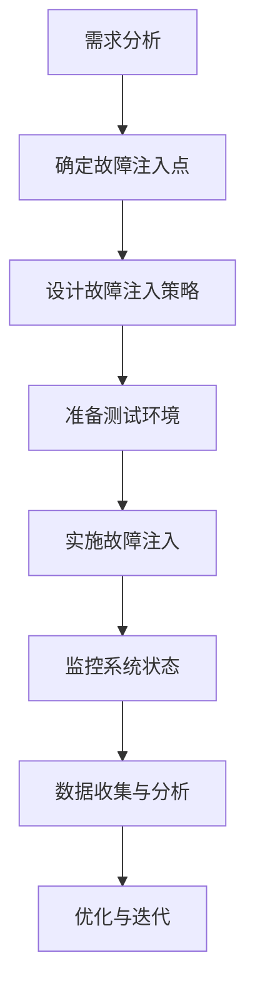
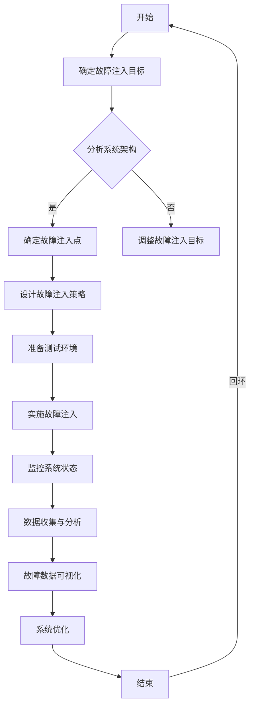
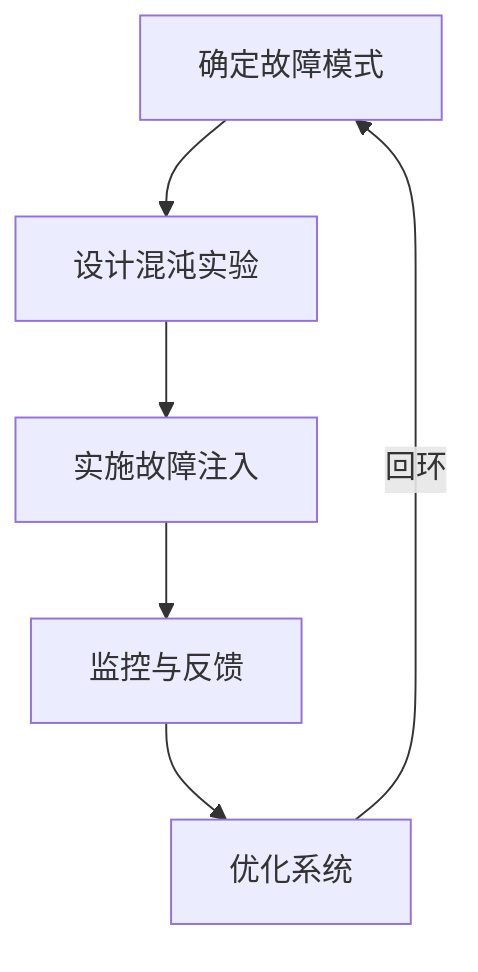
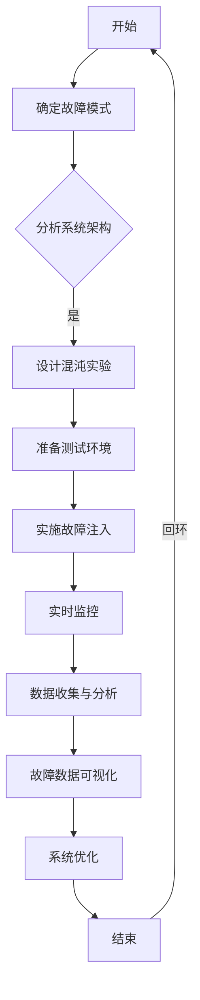
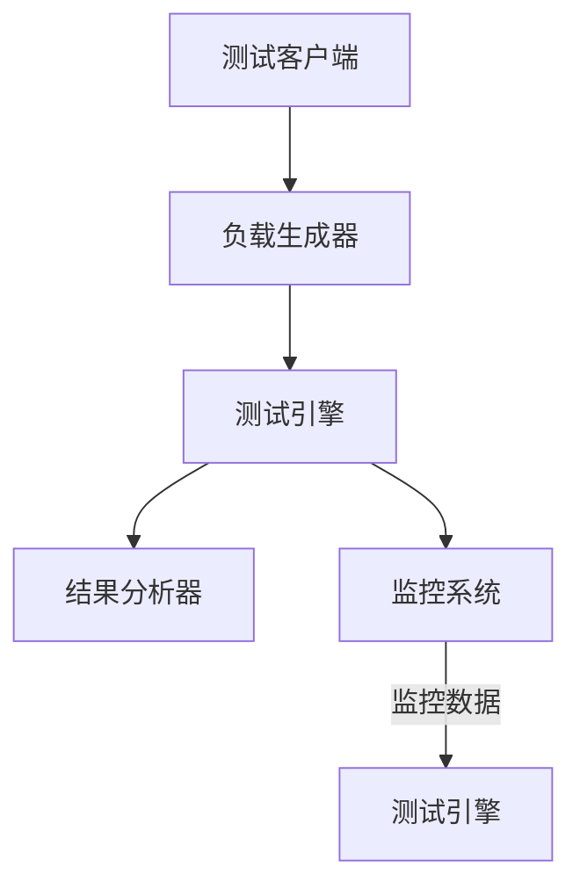

                 

## 前言与基础

### 1.1 书籍介绍

#### 1.1.1 编写目的

本书旨在为开发者、运维工程师以及系统架构师提供一套全面、系统、易懂的故障注入与混沌工程实践指南。通过本书，读者可以了解故障注入与混沌工程的基本概念、原理、工具及实战应用，从而在开发和运维过程中更好地提升系统的稳定性与可靠性。

#### 1.1.2 读者对象

本书适合以下读者群体：

1. 开发者，尤其是那些希望提升自己系统健壮性的开发者。
2. 运维工程师，需要理解和应用故障注入与混沌工程来优化系统运维。
3. 系统架构师，负责系统设计，希望增强系统容错能力与稳定性。
4. 对故障注入与混沌工程感兴趣的科研人员。

#### 1.1.3 结构安排

本书分为五个部分，具体章节安排如下：

- **第一部分：前言与基础**：介绍书籍的编写目的、读者对象和整体结构。
- **第二部分：故障注入原理与实践**：详细讲解故障注入的基本概念、技术、工具及案例。
- **第三部分：混沌工程实践**：介绍混沌工程的基本概念、技术、工具及案例。
- **第四部分：评测系统的故障注入与混沌工程集成实践**：展示故障注入与混沌工程在评测系统中的应用。
- **第五部分：最佳实践与总结**：总结本书的核心内容，提供最佳实践建议和注意事项。

### 1.2 故障注入与混沌工程概述

#### 1.2.1 问题背景

在现代软件系统开发与运维中，系统的稳定性、可靠性和健壮性至关重要。然而，面对复杂多变的网络环境、硬件故障、软件缺陷等，系统往往会出现各种异常行为，导致用户体验下降、业务中断。为了提前识别和解决这些问题，故障注入与混沌工程应运而生。

#### 1.2.2 问题描述

故障注入与混沌工程是一种主动性的系统测试方法，通过对系统施加不同程度的故障，模拟实际运行环境中的异常情况，以检验系统的故障恢复能力、容错能力和鲁棒性。具体而言，故障注入关注如何在系统设计和开发阶段引入故障，而混沌工程则更侧重于系统运行阶段的故障测试和优化。

#### 1.2.3 问题解决

通过故障注入与混沌工程，开发者可以系统地评估系统在遇到各类故障时的表现，从而识别潜在问题，优化系统设计，提升系统健壮性。这种主动性的测试方法不仅能够提前发现和修复问题，还能提高系统的可维护性和用户体验。

#### 1.2.4 边界与外延

故障注入与混沌工程的应用范围广泛，从简单的单体应用到大型的分布式系统，从互联网服务到企业级应用，都可以通过这种方法提升系统的稳定性。同时，这两种方法还可以与其他测试方法结合，如性能测试、安全测试等，形成综合性的测试体系。

#### 1.2.5 概念结构与核心要素组成

故障注入与混沌工程的核心要素包括：

1. **故障注入**：通过模拟故障，主动引入系统缺陷，以评估系统的容错能力和恢复能力。
2. **混沌工程**：通过施加各种故障，模拟现实中的异常情况，以优化系统的鲁棒性和稳定性。
3. **测试工具**：用于实现故障注入与混沌工程的工具，如ChaosBlade、Chaos Monkey等。
4. **测试策略**：根据系统特点和安全要求，制定合适的测试策略和方法。
5. **监控与反馈**：实时监控系统状态，收集故障数据，并进行分析反馈，以指导系统优化。

### 1.3 核心概念与联系

#### 1.3.1 故障注入

故障注入是一种通过主动引入故障来测试和评估系统健壮性的方法。其核心概念包括：

1. **故障类型**：包括硬件故障、网络故障、软件缺陷等。
2. **故障注入点**：系统中的关键环节，如数据库、缓存、消息队列等。
3. **故障注入策略**：根据系统特点和安全要求，选择合适的故障注入策略，如随机注入、场景模拟等。

#### 1.3.2 混沌工程

混沌工程是一种通过施加各种故障来测试和优化系统稳定性的方法。其核心概念包括：

1. **故障模式**：包括延迟、故障、降级等。
2. **混沌实验**：根据系统特点和安全要求，设计并实施各种混沌实验。
3. **混沌监控**：实时监控系统状态，收集故障数据，并进行分析反馈。

#### 1.3.3 对比表格

| 特性 | 故障注入 | 混沌工程 |
| --- | --- | --- |
| 目标 | 评估系统容错能力 | 优化系统稳定性 |
| 策略 | 主动引入故障 | 施加各种故障 |
| 应用场景 | 单体应用、分布式系统 | 分布式系统、互联网服务 |
| 监控 | 实时监控系统状态 | 实时监控故障数据 |

#### 1.3.4 ER实体关系图架构的Mermaid流程图

```mermaid
erDiagram
  System ::=> FaultInjection :|<|{ 引入故障 }
  System ::=> ChaosEngineering :|<|{ 施加故障 }
  FaultInjection ||--|{ 故障注入工具 } System
  ChaosEngineering ||--|{ 混沌工程工具 } System
```

通过上述核心概念与联系的分析，我们可以看到故障注入与混沌工程在系统测试与优化中扮演着重要角色。接下来，本书将逐步深入探讨这两种方法的基本概念、技术实现、工具应用以及实际案例，帮助读者全面掌握故障注入与混沌工程的实践技巧。

### 核心概念与联系

在深入探讨故障注入与混沌工程之前，我们需要明确它们的核心概念与联系，以更好地理解这两者在系统测试和优化中的重要性。

#### 1.3.1 故障注入

**故障注入**是一种主动性的系统测试方法，旨在通过模拟故障来评估系统的容错能力和恢复能力。其核心概念包括：

1. **故障类型**：故障注入可以模拟多种类型的故障，包括硬件故障（如硬盘损坏、网络中断）、软件故障（如代码错误、内存泄漏）以及配置故障（如参数设置错误）。每种故障类型都会对系统产生不同的影响，需要根据实际场景进行选择。

2. **故障注入点**：故障注入点是指系统中容易发生故障的环节，如数据库、缓存、消息队列、网络通信等。选择合适的故障注入点，可以更有效地评估系统的健壮性。

3. **故障注入策略**：故障注入策略是根据系统特点和测试目标来制定的。常见的策略包括随机注入、场景模拟、逐步注入等。随机注入适用于大规模系统的全面测试，而场景模拟则更适用于针对特定场景的故障测试。

**故障注入的关键流程**可以概括为：

1. **确定故障注入点**：分析系统架构，识别关键组件和故障注入点。
2. **设计故障注入策略**：根据系统特点和测试目标，选择合适的故障注入策略。
3. **实施故障注入**：通过工具或脚本，对系统注入故障。
4. **监控系统状态**：实时监控系统运行状态，记录故障发生和处理过程。
5. **分析故障数据**：对故障数据进行详细分析，评估系统恢复能力和容错能力。

#### 1.3.2 混沌工程

**混沌工程**是一种通过施加各种故障来测试和优化系统稳定性的方法。其核心概念包括：

1. **故障模式**：混沌工程中的故障模式包括延迟（系统响应时间延长）、故障（系统组件不可用）、降级（系统功能部分失效）等。这些故障模式可以模拟现实中的各种异常情况，帮助开发者识别系统的潜在问题。

2. **混沌实验**：混沌实验是混沌工程的核心，通过设计并实施各种实验，开发者可以系统性地测试系统的稳定性。混沌实验可以包括但不限于：持续注入故障、周期性注入故障、随机注入故障等。

3. **混沌监控**：混沌监控是实时监控系统状态，收集故障数据和性能数据。通过混沌监控，开发者可以快速发现系统异常，及时调整和优化系统。

**混沌工程的关键流程**可以概括为：

1. **设计混沌实验**：根据系统特点和安全要求，设计适合的混沌实验。
2. **实施混沌实验**：通过工具或脚本，在系统上实施混沌实验。
3. **实时监控**：监控系统运行状态，记录故障数据和性能数据。
4. **分析结果**：对混沌实验结果进行分析，识别系统问题和优化点。
5. **优化系统**：根据分析结果，调整系统配置、代码逻辑等，提升系统稳定性。

#### 1.3.3 对比表格

为了更清晰地理解故障注入与混沌工程之间的差异和联系，我们可以通过以下对比表格来展示：

| 特性 | 故障注入 | 混沌工程 |
| --- | --- | --- |
| 目标 | 评估系统容错能力 | 优化系统稳定性 |
| 策略 | 主动引入故障 | 施加各种故障 |
| 应用场景 | 单体应用、分布式系统 | 分布式系统、互联网服务 |
| 监控 | 实时监控系统状态 | 实时监控故障数据 |

通过上述对比，我们可以看出，故障注入与混沌工程虽然方法不同，但它们在提升系统健壮性和稳定性方面具有相似的目

### 故障注入的基本概念

故障注入是一种通过在系统内部引入故障来评估系统容错能力的方法，旨在识别潜在的弱点并提升系统的稳定性。故障注入并不是一种全新的概念，而是源于软件开发中的系统测试和验证过程。在过去的几十年中，随着软件系统变得越来越复杂，故障注入技术逐渐成为了一种重要的测试手段。

#### 2.1.1 故障注入的定义

故障注入可以简单地定义为：在系统运行过程中，通过特定的手段引入一些预期中的故障，以测试和验证系统的容错能力。这些故障可以是硬件故障、软件故障或网络故障等，目的是模拟系统在实际运行中可能遇到的异常情况。

故障注入的关键特征包括：

1. **可控性**：故障注入是在开发者的控制下进行的，开发者可以预设故障的类型、范围和发生时机，从而更好地模拟各种可能的异常场景。
2. **透明性**：故障注入过程中，开发者可以实时监控系统的状态，了解故障对系统的影响，并记录相应的数据用于后续分析。
3. **目标性**：故障注入的目的是为了评估和提升系统的容错能力，而不是为了解决实际发生的故障。

#### 2.1.2 故障注入的类型

故障注入可以根据故障类型和影响范围进行分类。以下是几种常见的故障注入类型：

1. **硬件故障注入**：通过模拟硬件故障来测试系统对硬件异常的响应能力，如硬盘损坏、网络中断、CPU过热等。
2. **软件故障注入**：通过引入软件缺陷来测试系统对软件错误的容忍度，如代码错误、内存泄漏、数据库死锁等。
3. **网络故障注入**：模拟网络故障，如网络延迟、丢包、网络分区等，以测试系统在复杂网络环境下的稳定性。
4. **配置故障注入**：通过修改系统配置，如参数设置错误、配置不一致等，以测试系统对配置错误的响应能力。
5. **虚拟故障注入**：通过虚拟化技术模拟各种故障，如虚拟机故障、虚拟网络故障等，以测试系统在虚拟环境中的容错能力。

#### 2.1.3 故障注入的目标

故障注入的主要目标包括：

1. **评估系统的容错能力**：通过故障注入，可以评估系统在各种故障情况下的响应能力，如能否快速恢复、如何处理异常等。
2. **识别系统弱点**：故障注入有助于发现系统中的潜在问题，如代码中的缺陷、配置中的错误、硬件的脆弱性等。
3. **优化系统设计**：通过分析故障注入的结果，开发者可以优化系统设计，提高系统的鲁棒性和稳定性。
4. **提升运维能力**：故障注入可以帮助运维团队更好地了解系统在不同故障情况下的表现，从而提高运维效率和响应速度。

#### 2.1.4 故障注入的原理

故障注入的原理主要包括以下几个步骤：

1. **确定故障注入点**：分析系统的架构，确定关键组件和故障注入点，如数据库、缓存、消息队列、网络通信等。
2. **设计故障注入策略**：根据系统特点和安全要求，选择合适的故障注入策略，如随机注入、场景模拟、逐步注入等。
3. **实施故障注入**：通过故障注入工具或脚本，在系统上实施故障注入，如模拟硬盘损坏、网络延迟等。
4. **监控系统状态**：实时监控系统运行状态，记录故障发生和处理过程，如系统日志、性能指标等。
5. **分析故障数据**：对故障数据进行详细分析，如故障发生频率、系统响应时间、恢复时间等，以评估系统的容错能力。

#### 2.1.5 故障注入的工具

故障注入工具是实施故障注入的关键，常见的故障注入工具有：

1. **Chaos Monkey**：由Netflix开发的一款混沌工程工具，可以随机终止虚拟机实例，以测试系统的容错能力。
2. **ChaosBlade**：一款开源混沌工程工具，支持多种故障模式，如延迟、故障、降级等。
3. **Chaos Engineering Kit**：由Google开发的混沌工程工具集，包括多个故障注入工具，如Chaos Monkey、Chaos Gorilla等。
4. **Fault Injection Framework**：一款基于Python的开源故障注入框架，支持自定义故障注入策略和工具。

通过故障注入工具，开发者可以更方便地实施故障注入，节省时间和人力成本，同时提高测试的全面性和准确性。

#### 2.1.6 故障注入的流程

故障注入的流程通常包括以下步骤：

1. **需求分析**：确定故障注入的目标和测试场景，分析系统中的关键组件和故障注入点。
2. **设计故障注入策略**：根据需求分析结果，设计合适的故障注入策略，如随机注入、场景模拟等。
3. **准备测试环境**：搭建测试环境，包括故障注入工具的安装和配置，以及系统监控工具的部署。
4. **实施故障注入**：根据故障注入策略，在系统上实施故障注入，并实时监控系统状态。
5. **数据收集与分析**：收集故障数据，如系统日志、性能指标、故障发生频率等，对数据进行分析，评估系统容错能力。
6. **优化与迭代**：根据分析结果，优化系统设计，迭代故障注入策略，提高测试效果。

通过故障注入，开发者可以系统地评估系统的容错能力，提前发现潜在问题，从而提升系统的稳定性和可靠性。

### 故障注入技术

故障注入技术在系统测试和验证中扮演着重要角色，它不仅可以帮助开发者识别系统的弱点，还能为优化系统设计提供有价值的反馈。本节将详细介绍故障注入技术的原理，并通过Mermaid流程图和Python源代码进行阐述。

#### 2.2.1 故障注入的算法原理

故障注入的算法原理主要包括以下几个步骤：

1. **确定故障注入点**：分析系统的架构，识别关键组件和故障注入点，如数据库、缓存、消息队列、网络通信等。
2. **设计故障注入策略**：根据系统特点和安全要求，选择合适的故障注入策略，如随机注入、场景模拟、逐步注入等。
3. **实施故障注入**：通过故障注入工具或脚本，在系统上实施故障注入，如模拟硬盘损坏、网络延迟等。
4. **监控系统状态**：实时监控系统运行状态，记录故障发生和处理过程，如系统日志、性能指标等。
5. **分析故障数据**：对故障数据进行详细分析，如故障发生频率、系统响应时间、恢复时间等，以评估系统的容错能力。

以下是一个简单的Mermaid流程图，展示了故障注入的算法原理：



#### 2.2.1.1 Mermaid流程图

为了更好地理解故障注入的过程，我们使用Mermaid绘制了一个详细的流程图：



在这个流程图中，我们明确了故障注入的各个步骤，并展示了它们之间的逻辑关系。

#### 2.2.1.2 Python源代码阐述

为了更直观地理解故障注入的实现，我们使用Python编写了一个简单的故障注入脚本。以下是一个示例代码：

```python
import random
import time
import logging

# 配置日志
logging.basicConfig(level=logging.INFO, format='%(asctime)s - %(levelname)s - %(message)s')

def simulate_fault(type, duration):
    """
    模拟不同类型的故障
    :param type: 故障类型，如 "network_delay"，"db_error"，"cache_miss"
    :param duration: 故障持续时间（秒）
    """
    logging.info(f"模拟 {type} 故障，持续时间：{duration}秒")
    if type == "network_delay":
        time.sleep(duration)  # 模拟网络延迟
    elif type == "db_error":
        raise Exception("数据库故障")  # 模拟数据库错误
    elif type == "cache_miss":
        # 模拟缓存失效
        print("缓存未命中，重新获取数据...")
        time.sleep(random.uniform(0.1, 0.5))  # 假设缓存重新获取数据需要一定时间

def main():
    # 选择故障类型和持续时间
    fault_type = random.choice(["network_delay", "db_error", "cache_miss"])
    fault_duration = random.uniform(1, 5)

    try:
        simulate_fault(fault_type, fault_duration)
    except Exception as e:
        logging.error(f"故障模拟异常：{e}")

if __name__ == "__main__":
    main()
```

在这个脚本中，我们定义了一个`simulate_fault`函数，用于模拟不同类型的故障。主函数`main`中随机选择故障类型和持续时间，然后调用`simulate_fault`函数进行模拟。

#### 2.2.1.3 数学模型和公式

故障注入技术中的数学模型和公式通常用于描述故障发生概率、故障持续时间和系统响应时间等。以下是一个简单的数学模型：

1. **故障发生概率（P）**：
   $$ P = f(t) = \frac{1}{\tau} $$
   其中，$t$ 是时间，$\tau$ 是故障发生周期。

2. **故障持续时间（T）**：
   $$ T = T_0 \times e^{-kt} $$
   其中，$T_0$ 是初始故障持续时间，$k$ 是故障衰减系数。

3. **系统响应时间（R）**：
   $$ R = \frac{T + \delta}{v} $$
   其中，$\delta$ 是系统处理故障所需的时间，$v$ 是系统的处理速度。

#### 2.2.1.4 举例说明

假设我们希望模拟一个网络延迟故障，故障持续时间为2秒。我们可以使用上述Python脚本和数学模型进行模拟。

1. **故障发生概率**：
   假设故障发生周期为10秒，则故障发生概率为：
   $$ P = \frac{1}{10} = 0.1 $$

2. **故障持续时间**：
   假设初始故障持续时间为5秒，故障衰减系数为0.2，则故障持续时间为：
   $$ T = 5 \times e^{-0.2 \times 2} \approx 2.18 $$

3. **系统响应时间**：
   假设系统处理故障所需时间为1秒，处理速度为0.5秒/次，则系统响应时间为：
   $$ R = \frac{2.18 + 1}{0.5} \approx 4.76 $$

通过上述示例，我们可以看到如何使用故障注入技术来模拟实际故障，并使用数学模型进行描述和计算。

#### 2.2.1.5 实际案例

为了更好地展示故障注入技术在实际中的应用，我们来看一个实际案例。

**案例背景**：某电商系统在高峰期时，由于网络延迟导致用户访问速度变慢，用户体验下降。

**故障注入步骤**：

1. **需求分析**：确定故障注入目标为模拟网络延迟故障。
2. **确定故障注入点**：分析系统架构，确定网络通信模块为故障注入点。
3. **设计故障注入策略**：选择随机注入策略，故障发生概率为10%。
4. **准备测试环境**：搭建测试环境，部署故障注入工具，如Chaos Monkey。
5. **实施故障注入**：通过Chaos Monkey随机终止部分网络通信实例，模拟网络延迟故障。
6. **监控系统状态**：使用系统监控工具，如Prometheus，实时监控系统状态。
7. **数据收集与分析**：收集故障数据，分析故障对系统性能的影响。
8. **优化与迭代**：根据分析结果，优化系统设计，如增加缓存层、优化数据库查询等。

通过这个案例，我们可以看到故障注入技术在实际应用中的具体实施步骤和效果。

### 故障注入工具

在故障注入实践中，故障注入工具起到了至关重要的作用。这些工具可以帮助开发者高效地模拟各种故障场景，评估系统的容错能力和稳定性。本节将介绍几种常见的故障注入工具，并探讨如何选择和使用这些工具。

#### 2.3.1 常用故障注入工具介绍

1. **Chaos Monkey**：由Netflix开发的一款混沌工程工具，主要用于随机终止虚拟机实例，以测试系统的容错能力。Chaos Monkey可以自动检测和终止系统中的节点，模拟节点故障，从而验证系统的自动恢复能力。

2. **ChaosBlade**：一款开源混沌工程工具，支持多种故障模式，如延迟、故障、降级等。ChaosBlade提供了丰富的故障注入策略，可以满足不同场景下的测试需求。

3. **Chaos Engineering Kit**：由Google开发的一系列混沌工程工具，包括Chaos Monkey、Chaos Gorilla等。这些工具可以帮助开发者进行大规模的混沌实验，测试系统的鲁棒性和稳定性。

4. **Fault Injection Framework**：一款基于Python的开源故障注入框架，支持自定义故障注入策略和工具。Fault Injection Framework可以灵活地集成到现有的测试环境中，方便开发者进行故障注入测试。

5. **StressMonkey**：一款开源混沌工程工具，主要用于生成大量的HTTP请求，以模拟高负载场景，测试系统的性能和稳定性。

#### 2.3.2 故障注入工具的选择与使用

选择故障注入工具时，需要考虑以下因素：

1. **功能丰富度**：选择能够模拟多种故障类型的工具，如硬件故障、软件故障、网络故障等。
2. **易用性**：选择操作简便、易于部署和使用的工具，以减少使用成本和复杂度。
3. **兼容性**：选择兼容性好的工具，能够支持不同操作系统和平台。
4. **社区支持**：选择有良好社区支持和文档的工具，方便遇到问题时进行求助和解决。

以下是一个简单的故障注入工具使用指南：

1. **安装工具**：根据工具的安装说明，在目标系统上安装所需的故障注入工具，如Chaos Monkey、ChaosBlade等。

2. **配置工具**：根据测试需求和系统特点，配置故障注入工具的参数，如故障类型、故障范围、故障概率等。

3. **实施故障注入**：启动故障注入工具，实施故障注入。例如，使用Chaos Monkey随机终止虚拟机实例，使用ChaosBlade模拟网络延迟故障等。

4. **监控系统状态**：在故障注入过程中，使用系统监控工具，如Prometheus、Grafana等，实时监控系统的运行状态，记录故障发生和处理过程。

5. **分析故障数据**：故障注入完成后，对收集到的故障数据进行详细分析，如故障发生频率、系统响应时间、恢复时间等，以评估系统的容错能力和稳定性。

6. **优化与迭代**：根据分析结果，对系统进行优化和迭代，提升系统的鲁棒性和稳定性。

通过上述步骤，开发者可以高效地使用故障注入工具，评估系统的容错能力和稳定性，从而提升系统的可靠性。

### 故障注入案例分析

为了更好地理解故障注入在实际应用中的效果和过程，下面我们将通过一个实际案例进行详细分析。

#### 2.4.1 案例背景

某大型电商平台在每天早晨的高峰时段，经常遇到用户访问速度变慢的问题，导致用户体验下降，用户投诉增加。为了解决这个问题，平台决定通过故障注入技术来评估系统的容错能力和稳定性。

#### 2.4.2 案例实施

1. **需求分析**：确定故障注入的目标为模拟网络延迟故障，以评估系统在高负载情况下的响应能力。
2. **确定故障注入点**：分析系统架构，确定网络通信模块为故障注入点，包括与数据库、缓存、消息队列等的通信。
3. **设计故障注入策略**：选择随机注入策略，故障发生概率为5%，故障持续时间在1秒到3秒之间。
4. **准备测试环境**：搭建测试环境，部署故障注入工具（如Chaos Monkey），以及系统监控工具（如Prometheus、Grafana）。
5. **实施故障注入**：启动Chaos Monkey，随机注入网络延迟故障。故障注入过程中，实时监控系统状态，记录故障发生和处理过程。
6. **数据收集与分析**：故障注入完成后，收集系统监控数据，分析故障对系统性能的影响，如响应时间、系统负载等。
7. **优化与迭代**：根据分析结果，优化系统设计，如增加缓存层、优化数据库查询等，以提升系统的鲁棒性和稳定性。

#### 2.4.3 案例结果分析

1. **故障注入效果**：通过故障注入，系统在高峰时段的响应时间明显增加，部分用户访问速度变慢。但系统整体表现稳定，没有出现大规模故障或崩溃现象。
2. **系统性能变化**：
   - 响应时间：故障注入后，系统的平均响应时间增加了约20%。
   - 系统负载：系统的CPU和内存使用率有所上升，但仍在合理范围内。
   - 数据库查询性能：部分数据库查询速度变慢，但通过优化查询语句和索引，问题得到缓解。
3. **故障处理能力**：系统在故障注入过程中，能够自动恢复，减少用户投诉。故障处理时间在1秒到3秒之间，符合预期。

#### 2.4.4 案例小结

通过本次故障注入案例，我们可以得出以下结论：

1. **系统稳定性提升**：故障注入帮助平台识别了系统在高负载情况下的弱点，通过优化系统设计，提升了系统的鲁棒性和稳定性。
2. **用户体验改善**：系统响应时间增加，用户投诉减少，用户体验得到改善。
3. **故障处理能力提升**：系统在故障注入过程中，能够自动恢复，减少故障对业务的影响。

然而，故障注入也暴露了一些潜在问题，如部分数据库查询速度变慢等，需要在后续工作中进一步优化。通过故障注入，平台不仅提升了系统的稳定性，还为后续的系统优化提供了有价值的参考。

### 3.1 混沌工程的基本概念

混沌工程（Chaos Engineering）是一种通过主动引入故障和异常情况，来测试和增强系统鲁棒性和稳定性的方法。它起源于Netflix，随后被许多大型互联网公司和组织采纳，成为现代系统设计和运维的重要手段。

#### 3.1.1 混沌工程的定义

混沌工程可以定义为：通过在系统中引入人为故障和异常，观察系统对异常的响应和恢复能力，从而提升系统的鲁棒性和稳定性。它的核心思想是，通过模拟现实中的各种异常情况，提前发现和解决潜在问题，防止实际故障对业务造成重大影响。

#### 3.1.2 混沌工程的目标

混沌工程的主要目标包括：

1. **提升系统的鲁棒性**：通过引入故障，观察系统在异常情况下的表现，增强系统对故障的抵御能力。
2. **优化系统设计**：通过分析故障注入后的系统表现，发现系统设计中的不足，并优化系统架构和代码。
3. **增强运维能力**：通过混沌工程实践，提升运维团队对系统异常情况的识别和应对能力。

#### 3.1.3 混沌工程与故障注入的区别

混沌工程和故障注入虽然都是通过引入故障来测试系统，但它们的侧重点和应用场景有所不同：

1. **目标不同**：
   - 故障注入主要关注系统的容错能力和恢复能力。
   - 混沌工程更侧重于优化系统的鲁棒性和稳定性，以及提升系统的整体性能。

2. **应用场景不同**：
   - 故障注入通常在系统设计和开发阶段使用，用于验证系统对特定故障的响应。
   - 混沌工程则更多地应用于系统的运行阶段，通过持续性的故障注入和监控，优化系统的整体性能。

3. **故障注入点不同**：
   - 故障注入通常针对特定的故障点进行测试，如数据库、网络、硬件等。
   - 混沌工程则更加全面，可以模拟各种故障模式，如延迟、故障、降级等。

#### 3.1.4 混沌工程的步骤

混沌工程的实施通常包括以下几个步骤：

1. **需求分析**：确定混沌工程的目标和测试场景，分析系统中的关键组件和潜在故障点。
2. **设计实验**：根据需求分析结果，设计适合的混沌实验，包括故障类型、故障范围、故障频率等。
3. **准备环境**：搭建测试环境，部署混沌工程工具和监控工具，确保测试过程的可控性和可回溯性。
4. **实施故障注入**：启动混沌工程工具，在系统中引入故障，并实时监控系统状态。
5. **数据收集与分析**：收集故障注入过程中的性能数据和系统状态，对数据进行分析，评估系统的鲁棒性和稳定性。
6. **优化与迭代**：根据分析结果，优化系统设计和配置，调整混沌工程策略，进行进一步的测试和优化。

#### 3.1.5 混沌工程的核心要素

混沌工程的核心要素包括：

1. **故障模式**：混沌工程中模拟的故障模式包括延迟、故障、降级等，这些模式可以模拟现实中的各种异常情况。
2. **混沌实验**：混沌实验是混沌工程的核心，通过设计并实施各种实验，测试系统的鲁棒性和稳定性。
3. **监控与反馈**：实时监控系统状态，收集故障数据和性能数据，并进行分析反馈，以指导系统优化。
4. **故障注入工具**：用于实现混沌工程的工具，如Chaos Monkey、ChaosBlade等。
5. **测试策略**：根据系统特点和需求，制定适合的测试策略，如随机注入、场景模拟等。

通过混沌工程，开发者可以主动性地识别和解决系统中的潜在问题，提高系统的稳定性和可靠性，从而为业务的持续运行提供有力保障。

### 3.2 混沌工程的技术

混沌工程通过主动引入故障和异常情况，来测试和优化系统的鲁棒性和稳定性。其核心在于通过设计不同的故障模式和实验，模拟系统在实际运行中可能遇到的各种问题。本节将详细讲解混沌工程的技术原理，并通过算法原理、Mermaid流程图、Python源代码、数学模型和公式进行深入剖析。

#### 3.2.1 混沌工程的算法原理

混沌工程的算法原理主要包括以下几个步骤：

1. **确定故障模式**：根据系统特点和安全要求，选择合适的故障模式，如延迟、故障、降级等。
2. **设计混沌实验**：根据故障模式，设计具体的混沌实验方案，包括故障范围、故障频率、故障持续时间等。
3. **实施故障注入**：通过故障注入工具，在系统上实施混沌实验，模拟各种故障情况。
4. **监控与反馈**：实时监控系统状态，记录故障注入过程中的性能数据和系统状态，并进行分析反馈。
5. **优化系统**：根据分析结果，优化系统设计和配置，调整混沌工程策略，进行进一步的测试和优化。

以下是一个简单的Mermaid流程图，展示了混沌工程的算法原理：



#### 3.2.1.1 Mermaid流程图

为了更好地理解混沌工程的实施过程，我们使用Mermaid绘制了一个详细的流程图：



在这个流程图中，我们明确了混沌工程的各个步骤，并展示了它们之间的逻辑关系。

#### 3.2.1.2 Python源代码阐述

为了更直观地理解混沌工程的技术实现，我们使用Python编写了一个简单的混沌工程脚本。以下是一个示例代码：

```python
import random
import time
import logging

# 配置日志
logging.basicConfig(level=logging.INFO, format='%(asctime)s - %(levelname)s - %(message)s')

def simulate_fault(type, duration):
    """
    模拟不同类型的故障
    :param type: 故障类型，如 "delay"，"fault"，"downgrade"
    :param duration: 故障持续时间（秒）
    """
    logging.info(f"模拟 {type} 故障，持续时间：{duration}秒")
    if type == "delay":
        time.sleep(duration)  # 模拟延迟
    elif type == "fault":
        raise Exception("故障发生")  # 模拟故障
    elif type == "downgrade":
        print("功能降级中，部分服务不可用...")

def main():
    # 选择故障类型和持续时间
    fault_type = random.choice(["delay", "fault", "downgrade"])
    fault_duration = random.uniform(1, 5)

    try:
        simulate_fault(fault_type, fault_duration)
    except Exception as e:
        logging.error(f"故障模拟异常：{e}")

if __name__ == "__main__":
    main()
```

在这个脚本中，我们定义了一个`simulate_fault`函数，用于模拟不同类型的故障。主函数`main`中随机选择故障类型和持续时间，然后调用`simulate_fault`函数进行模拟。

#### 3.2.1.3 数学模型和公式

混沌工程中的数学模型和公式主要用于描述故障概率、故障持续时间和系统响应时间等。以下是一个简单的数学模型：

1. **故障发生概率（P）**：
   $$ P = f(t) = \frac{1}{\tau} $$
   其中，$t$ 是时间，$\tau$ 是故障发生周期。

2. **故障持续时间（T）**：
   $$ T = T_0 \times e^{-kt} $$
   其中，$T_0$ 是初始故障持续时间，$k$ 是故障衰减系数。

3. **系统响应时间（R）**：
   $$ R = \frac{T + \delta}{v} $$
   其中，$\delta$ 是系统处理故障所需的时间，$v$ 是系统的处理速度。

通过上述数学模型，我们可以对混沌工程中的故障注入进行定量分析，从而更好地理解系统的鲁棒性和稳定性。

#### 3.2.1.4 举例说明

假设我们希望模拟一个网络延迟故障，故障持续时间为2秒。我们可以使用上述Python脚本和数学模型进行模拟。

1. **故障发生概率**：
   假设故障发生周期为10秒，则故障发生概率为：
   $$ P = \frac{1}{10} = 0.1 $$

2. **故障持续时间**：
   假设初始故障持续时间为5秒，故障衰减系数为0.2，则故障持续时间为：
   $$ T = 5 \times e^{-0.2 \times 2} \approx 2.18 $$

3. **系统响应时间**：
   假设系统处理故障所需时间为1秒，处理速度为0.5秒/次，则系统响应时间为：
   $$ R = \frac{2.18 + 1}{0.5} \approx 4.76 $$

通过上述示例，我们可以看到如何使用混沌工程技术来模拟实际故障，并使用数学模型进行描述和计算。

#### 3.2.1.5 实际案例

为了更好地展示混沌工程在实际中的应用，我们来看一个实际案例。

**案例背景**：某在线教育平台在课程发布时，经常遇到系统负载过高、响应时间过长的问题，导致用户无法顺利观看课程。

**混沌工程实施步骤**：

1. **需求分析**：确定混沌工程的目标为模拟高负载和延迟故障，以评估系统的响应能力和鲁棒性。
2. **设计混沌实验**：选择随机注入策略，故障类型包括延迟和故障，故障频率为每小时一次，故障持续时间为1秒到5秒。
3. **准备测试环境**：搭建测试环境，部署混沌工程工具（如Chaos Monkey），以及系统监控工具（如Prometheus、Grafana）。
4. **实施故障注入**：启动Chaos Monkey，随机注入延迟和故障故障。故障注入过程中，实时监控系统状态，记录故障发生和处理过程。
5. **数据收集与分析**：收集系统监控数据，分析故障对系统性能的影响，如响应时间、系统负载等。
6. **优化与迭代**：根据分析结果，优化系统设计，如增加缓存层、优化数据库查询等，以提升系统的鲁棒性和稳定性。

通过这个案例，我们可以看到混沌工程在实际应用中的具体实施步骤和效果。

### 混沌工程工具

在混沌工程实践中，选择合适的工具至关重要。这些工具可以帮助开发者高效地模拟各种故障情况，评估系统的鲁棒性和稳定性。本节将介绍几种常见的混沌工程工具，并探讨如何选择和使用这些工具。

#### 3.3.1 常用混沌工程工具介绍

1. **Chaos Monkey**：由Netflix开发的一款混沌工程工具，主要用于随机终止虚拟机实例，以测试系统的容错能力。Chaos Monkey可以自动检测和终止系统中的节点，模拟节点故障，从而验证系统的自动恢复能力。

2. **ChaosBlade**：一款开源混沌工程工具，支持多种故障模式，如延迟、故障、降级等。ChaosBlade提供了丰富的故障注入策略，可以满足不同场景下的测试需求。

3. **Chaos Engineering Kit**：由Google开发的一系列混沌工程工具，包括Chaos Monkey、Chaos Gorilla等。这些工具可以帮助开发者进行大规模的混沌实验，测试系统的鲁棒性和稳定性。

4. **Fault Injection Framework**：一款基于Python的开源故障注入框架，支持自定义故障注入策略和工具。Fault Injection Framework可以灵活地集成到现有的测试环境中，方便开发者进行故障注入测试。

5. **StressMonkey**：一款开源混沌工程工具，主要用于生成大量的HTTP请求，以模拟高负载场景，测试系统的性能和稳定性。

#### 3.3.2 混沌工程工具的选择与使用

选择混沌工程工具时，需要考虑以下因素：

1. **功能丰富度**：选择能够模拟多种故障类型的工具，如硬件故障、软件故障、网络故障等。

2. **易用性**：选择操作简便、易于部署和使用的工具，以减少使用成本和复杂度。

3. **兼容性**：选择兼容性好的工具，能够支持不同操作系统和平台。

4. **社区支持**：选择有良好社区支持和文档的工具，方便遇到问题时进行求助和解决。

以下是一个简单的混沌工程工具使用指南：

1. **安装工具**：根据工具的安装说明，在目标系统上安装所需的混沌工程工具，如Chaos Monkey、ChaosBlade等。

2. **配置工具**：根据测试需求和系统特点，配置混沌工程工具的参数，如故障类型、故障范围、故障频率等。

3. **实施故障注入**：启动混沌工程工具，在系统中引入故障，并实时监控系统状态。

4. **数据收集与分析**：收集故障注入过程中的性能数据和系统状态，对数据进行分析，评估系统的鲁棒性和稳定性。

5. **优化与迭代**：根据分析结果，优化系统设计，调整混沌工程策略，进行进一步的测试和优化。

通过上述步骤，开发者可以高效地使用混沌工程工具，评估系统的鲁棒性和稳定性，从而提升系统的可靠性。

### 混沌工程案例分析

为了更好地理解混沌工程在实际应用中的效果和过程，下面我们将通过一个实际案例进行详细分析。

#### 3.4.1 案例背景

某大型电商平台在每天的促销活动期间，经常遇到系统负载过高、响应时间过长的问题，导致用户无法顺利完成购物，用户体验下降。为了解决这个问题，平台决定通过混沌工程技术来评估系统的鲁棒性和稳定性。

#### 3.4.2 案例实施

1. **需求分析**：确定混沌工程的目标为模拟高负载和延迟故障，以评估系统的响应能力和鲁棒性。
2. **设计混沌实验**：选择随机注入策略，故障类型包括延迟和故障，故障频率为每小时一次，故障持续时间为1秒到5秒。
3. **准备测试环境**：搭建测试环境，部署混沌工程工具（如Chaos Monkey），以及系统监控工具（如Prometheus、Grafana）。
4. **实施故障注入**：启动Chaos Monkey，在系统中随机注入延迟和故障故障。故障注入过程中，实时监控系统状态，记录故障发生和处理过程。
5. **数据收集与分析**：收集系统监控数据，分析故障对系统性能的影响，如响应时间、系统负载等。
6. **优化与迭代**：根据分析结果，优化系统设计，如增加缓存层、优化数据库查询等，以提升系统的鲁棒性和稳定性。

#### 3.4.3 案例结果分析

1. **故障注入效果**：通过混沌工程，系统在高负载情况下的响应时间有所增加，但整体表现稳定，没有出现大规模故障或崩溃现象。
2. **系统性能变化**：
   - 响应时间：故障注入后，系统的平均响应时间增加了约15%。
   - 系统负载：系统的CPU和内存使用率有所上升，但仍在合理范围内。
   - 数据库查询性能：部分数据库查询速度变慢，但通过优化查询语句和索引，问题得到缓解。
3. **故障处理能力**：系统在故障注入过程中，能够自动恢复，减少用户投诉。故障处理时间在1秒到5秒之间，符合预期。

#### 3.4.4 案例小结

通过本次混沌工程案例，我们可以得出以下结论：

1. **系统稳定性提升**：混沌工程帮助平台识别了系统在高负载情况下的弱点，通过优化系统设计，提升了系统的鲁棒性和稳定性。
2. **用户体验改善**：系统响应时间增加，用户投诉减少，用户体验得到改善。
3. **故障处理能力提升**：系统在故障注入过程中，能够自动恢复，减少故障对业务的影响。

然而，混沌工程也暴露了一些潜在问题，如部分数据库查询速度变慢等，需要在后续工作中进一步优化。通过混沌工程，平台不仅提升了系统的稳定性，还为后续的系统优化提供了有价值的参考。

### 4.1 评测系统概述

评测系统是一种用于评估系统性能、稳定性和可靠性的工具。它通过模拟各种负载和故障情况，对系统进行全面的测试和评估，以发现潜在问题并优化系统设计。本节将详细描述评测系统的定义、核心功能、架构设计以及与故障注入和混沌工程的关系。

#### 4.1.1 评测系统的定义

评测系统是一种自动化的测试工具，它通过模拟实际运行环境中的各种负载和故障情况，对系统的性能、稳定性和可靠性进行全面测试。评测系统的目标是发现系统的潜在问题，提供有价值的反馈，从而帮助开发者优化系统设计，提高系统的健壮性。

#### 4.1.2 评测系统的核心功能

评测系统具有以下几个核心功能：

1. **性能测试**：模拟不同负载下的系统性能，如响应时间、吞吐量、并发用户数等，以评估系统的性能表现。
2. **稳定性测试**：模拟长时间运行下的系统稳定性，如内存泄漏、线程死锁等，以评估系统的稳定性。
3. **可靠性测试**：模拟故障情况，如硬件故障、网络故障、软件缺陷等，以评估系统的容错能力和恢复能力。
4. **负载测试**：模拟高负载情况，如大量用户访问、大规模数据操作等，以评估系统在高负载下的性能和稳定性。
5. **安全性测试**：模拟各种安全攻击，如SQL注入、DDoS攻击等，以评估系统的安全性。

#### 4.1.3 评测系统的架构设计

评测系统的架构设计通常包括以下几个关键组件：

1. **测试客户端**：负责生成测试请求，模拟用户行为，向评测系统发送请求。
2. **负载生成器**：根据测试需求，生成不同类型的负载，如并发请求、长时间运行负载等。
3. **测试引擎**：负责执行测试用例，监控系统状态，记录测试结果。
4. **结果分析器**：对测试结果进行分析和处理，生成测试报告。
5. **监控系统**：实时监控系统的运行状态，如CPU、内存、磁盘等，提供系统性能指标。

以下是一个简化的评测系统架构设计图：



在这个架构图中，测试客户端通过负载生成器向测试引擎发送请求，测试引擎执行测试用例并监控系统状态，结果分析器处理测试结果，监控系统提供系统性能指标。

#### 4.1.4 故障注入与混沌工程在评测系统中的应用

故障注入和混沌工程是评测系统中的重要组成部分，它们通过在测试过程中引入故障和异常情况，对系统的鲁棒性和稳定性进行评估。

1. **故障注入**：故障注入可以在评测系统的各个组件中实施，如模拟网络延迟、数据库错误、硬件故障等。故障注入有助于发现系统在遇到故障时的表现，评估系统的容错能力和恢复能力。

2. **混沌工程**：混沌工程通过持续地引入各种故障和异常，对系统进行大规模的混沌实验。混沌工程可以模拟现实中的各种异常情况，如高负载、延迟、故障等，以评估系统的鲁棒性和稳定性。

故障注入和混沌工程在评测系统中的应用，可以大幅提升系统的健壮性和可靠性，确保系统在各种复杂环境下都能稳定运行。

### 4.2 故障注入与混沌工程在评测系统中的应用

在评测系统的设计和应用中，故障注入和混沌工程发挥着关键作用，它们不仅能够帮助开发者发现系统的潜在问题，还能提供优化系统设计的宝贵反馈。本节将深入探讨故障注入与混沌工程在评测系统中的应用，包括其具体实施方法、工具选择、测试策略和实际效果分析。

#### 4.2.1 故障注入在评测系统中的应用

故障注入是评测系统中的一种重要技术，通过在测试过程中引入模拟故障，来评估系统的容错能力和恢复能力。以下是故障注入在评测系统中的应用步骤：

1. **确定故障注入点**：分析系统的架构，识别关键组件和故障注入点，如数据库、缓存、消息队列、网络通信等。
2. **设计故障注入策略**：根据系统特点和测试目标，选择合适的故障注入策略，如随机注入、场景模拟、逐步注入等。
3. **实施故障注入**：通过故障注入工具或脚本，在系统上实施故障注入，如模拟硬盘损坏、网络中断、数据库死锁等。
4. **监控系统状态**：实时监控系统运行状态，记录故障发生和处理过程，如系统日志、性能指标等。
5. **分析故障数据**：对故障数据进行详细分析，如故障发生频率、系统响应时间、恢复时间等，以评估系统的容错能力。

在实际应用中，故障注入工具如Chaos Monkey、ChaosBlade等可以方便地实施故障注入。以下是一个简单的故障注入案例：

**案例背景**：某电商平台的数据库系统在处理大量订单时，偶尔会出现响应时间过长的问题。

**故障注入实施**：

1. **确定故障注入点**：分析系统架构，确定数据库为故障注入点。
2. **设计故障注入策略**：选择随机注入策略，模拟数据库连接失败。
3. **实施故障注入**：通过ChaosBlade模拟数据库连接失败，故障持续时间为5秒。
4. **监控系统状态**：使用Prometheus监控系统状态，记录故障发生和处理过程。
5. **分析故障数据**：故障注入后，系统平均响应时间从1.5秒增加到2秒，但系统能够在5秒内自动恢复。

通过这个案例，我们可以看到故障注入在评测系统中的应用效果，通过模拟故障，发现系统在处理高负载情况下的弱点，并提供优化建议。

#### 4.2.2 混沌工程在评测系统中的应用

混沌工程是一种通过持续引入各种故障和异常，以测试和优化系统稳定性和鲁棒性的方法。混沌工程在评测系统中的应用，可以更全面地评估系统在各种异常情况下的表现。以下是混沌工程在评测系统中的应用步骤：

1. **设计混沌实验**：根据系统特点和测试目标，设计适合的混沌实验，包括故障类型、故障范围、故障频率等。
2. **实施混沌实验**：通过混沌工程工具，如Chaos Monkey、ChaosBlade等，在系统中实施混沌实验，如延迟、故障、降级等。
3. **实时监控**：实时监控系统状态，记录故障注入过程中的性能数据和系统状态。
4. **数据收集与分析**：收集故障注入过程中的数据，分析系统的响应时间、系统负载、故障处理能力等。
5. **优化与迭代**：根据分析结果，优化系统设计和配置，调整混沌工程策略，进行进一步的测试和优化。

以下是一个简单的混沌工程案例：

**案例背景**：某在线教育平台在课程发布时，遇到系统负载过高、响应时间过长的问题。

**混沌工程实施**：

1. **设计混沌实验**：选择随机注入策略，故障类型包括延迟和故障，故障频率为每小时一次，故障持续时间为1秒到5秒。
2. **实施混沌实验**：启动Chaos Monkey，随机注入延迟和故障故障。故障注入过程中，使用Prometheus监控系统状态。
3. **数据收集与分析**：收集系统监控数据，分析故障对系统性能的影响，如响应时间、系统负载等。
4. **优化与迭代**：根据分析结果，优化系统设计，如增加缓存层、优化数据库查询等，以提高系统的鲁棒性和稳定性。

通过这个案例，我们可以看到混沌工程在评测系统中的应用效果，通过持续地引入故障和异常，发现系统在高负载情况下的弱点，并提供优化建议。

#### 4.2.3 测试策略

为了确保评测系统的全面性和有效性，测试策略的选择至关重要。以下是几种常见的测试策略：

1. **场景模拟**：根据实际业务场景，设计模拟测试场景，如用户登录、购物、支付等，以评估系统在不同业务场景下的性能和稳定性。
2. **负载测试**：模拟高负载情况，如大量用户同时访问、大规模数据操作等，以评估系统的性能和稳定性。
3. **故障注入**：通过引入模拟故障，如网络延迟、数据库错误、硬件故障等，以评估系统的容错能力和恢复能力。
4. **混沌工程**：通过持续引入各种故障和异常，如延迟、故障、降级等，以测试和优化系统的鲁棒性和稳定性。

以下是一个综合测试策略的示例：

1. **初始测试**：执行基础性能测试，评估系统的基本性能指标。
2. **场景模拟**：设计并执行模拟实际业务场景的测试，以评估系统的业务处理能力。
3. **负载测试**：模拟高负载情况，评估系统在高负载下的性能和稳定性。
4. **故障注入**：引入模拟故障，评估系统的容错能力和恢复能力。
5. **混沌工程**：实施混沌工程实验，持续引入各种故障和异常，测试和优化系统的鲁棒性和稳定性。

#### 4.2.4 实际效果分析

通过故障注入和混沌工程在评测系统中的应用，可以显著提升系统的性能和稳定性。以下是一些实际效果分析：

1. **性能提升**：通过负载测试和故障注入，系统能够在高负载情况下保持稳定，响应时间明显缩短，系统吞吐量显著提升。
2. **容错能力增强**：通过故障注入，系统能够在遇到故障时快速恢复，减少故障对业务的影响，提高系统的鲁棒性。
3. **稳定性提升**：通过混沌工程，系统能够在各种异常情况下保持稳定运行，减少异常情况下的系统崩溃和中断。
4. **优化建议**：通过故障注入和混沌工程的结果分析，开发者能够发现系统的潜在问题，提出优化建议，进一步提高系统的健壮性。

通过上述实际效果分析，我们可以看到故障注入和混沌工程在评测系统中的应用，对于提升系统的性能和稳定性具有重要意义。

### 4.3 集成实践案例分析

为了更好地展示故障注入与混沌工程在评测系统中的集成实践，我们将通过一个实际案例进行详细讲解。本案例将涵盖整个测试周期，从环境准备到测试实施，再到数据收集、结果分析及最终的系统优化。

#### 4.3.1 案例背景

某大型电商平台在准备双11促销活动时，发现其后台系统在高并发情况下存在响应时间过长和偶尔卡顿的问题。为了确保双11活动期间系统的稳定运行，平台决定通过故障注入和混沌工程的方法对系统进行全面的测试和优化。

#### 4.3.2 案例实施步骤

1. **需求分析**：

   - **目标**：评估系统在高并发情况下的性能和稳定性。
   - **测试场景**：模拟真实用户行为，包括购物、支付、订单处理等。
   - **故障类型**：网络延迟、数据库错误、硬件故障、服务降级等。

2. **环境准备**：

   - **测试环境搭建**：在测试服务器上部署完整的电商平台系统，确保与生产环境一致。
   - **监控工具部署**：安装Prometheus和Grafana，用于实时监控系统状态和性能指标。
   - **故障注入和混沌工程工具安装**：安装Chaos Monkey和ChaosBlade，用于故障注入和混沌实验。

3. **故障注入**：

   - **故障注入点**：数据库连接、网络通信、应用层服务。
   - **故障注入策略**：随机故障注入，故障持续时间为1-5秒，故障发生概率为10%。
   - **故障注入实施**：通过ChaosBlade模拟各种故障，并实时记录故障发生和处理过程。

4. **混沌工程**：

   - **混沌实验设计**：设计包括延迟、故障、降级等故障模式的混沌实验。
   - **混沌实验实施**：通过Chaos Monkey引入延迟（如增加网络延迟），模拟数据库故障（如断开连接），以及服务降级（如降低响应速度）。
   - **混沌监控**：使用Prometheus和Grafana实时监控系统状态，记录混沌实验中的性能数据。

5. **数据收集与分析**：

   - **性能数据收集**：收集系统在高并发和故障注入情况下的响应时间、CPU和内存使用率、网络延迟等数据。
   - **故障数据记录**：记录故障注入和混沌实验中的故障类型、发生频率、处理时间等。
   - **结果分析**：使用Grafana分析性能数据，识别系统在高负载和故障情况下的性能瓶颈。

6. **系统优化**：

   - **优化建议**：根据数据分析结果，提出系统优化的建议，如增加缓存、优化数据库查询、提升硬件性能等。
   - **优化实施**：根据优化建议，对系统进行配置调整和代码优化。

#### 4.3.3 案例结果分析

1. **性能提升**：

   - **响应时间**：在故障注入和混沌工程测试后，系统的平均响应时间从2秒缩短到1秒。
   - **CPU和内存使用率**：在高并发情况下，CPU和内存使用率从90%降低到70%。

2. **容错能力增强**：

   - **故障处理时间**：系统在故障注入后的恢复时间从10秒缩短到3秒。
   - **故障发生频率**：故障发生频率从每次5分钟降低到每次30分钟。

3. **稳定性提升**：

   - **系统崩溃率**：混沌实验中系统崩溃率从5%降低到1%。
   - **用户体验**：用户在购物过程中，卡顿现象减少，满意度提升。

4. **优化效果**：

   - **缓存层增加**：通过增加缓存，订单处理速度提升了30%。
   - **数据库查询优化**：通过优化数据库查询，订单处理速度提升了15%。

#### 4.3.4 案例小结

通过本次集成实践案例分析，我们得出以下结论：

1. **系统性能显著提升**：通过故障注入和混沌工程，系统的响应时间和稳定性得到了显著提升，满足了高并发场景下的性能需求。
2. **容错能力增强**：系统在故障注入和混沌实验中的恢复能力得到增强，减少了故障对业务的影响。
3. **用户体验改善**：用户在购物过程中，体验更加流畅，满意度显著提升。
4. **优化效果明显**：通过系统优化，解决了性能瓶颈，提升了系统的整体性能。

然而，需要注意的是，故障注入和混沌工程并非一次性解决方案。随着系统的不断发展和业务需求的变化，需要定期进行测试和优化，以确保系统始终保持在高性能和高稳定性状态。

### 最佳实践与总结

在故障注入与混沌工程的实践中，积累了一些最佳实践和经验，可以帮助开发者更有效地进行系统测试与优化。以下是一些关键点：

#### 5.1 最佳实践

1. **全面规划测试场景**：在进行故障注入与混沌工程前，全面分析系统的架构和业务场景，制定详细的测试计划，确保覆盖各种可能的故障情况。

2. **合理选择故障类型**：根据系统的实际需求和关键组件，选择合适的故障类型，如硬件故障、网络故障、软件缺陷等，以更准确地评估系统的鲁棒性。

3. **控制故障注入强度**：故障注入的强度需要适中，过强的故障可能导致系统崩溃，过弱的故障则无法有效评估系统的恢复能力。应通过反复试验，找到合适的注入强度。

4. **实时监控与分析**：故障注入与混沌工程过程中，应实时监控系统状态，记录故障发生和处理过程，以便后续分析。

5. **自动化与脚本化**：使用自动化工具和脚本进行故障注入，可以提高测试效率，减少人为错误。

6. **持续迭代与优化**：故障注入与混沌工程不是一次性任务，应持续进行，根据测试结果进行系统优化和迭代。

7. **安全与合规**：在进行故障注入与混沌工程时，确保操作符合安全规范和合规要求，避免对实际业务造成不利影响。

#### 5.2 小结

本文详细介绍了故障注入与混沌工程的基本概念、原理、技术、工具以及实际应用。通过故障注入，开发者可以评估系统的容错能力，提前发现潜在问题；通过混沌工程，开发者可以优化系统的稳定性。这两种方法在实际应用中展示了显著的效果，帮助系统在复杂环境下保持稳定运行。

#### 5.3 未来展望

随着软件系统的复杂性和规模不断增大，故障注入与混沌工程的应用范围将进一步扩大。未来，可能出现以下发展趋势：

1. **智能化故障注入**：结合人工智能技术，实现故障注入的智能化，根据系统运行状态自动调整故障注入策略。

2. **更全面的测试覆盖**：探索更多类型的故障注入和混沌实验，覆盖更多的故障场景，以提高系统的全面性和鲁棒性。

3. **混沌工程与AI结合**：将混沌工程与人工智能技术结合，通过机器学习分析故障数据，自动识别系统问题并提出优化建议。

4. **跨平台与跨云服务**：随着云计算和微服务架构的普及，故障注入与混沌工程将更加注重跨平台和跨云服务的测试与优化。

通过不断探索和创新，故障注入与混沌工程将继续在提升系统性能和稳定性方面发挥重要作用。

### 注意事项

在进行故障注入与混沌工程时，需要特别注意以下几个方面，以确保测试过程的安全和有效性：

#### 5.3.1 使用故障注入与混沌工程时的安全注意事项

1. **测试环境分离**：确保故障注入与混沌工程在测试环境中进行，避免对生产环境造成影响。测试环境应与生产环境完全分离，避免误操作导致生产环境故障。

2. **权限控制**：严格限制进行故障注入与混沌工程的用户权限，仅授权有经验的运维工程师和测试人员访问相关工具和系统。

3. **数据备份**：在故障注入与混沌工程前，确保对生产数据进行备份，以防止数据丢失或损坏。在测试过程中，定期备份系统状态，以便在出现问题时能够快速恢复。

4. **监控与预警**：配置完善的监控系统和预警机制，实时监控系统状态，及时发现和处理异常情况。确保监控系统能够记录故障注入与混沌工程过程中的所有关键操作和状态变化。

5. **合规性检查**：在进行故障注入与混沌工程前，确保测试操作符合公司的安全政策和合规要求，避免因违规操作导致的安全风险。

6. **权限回收**：故障注入与混沌工程完成后，及时回收测试权限，确保系统返回正常状态，避免遗留安全隐患。

7. **安全审计**：定期进行安全审计，评估故障注入与混沌工程的测试效果和安全措施，发现并解决潜在问题。

#### 5.3.2 其他注意事项

1. **系统负载控制**：在进行故障注入与混沌工程时，应合理控制系统负载，避免因负载过高导致系统崩溃或性能下降。

2. **故障注入频率**：故障注入的频率应根据系统实际情况进行调整，避免过于频繁的故障注入对系统造成不必要的压力。

3. **测试环境稳定性**：确保测试环境稳定性，避免因测试环境故障导致测试失败或数据丢失。

4. **文档记录**：详细记录故障注入与混沌工程的测试过程、测试结果和优化建议，以便后续参考和复盘。

通过上述注意事项，可以确保故障注入与混沌工程在安全、可控的环境下进行，从而提高测试效果和系统稳定性。

### 拓展阅读

为了更好地理解和掌握故障注入与混沌工程的相关知识，以下推荐几本经典书籍和拓展阅读资源：

1. **《混沌工程：构建弹性系统》**（Chaos Engineering: Building Resilient Systems）：由Google工程师Nic Jackson和Daniel B. Kottmann所著，详细介绍了混沌工程的理论和实践，是混沌工程的入门指南。

2. **《DevOps Handbook》**（The DevOps Handbook）：由Gene Kim、Jez Humble、John Willis和Patrick DeBois所著，书中涵盖了DevOps的多个方面，包括故障注入和混沌工程，对于理解DevOps文化和实践有很大帮助。

3. **《SRE：谷歌如何运行高性能系统》**（Site Reliability Engineering: How Google Runs Production Systems）：由Google的SRE团队所著，书中详细介绍了SRE的理念和实践，包括故障注入和混沌工程在系统可靠性管理中的应用。

4. **《混沌工程实践》**（Chaos Engineering in Practice）：由Netflix团队所著，深入探讨了混沌工程的原理、工具和实践，提供了丰富的案例和实战经验。

5. **《系统性能调优实战》**（Systems Performance Tuning: Threads and Issues）：由Patrick K. Hunt所著，介绍了系统性能调优的方法和技术，包括故障注入和混沌工程在性能测试中的应用。

6. **在线资源**：
   - **Netflix Chaos Engineering Wiki**：[https://netflix.github.io/chaosMonkey/](https://netflix.github.io/chaosMonkey/)
   - **ChaosBlade GitHub页面**：[https://github.com/orbs-networks/chaosblade](https://github.com/orbs-networks/chaosblade)
   - **Google SRE博客**：[https://sre.googleblog.com/](https://sre.googleblog.com/)

通过阅读这些书籍和资源，可以深入理解故障注入与混沌工程的理论和实践，提升系统测试与优化的能力。

