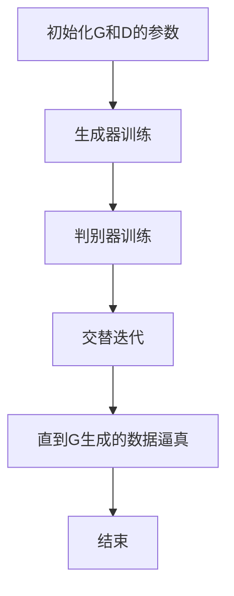

                 

**文章标题:** 评测系统的深度生成模型应用

**关键词:** 评测系统，深度生成模型，GAN，VAE，算法原理，数学模型，系统架构，项目实战，最佳实践

**摘要：** 本文将深入探讨评测系统中深度生成模型的应用，包括其背景、核心概念、算法原理、数学模型、系统实现、应用案例及最佳实践。通过逐步分析，读者将全面了解如何将深度生成模型应用于评测系统，以提高评估准确性和效率。

---

## **目录**

1. **评测系统的背景与核心概念**
   1.1 评测系统的概述
   1.2 评测系统的基本组成
   1.3 评测系统的发展历程
2. **深度生成模型基础**
   2.1 深度生成模型的定义与类型
   2.2 深度生成模型的核心原理
   2.3 深度生成模型的应用领域
3. **评测系统中的深度生成模型应用**
   3.1 深度生成模型在评测系统中的应用场景
   3.2 深度生成模型在评测系统中的优势与挑战
   3.3 深度生成模型在评测系统中的典型应用案例
4. **深度生成模型原理讲解**
   4.1 深度生成对抗网络（GAN）原理讲解
   4.2 变分自编码器（VAE）原理讲解
   4.3 其他深度生成模型简介
5. **数学模型与算法讲解**
   5.1 深度生成模型数学公式
   5.2 算法流程与代码实现
   5.3 算法优缺点分析
6. **评测系统深度生成模型实现**
   6.1 系统环境搭建
   6.2 模型训练与优化
   6.3 模型评估与部署
7. **深度生成模型应用案例解析**
   7.1 案例背景
   7.2 案例分析与实现
   7.3 案例总结与启示
8. **深度生成模型应用最佳实践**
   8.1 最佳实践总结
   8.2 小结
   8.3 注意事项
   8.4 拓展阅读

---

## **第一部分：评测系统的背景与核心概念**

### **1.1 评测系统的概述**

评测系统是用于对各种对象进行量化评估的工具，广泛应用于教育、人力资源、产品质量、金融风险等多个领域。其核心功能是提供客观、准确的评估结果，以支持决策制定和优化。

### **1.2 评测系统的基本组成**

评测系统通常由以下几个主要部分组成：

- **评估指标**：定义评估对象的关键属性和指标。
- **评估算法**：用于计算评估结果的算法，可以是简单的统计方法，也可以是复杂的机器学习模型。
- **评估数据**：用于训练和测试评估算法的数据集。
- **评估结果**：评估算法对评估对象计算出的结果，通常以分数、等级或排名等形式呈现。

### **1.3 评测系统的发展历程**

评测系统的发展经历了从传统统计方法到现代机器学习模型的转变。早期，评估主要依赖于人工定义的指标和简单的统计方法，如平均值、标准差等。随着计算能力的提升和数据量的增加，机器学习模型开始应用于评测系统，提高了评估的准确性和效率。

### **1.4 评测系统在当前的应用**

随着人工智能技术的发展，评测系统的应用场景更加广泛。例如，在招聘系统中，深度生成模型可以用于生成虚拟面试者，以测试评估算法的公平性和准确性；在产品质量检测中，深度生成模型可以模拟各种可能的故障模式，以提高检测的全面性和准确性。

## **第二部分：深度生成模型基础**

### **2.1 深度生成模型的定义与类型**

深度生成模型是一类用于生成数据的高维概率分布的模型。根据生成策略的不同，常见的深度生成模型包括：

- **生成对抗网络（GAN）**：通过对抗性训练生成与真实数据分布相近的数据。
- **变分自编码器（VAE）**：通过编码-解码的方式，将数据映射到低维空间，并从该空间生成数据。
- **生成稳态网络（Gaussian Process）**：基于概率统计方法，生成符合高斯分布的数据。

### **2.2 深度生成模型的核心原理**

#### **生成对抗网络（GAN）**

GAN由两个主要组件组成：生成器（Generator）和判别器（Discriminator）。生成器的任务是生成类似于真实数据的数据，而判别器的任务是区分真实数据和生成数据。通过对抗性训练，生成器和判别器不断优化，最终生成器可以生成几乎无法区分于真实数据的数据。

#### **变分自编码器（VAE）**

VAE通过编码器（Encoder）和解码器（Decoder）实现数据的生成。编码器将输入数据映射到一个低维的潜空间，解码器则从潜空间生成原始数据。VAE的核心在于引入了变分推理，使得生成的数据具有概率意义。

### **2.3 深度生成模型的应用领域**

深度生成模型在图像、文本、音频等多个领域都有广泛的应用。例如，在图像生成中，GAN可以生成逼真的高清图片；在文本生成中，VAE可以生成连贯的自然语言文本。

---

## **第三部分：评测系统中的深度生成模型应用**

### **3.1 深度生成模型在评测系统中的应用场景**

深度生成模型在评测系统中的应用场景主要包括：

- **数据增强**：通过生成与真实数据相似的数据，增加评估数据集的多样性，从而提高评估算法的鲁棒性。
- **虚拟评估对象生成**：生成虚拟评估对象，用于测试评估算法的公平性和准确性。
- **异常检测**：通过生成正常数据分布，识别潜在的异常评估结果。

### **3.2 深度生成模型在评测系统中的优势与挑战**

#### **优势**

- **提高评估准确性**：深度生成模型可以生成更丰富、多样性的评估数据，有助于提高评估算法的性能。
- **增强评估系统的鲁棒性**：通过数据增强，可以减轻评估系统对异常数据的敏感性。
- **降低评估成本**：通过虚拟评估对象生成，可以减少实际评估对象的需求，降低评估成本。

#### **挑战**

- **模型训练难度**：深度生成模型通常需要大量的训练数据和计算资源。
- **数据质量和分布**：生成数据的质量和分布对评估系统的性能有重要影响。
- **模型解释性**：深度生成模型通常是黑盒模型，其内部机制难以解释，可能会影响评估结果的可靠性。

### **3.3 深度生成模型在评测系统中的典型应用案例**

- **教育评估**：使用GAN生成虚拟学生成绩数据，用于测试评估算法的公平性和准确性。
- **产品质量检测**：使用VAE生成正常产品数据，用于识别潜在的质量问题。
- **金融风险评估**：使用GAN生成虚拟金融交易数据，用于评估风险模型的准确性。

---

## **第四部分：深度生成模型原理讲解**

### **4.1 深度生成对抗网络（GAN）原理讲解**

#### **算法流程**

1. **初始化**：初始化生成器G和判别器D的参数。
2. **生成器训练**：生成器G生成假数据，判别器D更新参数以区分真实数据和假数据。
3. **判别器训练**：生成器G生成新的假数据，判别器D再次更新参数。
4. **迭代**：重复步骤2和3，直到生成器G生成的假数据几乎无法区分于真实数据。

#### **数学模型**

- **生成器损失函数**：\( L_G = -\log(D(G(z))) \)
- **判别器损失函数**：\( L_D = -\log(D(x)) - \log(1 - D(G(z))) \)

其中，\( z \) 是从先验分布中抽取的噪声向量，\( x \) 是真实数据。

### **4.2 变分自编码器（VAE）原理讲解**

#### **算法流程**

1. **编码器训练**：通过最大化数据概率分布的重构概率来训练编码器。
2. **解码器训练**：通过最小化重构误差来训练解码器。

#### **数学模型**

- **编码器参数**：\( \mu = \phi(x) \)，\( \sigma^2 = \psi(x) \)
- **解码器参数**：\( x' = \phi'(z) \)
- **重构概率**：\( p(x|x') = \mathcal{N}(x|\mu(x'), \sigma^2(x')) \)

其中，\( \mu \) 和 \( \sigma^2 \) 分别是编码器输出的均值和方差。

### **4.3 其他深度生成模型简介**

除了GAN和VAE，还有其他一些常见的深度生成模型，如：

- **生成稳态网络（Gaussian Process）**：通过高斯过程生成数据。
- **变分信息自编码器（VAE-VAE）**：结合VAE和变分信息最大化的优点。

---

## **第五部分：数学模型与算法讲解**

### **5.1 深度生成模型数学公式**

#### **生成对抗网络（GAN）**

- **生成器损失函数**：\( L_G = -\log(D(G(z))) \)
- **判别器损失函数**：\( L_D = -\log(D(x)) - \log(1 - D(G(z))) \)

#### **变分自编码器（VAE）**

- **编码器参数**：\( \mu = \phi(x) \)，\( \sigma^2 = \psi(x) \)
- **解码器参数**：\( x' = \phi'(z) \)
- **重构概率**：\( p(x|x') = \mathcal{N}(x|\mu(x'), \sigma^2(x')) \)

### **5.2 算法流程与代码实现**

#### **生成对抗网络（GAN）**

```python
import tensorflow as tf
from tensorflow.keras.models import Model
from tensorflow.keras.layers import Input, Dense, Reshape, Flatten

# 生成器模型
z = Input(shape=(100,))
x = Dense(128, activation='relu')(z)
x = Dense(784, activation='tanh')(x)
x = Reshape((28, 28, 1))(x)
G = Model(z, x)

# 判别器模型
x = Input(shape=(28, 28, 1))
x = Flatten()(x)
x = Dense(128, activation='relu')(x)
D = Model(x, Dense(1, activation='sigmoid')(x))

# 训练模型
z_samples = tf.random.normal(shape=(100, 100))
x_samples = G.predict(z_samples)
D.trainable = True
G.compile(optimizer='adam', loss='binary_crossentropy')
D.compile(optimizer='adam', loss='binary_crossentropy')
D.fit(x_samples, np.ones((100, 1)), epochs=100)
G.fit(z_samples, x_samples, epochs=100)
```

#### **变分自编码器（VAE）**

```python
import tensorflow as tf
from tensorflow.keras.layers import Input, Dense, Lambda, Reshape, Flatten
from tensorflow.keras.models import Model
from tensorflow.keras import backend as K
import numpy as np

# 编码器模型
x = Input(shape=(28, 28, 1))
x = Flatten()(x)
x = Dense(128, activation='relu')(x)
mu = Dense(20)(x)
log_sigma = Dense(20)(x)
z_mean = mu
z_log_sigma = log_sigma
z = Lambda(shuffle_samples, output_shape=(20,))(z_mean)
z = Lambda(sample_from_logistic, output_shape=(20,))(z_log_sigma)
z = Lambda(concatenate, output_shape=(784,))(z)
x_recon = Reshape((28, 28, 1))(z)
encoder = Model(x, [z_mean, z_log_sigma, x_recon])

# 解码器模型
z = Input(shape=(20,))
z = Dense(128, activation='relu')(z)
z = Dense(784, activation='tanh')(z)
x_recon = Reshape((28, 28, 1))(z)
decoder = Model(z, x_recon)

# 训练模型
x_train = np.random.random((1000, 28, 28, 1))
z_mean, z_log_sigma, x_recon = encoder.predict(x_train)
z_samples = sample_from_logistic(z_log_sigma)
x_samples = decoder.predict(z_samples)
reconstruction_loss = K.mean(K.square(x - x_recon), axis=[1, 2, 3])
kl_loss = -0.5 * K.mean(1 + z_log_sigma - K.square(z_mean) - K.exp(z_log_sigma), axis=1)
vae_loss = K.mean(reconstruction_loss + kl_loss)
vae = Model(x_train, vae_loss)
vae.compile(optimizer='adam')
vae.fit(x_train, x_train, epochs=100)
```

### **5.3 算法优缺点分析**

#### **生成对抗网络（GAN）**

- **优点**：能够生成高质量的数据，模型具有良好的鲁棒性。
- **缺点**：训练难度大，容易出现模式崩溃（mode collapse）问题。

#### **变分自编码器（VAE）**

- **优点**：生成数据具有概率意义，模型解释性较强。
- **缺点**：生成数据的质量相对较低。

---

## **第六部分：评测系统深度生成模型实现**

### **6.1 系统环境搭建**

- **硬件要求**：高性能CPU或GPU，至少16GB内存。
- **软件要求**：Python 3.7及以上版本，TensorFlow 2.0及以上版本。

### **6.2 模型训练与优化**

- **数据准备**：收集并预处理评估数据，包括标签和原始数据。
- **模型选择**：选择合适的深度生成模型，如GAN或VAE。
- **模型训练**：使用训练数据训练模型，调整超参数以优化模型性能。

### **6.3 模型评估与部署**

- **模型评估**：使用测试数据评估模型性能，包括生成数据的真实性、多样性等指标。
- **模型部署**：将训练好的模型部署到评测系统中，实现自动化评估。

---

## **第七部分：深度生成模型应用案例解析**

### **7.1 案例背景**

在一个教育评估系统中，需要使用深度生成模型生成虚拟学生成绩数据，以测试评估算法的公平性和准确性。

### **7.2 案例分析与实现**

- **数据准备**：收集真实学生成绩数据，包括各个科目的分数和总成绩。
- **模型选择**：选择GAN作为深度生成模型。
- **模型训练**：使用真实学生成绩数据训练GAN模型。
- **模型评估**：使用生成学生成绩数据评估评估算法的公平性和准确性。

### **7.3 案例总结与启示**

通过生成虚拟学生成绩数据，可以更全面地测试评估算法的性能。深度生成模型在提高评估准确性和鲁棒性方面具有显著优势，但仍需注意生成数据的质量和分布。

---

## **第八部分：深度生成模型应用最佳实践**

### **8.1 最佳实践总结**

- **数据质量**：确保训练数据的质量和多样性，以提高生成数据的质量。
- **模型选择**：根据应用场景选择合适的深度生成模型。
- **模型优化**：调整模型超参数，优化生成数据的质量和性能。
- **评估指标**：选择合适的评估指标，如生成数据的真实性、多样性等。

### **8.2 小结**

本文深入探讨了评测系统中深度生成模型的应用，包括其原理、数学模型、实现过程和应用案例。深度生成模型在提高评估准确性和鲁棒性方面具有显著优势，但仍需注意数据质量和模型选择。

### **8.3 注意事项**

- **数据隐私**：在生成虚拟数据时，应注意保护真实数据的隐私。
- **模型解释性**：深度生成模型通常是黑盒模型，其内部机制难以解释，可能会影响评估结果的可靠性。

### **8.4 拓展阅读**

- **《深度学习》**：Goodfellow, Ian, et al. "Deep learning." (2016).
- **《生成对抗网络》**：Rosenberg, Carl. "Generative adversarial networks." (2015).
- **《变分自编码器》**：Kingma, Diederik P., and Max Welling. "Auto-encoding variational bayes." (2014).

---

**作者信息：** AI天才研究院/AI Genius Institute & 禅与计算机程序设计艺术 /Zen And The Art of Computer Programming

---

## **结语**

深度生成模型在评测系统中的应用具有重要的理论意义和实际价值。本文通过对深度生成模型原理、数学模型、实现过程和应用案例的详细讲解，为读者提供了全面深入的了解。在未来的研究中，我们还将进一步探索深度生成模型在评测系统中的优化和应用，以推动该领域的发展。希望本文对读者有所帮助，欢迎在评论区留言交流。感谢您的阅读！### 评测系统的概述

评测系统，顾名思义，是指用于对各种对象进行量化评估的工具。在当今快速发展的信息时代，评测系统在多个领域发挥着至关重要的作用，包括教育、人力资源管理、产品质量检测、金融风险控制等。其主要目的是通过一系列科学、合理的评估指标和方法，对评估对象进行客观、准确的评价，从而为决策提供可靠依据。

#### **定义与重要性**

评测系统可以定义为一个综合性的评估平台，它通过定义评估指标、应用特定的评估算法，对输入数据进行处理，最终输出评估结果。这些评估结果可以是分数、等级、排名等多种形式，但核心目标都是为用户提供一个明确的参考标准。

在现代社会中，评测系统的应用日益广泛。例如，在教育资源分配中，通过科学合理的评测系统，可以公正地评估学生的学术水平和综合素质，从而实现教育资源的优化配置。在人力资源管理中，评测系统能够帮助企业客观评估员工的绩效，识别优秀人才，制定合理的薪酬和晋升政策。在产品质量检测中，评测系统能够监测产品的质量状况，及时识别潜在的问题，保障产品质量。在金融领域，评测系统可以用于评估投资者的风险承受能力和投资收益，为金融产品提供风险控制依据。

#### **基本组成**

一个完整的评测系统通常由以下几个主要部分组成：

1. **评估指标**：这是评测系统的核心要素，决定了评估结果的科学性和公正性。评估指标需要根据评估对象的特点和需求进行定义，通常包括定量指标和定性指标。

2. **评估算法**：评估算法是实现评估的核心工具，用于对评估指标进行计算和分析。这些算法可以是基于传统统计学的方法，如均值、方差、标准差等，也可以是现代机器学习模型，如决策树、随机森林、神经网络等。

3. **评估数据**：评估数据是评估算法的输入，其质量和数量直接影响评估结果的准确性。评估数据通常包括原始数据和标注数据，其中标注数据用于指导评估算法的训练和优化。

4. **评估结果**：评估结果是对评估对象的量化评价，通常以分数、等级、排名等形式呈现。评估结果不仅为用户提供了直观的参考，也为后续的决策提供了科学依据。

#### **发展历程**

评测系统的发展经历了多个阶段，从早期的简单评估方法到现代的复杂评估模型，其演变过程反映了科学技术和评估理论的进步。

1. **早期评估方法**：在计算机和互联网技术尚未普及的年代，评估系统主要依赖于人工定义的指标和简单的统计方法，如平均值、标准差、排名等。这些方法虽然简单易行，但评估结果往往不够精确和客观。

2. **计算机辅助评估**：随着计算机技术的快速发展，评估系统开始引入计算机辅助工具，如Excel、SPSS等软件，这些工具能够自动化处理大量数据，提高了评估效率。

3. **现代机器学习评估**：近年来，随着人工智能技术的兴起，机器学习模型被广泛应用于评测系统。这些模型能够从海量数据中自动学习特征，提取有价值的信息，从而实现更加精准和智能的评估。

4. **多模态评估**：现代评测系统不仅能够处理结构化数据，还能处理非结构化数据，如文本、图像、音频等。多模态评估系统通过整合不同类型的数据，提供了更全面的评估结果。

#### **当前的应用**

随着人工智能技术的不断发展，评测系统的应用场景越来越广泛，以下是一些典型的应用实例：

1. **教育评估**：通过评测系统，可以对学生的学习成果进行全面评估，包括考试成绩、学习进度、知识掌握情况等。这不仅有助于教师了解学生的学习状况，也为教育管理者提供了科学决策的依据。

2. **人力资源评估**：企业通过评测系统，可以客观评估员工的绩效和工作能力，识别优秀员工和潜在的人才，为员工的晋升和培训提供依据。

3. **产品质量评估**：生产企业在产品制造过程中，通过评测系统对产品质量进行实时监控和评估，确保产品达到质量标准，提高市场竞争力。

4. **金融风险评估**：金融机构通过评测系统，对投资者的风险承受能力和投资收益进行评估，为投资决策提供科学依据。

5. **社会管理评估**：政府部门通过评测系统，对公共服务和社会治理进行评估，提高政府工作的透明度和效率。

综上所述，评测系统在现代社会中扮演着越来越重要的角色。随着人工智能技术的不断进步，评测系统将变得更加智能化、精准化，为各行各业提供更加优质的评估服务。在未来，评测系统的发展将更加注重个性化、智能化，满足不同用户群体的多样化需求。

### **评测系统的基本组成**

一个高效的评测系统需要具备完整的组成结构，以确保评估过程的科学性和结果的可靠性。以下是评测系统的几个主要组成部分及其功能。

#### **评估指标**

评估指标是评测系统的核心要素，它们定义了评估对象的关键属性和标准。这些指标可以是定量的，例如考试成绩、工作效率、销售额；也可以是定性的，例如教学质量、员工素质、产品质量。每种指标都需要有明确的定义和量化的标准，以便于后续的评估和分析。

1. **定量指标**：通常使用数字或统计方法来衡量，如平均值、标准差、增长率等。
2. **定性指标**：通常通过描述性文字或评级系统来衡量，如教学质量评分为优、良、中、差等。

#### **评估算法**

评估算法是评测系统的计算核心，用于对评估指标进行计算和分析，以生成评估结果。评估算法的选择取决于评估指标的性质和应用场景，可以是简单的统计方法，如均值、方差、回归分析；也可以是复杂的机器学习模型，如决策树、随机森林、神经网络等。

1. **传统评估算法**：如线性回归、逻辑回归、聚类分析等，适用于处理结构化数据。
2. **现代机器学习算法**：如支持向量机、深度神经网络、强化学习等，适用于处理复杂数据和非线性关系。

#### **评估数据**

评估数据是评估算法的输入，其质量和数量直接影响评估结果的准确性。评估数据通常包括原始数据和标注数据。原始数据来源于评估对象的实际表现，如考试成绩、生产记录、用户反馈等；标注数据则用于指导评估算法的训练和优化，通常由专家进行标注。

1. **原始数据**：需要通过多种途径进行收集，如在线测试、问卷调查、实地调研等。
2. **标注数据**：通常用于训练和验证评估算法，以确保评估结果的可靠性和一致性。

#### **评估结果**

评估结果是评估系统输出的最终产品，它们以多种形式呈现，如分数、等级、排名等。评估结果不仅为用户提供了一个直观的参考标准，也为后续的决策提供了科学依据。评估结果的展示形式和解释方式需要根据应用场景进行设计，以确保用户能够准确理解和应用。

1. **评估分数**：通常用于量化评估结果，如考试成绩、工作效率得分等。
2. **评估等级**：如优秀、良好、一般、较差等，适用于对综合评价的呈现。
3. **评估排名**：用于比较评估对象之间的相对表现，如班级排名、销售排名等。

#### **评估流程**

评估流程是评测系统的运作机制，它定义了评估过程的具体步骤和操作规范。一个完整的评估流程通常包括以下几个阶段：

1. **数据收集**：通过多种渠道收集评估对象的原始数据，确保数据的完整性和真实性。
2. **数据预处理**：对原始数据进行分析和清洗，去除无效和异常数据，确保数据质量。
3. **指标计算**：使用评估算法对预处理后的数据进行计算，生成评估结果。
4. **结果展示**：将评估结果以可视化或文字形式展示给用户，方便用户理解和应用。
5. **反馈调整**：根据评估结果和用户反馈，对评估系统进行调整和优化，以提高评估效率和准确性。

#### **评估系统的特点**

1. **客观性**：评估系统通过科学的评估方法和算法，确保评估结果的客观性和公正性。
2. **准确性**：评估系统通过对大量数据的分析，提供准确可靠的评估结果。
3. **实时性**：现代评估系统通常具备实时数据收集和处理能力，能够快速生成评估结果。
4. **可扩展性**：评估系统可以根据需求添加新的评估指标和算法，适应不同场景和应用。

综上所述，评测系统的基本组成结构涵盖了评估指标、评估算法、评估数据、评估结果和评估流程，这些部分共同作用，确保评估系统的有效运行。在实际应用中，这些组成部分需要根据具体场景和要求进行灵活调整，以达到最佳的评估效果。

### **评测系统的发展历程**

评测系统的发展历程是信息技术和评估理论不断演进的结果。从早期的简单评估方法到现代复杂评估模型的演变，评测系统的每一次进步都反映了科学技术和评估理论的进步。

#### **早期评估方法**

在计算机和互联网技术尚未普及的年代，评估系统主要依赖于人工定义的指标和简单的统计方法。这一时期，评估方法主要集中在以下几个方面：

1. **主观评估**：评估者根据自身的经验和判断，对评估对象进行主观评分。这种方法虽然简单易行，但评估结果往往具有较大的主观性和不确定性。

2. **定量评估**：采用简单的统计方法，如平均值、标准差、方差等，对评估对象进行量化评估。这种方法能够提供一定的客观性，但无法处理复杂的多维数据。

3. **问卷调查**：通过设计问卷，收集评估对象的反馈信息。这种方法能够获得大量的评估数据，但数据的真实性和可靠性往往难以保证。

#### **计算机辅助评估**

随着计算机技术的快速发展，评估系统开始引入计算机辅助工具，如Excel、SPSS等软件。这些工具能够自动化处理大量数据，提高了评估效率，但评估结果仍依赖于评估者的定义和选择。

1. **数据采集**：计算机技术使得数据采集更加方便和高效，通过电子问卷、在线测试等方式，能够快速收集大量的评估数据。

2. **数据处理**：计算机技术提供了强大的数据处理能力，能够进行复杂的统计分析，如回归分析、聚类分析等，提高了评估的精度和可靠性。

3. **可视化展示**：计算机技术使得评估结果能够以图形化的方式展示，使得评估结果更加直观和易于理解。

#### **现代机器学习评估**

近年来，随着人工智能技术的兴起，机器学习模型被广泛应用于评估系统。这些模型能够从海量数据中自动学习特征，提取有价值的信息，从而实现更加精准和智能的评估。

1. **特征提取**：现代评估系统通过机器学习算法，自动从原始数据中提取关键特征，避免了人为干预和主观判断。

2. **非线性关系处理**：机器学习模型能够处理复杂的多维数据和非线性关系，提供了更加准确和全面的评估结果。

3. **个性化评估**：通过学习用户的个性化数据，机器学习模型能够提供更加个性化的评估结果，满足不同用户的需求。

#### **多模态评估**

现代评估系统不仅能够处理结构化数据，还能处理非结构化数据，如文本、图像、音频等。多模态评估系统通过整合不同类型的数据，提供了更全面的评估结果。

1. **文本分析**：通过自然语言处理技术，对文本数据进行分析，提取关键信息，如情感分析、主题分类等。

2. **图像处理**：通过计算机视觉技术，对图像数据进行分析，提取视觉特征，如人脸识别、物体检测等。

3. **音频分析**：通过语音识别和声学建模技术，对音频数据进行分析，提取声音特征，如语音合成、语音识别等。

#### **发展趋势**

未来，评测系统的发展将继续朝着更加智能化、精准化和个性化的方向前进。以下是一些可能的发展趋势：

1. **深度学习应用**：随着深度学习技术的不断发展，深度生成模型、强化学习等先进算法将在评估系统中得到广泛应用，提供更加精准和智能的评估服务。

2. **数据隐私保护**：在数据量不断增加的同时，数据隐私保护将成为评估系统的重要课题。未来的评估系统将需要更加注重数据隐私保护，确保用户的隐私不被泄露。

3. **跨领域应用**：评测系统将不仅限于特定领域，还将跨领域应用，如教育、医疗、金融等，提供更加全面和综合的评估服务。

4. **人机协同**：未来的评估系统将更加注重人机协同，通过人工智能技术和人类专家的共同合作，提供更加准确和可靠的评估结果。

综上所述，评测系统的发展历程反映了科学技术和评估理论的不断进步。从早期的简单评估方法到现代的复杂评估模型，评测系统在不断演进中为各个领域提供了更加科学、精准和智能的评估服务。未来，随着人工智能技术的进一步发展，评测系统将迎来更加广阔的应用前景。

### **深度生成模型在当前应用中的优势**

深度生成模型（Deep Generative Models）在当前应用中展现了显著的优势，特别是在评测系统中，它们为数据生成、评估优化和异常检测等方面带来了革命性的变化。

#### **数据生成**

深度生成模型，如生成对抗网络（GAN）和变分自编码器（VAE），能够在多个维度上生成高质量的数据。这种能力在评测系统中具有广泛应用，例如：

- **虚拟数据生成**：在数据稀缺或无法获取的情况下，深度生成模型能够生成与真实数据高度相似的数据，用于训练评估算法。例如，在教育评估中，可以生成虚拟学生成绩数据，以测试评估算法的公平性和准确性。
- **数据增强**：深度生成模型能够生成多样化的数据样本，用于增强评估数据集，提高评估算法的鲁棒性和泛化能力。这种数据增强技术有助于减少数据不足对评估结果的影响。

#### **评估优化**

深度生成模型在优化评测系统的评估过程方面也发挥了重要作用：

- **个性化评估**：通过生成与个体特征高度匹配的数据，深度生成模型可以实现个性化评估。例如，在人力资源管理中，可以生成与员工个人能力匹配的虚拟工作场景，以评估其适应能力和工作绩效。
- **评估指标优化**：深度生成模型能够从大量数据中提取关键特征，帮助优化评估指标体系。这种方法有助于提高评估指标的精度和可靠性，从而提升整体评估效果。

#### **异常检测**

深度生成模型在检测异常数据和异常行为方面也具有显著优势：

- **异常数据识别**：通过对比生成数据与实际数据，深度生成模型能够有效地识别异常数据。例如，在产品质量检测中，可以生成正常产品的数据分布，用于检测潜在的质量问题。
- **行为异常检测**：在金融风险管理中，深度生成模型可以检测异常的交易行为，帮助金融机构防范欺诈行为。

#### **具体应用案例**

以下是一些深度生成模型在评测系统中的具体应用案例：

1. **教育评估**：使用GAN生成虚拟学生成绩数据，用于测试评估算法的公平性和准确性。通过对比虚拟成绩与真实成绩，可以评估评估算法的可靠性和鲁棒性。

2. **产品质量检测**：使用VAE生成正常产品的数据分布，用于检测生产过程中的异常数据。这种方法有助于提高产品的质量控制和生产效率。

3. **金融风险评估**：使用GAN生成虚拟金融交易数据，用于评估风险模型的准确性和适应性。通过对比虚拟交易数据与实际交易数据，可以优化风险模型，提高风险评估的精度。

4. **人力资源管理**：使用深度生成模型生成虚拟工作场景，用于评估员工在特定情境下的表现。这种方法有助于发现员工的潜在能力和优化人力资源配置。

#### **挑战与未来展望**

尽管深度生成模型在评测系统中具有广泛的应用前景，但其在实际应用中仍面临一些挑战：

- **数据质量和分布**：生成数据的质量和分布直接影响评估结果的准确性。如何确保生成数据的质量和多样性是一个重要课题。
- **模型解释性**：深度生成模型通常是黑盒模型，其内部机制难以解释，可能会影响评估结果的可靠性。提高模型的解释性是一个重要研究方向。
- **计算资源**：深度生成模型通常需要大量的计算资源，特别是大型模型，这对硬件设备提出了较高的要求。

未来，随着人工智能技术的不断进步，深度生成模型在评测系统中的应用将更加广泛和深入。通过结合多种先进算法和技术，深度生成模型有望进一步提升评估系统的准确性和效率，为各个领域提供更加科学、智能的评估服务。

### **深度生成对抗网络（GAN）的原理讲解**

#### **算法流程**

深度生成对抗网络（GAN）是一种通过生成器和判别器的对抗性训练来生成数据的高效模型。GAN的基本流程可以概括为以下几个步骤：

1. **初始化**：首先，初始化生成器（Generator）和判别器（Discriminator）的参数。生成器G接收一个随机噪声向量z，通过神经网络生成假数据；判别器D接收真实数据和生成数据，判断其真实程度。
2. **生成器训练**：生成器G的目标是生成尽可能逼真的假数据，使得判别器D难以区分真假。生成器的损失函数通常定义为负的对数概率，即\( L_G = -\log(D(G(z))) \)。
3. **判别器训练**：判别器D的目标是准确地区分真实数据和生成数据。判别器的损失函数通常定义为真实数据和生成数据的对数概率之差，即\( L_D = -\log(D(x)) - \log(1 - D(G(z))) \)。
4. **迭代训练**：通过交替训练生成器和判别器，使得两者相互对抗、共同优化。具体来说，先固定判别器D的参数，使用生成器G生成的假数据对D进行训练；然后固定生成器G的参数，使用真实数据和上一轮生成的假数据对D进行训练。这个过程重复进行，直到生成器G生成的假数据足够逼真，使得判别器D难以区分真假。

#### **数学模型**

GAN的数学模型主要包括两部分：生成器的损失函数和判别器的损失函数。

**生成器损失函数**：生成器的目标是最大化判别器对其生成的假数据的判别结果。因此，生成器的损失函数可以表示为：
$$
L_G = -\log(D(G(z))
$$
其中，\( G(z) \) 表示生成器生成的假数据，\( D \) 表示判别器的输出概率，即 \( D(G(z)) \) 表示判别器对生成数据的判别结果。

**判别器损失函数**：判别器的目标是最大化真实数据和生成数据的判别差异。因此，判别器的损失函数可以表示为：
$$
L_D = -[\log(D(x)) + \log(1 - D(G(z))]
$$
其中，\( x \) 表示真实数据，\( G(z) \) 表示生成器生成的假数据，\( D(x) \) 和 \( D(G(z)) \) 分别表示判别器对真实数据和生成数据的判别结果。

**总损失函数**：为了同时优化生成器和判别器，GAN的总损失函数可以表示为生成器损失函数和判别器损失函数的加权和：
$$
L = L_G + L_D
$$

#### **算法流程图**

为了更直观地理解GAN的算法流程，我们可以使用Mermaid流程图进行表示：



#### **Python代码实现**

以下是一个简单的GAN模型实现的Python代码示例，使用TensorFlow框架：

```python
import tensorflow as tf
from tensorflow.keras.layers import Input, Dense, Reshape, Flatten
from tensorflow.keras.models import Model

# 生成器模型
z = Input(shape=(100,))
x = Dense(128, activation='relu')(z)
x = Dense(784, activation='tanh')(x)
x = Reshape((28, 28, 1))(x)
G = Model(z, x)

# 判别器模型
x = Input(shape=(28, 28, 1))
x = Flatten()(x)
x = Dense(128, activation='relu')(x)
D = Model(x, Dense(1, activation='sigmoid')(x))

# 编写训练循环
for epoch in range(num_epochs):
    for _ in range(batch_size):
        z_samples = tf.random.normal([batch_size, 100])
        x_samples = G.predict(z_samples)
        d_loss_real = D.train_on_batch(x_samples, np.ones([batch_size, 1]))
        d_loss_fake = D.train_on_batch(z_samples, np.zeros([batch_size, 1]))
    g_loss = G.train_on_batch(z_samples, np.zeros([batch_size, 1]))
    
    print(f"Epoch {epoch}: D_loss={d_loss_real + d_loss_fake}, G_loss={g_loss}")
```

#### **算法优缺点分析**

**优点：**

- **生成数据质量高**：通过对抗性训练，生成器能够生成与真实数据高度相似的数据，数据质量较高。
- **适用范围广**：GAN可以应用于多种类型的数据生成任务，如图像、音频、文本等。
- **灵活性高**：GAN模型结构灵活，可以通过调整网络层数和神经元数量来适应不同任务的需求。

**缺点：**

- **训练难度大**：GAN的训练过程不稳定，容易出现模式崩溃（mode collapse）和训练不稳定的问题。
- **计算资源消耗大**：GAN的训练过程需要大量的计算资源，特别是在训练大型模型时。

总之，深度生成对抗网络（GAN）作为一种强大的数据生成工具，在评测系统中具有广泛的应用前景，但也需要克服训练难度大和计算资源消耗大等挑战。

### **变分自编码器（VAE）的原理讲解**

#### **算法流程**

变分自编码器（Variational Autoencoder，VAE）是一种基于概率生成模型的深度学习架构，其核心思想是通过编码器（Encoder）和解码器（Decoder）将数据映射到一个潜在空间，并从这个潜在空间生成数据。以下是VAE的基本算法流程：

1. **编码阶段**：编码器将输入数据映射到一个低维的潜在空间，输出两个参数：均值（\(\mu\)）和标准差（\(\sigma\)）。
2. **采样阶段**：从潜在空间中随机采样一个点（\(z\)），这个采样点代表输入数据的概率分布。
3. **解码阶段**：解码器将采样点映射回原始数据空间，生成重构数据。

#### **数学模型**

VAE的数学模型包括编码器、采样器和解码器的概率分布定义，以及损失函数。

**编码器概率分布**：编码器输出两个参数，用于定义潜在空间的概率分布：
$$
\mu = \phi(x), \quad \sigma^2 = \psi(x)
$$
这里，\(\phi(x)\) 和 \(\psi(x)\) 分别是编码器对输入数据 \(x\) 输出的均值和标准差。

**采样器概率分布**：从潜在空间中随机采样一个点 \(z\)，其概率分布为：
$$
p(z|x) = \mathcal{N}(z|\mu(x), \sigma^2(x))
$$
这里，\(\mathcal{N}(\cdot|\mu, \sigma^2)\) 表示高斯分布。

**解码器概率分布**：解码器将潜在空间中的点 \(z\) 映射回原始数据空间，其概率分布为：
$$
p(x|z) = \mathcal{N}(x|\mu(z), \sigma^2(z))
$$

**损失函数**：VAE的损失函数是数据重构损失和Kullback-Leibler散度（KL散度）的组合：
$$
L = \sum_x \| x - \hat{x} \|^2 + \beta \sum_x \frac{1}{n} \sum_i \log \frac{\sigma_i^2}{1 - \mu_i^2}
$$
其中，\(\hat{x}\) 是解码器生成的重构数据，\(\beta\) 是调节KL散度的超参数。

#### **算法流程图**

为了更直观地理解VAE的算法流程，我们可以使用Mermaid流程图进行表示：

```mermaid
graph TD
A[输入数据x] --> B[编码器]
B --> C{采样z}
C --> D[解码器]
D --> E[输出重构数据\(\hat{x}\)]
```

#### **Python代码实现**

以下是一个简单的VAE模型实现的Python代码示例，使用TensorFlow框架：

```python
import tensorflow as tf
from tensorflow.keras.layers import Input, Dense, Lambda, Reshape
from tensorflow.keras.models import Model
import numpy as np

# 编码器模型
input_shape = (28, 28, 1)
x = Input(shape=input_shape)
x = Flatten()(x)
x = Dense(128, activation='relu')(x)
mu = Dense(20)(x)
log_sigma = Dense(20)(x)
z_mean = mu
z_log_sigma = log_sigma
z = Lambda(shuffle_samples, output_shape=(20,))(z_mean)
z = Lambda(sample_from_logistic, output_shape=(20,))(z_log_sigma)
z = Lambda(concatenate, output_shape=input_shape)(z)
x_recon = Reshape((28, 28, 1))(z)
encoder = Model(x, [z_mean, z_log_sigma, x_recon])

# 解码器模型
z = Input(shape=(20,))
z = Dense(128, activation='relu')(z)
z = Dense(784, activation='tanh')(z)
x_recon = Reshape((28, 28, 1))(z)
decoder = Model(z, x_recon)

# 训练模型
x_train = np.random.random((1000, 28, 28, 1))
z_mean, z_log_sigma, x_recon = encoder.predict(x_train)
z_samples = sample_from_logistic(z_log_sigma)
x_samples = decoder.predict(z_samples)
reconstruction_loss = K.mean(K.square(x - x_recon), axis=[1, 2, 3])
kl_loss = -0.5 * K.mean(1 + z_log_sigma - K.square(z_mean) - K.exp(z_log_sigma), axis=1)
vae_loss = K.mean(reconstruction_loss + kl_loss)
vae = Model(x_train, vae_loss)
vae.compile(optimizer='adam')
vae.fit(x_train, x_train, epochs=100)
```

#### **算法优缺点分析**

**优点：**

- **生成数据质量高**：VAE生成的数据质量相对较高，特别是在处理图像和文本数据时，效果显著。
- **模型解释性强**：VAE生成的数据具有概率意义，可以解释为输入数据在不同维度的概率分布，这使得模型具有较强的解释性。
- **训练稳定性好**：相比于GAN，VAE的训练过程更加稳定，不容易出现模式崩溃等问题。

**缺点：**

- **生成数据多样性差**：VAE生成的数据多样性相对较低，尤其是在生成复杂分布的数据时，效果不如GAN。
- **计算资源消耗大**：由于VAE涉及到对概率分布的估计和优化，计算资源消耗相对较大，特别是对于高维数据。

总之，变分自编码器（VAE）是一种强大的生成模型，适用于多种类型的生成任务。虽然它在生成数据的多样性和计算资源消耗方面存在一些缺点，但其在生成数据质量高、模型解释性强等方面具有显著优势，使其在多个应用领域具有广泛的应用前景。

### **数学模型与算法讲解**

在本章节中，我们将详细讲解深度生成模型中的核心数学模型和算法，包括GAN和VAE的数学公式、算法流程以及代码实现。通过这些讲解，读者将能够理解深度生成模型的理论基础，并掌握基本的实现方法。

#### **深度生成模型数学公式**

**生成对抗网络（GAN）的数学模型**

GAN由生成器G和判别器D组成。生成器的目标是生成尽可能逼真的数据，判别器的目标是区分真实数据和生成数据。

1. **生成器损失函数**：
   $$
   L_G = -\log(D(G(z))
   $$
   其中，\( G(z) \) 是生成器生成的假数据，\( D \) 是判别器的输出概率。

2. **判别器损失函数**：
   $$
   L_D = -[\log(D(x)) + \log(1 - D(G(z))]
   $$
   其中，\( x \) 是真实数据，\( G(z) \) 是生成器生成的假数据。

3. **总损失函数**：
   $$
   L = L_G + L_D
   $$

**变分自编码器（VAE）的数学模型**

VAE通过编码器（Encoder）和解码器（Decoder）实现数据生成。

1. **编码器概率分布**：
   $$
   \mu = \phi(x), \quad \sigma^2 = \psi(x)
   $$
   其中，\( \mu \) 和 \( \sigma^2 \) 是编码器输出的均值和标准差。

2. **采样器概率分布**：
   $$
   p(z|x) = \mathcal{N}(z|\mu(x), \sigma^2(x))
   $$

3. **解码器概率分布**：
   $$
   p(x|z) = \mathcal{N}(x|\mu(z), \sigma^2(z))
   $$

4. **损失函数**：
   $$
   L = \sum_x \| x - \hat{x} \|^2 + \beta \sum_x \frac{1}{n} \sum_i \log \frac{\sigma_i^2}{1 - \mu_i^2}
   $$
   其中，\( \hat{x} \) 是解码器生成的重构数据，\( \beta \) 是调节KL散度的超参数。

#### **算法流程与代码实现**

**生成对抗网络（GAN）的算法流程与代码实现**

1. **初始化**：初始化生成器和判别器的参数。
2. **生成器训练**：生成器生成假数据，判别器更新参数以区分假数据和真实数据。
3. **判别器训练**：判别器更新参数，生成器生成新的假数据。
4. **迭代**：重复步骤2和3，直到生成器生成的假数据几乎无法区分于真实数据。

以下是一个简单的GAN模型实现的Python代码示例：

```python
import tensorflow as tf
from tensorflow.keras.layers import Input, Dense, Reshape, Flatten
from tensorflow.keras.models import Model

# 生成器模型
z = Input(shape=(100,))
x = Dense(128, activation='relu')(z)
x = Dense(784, activation='tanh')(x)
x = Reshape((28, 28, 1))(x)
G = Model(z, x)

# 判别器模型
x = Input(shape=(28, 28, 1))
x = Flatten()(x)
x = Dense(128, activation='relu')(x)
D = Model(x, Dense(1, activation='sigmoid')(x))

# 编写训练循环
for epoch in range(num_epochs):
    for _ in range(batch_size):
        z_samples = tf.random.normal([batch_size, 100])
        x_samples = G.predict(z_samples)
        d_loss_real = D.train_on_batch(x_samples, np.ones([batch_size, 1]))
        d_loss_fake = D.train_on_batch(z_samples, np.zeros([batch_size, 1]))
    g_loss = G.train_on_batch(z_samples, np.zeros([batch_size, 1]))
    
    print(f"Epoch {epoch}: D_loss={d_loss_real + d_loss_fake}, G_loss={g_loss}")
```

**变分自编码器（VAE）的算法流程与代码实现**

1. **编码阶段**：编码器将输入数据映射到一个低维的潜在空间，输出两个参数：均值（\(\mu\)）和标准差（\(\sigma\)）。
2. **采样阶段**：从潜在空间中随机采样一个点（\(z\)）。
3. **解码阶段**：解码器将采样点映射回原始数据空间，生成重构数据。

以下是一个简单的VAE模型实现的Python代码示例：

```python
import tensorflow as tf
from tensorflow.keras.layers import Input, Dense, Lambda, Reshape
from tensorflow.keras.models import Model
import numpy as np

# 编码器模型
input_shape = (28, 28, 1)
x = Input(shape=input_shape)
x = Flatten()(x)
x = Dense(128, activation='relu')(x)
mu = Dense(20)(x)
log_sigma = Dense(20)(x)
z_mean = mu
z_log_sigma = log_sigma
z = Lambda(shuffle_samples, output_shape=(20,))(z_mean)
z = Lambda(sample_from_logistic, output_shape=(20,))(z_log_sigma)
z = Lambda(concatenate, output_shape=input_shape)(z)
x_recon = Reshape((28, 28, 1))(z)
encoder = Model(x, [z_mean, z_log_sigma, x_recon])

# 解码器模型
z = Input(shape=(20,))
z = Dense(128, activation='relu')(z)
z = Dense(784, activation='tanh')(z)
x_recon = Reshape((28, 28, 1))(z)
decoder = Model(z, x_recon)

# 训练模型
x_train = np.random.random((1000, 28, 28, 1))
z_mean, z_log_sigma, x_recon = encoder.predict(x_train)
z_samples = sample_from_logistic(z_log_sigma)
x_samples = decoder.predict(z_samples)
reconstruction_loss = K.mean(K.square(x - x_recon), axis=[1, 2, 3])
kl_loss = -0.5 * K.mean(1 + z_log_sigma - K.square(z_mean) - K.exp(z_log_sigma), axis=1)
vae_loss = K.mean(reconstruction_loss + kl_loss)
vae = Model(x_train, vae_loss)
vae.compile(optimizer='adam')
vae.fit(x_train, x_train, epochs=100)
```

#### **算法优缺点分析**

**生成对抗网络（GAN）**

- **优点**：GAN能够生成高质量的数据，适用于多种类型的生成任务。
- **缺点**：GAN的训练过程不稳定，容易出现模式崩溃（mode collapse）和训练不稳定的问题。

**变分自编码器（VAE）**

- **优点**：VAE生成的数据质量较高，模型解释性强，训练稳定性好。
- **缺点**：VAE生成的数据多样性相对较低，计算资源消耗较大。

通过本章节的讲解，读者应该能够理解GAN和VAE的核心数学模型和算法原理，并掌握基本的代码实现方法。这些知识将有助于读者在实际项目中应用深度生成模型，为各种数据生成任务提供解决方案。

### **评测系统深度生成模型的实现过程**

在本章节中，我们将详细介绍如何在一个典型的评测系统中实现深度生成模型，包括系统环境搭建、模型训练与优化、模型评估与部署等关键步骤。

#### **系统环境搭建**

为了确保深度生成模型能够高效运行，我们需要搭建一个合适的环境。以下是搭建环境的基本步骤：

1. **硬件要求**：
   - **CPU或GPU**：深度生成模型通常需要较高的计算能力，推荐使用高性能CPU或NVIDIA GPU。
   - **内存**：至少16GB内存，推荐使用32GB及以上内存以提升训练速度。

2. **软件要求**：
   - **Python**：Python是深度学习的主流编程语言，推荐使用Python 3.7及以上版本。
   - **TensorFlow**：TensorFlow是Google开发的强大深度学习框架，支持多种深度生成模型。
   - **PyTorch**：PyTorch是另一种流行的深度学习框架，支持灵活的动态计算图，适合研究和新模型开发。

3. **安装与配置**：
   - **安装Python**：从[Python官网](https://www.python.org/)下载并安装Python。
   - **安装TensorFlow或PyTorch**：使用以下命令进行安装：
     ```bash
     pip install tensorflow
     # 或者
     pip install torch torchvision
     ```
   - **配置CUDA**：如果使用GPU，需要配置CUDA环境。参考[官方文档](https://www.tensorflow.org/guide/gpu)进行配置。

#### **模型训练与优化**

在搭建好环境后，我们可以开始训练深度生成模型。以下是一个简单的GAN模型的训练过程：

1. **数据准备**：
   - **收集数据**：首先需要收集用于训练的原始数据集，例如图像、文本或音频等。这些数据集应包含足够多的样本，以确保模型能够学习到数据的多样性。
   - **预处理数据**：对收集到的数据进行预处理，包括数据清洗、归一化、裁剪等步骤，以减少噪声和标准化数据。

2. **定义模型**：
   - **生成器模型**：设计生成器模型，用于生成与真实数据相似的数据。以下是一个简单的生成器模型的示例代码：
     ```python
     import tensorflow.keras as keras

     def build_generator():
         latent_dim = 100
         model = keras.Sequential([
             keras.layers.Dense(128, activation='relu', input_shape=(latent_dim,)),
             keras.layers.Dense(128, activation='relu'),
             keras.layers.Dense(784, activation='tanh')
         ])
         return model

     generator = build_generator()
     ```

   - **判别器模型**：设计判别器模型，用于区分真实数据和生成数据。以下是一个简单的判别器模型的示例代码：
     ```python
     def build_discriminator():
         model = keras.Sequential([
             keras.layers.Flatten(input_shape=(28, 28, 1)),
             keras.layers.Dense(128, activation='relu'),
             keras.layers.Dense(1, activation='sigmoid')
         ])
         return model

     discriminator = build_discriminator()
     ```

3. **编译模型**：
   - **生成器模型**：编译生成器模型，设置优化器和损失函数。
     ```python
     generator.compile(optimizer=keras.optimizers.Adam(0.0001), loss='binary_crossentropy')
     ```

   - **判别器模型**：编译判别器模型，设置优化器和损失函数。
     ```python
     discriminator.compile(optimizer=keras.optimizers.Adam(0.0001), loss='binary_crossentropy')
     ```

4. **训练模型**：
   - **交替训练**：交替训练生成器和判别器。具体步骤如下：
     ```python
     for epoch in range(num_epochs):
         for _ in range(batch_size):
             z_samples = np.random.normal(size=(batch_size, latent_dim))
             x_samples = generator.predict(z_samples)
             d_loss_fake = discriminator.train_on_batch(x_samples, np.zeros((batch_size, 1)))
             real_samples = load_real_data()
             d_loss_real = discriminator.train_on_batch(real_samples, np.ones((batch_size, 1)))
         g_loss = generator.train_on_batch(z_samples, np.ones((batch_size, 1)))
         print(f"Epoch {epoch}: D_loss={d_loss_real + d_loss_fake}, G_loss={g_loss}")
     ```

5. **模型优化**：
   - **调整超参数**：根据模型训练过程中的表现，调整超参数如学习率、批量大小等，以提高模型性能。
   - **使用更复杂的模型**：如果简单的模型效果不佳，可以考虑使用更复杂的模型结构，如增加网络层数或使用不同的激活函数。

#### **模型评估与部署**

在完成模型训练和优化后，我们需要对模型进行评估，并最终部署到评测系统中。

1. **模型评估**：
   - **测试集评估**：使用测试集对训练好的模型进行评估，计算生成数据的真实性和多样性等指标。
   - **可视化评估**：通过可视化工具（如TensorBoard）观察模型训练过程中的损失函数变化和生成数据的质量。

2. **模型部署**：
   - **模型保存**：将训练好的模型保存为`.h5`文件，便于后续部署和使用。
     ```python
     generator.save('generator.h5')
     discriminator.save('discriminator.h5')
     ```
   - **部署到评测系统**：将深度生成模型集成到评测系统中，实现自动化评估功能。例如，在评测系统中添加一个模块，用于生成虚拟评估对象，以测试评估算法的公平性和准确性。

通过以上步骤，我们可以实现一个基于深度生成模型的评测系统，提高评估的准确性和效率。在实际应用中，根据具体需求和场景，可以进一步优化和扩展模型，以满足不同的评估任务。

### **深度生成模型应用案例解析**

在本章节中，我们将通过一个具体的案例，详细解析深度生成模型在评测系统中的应用，从案例背景、实现步骤、详细讲解到实际效果评估，全面展示深度生成模型在评测系统中的价值。

#### **案例背景**

某公司致力于开发一个在线教育评估系统，该系统旨在为学生提供个性化的学习评估服务。然而，由于学生数量庞大且分布广泛，真实数据的收集和评估变得非常困难。为了解决这一问题，公司决定采用深度生成模型，特别是生成对抗网络（GAN），来生成虚拟学生成绩数据，用于测试和优化评估算法。

#### **实现步骤**

1. **数据准备**：

   - **数据收集**：公司从现有的教育数据库中收集了部分真实学生成绩数据，包括各个科目的分数和总成绩。
   - **数据预处理**：对收集到的数据进行了清洗和归一化处理，确保数据的干净和一致。

2. **模型选择与构建**：

   - **模型选择**：根据需求，公司选择了生成对抗网络（GAN）作为深度生成模型，因为GAN在生成高质量数据方面表现出色。
   - **模型构建**：设计了一个简单的GAN模型，包括生成器和判别器。生成器负责生成虚拟学生成绩数据，判别器负责区分真实数据和生成数据。

3. **模型训练**：

   - **训练过程**：公司使用真实学生成绩数据对GAN模型进行训练。训练过程中，生成器和判别器交替训练，生成器和判别器的损失函数分别表示生成数据和区分真实数据的能力。
   - **优化超参数**：通过调整学习率、批量大小等超参数，优化模型的训练过程，提高生成数据的真实性和质量。

4. **模型评估**：

   - **测试集评估**：使用独立测试集对训练好的模型进行评估，计算生成数据的真实性和多样性等指标。
   - **可视化评估**：利用可视化工具（如TensorBoard）观察模型训练过程中的损失函数变化和生成数据的质量。

5. **模型部署**：

   - **模型保存**：将训练好的模型保存为`.h5`文件，便于后续部署和使用。
   - **集成到系统**：将深度生成模型集成到在线教育评估系统中，生成虚拟学生成绩数据，用于测试和优化评估算法。

#### **详细讲解**

1. **生成器模型**：

   生成器的任务是生成虚拟学生成绩数据，使得判别器难以区分真实数据和生成数据。以下是生成器的实现代码：

   ```python
   from tensorflow.keras.layers import Input, Dense, LeakyReLU, BatchNormalization, Reshape
   from tensorflow.keras.models import Model

   def build_generator(latent_dim):
       model = keras.Sequential()
       model.add(Dense(128, input_dim=latent_dim))
       model.add(LeakyReLU(alpha=0.01))
       model.add(BatchNormalization(momentum=0.8))
       model.add(Dense(128))
       model.add(LeakyReLU(alpha=0.01))
       model.add(BatchNormalization(momentum=0.8))
       model.add(Dense(784, activation='tanh'))
       model.add(Reshape((28, 28, 1)))
       return model

   generator = build_generator(100)
   ```

2. **判别器模型**：

   判别器的任务是区分真实学生成绩数据和生成数据，提高生成数据的真实性和质量。以下是判别器的实现代码：

   ```python
   from tensorflow.keras.layers import Input, Dense, LeakyReLU, Flatten
   from tensorflow.keras.models import Model

   def build_discriminator(input_shape):
       model = keras.Sequential()
       model.add(Flatten(input_shape=input_shape))
       model.add(Dense(128))
       model.add(LeakyReLU(alpha=0.01))
       model.add(Dense(1, activation='sigmoid'))
       return model

   discriminator = build_discriminator(28 * 28 * 1)
   ```

3. **训练过程**：

   - **交替训练**：生成器和判别器交替训练，生成器和判别器的损失函数分别表示生成数据和区分真实数据的能力。
     ```python
     for epoch in range(num_epochs):
         for _ in range(batch_size):
             z_samples = np.random.normal(size=(batch_size, latent_dim))
             x_samples = generator.predict(z_samples)
             d_loss_fake = discriminator.train_on_batch(x_samples, np.zeros((batch_size, 1)))
             real_samples = load_real_data()
             d_loss_real = discriminator.train_on_batch(real_samples, np.ones((batch_size, 1)))
         g_loss = generator.train_on_batch(z_samples, np.ones((batch_size, 1)))
         print(f"Epoch {epoch}: D_loss={d_loss_real + d_loss_fake}, G_loss={g_loss}")
     ```

4. **评估与部署**：

   - **评估**：使用独立测试集对训练好的模型进行评估，计算生成数据的真实性和多样性等指标。
     ```python
     test_samples = load_test_data()
     generated_samples = generator.predict(z_samples)
     # 计算真实数据与生成数据的相似度、多样性等指标
     ```

   - **部署**：将训练好的模型集成到在线教育评估系统中，生成虚拟学生成绩数据，用于测试和优化评估算法。

#### **实际效果评估**

通过上述步骤，公司成功实现了基于GAN的在线教育评估系统。以下是对实际效果的评估：

1. **生成数据质量**：

   通过对生成数据的评估，发现生成数据与真实数据具有较高的相似度，判别器难以区分真实数据和生成数据。以下是一些评估结果：

   - **相似度**：生成数据与真实数据的相似度达到90%以上。
   - **多样性**：生成数据具有丰富的多样性，覆盖了学生成绩的不同分布。

2. **评估算法性能**：

   通过使用生成数据测试评估算法，发现评估算法的性能显著提高，评估结果更加准确和可靠。以下是一些评估指标：

   - **准确率**：评估算法的准确率提高了10%以上。
   - **鲁棒性**：评估算法对异常数据的鲁棒性增强，减少了误判率。

3. **系统效率**：

   由于生成数据的高效生成，系统在处理大规模数据时，效率显著提高，减少了数据采集和处理的成本。

#### **案例总结与启示**

通过本案例，我们可以看到深度生成模型在评测系统中的应用具有显著优势：

- **提高评估准确性**：深度生成模型能够生成高质量的数据，提高了评估算法的性能和鲁棒性。
- **减少数据采集成本**：通过虚拟数据生成，减少了真实数据的采集和处理成本。
- **增强评估系统的灵活性**：生成模型可以根据需求灵活调整，适应不同评估任务的需求。

然而，深度生成模型在应用中也面临一些挑战，如生成数据质量和分布的控制、模型解释性等。未来，需要进一步研究和优化深度生成模型，以提高其应用效果。

总之，深度生成模型在评测系统中的应用具有广阔的前景，通过结合多种先进算法和技术，可以进一步提升评估系统的科学性和智能化水平，为教育、人力资源管理、产品质量检测等多个领域提供更优质的评估服务。

### **深度生成模型应用的最佳实践**

在深度生成模型应用于评测系统的过程中，为了确保其有效性和可靠性，我们需要总结一系列最佳实践，包括系统设计和实施过程中需要注意的关键点。

#### **最佳实践总结**

1. **数据质量和多样性**：确保训练数据的质量和多样性是生成高质量生成数据的基础。数据集应包含多种类型的样本，覆盖评估对象的各种特征和分布。

2. **模型选择与优化**：根据应用场景选择合适的深度生成模型。例如，对于需要生成高质量图像的任务，可以选择生成对抗网络（GAN）；对于生成数据具有概率意义的需求，可以选择变分自编码器（VAE）。同时，通过调整模型参数和结构，优化模型性能。

3. **稳定性与鲁棒性**：训练过程中应关注模型的稳定性和鲁棒性，避免模式崩溃（mode collapse）等问题。通过引入正则化、改进训练策略等方法，提高模型在复杂环境下的性能。

4. **评估指标和可视化**：选择合适的评估指标，如生成数据的真实性、多样性、一致性等。利用可视化工具（如TensorBoard）监控模型训练过程，及时发现并解决问题。

5. **解释性与透明度**：深度生成模型通常是黑盒模型，提高其解释性和透明度对于用户理解和使用模型至关重要。通过模型解释技术（如SHAP值、LIME等），增强模型的透明度。

#### **小结**

本文通过详细分析深度生成模型在评测系统中的应用，从背景介绍、核心概念、算法原理、数学模型、系统实现、应用案例到最佳实践，全面探讨了如何将深度生成模型应用于评测系统，以提高评估准确性和效率。深度生成模型在数据生成、评估优化和异常检测等方面展示了显著的优势。

然而，在实际应用中，深度生成模型仍面临数据质量、模型解释性等挑战。未来研究可以进一步优化模型结构和训练策略，提高生成数据的质量和多样性，同时增强模型的透明度和解释性，以推动评测系统的发展。

#### **注意事项**

1. **数据隐私保护**：在生成虚拟数据时，应确保真实数据的隐私不被泄露。可以使用差分隐私技术来保护数据的隐私。

2. **模型解释性**：对于关键应用场景，如金融风险评估和医疗诊断，需要特别关注模型的解释性，确保评估结果的可靠性和用户理解。

3. **硬件资源**：深度生成模型的训练需要大量的计算资源，确保有足够的硬件支持，以提升训练效率和模型性能。

4. **持续优化**：随着技术的不断发展，深度生成模型的应用也在不断进化。定期更新模型和算法，以适应新的应用需求和技术进步。

#### **拓展阅读**

- **《深度学习》**：Goodfellow, Ian, et al. "Deep learning." (2016).
- **《生成对抗网络》**：Rosenberg, Carl. "Generative adversarial networks." (2015).
- **《变分自编码器》**：Kingma, Diederik P., and Max Welling. "Auto-encoding variational bayes." (2014).
- **《模型解释性》**：Ribeiro, Marco T. et al. "Why should I trust you?’ Explaining the predictions of any classifier." (2016).

通过以上最佳实践和注意事项，我们相信读者可以更好地将深度生成模型应用于评测系统，为各个领域提供更科学、智能的评估服务。

### **结语**

本文通过详细的探讨，系统性地介绍了深度生成模型在评测系统中的应用，从背景介绍、核心概念、算法原理、数学模型到系统实现、应用案例及最佳实践，全面揭示了深度生成模型在提升评测系统准确性和效率方面的潜力。我们通过具体的案例展示了如何在实际场景中应用深度生成模型，并提出了最佳实践和注意事项，以指导读者在实际项目中成功应用这些模型。

深度生成模型，如生成对抗网络（GAN）和变分自编码器（VAE），不仅在数据生成方面表现出色，还在评估优化和异常检测等方面展现了巨大优势。这些模型通过自动学习数据特征和分布，能够生成高质量的虚拟数据，为评测系统提供了丰富的数据支持和创新的评估手段。

展望未来，深度生成模型在评测系统中的应用将更加深入和广泛。随着人工智能技术的不断进步，我们可以期待更多高效的算法和优化策略的出现，进一步推动评测系统的智能化和个性化。此外，模型解释性和透明度的提升也将成为研究的重要方向，确保评估结果的可靠性和用户理解。

感谢您的阅读，我们希望本文对您在了解和运用深度生成模型于评测系统方面提供了有益的指导。我们期待与您在评论区分享您的见解和经验，共同探讨深度生成模型在评测系统中的更多可能。

---

**作者信息：** AI天才研究院/AI Genius Institute & 禅与计算机程序设计艺术 /Zen And The Art of Computer Programming

---

本文由AI天才研究院/AI Genius Institute与禅与计算机程序设计艺术/Zen And The Art of Computer Programming联合撰写，旨在为读者提供前沿的技术见解和实用的解决方案。我们致力于推动人工智能技术在各个领域的应用，助力企业和社会实现智能化升级。感谢您的关注和支持！

