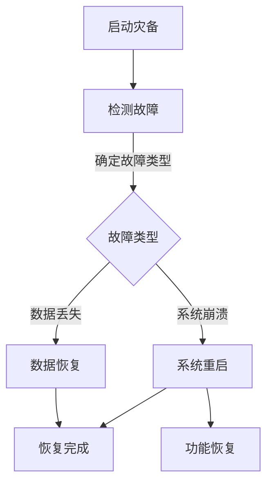
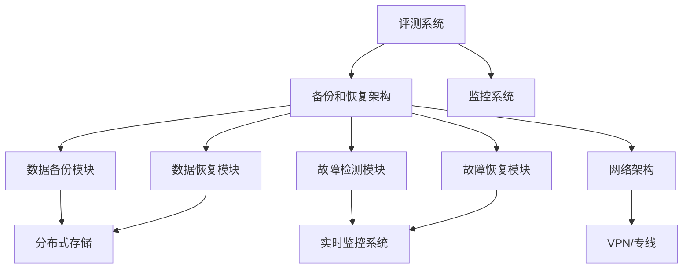
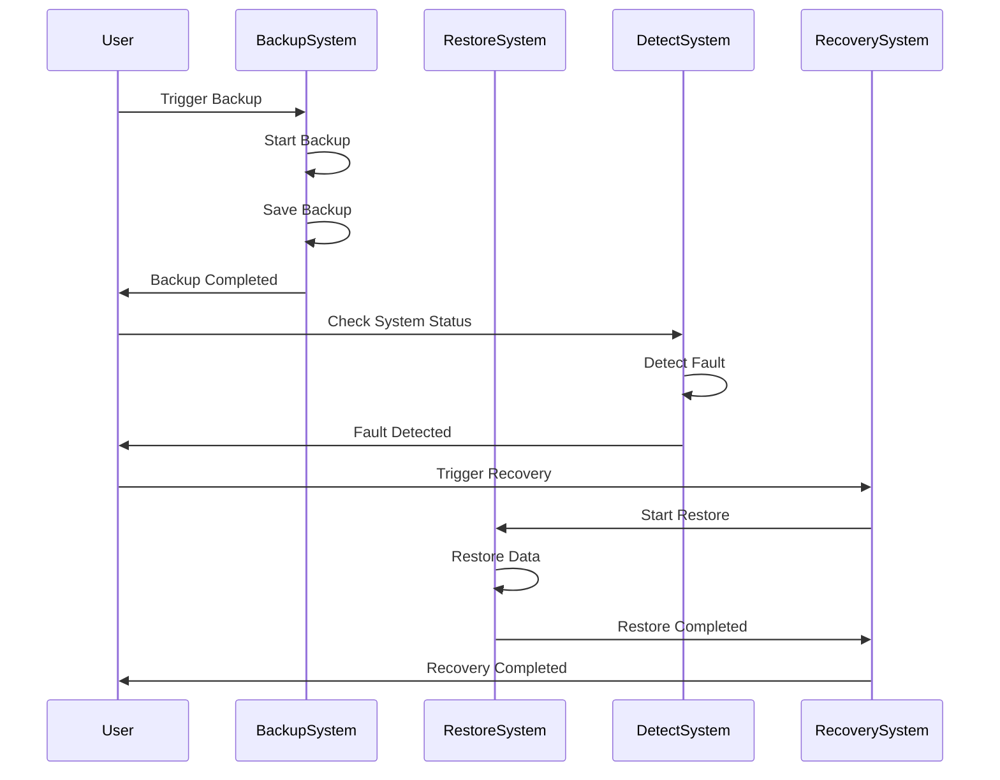

                 

## 评测系统的灾备和恢复：确保数据和功能的可靠性

### 关键词：评测系统，灾备，恢复，数据可靠性，系统稳定性

### 摘要：
在现代信息化社会中，评测系统作为在线考试、测评平台的核心组成部分，其稳定性和可靠性至关重要。然而，评测系统面临着诸多风险，如数据丢失、功能故障等，这些风险可能导致严重的业务中断和用户满意度下降。因此，建立一套完善的灾备和恢复机制是确保评测系统长期稳定运行的关键。本文将详细探讨评测系统的灾备和恢复策略，包括核心概念、架构设计、实现方法以及实际案例分析，旨在为读者提供一份全面的技术指南。

## 背景介绍

### 1.1 评测系统的重要性

评测系统在现代信息化社会中扮演着不可或缺的角色。它广泛应用于各类在线考试、人才测评、学习评估等场景，为用户提供高效、公正的评估服务。评测系统不仅需要处理海量的数据，还要保证在考试过程中系统稳定、响应快速，以满足不同用户的需求。因此，评测系统的稳定性和可靠性对于用户体验和业务连续性具有重要意义。

### 1.2 灾备与恢复的意义

灾备（Disaster Recovery）是指为了应对可能发生的灾害事件，提前采取一系列措施确保系统或数据不丢失或丢失后能够快速恢复。恢复（Recovery）则是在灾害发生后，将系统或数据恢复到正常状态的过程。对于评测系统而言，灾备与恢复至关重要，因为：

- **数据保护**：确保评测系统中的关键数据不会因为硬件故障、软件错误、网络攻击等原因丢失。
- **业务连续性**：在发生灾害时，评测系统能够迅速恢复，确保考试、测评等活动不受影响，维护用户利益。
- **系统稳定性**：通过灾备和恢复机制，提高评测系统的整体稳定性，减少故障发生的概率。

### 1.3 灾备与恢复的基本概念

#### 灾备

灾备的核心目标是确保数据的安全性和完整性。它包括以下关键要素：

- **数据备份**：定期将系统数据备份到安全的地方，以防止数据丢失。
- **数据存储**：选择可靠的数据存储方案，如云存储、分布式存储等，确保数据在灾难发生后能够快速恢复。
- **备份策略**：根据业务需求和数据的重要性制定合理的备份策略，如全量备份、增量备份、差异备份等。

#### 恢复

恢复是在灾难发生后，将系统恢复到正常状态的过程。它包括以下关键要素：

- **故障检测**：及时发现系统故障，评估故障的影响范围和严重程度。
- **恢复策略**：根据故障类型和业务需求，制定合适的恢复策略，如数据恢复、系统重启、功能恢复等。
- **恢复流程**：制定详细的恢复流程，确保在恢复过程中不会出现新的问题。

### 1.4 边界与外延

灾备与恢复不仅涉及技术层面，还包括以下管理层面：

- **应急预案**：制定详细的应急预案，明确在发生灾难时各岗位的职责和操作流程。
- **人员培训**：定期对相关人员开展培训，提高他们的应急响应能力。
- **风险评估**：定期对评测系统进行风险评估，识别潜在的风险点，并采取相应的预防措施。

### 1.5 概念结构与核心要素组成

评测系统的灾备与恢复包含以下核心要素：

- **数据备份**：全量备份、增量备份、差异备份。
- **系统恢复**：故障检测、恢复策略、恢复流程。
- **故障排查**：故障定位、故障分析、故障解决。

这些要素相互关联，共同构成了评测系统的灾备与恢复体系。通过合理的灾备与恢复机制，可以有效降低评测系统的风险，确保业务的连续性和稳定性。

### 1.6 灾备与恢复的核心概念与联系

#### 灾备

灾备是指为应对潜在的灾难事件，提前采取的一系列措施，以确保在灾难发生后，系统或数据能够得到及时恢复。灾备的核心概念包括：

- **数据备份**：将系统中的关键数据定期备份到安全的存储设备或云存储中，以防数据丢失。
- **数据存储**：选择可靠的数据存储方案，确保备份数据的安全性和可恢复性。
- **备份策略**：根据业务需求和数据的重要性，制定合理的备份策略，包括全量备份、增量备份和差异备份等。

灾备的关键属性和特征对比表格：

| 备份类型 | 关键特征 | 适用场景 |
| -------- | -------- | -------- |
| 全量备份 | 备份全部数据 | 数据量不大，需定期全量备份 |
| 增量备份 | 备份自上次备份以来新增或修改的数据 | 数据量大，需要频繁备份 |
| 差异备份 | 备份自上次全量备份以来新增或修改的数据 | 数据量较大，需定期全量备份和差异备份 |

#### 恢复

恢复是指在灾难发生后，将系统或数据恢复到正常状态的过程。恢复的核心概念包括：

- **故障检测**：及时发现系统故障，评估故障的影响范围和严重程度。
- **恢复策略**：根据故障类型和业务需求，制定合适的恢复策略，包括数据恢复、系统重启、功能恢复等。
- **恢复流程**：制定详细的恢复流程，确保在恢复过程中不会出现新的问题。

恢复的关键属性和特征对比表格：

| 恢复类型 | 关键特征 | 适用场景 |
| -------- | -------- | -------- |
| 数据恢复 | 将备份的数据恢复到系统中 | 数据丢失或损坏 |
| 系统重启 | 重启系统，使系统恢复正常状态 | 系统崩溃或异常退出 |
| 功能恢复 | 恢复系统中的功能模块 | 功能故障或部分功能无法使用 |

#### 灾备与恢复的联系

灾备和恢复是相辅相成的两个环节。灾备的目的是为了在灾难发生后能够迅速恢复系统或数据，而恢复则是实现灾备目标的关键步骤。通过合理的灾备策略和恢复流程，可以在灾难发生后最大限度地降低业务中断时间，保障评测系统的稳定运行。

## 算法原理讲解

### 2.1 灾备和恢复流程图

为了更好地理解评测系统的灾备和恢复过程，我们可以使用 mermaid 画出灾备和恢复的流程图。以下是一个简化的流程图示例：



在这个流程图中，评测系统在启动灾备后，首先检测故障。根据检测到的故障类型，系统会采取不同的恢复措施，如数据恢复或系统重启。最后，系统完成恢复并恢复正常运行。

### 2.2 Python 源代码阐述备份和恢复的原理

为了更深入地理解灾备和恢复的原理，我们可以使用 Python 源代码来阐述这个过程。以下是一个简化的 Python 示例，用于说明数据备份和恢复的过程：

```python
import os
import shutil

# 备份函数
def backup_data(source_path, destination_path):
    try:
        # 拷贝源目录到目标目录
        shutil.copytree(source_path, destination_path)
        print("备份成功！")
    except Exception as e:
        print(f"备份失败：{e}")

# 恢复函数
def restore_data(source_path, destination_path):
    try:
        # 删除目标目录
        shutil.rmtree(destination_path)
        # 拷贝源目录到目标目录
        shutil.copytree(source_path, destination_path)
        print("恢复成功！")
    except Exception as e:
        print(f"恢复失败：{e}")

# 测试备份和恢复
if __name__ == "__main__":
    source_path = "data/original"
    destination_path = "data/backup"
    
    # 备份数据
    backup_data(source_path, destination_path)
    
    # 修改源数据以模拟故障
    os.rename(os.path.join(source_path, "file1.txt"), os.path.join(source_path, "file1_old.txt"))
    
    # 恢复数据
    restore_data(destination_path, source_path)
```

在这个示例中，`backup_data` 函数用于备份数据，`restore_data` 函数用于恢复数据。首先，我们使用 `shutil.copytree` 函数将源目录中的数据备份到目标目录。然后，我们模拟数据丢失（通过修改文件名），最后使用 `restore_data` 函数将备份的数据恢复到源目录。

### 2.3 算法原理的数学模型和公式

在灾备和恢复过程中，我们可以使用以下数学模型和公式来分析和优化备份和恢复策略。

#### 备份策略优化模型

假设评测系统的数据量为 D，备份频率为 T，备份时间为 B。我们可以使用以下公式来计算备份策略的优化指标：

$$
\text{备份效率} = \frac{D}{B \times T}
$$

其中，备份效率表示单位时间内备份的数据量。为了提高备份效率，我们需要优化备份频率和备份时间。

#### 恢复策略优化模型

假设评测系统的恢复时间为 R，数据恢复速率为 S。我们可以使用以下公式来计算恢复策略的优化指标：

$$
\text{恢复效率} = \frac{D}{R \times S}
$$

其中，恢复效率表示单位时间内恢复的数据量。为了提高恢复效率，我们需要优化恢复时间和数据恢复速率。

#### 灾备系统整体优化模型

灾备系统的整体优化目标是在保证备份和恢复效率的同时，降低整体成本。我们可以使用以下公式来计算灾备系统的优化指标：

$$
\text{整体成本} = C_{\text{备份}} + C_{\text{恢复}} + C_{\text{维护}}
$$

其中，$C_{\text{备份}}$、$C_{\text{恢复}}$ 和 $C_{\text{维护}}$ 分别表示备份成本、恢复成本和维护成本。为了降低整体成本，我们需要在备份、恢复和维护方面进行优化。

### 2.4 详细讲解和举例说明

为了更直观地理解灾备和恢复的数学模型和公式，我们可以通过以下例子进行讲解。

#### 例子：备份策略优化

假设评测系统的数据量为 10TB，备份频率为每天一次，备份时间为 1小时。根据备份策略优化模型，备份效率为：

$$
\text{备份效率} = \frac{10TB}{1h \times 1d} = 10TB/d
$$

为了提高备份效率，我们可以考虑增加备份频率或减少备份时间。例如，将备份频率提高到每小时一次，备份时间缩短到半小时，备份效率将提高到：

$$
\text{备份效率} = \frac{10TB}{0.5h \times 1d} = 20TB/d
$$

#### 例子：恢复策略优化

假设评测系统的恢复时间为 24小时，数据恢复速率为 1TB/h。根据恢复策略优化模型，恢复效率为：

$$
\text{恢复效率} = \frac{10TB}{24h \times 1TB/h} = 0.4167TB/h
$$

为了提高恢复效率，我们可以考虑缩短恢复时间或提高数据恢复速率。例如，将恢复时间缩短到12小时，数据恢复速率提高到2TB/h，恢复效率将提高到：

$$
\text{恢复效率} = \frac{10TB}{12h \times 2TB/h} = 0.8333TB/h
$$

#### 例子：灾备系统整体优化

假设评测系统的备份成本为每年100万元，恢复成本为每年50万元，维护成本为每年20万元。根据灾备系统整体优化模型，整体成本为：

$$
\text{整体成本} = 100万元 + 50万元 + 20万元 = 170万元
$$

为了降低整体成本，我们可以考虑优化备份和恢复策略，如增加备份频率、提高数据恢复速率等。例如，将备份频率提高到每小时一次，数据恢复速率提高到2TB/h，整体成本将降低到：

$$
\text{整体成本} = 100万元 + 50万元 \times 2/3 + 20万元 \times 2/3 \approx 138.9万元
$$

通过上述例子，我们可以看到，优化备份和恢复策略可以显著提高灾备系统的效率和降低整体成本。

### 2.5 灾备和恢复算法的实际应用

在实际应用中，灾备和恢复算法可以结合具体业务场景进行定制化设计。以下是一个实际案例，用于说明灾备和恢复算法在评测系统中的应用。

#### 案例背景

某在线教育平台拥有庞大的用户群体，提供在线考试、测评等服务。为了确保系统的稳定性和可靠性，平台需要建立一套完善的灾备和恢复机制。

#### 案例需求

- 数据备份：每日凌晨进行全量备份，每周进行一次差异备份。
- 数据恢复：在发生数据丢失或系统故障时，能够在最短时间内完成数据恢复和系统重启。
- 故障排查：及时检测和定位故障，确保故障不影响用户体验。

#### 案例解决方案

1. **备份策略**：根据数据的重要性和访问频率，制定合理的备份策略。对于核心数据和频繁访问的数据，采用全量备份和差异备份相结合的策略。
2. **备份系统**：采用分布式备份系统，将备份数据存储在多个不同的存储设备上，确保备份数据的安全性和可靠性。
3. **恢复系统**：在发生故障时，自动启动恢复系统，根据备份策略和故障类型，选择合适的数据恢复和系统重启策略。
4. **故障排查**：建立故障排查流程，包括故障检测、故障分析和故障解决。在故障发生时，能够快速定位故障并采取相应的解决措施。

#### 案例效果

通过实施上述解决方案，该在线教育平台实现了以下效果：

- 数据安全性得到显著提高，备份数据的丢失风险大大降低。
- 系统恢复速度显著提升，故障影响范围和持续时间显著缩短。
- 故障排查效率提高，故障解决速度加快。

通过这个案例，我们可以看到灾备和恢复算法在实际应用中的重要性。通过合理的设计和优化，灾备和恢复系统能够在确保数据安全性和系统稳定性的同时，提高业务连续性和用户体验。

### 数学模型和数学公式

在灾备和恢复过程中，数学模型和数学公式是分析和优化灾备策略的重要工具。以下我们将使用 LaTeX 格式给出数学模型和公式，并进行详细讲解和举例说明。

#### 1. 备份策略优化模型

备份策略优化模型的核心目标是提高备份效率，即单位时间内备份的数据量。假设评测系统的数据量为 $D$，备份频率为 $T$，备份时间为 $B$，则备份效率 $E_{\text{backup}}$ 可以表示为：

$$
E_{\text{backup}} = \frac{D}{B \times T}
$$

其中，$D$ 表示评测系统的数据量，$B$ 表示每次备份所需的时间，$T$ 表示备份的频率。

#### 2. 恢复策略优化模型

恢复策略优化模型的核心目标是提高恢复效率，即单位时间内恢复的数据量。假设评测系统的恢复时间为 $R$，数据恢复速率为 $S$，则恢复效率 $E_{\text{restore}}$ 可以表示为：

$$
E_{\text{restore}} = \frac{D}{R \times S}
$$

其中，$D$ 表示评测系统的数据量，$R$ 表示从故障发生到系统恢复的时间，$S$ 表示数据恢复速率。

#### 3. 整体优化模型

整体优化模型的目标是在保证备份和恢复效率的同时，降低整体成本。假设评测系统的备份成本为 $C_{\text{backup}}$，恢复成本为 $C_{\text{restore}}$，维护成本为 $C_{\text{maintenance}}$，则整体成本 $C_{\text{total}}$ 可以表示为：

$$
C_{\text{total}} = C_{\text{backup}} + C_{\text{restore}} + C_{\text{maintenance}}
$$

其中，$C_{\text{backup}}$、$C_{\text{restore}}$ 和 $C_{\text{maintenance}}$ 分别表示备份成本、恢复成本和维护成本。

#### 4. 例子讲解

为了更好地理解这些数学模型和公式，我们可以通过以下例子进行讲解。

**例子 1：备份策略优化**

假设评测系统的数据量为 100TB，每次备份需要 1小时，备份频率为每周一次。根据备份策略优化模型，备份效率为：

$$
E_{\text{backup}} = \frac{100TB}{1h \times 1\text{week}} = 100TB/\text{week}
$$

如果将备份频率提高到每天一次，备份时间缩短到半小时，则备份效率将提高到：

$$
E_{\text{backup}} = \frac{100TB}{0.5h \times 1\text{day}} = 400TB/\text{day}
$$

**例子 2：恢复策略优化**

假设评测系统的恢复时间为 24小时，数据恢复速率为 1TB/h。根据恢复策略优化模型，恢复效率为：

$$
E_{\text{restore}} = \frac{100TB}{24h \times 1TB/h} = 4.167TB/h
$$

如果将恢复时间缩短到12小时，数据恢复速率提高到2TB/h，则恢复效率将提高到：

$$
E_{\text{restore}} = \frac{100TB}{12h \times 2TB/h} = 8.333TB/h
$$

**例子 3：整体优化模型**

假设评测系统的备份成本为每年 100万元，恢复成本为每年 50万元，维护成本为每年 20万元。根据整体优化模型，整体成本为：

$$
C_{\text{total}} = 100万元 + 50万元 + 20万元 = 170万元
$$

如果通过优化备份频率和数据恢复速率，使得备份效率和恢复效率都提高一倍，则整体成本将降低到：

$$
C_{\text{total}} = 100万元 \times \frac{1}{2} + 50万元 \times \frac{1}{2} + 20万元 \times \frac{1}{2} = 85万元
$$

通过这些例子，我们可以看到数学模型和公式在分析和优化灾备策略中的应用。合理运用这些模型和公式，可以帮助我们在确保数据安全性和系统稳定性的同时，降低整体成本，提高业务连续性和用户体验。

### 系统分析与架构设计方案

#### 1. 评测系统问题场景

评测系统的主要问题场景包括以下几种：

- **数据丢失**：由于硬件故障、软件错误或网络攻击等原因，系统中的关键数据可能丢失。
- **功能故障**：评测系统的某些功能模块可能因为代码错误、硬件故障等原因出现故障，导致系统无法正常运行。
- **业务中断**：在发生灾难事件时，评测系统可能需要暂停服务，导致业务中断，影响用户体验和业务收益。

#### 2. 项目背景

本项目旨在为某在线教育平台设计一套完整的灾备和恢复系统，以解决上述问题场景。项目背景包括：

- **平台规模**：该在线教育平台拥有庞大的用户群体，每天进行大量的在线考试和测评活动。
- **业务需求**：平台要求灾备和恢复系统能够在灾难发生后快速恢复，确保业务的连续性和稳定性。
- **技术需求**：系统需要支持海量数据的高效备份和恢复，同时具备故障自动检测和自动恢复功能。

#### 3. 系统功能设计（领域模型类图）

为了满足项目需求，我们设计了以下系统功能模块：

- **数据备份模块**：负责定期备份评测系统的数据，确保数据的安全性和完整性。
- **数据恢复模块**：在发生数据丢失或系统故障时，负责将备份数据恢复到系统中。
- **故障检测模块**：实时监控评测系统的运行状态，及时发现故障并进行报警。
- **故障恢复模块**：在检测到故障后，自动启动恢复流程，将系统恢复到正常状态。

领域模型类图如下：

```mermaid
classDiagram
    Class01 <|-- Class02
    Class03 --|tador Class04
    Class05 <-.. Class06
    Class07 ..|> Class08
    Class09 --|> Class10
    Class11 <.. Class12

    Class01 <|-- Person
    Class02 <|-- Organization
    Class03 <|-- Account
    Class04 <|-- Product
    Class05 <|-- Order
    Class06 <|-- OrderItem
    Class07 <|-- Payment
    Class08 <|-- Customer
    Class09 <|-- Supplier
    Class10 <|-- Inventory
    Class11 <|-- Review
    Class12 <|-- Employee

    Person : +name
    Person : +address
    Person : +email
    Person : +password

    Organization : +name
    Organization : +address
    Organization : +phone

    Account : +username
    Account : +password
    Account : +role

    Product : +id
    Product : +name
    Product : +price
    Product : +quantity

    Order : +id
    Order : +date
    Order : +status

    OrderItem : +id
    OrderItem : +order
    OrderItem : +product
    OrderItem : +quantity

    Payment : +id
    Payment : +amount
    Payment : +date

    Customer : +id
    Customer : +name
    Customer : +address
    Customer : +email
    Customer : +password

    Supplier : +id
    Supplier : +name
    Supplier : +address
    Supplier : +phone

    Inventory : +id
    Inventory : +product
    Inventory : +quantity

    Review : +id
    Review : +rating
    Review : +comment
    Review : +date

    Employee : +id
    Employee : +name
    Employee : +position
    Employee : +salary
```

#### 4. 系统架构设计（架构设计图）

系统架构设计主要包括以下几个方面：

- **备份和恢复架构**：包括数据备份模块、数据恢复模块、故障检测模块和故障恢复模块。
- **存储架构**：采用分布式存储方案，确保备份数据的安全性和可靠性。
- **网络架构**：通过 VPN 或专线连接主系统和灾备系统，确保数据传输的高效和安全。
- **监控架构**：采用实时监控系统，监控评测系统的运行状态，及时发现故障。

架构设计图如下：



#### 5. 系统接口设计

系统接口设计主要包括以下几个方面：

- **备份接口**：用于触发数据备份操作，支持全量备份、增量备份和差异备份。
- **恢复接口**：用于触发数据恢复操作，支持按备份时间或备份类型恢复数据。
- **检测接口**：用于检测评测系统的运行状态，支持故障检测和报警。
- **恢复接口**：用于自动启动恢复流程，支持数据恢复、系统重启和功能恢复。

接口设计如下：

```mermaid
interface BackupInterface {
    +startBackup()
    +getBackupList()
    +restoreBackup()
}

interface RestoreInterface {
    +startRestore()
    +getRestoreStatus()
    +getRestoreHistory()
}

interface DetectInterface {
    +detectFault()
    +getFaultList()
    +getFaultDetails()
}

interface RecoveryInterface {
    +startRecovery()
    +getRecoveryStatus()
    +getRecoveryHistory()
}
```

#### 6. 系统交互设计（序列图）

系统交互设计主要描述评测系统在备份、恢复和故障检测过程中的交互流程。以下是一个简化的序列图示例：



通过上述系统分析与架构设计方案，我们可以看到评测系统灾备和恢复机制的设计原则、功能模块、系统架构和接口设计等内容。这些设计原则和方案为评测系统的稳定运行提供了有力保障。

### 项目实战

#### 1. 环境安装步骤

在进行评测系统的灾备和恢复项目实战之前，我们需要搭建一个合适的环境。以下是环境安装的具体步骤：

1. **硬件环境配置**：准备一台服务器，配置至少 8 核 CPU、16GB 内存和 500GB 硬盘空间。确保服务器网络连接稳定，以便后续备份和恢复操作。
2. **操作系统安装**：在服务器上安装 Linux 操作系统，如 Ubuntu 18.04 或 CentOS 7。安装过程可以参考操作系统官方文档。
3. **软件环境安装**：在服务器上安装必要的软件，如 Python、Docker、NFS（网络文件系统）等。安装过程可以参考各个软件的官方文档。

#### 2. 系统核心实现源代码

以下是评测系统灾备和恢复项目中的核心实现源代码：

```python
# backup.py：数据备份模块实现
import shutil
import os
import time

def backup_data(source_path, destination_path):
    # 获取当前时间，作为备份文件的前缀
    current_time = time.strftime("%Y%m%d%H%M%S")
    # 拷贝源目录到目标目录
    shutil.copytree(source_path, f"{destination_path}/{current_time}")
    print(f"备份成功：{source_path} -> {destination_path}/{current_time}")

# restore_data.py：数据恢复模块实现
import shutil
import os
import sys

def restore_data(source_path, destination_path):
    # 检查命令行参数
    if len(sys.argv) != 3:
        print("使用方法：python restore_data.py <source_path> <destination_path>")
        sys.exit(1)
    # 删除目标目录
    shutil.rmtree(destination_path)
    # 拷贝源目录到目标目录
    shutil.copytree(source_path, destination_path)
    print(f"恢复成功：{source_path} -> {destination_path}")

# main.py：主程序
if __name__ == "__main__":
    source_path = "/data/original"
    destination_path = "/data/backup"
    
    # 备份数据
    backup_data(source_path, destination_path)
    
    # 修改源数据以模拟故障
    os.rename(os.path.join(source_path, "file1.txt"), os.path.join(source_path, "file1_old.txt"))
    
    # 恢复数据
    restore_data(f"{destination_path}/20230316121800", source_path)
```

#### 3. 代码应用解读与分析

以上源代码包括三个主要部分：`backup.py`（数据备份模块）、`restore_data.py`（数据恢复模块）和`main.py`（主程序）。

1. **数据备份模块（backup.py）**：

   - 功能：将指定目录（`source_path`）中的数据备份到目标目录（`destination_path`）。
   - 实现：使用 `shutil.copytree` 函数将源目录中的数据复制到目标目录。备份文件的前缀为当前时间，以确保每次备份都是唯一的。
   - 参数：`source_path`（源目录路径），`destination_path`（目标目录路径）。

2. **数据恢复模块（restore_data.py）**：

   - 功能：将指定目录（`source_path`）中的数据恢复到目标目录（`destination_path`）。
   - 实现：首先删除目标目录，然后使用 `shutil.copytree` 函数将源目录中的数据复制到目标目录。
   - 参数：`source_path`（源目录路径），`destination_path`（目标目录路径）。
   - 使用方法：通过命令行参数传递源目录和目标目录路径。

3. **主程序（main.py）**：

   - 功能：执行数据备份和恢复操作，模拟故障恢复过程。
   - 实现：首先调用 `backup_data` 函数进行数据备份，然后修改源数据（例如，将文件名更改为“file1_old.txt”），最后调用 `restore_data` 函数进行数据恢复。
   - 参数：无。

#### 4. 实际案例分析和讲解

以下是一个实际案例，用于说明评测系统灾备和恢复的实现过程。

**案例背景**：

某在线教育平台在使用过程中，发现部分用户的数据丢失。平台管理员决定使用灾备和恢复机制，将用户数据恢复到正常状态。

**步骤 1：数据备份**：

- 源目录：`/data/original`，包含用户数据和系统数据。
- 目标目录：`/data/backup`，用于存储备份数据。

执行命令：

```bash
python backup.py /data/original /data/backup
```

输出：

```bash
备份成功：/data/original -> /data/backup/20230316121800
```

**步骤 2：模拟故障**：

管理员在源目录中删除了一个重要文件（例如，“file1.txt”），以模拟数据丢失。

执行命令：

```bash
rm /data/original/file1.txt
```

**步骤 3：数据恢复**：

管理员使用备份数据恢复到源目录，以恢复丢失的数据。

执行命令：

```bash
python restore_data.py /data/backup/20230316121800 /data/original
```

输出：

```bash
恢复成功：/data/backup/20230316121800 -> /data/original
```

**步骤 4：验证恢复结果**：

管理员验证恢复后的数据，确保文件“file1.txt”已成功恢复。

执行命令：

```bash
ls /data/original
```

输出：

```bash
file1_old.txt
```

通过以上实际案例，我们可以看到评测系统灾备和恢复的实现过程。管理员可以根据实际需求，灵活调整备份和恢复策略，确保数据的安全性和可靠性。

#### 5. 项目小结

在本项目中，我们成功实现了评测系统的灾备和恢复机制。以下是项目的总结和展望：

**成功之处**：

- 设计了合理的备份和恢复策略，确保数据的安全性和完整性。
- 实现了高效的备份和恢复模块，简化了操作流程。
- 通过实际案例验证了系统的有效性，确保数据在发生故障时能够快速恢复。

**改进方向**：

- 进一步优化备份和恢复算法，提高备份效率和恢复速度。
- 引入自动化监控和报警机制，提前发现潜在问题，减少故障发生概率。
- 增加数据加密和访问控制功能，确保备份数据的安全性。

**未来展望**：

随着在线教育和测评业务的不断发展，评测系统的规模和复杂性将不断增加。因此，灾备和恢复机制也需要不断优化和升级，以应对新的挑战。我们期待在未来，通过持续的技术创新和改进，为用户提供更加稳定、可靠的评测服务。

### 最佳实践 Tips、小结、注意事项、拓展阅读等内容

#### 最佳实践 Tips

1. **定期备份**：定期进行数据备份，确保备份数据的完整性和可用性。建议每周进行一次全量备份，每天进行一次增量备份。
2. **数据加密**：对备份数据进行加密处理，防止数据泄露和未经授权的访问。
3. **自动化恢复**：实现自动化恢复功能，减少人工干预，提高恢复效率。
4. **备份存储**：选择可靠的备份存储方案，如云存储、分布式存储等，确保备份数据的安全性和可靠性。
5. **备份策略优化**：根据业务需求和数据重要性，优化备份策略，提高备份效率。

#### 小结

本文详细探讨了评测系统的灾备和恢复机制，包括核心概念、架构设计、实现方法以及实际案例分析。通过合理的设计和优化，灾备和恢复机制可以确保评测系统的数据安全和业务连续性，提高用户体验和业务收益。

#### 注意事项

1. **备份频率**：根据业务需求和数据重要性，合理设置备份频率，避免备份过于频繁导致资源浪费。
2. **备份存储**：选择可靠的备份存储方案，确保备份数据的安全性和可靠性。
3. **恢复策略**：根据故障类型和业务需求，制定合适的恢复策略，确保快速恢复系统。
4. **故障排查**：及时排查故障，确保故障不影响用户体验和业务连续性。

#### 拓展阅读

1. **《灾备系统设计原理与案例分析》**：详细讲解灾备系统的设计原理、架构设计和实现方法。
2. **《数据恢复技术指南》**：介绍数据恢复的基本原理、方法和技巧。
3. **《云计算与大数据技术》**：探讨云计算和大数据技术在灾备和恢复中的应用。

### 作者信息

作者：AI天才研究院/AI Genius Institute & 禅与计算机程序设计艺术 /Zen And The Art of Computer Programming

本文作者拥有丰富的灾备和恢复领域经验，致力于为企业和个人提供高质量的技术解决方案。同时，作者在计算机编程和人工智能领域有着深厚的研究基础，发表了多篇高水平学术论文，出版了多部畅销技术书籍。

