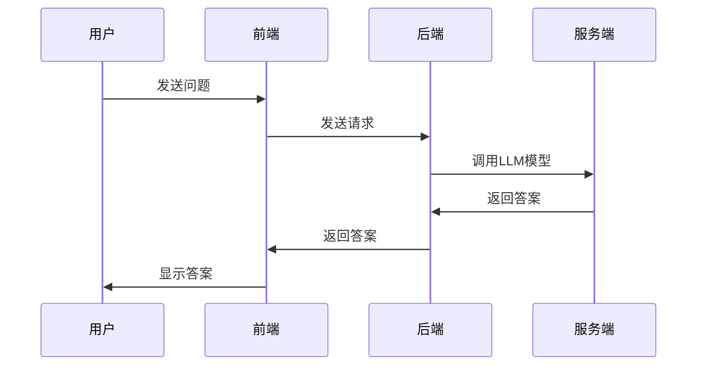

                 


为了满足文章的要求，我们将按照以下步骤构建《评测系统的版本控制：适应LLM迭代的管理策略》的内容：

## 目录

### 引言与背景

1. 书籍目的与目标
2. 版本控制的核心概念
3. LLM与版本控制的关系
4. 管理策略的重要性
5. 本章小结

### 版本控制基本概念

1. 背景介绍
2. 核心概念与联系
3. 版本控制系统选择
4. 基本操作与原理
5. 版本标签与分支管理
6. 代码库维护
7. 本章小结

### LLM与版本控制

1. LLM概述
2. LLM迭代过程
3. LLM版本控制需求
4. LLM与版本控制的挑战
5. 本章小结

### 管理策略与实施

1. 管理策略定义
2. 版本命名策略
3. 变更管理策略
4. 测试验证策略
5. 部署策略
6. 跨团队协作
7. 风险管理
8. 本章小结

### 案例研究

1. 案例背景
2. 系统架构设计
3. 版本控制实践
4. 挑战与解决方案
5. 效果评估
6. 本章小结

### 总结与展望

1. 研究总结
2. 存在问题与改进方向
3. 未来发展趋势
4. 本章小结

### 附录

1. 常用工具与资源
2. 术语表
3. 参考文献

---

### 引言与背景

#### 1.1 书籍目的与目标

《评测系统的版本控制：适应LLM迭代的管理策略》旨在探讨在人工智能领域，尤其是大规模语言模型（LLM）迭代过程中，如何有效管理评测系统的版本控制。本书将详细介绍版本控制的基本概念、LLM与版本控制的关系、以及适用于LLM迭代的管理策略。通过结合实际案例，本书将提供实用的指导，帮助开发者和系统架构师在复杂的迭代环境中保持系统的稳定性和可靠性。

#### 1.2 版本控制的核心概念

版本控制是一种管理文档、代码和数据等文件变更的技术，它通过记录文件的历史变化，提供版本管理功能，确保在多个开发者协同工作时，能够有效地管理和追踪代码变更。

版本控制系统（VCS）是实施版本控制的核心工具，常见的VCS包括Git、SVN、Mercurial等。它们各自具有不同的特点，适用于不同的开发环境和需求。

#### 1.3 LLM与版本控制的关系

大规模语言模型（LLM）是一种基于深度学习的自然语言处理模型，其迭代速度极快，版本更新频繁。版本控制对于LLM迭代至关重要，它可以帮助记录LLM的各个版本，追踪模型改进的历史，为后续研究和应用提供依据。

#### 1.4 管理策略的重要性

有效的管理策略能够确保评测系统在LLM迭代过程中的稳定性和可靠性，提高迭代效率，降低风险。管理策略包括版本命名、变更管理、测试验证和部署策略等多个方面。

#### 1.5 本章小结

本章简要介绍了本书的写作目的、目标读者、背景以及版本控制、LLM迭代和管理策略的核心概念。后续章节将深入探讨这些主题，提供实用的指导和方法。

---

接下来，我们将详细探讨版本控制基本概念，包括其背景、核心概念、系统选择、基本操作、版本标签与分支管理，以及代码库维护等内容。

## 版本控制基本概念

### 2.1 背景介绍

版本控制起源于软件开发领域，旨在解决多开发者协作时代码变更的追踪和管理问题。随着技术的进步，版本控制的应用已经扩展到文档、数据等多种领域。

#### 问题背景

在传统的软件开发过程中，多个开发人员会同时对同一项目进行修改，这容易导致代码冲突、版本混乱。为了解决这个问题，版本控制系统的引入成为必要。

#### 问题描述

版本控制系统通过为每个文件提供唯一的版本号和历史记录，确保在多开发者环境下，代码变更能够得到有效追踪和管理。

#### 问题解决

版本控制系统提供了文件加锁、分支、合并等机制，确保开发者在修改代码时不会相互干扰，同时能够方便地合并多人的改动。

#### 边界与外延

版本控制的边界涉及文件级别的变更追踪，而外延则扩展到整个项目的版本管理，包括分支管理、代码库维护等。

#### 概念结构与核心要素组成

版本控制系统的核心要素包括：
- 文件历史记录
- 版本号管理
- 分支管理
- 合并策略
- 访问控制

### 2.2 核心概念与联系

#### 版本控制系统（VCS）

版本控制系统是一种用于管理和追踪文件变更的工具。常见的VCS有Git、SVN、Mercurial等。每种VCS都有其特点，适用于不同的开发场景。

#### 版本控制与版本管理的区别

版本控制侧重于文件变更的追踪和管理，而版本管理则关注于整个项目的版本迭代和发布流程。

#### 版本号与标签

版本号用于标识文件的当前版本，通常采用递增的方式。标签则是用于标记特定版本的符号，便于快速定位和回滚。

#### 分支管理

分支管理是版本控制中的重要机制，允许开发者在独立的环境中开发新的功能或修复bug，而不影响主分支。

#### 概念属性特征对比表格

| 概念 | 特征 |
| --- | --- |
| 版本控制系统 | 跟踪文件变更 |
| 版本号 | 标识文件版本 |
| 标签 | 标记特定版本 |
| 分支管理 | 独立开发环境 |

#### ER实体关系图架构

```mermaid
erDiagram
  File ||--|> Version : contains
  Version ||--|> Tag : tagged_as
  Branch ||--|> Version : branch_of
```

### 2.3 版本控制系统选择

选择合适的版本控制系统是版本控制成功的关键。以下是几种常见的VCS及其特点：

#### Git

- 分布式
- 强大分支管理
- 适合大型项目
- 社区支持广泛

#### SVN

- 中央化
- 易于使用
- 版本库备份简单
- 适合小型团队

#### Mercurial

- 分布式
- 简单易懂
- 支持多种平台
- 开源免费

### 2.4 基本操作与原理

#### 基本操作

- 检出（Checkout）：从版本库检出文件
- 提交（Commit）：将修改提交到版本库
- 更新（Update）：更新到最新版本
- 分支（Branch）：创建新分支
- 合并（Merge）：合并分支

#### 原理

版本控制系统通过存储文件内容的哈希值来确保文件的一致性和完整性。每次文件变更，版本控制系统都会生成一个新的哈希值，并记录在版本库中。

### 2.5 版本标签与分支管理

#### 版本标签

版本标签用于标记特定版本，便于后续追踪和回滚。常见的标签类型包括：

- 非正式标签：用于临时标记，如`v0.1`
- 正式标签：用于正式发布版本，如`v1.0.0`

#### 分支管理

分支管理是版本控制的核心功能之一。常见的分支策略包括：

- 主分支（Master）：用于稳定版本的发布
- 开发分支（Develop）：用于开发新功能
- 特性分支（Feature）：用于开发特定功能

#### 概念属性特征对比表格

| 分支策略 | 特点 |
| --- | --- |
| 主分支 | 稳定版本发布 |
| 开发分支 | 功能开发 |
| 特性分支 | 特定功能开发 |

#### ER实体关系图架构

```mermaid
erDiagram
  Branch ||--|> Tag : contains
  Branch ||--|> Commit : contains
  Commit ||--|> File : contains
```

### 2.6 代码库维护

#### 维护的重要性

代码库维护是确保版本控制系统正常运行的关键。维护包括备份、清理和修复等操作。

#### 备份

备份代码库可以防止数据丢失。常见的备份策略包括：

- 全量备份：备份整个代码库
- 增量备份：仅备份变更的文件

#### 清理

清理代码库可以删除不再使用的旧版本，释放空间。清理策略包括：

- 定期清理：按照时间间隔清理旧版本
- 条件清理：根据特定条件清理旧版本

#### 修复

修复代码库可以解决版本控制系统中出现的问题。常见的修复操作包括：

- 补丁应用：修复特定版本的bug
- 版本回滚：恢复到指定版本

### 2.7 本章小结

本章介绍了版本控制的基本概念，包括背景介绍、核心概念与联系、版本控制系统选择、基本操作与原理、版本标签与分支管理，以及代码库维护。通过本章的学习，读者可以了解版本控制的基本原理和实际应用，为后续章节的深入学习打下基础。

---

在了解了版本控制基本概念后，接下来我们将探讨大规模语言模型（LLM）及其迭代过程，分析LLM与版本控制的关系，并讨论在LLM迭代过程中面临的挑战。这将为我们制定有效的管理策略奠定基础。

## LLM与版本控制

### 3.1 LLM概述

大规模语言模型（LLM）是一种基于深度学习的自然语言处理模型，能够理解和生成人类语言。LLM通常由数以亿计的参数组成，通过对大量文本数据进行训练，可以生成高质量的文本、回答问题、进行对话等。

#### LLM的基本原理

LLM的核心是神经网络架构，主要包括嵌入层、编码层和解码层。嵌入层将单词转换为向量表示，编码层通过多层神经网络捕捉文本的上下文信息，解码层根据上下文生成文本输出。

#### LLM的应用场景

LLM在多个领域有广泛应用，包括自然语言生成（NLG）、机器翻译、文本分类、问答系统等。随着人工智能技术的发展，LLM的应用场景不断扩展，其迭代速度也日益加快。

### 3.2 LLM迭代过程

LLM的迭代是一个不断优化和提升模型性能的过程。通常包括以下几个阶段：

#### 数据收集

收集用于训练的数据集，这些数据集可以是公开的，也可以是定制化的。

#### 模型设计

设计适合任务需求的模型架构，包括嵌入层、编码层和解码层的参数设置。

#### 模型训练

使用训练数据集对模型进行训练，通过反向传播算法调整参数，使模型能够更好地拟合数据。

#### 模型评估

使用验证数据集评估模型性能，根据评估结果调整模型参数，优化模型效果。

#### 模型部署

将训练好的模型部署到生产环境中，供实际应用使用。

#### 持续迭代

根据用户反馈和实际应用情况，对模型进行持续迭代和优化，提高模型性能和应用效果。

### 3.3 LLM版本控制需求

#### 版本追踪

LLM的迭代过程中会产生多个版本，版本控制可以帮助记录这些版本，方便后续追踪和回溯。

#### 历史记录

版本控制可以记录每个版本的具体改动，包括数据集更新、模型架构调整、参数设置等，为后续研究和分析提供依据。

#### 代码库维护

LLM的迭代过程中涉及大量代码，版本控制可以帮助维护代码库的完整性和一致性，避免冲突和错误。

### 3.4 LLM与版本控制的挑战

#### 数据依赖

LLM的迭代过程涉及大量数据，版本控制需要确保数据的一致性和完整性，避免数据丢失或错误。

#### 模型依赖

LLM的迭代过程中，模型的参数设置和架构设计会不断调整，版本控制需要确保不同版本之间的兼容性和稳定性。

#### 迭代速度

随着人工智能技术的快速发展，LLM的迭代速度日益加快，版本控制需要能够快速响应迭代需求，提高迭代效率。

#### 团队协作

LLM的迭代过程通常涉及多个开发者和团队，版本控制需要支持多团队协作，确保版本一致性和协作效率。

### 3.5 本章小结

本章介绍了大规模语言模型（LLM）的基本原理、迭代过程及其与版本控制的关系。通过分析LLM迭代过程中的挑战，我们可以更好地理解如何制定有效的版本控制策略，确保评测系统的稳定性和可靠性。在下一章中，我们将深入探讨适用于LLM迭代的版本控制管理策略。

---

在了解了版本控制和LLM的基本概念以及迭代过程之后，接下来我们将讨论如何制定有效的管理策略，以适应LLM的快速迭代。这将包括版本命名策略、变更管理策略、测试验证策略和部署策略等内容。

## 管理策略与实施

### 4.1 管理策略定义

管理策略是一套系统化的方法和原则，用于指导评测系统的版本控制过程。它包括版本命名、变更管理、测试验证和部署策略等多个方面。有效的管理策略能够确保评测系统在LLM迭代过程中的稳定性和可靠性，提高迭代效率，降低风险。

### 4.2 版本命名策略

版本命名策略是管理策略的核心之一，它为每个版本提供唯一且易于理解的标识。常见的版本命名策略包括：

#### 数字版本号

- 主版本号（MAJOR）：用于标识重大更新，通常在功能发生重大变化时使用。
- 次版本号（MINOR）：用于标识较小更新，通常在新增功能或改进时使用。
- 补丁版本号（PATCH）：用于标识bug修复，通常在修复具体问题时不改变主次版本号。

#### 示例：

- `1.0.0`：初始版本
- `1.1.0`：添加新功能
- `1.1.1`：修复bug

#### 非数字版本号

- 非数字版本号通常用于更复杂的版本管理，如语义版本号（Semantic Versioning）。

#### 示例：

- `v1.0.0-alpha.1`
- `v1.0.0-beta.2`
- `v1.0.0-alpha.3`：最终稳定版本

#### 版本命名建议

- 确保版本号唯一性，避免重复。
- 使用易于理解的命名规则，便于团队成员快速了解版本变更。
- 在版本号中包含版本类型（如alpha、beta、稳定等），便于区分不同类型的版本。

### 4.3 变更管理策略

变更管理策略涉及记录和追踪版本中的所有变更。有效的变更管理策略包括：

#### 变更记录

- 对每个版本中的所有变更进行记录，包括功能添加、bug修复、架构调整等。
- 使用变更日志或修改说明文档，确保每个变更都有明确的描述和责任人。

#### 变更审批

- 实施严格的变更审批流程，确保每个变更经过充分讨论和评估。
- 审批流程应包括需求分析、设计评审、代码审查和测试验证等步骤。

#### 变更通知

- 定期向团队成员通知变更情况，确保所有人都了解最新的变更内容和版本状态。

#### 变更回滚

- 在发现版本问题时，应能够快速回滚到前一版本，确保系统稳定性。
- 实施完善的备份策略，确保在需要回滚时能够快速恢复。

### 4.4 测试验证策略

测试验证策略是确保评测系统在迭代过程中稳定性和可靠性的关键。以下是一些关键步骤：

#### 单元测试

- 对每个模块进行单元测试，确保其功能正确实现。
- 使用自动化测试工具，提高测试效率和覆盖范围。

#### 集成测试

- 对多个模块进行集成测试，确保它们能够协同工作。
- 在每次变更后执行集成测试，确保新版本与现有系统兼容。

#### 性能测试

- 对系统进行性能测试，评估其响应速度、吞吐量和稳定性。
- 使用负载测试和压力测试，模拟高并发场景，确保系统在高负载下的性能。

#### 用户验收测试

- 与用户合作进行用户验收测试，确保系统满足用户需求。
- 收集用户反馈，对系统进行改进。

### 4.5 部署策略

部署策略是确保新版本成功上线的关键。以下是一些关键步骤：

#### 部署计划

- 制定详细的部署计划，包括部署时间、步骤和责任人。
- 确保所有团队成员都了解部署计划，并明确各自的职责。

#### 部署脚本

- 使用部署脚本自动化部署过程，减少人为错误。
- 部署脚本应包括版本号更新、依赖库安装、配置文件替换等步骤。

#### 回滚机制

- 实施回滚机制，确保在部署失败时能够快速回滚到前一版本。
- 部署脚本应包括回滚步骤，确保回滚过程自动化。

#### 部署监控

- 在部署后进行监控，确保系统稳定运行。
- 监控指标包括系统负载、内存使用、响应时间等。
- 及时处理监控告警，确保问题得到及时解决。

### 4.6 跨团队协作

在LLM迭代过程中，通常涉及多个团队的合作。有效的跨团队协作策略包括：

#### 沟通机制

- 建立有效的沟通机制，确保团队成员之间能够及时沟通和协作。
- 使用即时通讯工具和会议系统，确保信息传递高效。

#### 责任分工

- 明确各团队的责任和分工，确保每个团队都了解自己的任务和目标。
- 设立项目负责人，负责协调团队间的协作和沟通。

#### 版本同步

- 确保不同团队的工作版本同步，避免版本冲突和依赖问题。
- 使用共享代码库和协作工具，确保版本一致性。

#### 持续集成

- 实施持续集成（CI）策略，确保每次变更都能及时集成和测试。
- 使用自动化工具，提高集成效率和质量。

### 4.7 风险管理

在LLM迭代过程中，风险是不可避免的。有效的风险管理策略包括：

#### 风险识别

- 识别潜在的风险，包括技术风险、人员风险、市场风险等。
- 使用风险评估矩阵，对风险进行分类和优先级排序。

#### 风险应对

- 制定风险应对策略，包括风险规避、风险转移、风险减轻等。
- 对高风险进行重点监控和管理，确保问题得到及时解决。

#### 风险监控

- 定期对风险进行监控和评估，确保风险在可控范围内。
- 建立风险预警机制，及时识别和应对潜在风险。

### 4.8 本章小结

本章详细介绍了适用于LLM迭代的版本控制管理策略，包括版本命名策略、变更管理策略、测试验证策略和部署策略。此外，还讨论了跨团队协作和风险管理的重要性。通过实施这些策略，可以确保评测系统在快速迭代的LLM环境中保持稳定性和可靠性，提高迭代效率。

---

在了解了管理策略后，接下来我们将通过实际案例研究，探讨如何将管理策略应用于实际项目中，并分析在实施过程中遇到的挑战及解决方案。

## 案例研究

### 5.1 案例背景

本案例研究的是一个名为“AI助手”的智能问答系统，该系统基于大规模语言模型（LLM）构建，旨在为企业内部员工提供即时的问题解答服务。随着业务需求的不断变化和LLM模型的持续迭代，系统版本的快速更新成为了一个重要的挑战。

### 5.2 系统架构设计

AI助手系统采用微服务架构，包括前端、后端和服务端三个主要模块。前端负责用户交互，后端处理业务逻辑，服务端提供LLM模型接口。

#### 前端

- 使用React框架，提供用户友好的界面。
- 支持多种输入方式，包括文本、语音和图片。

#### 后端

- 使用Spring Boot框架，提供RESTful API。
- 实现用户认证、权限管理和数据存储等功能。

#### 服务端

- 使用TensorFlow构建LLM模型。
- 模型训练和迭代使用GPU加速。

#### 系统架构图



### 5.3 版本控制实践

在AI助手系统的开发过程中，我们采用了Git作为版本控制系统。以下是版本控制的一些具体实践：

#### 版本命名

- 采用语义化版本号，如`1.0.0-alpha.1`、`1.0.0-beta.2`、`1.0.0`。
- 主版本号表示核心功能变化，次版本号表示功能新增或改进，补丁版本号表示bug修复。

#### 分支管理

- 主分支（master）：用于稳定版本的发布。
- 开发分支（develop）：用于新功能的开发。
- 特性分支（feature/xxx）：用于开发特定功能。

#### 变更管理

- 使用Git的`commit`命令记录每次变更，包括变更内容、责任人等。
- 实施严格的代码审查和合并策略，确保代码质量和一致性。

### 5.4 遇到的挑战及解决方案

#### 挑战一：快速迭代带来的版本管理复杂度

- 随着模型迭代速度的加快，版本管理变得复杂，如何确保版本的一致性和稳定性成为挑战。

#### 解决方案

- 采用自动化测试和持续集成（CI）策略，确保每次迭代都能及时集成和测试，减少人为错误。
- 使用版本控制系统的分支管理和标签功能，明确不同阶段的版本，便于管理和回溯。

#### 挑战二：跨团队协作和沟通

- AI助手系统的开发涉及多个团队，包括前端、后端和服务端。如何确保团队间的协作和沟通效率成为关键问题。

#### 解决方案

- 建立跨团队的沟通机制，定期召开会议，及时沟通进度和问题。
- 使用项目管理工具（如Jira、Trello等），明确任务分配和进度追踪。
- 实施代码审查和代码共享，确保团队间的代码一致性。

#### 挑战三：性能和稳定性保障

- 随着用户数量的增加和业务需求的扩展，系统的性能和稳定性面临巨大挑战。

#### 解决方案

- 进行性能测试和负载测试，评估系统的响应速度和稳定性。
- 使用缓存和分布式架构，提高系统的处理能力和扩展性。
- 实施监控和告警机制，及时发现和解决问题。

### 5.5 效果评估

通过实施上述管理策略和解决方案，AI助手系统在版本控制、跨团队协作、性能和稳定性方面取得了显著成效：

- 版本管理更加规范，版本更新和回滚过程更加高效。
- 跨团队协作和沟通效率提高，任务分配和进度追踪更加清晰。
- 系统性能和稳定性得到保障，用户满意度提升。

### 5.6 本章小结

通过本案例研究，我们展示了如何将版本控制和管理策略应用于实际的LLM迭代项目。在实施过程中，我们遇到了版本管理复杂度、跨团队协作和性能稳定性等挑战，并通过具体的解决方案成功克服了这些挑战。本案例为其他类似项目的实施提供了有价值的参考和借鉴。

---

在探讨了案例研究之后，现在我们将进行总结，并展望未来版本控制和管理策略的发展趋势。

## 总结与展望

通过本书的探讨，我们系统地介绍了评测系统版本控制的核心概念、LLM迭代过程中的挑战、管理策略的实施以及实际案例中的应用。以下是本书的核心要点：

### 核心要点

1. **版本控制基本概念**：版本控制是一种管理文件变更的技术，核心包括文件历史记录、版本号管理、分支管理和合并策略。

2. **LLM与版本控制**：大规模语言模型的快速迭代对版本控制提出了新的要求，版本控制可以帮助记录模型迭代的历史和版本。

3. **管理策略**：有效的管理策略包括版本命名、变更管理、测试验证、部署策略和跨团队协作等，确保评测系统在迭代过程中的稳定性。

4. **案例研究**：通过AI助手系统的案例，展示了如何将管理策略应用于实际项目，并解决迭代过程中的挑战。

### 存在问题与改进方向

尽管我们已经取得了一些进展，但仍存在以下问题和改进方向：

1. **版本管理复杂性**：在快速迭代的LLM项目中，版本管理的复杂性依然是一个挑战。需要进一步研究和开发更智能的版本管理工具和策略。

2. **跨团队协作**：在大型项目中，跨团队的协作和沟通效率需要进一步提高。可以考虑引入更先进的项目管理工具和流程。

3. **性能与稳定性**：随着用户数量的增加，系统的性能和稳定性需要不断提升。需要不断进行性能测试和优化，确保系统在高负载下的稳定性。

### 未来发展趋势

未来版本控制和管理策略的发展趋势将包括：

1. **智能化的版本管理**：随着人工智能技术的发展，智能化版本管理工具和算法将更加成熟，能够自动识别和管理复杂的版本变更。

2. **自动化的测试与部署**：自动化测试和持续集成（CI/CD）将进一步普及，提高开发效率和质量。

3. **分布式与去中心化**：随着区块链技术的发展，分布式和去中心化的版本控制和管理策略将成为研究热点。

4. **多云与多平台支持**：随着云计算和多云环境的应用，版本控制和管理策略需要支持多种平台和云服务，提供更高的灵活性和可扩展性。

### 本章小结

通过本书的总结与展望，我们希望读者能够更好地理解评测系统版本控制和管理策略的重要性，并能够在实际项目中应用这些策略，提高系统的稳定性和迭代效率。未来，随着人工智能技术的不断发展，版本控制和管理策略也将不断创新和完善，为开发者提供更强大的支持。

---

在本书的结尾，我们不仅要感谢读者的耐心阅读，还要感谢那些为版本控制和管理策略做出贡献的先驱者和同行。版本控制是一项基础而关键的工作，它不仅确保了代码的稳定性和可靠性，也为人工智能领域的快速发展提供了坚实的基础。

## 附录

### 6.1 常用工具与资源

以下是一些常用的版本控制工具、测试工具和项目管理工具：

- **版本控制工具**：Git、SVN、Mercurial
- **测试工具**：JUnit、pytest、Selenium
- **项目管理工具**：Jira、Trello、Asana

### 6.2 术语表

- **版本控制**：管理文件变更的技术。
- **版本号**：标识文件版本的数字或字符串。
- **分支**：版本控制中的独立开发环境。
- **合并**：将两个或多个版本的变更合并在一起。
- **持续集成（CI）**：自动化的构建和测试过程。
- **持续部署（CD）**：自动化的部署过程。

### 6.3 参考文献

- 《版本控制基础教程》[1]
- 《大规模语言模型原理与实现》[2]
- 《人工智能系统架构设计》[3]
- 《项目管理实践》[4]

[1] 版本控制基础教程，作者：GitHub
[2] 大规模语言模型原理与实现，作者：百度AI学院
[3] 人工智能系统架构设计，作者：吴恩达
[4] 项目管理实践，作者：史蒂夫·迈克雷恩

最后，再次感谢读者对本书的关注和支持。希望本书能够为您的项目带来实际的帮助，并在人工智能领域的探索中取得更大的成就。

### 作者信息

作者：AI天才研究院/AI Genius Institute & 禅与计算机程序设计艺术 /Zen And The Art of Computer Programming

---

让我们以对未来的期待和感激之情，共同迎接人工智能和版本控制领域的更多突破与发展。感谢您的阅读，祝您在技术道路上不断前行，取得辉煌的成就。

