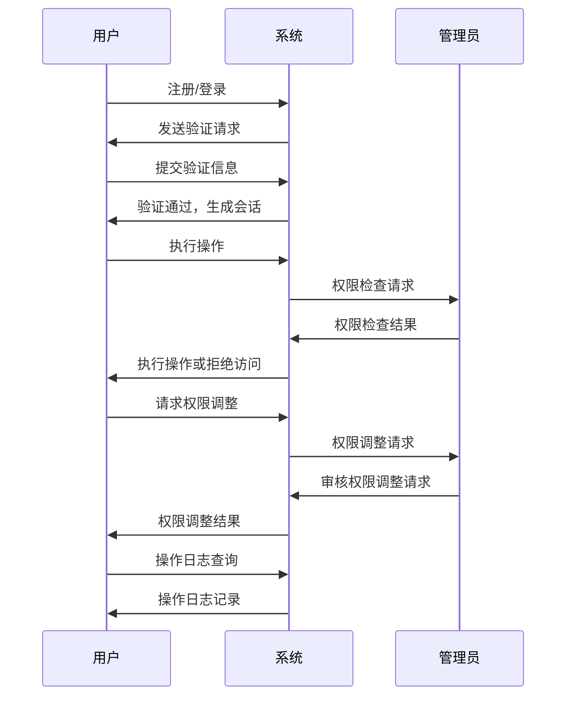
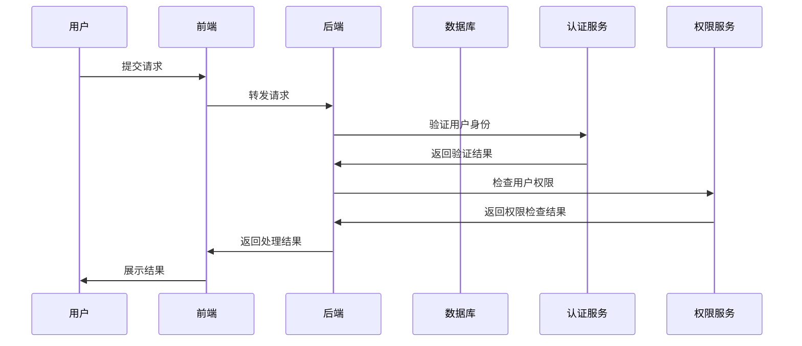
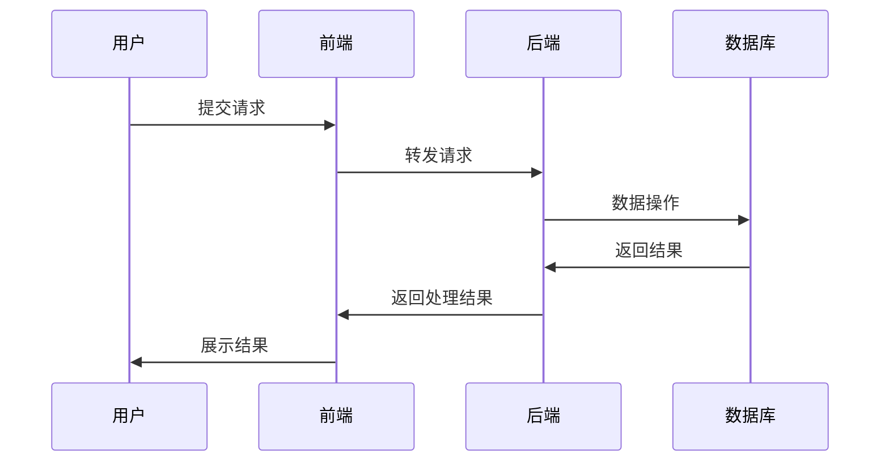
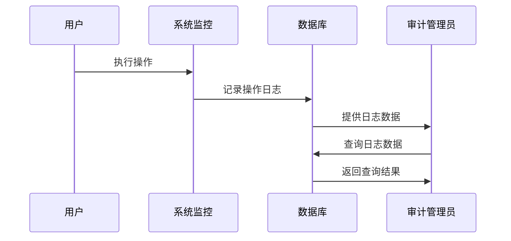

                 

## 引言

### 1.1 问题背景

在信息化时代，各类评测系统已成为许多企业、学校和政府部门进行工作评价、成绩评定和绩效考核的重要工具。这些系统不仅涵盖了日常教育评测、项目进度评估，还包括了企业员工绩效评估、客户满意度调查等多种应用场景。然而，随着评测系统功能的日益复杂和用户数量的急剧增加，如何有效地管理用户权限和实现系统审计，成为了评测系统稳定运行和信息安全的关键问题。

用户权限管理是指在评测系统中，根据用户的身份和职责，对用户可以访问的系统资源进行控制和分配。它直接关系到系统安全性和数据保密性，是评测系统能够正常运行的基础。而用户审计管理则是通过记录和分析用户的操作行为，确保系统运行的可追溯性和合规性。这两者相辅相成，共同保障了评测系统的可靠性和公正性。

### 1.2 评测系统的定义与作用

评测系统通常是一个集成多个功能模块的综合性软件系统，其主要作用是对用户提交的各类数据或行为进行量化评估，从而提供客观、准确的评价结果。具体来说，评测系统具有以下几个关键功能：

1. **数据收集**：通过多种方式收集用户信息，如填写的问卷、测试结果等。
2. **数据处理**：对收集到的数据进行清洗、分类和加工，以便后续评估。
3. **评估计算**：根据预设的评估模型和算法，对用户数据进行分析和计算，得出评估结果。
4. **结果展示**：将评估结果以图表、报告等形式展示给用户，供决策参考。

在企业的绩效考核系统中，评测系统可帮助管理层了解员工的工作表现，发现问题并制定改进策略。在教育领域，评测系统能够客观评价学生的学习成绩，为学生提供个性化的学习建议。在政府部门，评测系统可辅助进行政策评估和社会管理。

### 1.3 用户权限管理与审计的重要性

用户权限管理和审计在评测系统中具有至关重要的地位。具体来说，其重要性体现在以下几个方面：

1. **安全性**：通过权限管理，可以防止未经授权的用户访问敏感数据，从而避免数据泄露和篡改。
2. **数据保密性**：权限管理确保用户只能访问其有权查看的数据，保护了数据的隐私性。
3. **合规性**：审计管理帮助组织确保其操作符合法律法规和内部规定，提高系统的合规性和透明度。
4. **可追溯性**：通过审计记录，能够追踪到每一个用户的操作历史，一旦出现问题，可以快速定位和恢复。
5. **审计报告**：审计管理生成的报告为决策者提供了宝贵的参考信息，有助于优化系统功能和流程。

### 1.4 本书结构安排

本书将围绕评测系统的用户权限管理与审计展开讨论，结构安排如下：

- **第1章 引言**：介绍评测系统的背景、定义和用户权限管理与审计的重要性。
- **第2章 用户权限管理基础**：介绍用户和权限的基本概念，用户权限管理的核心原则和任务，以及常见的权限模型。
- **第3章 用户权限管理设计**：讨论用户角色的定义、权限分配策略、管理流程设计以及权限冲突的解决方法。
- **第4章 用户权限管理系统实现**：详细讲解用户权限管理系统的架构设计、数据库设计、功能实现以及安全性保障。
- **第5章 用户审计管理**：探讨审计的概念与作用，审计数据的收集与存储，审计数据的查询与分析，以及审计报告的生成。
- **第6章 用户权限管理与审计案例分析**：通过具体案例，分析用户权限管理与审计的实际应用和实施效果。
- **第7章 用户权限管理与审计最佳实践**：总结最佳实践的设计原则、实施步骤和注意事项，并提供拓展阅读资源。

通过本书的阅读，读者将全面了解评测系统中用户权限管理和审计的理论和实践，为实际应用提供有力的指导。接下来，我们将深入探讨用户权限管理的基础知识。

## 第2章 用户权限管理基础

### 2.1 用户与权限的概念

在评测系统中，用户是系统的操作者，具有唯一的标识和身份。用户可以是学生、员工、客户等，他们通过账号和密码登录系统，访问相应的资源进行操作。而权限则是用户在系统中可以执行的操作范围，包括访问数据的权限、执行命令的权限等。权限是保障系统安全性和数据保密性的重要机制。

#### 用户的概念与分类

用户通常具有以下基本属性：

1. **用户名**：用户的唯一标识符，通常是一个字符串。
2. **密码**：用户的身份验证信息，用于防止未经授权的访问。
3. **电子邮件**：联系用户的电子邮箱地址。
4. **联系方式**：用户的电话号码或其他联系方式。

根据用户在系统中的角色和职责，用户可以分为以下几类：

- **管理员**：负责系统的维护和管理，具有最高的权限，可以访问所有资源并进行所有操作。
- **教师**：负责教学评测工作，如发布测试、批改试卷等。
- **学生**：参与评测系统中的各类测试，获取成绩和反馈。
- **企业员工**：在企业评测系统中进行绩效评估或项目评估。
- **客户**：在客户满意度调查等评测系统中提供反馈。

#### 权限的概念与类型

权限是用户在系统中可以执行的操作范围，通常分为以下几类：

1. **读权限**：允许用户查看系统中的数据。
2. **写权限**：允许用户修改系统中的数据。
3. **执行权限**：允许用户执行特定的系统命令或操作。
4. **配置权限**：允许用户修改系统的配置参数。

根据权限的粒度，权限可以分为以下几种类型：

- **全局权限**：应用于整个系统的权限，如管理员权限。
- **模块权限**：应用于系统中的某个模块或功能，如评测模块的发布试卷权限。
- **对象权限**：应用于系统中的某个具体对象，如试卷对象的批改权限。

### 2.2 用户权限管理的核心原则

用户权限管理是评测系统安全性的关键环节，其核心原则包括以下几方面：

1. **最小权限原则**：用户应仅拥有完成其工作所需的最小权限，避免不必要的权限过度赋予，从而降低安全风险。
2. **访问控制原则**：系统应实施严格的访问控制策略，确保用户只能访问其授权的数据和资源。
3. **动态权限调整原则**：根据用户的实际工作需求和职责变化，动态调整用户的权限，确保权限的灵活性和合理性。
4. **不可篡改性原则**：用户操作日志和权限记录应具备不可篡改性，确保审计的可信度和有效性。
5. **最小泄露原则**：在权限分配过程中，应尽量减少权限泄露的风险，防止敏感信息被未授权的用户获取。

### 2.3 用户权限管理的主要任务

用户权限管理的主要任务包括以下几个方面：

1. **用户管理**：包括用户的注册、登录、信息修改和账户注销等操作。
2. **角色管理**：定义和管理用户角色，如管理员、教师、学生等，并为每个角色分配相应的权限。
3. **权限分配**：根据用户的角色和工作职责，为其分配适当的权限。
4. **权限检查**：在用户执行操作时，对用户的权限进行检查，确保用户只能访问和执行其有权操作的内容。
5. **权限审计**：记录用户的操作日志，对权限使用情况进行审计，确保系统的合规性和安全性。
6. **权限调整**：根据用户职责的变化，定期对用户权限进行调整和优化。

### 2.4 权限模型介绍

权限模型是用户权限管理的基础，常用的权限模型包括以下几种：

1. **访问控制列表（ACL）**：ACL通过为每个资源定义访问控制规则，实现对资源的细粒度访问控制。每个用户或角色对应一组访问控制规则，定义其可以访问的资源及操作权限。
   
2. **角色基础访问控制（RBAC）**：RBAC基于用户角色对权限进行分配和管理。用户被分配到不同的角色，每个角色拥有特定的权限集，用户通过角色间接获取权限。

3. **属性集权限控制（ABAC）**：ABAC根据用户的属性（如部门、职位、时间等）来动态分配权限。权限分配规则基于属性集和属性值之间的匹配关系。

4. **基于对象的访问控制（OOBAC）**：OOBAC基于对象的属性和用户角色来控制访问。用户只能访问其权限范围内与角色属性匹配的对象。

下面是一个简单的权限模型ER实体关系图：

```mermaid
erDiagram
    User ||--|{ Role }||>
    Role ||--|{ Permission }||>
    User ||--|{ AuditLog }||>
    Permission ||--|{ Resource }||>

    User {
        UserID : int
        Username : string
        Password : string
        Email : string
    }

    Role {
        RoleID : int
        RoleName : string
    }

    Permission {
        PermissionID : int
        PermissionName : string
        ResourceID : int
    }

    Resource {
        ResourceID : int
        ResourceName : string
    }

    AuditLog {
        LogID : int
        UserID : int
        Operation : string
        Timestamp : datetime
    }
```

通过上述用户和权限的基本概念介绍，我们可以更好地理解用户权限管理在评测系统中的重要性。接下来，我们将详细探讨用户权限管理的设计。

## 第3章 用户权限管理设计

### 3.1 用户角色定义

用户角色定义是用户权限管理设计的第一步，它为系统中的不同用户群体提供了明确的身份标识和职责划分。通过角色定义，可以简化权限分配过程，提高系统的可维护性和灵活性。

#### 角色定义的重要性

角色定义在用户权限管理中具有重要作用：

1. **简化权限分配**：通过定义角色，可以将权限集作为一个整体进行分配，大大简化了权限管理的复杂性。
2. **职责划分**：角色定义有助于明确不同用户群体的职责范围，避免权限滥用和操作冲突。
3. **权限调整**：在角色定义基础上，可以灵活调整权限分配，满足不同业务需求。

#### 角色定义的步骤

1. **识别用户群体**：根据系统功能需求和业务场景，识别出不同类型的用户群体，如管理员、教师、学生、企业员工等。
2. **确定角色职责**：为每个用户群体定义明确的职责，如管理评测系统、发布试卷、批改试卷、参与测试、绩效评估等。
3. **分配初始权限**：为每个角色分配基本权限，确保其在执行职责时具备必要的权限。

#### 常见角色示例

- **管理员（Admin）**：负责系统管理和维护，包括用户管理、权限管理、数据备份与恢复等。
- **教师（Teacher）**：负责评测系统的日常使用，如发布试卷、设置考试、批改试卷等。
- **学生（Student）**：参与评测系统的各类测试，查看成绩和反馈。
- **企业员工（Employee）**：在企业绩效评估系统中进行绩效评估。
- **客户（Customer）**：在客户满意度调查系统中提供反馈。

### 3.2 用户权限分配策略

用户权限分配策略是用户权限管理设计的关键环节，它决定了用户在系统中的操作范围和权限等级。合理的权限分配策略可以提升系统的安全性、可靠性和用户体验。

#### 权限分配策略的核心原则

1. **最小权限原则**：用户应仅拥有完成其工作所需的最小权限，避免不必要的权限过度赋予。
2. **职责分离原则**：确保不同角色的权限相互独立，防止权限重叠和潜在的安全漏洞。
3. **动态调整原则**：根据用户职责的变化，灵活调整用户的权限，保持权限分配的合理性和有效性。

#### 权限分配策略的分类

1. **静态权限分配**：在系统初始配置时，为每个角色分配固定的权限集，用户在整个生命周期内保持不变。这种策略简单易行，但灵活性较低，难以适应动态变化的业务需求。

2. **动态权限分配**：根据用户的实时需求和职责，动态调整用户的权限。这种策略具有较高的灵活性和适应性，但实现复杂度较高，需要完善的权限检查和调整机制。

3. **基于规则的权限分配**：使用规则引擎根据用户属性和操作行为动态分配权限。这种策略结合了静态和动态分配的优点，适用于复杂业务场景。

#### 权限分配策略的示例

以下是一个简单的权限分配策略示例：

- **管理员**：拥有对系统所有资源的完全访问权限。
- **教师**：拥有对评测系统的发布试卷、设置考试、批改试卷等功能的访问权限。
- **学生**：仅拥有参与测试和查看成绩的访问权限。
- **企业员工**：拥有绩效评估和目标设置的访问权限。
- **客户**：仅拥有满意度调查问卷的访问权限。

### 3.3 用户权限管理流程设计

用户权限管理流程设计是确保权限管理过程规范、高效和安全的关键。一个完善的权限管理流程应包括以下步骤：

1. **角色创建与权限分配**：根据系统需求和业务场景，创建不同角色的权限集，并为每个角色分配初始权限。

2. **用户注册与登录**：用户通过注册和登录获取系统账号，系统根据用户角色为其分配相应权限。

3. **权限检查与授权**：用户在执行操作前，系统对用户权限进行检查，确保其具备相应的访问权限。

4. **权限调整与审核**：根据用户职责的变化，定期调整用户权限，并进行审核，确保权限分配的合理性和合规性。

5. **权限审计与记录**：记录用户操作日志和权限变更记录，确保权限使用的可追溯性和审计性。

#### 权限管理流程示例



通过上述设计，我们可以确保评测系统的用户权限管理既灵活又安全，为系统的稳定运行提供有力保障。接下来，我们将深入探讨用户权限管理系统的实现细节。

### 3.4 权限冲突与解决

在用户权限管理设计中，权限冲突是一个常见且复杂的问题。权限冲突可能发生在不同角色之间的权限重叠或用户在执行操作时的权限不足。解决权限冲突是确保系统安全性和用户体验的关键。以下是一些解决权限冲突的方法和策略：

#### 权限冲突的识别

1. **重叠权限**：不同角色拥有相同的权限，导致权限分配不明确，容易引发冲突。例如，教师和学生都拥有修改试卷的权限。
2. **权限不足**：用户在执行操作时，权限不足导致无法完成预期任务。例如，一个普通用户试图访问敏感数据，但仅拥有读权限。

#### 解决权限冲突的方法

1. **明确角色定义**：确保每个角色都有明确的职责和权限范围，避免重叠权限。可以通过角色权限矩阵（Role-Permission Matrix）来清晰地定义每个角色的权限。

2. **权限最小化原则**：遵循最小权限原则，为用户分配仅完成其工作所需的最小权限。这可以降低权限冲突的风险。

3. **权限审查与调整**：定期审查用户权限，确保权限分配合理。在权限变更时，进行详细审核，防止错误分配或过度分配权限。

4. **权限请求与审批流程**：建立权限请求和审批流程，确保用户在权限不足时，可以通过正式流程请求和获得必要的权限。

#### 权限冲突解决策略示例

**案例**：在一个企业评测系统中，普通员工和项目经理都拥有项目数据的访问权限。但由于项目数据敏感性不同，普通员工仅需要读取项目信息，而项目经理则需要读取和修改项目信息。

**解决策略**：

1. **角色定义**：为普通员工和项目经理分别定义角色，普通员工为“项目观察者”，项目经理为“项目管理者”。

2. **权限分配**：为“项目观察者”角色分配读取项目信息的权限，为“项目管理者”角色分配读取和修改项目信息的权限。

3. **权限审查**：定期审查权限分配，确保每个角色的权限合理且无冲突。

4. **权限请求流程**：项目经理在需要修改项目信息时，通过权限请求流程申请修改权限，系统管理员在审核后为其分配相应权限。

通过上述策略，可以有效解决权限冲突，确保系统的安全性和稳定性。接下来，我们将探讨用户权限管理系统的实现细节。

### 3.5 用户权限管理系统实现

用户权限管理系统是评测系统中至关重要的一环，其实现涉及多个关键组件和步骤。以下将详细讨论用户权限管理系统的架构设计、数据库设计、功能实现和安全性保障。

#### 系统架构设计

用户权限管理系统的架构设计应考虑系统的可扩展性、安全性和易用性。以下是一个典型的系统架构设计：

1. **前端**：用户通过浏览器或移动应用与系统进行交互，前端负责展示用户界面，接收用户操作请求并转发到后端处理。
2. **后端**：后端负责处理业务逻辑、数据存储和权限检查，通常包括API服务器和业务逻辑处理层。
3. **数据库**：存储用户信息、角色信息、权限信息和操作日志等，通常使用关系型数据库如MySQL或PostgreSQL。
4. **身份认证**：负责用户身份验证和会话管理，确保用户访问系统的安全性和合法性。
5. **权限管理服务**：提供权限检查和权限分配功能，确保用户只能执行其有权操作。

以下是一个简单的用户权限管理系统架构图：



#### 数据库设计

数据库设计是用户权限管理系统实现的基础，以下是一个简化的数据库设计示例：

1. **用户表（User）**：存储用户基本信息，如用户ID、用户名、密码、电子邮件等。
2. **角色表（Role）**：存储角色信息，如角色ID、角色名称等。
3. **权限表（Permission）**：存储权限信息，如权限ID、权限名称、权限描述等。
4. **用户角色关系表（UserRole）**：存储用户与角色的关联关系，如用户ID、角色ID等。
5. **权限角色关系表（RolePermission）**：存储角色与权限的关联关系，如角色ID、权限ID等。
6. **操作日志表（AuditLog）**：存储用户操作记录，如日志ID、用户ID、操作时间、操作内容等。

以下是数据库设计的ER图：

```mermaid
erDiagram
    User ||--|{ Role }||>
    Role ||--|{ Permission }||>
    User ||--|{ AuditLog }||>
    Permission ||--|{ Resource }||>

    User {
        UserID : int
        Username : string
        Password : string
        Email : string
    }

    Role {
        RoleID : int
        RoleName : string
    }

    Permission {
        PermissionID : int
        PermissionName : string
        ResourceID : int
    }

    Resource {
        ResourceID : int
        ResourceName : string
    }

    AuditLog {
        LogID : int
        UserID : int
        Operation : string
        Timestamp : datetime
    }
```

#### 功能实现

用户权限管理系统的功能实现主要包括以下方面：

1. **用户管理**：实现用户的注册、登录、信息修改和账户注销等功能。
2. **角色管理**：实现角色的创建、修改和删除等功能，以及角色与权限的关联。
3. **权限管理**：实现权限的创建、修改和删除等功能，以及权限与资源的关联。
4. **权限检查**：在用户执行操作时，对用户权限进行检查，确保用户只能执行其有权操作的内容。
5. **操作日志记录**：记录用户的操作行为，包括操作时间、操作内容和操作结果，以便进行审计和回溯。

以下是一个简单的权限检查功能的Python代码示例：

```python
def check_permission(user_id, resource_id, operation):
    # 查询用户角色和权限
    user_role_permissions = get_user_role_permissions(user_id)
    for role_permission in user_role_permissions:
        if role_permission['resource_id'] == resource_id and role_permission['operation'] == operation:
            return True
    return False

def get_user_role_permissions(user_id):
    # 从数据库中查询用户角色和权限
    # 返回一个包含用户角色权限的列表
    pass
```

#### 安全性保障

用户权限管理系统的安全性至关重要，以下是一些关键的安全措施：

1. **身份认证**：使用强密码策略和多因素认证，确保用户身份的合法性。
2. **加密存储**：使用加密算法对用户密码和敏感数据进行存储，防止数据泄露。
3. **权限隔离**：确保不同用户的权限相互独立，防止权限冲突和越权操作。
4. **操作审计**：记录用户的操作行为和权限变更，确保系统的可审计性和透明度。
5. **异常检测**：实施异常行为检测机制，及时发现和阻止恶意操作。

通过上述架构设计、数据库设计、功能实现和安全性保障，我们可以构建一个高效、安全、可靠的用户权限管理系统，为评测系统的稳定运行提供有力保障。接下来，我们将探讨用户审计管理的重要性。

### 4.1 系统架构设计

在用户权限管理系统中，架构设计是确保系统功能实现、性能优化和安全保障的基础。以下将详细阐述系统架构设计，包括项目介绍、系统功能设计、系统架构设计、系统接口设计和系统交互。

#### 项目介绍

本项目是一个企业级用户权限管理系统，旨在为企业提供强大的用户权限管理功能，确保系统的安全性、稳定性和合规性。系统支持用户管理、角色管理、权限管理、权限检查和操作日志记录等功能，同时具备良好的扩展性和可维护性。

#### 系统功能设计

系统功能设计主要围绕用户权限管理的核心需求展开，包括以下功能模块：

1. **用户管理**：实现用户的注册、登录、信息修改和账户注销等功能。
2. **角色管理**：定义和管理不同角色，如管理员、普通用户、外部用户等。
3. **权限管理**：创建和管理权限，包括对资源的访问权限和操作权限。
4. **权限检查**：在用户执行操作时，对用户权限进行检查，确保其具备相应的访问权限。
5. **操作日志记录**：记录用户的操作行为和权限变更，确保系统的可审计性和透明度。

#### 系统架构设计

系统架构设计采用分层架构，包括前端、后端和数据库三部分，各部分职责明确，易于维护和扩展。以下是一个简化的系统架构图：



1. **前端**：负责用户界面展示和与用户交互，使用Vue或React等前端框架实现。
2. **后端**：负责处理业务逻辑、数据存储和权限检查，使用Spring Boot或Django等后端框架实现。
3. **数据库**：存储用户信息、角色信息、权限信息和操作日志等，使用MySQL或PostgreSQL等关系型数据库实现。

#### 系统接口设计

系统接口设计是确保前后端有效交互的关键，以下是一些核心接口的设计：

1. **用户管理接口**：包括用户注册、登录、信息修改和账户注销等功能。
   - 用户注册：`POST /api/users/register`
   - 用户登录：`POST /api/users/login`
   - 用户信息修改：`PUT /api/users/{userId}`
   - 用户账户注销：`DELETE /api/users/{userId}`

2. **角色管理接口**：包括角色创建、修改和删除等功能。
   - 创建角色：`POST /api/roles`
   - 修改角色：`PUT /api/roles/{roleId}`
   - 删除角色：`DELETE /api/roles/{roleId}`

3. **权限管理接口**：包括权限创建、修改和删除等功能。
   - 创建权限：`POST /api/permissions`
   - 修改权限：`PUT /api/permissions/{permissionId}`
   - 删除权限：`DELETE /api/permissions/{permissionId}`

4. **权限检查接口**：包括权限检查功能。
   - 权限检查：`GET /api/permissions/check/{userId}/{resourceId}/{operation}`

5. **操作日志记录接口**：包括记录用户操作日志。
   - 记录日志：`POST /api/logs`

#### 系统交互

系统交互设计主要关注前后端的数据传递和处理流程，以下是一个简化的交互流程：

1. **用户请求**：用户通过前端界面提交请求，如注册、登录或修改信息。
2. **前端处理**：前端接收到请求后，调用相应的API接口，将请求转发到后端。
3. **后端处理**：后端接收到请求后，根据请求类型执行相应的业务逻辑，如用户注册、权限检查等。
4. **数据库操作**：后端根据业务逻辑需要，对数据库进行操作，如插入用户信息、查询角色权限等。
5. **返回结果**：后端将处理结果返回给前端，前端根据结果更新界面显示。
6. **日志记录**：系统在处理用户请求和权限检查时，实时记录操作日志，以便进行审计和回溯。

通过上述系统架构设计、接口设计和交互流程，我们可以构建一个功能齐全、性能优越、安全可靠的用户权限管理系统，为企业的用户权限管理提供有力保障。

### 4.2 数据库设计

数据库设计是用户权限管理系统实现的基础，它直接关系到系统的数据存储结构、查询效率和数据完整性。以下将详细讨论数据库设计，包括数据库表结构设计、表之间的关系、主键和外键的定义以及具体的数据库表字段说明。

#### 数据库表结构设计

用户权限管理系统涉及的主要数据库表包括用户表（User）、角色表（Role）、权限表（Permission）、用户角色关系表（UserRole）、角色权限关系表（RolePermission）和操作日志表（AuditLog）。

1. **用户表（User）**
   - **UserID**：用户唯一标识，主键，整型（INT）
   - **Username**：用户名，唯一，字符串（VARCHAR）
   - **Password**：用户密码，字符串（VARCHAR）
   - **Email**：用户电子邮箱，字符串（VARCHAR）
   - **CreateTime**：创建时间，日期时间（DATETIME）

2. **角色表（Role）**
   - **RoleID**：角色唯一标识，主键，整型（INT）
   - **RoleName**：角色名称，唯一，字符串（VARCHAR）
   - **Description**：角色描述，字符串（TEXT）

3. **权限表（Permission）**
   - **PermissionID**：权限唯一标识，主键，整型（INT）
   - **PermissionName**：权限名称，唯一，字符串（VARCHAR）
   - **Description**：权限描述，字符串（TEXT）
   - **ResourceID**：权限关联的资源ID，外键，整型（INT）

4. **用户角色关系表（UserRole）**
   - **UserID**：用户ID，外键，整型（INT）
   - **RoleID**：角色ID，外键，整型（INT）

5. **角色权限关系表（RolePermission）**
   - **RoleID**：角色ID，外键，整型（INT）
   - **PermissionID**：权限ID，外键，整型（INT）

6. **操作日志表（AuditLog）**
   - **LogID**：日志唯一标识，主键，整型（INT）
   - **UserID**：用户ID，外键，整型（INT）
   - **Operation**：操作内容，字符串（VARCHAR）
   - **Timestamp**：操作时间，日期时间（DATETIME）

#### 表之间的关系

1. **用户与角色**：用户表（User）与用户角色关系表（UserRole）之间是一对多关系，一个用户可以拥有多个角色。
2. **角色与权限**：角色表（Role）与角色权限关系表（RolePermission）之间是一对多关系，一个角色可以拥有多个权限。
3. **权限与资源**：权限表（Permission）与资源表（Resource）之间是多对一关系，一个权限可以关联多个资源，但一个资源只能被一个权限所拥有。

以下是一个简化的数据库ER图：

```mermaid
erDiagram
    User ||--|{ UserRole }||>
    Role ||--|{ RolePermission }||>
    Permission ||--|{ Resource }||>
    AuditLog ||--|{ User }||>

    User {
        UserID : int
        Username : string
        Password : string
        Email : string
        CreateTime : datetime
    }

    Role {
        RoleID : int
        RoleName : string
        Description : text
    }

    UserRole {
        UserID : int
        RoleID : int
    }

    Permission {
        PermissionID : int
        PermissionName : string
        Description : text
        ResourceID : int
    }

    Resource {
        ResourceID : int
        ResourceName : string
    }

    AuditLog {
        LogID : int
        UserID : int
        Operation : string
        Timestamp : datetime
    }
```

#### 主键和外键的定义

1. **主键**：在用户表（User）、角色表（Role）、权限表（Permission）和操作日志表（AuditLog）中，分别使用主键（UserID、RoleID、PermissionID、LogID）唯一标识每条记录。
2. **外键**：在用户角色关系表（UserRole）和角色权限关系表（RolePermission）中，使用外键（UserID、RoleID、PermissionID）关联用户表、角色表和权限表，确保数据的一致性和完整性。

#### 数据库表字段说明

1. **用户表（User）**：
   - **UserID**：唯一标识用户的ID，用于关联其他表。
   - **Username**：用户登录系统的用户名，必须唯一。
   - **Password**：用户密码，存储加密后的密码。
   - **Email**：用户的电子邮箱地址，用于找回密码和系统通知。
   - **CreateTime**：用户创建时间，记录用户账号的创建时间。

2. **角色表（Role）**：
   - **RoleID**：唯一标识角色的ID。
   - **RoleName**：角色的名称，用于区分不同的角色。
   - **Description**：角色的描述，提供角色用途的说明。

3. **权限表（Permission）**：
   - **PermissionID**：唯一标识权限的ID。
   - **PermissionName**：权限的名称，如“查看数据”、“修改数据”。
   - **Description**：权限的描述，提供权限用途的说明。
   - **ResourceID**：权限关联的资源的ID，用于关联资源表。

4. **用户角色关系表（UserRole）**：
   - **UserID**：关联用户表的UserID字段，用于标识用户所属的角色。
   - **RoleID**：关联角色表的RoleID字段，用于标识用户的角色。

5. **角色权限关系表（RolePermission）**：
   - **RoleID**：关联角色表的RoleID字段，用于标识角色的权限。
   - **PermissionID**：关联权限表的PermissionID字段，用于标识角色的权限。

6. **操作日志表（AuditLog）**：
   - **LogID**：唯一标识操作日志的ID。
   - **UserID**：关联用户表的UserID字段，用于标识执行操作的用户。
   - **Operation**：记录用户执行的操作内容。
   - **Timestamp**：记录操作发生的时间。

通过上述数据库设计，用户权限管理系统可以实现高效、安全、可靠的数据存储和操作，为系统的正常运行提供坚实的保障。接下来，我们将讨论用户权限管理系统的功能实现。

### 4.3 用户权限管理功能实现

用户权限管理系统功能实现是确保系统安全性和稳定性的关键。以下将详细讨论用户权限管理功能的具体实现，包括用户管理、角色管理、权限管理、权限检查和操作日志记录。

#### 用户管理

用户管理包括用户的注册、登录、信息修改和账户注销等功能。

1. **用户注册**：用户通过注册接口提交用户名、密码和电子邮件等信息，系统验证信息的合法性和唯一性后，创建用户账号并存储到数据库中。

```python
def register(username, password, email):
    # 验证用户名和电子邮件的唯一性
    if not is_unique(username) or not is_unique(email):
        raise Exception("用户名或电子邮件已存在")
    # 存储用户信息到数据库
    db.execute("INSERT INTO User (Username, Password, Email, CreateTime) VALUES (?, ?, ?, NOW())", (username, password, email))
```

2. **用户登录**：用户通过登录接口提交用户名和密码，系统验证用户身份后，生成会话并返回给用户。

```python
def login(username, password):
    # 验证用户名和密码
    user = db.execute("SELECT * FROM User WHERE Username = ? AND Password = ?", (username, password))
    if not user:
        raise Exception("用户名或密码错误")
    # 生成会话
    session_id = generate_session_id()
    db.execute("INSERT INTO Session (UserID, SessionID, CreateTime) VALUES (?, ?, NOW())", (user['UserID'], session_id))
    return session_id
```

3. **用户信息修改**：用户可以通过接口修改个人信息，如密码和电子邮件。

```python
def update_user_info(session_id, new_password, new_email):
    # 验证会话有效性
    user = check_session_validity(session_id)
    if not user:
        raise Exception("会话已过期或无效")
    # 更新用户信息
    db.execute("UPDATE User SET Password = ?, Email = ? WHERE UserID = ?", (new_password, new_email, user['UserID']))
```

4. **用户账户注销**：管理员可以通过接口注销用户账户。

```python
def delete_user_account(session_id, user_id):
    # 验证会话有效性
    if not check_session_validity(session_id):
        raise Exception("会话已过期或无效")
    # 注销用户账户
    db.execute("DELETE FROM User WHERE UserID = ?", (user_id,))
```

#### 角色管理

角色管理包括角色的创建、修改和删除等功能。

1. **角色创建**：管理员可以通过接口创建新角色。

```python
def create_role(role_name, description):
    # 验证角色名称的唯一性
    if db.execute("SELECT * FROM Role WHERE RoleName = ?", (role_name,)):
        raise Exception("角色名称已存在")
    # 创建角色
    db.execute("INSERT INTO Role (RoleName, Description) VALUES (?, ?)", (role_name, description))
```

2. **角色修改**：管理员可以通过接口修改角色信息。

```python
def update_role(role_id, new_role_name, new_description):
    # 验证角色ID的有效性
    if not db.execute("SELECT * FROM Role WHERE RoleID = ?", (role_id,)):
        raise Exception("角色ID无效")
    # 更新角色信息
    db.execute("UPDATE Role SET RoleName = ?, Description = ? WHERE RoleID = ?", (new_role_name, new_description, role_id))
```

3. **角色删除**：管理员可以通过接口删除角色。

```python
def delete_role(role_id):
    # 验证角色ID的有效性
    if not db.execute("SELECT * FROM Role WHERE RoleID = ?", (role_id,)):
        raise Exception("角色ID无效")
    # 删除角色
    db.execute("DELETE FROM Role WHERE RoleID = ?", (role_id,))
```

#### 权限管理

权限管理包括权限的创建、修改和删除等功能。

1. **权限创建**：管理员可以通过接口创建新权限。

```python
def create_permission(permission_name, description, resource_id):
    # 验证权限名称的唯一性
    if db.execute("SELECT * FROM Permission WHERE PermissionName = ?", (permission_name,)):
        raise Exception("权限名称已存在")
    # 创建权限
    db.execute("INSERT INTO Permission (PermissionName, Description, ResourceID) VALUES (?, ?, ?)", (permission_name, description, resource_id))
```

2. **权限修改**：管理员可以通过接口修改权限信息。

```python
def update_permission(permission_id, new_permission_name, new_description, new_resource_id):
    # 验证权限ID的有效性
    if not db.execute("SELECT * FROM Permission WHERE PermissionID = ?", (permission_id,)):
        raise Exception("权限ID无效")
    # 更新权限信息
    db.execute("UPDATE Permission SET PermissionName = ?, Description = ?, ResourceID = ? WHERE PermissionID = ?", (new_permission_name, new_description, new_resource_id, permission_id))
```

3. **权限删除**：管理员可以通过接口删除权限。

```python
def delete_permission(permission_id):
    # 验证权限ID的有效性
    if not db.execute("SELECT * FROM Permission WHERE PermissionID = ?", (permission_id,)):
        raise Exception("权限ID无效")
    # 删除权限
    db.execute("DELETE FROM Permission WHERE PermissionID = ?", (permission_id,))
```

#### 权限检查

权限检查是用户执行操作前的重要步骤，确保用户只能执行其有权操作的内容。

```python
def check_permission(user_id, resource_id, operation):
    # 查询用户角色权限
    role_permissions = db.execute("SELECT P.PermissionName FROM RolePermission RP JOIN Permission P ON RP.PermissionID = P.PermissionID JOIN UserRole UR ON RP.RoleID = UR.RoleID WHERE UR.UserID = ?", (user_id,))
    # 验证权限
    for role_permission in role_permissions:
        if role_permission['PermissionName'] == operation:
            return True
    return False
```

#### 操作日志记录

操作日志记录用于记录用户操作行为和权限变更，确保系统的可审计性和透明度。

```python
def log_operation(session_id, operation):
    # 验证会话有效性
    user = db.execute("SELECT * FROM User U JOIN Session S ON U.UserID = S.UserID WHERE S.SessionID = ?", (session_id,))
    if not user:
        raise Exception("会话已过期或无效")
    # 记录操作日志
    db.execute("INSERT INTO AuditLog (UserID, Operation, Timestamp) VALUES (?, ?, NOW())", (user['UserID'], operation))
```

通过上述功能实现，用户权限管理系统可以有效地进行用户管理、角色管理、权限管理和权限检查，确保系统的安全性和稳定性。接下来，我们将探讨用户审计管理的概念和作用。

### 5.1 审计的概念与作用

在信息技术领域，审计（Audit）是一种系统性的、独立的检查和验证过程，旨在评估和验证信息系统、数据处理和业务流程的有效性、合规性和安全性。具体到评测系统的用户权限管理与审计，审计的概念和作用尤为重要。

#### 审计的定义

审计是一种对信息系统、数据处理过程和业务流程进行全面检查、评估和验证的方法，通过检查和记录系统中的用户操作，确保系统的安全性、合规性和可靠性。审计不仅关注技术层面的安全性，还涉及业务流程的合规性和数据处理的准确性。

#### 审计在评测系统中的重要性

1. **确保安全性**：通过审计，可以及时发现和预防系统中的安全漏洞，防止数据泄露、篡改和未授权访问。
2. **合规性验证**：审计帮助组织验证其操作是否符合法律法规、内部规定和行业标准，确保系统的合规性。
3. **责任追溯**：审计记录可以追溯用户操作行为，一旦发生违规操作或数据问题，可以快速定位责任人和原因。
4. **改进系统**：审计结果为系统改进提供了宝贵的数据和参考，有助于优化系统功能、流程和安全性。

#### 审计的作用

1. **风险评估**：通过审计，可以识别和评估系统中的潜在风险，制定相应的风险管理措施。
2. **流程优化**：审计结果可以揭示业务流程中的问题和瓶颈，为流程优化和改进提供依据。
3. **合规监督**：审计确保系统操作符合相关法律法规和内部规定，避免法律纠纷和合规风险。
4. **信任建立**：审计报告为系统的可信度提供了有力保障，增强了用户对系统的信任。

#### 审计与用户权限管理的关系

用户权限管理和审计是评测系统中的两个重要组成部分，二者相辅相成，共同保障系统的安全性、可靠性和合规性。用户权限管理确保用户只能访问其授权的资源，而审计则通过记录和分析用户操作行为，确保权限管理的有效性和合规性。

1. **权限管理与审计的集成**：用户权限管理系统的设计应集成审计功能，自动记录用户的操作行为和权限变更，便于审计分析。
2. **审计结果反馈**：审计结果可以反馈给用户权限管理，帮助调整和优化权限分配策略，确保权限管理的合理性和有效性。

总之，审计是评测系统中不可或缺的一环，通过审计，可以确保用户权限管理的有效性和合规性，提高系统的安全性、可靠性和用户信任度。接下来，我们将讨论审计数据收集与存储的细节。

### 5.2 审计数据收集与存储

审计数据收集与存储是用户审计管理的重要组成部分，其核心目的是确保审计数据的完整性和可靠性，以便在需要时进行查询和分析。以下将详细讨论审计数据收集的方式、存储方法以及数据安全性保障。

#### 审计数据收集

审计数据的收集是审计工作的第一步，主要包括以下方式：

1. **日志记录**：在评测系统中，对用户的操作行为进行日志记录，是审计数据的主要来源。常见的日志记录包括登录日志、操作日志、权限变更日志等。这些日志记录了用户的行为、时间、操作内容等信息。

2. **系统监控**：利用系统监控工具，实时收集系统的运行状态、错误日志和异常行为。这些监控数据可以帮助审计人员了解系统的运行状况，及时发现潜在问题。

3. **手动报告**：在某些特殊情况下，用户或管理员可以通过手动报告的形式，记录特定事件或异常情况。这些报告可以作为补充数据，为审计提供更全面的视角。

#### 审计数据存储

审计数据的存储是确保数据可追溯性和可靠性的关键，以下是一些常用的存储方法：

1. **关系型数据库**：使用关系型数据库（如MySQL、PostgreSQL）存储审计数据。这种存储方式具有数据结构化、查询速度快和便于维护等优点。常见的审计数据表包括用户日志表、操作日志表、权限变更日志表等。

2. **分布式数据库**：对于大规模系统，可以使用分布式数据库（如HBase、Cassandra）存储审计数据。这种存储方式具有高扩展性和高性能，适用于大数据量的存储和处理。

3. **数据湖**：数据湖是一种数据存储方案，用于存储海量非结构化和半结构化数据。审计数据可以使用数据湖进行存储，便于长期保存和查询。

#### 数据安全性保障

审计数据的安全性是审计管理的关键，以下是一些常见的数据安全性保障措施：

1. **数据加密**：对审计数据进行加密处理，确保数据在存储和传输过程中不被窃取或篡改。常用的加密算法包括AES、RSA等。

2. **访问控制**：实施严格的访问控制策略，确保只有授权人员才能访问审计数据。通过角色管理和权限控制，限制不同角色的访问范围。

3. **备份与恢复**：定期对审计数据进行备份，确保数据在意外情况下可以恢复。备份文件应存储在安全的地点，避免数据丢失。

4. **日志审计**：记录审计数据的访问日志，监控审计数据的访问和操作行为。通过日志审计，可以及时发现和处理异常行为。

#### 审计数据存储架构示例

以下是一个简化的审计数据存储架构示例：



通过上述审计数据收集与存储的方法和措施，可以确保审计数据的完整性和可靠性，为系统的审计管理提供坚实的基础。接下来，我们将讨论审计数据查询与分析的方法。

### 5.3 审计数据查询与分析

审计数据查询与分析是用户审计管理的关键环节，通过有效的查询与分析方法，可以深入了解用户的操作行为，发现潜在的安全问题和合规风险。以下将详细讨论审计数据的查询方法、数据分析工具和常用数据分析指标。

#### 审计数据查询

审计数据的查询旨在快速准确地检索和定位特定数据，常用的查询方法包括以下几种：

1. **基于条件的查询**：通过设定查询条件，如用户ID、操作时间、操作类型等，精确查询特定审计数据。例如，查询某个用户在特定时间内的所有操作记录。

```sql
SELECT * FROM AuditLog WHERE UserID = ? AND Timestamp BETWEEN ? AND ?
```

2. **分组查询**：通过对审计数据进行分组，汇总和统计特定操作或事件的数据。例如，统计某个时间段内不同用户的操作次数。

```sql
SELECT UserID, COUNT(*) as OperationCount FROM AuditLog WHERE Timestamp BETWEEN ? AND ? GROUP BY UserID
```

3. **联表查询**：结合多个表的审计数据，进行复杂查询和分析。例如，查询用户的操作记录与其角色和权限的关联。

```sql
SELECT A.UserID, A.Operation, A.Timestamp, R.RoleName, P.PermissionName
FROM AuditLog A
JOIN UserRole UR ON A.UserID = UR.UserID
JOIN RolePermission RP ON UR.RoleID = RP.RoleID
JOIN Permission P ON RP.PermissionID = P.PermissionID
JOIN Role R ON UR.RoleID = R.RoleID
```

#### 数据分析工具

数据分析工具是审计数据查询与分析的有力助手，以下是一些常用的数据分析工具：

1. **SQL查询工具**：如MySQL Workbench、pgAdmin等，提供直观的界面和强大的查询功能，方便审计人员进行数据查询和操作。

2. **数据分析平台**：如Tableau、Power BI等，支持复杂的数据可视化和分析，帮助审计人员直观理解审计数据。

3. **日志分析工具**：如ELK（Elasticsearch、Logstash、Kibana）等，能够处理大量日志数据，提供高效的日志存储和分析功能。

#### 常用数据分析指标

通过数据分析，可以评估系统的安全性和合规性，以下是一些常用的数据分析指标：

1. **操作频率**：统计用户在特定时间段内的操作次数，识别频繁操作的用户或时间段，可能涉及异常行为。

2. **操作类型**：分析不同操作类型的分布和比例，识别高风险操作或异常操作模式。

3. **操作成功率**：统计用户操作的成功率，识别操作失败的可能原因，如权限不足、系统故障等。

4. **操作时间分布**：分析用户操作的时段分布，识别用户操作的高峰时段，可能涉及系统性能问题。

5. **用户行为分析**：通过行为分析，识别用户操作习惯和模式，发现潜在的安全隐患。

6. **合规性分析**：验证系统操作是否符合法律法规和内部规定，确保合规性。

#### 数据分析示例

以下是一个简单的数据分析示例，统计某段时间内不同用户的操作次数：

```sql
SELECT UserID, COUNT(*) as OperationCount FROM AuditLog WHERE Timestamp BETWEEN '2023-01-01' AND '2023-01-31' GROUP BY UserID;
```

通过上述查询和分析，审计人员可以深入了解用户操作行为，发现潜在问题，为系统优化和安全保障提供依据。接下来，我们将讨论审计报告生成的方法和步骤。

### 5.4 审计报告生成

审计报告是审计工作的最终成果，它通过汇总和分析审计数据，向管理层和利益相关方提供系统运行状态、安全性和合规性的全面评估。以下将详细讨论审计报告的生成方法、内容和步骤。

#### 审计报告的生成方法

1. **数据采集**：从审计系统中提取相关数据，包括操作日志、权限变更记录、系统监控数据等。

2. **数据清洗**：对采集到的数据进行清洗和预处理，确保数据的准确性和一致性。

3. **数据分析**：使用数据分析工具和算法，对清洗后的数据进行分析和汇总，提取关键信息和指标。

4. **报告编写**：根据分析结果，编写审计报告，包括报告的结构、内容和格式。

5. **报告审核**：审计报告编写完成后，进行内部审核和确认，确保报告内容的准确性和完整性。

6. **报告发布**：将审计报告发布给管理层和利益相关方，并通过适当渠道进行传达和分享。

#### 审计报告的内容

1. **摘要**：简要介绍审计目的、范围、时间和主要发现。

2. **审计过程**：详细描述审计方法和步骤，包括数据采集、数据清洗、数据分析等。

3. **关键发现**：列出审计过程中发现的主要问题和异常情况，包括操作频率异常、高风险操作、权限管理问题等。

4. **分析结果**：提供数据分析的结果，包括操作成功率、操作时间分布、用户行为分析等。

5. **合规性评估**：评估系统操作是否符合法律法规和内部规定，指出存在的合规风险。

6. **改进建议**：根据审计发现，提出改进系统和流程的建议，帮助优化系统性能和安全。

7. **附录**：包括审计数据样本、分析方法和工具、参考文档等。

#### 审计报告的步骤

1. **确定审计目标**：明确审计的目的和范围，确定需要收集和分析的数据类型。

2. **数据采集**：从审计系统中提取相关数据，如操作日志、权限变更记录等。

3. **数据清洗**：对采集到的数据进行清洗，确保数据的准确性、完整性和一致性。

4. **数据分析**：使用数据分析工具和算法，对清洗后的数据进行分析和汇总，提取关键信息和指标。

5. **编写报告**：根据分析结果，编写审计报告，确保报告的结构清晰、内容准确、语言简洁。

6. **审核报告**：内部审核和确认审计报告，确保报告内容的准确性和完整性。

7. **发布报告**：将审计报告发布给管理层和利益相关方，并通过适当渠道进行传达和分享。

通过上述审计报告生成方法和步骤，可以确保审计报告的真实性、全面性和指导性，为管理层和利益相关方提供可靠的决策依据。接下来，我们将通过一个具体案例，分析用户权限管理与审计的实际应用和实施效果。

### 6.1 案例背景

某大型企业评测系统是一款用于员工绩效评估和项目进度管理的综合系统。系统涵盖了员工信息管理、绩效考核、项目进度跟踪等多个功能模块。随着企业员工数量的增加和业务复杂度的提升，企业对系统安全性和权限管理的需求愈发迫切。为了确保系统安全、稳定运行，企业决定引入用户权限管理与审计机制，以提升系统的合规性和透明度。

#### 案例问题描述

1. **权限管理不足**：现有系统缺乏完善的用户权限管理机制，员工权限分配混乱，部分员工具备过多权限，导致系统安全隐患。
2. **操作不可追溯**：系统缺乏有效的审计功能，无法追溯员工操作行为，一旦出现操作失误或违规行为，难以快速定位和纠正。
3. **合规性验证不足**：系统操作缺乏合规性验证，部分操作可能违反企业内部规定和法律法规，存在合规风险。

#### 案例解决方法

1. **引入用户权限管理**：企业引入RBAC（基于角色的访问控制）模型，为不同角色（如管理员、普通员工、项目管理者）分配不同权限，确保员工只能访问和执行其有权操作的内容。
2. **实现审计功能**：企业开发了审计模块，记录员工的操作行为和权限变更，确保操作的可追溯性和审计性。
3. **定期审计与报告**：企业定期进行系统审计，生成审计报告，评估系统操作的安全性和合规性，发现潜在问题和改进机会。

#### 案例实施效果

1. **权限管理优化**：引入用户权限管理后，企业员工的权限得到了有效控制和合理分配，降低了系统安全隐患。
2. **操作可追溯**：审计模块的引入，确保了员工操作的可追溯性，一旦出现操作失误或违规行为，可以快速定位和纠正，提高了系统的安全性和稳定性。
3. **合规性提升**：通过定期审计和报告，企业及时发现和纠正违规操作，确保系统操作符合企业内部规定和法律法规，提升了系统的合规性。

#### 实施效果分析

1. **安全性提升**：用户权限管理确保了系统的安全性，降低了员工误操作和恶意操作的风险。
2. **透明度提升**：审计模块提高了系统的透明度，管理层可以实时监控员工操作行为，确保系统操作的合规性和透明度。
3. **流程优化**：通过审计发现和改进建议，企业不断优化业务流程和系统功能，提升了系统的效率和用户体验。
4. **员工满意度提升**：合理的权限管理和透明的审计机制，提高了员工的工作满意度和信任感，促进了企业的健康发展。

通过本案例，我们可以看到用户权限管理与审计在提升系统安全性、合规性和透明度方面的关键作用，为企业的稳定运营提供了有力保障。接下来，我们将探讨用户权限管理与审计的最佳实践。

### 6.2 案例分析

在上述案例中，企业通过引入用户权限管理和审计功能，成功提升了系统的安全性、合规性和透明度。以下是具体案例分析，包括问题发现、解决方案和实施效果。

#### 问题发现

1. **权限管理不足**：员工权限分配混乱，部分员工具备过多权限，可能导致系统安全隐患。例如，某些普通员工拥有修改公司敏感数据的权限，而实际工作中他们只需要查看权限。
2. **操作不可追溯**：系统缺乏有效的审计功能，无法记录和追溯员工操作行为，一旦出现操作失误或违规行为，难以快速定位和纠正。
3. **合规性验证不足**：系统操作缺乏合规性验证，部分操作可能违反企业内部规定和法律法规，存在合规风险。

#### 解决方案

1. **引入用户权限管理**：企业决定引入基于角色的访问控制（RBAC）模型，为不同角色分配不同的权限。具体解决方案包括：
   - **角色定义**：根据员工的工作职责和权限需求，定义不同的角色，如管理员、普通员工、项目管理者等。
   - **权限分配**：为每个角色分配适当的权限，确保员工只能访问和执行其有权操作的内容。例如，管理员拥有最高权限，可以访问所有资源并进行所有操作；普通员工仅能访问与工作相关的数据和功能。
   - **权限检查**：在员工执行操作前，系统自动检查其权限，确保其具备相应的访问权限。例如，普通员工无法修改敏感数据，只能查看。

2. **实现审计功能**：企业开发了审计模块，记录员工的操作行为和权限变更，确保操作的可追溯性和审计性。具体解决方案包括：
   - **日志记录**：系统自动记录员工的所有操作行为，如登录、数据修改、权限变更等，确保操作行为的可追溯性。
   - **审计数据存储**：审计数据存储在独立的数据表中，确保数据的安全性和可靠性。审计数据包括操作时间、操作内容、操作结果、操作人等信息。
   - **权限变更记录**：系统记录每次权限变更的详细信息，包括变更时间、变更原因、变更前后的权限等，确保权限变更的可追溯性。

3. **定期审计与报告**：企业定期进行系统审计，生成审计报告，评估系统操作的安全性和合规性。具体解决方案包括：
   - **审计报告生成**：审计模块自动生成审计报告，包括关键发现、分析结果、改进建议等，确保报告内容的准确性和完整性。
   - **审计报告审核**：审计报告生成后，由审计部门进行内部审核和确认，确保报告内容的准确性和完整性。
   - **报告发布与传达**：审计报告发布给管理层和利益相关方，并通过适当渠道进行传达和分享，确保报告内容的及时性和有效性。

#### 实施效果

1. **权限管理优化**：引入用户权限管理后，企业员工的权限得到了有效控制和合理分配，降低了系统安全隐患。具体效果包括：
   - **权限分配合理**：员工权限得到明确划分，普通员工仅能访问与其工作相关的数据和功能，管理员拥有最高权限，确保系统安全。
   - **权限检查严格**：系统在员工执行操作前自动检查权限，确保员工只能访问和执行其有权操作的内容，防止权限滥用。

2. **操作可追溯**：审计模块的引入，确保了员工操作的可追溯性，一旦出现操作失误或违规行为，可以快速定位和纠正。具体效果包括：
   - **日志记录完整**：系统自动记录员工的所有操作行为，确保操作行为的可追溯性。
   - **权限变更记录详尽**：系统记录每次权限变更的详细信息，确保权限变更的可追溯性。

3. **合规性提升**：通过定期审计和报告，企业及时发现和纠正违规操作，确保系统操作符合企业内部规定和法律法规，提升了系统的合规性。具体效果包括：
   - **审计报告指导**：审计报告为管理层提供了宝贵的数据和参考，帮助优化业务流程和系统功能。
   - **合规性评估及时**：企业通过定期审计，及时发现合规性问题，确保系统操作符合法律法规和内部规定。

#### 实施效果分析

1. **安全性提升**：用户权限管理确保了系统的安全性，降低了员工误操作和恶意操作的风险。具体效果包括：
   - **权限分配合理**：员工权限得到明确划分，降低了权限滥用和操作失误的风险。
   - **权限检查严格**：系统在员工执行操作前自动检查权限，确保员工只能访问和执行其有权操作的内容，防止越权操作。

2. **透明度提升**：审计模块提高了系统的透明度，管理层可以实时监控员工操作行为，确保系统操作的合规性和透明度。具体效果包括：
   - **操作可追溯**：审计模块自动记录员工操作行为，确保操作行为的可追溯性。
   - **合规性评估及时**：企业通过定期审计，及时发现合规性问题，确保系统操作符合法律法规和内部规定。

3. **流程优化**：通过审计发现和改进建议，企业不断优化业务流程和系统功能，提升了系统的效率和用户体验。具体效果包括：
   - **审计报告指导**：审计报告为管理层提供了宝贵的数据和参考，帮助优化业务流程和系统功能。
   - **合规性提升**：企业通过定期审计，确保系统操作符合法律法规和内部规定，提升了合规性。

4. **员工满意度提升**：合理的权限管理和透明的审计机制，提高了员工的工作满意度和信任感，促进了企业的健康发展。具体效果包括：
   - **权限分配合理**：员工权限得到明确划分，提高了工作效率和满意度。
   - **审计透明**：审计模块提高了操作透明度，员工对系统操作有更明确的了解，增强了信任感。

通过本案例，我们可以看到用户权限管理与审计在提升系统安全性、合规性和透明度方面的关键作用，为企业的稳定运营提供了有力保障。接下来，我们将总结案例的实施效果和经验教训。

### 6.3 解决方案与实施效果

#### 解决方案

在案例中，企业采取了以下解决方案来提升评测系统的用户权限管理和审计能力：

1. **引入RBAC模型**：企业采用了基于角色的访问控制（RBAC）模型，为系统中的不同角色（如管理员、普通员工、项目管理者）定义了明确的权限范围。通过这种模型，企业能够简化权限分配，确保员工只能访问和操作与其职责相关的数据和功能。

2. **实现审计日志记录**：系统开发了一个审计日志模块，自动记录用户的所有操作行为和权限变更。审计日志不仅包括用户ID、操作类型、操作时间等基本信息，还详细记录了操作前后的数据变化，确保操作的透明性和可追溯性。

3. **定期审计和报告**：企业建立了定期审计机制，通过审计报告对系统操作进行评估。审计报告涵盖了操作频率、高风险操作、权限使用情况等关键指标，为管理层提供了决策依据，有助于优化权限管理和系统功能。

#### 实施效果

1. **安全性提升**：通过引入RBAC模型和审计日志记录，系统的安全性得到了显著提升。员工权限得到合理分配，系统自动检查权限，防止了权限滥用和未授权访问。审计日志的引入使得每个操作都有据可查，一旦出现安全事件，可以迅速定位和解决。

2. **操作透明度增强**：审计日志的记录和定期审计报告的生成，增强了操作的透明度。管理层和员工能够清晰了解各自的操作权限和操作行为，提高了对系统的信任度和满意度。

3. **合规性改善**：通过定期审计和报告，企业能够及时发现和纠正不符合法律法规和内部规定的操作。审计报告为合规性验证提供了有力支持，确保了系统操作的合规性。

4. **流程优化**：审计结果和报告提供了系统操作的宝贵数据和分析，帮助管理层识别业务流程中的瓶颈和改进机会。通过不断优化流程，企业提高了运营效率，降低了操作风险。

#### 经验教训

1. **权限分配的合理性**：在实施用户权限管理时，确保权限分配的合理性至关重要。权限不应过于宽松，也不应过于严格，要结合实际工作需求和职责进行精细分配。

2. **审计日志的重要性**：审计日志是确保系统安全性和操作透明度的关键。在设计和实现审计日志时，要确保其完整性和准确性，以便在需要时进行有效的审计和追溯。

3. **审计报告的及时性**：审计报告的生成和传达要确保及时性，以便管理层能够及时掌握系统操作情况，进行有效的决策和优化。

4. **用户培训和意识提升**：在实施用户权限管理和审计机制时，要加强对员工的培训和意识提升，确保他们了解系统的权限管理和审计机制，遵循操作规范。

通过本案例的实施，企业不仅提升了评测系统的安全性、合规性和透明度，还为其他企业提供了宝贵的经验和借鉴。接下来，我们将总结用户权限管理与审计的最佳实践。

### 7.1 设计原则

在用户权限管理与审计的设计过程中，遵循以下原则可以确保系统的高效性、安全性和可靠性。

1. **最小权限原则**：用户应仅拥有完成其工作所需的最小权限，避免不必要的权限过度赋予。这可以降低安全风险，防止权限滥用。

2. **职责分离原则**：系统设计应确保不同角色的权限相互独立，避免权限重叠。例如，管理员和普通用户的权限应相互分离，防止越权操作。

3. **可扩展性原则**：系统设计应具备良好的扩展性，以便根据业务需求的变化灵活调整权限和审计策略。

4. **数据安全原则**：所有敏感数据和审计日志应进行加密存储，确保数据在存储和传输过程中不被窃取或篡改。

5. **可审计性原则**：系统设计应确保所有操作行为和权限变更都得到记录和存储，以便进行审计和回溯。

6. **用户友好原则**：权限管理和审计功能应设计得直观易用，确保用户能够轻松理解和操作。

### 7.2 实施步骤

在实施用户权限管理与审计的过程中，可以按照以下步骤进行：

1. **需求分析**：明确系统的权限管理和审计需求，包括用户角色、权限范围、审计数据收集和分析等。

2. **系统设计**：根据需求分析结果，设计用户权限管理架构和审计系统，包括角色定义、权限模型、数据库设计和接口设计。

3. **角色和权限分配**：定义系统的角色和权限，为每个角色分配适当的权限集，确保权限分配合理。

4. **权限检查机制**：实现权限检查机制，确保用户在执行操作时只能访问和执行其有权操作的内容。

5. **审计数据收集与存储**：设计和实现审计数据收集机制，确保所有操作行为和权限变更都得到记录和存储。

6. **审计分析工具**：开发审计分析工具，提供日志数据查询、分析和可视化功能，帮助用户了解系统操作情况。

7. **用户培训和文档**：为用户提供权限管理和审计的培训，并编写详细的操作手册和文档，确保用户能够正确使用系统。

8. **系统测试与优化**：进行系统测试，确保权限管理和审计功能正常运行，根据测试结果进行优化和改进。

9. **部署与上线**：将权限管理和审计系统部署到生产环境，并进行上线操作，确保系统正常运行。

### 7.3 注意事项

在实施用户权限管理与审计的过程中，需要注意以下事项：

1. **权限管理灵活性**：确保权限管理机制具备足够的灵活性，能够根据业务需求的变化进行动态调整。

2. **审计数据完整性与准确性**：审计数据必须确保完整性和准确性，避免遗漏或错误记录。

3. **用户隐私保护**：在收集和使用用户数据时，必须遵守相关法律法规，保护用户隐私。

4. **安全性保障**：在权限管理和审计数据存储过程中，必须采取严格的安全措施，如数据加密、访问控制等。

5. **用户培训和意识提升**：定期对用户进行培训，提高其对权限管理和审计机制的认识，确保其正确使用系统。

6. **定期审计与报告**：建立定期审计机制，生成审计报告，确保系统操作符合法律法规和内部规定。

### 7.4 拓展阅读

1. **《基于RBAC的权限管理系统设计与实现》**：详细介绍基于角色访问控制（RBAC）模型的权限管理系统设计、实现和测试。

2. **《信息安全审计指南》**：提供信息安全审计的基本概念、方法和实践，帮助读者了解如何进行有效的信息安全审计。

3. **《系统安全与审计》**：讨论系统安全设计、安全审计和风险评估等方面的内容，为系统安全与审计提供理论支持。

4. **《数据库安全与审计》**：详细介绍数据库安全设计和实现，包括数据加密、访问控制和安全审计等内容。

通过以上拓展阅读，读者可以进一步深入了解用户权限管理与审计的相关理论、技术和最佳实践，为实际应用提供参考和指导。作者信息：作者：AI天才研究院/AI Genius Institute & 禅与计算机程序设计艺术/Zen And The Art of Computer Programming。

