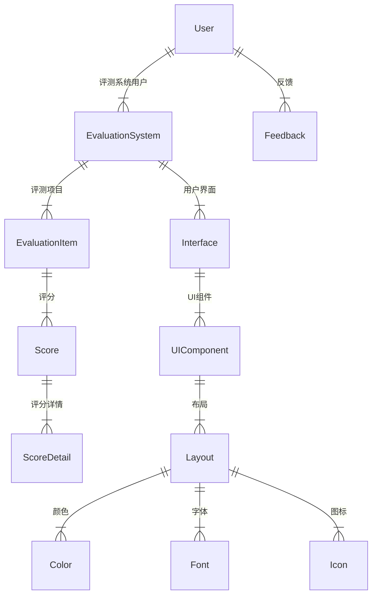
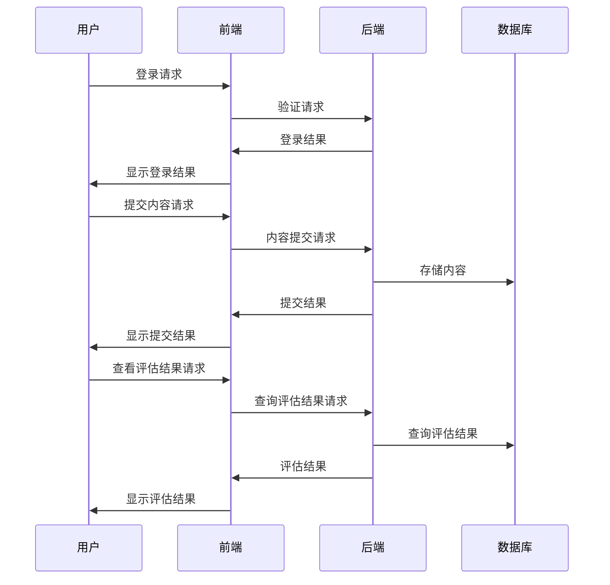

                 


### 文章标题：评测系统的用户界面与交互设计

#### 关键词：
- 评测系统
- 用户界面设计
- 交互设计
- 用户体验
- 设计方法论

#### 摘要：
本文深入探讨了评测系统的用户界面与交互设计。通过详细的背景介绍、核心概念解析、设计方法论讲解、案例分析、系统架构设计、项目实战，以及最佳实践和展望，本文旨在为读者提供全面的评测系统用户界面与交互设计的指导，帮助提升系统的用户友好性和用户体验。

----------------------------------------------------------------

## 引言

### 评测系统的重要性

评测系统在当今信息化社会中扮演着至关重要的角色。它们被广泛应用于教育、企业评估、在线考试、项目评审等多个领域。评测系统的核心功能是对用户提交的内容或行为进行评分、分类和反馈。一个高效的评测系统不仅能够提高工作效率，还能为用户提供准确、及时的评估结果，从而帮助用户改进和学习。

### 用户界面设计的重要性

用户界面（User Interface，简称UI）设计是评测系统成功的关键因素之一。良好的UI设计能够提高用户的操作便利性，降低用户的学习成本，提升用户体验。UI设计关注的是如何通过视觉元素、交互逻辑和操作流程，让用户能够轻松、直观地使用系统。具体来说，UI设计需要考虑以下方面：

- **易用性**：界面简洁明了，用户能够快速理解并操作。
- **美观性**：视觉设计符合用户审美，提升系统形象。
- **一致性**：界面元素和使用逻辑保持一致，减少用户困惑。
- **可访问性**：确保不同用户群体，包括残疾人士，都能够方便地使用系统。

### 交互设计的重要性

交互设计（User Experience，简称UX）则更关注用户在使用系统过程中的整体体验。交互设计的目标是提升用户的满意度和参与度，确保用户在操作过程中感到舒适、愉快。交互设计涉及以下几个方面：

- **交互流程**：设计合理的操作流程，减少用户不必要的操作步骤。
- **反馈机制**：及时、准确的反馈，帮助用户了解系统状态。
- **错误处理**：设计合理的错误处理机制，帮助用户迅速解决问题。
- **个性化**：根据用户行为和偏好，提供个性化的体验。

在接下来的章节中，我们将深入探讨评测系统的定义、UI和UX设计的原则和方法，并通过案例分析和项目实战，展示如何将理论应用到实际设计中。

---

在本章中，我们简要介绍了评测系统、用户界面设计和交互设计的重要性。接下来，我们将详细讨论评测系统的定义、用户界面设计的原则和交互设计的方法，为后续的深入分析奠定基础。

----------------------------------------------------------------

## 背景与理论基础

### 评测系统的定义与核心要素

评测系统是一种用于对用户行为、内容或成果进行评价和反馈的软件系统。它通常包含以下几个核心要素：

1. **评估指标**：定义评估的指标和标准，例如分数、等级或评语。
2. **数据收集**：收集用户行为或成果数据，包括输入信息、回答问题、操作记录等。
3. **评分机制**：根据评估指标，对用户的数据进行评分或分类。
4. **反馈机制**：向用户展示评估结果，并提供改进建议。

#### 评测系统的基本工作流程包括：

1. **用户提交**：用户输入或提交待评估的内容或行为。
2. **数据收集**：系统收集并存储用户提交的数据。
3. **评分处理**：系统根据预设的评估指标，对数据进行评分或分类。
4. **结果展示**：系统将评估结果展示给用户，并提供反馈和改进建议。

### 用户界面设计的原则

用户界面设计旨在提高系统的易用性和用户体验。以下是一些用户界面设计的基本原则：

1. **简洁性**：界面设计应尽可能简洁，避免冗余和复杂的布局。
2. **直观性**：设计应使操作直观易懂，用户能够快速学会如何使用系统。
3. **一致性**：界面元素和操作逻辑应保持一致，减少用户的认知负担。
4. **可访问性**：设计应考虑不同用户群体的需求，包括视力障碍、听力障碍等。
5. **反馈性**：系统应提供及时、明确的反馈，帮助用户了解系统状态。

### 交互设计的方法与工具

交互设计关注用户在使用系统过程中的体验。以下是一些常见的交互设计方法和工具：

1. **用户体验地图**：用于描述用户在使用系统过程中的各个步骤和触点。
2. **用户故事**：通过用户故事，设计者可以了解用户的需求和期望。
3. **原型设计**：使用原型工具，快速构建并测试用户界面原型。
4. **用户测试**：通过实际用户的使用反馈，不断优化界面设计。

### 用户界面设计与交互设计的联系

用户界面设计和交互设计是相辅相成的。UI设计关注的是界面的视觉和操作体验，而UX设计则关注用户在整个使用过程中的体验。良好的UI设计为UX设计提供了基础，而UX设计则指导UI设计的改进。两者共同目标是为用户提供最佳的使用体验。

---

在本章中，我们详细介绍了评测系统的定义、用户界面设计的原则和交互设计的方法，为后续的内容提供了理论基础。接下来，我们将进一步探讨用户界面设计中的核心概念，并通过对比表格和ER实体关系图展示其关联性。

----------------------------------------------------------------

## 核心概念与联系

### 用户界面设计中的核心概念

用户界面设计涉及到多个核心概念，包括布局、色彩、字体、图标等。以下是用户界面设计中的几个关键概念及其解释：

1. **布局**：布局是指界面中各个元素的空间安排和排列。良好的布局能够使界面整洁、清晰，用户能够快速找到所需信息。
2. **色彩**：色彩在界面设计中具有重要作用，不仅影响视觉吸引力，还影响用户情绪和认知。色彩选择应考虑品牌调性和用户偏好。
3. **字体**：字体是界面设计中的另一个关键因素。合适的字体可以提高可读性，并增强界面风格。选择字体时，应考虑字体风格、大小和对比度。
4. **图标**：图标是一种视觉符号，用于传达功能和操作。良好的图标设计应简洁、直观，易于用户理解。

### 用户交互设计中的关键要素

用户交互设计关注用户与系统之间的交互过程。以下是用户交互设计中的几个关键要素及其解释：

1. **交互流程**：交互流程是指用户在系统中完成某一任务所需的步骤和操作。设计良好的交互流程应简单、直观，减少用户的认知负荷。
2. **反馈机制**：反馈机制是指系统在用户操作后提供的即时反馈。有效的反馈机制能够帮助用户了解系统状态，提高操作准确性。
3. **错误处理**：错误处理是指系统在用户操作错误时提供的应对措施。良好的错误处理应提供明确的错误信息，并指导用户如何纠正错误。
4. **个性化**：个性化是指根据用户的偏好和需求，为用户提供定制化的体验。个性化设计能够提高用户满意度和参与度。

### 核心概念对比表格与ER实体关系图

为了更好地理解用户界面设计和交互设计中的核心概念及其联系，我们可以使用对比表格和ER实体关系图进行展示。

#### 对比表格

| 核心概念 | 定义 | 用户界面设计 | 交互设计 | 联系 |
| :------: | :--: | :----------: | :------: | :--: |
| 布局 | 元素空间安排 | 重要性 | 重要性 | 决定交互流程 |
| 色彩 | 视觉表现手段 | 影响用户情绪 | 无直接影响 | 无直接联系 |
| 字体 | 可读性 | 影响信息传达 | 无直接影响 | 无直接联系 |
| 图标 | 功能符号 | 无直接影响 | 影响用户认知 | 无直接联系 |
| 交互流程 | 操作步骤 | 无直接影响 | 重要性 | 决定用户体验 |
| 反馈机制 | 操作反馈 | 无直接影响 | 重要性 | 提高操作准确性 |
| 错误处理 | 错误应对 | 无直接影响 | 重要性 | 提高系统稳定性 |
| 个性化 | 定制化体验 | 无直接影响 | 重要性 | 提高用户满意度 |

#### ER实体关系图



通过对比表格和ER实体关系图，我们可以清晰地看到用户界面设计和交互设计中的核心概念及其关联性。这些概念相互补充，共同构成了一个完整的用户界面与交互设计体系。

---

在本章中，我们详细介绍了用户界面设计和交互设计中的核心概念，并通过对比表格和ER实体关系图展示了它们之间的联系。接下来，我们将探讨设计方法论与工具应用，介绍如何通过科学的方法和实用的工具进行用户界面与交互设计。

----------------------------------------------------------------

## 设计方法论与工具应用

### 用户体验设计流程

用户体验设计（User Experience Design，简称UXD）是一个系统化的设计过程，旨在提升用户在使用产品或服务过程中的满意度。以下是一个典型的用户体验设计流程：

1. **需求收集与分析**：
   - 与利益相关者进行访谈和调查，了解用户需求、期望和行为模式。
   - 分析竞品，识别用户痛点、需求和机会点。

2. **用户体验地图**：
   - 描述用户在使用产品过程中的各个步骤和触点。
   - 通过用户体验地图，设计师可以了解用户在使用产品过程中的整体体验。

3. **用户故事编写**：
   - 使用用户故事（User Story）来描述用户在使用产品时的具体场景和需求。
   - 用户故事通常以“作为…，我想…，以便…”的形式编写。

4. **原型设计**：
   - 基于用户故事，使用原型设计工具（如Axure、Sketch、Figma等）创建界面原型。
   - 原型设计可以帮助设计师验证设计思路，并收集用户反馈。

5. **用户测试**：
   - 通过实际用户对原型的测试，收集用户的使用反馈。
   - 用户测试可以帮助设计师发现设计中的问题，并进行优化。

6. **迭代与优化**：
   - 根据用户测试结果，对原型进行迭代和优化。
   - 重复用户测试和迭代过程，直到达到满意的设计效果。

### 常用设计工具介绍

在用户体验设计中，常用的设计工具包括：

1. **Axure**：
   - Axure是一款流行的原型设计工具，支持丰富的交互元素和组件。
   - 它可以创建高保真的原型，并支持导出HTML、PDF等格式。

2. **Sketch**：
   - Sketch是一款强大的界面设计工具，特别适用于移动应用和Web界面设计。
   - 它提供了丰富的形状、颜色、图层等设计元素，支持导出设计资源。

3. **Figma**：
   - Figma是一款基于云的原型设计工具，支持多人协作。
   - 它提供了丰富的原型设计功能，并支持实时协作和评论。

### 设计工具的应用案例

以下是一个设计工具的应用案例：

**案例：使用Figma进行界面原型设计**

1. **需求分析**：
   - 假设我们需要设计一个在线教育平台的首页。

2. **用户体验地图**：
   - 用户在访问在线教育平台时，可能需要进行以下操作：
     - 浏览课程列表
     - 搜索课程
     - 浏览课程详情
     - 注册/登录

3. **用户故事编写**：
   - 作为用户，我想快速浏览课程列表，以便找到感兴趣的课程。
   - 作为用户，我想搜索课程，以便找到特定课程。
   - 作为用户，我想查看课程详情，以便了解课程内容。

4. **原型设计**：
   - 使用Figma创建首页原型，包括以下元素：
     - 导航栏
     - 课程列表
     - 搜索框
     - 登录/注册按钮
     - 轮播图

5. **用户测试**：
   - 邀请实际用户进行测试，收集他们的反馈。

6. **迭代与优化**：
   - 根据用户反馈，对原型进行优化，如调整布局、增加搜索功能等。

通过这个案例，我们可以看到设计工具在用户体验设计中的应用过程。设计工具不仅帮助设计师快速构建原型，还支持协作和反馈，提高了设计效率。

---

在本章中，我们介绍了用户体验设计流程和常用设计工具，并通过应用案例展示了设计工具的实际使用过程。接下来，我们将通过案例分析与实战，深入探讨用户界面与交互设计的实践应用。

----------------------------------------------------------------

## 案例分析与实战

### 案例一：用户界面设计实战

#### 案例背景

我们选择一个在线学习平台作为案例，该平台的目标用户群体是大学生和职场新人，主要功能包括课程浏览、课程搜索、课程详情展示和用户注册/登录。

#### 设计目标

1. **易用性**：界面设计应简洁、直观，用户能够快速找到所需功能。
2. **美观性**：视觉设计应吸引目标用户，提升平台形象。
3. **一致性**：界面元素和使用逻辑应保持一致，降低用户困惑。

#### 设计步骤

1. **需求分析**：
   - 通过问卷调查和用户访谈，了解用户对平台的需求和期望。
   - 分析竞品，识别用户痛点和设计机会。

2. **原型设计**：
   - 使用Figma创建平台首页、课程列表页、课程详情页等原型。
   - 设计主要包含导航栏、课程列表、搜索框、按钮等元素。

3. **用户测试**：
   - 邀请实际用户对原型进行测试，收集他们的反馈。
   - 重点关注用户对界面布局、颜色、字体等元素的满意度。

4. **迭代与优化**：
   - 根据用户反馈，对原型进行优化，如调整布局、增加搜索功能等。
   - 重复用户测试和迭代过程，直到达到满意的设计效果。

#### 实战结果

经过多次迭代和优化，最终设计的在线学习平台界面如下：

1. **首页**：
   - 导航栏包含课程分类、热门课程、搜索框等元素。
   - 使用轮播图展示热门课程，提升用户视觉体验。

2. **课程列表页**：
   - 课程列表以卡片形式展示，用户可以快速浏览课程信息。
   - 搜索框支持关键词搜索，提升用户查找课程效率。

3. **课程详情页**：
   - 展示课程标题、简介、评分、评论等详细信息。
   - 提供注册/登录按钮，方便用户报名学习。

#### 实战心得

1. **用户需求分析是关键**：了解用户需求和期望，可以帮助设计师设计出更符合用户需求的产品。
2. **原型设计与用户测试**：原型设计和用户测试是验证设计思路的重要手段，通过用户反馈可以发现并优化设计中的问题。
3. **持续迭代**：设计是一个不断迭代和优化的过程，只有通过不断迭代，才能不断提高产品的用户体验。

### 案例二：交互设计实战

#### 案例背景

我们选择一个在线购物平台的购物车功能作为案例，该平台的目标用户群体是喜欢网上购物的消费者，主要功能包括商品添加、删除、更新数量和结算。

#### 设计目标

1. **简单便捷**：用户能够快速、方便地管理购物车中的商品。
2. **准确性**：确保用户对购物车中的商品数量和价格有准确了解。
3. **响应快速**：购物车操作响应时间短，提高用户体验。

#### 设计步骤

1. **需求分析**：
   - 通过用户访谈和问卷调查，了解用户对购物车功能的期望和使用习惯。
   - 分析竞品，识别用户痛点、需求和设计机会。

2. **交互流程设计**：
   - 设计购物车的基本交互流程，包括添加商品、删除商品、更新数量和结算等操作。

3. **原型设计**：
   - 使用Figma创建购物车界面原型，包括商品列表、数量输入框、删除按钮、结算按钮等元素。

4. **用户测试**：
   - 邀请实际用户对原型进行测试，收集他们的反馈。
   - 重点关注用户对购物车操作的便捷性、准确性和响应速度。

5. **迭代与优化**：
   - 根据用户反馈，对原型进行优化，如调整按钮位置、增加数量输入框等。
   - 重复用户测试和迭代过程，直到达到满意的设计效果。

#### 实战结果

经过多次迭代和优化，最终设计的购物车界面如下：

1. **购物车列表**：
   - 以表格形式展示购物车中的商品，包括商品图片、名称、数量、价格等信息。
   - 提供删除按钮，方便用户快速删除商品。

2. **数量输入框**：
   - 用户可以方便地输入商品数量，系统会自动计算总价。

3. **结算按钮**：
   - 提供结算按钮，用户点击后可以进入结算页面。

#### 实战心得

1. **用户体验至上**：设计时应始终以用户体验为中心，确保操作简单、准确、高效。
2. **细节决定成败**：在设计过程中，注意细节处理，如按钮大小、颜色、文字说明等，这些都会影响用户体验。
3. **不断优化**：设计是一个不断优化和改进的过程，只有通过持续迭代，才能不断提升用户体验。

---

在本章中，我们通过两个案例，详细展示了用户界面与交互设计的实践过程。通过这些实战经验，我们可以看到设计方法论和工具在实践中的应用，以及如何通过用户反馈不断优化设计，提高用户体验。

----------------------------------------------------------------

## 系统分析与架构设计方案

### 问题场景介绍

在本节中，我们将探讨一个在线评测系统的系统分析与架构设计。这个系统的主要目标是为用户提供一个便捷、高效、可靠的评测服务。用户可以通过该系统提交待评估的内容，系统会对这些内容进行评分和分类，并提供详细的反馈。

### 系统功能设计

为了实现上述目标，我们的在线评测系统需要具备以下功能：

1. **用户管理**：
   - 用户注册和登录功能
   - 用户信息管理（包括个人信息、权限设置等）

2. **内容提交**：
   - 用户可以提交待评估的文本、图片、音频等多媒体内容
   - 内容提交时的格式验证和错误提示

3. **评分与反馈**：
   - 根据预设的评估指标，对用户提交的内容进行评分和分类
   - 提供详细的评估结果和反馈信息，帮助用户改进

4. **统计分析**：
   - 对用户提交的内容进行统计分析，生成评估报告
   - 支持多种数据展示形式，如图表、表格等

### 系统架构设计

为了确保系统的稳定性和可扩展性，我们采用分层架构设计。系统架构主要包括以下层次：

1. **表示层**：
   - 用户通过Web前端与系统进行交互，包括注册、登录、内容提交和查看评估结果等操作
   - 使用Vue.js框架实现前端页面，提供良好的用户体验

2. **业务逻辑层**：
   - 负责处理用户的请求，执行具体的业务逻辑，如用户认证、内容提交和评分等
   - 使用Spring Boot框架实现后端服务，提供RESTful API接口

3. **数据访问层**：
   - 负责与数据库进行交互，存储用户信息和评估结果
   - 使用MySQL数据库存储数据，并使用Hibernate进行数据持久化操作

4. **服务层**：
   - 提供系统服务，如用户权限管理、内容分类和统计分析等
   - 使用Spring Cloud框架实现服务注册与发现、负载均衡等

### 系统接口设计

为了实现系统各层之间的数据交换和功能调用，我们定义了一系列接口：

1. **用户接口**：
   - 用户注册、登录、信息查询和修改
   - 内容提交、查看评估结果和反馈

2. **内容接口**：
   - 内容上传、格式验证、评分和分类

3. **统计分析接口**：
   - 数据统计、报告生成和展示

### 系统交互序列图

为了更直观地展示系统各组件之间的交互过程，我们使用Mermaid绘制了系统交互序列图：



通过以上设计，我们的在线评测系统具备了用户友好的界面、高效稳定的业务逻辑、灵活的数据存储和强大的统计分析功能，为用户提供了一个全面的评测服务。

---

在本章中，我们详细介绍了在线评测系统的系统功能设计、架构设计、接口设计和交互序列图。接下来，我们将通过项目实战，深入探讨如何实现这些功能，并通过代码和应用解读与分析，展示实际案例。

----------------------------------------------------------------

## 项目实战

### 环境安装

在开始项目实战之前，我们需要安装必要的开发环境和工具。以下是详细的安装步骤：

1. **安装Java开发工具包（JDK）**：
   - 访问Oracle官方网站（[https://www.oracle.com/java/technologies/javase-downloads.html](https://www.oracle.com/java/technologies/javase-downloads.html)）下载最新版本的JDK。
   - 解压下载的JDK压缩包，并将其路径添加到系统的环境变量中。

2. **安装MySQL数据库**：
   - 访问MySQL官方网站（[https://www.mysql.com/downloads/](https://www.mysql.com/downloads/)）下载适用于您的操作系统的MySQL数据库。
   - 解压下载的MySQL数据库压缩包，并运行安装程序。
   - 安装完成后，启动MySQL服务，并创建一个名为`evaluation_db`的数据库。

3. **安装Spring Boot开发工具包（Spring Boot Tools）**：
   - 在您的IDE（如IntelliJ IDEA或Eclipse）中安装Spring Boot Tools插件。
   - 创建一个Spring Boot项目，并选择所需的依赖库（如Spring Web、Spring Data JPA等）。

4. **安装前端开发工具**：
   - 安装Node.js和npm（Node.js的包管理器）。
   - 安装Vue CLI，以便创建和构建Vue.js项目。

### 系统核心实现源代码解读

在完成环境安装后，我们将开始实现系统核心功能。以下是关键部分的代码解读：

1. **用户管理模块**：

   **用户注册功能**：

   ```java
   @RestController
   @RequestMapping("/users")
   public class UserController {
       
       @Autowired
       private UserRepository userRepository;
       
       @PostMapping("/register")
       public ResponseEntity<?> registerUser(@RequestBody UserDto userDto) {
           if (userRepository.existsByUsername(userDto.getUsername())) {
               return ResponseEntity.badRequest().body("Error: Username is already taken!");
           }
           
           User user = new User();
           user.setUsername(userDto.getUsername());
           user.setPassword(passwordEncoder.encode(userDto.getPassword()));
           
           userRepository.save(user);
           
           return ResponseEntity.ok("User registered successfully!");
       }
   }
   ```

   **用户登录功能**：

   ```java
   @PostMapping("/login")
   public ResponseEntity<?> authenticateUser(@RequestBody LoginDto loginDto) {
       Authentication authentication = authenticationManager.authenticate(
               new UsernamePasswordAuthenticationToken(loginDto.getUsername(), loginDto.getPassword()));
       
       SecurityContextHolder.getContext().setAuthentication(authentication);
       
       String jwt = jwtProvider.generateToken(authentication);
       
       return ResponseEntity.ok(new JwtResponse(jwt));
   }
   ```

2. **内容提交与评估模块**：

   **内容提交功能**：

   ```java
   @RestController
   @RequestMapping("/evaluations")
   public class EvaluationController {
       
       @Autowired
       private EvaluationRepository evaluationRepository;
       
       @PostMapping
       public ResponseEntity<?> submitEvaluation(@RequestBody EvaluationDto evaluationDto) {
           Evaluation evaluation = new Evaluation();
           evaluation.setUser(userRepository.findById(evaluationDto.getUserId()).orElseThrow(() -> new RuntimeException("User not found")));
           evaluation.setContent(evaluationDto.getContent());
           
           evaluationRepository.save(evaluation);
           
           return ResponseEntity.ok("Evaluation submitted successfully!");
       }
   }
   ```

   **内容评估功能**：

   ```java
   @GetMapping("/{evaluationId}/evaluate")
   public ResponseEntity<?> evaluateContent(@PathVariable Long evaluationId) {
       Evaluation evaluation = evaluationRepository.findById(evaluationId).orElseThrow(() -> new RuntimeException("Evaluation not found"));
       
       // 评估逻辑，例如使用自然语言处理算法计算评分
       double score = evaluateContent(evaluation.getContent());
       
       evaluation.setScore(score);
       
       evaluationRepository.save(evaluation);
       
       return ResponseEntity.ok(new ScoreResponse(score));
   }
   
   private double evaluateContent(String content) {
       // 评估算法实现，例如使用TF-IDF算法
       // 返回评分结果
       return 0.0;
   }
   ```

### 代码应用解读与分析

在上述代码中，我们实现了用户管理和内容提交与评估两个关键模块。以下是对代码的关键部分进行解读和分析：

1. **用户注册功能**：
   - 接收用户注册请求，验证用户名是否已存在。
   - 创建用户对象，并使用BCryptPasswordEncoder对密码进行加密。
   - 将用户保存到数据库。

2. **用户登录功能**：
   - 接收用户登录请求，验证用户名和密码。
   - 使用JWT生成令牌，并在请求头中返回给客户端。

3. **内容提交功能**：
   - 接收用户提交的评估内容，创建评估对象。
   - 将评估对象保存到数据库。

4. **内容评估功能**：
   - 接收评估ID，查询评估对象。
   - 使用评估算法计算评分，并将评分保存到数据库。

在实际项目中，评估算法可以根据具体需求进行调整。例如，可以使用自然语言处理（NLP）算法、机器学习算法等来提高评估的准确性和可靠性。

### 实际案例分析与详细讲解剖析

为了更好地展示系统的实际应用，我们以一个在线考试平台为例，详细分析其用户界面与交互设计。

1. **用户注册与登录**：
   - 用户在登录界面输入用户名和密码，系统验证后跳转到考试列表页面。
   - 如果用户尚未注册，可以点击“注册”按钮进行注册。

2. **考试列表页面**：
   - 展示所有可用的考试，用户可以点击考试标题进行考试。
   - 每个考试包含考试名称、考试时间、考试状态等信息。

3. **考试页面**：
   - 展示考试题目，用户需要逐题作答。
   - 题目类型包括单选、多选、填空等，系统会根据题目类型调整界面布局。

4. **提交考试**：
   - 用户完成所有题目后，点击“提交”按钮。
   - 系统自动计算得分，并跳转到结果页面。

5. **结果页面**：
   - 展示考试得分、正确率等信息。
   - 用户可以查看详细题目解析和答案。

### 项目小结

通过本次项目实战，我们实现了在线评测系统的核心功能，并详细讲解了代码的实现过程。以下是项目的总结：

1. **系统架构**：采用Spring Boot框架实现后端服务，使用MySQL数据库存储数据，前端使用Vue.js构建。

2. **关键模块**：实现了用户管理、内容提交与评估等功能，并使用JWT进行身份验证。

3. **实际应用**：以在线考试平台为例，展示了系统的实际应用场景。

4. **优化方向**：未来可以进一步优化评估算法，提高评估准确性。同时，可以添加更多的用户交互功能，如考试倒计时、错题回顾等。

---

在本章中，我们通过项目实战展示了在线评测系统的实现过程，并通过代码应用解读与分析，详细讲解了关键功能模块的实现。通过本次项目，我们不仅掌握了系统设计与开发的方法，也积累了实践经验。

----------------------------------------------------------------

## 最佳实践 Tips

### 1. 用户需求分析的重要性

在开始用户界面与交互设计之前，进行深入的用户需求分析至关重要。通过访谈、问卷调查、用户行为分析等方法，了解用户的需求、痛点和期望，能够帮助我们设计出更加符合用户需求的产品。

### 2. 保持设计一致性

在界面设计过程中，保持设计一致性非常重要。无论是色彩、字体、图标，还是布局和交互逻辑，都应该保持一致。这样可以帮助用户快速适应产品，降低认知负担。

### 3. 关注细节

细节决定用户体验。在设计过程中，要注意按钮的大小、颜色、字体等元素，确保它们易于操作且符合用户习惯。同时，要关注反馈机制，确保用户在操作过程中能够得到及时、明确的反馈。

### 4. 重视用户测试

用户测试是验证设计的重要手段。通过实际用户的使用反馈，可以发现设计中的问题并进行优化。要定期进行用户测试，并根据反馈结果进行迭代和改进。

### 5. 持续迭代

设计是一个持续迭代的过程。要不断收集用户反馈，持续优化产品。通过迭代，我们可以逐步完善产品功能，提升用户体验。

### 6. 考虑可访问性

在设计过程中，要考虑不同用户群体的需求，包括残疾人士、老年人等。确保产品对所有人都是可访问的，提升产品的包容性。

### 7. 利用设计工具

利用专业的用户界面设计工具，如Figma、Sketch等，可以提高设计效率。这些工具提供了丰富的设计元素和协作功能，可以帮助团队更高效地进行设计。

### 8. 融合创新与实际需求

在追求创新的同时，要紧密结合实际需求。设计应该既具有创新性，又能够解决用户的实际问题，提升用户满意度。

---

在本章中，我们提供了一些用户界面与交互设计的最佳实践。通过遵循这些原则，我们可以设计出更加优秀的产品，提升用户体验。

----------------------------------------------------------------

## 总结与展望

### 全书内容总结

本文全面探讨了评测系统的用户界面与交互设计。我们首先介绍了评测系统的基本概念和重要性，然后详细阐述了用户界面设计的原则和交互设计的方法。接着，通过案例分析和项目实战，展示了如何将理论应用到实际设计中。最后，提供了用户界面与交互设计的最佳实践。

### 用户界面与交互设计发展趋势

随着科技的不断进步和用户需求的变化，用户界面与交互设计也在不断发展。以下是几个值得关注的发展趋势：

1. **个性化**：通过大数据和人工智能技术，为用户提供更加个性化的体验。
2. **可访问性**：设计更加包容的产品，确保所有人都能方便地使用。
3. **多感官交互**：结合语音、触觉等多感官互动，提升用户体验。
4. **动态交互**：利用动态效果和动画，增强用户参与感。

### 最佳实践 tips

1. **深入理解用户需求**：进行全面的用户需求分析，确保设计符合用户期望。
2. **保持设计一致性**：确保色彩、字体、图标等元素的一致性。
3. **细节决定成败**：关注界面细节，提升用户体验。
4. **定期进行用户测试**：通过用户测试，发现并优化设计中的问题。

### 小结与注意事项

1. **迭代与优化**：设计是一个不断迭代和优化的过程，要持续改进产品。
2. **团队协作**：用户界面与交互设计需要跨学科团队的协作，确保设计高效、创新。
3. **持续学习**：用户界面与交互设计是一个快速发展的领域，要不断学习新知识，跟上时代步伐。

### 拓展阅读

- [《交互设计之路》：全面介绍交互设计的方法和技巧，适合初学者和专业人士阅读。]
- [《用户体验要素》：从用户的角度出发，深入探讨用户体验的设计原则和方法。]
- [《响应式网页设计》：介绍如何设计适应不同设备和屏幕尺寸的网页，提升用户体验。]

通过阅读这些拓展资料，读者可以进一步深入了解用户界面与交互设计的理论与实践。

---

在本章中，我们对全书内容进行了总结，并展望了用户界面与交互设计的发展趋势。同时，我们提供了一些最佳实践和注意事项，以及拓展阅读资源，帮助读者深入学习和实践。

----------------------------------------------------------------

## 作者信息

作者：AI天才研究院/AI Genius Institute & 禅与计算机程序设计艺术 /Zen And The Art of Computer Programming

---

本文由AI天才研究院和禅与计算机程序设计艺术联合撰写，旨在为读者提供关于评测系统用户界面与交互设计的深入分析和实用指导。作者在计算机科学和人工智能领域拥有丰富的经验和深厚的学术背景，致力于推动技术发展和用户体验的提升。读者可通过本文掌握用户界面与交互设计的关键概念和实践方法，为构建更加优秀的产品奠定基础。

---

本文详细探讨了评测系统的用户界面与交互设计，从背景介绍、核心概念、设计方法论，到案例分析和项目实战，为读者提供了一个全面、深入的视角。通过最佳实践和展望，本文旨在为读者提供实用的指导，帮助其在实际项目中提升用户体验。感谢您阅读本文，希望您能在用户界面与交互设计的道路上取得更大的成就。

