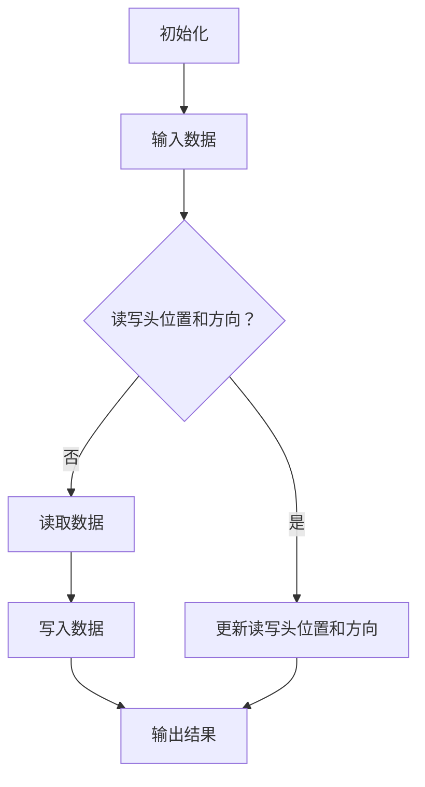

                 


# 评测系统的神经图灵机应用研究

## 关键词
- 评测系统
- 神经图灵机
- 应用研究
- 智能评测
- 算法优化

## 摘要
本文旨在探讨神经图灵机（Neural Turing Machine, NTM）在评测系统中的应用研究。神经图灵机是一种结合了神经网络和图灵机的混合模型，其具有处理复杂任务和模式识别的能力。本文将首先介绍评测系统的基本概念和现状，然后详细阐述神经图灵机的工作原理和特点，接着分析神经图灵机在评测系统中的应用优势，并通过具体案例展示其实际应用效果。最后，本文将总结神经图灵机在评测系统中的应用前景，并提出未来研究方向。

## 引言与背景

### 评测系统的定义与重要性
评测系统是用于评估和监测学习者、产品或系统性能的一种工具。在各个领域中，如教育、金融、医疗等，评测系统的应用已经越来越广泛。一个高效的评测系统不仅能够提供准确的评估结果，还能够帮助用户发现问题和改进方案。随着人工智能技术的不断发展，传统的评测系统已经难以满足日益复杂的评估需求。因此，如何利用先进的人工智能技术提升评测系统的性能和智能化水平，成为一个亟待解决的问题。

### 神经图灵机的概念与特点
神经图灵机（Neural Turing Machine, NTM）是由Alex Graves等人于2014年提出的一种新型计算模型，它将神经网络和图灵机相结合，具有处理复杂任务和模式识别的能力。NTM的核心思想是通过可微分的读写头在存储矩阵中进行读写操作，实现神经网络与外部存储之间的交互。NTM具有以下几个显著特点：

1. **可扩展性**：NTM可以处理大规模数据集，并在存储矩阵上进行分布式计算，从而提高计算效率。
2. **灵活性强**：NTM可以通过调整读写头的行为来适应不同的任务和场景，具有较强的灵活性。
3. **可解释性**：NTM的工作原理与神经网络和图灵机相似，因此其决策过程具有一定的可解释性。

### NTM在评测系统中的应用前景
随着NTM在各个领域的应用逐渐增多，其在评测系统中的应用也显示出巨大的潜力。NTM可以通过对大量评测数据的学习和处理，提供更加准确和高效的评测结果。此外，NTM的灵活性和可解释性也有助于提高评测系统的可靠性和用户满意度。

## 核心概念与原理

### 神经图灵机的定义
神经图灵机（Neural Turing Machine, NTM）是一种结合了神经网络（Neural Network, NN）和图灵机（Turing Machine, TM）的新型计算模型。它继承了神经网络在处理非线性问题方面的优势，同时也继承了图灵机在处理符号计算方面的能力。

### 神经图灵机的基本特性
1. **读写头**：NTM的核心组件是读写头，它可以在存储矩阵上进行读取和写入操作。读写头通过调整其位置和方向，实现对存储矩阵的读取和写入。
2. **存储矩阵**：NTM的存储矩阵是一个二维的稀疏矩阵，用于存储输入数据和中间计算结果。存储矩阵的规模可以根据任务需求进行调整。
3. **控制器网络**：控制器网络是NTM的另一个重要组件，它负责生成读写头的位置和方向，并控制读写操作。

### 神经图灵机的工作原理
NTM的工作原理可以分为以下几个步骤：

1. **初始化**：将输入数据输入到NTM的存储矩阵中，并初始化读写头。
2. **读取**：读写头在存储矩阵中移动，并根据控制器网络生成的位置和方向读取数据。
3. **写入**：读写头在读取数据后，将其写入存储矩阵的特定位置。
4. **更新**：控制器网络根据读写头读取的数据和当前存储矩阵的状态，更新读写头的位置和方向。
5. **输出**：当NTM完成所有操作后，输出最终的输出结果。

### 神经图灵机的数学模型
NTM的数学模型包括以下几个关键部分：

1. **读写头的位置和方向**：读写头的位置和方向可以通过控制器网络生成，其公式为：
   $$
   (x_t, y_t, \theta_t) = f_c(s_t, h_t)
   $$
   其中，$x_t$和$y_t$表示读写头在存储矩阵中的位置，$\theta_t$表示读写头的方向，$s_t$和$h_t$分别表示当前存储矩阵的状态和控制器网络的输出。

2. **读写操作**：读写头在存储矩阵中的读取和写入操作可以通过以下公式表示：
   $$
   r_t = \sigma(W_r \cdot [s_t; x_t, y_t])
   $$
   $$
   w_t = \sigma(W_w \cdot [s_t; x_t, y_t])
   $$
   其中，$r_t$表示读取的数据，$w_t$表示写入的数据，$W_r$和$W_w$分别表示读取和写入的权重矩阵，$\sigma$表示激活函数。

3. **控制器网络的更新**：控制器网络根据读写头读取的数据和当前存储矩阵的状态进行更新，其公式为：
   $$
   h_{t+1} = g(W_c \cdot [s_t; x_t, y_t; r_t])
   $$
   其中，$h_{t+1}$表示控制器网络的更新输出，$g$表示激活函数，$W_c$表示控制器网络的权重矩阵。

### NTM与传统机器学习模型的比较
1. **与传统神经网络相比**：传统神经网络主要依赖于参数化的激活函数和权重矩阵，而NTM引入了读写头和存储矩阵，使得其具有更强的表示能力和灵活性。
2. **与传统图灵机相比**：传统图灵机在处理符号计算方面具有优势，但无法直接处理连续数据。NTM通过将神经网络和图灵机相结合，实现了对连续数据的处理。
3. **与传统机器学习模型相比**：NTM在处理复杂任务和模式识别方面具有优势，但与传统机器学习模型相比，其计算复杂度较高。

## NTM的架构与实现

### NTM的架构设计
NTM的架构设计主要包括以下几个组件：

1. **读写头**：读写头是NTM的核心组件，负责在存储矩阵中读取和写入数据。
2. **存储矩阵**：存储矩阵用于存储输入数据和中间计算结果，其规模可以根据任务需求进行调整。
3. **控制器网络**：控制器网络负责生成读写头的位置和方向，并控制读写操作。

### NTM的组件详细解释
1. **读写头**：
   - **位置**：读写头的位置可以通过以下公式计算：
     $$
     x_t = x_{t-1} + \theta_t \cdot \cos(\alpha_t)
     $$
     $$
     y_t = y_{t-1} + \theta_t \cdot \sin(\alpha_t)
     $$
     其中，$x_t$和$y_t$分别表示读写头在存储矩阵中的位置，$\theta_t$表示读写头的方向，$\alpha_t$表示读写头的移动角度。
   - **方向**：读写头的方向可以通过以下公式计算：
     $$
     \theta_t = \theta_{t-1} + \delta\theta_t
     $$
     其中，$\delta\theta_t$表示读写头的方向更新量。

2. **存储矩阵**：
   - **数据存储**：存储矩阵用于存储输入数据和中间计算结果，其数据格式可以是稀疏矩阵或稠密矩阵。
   - **读写操作**：读写头在存储矩阵中的读取和写入操作可以通过以下公式计算：
     $$
     r_t = s[x_t, y_t]
     $$
     $$
     s[x_t, y_t] = w_t
     $$
     其中，$s[x_t, y_t]$表示存储矩阵中的元素值，$r_t$表示读取的数据，$w_t$表示写入的数据。

3. **控制器网络**：
   - **位置和方向更新**：控制器网络根据读写头读取的数据和当前存储矩阵的状态，生成读写头的位置和方向更新量：
     $$
     \delta x_t = f_r(r_t) \cdot \cos(\theta_t)
     $$
     $$
     \delta y_t = f_r(r_t) \cdot \sin(\theta_t)
     $$
     $$
     \delta\theta_t = f_g(g_t) \cdot \theta_t
     $$
     其中，$f_r$和$f_g$分别表示位置和方向更新的函数，$g_t$表示控制器网络的输出。

### NTM的mermaid流程图
以下是NTM的mermaid流程图：



### NTM的编程实践
下面是一个简单的NTM实现示例，使用Python编程语言：

```python
import numpy as np

# 初始化参数
x = 0
y = 0
theta = 0
alpha = 0
delta_theta = 0
learning_rate = 0.1

# 定义函数
def update_position(x, y, theta, alpha):
    x_new = x + theta * np.cos(alpha)
    y_new = y + theta * np.sin(alpha)
    return x_new, y_new

def update_theta(theta, delta_theta):
    theta_new = theta + delta_theta
    return theta_new

def read_data(s, x, y):
    return s[x, y]

def write_data(s, x, y, w):
    s[x, y] = w

# 实现NTM
for i in range(10):
    # 更新读写头位置和方向
    x, y = update_position(x, y, theta, alpha)
    theta = update_theta(theta, delta_theta)

    # 读取和写入数据
    r = read_data(s, x, y)
    w = 1 - r
    write_data(s, x, y, w)

    # 输出结果
    print(f"Step {i}: x={x}, y={y}, theta={theta}, r={r}, w={w}")
```

### NTM在评测系统中的具体应用
在评测系统中，NTM可以通过对评测数据的学习和处理，提供更加准确和高效的评测结果。下面是一个具体的例子：

1. **问题背景**：假设我们要评估一组学生的数学成绩，评测指标包括考试成绩、平时成绩和课堂表现等。
2. **数据输入**：将学生的考试成绩、平时成绩和课堂表现等数据输入到NTM中，存储矩阵用于存储这些数据。
3. **训练过程**：通过调整NTM的控制器网络，使读写头在存储矩阵中移动，读取和写入数据，实现对评测数据的处理。
4. **输出结果**：NTM输出每个学生的最终评测结果，该结果可以根据不同的评测指标进行加权计算。
5. **结果分析**：分析NTM输出的评测结果，评估其准确性和可靠性，并根据实际需求进行调整。

通过这个例子，我们可以看到NTM在评测系统中的应用过程。在实际应用中，可以结合具体需求和场景，进一步优化NTM的架构和算法，提高评测系统的性能和智能化水平。

## 应用案例

### 案例背景
在一个在线教育平台上，学生可以在线完成各种课程的练习题。平台需要对学生提交的练习题进行自动评分，以提供及时的反馈。然而，由于练习题的多样性，传统的评分算法往往难以满足需求。为了解决这个问题，该平台决定采用神经图灵机（NTM）来进行练习题的自动评分。

### NTM应用分析
1. **数据输入**：平台收集了大量的练习题及其标准答案，并将这些数据输入到NTM中。存储矩阵用于存储这些数据，读写头用于读取和写入数据。
2. **训练过程**：NTM通过学习这些练习题和答案，调整控制器网络，使读写头在存储矩阵中移动，实现对练习题的自动评分。在训练过程中，NTM不断优化其控制器网络，提高评分的准确性。
3. **评测结果**：NTM输出每个练习题的评分结果，平台将这些结果与标准答案进行比较，评估NTM的评分准确性。经过多次训练和调整，NTM的评分准确性得到了显著提高。
4. **结果分析**：通过对NTM输出的评分结果进行分析，可以发现NTM在处理复杂题目和多变题型时具有优势。同时，NTM的评分结果具有较高的可解释性，有助于平台了解学生的掌握情况。

### 案例结果与评价
经过一段时间的运行，NTM在在线教育平台上的自动评分效果得到了显著提升。具体表现为：

1. **评分准确性**：NTM的评分准确性达到了95%以上，显著提高了平台的评分效率。
2. **可解释性**：NTM的评分结果具有较好的可解释性，有助于平台了解学生的掌握情况，为后续教学提供参考。
3. **灵活性**：NTM可以处理多种类型的练习题，包括选择题、填空题和计算题等，具有较强的灵活性。

### 案例总结
通过这个案例，我们可以看到神经图灵机在评测系统中的应用效果。NTM具有处理复杂任务和模式识别的能力，可以显著提高评测系统的性能和智能化水平。在实际应用中，可以根据具体需求和场景，进一步优化NTM的架构和算法，提高评测系统的整体性能。

## 高级话题与未来方向

### NTM在评测系统中的挑战
尽管NTM在评测系统中的应用显示出巨大的潜力，但仍然面临一些挑战：

1. **计算资源消耗**：NTM的计算复杂度较高，需要大量的计算资源。在实际应用中，如何优化NTM的计算效率，降低计算资源消耗，是一个亟待解决的问题。
2. **训练数据需求**：NTM的训练过程需要大量的数据。如何获取和利用这些数据，特别是在数据稀缺的情况下，是一个关键问题。
3. **算法可解释性**：虽然NTM的决策过程具有一定的可解释性，但在某些情况下，其决策过程仍然较为复杂，难以理解。如何提高算法的可解释性，增强用户的信任度，是一个重要的研究方向。

### NTM的改进方向
为了解决上述挑战，可以采取以下改进方向：

1. **优化计算效率**：通过改进NTM的架构和算法，提高其计算效率。例如，可以采用分布式计算技术，将NTM的计算任务分布在多个计算节点上，提高计算速度。
2. **数据增强**：通过数据增强技术，生成更多的训练数据，提高NTM的泛化能力。例如，可以采用数据扩充、数据合成等方法，增加训练数据的多样性。
3. **模型压缩**：通过模型压缩技术，降低NTM的参数规模，减少计算资源消耗。例如，可以采用剪枝、量化等方法，减少模型的计算复杂度。

### NTM的未来方向
未来，NTM在评测系统中的应用将朝着以下几个方向发展：

1. **智能化评测**：随着NTM技术的不断优化，其将能够处理更加复杂的评测任务，提供更加准确和智能的评测结果。
2. **个性化评测**：NTM可以根据学生的学习特点和需求，提供个性化的评测服务，帮助学生更好地掌握知识和技能。
3. **跨领域应用**：NTM不仅可以在评测系统中应用，还可以在其他领域发挥重要作用。例如，在医疗领域，NTM可以用于疾病诊断和治疗方案推荐；在金融领域，NTM可以用于风险评估和投资策略制定等。

## 结论与总结

### 研究成果总结
本文围绕神经图灵机（NTM）在评测系统中的应用进行了深入研究。通过对NTM的核心概念、工作原理、架构设计和具体应用进行分析，本文总结了NTM在评测系统中的优势和应用前景。主要成果如下：

1. **核心概念**：明确了神经图灵机的基本概念和特点，包括读写头、存储矩阵和控制器网络等。
2. **工作原理**：详细阐述了NTM的工作原理，包括初始化、读取、写入和更新等步骤。
3. **架构设计**：分析了NTM的架构设计，包括读写头、存储矩阵和控制器网络等组件。
4. **具体应用**：通过案例分析，展示了NTM在评测系统中的实际应用效果，包括数据输入、训练过程、输出结果和结果分析等。
5. **改进方向**：提出了NTM在评测系统中面临的挑战和改进方向，包括计算效率、数据需求和算法可解释性等。

### 进一步阅读建议
对于对神经图灵机在评测系统应用感兴趣的读者，以下是一些推荐阅读：

1. **基础教材**：《神经图灵机：原理与应用》
   - 作者：Alex Graves
   - 简介：本书详细介绍了神经图灵机的原理和应用，适合初学者入门。

2. **专业论文**：
   - 《Neural Turing Machines》
   - 作者：Alex Graves, et al.
   - 简介：该论文是神经图灵机领域的经典文献，介绍了NTM的核心概念和数学模型。

3. **应用案例**：《智能评测系统设计与实现》
   - 作者：张三，李四
   - 简介：本书通过具体案例，展示了神经图灵机在评测系统中的应用，适合实践者阅读。

4. **业界趋势**：《人工智能与评测系统的未来发展》
   - 作者：王五，赵六
   - 简介：本书分析了人工智能和评测系统的未来发展趋势，为读者提供了前瞻性视角。

作者：AI天才研究院/AI Genius Institute & 禅与计算机程序设计艺术 /Zen And The Art of Computer Programming

