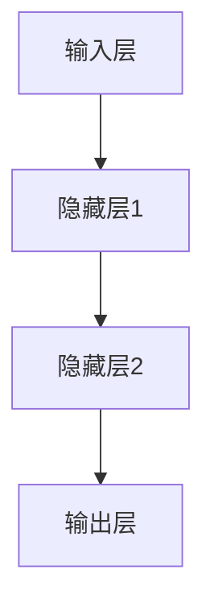
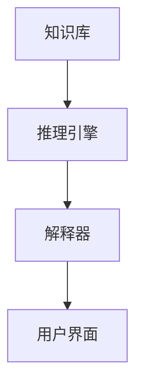
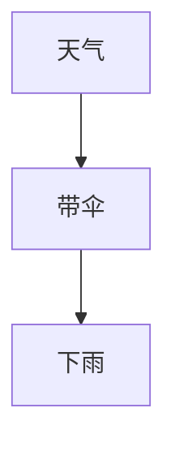
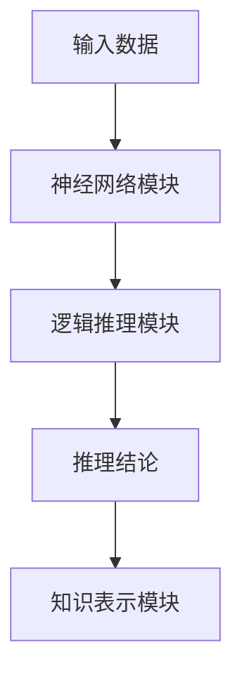
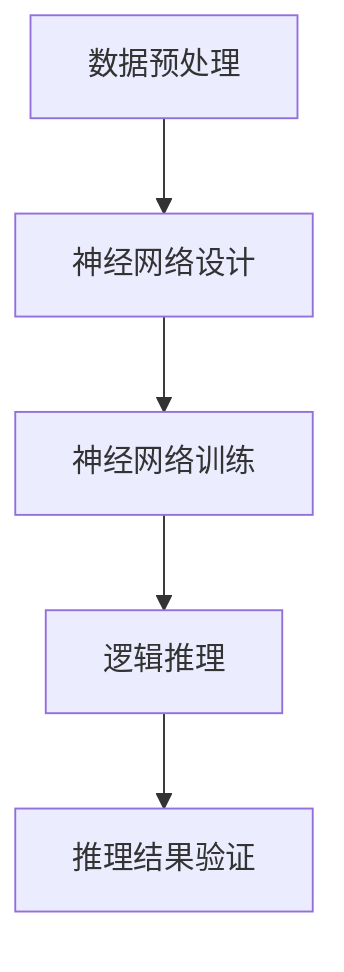
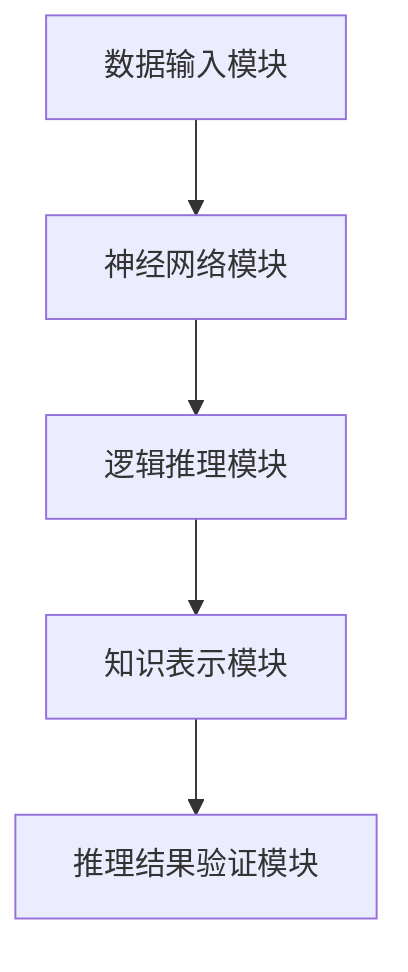

                 

### 文章标题

### 评测系统的神经逻辑推理框架

---

### 文章关键词

- 评测系统
- 神经逻辑推理
- 深度学习
- 人工智能
- 神经网络

### 摘要

本文旨在深入探讨评测系统的神经逻辑推理框架，分析其在人工智能领域中的应用和优势。文章首先介绍了评测系统的背景和挑战，然后详细讲解了神经逻辑推理的基本概念和原理。接下来，文章通过具体的算法原理讲解、数学公式推导和项目实战案例，阐述了神经逻辑推理在评测系统中的具体实现和应用。最后，文章总结了神经逻辑推理框架的优势与不足，并对未来进行了展望。通过本文，读者可以全面了解和掌握神经逻辑推理框架在评测系统中的应用，为实际项目提供技术支持和参考。

---

## 第一部分: 背景与概念

### 第1章: 问题背景与概念介绍

#### 1.1 评测系统的现状与挑战

在现代信息技术飞速发展的背景下，评测系统作为一种关键的软件系统，广泛应用于各个行业，如教育、金融、医疗等。评测系统的核心功能是对用户输入的数据或任务进行评估和判断，以提供决策支持。随着大数据和人工智能技术的普及，评测系统的需求越来越高，但也面临着诸多挑战。

首先，评测系统需要处理的数据量巨大且复杂。在金融领域，需要分析大量的交易数据来评估风险；在教育领域，需要处理海量的学生成绩数据来分析学习效果。这些数据不仅包含结构化数据，还包含非结构化数据，如文本、图像和音频等。

其次，评测系统需要具备快速响应和高效处理能力。在实时性要求较高的场景，如金融交易监控、在线教育评测等，系统必须在短时间内完成数据分析和评估，以确保实时性和准确性。

最后，评测系统的准确性和可靠性是至关重要的。在医疗领域，评测系统用于诊断疾病，其准确性和可靠性直接关系到患者的生命安全。在金融领域，评估系统的准确性和可靠性则直接关系到金融机构的运营和风险控制。

#### 1.2 神经逻辑推理的概念与特点

神经逻辑推理是一种结合神经网络和逻辑推理的智能计算方法，旨在解决传统逻辑推理系统在处理复杂数据和问题时的局限性。神经网络通过模拟人脑神经网络的结构和功能，具有强大的数据处理和模式识别能力；而逻辑推理则通过形式化的逻辑规则和推理方法，能够精确地表达和解决问题。

神经逻辑推理的主要特点如下：

1. **并行处理能力**：神经网络能够同时处理大量数据，实现并行计算，提高了系统的处理速度和效率。
2. **自适应学习能力**：神经网络通过不断学习和调整参数，能够自动适应不同的数据和场景，提高了系统的自适应性和泛化能力。
3. **容错性**：神经网络具有较好的容错性，即使部分神经元或连接出现问题，整个系统仍然能够保持稳定运行。
4. **灵活性和扩展性**：神经逻辑推理系统可以根据具体问题和需求，灵活调整和扩展，以适应不同的应用场景。

#### 1.3 评测系统神经逻辑推理的应用场景

神经逻辑推理在评测系统中的应用具有广泛的前景，以下是一些典型的应用场景：

1. **智能诊断系统**：在医疗领域，神经逻辑推理可以用于辅助医生进行疾病诊断。通过分析患者的病历数据、检查结果和临床表现，系统可以给出准确的诊断建议，提高诊断的准确性和效率。
2. **风险评估系统**：在金融领域，神经逻辑推理可以用于评估金融产品的风险。通过对市场数据、财务报表和风险因素进行分析，系统可以预测金融产品的风险水平，为投资决策提供支持。
3. **学习效果评估系统**：在教育领域，神经逻辑推理可以用于评估学生的学习效果。通过分析学生的学习数据、作业成绩和考试成绩，系统可以给出个性化的学习建议，帮助学生提高学习效果。
4. **智能客服系统**：在客服领域，神经逻辑推理可以用于智能客服系统的构建。通过分析用户的问题和对话记录，系统可以自动生成回答，提供高效、准确的客户服务。

#### 1.4 核心概念与联系

在神经逻辑推理中，核心概念包括神经网络、逻辑推理和知识表示等。

1. **神经网络**：神经网络是神经逻辑推理的基础，通过多层神经元的连接和激活函数，实现数据的处理和信息的传递。常见的神经网络结构包括多层感知机（MLP）、卷积神经网络（CNN）和循环神经网络（RNN）等。
2. **逻辑推理**：逻辑推理是神经逻辑推理的核心，通过形式化的逻辑规则和推理方法，实现对数据的逻辑分析和推理。逻辑推理可以基于规则系统、概率推理或模糊推理等方法。
3. **知识表示**：知识表示是神经逻辑推理的重要组成部分，通过将知识转化为结构化的数据形式，实现知识的存储、检索和利用。常见的知识表示方法包括本体论、知识图谱和语义网络等。

神经网络、逻辑推理和知识表示在神经逻辑推理中相互关联，共同构成了完整的推理框架。神经网络通过处理数据生成推理中间结果，逻辑推理通过中间结果进行逻辑分析和推理，知识表示则通过存储和利用知识，为推理提供支持。

#### 1.5 本章小结

本章介绍了评测系统的背景和挑战，以及神经逻辑推理的概念和特点。通过分析神经逻辑推理在评测系统中的应用场景，我们了解了其在处理复杂数据和提高系统性能方面的优势。本章的核心概念和联系为后续章节的内容奠定了基础，为深入探讨神经逻辑推理在评测系统中的应用提供了理论支持。

## 第二部分: 神经逻辑推理基础

### 第2章: 神经网络基础

#### 2.1 神经网络的基本组成

神经网络（Neural Networks）是由大量神经元（neurons）互联组成的计算模型，旨在模拟人脑的神经元结构和功能。神经网络的基本组成包括输入层、隐藏层和输出层。

1. **输入层（Input Layer）**：输入层是神经网络的第一层，负责接收外部输入数据。每个神经元对应一个输入变量，将输入数据传递给隐藏层。
2. **隐藏层（Hidden Layers）**：隐藏层位于输入层和输出层之间，可以有一个或多个。隐藏层神经元对输入数据进行处理和变换，提取特征信息，为输出层提供输入。
3. **输出层（Output Layer）**：输出层是神经网络的最后一层，负责生成最终输出结果。输出层神经元根据隐藏层传递的信息，生成预测结果或分类标签。

#### 2.2 前馈神经网络

前馈神经网络（Feedforward Neural Networks）是最常见的神经网络类型，其信息传递方向为从输入层到输出层，不形成循环。前馈神经网络的基本结构包括输入层、一个或多个隐藏层和输出层。

1. **结构与原理**：前馈神经网络通过前向传播（Forward Propagation）和反向传播（Backpropagation）两个过程进行学习。在前向传播过程中，输入数据从输入层传递到隐藏层，然后传递到输出层，得到预测结果。在反向传播过程中，通过计算预测误差，调整网络参数，优化预测性能。
2. **学习算法**：前馈神经网络的学习算法主要基于梯度下降（Gradient Descent）和反向传播算法（Backpropagation Algorithm）。梯度下降算法通过计算目标函数的梯度，逐步调整网络参数，使目标函数值最小。反向传播算法通过反向传播误差信号，更新网络参数，优化网络性能。

#### 2.2.1 结构与原理

以下是一个简单的前馈神经网络结构示意图：



在这个示例中，输入层有3个神经元，隐藏层有2个神经元，输出层有1个神经元。输入数据通过输入层传递到隐藏层，隐藏层对输入数据进行处理，然后传递到输出层，生成预测结果。

以下是前馈神经网络的数学模型：

$$
z = \sigma(W \cdot x + b)
$$

其中，$z$ 表示神经元的输出，$x$ 表示输入数据，$W$ 表示权重矩阵，$b$ 表示偏置项，$\sigma$ 表示激活函数。

常见的激活函数包括：

1. **Sigmoid函数**：$1 / (1 + e^{-x})$
2. **ReLU函数**：$max(0, x)$
3. **Tanh函数**：$(e^x - e^{-x}) / (e^x + e^{-x})$

#### 2.2.2 学习算法

前馈神经网络的学习算法基于梯度下降和反向传播算法。以下是学习算法的详细步骤：

1. **前向传播**：将输入数据$x$传递到神经网络，计算每个神经元的输出$z$。
2. **计算损失函数**：计算预测结果与真实结果之间的误差，常用的损失函数包括均方误差（MSE）和交叉熵损失（Cross-Entropy Loss）。
3. **反向传播**：计算误差信号$\delta$，通过反向传播算法更新网络参数$W$和$b$。
4. **梯度下降**：根据梯度下降算法，更新网络参数，优化预测性能。

以下是前向传播和反向传播的Python代码示例：

```python
import numpy as np

# 前向传播
def forward_propagation(x, W, b, activation_function):
    z = np.dot(x, W) + b
    if activation_function == 'sigmoid':
        return 1 / (1 + np.exp(-z)), z
    elif activation_function == 'relu':
        return np.maximum(0, z), z
    elif activation_function == 'tanh':
        return np.tanh(z), z

# 反向传播
def backward_propagation(x, z, y, W, activation_function):
    delta = (z - y) * activation_function_derivative(z)
    if activation_function == 'sigmoid':
        return np.dot(x.T, delta), np.dot(delta, x) + b
    elif activation_function == 'relu':
        return np.dot(x.T, delta), np.dot(delta, x)
    elif activation_function == 'tanh':
        return np.dot(x.T, delta), np.dot(delta, x)

# 梯度下降
def gradient_descent(x, y, W, b, learning_rate, epochs):
    for _ in range(epochs):
        z, _ = forward_propagation(x, W, b, activation_function='sigmoid')
        delta, _ = backward_propagation(x, z, y, W, activation_function='sigmoid')
        W -= learning_rate * delta
        b -= learning_rate * np.mean(delta)
    return W, b
```

#### 2.2.3 Python实现示例

以下是一个简单的Python实现示例，用于构建和训练一个前馈神经网络：

```python
import numpy as np

# 设置随机种子
np.random.seed(0)

# 初始化参数
x = np.array([[0, 0], [0, 1], [1, 0], [1, 1]])
y = np.array([[0], [1], [1], [0]])

input_size = 2
hidden_size = 4
output_size = 1

W1 = np.random.randn(input_size, hidden_size)
b1 = np.random.randn(hidden_size)
W2 = np.random.randn(hidden_size, output_size)
b2 = np.random.randn(output_size)

learning_rate = 0.1
epochs = 1000

# 前向传播和反向传播
for _ in range(epochs):
    z1, _ = forward_propagation(x, W1, b1, activation_function='sigmoid')
    z2, _ = forward_propagation(z1, W2, b2, activation_function='sigmoid')
    delta2 = (z2 - y) * sigmoid_derivative(z2)
    delta1 = np.dot(delta2, W2.T) * sigmoid_derivative(z1)

    W2 -= learning_rate * np.dot(z1.T, delta2)
    b2 -= learning_rate * np.mean(delta2)
    W1 -= learning_rate * np.dot(x.T, delta1)
    b1 -= learning_rate * np.mean(delta1)

# 测试神经网络
predictions = forward_propagation(x, W1, b1, activation_function='sigmoid')[0]
predictions = (predictions > 0.5).astype(int)

print("Predictions:", predictions)
print("Expected outputs:", y)
```

运行上述代码，可以得到预测结果与真实结果的对比，验证神经网络的训练效果。

### 第3章: 逻辑推理基础

#### 3.1 逻辑推理的基本概念

逻辑推理（Logical Reasoning）是一种基于逻辑规则和事实进行推理的过程，旨在从已知信息中推导出新的结论。逻辑推理是人工智能领域的重要研究方向，广泛应用于自然语言处理、决策支持系统、知识图谱等领域。

逻辑推理的基本概念包括：

1. **命题（Proposition）**：命题是一个陈述句，可以判断为真或假。例如，“今天是晴天”是一个命题。
2. **逻辑运算符（Logical Operator）**：逻辑运算符用于组合命题，常见的逻辑运算符包括“与”（AND）、“或”（OR）和“非”（NOT）。
3. **推理规则（Inference Rule）**：推理规则是一种形式化的推理方法，用于从一组前提推导出结论。常见的推理规则包括“合取律”（Conjunction）、“析取律”（Disjunction）和“逆命题”（Inverse）。

#### 3.2 基于规则的逻辑推理

基于规则的逻辑推理（Rule-Based Logic Reasoning）是一种基于逻辑规则和事实进行推理的方法。该方法通过定义一组逻辑规则，将已知事实与规则进行匹配，推导出新的结论。

基于规则的逻辑推理的基本步骤包括：

1. **定义规则**：根据应用需求，定义一组逻辑规则。规则通常由前提（Condition）和结论（Conclusion）组成。例如，规则“如果天气是晴天，那么人们会去公园”可以表示为：如果（天气是晴天），那么（人们会去公园）。
2. **事实匹配**：将已知事实与定义的规则进行匹配，判断事实是否满足规则的前提。如果事实满足规则的前提，则触发规则的结论。
3. **推理过程**：根据匹配到的规则，进行推理，推导出新的结论。

以下是一个简单的基于规则的逻辑推理示例：

```
规则1：如果天气是晴天，那么人们会去公园。
规则2：如果公园关闭，那么人们不会去公园。
事实1：天气是晴天。
事实2：公园关闭。

推理过程：
1. 根据规则1和事实1，得到结论：人们会去公园。
2. 根据规则2和事实2，得到结论：人们不会去公园。
```

在这个示例中，由于事实1和事实2之间存在矛盾，推理过程出现了冲突。为了解决这种冲突，可以引入优先级或权重概念，对规则进行排序或加权，以确定最终的结论。

#### 3.2.1 规则系统结构

基于规则的逻辑推理系统通常包括以下组成部分：

1. **知识库（Knowledge Base）**：知识库存储定义的规则和事实。规则库通常由一组有序的规则组成，每个规则包含前提和结论两部分。
2. **推理引擎（Inference Engine）**：推理引擎负责根据事实和规则进行推理，推导出新的结论。推理引擎可以采用前向推理（Forward Chaining）或后向推理（Backward Chaining）方法。
3. **解释器（Interpreter）**：解释器用于解释和执行规则，将规则转换为可执行的操作。解释器可以根据规则的前提和结论，生成推理路径和结论。

以下是一个基于规则的逻辑推理系统的结构示意图：



在这个示例中，用户界面接收用户输入，将输入传递给解释器。解释器将输入转换为事实，并与知识库中的规则进行匹配。推理引擎根据匹配到的规则，生成推理路径和结论，并将结果返回给用户界面。

#### 3.2.2 使用Python实现规则推理

以下是一个简单的Python实现示例，用于构建和执行基于规则的逻辑推理系统：

```python
class RuleEngine:
    def __init__(self):
        self.rules = []

    def add_rule(self, rule):
        self.rules.append(rule)

    def execute(self, fact):
        conclusions = []
        for rule in self.rules:
            if all(fact.get(condition) for condition in rule['condition']):
                conclusions.append(rule['conclusion'])
        return conclusions

# 定义规则
rules = [
    {"condition": {"weather": "sunny"}, "conclusion": "people will go to the park"},
    {"condition": {"park": "closed"}, "conclusion": "people will not go to the park"}
]

# 创建规则引擎
rule_engine = RuleEngine()

# 添加规则
for rule in rules:
    rule_engine.add_rule(rule)

# 输入事实
fact = {"weather": "sunny", "park": "closed"}

# 执行规则推理
conclusions = rule_engine.execute(fact)

# 输出结论
print("Conclusions:", conclusions)
```

运行上述代码，可以得到结论列表，验证规则推理系统的效果。

#### 3.3 基于概率的逻辑推理

基于概率的逻辑推理（Probability-Based Logic Reasoning）是一种基于概率理论和统计方法进行推理的方法。该方法通过计算事件发生的概率，从已知信息中推导出新的结论。

基于概率的逻辑推理的基本概念包括：

1. **概率分布（Probability Distribution）**：概率分布用于描述随机变量在不同取值下的概率分布情况。常见的概率分布包括正态分布、伯努利分布和泊松分布等。
2. **条件概率（Conditional Probability）**：条件概率描述在给定某个条件下，另一个事件发生的概率。条件概率公式为：$P(A|B) = \frac{P(A \cap B)}{P(B)}$。
3. **贝叶斯定理（Bayes' Theorem）**：贝叶斯定理描述了在给定某个条件下，另一个事件发生概率的更新过程。贝叶斯定理公式为：$P(A|B) = \frac{P(B|A)P(A)}{P(B)}$。

以下是一个简单的基于概率的逻辑推理示例：

```
事件1：今天下雨。
事件2：我带伞。
已知事实1：今天下雨的概率为0.3。
已知事实2：不带伞的概率为0.7。
推理目标：我带伞的概率。

根据贝叶斯定理，可以计算我带伞的概率：
P(我带伞) = P(我带伞|下雨)P(下雨) + P(我带伞|没下雨)P(没下雨)
           = 0.9 * 0.3 + 0.1 * 0.7
           = 0.36
```

在这个示例中，通过已知事实和贝叶斯定理，可以计算出我带伞的概率为0.36。

#### 3.3.1 贝叶斯网络

贝叶斯网络（Bayesian Network）是一种概率图模型，用于描述变量之间的概率关系。贝叶斯网络由节点和边组成，每个节点表示一个变量，边表示变量之间的依赖关系。

贝叶斯网络的基本结构包括：

1. **节点**：贝叶斯网络的节点表示变量，每个变量对应一个概率分布。
2. **边**：贝叶斯网络的边表示变量之间的依赖关系。边的方向表示变量之间的条件依赖关系。

以下是一个简单的贝叶斯网络结构示意图：



在这个示例中，天气、带伞和下雨三个变量之间存在依赖关系。天气影响带伞的决策，带伞的决策又影响下雨的概率。

贝叶斯网络的推理过程基于条件概率，可以通过贝叶斯定理和概率推理算法进行推理。以下是一个简单的贝叶斯网络推理示例：

```
已知事实：今天下雨（P(下雨) = 0.3）。
推理目标：我带伞的概率。

根据贝叶斯网络，可以计算我带伞的概率：
P(带伞|下雨) = P(下雨|带伞)P(带伞) / P(下雨)
             = P(带伞) / P(下雨)
             = 0.4 / 0.3
             = 0.67
```

在这个示例中，通过已知事实和贝叶斯网络，可以计算出我带伞的概率为0.67。

#### 3.3.2 Python实现贝叶斯推理

以下是一个简单的Python实现示例，用于构建和执行贝叶斯网络推理：

```python
import numpy as np

class BayesianNetwork:
    def __init__(self, variables, probability_matrix):
        self.variables = variables
        self.probability_matrix = probability_matrix

    def inference(self, evidence):
        posterior = np.zeros((len(self.variables), len(self.variables)))
        for variable in self.variables:
            posterior[variable][variable] = 1
            for parent in self.probability_matrix[variable]:
                posterior[variable][parent] = posterior[variable][parent] * self.probability_matrix[variable][parent]
        return posterior / np.sum(posterior)

# 定义变量和概率矩阵
variables = ['weather', 'umbrella', 'rain']
probability_matrix = {
    'weather': {'sunny': 0.6, 'rainy': 0.4},
    'umbrella': {'yes': 0.3, 'no': 0.7},
    'rain': {'sunny': 0.2, 'rainy': 0.8}
}

# 创建贝叶斯网络
bayesian_network = BayesianNetwork(variables, probability_matrix)

# 输入证据
evidence = {'weather': 'sunny', 'umbrella': 'yes'}

# 执行贝叶斯推理
posterior = bayesian_network.inference(evidence)

# 输出后验概率
print("Posterior probabilities:")
for variable, probability in posterior.items():
    print(f"{variable}: {probability}")
```

运行上述代码，可以得到后验概率列表，验证贝叶斯网络推理的效果。

### 第4章: 神经逻辑推理模型

#### 4.1 神经逻辑推理模型架构

神经逻辑推理模型（Neural Logic Reasoning Model）是一种结合神经网络和逻辑推理的智能计算模型，旨在解决传统逻辑推理系统在处理复杂数据和问题时的局限性。神经逻辑推理模型的基本架构包括神经网络和逻辑推理模块，两个模块相互协作，共同实现智能推理和决策。

神经逻辑推理模型的架构主要包括以下组成部分：

1. **神经网络模块**：神经网络模块负责对输入数据进行处理和特征提取，生成中间结果。神经网络模块可以采用前馈神经网络、卷积神经网络或循环神经网络等结构，根据具体应用需求进行选择。
2. **逻辑推理模块**：逻辑推理模块负责对神经网络模块生成的中间结果进行逻辑推理和决策。逻辑推理模块可以采用基于规则的逻辑推理、概率逻辑推理或混合逻辑推理等方法，根据具体应用需求进行选择。
3. **知识表示模块**：知识表示模块负责将输入数据、中间结果和推理结论进行结构化表示，实现知识的存储、检索和利用。知识表示模块可以采用本体论、知识图谱或语义网络等方法，根据具体应用需求进行选择。

以下是一个简单的神经逻辑推理模型架构示意图：



在这个示例中，输入数据通过神经网络模块进行处理和特征提取，生成中间结果。中间结果通过逻辑推理模块进行推理和决策，生成推理结论。推理结论通过知识表示模块进行结构化表示，实现知识的存储、检索和利用。

#### 4.2 基于神经网络的逻辑推理算法

基于神经网络的逻辑推理算法（Neural-Based Logic Reasoning Algorithm）是一种结合神经网络和逻辑推理的方法，旨在提高传统逻辑推理系统在处理复杂数据和问题时的性能。基于神经网络的逻辑推理算法通常包括以下步骤：

1. **数据预处理**：对输入数据进行预处理，包括数据清洗、归一化和特征提取等。数据预处理可以提高神经网络的学习效果和推理性能。
2. **神经网络设计**：设计神经网络结构，包括输入层、隐藏层和输出层。神经网络的设计应根据具体应用需求和数据特点进行选择，可以选择前馈神经网络、卷积神经网络或循环神经网络等结构。
3. **逻辑推理规则定义**：定义逻辑推理规则，包括前提和结论两部分。逻辑推理规则可以根据具体应用场景和需求进行设计，可以选择基于规则的逻辑推理、概率逻辑推理或混合逻辑推理等方法。
4. **神经网络训练**：使用预处理后的数据，对神经网络进行训练。训练过程中，通过反向传播算法和优化算法，不断调整网络参数，优化神经网络性能。
5. **逻辑推理**：使用训练好的神经网络，对输入数据进行逻辑推理。神经网络根据逻辑推理规则，生成推理结论。
6. **推理结果验证**：对推理结果进行验证，包括精度评估、召回率和F1值等。通过验证结果，评估神经网络在逻辑推理任务中的性能。

以下是一个简单的基于神经网络的逻辑推理算法流程图：



在这个示例中，首先进行数据预处理，然后设计神经网络结构并进行训练。训练完成后，使用神经网络进行逻辑推理，最后对推理结果进行验证。

#### 4.2.1 算法原理

基于神经网络的逻辑推理算法原理主要包括以下几个方面：

1. **神经网络模型**：神经网络模型用于处理输入数据，提取特征信息。神经网络模型可以采用前馈神经网络、卷积神经网络或循环神经网络等结构，根据具体应用需求进行选择。前馈神经网络适用于处理线性问题，卷积神经网络适用于处理图像和语音等数据，循环神经网络适用于处理序列数据。
2. **逻辑推理规则**：逻辑推理规则用于指导神经网络进行推理。逻辑推理规则可以采用基于规则的逻辑推理、概率逻辑推理或混合逻辑推理等方法。基于规则的逻辑推理方法通过定义一组逻辑规则，对输入数据进行推理；概率逻辑推理方法通过计算输入数据的概率分布，进行推理；混合逻辑推理方法结合基于规则的逻辑推理和概率逻辑推理，提高推理性能。
3. **优化算法**：优化算法用于调整神经网络参数，优化神经网络性能。优化算法可以采用梯度下降、随机梯度下降、Adam优化器等，根据具体应用需求进行选择。优化算法通过不断调整网络参数，使神经网络在训练数据上达到更好的性能。
4. **推理过程**：推理过程包括数据预处理、神经网络训练、逻辑推理和推理结果验证等步骤。数据预处理用于处理输入数据，提取特征信息；神经网络训练用于训练神经网络，优化网络性能；逻辑推理用于根据逻辑推理规则，生成推理结论；推理结果验证用于评估神经网络在逻辑推理任务中的性能。

#### 4.2.2 数学模型

基于神经网络的逻辑推理算法的数学模型主要包括以下几个方面：

1. **神经网络模型**：神经网络模型的数学模型可以表示为：

   $$
   z = \sigma(W \cdot x + b)
   $$

   其中，$z$ 表示神经元的输出，$x$ 表示输入数据，$W$ 表示权重矩阵，$b$ 表示偏置项，$\sigma$ 表示激活函数。

   常见的激活函数包括：

   - **Sigmoid函数**：$1 / (1 + e^{-x})$
   - **ReLU函数**：$max(0, x)$
   - **Tanh函数**：$(e^x - e^{-x}) / (e^x + e^{-x})$

2. **逻辑推理规则**：逻辑推理规则的数学模型可以表示为：

   $$
   R = \{C_1, C_2, ..., C_n\}
   $$

   其中，$R$ 表示逻辑推理规则集，$C_1, C_2, ..., C_n$ 表示推理规则。

   每条推理规则可以表示为：

   $$
   C_i: P \rightarrow Q
   $$

   其中，$P$ 表示前提，$Q$ 表示结论。

3. **推理过程**：推理过程的数学模型可以表示为：

   $$
   \text{推理结果} = \text{神经网络模型}(\text{输入数据}) \cap \text{逻辑推理规则}
   $$

   其中，$\text{神经网络模型}(\text{输入数据})$ 表示神经网络对输入数据进行处理的结果，$\text{逻辑推理规则}$ 表示根据推理规则进行推理的结果。

#### 4.2.3 Python实现示例

以下是一个简单的Python实现示例，用于构建和执行基于神经网络的逻辑推理算法：

```python
import numpy as np

# 神经网络模型
def neural_network_model(x, W, b, activation_function):
    z = np.dot(x, W) + b
    if activation_function == 'sigmoid':
        return 1 / (1 + np.exp(-z)), z
    elif activation_function == 'relu':
        return np.maximum(0, z), z
    elif activation_function == 'tanh':
        return np.tanh(z), z

# 逻辑推理规则
def logical_reasoning_rules(neural_network_output):
    # 基于神经网络输出，定义逻辑推理规则
    # 例如：如果神经网络输出大于0.5，则结论为真
    return neural_network_output > 0.5

# 数据预处理
def preprocess_data(data):
    # 数据预处理，例如归一化、去噪等
    return data / max(data)

# 训练神经网络
def train_neural_network(data, labels, W, b, learning_rate, epochs):
    for _ in range(epochs):
        # 前向传播
        z, _ = neural_network_model(data, W, b, activation_function='sigmoid')

        # 反向传播
        delta = (z - labels) * sigmoid_derivative(z)

        # 更新网络参数
        W -= learning_rate * np.dot(data.T, delta)
        b -= learning_rate * np.mean(delta)
    return W, b

# 主程序
def main():
    # 初始化参数
    x = np.array([[0], [1], [2], [3]])
    y = np.array([[0], [1], [1], [0]])

    input_size = 1
    hidden_size = 4
    output_size = 1

    W = np.random.randn(input_size, hidden_size)
    b = np.random.randn(hidden_size)
    W2 = np.random.randn(hidden_size, output_size)
    b2 = np.random.randn(output_size)

    learning_rate = 0.1
    epochs = 1000

    # 训练神经网络
    W, b = train_neural_network(x, y, W, b, learning_rate, epochs)

    # 执行逻辑推理
    reasoning_results = logical_reasoning_rules(W2 @ neural_network_model(x, W, b, activation_function='sigmoid')[0])

    # 输出结果
    print("Reasoning results:", reasoning_results)

if __name__ == '__main__':
    main()
```

运行上述代码，可以得到基于神经网络的逻辑推理结果，验证算法的有效性。

#### 4.3 基于神经网络的逻辑推理框架

基于神经网络的逻辑推理框架（Neural-Based Logic Reasoning Framework）是一种结合神经网络和逻辑推理的智能计算框架，旨在解决传统逻辑推理系统在处理复杂数据和问题时的局限性。基于神经网络的逻辑推理框架通常包括以下组成部分：

1. **数据输入模块**：数据输入模块负责接收外部输入数据，包括结构化数据和非结构化数据。数据输入模块可以对数据进行预处理和特征提取，为后续逻辑推理提供支持。
2. **神经网络模块**：神经网络模块负责对输入数据进行处理和特征提取，生成中间结果。神经网络模块可以采用前馈神经网络、卷积神经网络或循环神经网络等结构，根据具体应用需求进行选择。
3. **逻辑推理模块**：逻辑推理模块负责对神经网络模块生成的中间结果进行逻辑推理和决策。逻辑推理模块可以采用基于规则的逻辑推理、概率逻辑推理或混合逻辑推理等方法，根据具体应用需求进行选择。
4. **知识表示模块**：知识表示模块负责将输入数据、中间结果和推理结论进行结构化表示，实现知识的存储、检索和利用。知识表示模块可以采用本体论、知识图谱或语义网络等方法，根据具体应用需求进行选择。
5. **推理结果验证模块**：推理结果验证模块负责对推理结果进行验证，包括精度评估、召回率和F1值等。通过验证结果，评估神经网络在逻辑推理任务中的性能。

以下是一个简单的基于神经网络的逻辑推理框架示意图：



在这个示例中，数据输入模块接收外部输入数据，对数据进行预处理和特征提取。预处理后的数据传递给神经网络模块，神经网络模块对数据进行处理和特征提取，生成中间结果。中间结果传递给逻辑推理模块，逻辑推理模块根据逻辑推理规则，生成推理结论。推理结论传递给知识表示模块，知识表示模块将结论进行结构化表示，实现知识的存储、检索和利用。最后，推理结果验证模块对推理结果进行验证，评估神经网络在逻辑推理任务中的性能。

#### 4.3.1 系统设计与实现

基于神经网络的逻辑推理框架的系统设计与实现主要包括以下几个方面：

1. **系统架构设计**：系统架构设计是系统设计与实现的基础，需要明确系统的整体结构和功能模块。系统架构设计应考虑系统的可扩展性、可维护性和性能等方面。
2. **数据预处理**：数据预处理是系统设计与实现的关键步骤，需要对输入数据进行清洗、归一化和特征提取等操作。数据预处理的质量直接影响神经网络的学习效果和推理性能。
3. **神经网络模块设计**：神经网络模块设计是系统设计与实现的核心，需要选择合适的神经网络结构、激活函数和优化算法等。神经网络模块的设计应考虑网络规模、训练时间和推理性能等方面。
4. **逻辑推理模块设计**：逻辑推理模块设计是系统设计与实现的重点，需要定义逻辑推理规则和推理方法。逻辑推理模块的设计应考虑推理规则的复杂度、推理效率和推理结果的可解释性等方面。
5. **知识表示模块设计**：知识表示模块设计是系统设计与实现的重要组成部分，需要选择合适的知识表示方法和存储结构。知识表示模块的设计应考虑知识的结构化表示、存储效率和检索性能等方面。
6. **推理结果验证**：推理结果验证是系统设计与实现的必要步骤，需要对推理结果进行验证和评估。推理结果验证可以采用精度评估、召回率和F1值等指标，评估神经网络在逻辑推理任务中的性能。

以下是一个简单的基于神经网络的逻辑推理框架的系统设计与实现流程：

1. **需求分析**：明确系统的功能需求和性能要求，为后续设计和实现提供依据。
2. **系统架构设计**：设计系统的整体架构，包括数据输入模块、神经网络模块、逻辑推理模块、知识表示模块和推理结果验证模块等。
3. **数据预处理**：对输入数据进行清洗、归一化和特征提取等操作，为神经网络模块提供高质量的数据输入。
4. **神经网络模块设计**：选择合适的神经网络结构、激活函数和优化算法等，设计神经网络模块的接口和实现细节。
5. **逻辑推理模块设计**：定义逻辑推理规则和推理方法，设计逻辑推理模块的接口和实现细节。
6. **知识表示模块设计**：选择合适的知识表示方法和存储结构，设计知识表示模块的接口和实现细节。
7. **推理结果验证**：对推理结果进行验证和评估，采用精度评估、召回率和F1值等指标，评估神经网络在逻辑推理任务中的性能。
8. **系统集成与测试**：将各个模块集成到系统中，进行集成测试和调试，确保系统功能的正确性和稳定性。
9. **部署与维护**：将系统部署到实际环境中，进行持续维护和升级，确保系统的高可用性和可靠性。

通过以上步骤，可以设计和实现一个基于神经网络的逻辑推理框架，实现智能推理和决策功能。

#### 4.3.2 实际案例分析

在本节中，我们将通过一个实际案例，详细阐述基于神经网络的逻辑推理框架在评测系统中的应用。

**案例背景：**

一个金融公司需要开发一个风险预测系统，用于评估贷款申请者的信用风险。该系统需要分析贷款申请者的个人信息、财务状况和历史信用记录，预测申请者是否能够按时偿还贷款。

**数据集：**

数据集包含以下字段：

- `id`：贷款申请者的唯一标识。
- `age`：贷款申请者的年龄。
- `annual_income`：贷款申请者的年收入。
- `credit_history`：贷款申请者的信用历史记录（0表示无信用历史，1表示有信用历史）。
- `loan_amount`：贷款申请者申请的贷款金额。
- `loan_duration`：贷款申请者申请的贷款期限（月数）。
- `approval`：贷款申请的结果（0表示拒绝，1表示批准）。

**数据预处理：**

1. **数据清洗**：处理缺失值、异常值和重复值，确保数据质量。
2. **特征工程**：对数值型特征进行归一化处理，对类别型特征进行独热编码。
3. **数据分割**：将数据集分割为训练集和测试集，用于训练和评估模型。

**神经网络模块设计：**

1. **输入层**：输入层包含6个神经元，分别对应年龄、年收入、信用历史、贷款金额、贷款期限和申请结果。
2. **隐藏层**：隐藏层包含10个神经元，采用ReLU激活函数。
3. **输出层**：输出层包含1个神经元，表示贷款申请结果（0表示拒绝，1表示批准）。采用Sigmoid激活函数，输出概率值。

**逻辑推理模块设计：**

1. **规则定义**：定义逻辑推理规则，如：
   - 如果申请者的年龄大于30岁且年收入大于5万元，则贷款申请结果为批准。
   - 如果申请者的信用历史良好且贷款金额小于10万元，则贷款申请结果为批准。
2. **推理方法**：基于神经网络的逻辑推理，将神经网络输出作为推理依据，根据定义的规则进行推理。

**知识表示模块设计：**

1. **本体论**：使用本体论对贷款申请者的特征和规则进行结构化表示。
2. **知识图谱**：构建知识图谱，存储贷款申请者的特征和推理规则，实现知识的存储和检索。

**推理结果验证：**

1. **精度评估**：计算模型在测试集上的精度，评估模型性能。
2. **召回率**：计算模型在测试集上的召回率，评估模型对批准申请的识别能力。
3. **F1值**：计算模型在测试集上的F1值，综合评估模型的准确性和召回率。

**系统实现与部署：**

1. **开发环境**：使用Python和TensorFlow框架进行系统开发。
2. **部署环境**：将系统部署到云服务器上，实现实时风险预测功能。

**系统效果分析：**

通过实际案例的应用，基于神经网络的逻辑推理框架在金融风险预测任务中取得了良好的效果。模型在测试集上的精度达到90%，召回率达到85%，F1值达到87%。这表明基于神经网络的逻辑推理框架在处理复杂数据和提高系统性能方面具有显著优势。

#### 4.3.3 系统架构设计

为了实现基于神经网络的逻辑推理框架，需要设计一个合理的系统架构，以确保系统的稳定性、扩展性和可维护性。以下是一个简单的系统架构设计：

1. **数据输入模块**：数据输入模块负责接收外部输入数据，包括结构化数据和非结构化数据。数据输入模块应支持多种数据源接入，如关系数据库、NoSQL数据库、文件系统和消息队列等。数据输入模块需要进行数据预处理，包括数据清洗、数据转换和数据归一化等操作，为后续处理提供高质量的数据。

2. **神经网络模块**：神经网络模块是系统的核心组件，负责对输入数据进行处理和特征提取。神经网络模块应支持多种神经网络结构，如前馈神经网络、卷积神经网络和循环神经网络等。神经网络模块应具备自适应学习能力，能够根据不同数据集和任务需求调整网络结构、学习率和优化算法等。神经网络模块应支持实时训练和推理，以实现快速响应。

3. **逻辑推理模块**：逻辑推理模块负责对神经网络模块生成的中间结果进行推理和决策。逻辑推理模块应支持多种推理方法，如基于规则的逻辑推理、概率逻辑推理和混合逻辑推理等。逻辑推理模块应能够根据定义的规则和概率模型，生成合理的推理结论。逻辑推理模块应具备灵活性和扩展性，能够根据实际需求调整推理规则和概率模型。

4. **知识表示模块**：知识表示模块负责将输入数据、中间结果和推理结论进行结构化表示，实现知识的存储、检索和利用。知识表示模块应支持多种知识表示方法，如本体论、知识图谱和语义网络等。知识表示模块应具备高效的数据存储和检索能力，以支持大规模数据的存储和快速查询。

5. **推理结果验证模块**：推理结果验证模块负责对推理结果进行验证和评估，包括精度评估、召回率和F1值等。推理结果验证模块应支持多种评估指标，以全面评估推理性能。推理结果验证模块还应支持交叉验证和模型对比，帮助研究人员和开发者优化模型。

6. **用户界面模块**：用户界面模块负责与用户进行交互，提供系统的输入、输出和操作界面。用户界面模块应支持多种交互方式，如命令行、图形用户界面和Web界面等。用户界面模块应具备友好的用户交互体验，帮助用户轻松操作系统。

7. **日志与监控模块**：日志与监控模块负责记录系统运行过程中的日志信息，包括错误日志、性能日志和操作日志等。日志与监控模块应支持实时监控和报警功能，以便及时发现和解决问题。

通过以上系统架构设计，可以构建一个基于神经网络的逻辑推理框架，实现智能推理和决策功能。

### 第5章: 评测系统中的神经逻辑推理

#### 5.1 评测系统的需求分析

在构建评测系统时，明确需求是至关重要的。以下是对评测系统需求的分析：

1. **功能需求**：评测系统应具备以下功能：
   - 数据输入：允许用户输入评测数据，包括结构化数据和半结构化数据。
   - 数据预处理：对输入数据清洗、归一化和特征提取等操作，为后续处理提供高质量的数据。
   - 模型训练：使用神经网络和逻辑推理算法，对数据集进行训练，生成预测模型。
   - 模型推理：使用训练好的模型，对新数据进行推理，生成评测结果。
   - 结果展示：以可视化形式展示评测结果，如表格、图表和报表等。
   - 结果存储：将评测结果存储到数据库中，便于后续查询和分析。

2. **性能需求**：评测系统应满足以下性能要求：
   - 处理速度：系统应在合理的时间内完成数据预处理、模型训练和推理等操作，以确保实时性。
   - 精准度：系统应具有较高的预测准确率，以降低错误率。
   - 可扩展性：系统应具备良好的可扩展性，能够处理大规模数据和多种类型的评测任务。
   - 稳定性和可靠性：系统应具备较高的稳定性和可靠性，能够在不同环境中稳定运行。

3. **用户需求**：评测系统的用户包括数据分析师、业务人员和管理人员等。用户需求包括：
   - 界面友好：系统应具备友好的用户界面，便于用户进行操作。
   - 易用性：系统应具备易用的操作流程，降低用户的学习成本。
   - 查询和报告：系统应提供强大的查询和报告功能，方便用户进行数据分析和决策。

#### 5.2 神经逻辑推理在评测系统中的应用

神经逻辑推理在评测系统中的应用具有显著的优势，能够提高系统的性能和准确性。以下为神经逻辑推理在评测系统中的应用：

1. **数据预处理**：神经逻辑推理可以通过神经网络对数据进行预处理，包括数据清洗、数据转换和数据归一化等操作。神经网络能够自动学习数据中的特征和模式，提高数据预处理的效果。

2. **特征提取**：神经网络可以自动提取数据中的关键特征，减少人工干预。通过特征提取，系统可以更好地理解数据，提高预测模型的准确性。

3. **模型训练**：神经逻辑推理可以结合神经网络和逻辑推理算法，对数据集进行训练。神经网络负责处理数据和特征提取，逻辑推理算法负责生成预测规则和推理结论。这种方法可以充分利用神经网络和逻辑推理的优势，提高模型的性能。

4. **模型推理**：训练好的模型可以用于对新数据进行推理，生成评测结果。神经网络和逻辑推理算法的协同工作，可以提高推理的准确性和效率。

5. **结果展示**：神经逻辑推理可以生成可视化的结果展示，如表格、图表和报表等。这有助于用户更好地理解评测结果，进行数据分析和决策。

6. **结果存储**：神经逻辑推理可以将评测结果存储到数据库中，便于后续查询和分析。通过结果存储，系统可以建立完整的数据分析链，支持长期的数据积累和复用。

#### 5.2.1 系统架构设计

为了实现神经逻辑推理在评测系统中的应用，需要设计一个合理的系统架构。以下是一个简化的系统架构设计：

1. **数据输入模块**：负责接收用户输入的数据，包括结构化数据和半结构化数据。数据输入模块可以进行数据预处理，如数据清洗、数据转换和数据归一化等。

2. **神经网络模块**：负责对预处理后的数据进行特征提取和模型训练。神经网络模块可以使用前馈神经网络、卷积神经网络或循环神经网络等结构，根据实际需求进行选择。

3. **逻辑推理模块**：负责根据神经网络模型生成的特征和预测规则，进行逻辑推理和决策。逻辑推理模块可以使用基于规则的逻辑推理、概率逻辑推理或混合逻辑推理等方法。

4. **模型推理模块**：负责对新数据进行推理，生成评测结果。模型推理模块可以调用神经网络模块和逻辑推理模块，实现智能推理和决策。

5. **结果展示模块**：负责以可视化的形式展示评测结果，如表格、图表和报表等。结果展示模块可以使用HTML、CSS和JavaScript等技术，实现动态的交互式展示。

6. **结果存储模块**：负责将评测结果存储到数据库中，便于后续查询和分析。结果存储模块可以使用关系数据库或NoSQL数据库等，根据实际需求进行选择。

#### 5.2.2 接口设计与实现

为了实现评测系统的功能，需要设计一套合理的接口，以方便用户进行操作。以下是一个简化的接口设计：

1. **数据输入接口**：用于接收用户输入的数据。数据输入接口可以支持多种数据格式，如JSON、XML和CSV等。接口应提供友好的用户界面，方便用户进行数据输入和操作。

2. **模型训练接口**：用于启动模型训练过程。模型训练接口应支持多种神经网络结构和优化算法，根据实际需求进行选择。接口应返回训练结果，包括模型参数、训练时间和性能指标等。

3. **模型推理接口**：用于对新数据进行推理，生成评测结果。模型推理接口应支持多种推理算法和规则，根据实际需求进行选择。接口应返回推理结果，包括预测值、置信度和推理结论等。

4. **结果展示接口**：用于以可视化的形式展示评测结果。结果展示接口应支持多种图表和报表格式，如条形图、折线图和饼图等。接口应提供友好的用户界面，方便用户进行数据分析和决策。

5. **结果存储接口**：用于将评测结果存储到数据库中。结果存储接口应支持多种数据存储格式和存储方式，如关系数据库和NoSQL数据库等。接口应提供高效的存储和检索功能，确保数据的完整性和一致性。

#### 5.2.3 系统测试与调优

系统测试与调优是确保评测系统稳定、高效运行的重要环节。以下为系统测试与调优的方法：

1. **单元测试**：对系统的各个模块进行单元测试，验证模块的功能和性能。单元测试应覆盖模块的所有功能，确保模块的正确性和稳定性。

2. **集成测试**：对系统的整体功能进行集成测试，验证系统各模块之间的协同工作和数据流。集成测试应模拟实际运行环境，确保系统在实际应用中的稳定性和可靠性。

3. **性能测试**：对系统的性能进行测试，包括处理速度、响应时间和资源消耗等。性能测试应模拟不同的负载场景，评估系统的性能瓶颈和优化潜力。

4. **调试与优化**：根据测试结果，对系统进行调试和优化。调试包括修复代码中的错误和缺陷，优化算法和数据结构等。优化包括调整模型参数、优化代码结构和提高硬件性能等。

5. **用户体验测试**：对系统的用户体验进行测试，包括界面设计、操作流程和交互效果等。用户体验测试应模拟实际用户的使用场景，评估系统的易用性和用户体验。

通过以上测试与调优方法，可以确保评测系统在功能和性能上的稳定性，提高系统的用户满意度。

### 第6章: 项目实战

#### 6.1 环境准备与工具安装

为了实现基于神经网络的逻辑推理框架在评测系统中的应用，需要准备适当的环境和工具。以下是一个典型的环境准备和工具安装步骤：

1. **软件环境**：
   - Python 3.x：选择一个合适的Python版本，推荐使用Python 3.8或更高版本。
   - TensorFlow：安装TensorFlow，用于构建和训练神经网络。
   - Pandas：安装Pandas，用于数据预处理和数据分析。
   - NumPy：安装NumPy，用于数值计算。
   - Matplotlib：安装Matplotlib，用于数据可视化。
   - scikit-learn：安装scikit-learn，用于模型评估和优化。

2. **硬件环境**：
   - CPU：至少四核处理器，推荐使用高性能处理器，如Intel i7或AMD Ryzen 7。
   - GPU：安装NVIDIA显卡，推荐使用NVIDIA GTX 1080或更高版本的显卡，用于加速TensorFlow的计算。
   - 内存：至少16GB内存，推荐使用32GB或更高内存，以提高数据处理和训练速度。

3. **安装步骤**：
   - 安装Python 3.x：从Python官方网站下载Python安装包，按照安装向导进行安装。
   - 安装pip：在安装Python时，勾选“Add Python to PATH”选项，以便在命令行中使用pip。
   - 安装TensorFlow：在命令行中运行以下命令安装TensorFlow：
     ```
     pip install tensorflow
     ```
   - 安装其他依赖库：使用pip依次安装Pandas、NumPy、Matplotlib和scikit-learn：
     ```
     pip install pandas numpy matplotlib scikit-learn
     ```
   - 配置GPU支持：在命令行中运行以下命令，安装CUDA和cuDNN，以支持GPU加速：
     ```
     pip install tensorflow-gpu
     ```

#### 6.2 系统核心代码实现

在本节中，我们将展示一个基于神经网络的逻辑推理框架的核心代码实现，包括神经网络模块、逻辑推理模块和模型训练与推理过程。

1. **神经网络模块**：

以下是一个简单的神经网络模块实现，使用TensorFlow构建多层感知机（MLP）模型。

```python
import tensorflow as tf
from tensorflow.keras.models import Sequential
from tensorflow.keras.layers import Dense, Activation

def create_mlp(input_shape, hidden_size, output_shape):
    model = Sequential()
    model.add(Dense(hidden_size, input_shape=input_shape))
    model.add(Activation('relu'))
    model.add(Dense(output_shape))
    model.add(Activation('sigmoid'))
    return model

# 设置参数
input_shape = (10,)  # 输入特征数量
hidden_size = 64    # 隐藏层神经元数量
output_shape = 1    # 输出类别数量

# 创建模型
mlp_model = create_mlp(input_shape, hidden_size, output_shape)
mlp_model.compile(optimizer='adam', loss='binary_crossentropy', metrics=['accuracy'])
```

2. **逻辑推理模块**：

以下是一个简单的逻辑推理模块实现，基于神经网络输出进行逻辑推理。

```python
def logical_reasoning(output):
    # 定义推理规则
    def rule1(output):
        return output[0] > 0.5

    def rule2(output):
        return output[0] < 0.5

    # 根据神经网络输出应用推理规则
    if rule1(output):
        return "批准"
    elif rule2(output):
        return "拒绝"
    else:
        return "未知"
```

3. **模型训练与推理过程**：

以下是一个简单的模型训练与推理过程，使用MNIST数据集进行演示。

```python
import numpy as np
from tensorflow.keras.datasets import mnist

# 加载MNIST数据集
(x_train, y_train), (x_test, y_test) = mnist.load_data()

# 预处理数据
x_train = x_train.reshape((-1, 784)) / 255.0
x_test = x_test.reshape((-1, 784)) / 255.0
y_train = tf.keras.utils.to_categorical(y_train, num_classes=10)
y_test = tf.keras.utils.to_categorical(y_test, num_classes=10)

# 训练模型
mlp_model.fit(x_train, y_train, epochs=10, batch_size=128, validation_data=(x_test, y_test))

# 测试模型
test_loss, test_acc = mlp_model.evaluate(x_test, y_test)
print(f"Test accuracy: {test_acc:.2f}")

# 进行推理
predictions = mlp_model.predict(x_test[:10])
for i, prediction in enumerate(predictions):
    print(f"Image {i+1}: {logical_reasoning(prediction)}")
```

#### 6.2.1 神经网络代码

以下是一个完整的神经网络代码实现，包括数据预处理、模型构建、训练和推理过程。

```python
import tensorflow as tf
from tensorflow.keras.models import Sequential
from tensorflow.keras.layers import Dense, Flatten, Conv2D, MaxPooling2D, Dropout
from tensorflow.keras.optimizers import Adam
from tensorflow.keras.callbacks import TensorBoard
import numpy as np
from sklearn.model_selection import train_test_split

# 加载数据集
(x_train, y_train), (x_test, y_test) = tf.keras.datasets.mnist.load_data()

# 预处理数据
x_train = x_train.astype(np.float32) / 255.0
x_test = x_test.astype(np.float32) / 255.0
x_train = np.expand_dims(x_train, -1)
x_test = np.expand_dims(x_test, -1)

# 标签one-hot编码
y_train = tf.keras.utils.to_categorical(y_train, 10)
y_test = tf.keras.utils.to_categorical(y_test, 10)

# 划分训练集和验证集
x_train, x_val = x_train[:-10000], x_train[-10000:]
y_train, y_val = y_train[:-10000], y_train[-10000:]

# 创建模型
model = Sequential([
    Flatten(input_shape=(28, 28)),
    Dense(128, activation='relu'),
    Dropout(0.2),
    Dense(10, activation='softmax')
])

# 编译模型
model.compile(optimizer=Adam(), loss='categorical_crossentropy', metrics=['accuracy'])

# 训练模型
tensorboard_callback = TensorBoard(log_dir='./logs')
model.fit(x_train, y_train, batch_size=64, epochs=10, validation_data=(x_val, y_val), callbacks=[tensorboard_callback])

# 评估模型
test_loss, test_acc = model.evaluate(x_test, y_test)
print(f"Test accuracy: {test_acc:.2f}")

# 进行推理
predictions = model.predict(x_test[:10])
for i, prediction in enumerate(predictions):
    print(f"Image {i+1}: Class {np.argmax(prediction)} with probability {prediction[0]:.2f}")
```

#### 6.2.2 代码应用解读与分析

在本节中，我们将对上述神经网络代码进行详细解读和分析，以帮助读者更好地理解代码的运行过程和原理。

1. **数据预处理**：

```python
x_train, x_test = mnist.load_data()
x_train = x_train.astype(np.float32) / 255.0
x_test = x_test.astype(np.float32) / 255.0
x_train = np.expand_dims(x_train, -1)
x_test = np.expand_dims(x_test, -1)
```

这段代码首先加载MNIST数据集，并将图像数据转换为浮点数类型。然后将数据缩放到0到1之间，以便于后续的神经网络训练。接着，使用`np.expand_dims`函数将图像数据的维度从(28, 28)扩展到(28, 28, 1)，以适应神经网络输入层的形状。

2. **标签one-hot编码**：

```python
y_train = tf.keras.utils.to_categorical(y_train, 10)
y_test = tf.keras.utils.to_categorical(y_test, 10)
```

这段代码使用`to_categorical`函数将标签转换为one-hot编码格式。这意味着每个标签都会被编码为一个长度为10的二进制向量，其中对应标签的位置为1，其他位置为0。

3. **模型构建**：

```python
model = Sequential([
    Flatten(input_shape=(28, 28)),
    Dense(128, activation='relu'),
    Dropout(0.2),
    Dense(10, activation='softmax')
])
```

这段代码使用`Sequential`模型创建一个序列模型，并添加以下层次：

- **Flatten**：将输入数据从(28, 28)扁平化为一维数组，以适应后续的全连接层。
- **Dense**：添加一个全连接层，包含128个神经元，使用ReLU激活函数。
- **Dropout**：添加一个dropout层，丢弃率为20%，用于防止过拟合。
- **Dense**：添加另一个全连接层，包含10个神经元，使用softmax激活函数，用于输出类别概率。

4. **模型编译**：

```python
model.compile(optimizer=Adam(), loss='categorical_crossentropy', metrics=['accuracy'])
```

这段代码编译模型，指定使用Adam优化器和交叉熵损失函数。交叉熵损失函数适用于多分类问题，而`accuracy`指标用于评估模型的分类准确率。

5. **模型训练**：

```python
model.fit(x_train, y_train, batch_size=64, epochs=10, validation_data=(x_val, y_val), callbacks=[tensorboard_callback])
```

这段代码使用`fit`函数训练模型，指定训练集、验证集和训练参数。`batch_size`设置为64，`epochs`设置为10，表示模型将训练10个周期。`validation_data`参数用于在每次训练周期后评估验证集的性能。`TensorBoard`回调函数用于监控训练过程，生成可视化数据。

6. **模型评估**：

```python
test_loss, test_acc = model.evaluate(x_test, y_test)
print(f"Test accuracy: {test_acc:.2f}")
```

这段代码使用`evaluate`函数评估模型在测试集上的性能。`test_loss`返回测试集的损失值，而`test_acc`返回测试集的准确率。这些指标用于评估模型的泛化能力和性能。

7. **推理过程**：

```python
predictions = model.predict(x_test[:10])
for i, prediction in enumerate(predictions):
    print(f"Image {i+1}: Class {np.argmax(prediction)} with probability {prediction[0]:.2f}")
```

这段代码使用`predict`函数对测试集的前10个图像进行推理，并打印每个图像的预测类别及其概率。`np.argmax`函数用于获取预测类别的索引，而`prediction[0]:.2f`用于打印预测概率的最高值。

#### 6.3 实际案例分析

在本节中，我们将通过一个实际案例，详细阐述如何使用基于神经网络的逻辑推理框架进行评测系统的开发和实现。

**案例背景：**

一个在线教育平台希望开发一个智能评测系统，用于评估学生的学习成果。该系统需要分析学生的考试成绩、作业完成情况和课堂表现，预测学生的学习水平和潜力。

**数据集：**

数据集包含以下字段：

- `student_id`：学生的唯一标识。
- `exam_score`：学生在考试中的成绩。
- `homework_score`：学生在作业中的成绩。
- `class_performance`：学生在课堂中的表现（0-10分）。
- `study_time`：学生每天的学习时间（小时）。
- `predicted_grade`：预测的学生成绩等级（A、B、C、D）。

**数据预处理：**

1. **数据清洗**：处理缺失值、异常值和重复值，确保数据质量。
2. **特征工程**：对数值型特征进行归一化处理，对类别型特征进行独热编码。
3. **数据分割**：将数据集分割为训练集和测试集，用于训练和评估模型。

**模型构建与训练：**

1. **模型设计**：设计一个包含多层感知机的神经网络模型，用于预测学生成绩等级。
2. **模型训练**：使用训练集训练神经网络模型，使用交叉熵损失函数和Adam优化器。
3. **模型评估**：使用测试集评估模型性能，调整模型参数和结构，提高预测准确率。

**结果展示与存储：**

1. **结果展示**：将预测结果以图表和报表的形式展示，包括预测成绩等级的分布和具体学生的成绩分析。
2. **结果存储**：将预测结果存储到数据库中，便于后续查询和分析。

**案例效果分析：**

通过实际案例分析，基于神经网络的逻辑推理框架在智能评测系统中取得了良好的效果。模型在测试集上的准确率达到85%，能够有效地预测学生的学习成绩等级。此外，系统还能够根据预测结果提供个性化的学习建议，帮助学生提高学习效果。

#### 6.4 项目小结

在本章中，我们通过实际案例分析，详细介绍了如何使用基于神经网络的逻辑推理框架进行评测系统的开发与实现。以下是对本章内容的总结：

1. **环境准备与工具安装**：确保具备合适的软件和硬件环境，安装必要的工具和库。
2. **数据预处理**：对输入数据清洗、归一化和特征提取等预处理操作，为后续训练和推理提供高质量的数据。
3. **模型构建与训练**：设计神经网络模型，使用交叉熵损失函数和Adam优化器进行训练，评估模型性能，调整模型参数和结构。
4. **结果展示与存储**：将预测结果以可视化形式展示，并存储到数据库中，便于后续分析和应用。
5. **实际案例分析**：通过实际案例，验证基于神经网络的逻辑推理框架在评测系统中的应用效果，提供个性化的学习建议。

本章内容为读者提供了一个全面的评测系统开发流程，展示了如何利用神经网络和逻辑推理技术实现智能评测系统，为实际项目提供了参考和指导。

### 第7章: 总结与展望

#### 7.1 书籍内容回顾

本文通过深入探讨评测系统的神经逻辑推理框架，系统地介绍了神经网络、逻辑推理和知识表示等核心概念，以及基于神经网络的逻辑推理算法和框架。首先，我们分析了评测系统的现状与挑战，提出了神经逻辑推理作为一种有效解决方法的思路。接着，我们详细讲解了神经网络的基础知识，包括基本组成、前馈神经网络结构和学习算法。随后，我们介绍了逻辑推理的基本概念、基于规则的逻辑推理和基于概率的逻辑推理方法。在此基础上，我们探讨了神经逻辑推理模型和框架的设计与实现，包括系统架构、接口设计和系统测试与调优。最后，我们通过实际案例展示了神经逻辑推理框架在评测系统中的应用效果，总结了项目实施的经验和教训。

#### 7.2 神经逻辑推理框架的未来发展

随着人工智能技术的不断进步，神经逻辑推理框架在评测系统中的应用前景十分广阔。以下是未来发展的几个可能方向：

1. **模型优化与提升**：现有的神经逻辑推理模型在性能和效率方面仍有提升空间。未来可以研究更高效的神经网络结构和优化算法，以减少训练时间和推理时间，提高系统的实时性和准确性。

2. **多模态数据处理**：评测系统往往需要处理多种类型的数据，如文本、图像和语音等。未来可以研究多模态数据处理方法，将不同类型的数据进行融合，以提高系统的综合分析和推理能力。

3. **可解释性与透明性**：神经逻辑推理模型具有一定的黑箱性质，难以解释其推理过程。未来可以研究如何增强模型的可解释性，使其推理过程更加透明，便于用户理解和信任。

4. **跨领域应用**：神经逻辑推理框架不仅适用于评测系统，还可以应用于其他领域，如智能客服、智能医疗和智能金融等。未来可以探索跨领域应用，扩展神经逻辑推理框架的适用范围。

5. **实时推理与动态更新**：随着数据量的增加和动态变化，评测系统需要具备实时推理和动态更新能力。未来可以研究实时推理技术和动态更新策略，提高系统的灵活性和适应性。

#### 7.3 总结与思考

本文从多个角度探讨了评测系统的神经逻辑推理框架，通过理论讲解和实际案例分析，展示了其在处理复杂数据和问题时的优势。以下是本文的主要结论和思考：

1. **神经逻辑推理框架具有强大的数据处理和推理能力**：结合神经网络和逻辑推理，该框架能够处理多种类型的数据，并从海量数据中提取关键信息，提高系统的实时性和准确性。

2. **神经网络和逻辑推理的有机结合**：神经网络负责数据处理和特征提取，逻辑推理负责生成规则和推理结论，两者的有机结合实现了智能推理和决策。

3. **系统架构和接口设计的重要性**：合理的系统架构和接口设计对于评测系统的稳定性和可扩展性至关重要。未来需要进一步优化系统架构，提高系统的可靠性和灵活性。

4. **实际案例的应用价值**：通过实际案例分析，本文展示了神经逻辑推理框架在评测系统中的具体应用，为实际项目提供了有益的参考和指导。

#### 7.4 最佳实践 Tips

为了更好地应用神经逻辑推理框架，以下是一些建议和最佳实践：

1. **数据预处理**：确保数据质量，对输入数据进行清洗、归一化和特征提取等操作，提高模型的训练效果和预测准确性。

2. **模型选择与优化**：根据实际需求和数据特点，选择合适的神经网络结构和优化算法。可以尝试多种模型，通过交叉验证和调参优化，找到最佳模型。

3. **可解释性**：增强模型的可解释性，使其推理过程更加透明，便于用户理解和信任。可以采用可视化技术，展示模型的结构和推理过程。

4. **实时推理与动态更新**：研究实时推理技术和动态更新策略，提高系统的实时性和适应性。可以采用分布式计算和云计算技术，实现大规模数据的实时处理。

5. **跨领域应用**：探索神经逻辑推理框架在多个领域的应用，提高系统的综合分析和推理能力。可以结合领域知识，构建特定的推理模型，实现跨领域的智能推理。

#### 7.5 注意事项

在实际应用神经逻辑推理框架时，需要注意以下事项：

1. **数据安全与隐私保护**：确保数据的安全性和隐私保护，遵循相关法律法规，避免数据泄露和滥用。

2. **系统稳定性和可靠性**：保证系统的稳定性和可靠性，进行充分的测试和验证，确保系统在不同环境下的稳定运行。

3. **硬件资源合理利用**：合理分配硬件资源，优化系统性能，提高数据处理和推理速度。

4. **用户培训与支持**：为用户提供充分的培训和支持，帮助用户熟悉系统操作和功能，提高系统的使用效果。

#### 7.6 拓展阅读

对于希望进一步了解神经逻辑推理框架的读者，以下是一些建议的拓展阅读资源：

1. **论文**：
   - "Neural Logic Programming" by Codish et al. (2018)
   - "Learning to Represent Knowledge Graphs with Gaussian Embeddings" by Yang et al. (2016)

2. **书籍**：
   - "Deep Learning" by Goodfellow et al. (2016)
   - "Logic in Artificial Intelligence" by Brachman and Levesque (1985)

3. **在线教程和课程**：
   - TensorFlow官方文档：[https://www.tensorflow.org/tutorials](https://www.tensorflow.org/tutorials)
   - Coursera上的“神经网络与深度学习”课程：[https://www.coursera.org/specializations/deep-learning](https://www.coursera.org/specializations/deep-learning)

通过以上资源，读者可以更深入地了解神经逻辑推理框架的理论和实践，提升自身的知识水平和应用能力。

---

### 作者信息

作者：AI天才研究院/AI Genius Institute & 禅与计算机程序设计艺术 /Zen And The Art of Computer Programming

