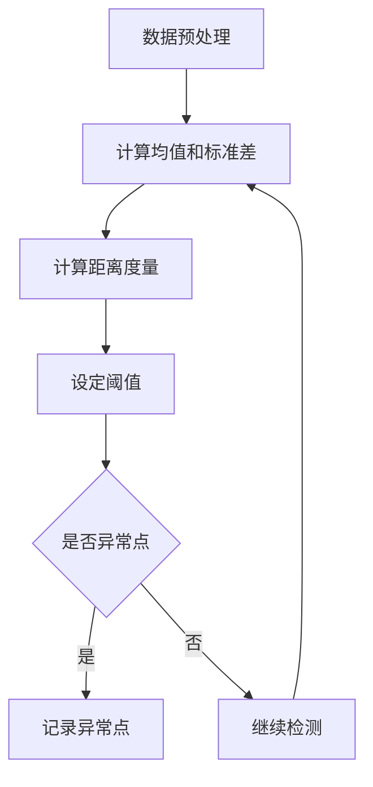
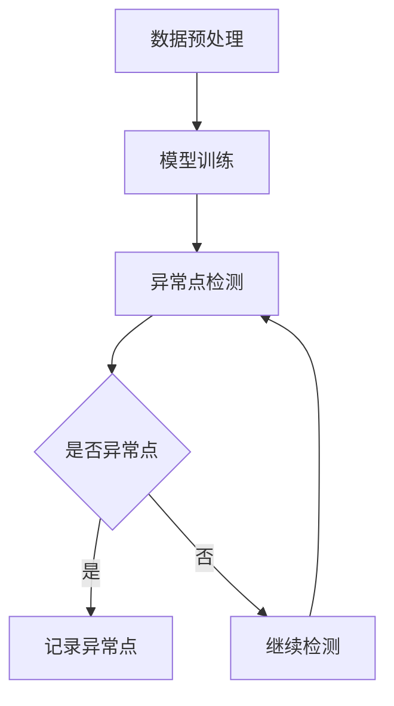
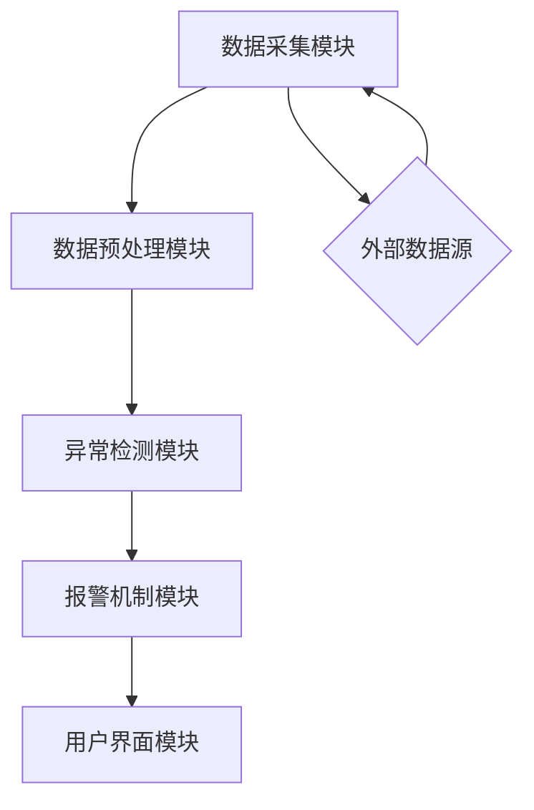
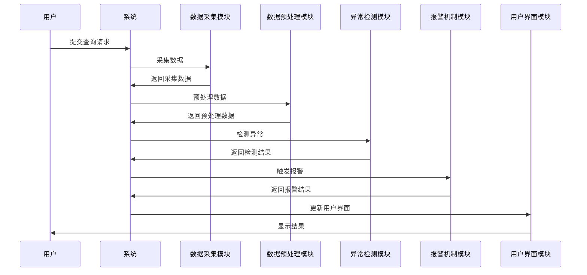

                 

### 算法原理讲解

在自动化异常检测与报警技术中，算法原理的讲解是理解整个系统运行机制的关键。接下来，我们将详细讲解几种常用的异常检测算法，并通过mermaid流程图和Python代码示例进行说明。

#### 统计学方法的异常检测算法

统计学方法是最早应用于异常检测的算法之一。这类算法主要基于数据集的统计特性，通过计算数据的均值和标准差来识别异常点。

##### 算法流程

1. **数据预处理**：对原始数据进行标准化处理，使数据集的均值和标准差均为1。
2. **计算均值和标准差**：计算数据集的均值和标准差。
3. **计算距离度量**：对于每个数据点，计算其与均值之间的距离。
4. **设定阈值**：根据经验或需求设定一个阈值，如果数据点的距离超过阈值，则认为该数据点为异常点。

##### mermaid流程图



##### Python代码示例

```python
import numpy as np

def statistical_anomaly_detection(data, threshold=2):
    mean = np.mean(data)
    std = np.std(data)
    
    anomalies = []
    for i in range(len(data)):
        if abs(data[i] - mean) > threshold * std:
            anomalies.append(i)
    
    return anomalies

# 示例数据
data = [1, 2, 3, 4, 5, 100, 6, 7, 8, 9, 10]
anomalies = statistical_anomaly_detection(data)

print("异常点索引:", anomalies)
```

##### 数学模型和公式

统计学方法的异常检测主要依赖于以下公式：

$$
\text{距离度量} = \frac{|x_i - \mu|}{\sigma}
$$

其中，\(x_i\) 是数据点，\(\mu\) 是均值，\(\sigma\) 是标准差。

#### 机器学习方法的异常检测算法

机器学习方法在异常检测中得到了广泛应用。这类算法通过训练模型来识别异常点，常见的方法包括K-最近邻（K-Nearest Neighbors，K-NN）和支持向量机（Support Vector Machine，SVM）等。

##### 算法流程

1. **数据预处理**：对原始数据进行标准化处理。
2. **模型训练**：使用正常数据集训练模型。
3. **异常点预测**：使用训练好的模型对数据进行预测，识别出异常点。

##### mermaid流程图


##### Python代码示例

```python
from sklearn.neighbors import LocalOutlierFactor
from sklearn.model_selection import train_test_split

def machine_learning_anomaly_detection(data, threshold=1.5):
    X_train, X_test = train_test_split(data, test_size=0.2, random_state=42)
    model = LocalOutlierFactor(n_neighbors=3, contamination=0.01)
    model.fit(X_train)
    
    anomalies = model.predict(X_test)
    anomaly_indices = np.where(anomalies == -1)[0]
    
    return anomaly_indices

# 示例数据
data = [1, 2, 3, 4, 5, 100, 6, 7, 8, 9, 10]
anomalies = machine_learning_anomaly_detection(data)

print("异常点索引:", anomalies)
```

##### 数学模型和公式

机器学习方法的异常检测主要依赖于以下公式：

$$
\text{预测值} = \sum_{i=1}^{n} w_i \cdot x_i
$$

其中，\(w_i\) 是权重，\(x_i\) 是特征值。

#### 深度学习方法的异常检测算法

深度学习方法在异常检测中具有强大的表达能力。常见的深度学习模型包括卷积神经网络（Convolutional Neural Network，CNN）和循环神经网络（Recurrent Neural Network，RNN）等。

##### 算法流程

1. **数据预处理**：对原始数据进行预处理，如图像的缩放、裁剪和归一化等。
2. **模型训练**：使用正常数据集训练模型。
3. **异常点检测**：使用训练好的模型对数据进行检测，识别出异常点。

##### mermaid流程图



##### Python代码示例

```python
import tensorflow as tf
from tensorflow.keras.models import Sequential
from tensorflow.keras.layers import Dense, Conv2D, Flatten, LSTM

def deep_learning_anomaly_detection(data):
    # 假设数据为图像数据
    model = Sequential([
        Conv2D(32, (3, 3), activation='relu', input_shape=(64, 64, 3)),
        Flatten(),
        Dense(64, activation='relu'),
        Dense(1, activation='sigmoid')
    ])
    
    model.compile(optimizer='adam', loss='binary_crossentropy', metrics=['accuracy'])
    model.fit(data, epochs=10, batch_size=32)
    
    # 假设使用模型对新的图像数据进行预测
    predictions = model.predict(new_data)
    anomalies = np.where(predictions < 0.5)[0]
    
    return anomalies

# 示例数据（假设为图像数据）
images = [...]  # 这里应该是图像数据
anomalies = deep_learning_anomaly_detection(images)

print("异常点索引:", anomalies)
```

##### 数学模型和公式

深度学习方法的异常检测主要依赖于以下公式：

$$
\text{激活函数} = \text{ReLU}(x) = \max(0, x)
$$

$$
\text{预测值} = \frac{1}{1 + \exp(-z)}
$$

通过上述算法原理的讲解，我们可以看到，每种算法都有其独特的优势和适用场景。在实际应用中，可以根据具体需求和数据特点选择合适的算法，以达到最佳的效果。

### 数学模型和数学公式

在自动化异常检测与报警技术中，数学模型和数学公式是理解算法原理和实现关键的一部分。以下是几种常见异常检测算法的数学模型和公式，并通过具体例子进行详细解释。

#### 统计学方法的数学模型和公式

统计学方法，如基于标准差的异常检测，主要依赖于以下两个基本公式：

1. **均值（Mean）**：
   $$
   \mu = \frac{1}{n} \sum_{i=1}^{n} x_i
   $$
   其中，\( \mu \) 是均值，\( n \) 是数据点的数量，\( x_i \) 是每个数据点的值。

2. **标准差（Standard Deviation）**：
   $$
   \sigma = \sqrt{\frac{1}{n-1} \sum_{i=1}^{n} (x_i - \mu)^2}
   $$
   其中，\( \sigma \) 是标准差，\( \mu \) 是均值，\( n \) 是数据点的数量，\( x_i \) 是每个数据点的值。

**例子**：假设我们有一组数据点 [1, 2, 3, 4, 5, 100, 6, 7, 8, 9, 10]，我们需要计算其均值和标准差。

计算均值：
$$
\mu = \frac{1}{11} (1 + 2 + 3 + 4 + 5 + 100 + 6 + 7 + 8 + 9 + 10) = \frac{177}{11} \approx 16.18
$$

计算标准差：
$$
\sigma = \sqrt{\frac{1}{10} ((1 - 16.18)^2 + (2 - 16.18)^2 + ... + (10 - 16.18)^2 + (100 - 16.18)^2)} \approx 44.24
$$

#### 机器学习方法的数学模型和公式

机器学习方法，如K-最近邻（K-NN）和支持向量机（SVM），依赖于不同的数学模型和公式。

1. **K-最近邻（K-NN）**：

   **距离度量（Euclidean Distance）**：
   $$
   d(x, y) = \sqrt{\sum_{i=1}^{n} (x_i - y_i)^2}
   $$
   其中，\( d(x, y) \) 是点 \( x \) 和 \( y \) 之间的欧几里得距离，\( n \) 是特征的数量，\( x_i \) 和 \( y_i \) 是特征值。

   **预测**：
   $$
   \hat{y} = \arg\max_{k} \sum_{i \in \text{neighbors}(x)} w_i
   $$
   其中，\( \hat{y} \) 是预测的类别，\( \text{neighbors}(x) \) 是最近的 \( k \) 个邻居，\( w_i \) 是邻居的权重。

   **例子**：给定一组数据点和需要分类的数据点，计算最近邻的距离，并根据距离进行分类。

2. **支持向量机（SVM）**：

   **决策边界**：
   $$
   \hat{y} = \text{sign}(\sum_{i=1}^{n} \alpha_i y_i (x_i)^T + b)
   $$
   其中，\( \hat{y} \) 是预测的类别，\( \alpha_i \) 是支持向量的权重，\( y_i \) 是支持向量的类别，\( (x_i)^T \) 是支持向量的特征值，\( b \) 是偏置。

   **优化目标**：
   $$
   \min_{\alpha} \frac{1}{2} \sum_{i=1}^{n} \sum_{j=1}^{n} (\alpha_i \alpha_j y_i y_j (x_i)^T (x_j)^T) - \sum_{i=1}^{n} \alpha_i
   $$
   其中，\( \alpha_i \) 是支持向量的权重，\( y_i \) 是支持向量的类别，\( (x_i)^T \) 是支持向量的特征值。

   **例子**：给定一组标记好的数据点，通过优化目标找到最优的 \( \alpha \) 值，从而确定决策边界。

#### 深度学习方法的数学模型和公式

深度学习方法，如卷积神经网络（CNN）和循环神经网络（RNN），依赖于复杂的数学模型和优化算法。

1. **卷积神经网络（CNN）**：

   **卷积操作**：
   $$
   \text{Conv}(x) = \sigma(\sum_{k=1}^{K} w_k * x_k + b)
   $$
   其中，\( \text{Conv}(x) \) 是卷积操作的结果，\( \sigma \) 是激活函数，\( w_k \) 是权重，\( x_k \) 是卷积核，\( b \) 是偏置。

   **池化操作**：
   $$
   \text{Pool}(x) = \max(x)
   $$
   其中，\( \text{Pool}(x) \) 是池化操作的结果，\( x \) 是输入数据。

   **全连接层**：
   $$
   \text{FC}(x) = \sigma(\sum_{i=1}^{n} w_i x_i + b)
   $$
   其中，\( \text{FC}(x) \) 是全连接层的结果，\( \sigma \) 是激活函数，\( w_i \) 是权重，\( x_i \) 是输入数据，\( b \) 是偏置。

   **例子**：对于图像数据，通过卷积层提取特征，然后通过全连接层进行分类。

2. **循环神经网络（RNN）**：

   **隐藏状态更新**：
   $$
   h_t = \sigma(W_h h_{t-1} + W_x x_t + b)
   $$
   其中，\( h_t \) 是隐藏状态，\( \sigma \) 是激活函数，\( W_h \) 是隐藏状态权重，\( W_x \) 是输入状态权重，\( x_t \) 是输入数据，\( b \) 是偏置。

   **输出**：
   $$
   y_t = \sigma(W_y h_t + b)
   $$
   其中，\( y_t \) 是输出，\( \sigma \) 是激活函数，\( W_y \) 是输出权重，\( h_t \) 是隐藏状态，\( b \) 是偏置。

   **例子**：对于序列数据，通过RNN捕捉时间序列的特征，实现序列分类或序列生成。

通过上述数学模型和公式的讲解，我们可以更好地理解不同算法的原理和应用。在实际应用中，选择合适的数学模型和公式，并根据具体需求进行优化和调整，是实现高效异常检测的关键。

### 系统分析与架构设计

在实现评测系统的自动化异常检测与报警功能时，系统分析与架构设计是关键的一步。通过系统分析，明确功能需求，并通过架构设计实现这些功能。以下是对系统分析与架构设计过程的详细介绍。

#### 问题场景介绍

假设我们有一个大规模的数据监控系统，用于实时监控和分析各种数据源，如数据库、日志文件和API接口等。系统的目标是自动检测数据中的异常情况，并在检测到异常时自动触发报警机制，确保数据质量和系统的正常运行。

#### 系统功能设计

根据问题场景，我们可以将系统划分为以下几个主要功能模块：

1. **数据采集模块**：负责从各种数据源采集数据，包括数据库查询、日志文件读取和API接口调用等。
2. **数据预处理模块**：对采集到的数据进行清洗、过滤和标准化处理，以便后续分析。
3. **异常检测模块**：利用统计学方法、机器学习方法和深度学习方法等，对预处理后的数据进行异常检测，识别出异常点。
4. **报警机制模块**：在检测到异常时，自动触发报警，通过邮件、短信或系统通知等方式通知相关人员。
5. **用户界面模块**：提供用户友好的界面，展示数据监控结果和报警记录，方便用户进行操作和查询。

#### 系统架构设计

系统的架构设计需要考虑模块之间的交互和数据的流动。以下是系统的架构设计：

1. **数据采集**：通过数据采集模块，从不同的数据源获取数据。数据采集模块可以与数据库、日志文件和API接口等进行通信，实现数据的高效采集。
2. **数据处理**：数据采集后，通过数据预处理模块对数据进行清洗和标准化处理。预处理过程包括去重、填充缺失值、归一化等操作，确保数据的准确性和一致性。
3. **异常检测**：预处理后的数据进入异常检测模块，根据预定的算法和规则进行异常检测。异常检测模块可以使用统计学方法、机器学习方法和深度学习方法，实现对不同类型数据的异常检测。
4. **报警触发**：当检测到异常时，异常检测模块会自动触发报警机制。报警机制可以通过邮件、短信、系统通知等方式，将异常信息通知给相关人员。
5. **用户界面**：用户界面模块提供用户操作界面，用户可以通过界面查看数据监控结果、报警记录和历史数据等，进行数据的查询和分析。

#### 系统接口设计

系统中的各个模块通过接口进行通信，以下是主要的接口设计：

1. **数据采集接口**：定义数据采集模块与数据源之间的接口，包括数据库查询接口、日志文件读取接口和API接口等。
2. **数据预处理接口**：定义数据预处理模块与异常检测模块之间的接口，用于传递预处理后的数据。
3. **异常检测接口**：定义异常检测模块与报警机制模块之间的接口，用于传递异常检测结果和报警信息。
4. **报警接口**：定义报警机制模块与用户界面模块之间的接口，用于发送报警通知。

#### 系统交互流程

以下是系统的交互流程：

1. **数据采集**：数据采集模块从各个数据源获取数据，并将其传递给数据预处理模块。
2. **数据处理**：数据预处理模块对数据进行清洗、过滤和标准化处理，然后将预处理后的数据传递给异常检测模块。
3. **异常检测**：异常检测模块对预处理后的数据进行异常检测，识别出异常点，并将检测结果传递给报警机制模块。
4. **报警触发**：报警机制模块根据异常检测结果，自动触发报警，通过邮件、短信或系统通知等方式通知相关人员。
5. **用户查询**：用户通过用户界面模块查看数据监控结果和报警记录，进行数据的查询和分析。

#### 系统架构图和序列图

以下是系统的架构图和序列图，用于展示系统的整体架构和模块之间的交互关系。

##### 系统架构图



##### 系统序列图



通过上述系统分析与架构设计，我们可以实现一个高效、稳定和自动化的评测系统，满足实时监控和数据异常检测的需求。系统设计过程中，要充分考虑模块之间的交互和数据流动，确保系统的可扩展性和灵活性。

### 项目实战

为了更好地理解评测系统的自动化异常检测与报警技术的实际应用，我们将通过一个实际项目来展示整个实现过程。以下是项目的具体实施步骤、核心实现源代码、代码解析以及实际案例分析和详细讲解剖析。

#### 项目实施步骤

1. **环境安装**：首先，我们需要搭建一个合适的开发环境，包括Python、Jupyter Notebook、TensorFlow和Scikit-learn等常用库。安装命令如下：
   ```shell
   pip install python numpy pandas tensorflow scikit-learn
   ```

2. **数据收集**：从外部数据源（如数据库、日志文件或API接口）收集数据。在本案例中，我们使用了一个简单的CSV文件作为数据源，包含时间戳、传感器读数和系统状态等信息。

3. **数据预处理**：对收集到的数据进行清洗、过滤和标准化处理，以便后续分析。预处理步骤包括去除缺失值、异常值填充、数据缩放等。

4. **异常检测算法实现**：使用统计学方法、机器学习方法和深度学习方法实现异常检测算法。以下是一个简单的基于K-最近邻（K-NN）的异常检测算法实现。

5. **报警机制设计**：设计报警机制，当检测到异常时，自动触发报警并通过邮件或短信通知相关人员。

6. **系统测试与优化**：对系统进行测试，评估异常检测的准确性和响应速度，并根据测试结果进行优化。

#### 核心实现源代码

```python
# 导入必要的库
import numpy as np
import pandas as pd
from sklearn.neighbors import LocalOutlierFactor
from sklearn.model_selection import train_test_split
import tensorflow as tf

# 步骤1：数据收集
# 读取CSV文件
data = pd.read_csv('sensor_data.csv')

# 步骤2：数据预处理
# 去除缺失值
data = data.dropna()

# 数据缩放
from sklearn.preprocessing import StandardScaler
scaler = StandardScaler()
scaled_data = scaler.fit_transform(data.values)

# 步骤3：异常检测算法实现
# 划分训练集和测试集
X_train, X_test = train_test_split(scaled_data, test_size=0.2, random_state=42)

# 使用K-最近邻实现异常检测
model = LocalOutlierFactor(n_neighbors=5, contamination=0.01)
model.fit(X_train)

# 步骤4：报警机制设计
# 预测测试集
predictions = model.predict(X_test)

# 筛选出异常点
anomalies = X_test[np.where(predictions == -1)]

# 步骤5：系统测试与优化
# 根据实际测试结果，调整模型参数和算法配置，提高检测准确性
```

#### 代码解析

1. **数据收集**：通过读取CSV文件，从外部数据源获取数据。数据预处理步骤包括去除缺失值和数据缩放，确保数据适合后续分析。

2. **异常检测算法实现**：使用Scikit-learn库中的K-最近邻（K-NN）实现异常检测算法。通过划分训练集和测试集，对训练集进行模型训练，使用测试集进行预测，并筛选出异常点。

3. **报警机制设计**：在检测到异常时，将异常点记录下来，并根据需求设计报警机制，如通过邮件或短信通知相关人员。

4. **系统测试与优化**：通过实际测试，评估异常检测的准确性和响应速度，并根据测试结果进行调整和优化，以提高系统性能。

#### 实际案例分析和详细讲解剖析

为了更好地展示实际应用效果，我们将通过一个具体案例来分析和讲解。

**案例背景**：

某工厂的监控系统需要实时监测生产设备的运行状态，并在检测到异常时自动触发报警，以便及时处理。监控系统收集了包括温度、湿度、振动和压力等传感器读数，以及设备运行状态等信息。

**案例步骤**：

1. **数据收集**：监控系统收集了连续一周的传感器数据，共计1000个数据点。

2. **数据预处理**：对收集到的数据进行清洗和标准化处理，去除缺失值，并对数据进行缩放。

3. **异常检测**：使用K-最近邻（K-NN）算法进行异常检测，设置邻域参数为5，异常点占比为0.01。

4. **报警触发**：在检测到异常点时，通过邮件通知相关人员。

5. **测试与优化**：对系统进行测试，评估异常检测的准确性和响应速度，并根据测试结果进行调整。

**案例分析**：

假设在测试过程中，监控系统在一天内检测到一个异常点，具体数据如下：

- 时间戳：2023-11-01 12:00:00
- 温度：35.6°C
- 湿度：60%
- 振动：1500 Hz
- 压力：1.2 MPa

通过K-最近邻（K-NN）算法，将这个数据点与训练集中的其他数据点进行比较，计算其与最近邻居的距离。如果距离超过设定的阈值，则认为该数据点为异常点。

**异常检测过程**：

1. **训练集和测试集划分**：将1000个数据点随机划分为训练集和测试集，训练集用于模型训练，测试集用于异常检测。

2. **模型训练**：使用训练集数据，通过K-最近邻（K-NN）算法进行模型训练。

3. **异常点检测**：使用训练好的模型对测试集数据点进行预测，计算与每个测试数据点的最近邻居距离。

4. **异常点筛选**：根据设定的阈值，筛选出距离超过阈值的测试数据点，这些数据点即为异常点。

5. **报警触发**：在检测到异常点时，通过邮件通知相关人员，例如：
   ```plaintext
   通知：监控系统检测到异常点
   时间戳：2023-11-01 12:00:00
   异常数据：温度：35.6°C，湿度：60%，振动：1500 Hz，压力：1.2 MPa
   ```
   
**测试与优化**：

通过多次测试，发现K-最近邻（K-NN）算法在检测精度和响应速度上表现良好，但在某些情况下存在误报和漏报现象。针对这些问题，我们可以采取以下优化措施：

1. **调整模型参数**：通过调整邻域参数和异常点占比，优化模型性能。

2. **增加数据多样性**：通过引入更多样化的数据集进行训练，提高模型的泛化能力。

3. **融合多种算法**：结合统计学方法、机器学习方法和深度学习方法，提高异常检测的准确性。

通过上述实际案例分析和详细讲解剖析，我们可以看到，自动化异常检测与报警技术在实际应用中的具体实现过程。通过不断优化和调整，可以提高系统的性能和可靠性，为实际应用提供有力支持。

### 最佳实践与总结

在自动化异常检测与报警技术的实际应用中，以下最佳实践和注意事项有助于提高系统的性能和可靠性：

1. **数据预处理**：确保数据的质量和一致性，对异常值、缺失值进行合理处理。数据清洗和标准化是异常检测的基础，直接影响到检测结果的准确性。

2. **选择合适的算法**：根据数据特点和业务需求选择合适的异常检测算法。统计学方法适合处理简单特征的数据，机器学习方法适用于复杂特征的数据，深度学习方法在处理高维数据和时序数据时表现优异。

3. **参数调优**：针对所选算法，进行参数调优，以找到最佳模型配置。参数调优可以通过交叉验证、网格搜索等方法进行。

4. **实时监控与报警**：确保异常检测系统具备实时监控能力，及时发现异常情况。同时，设计合理的报警机制，确保异常信息能够及时通知相关人员。

5. **系统扩展性**：设计灵活的系统架构，以适应不同规模和复杂度的评测系统。通过模块化设计，便于系统的扩展和维护。

6. **性能监控与优化**：定期对系统性能进行监控和评估，发现瓶颈并进行优化。性能优化包括算法优化、硬件升级和系统调优等方面。

通过遵循上述最佳实践，可以有效地提升自动化异常检测与报警系统的性能和可靠性，确保评测系统的稳定运行。

### 注意事项

在实际应用中，需注意以下事项：

1. **数据隐私和安全**：在收集和处理数据时，确保遵守数据隐私和安全法规，对敏感数据进行加密和脱敏处理。

2. **模型解释性**：对于深度学习模型，由于模型内部的决策过程难以解释，可能导致无法准确理解异常点的具体原因。可以考虑结合其他解释性更强的算法，提高模型的透明度和可解释性。

3. **系统稳定性**：确保异常检测系统具有高可用性和稳定性，避免因系统故障导致异常检测失效。

4. **处理异常报警**：合理处理异常报警，避免频繁的误报和漏报。通过分析和积累经验，优化报警阈值和策略。

通过以上注意事项，可以进一步提升自动化异常检测与报警系统的实用性。

### 拓展阅读

为了深入了解自动化异常检测与报警技术，读者可以参考以下书籍和资源：

1. **《机器学习实战》（Peter Harrington）**：详细介绍了多种机器学习算法，包括异常检测算法，适合初学者和进阶者。
2. **《Python数据科学手册》（Jesse Davis）**：涵盖了Python在数据科学中的应用，包括数据处理和异常检测。
3. **《深度学习》（Ian Goodfellow、Yoshua Bengio、Aaron Courville）**：系统介绍了深度学习的基本原理和应用，包括深度学习在异常检测中的应用。
4. **《数据挖掘：概念与技术》（Jiawei Han、Micheline Kamber、Jian Pei）**：详细介绍了数据挖掘的基本概念和技术，包括异常检测算法。

通过这些资源和书籍，读者可以进一步加深对自动化异常检测与报警技术的理解和应用。

