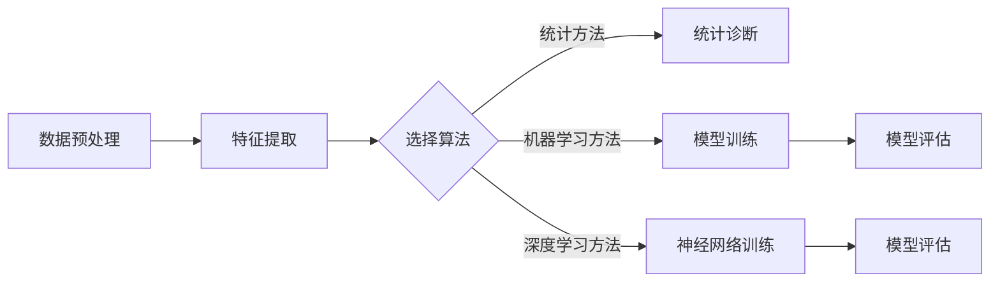
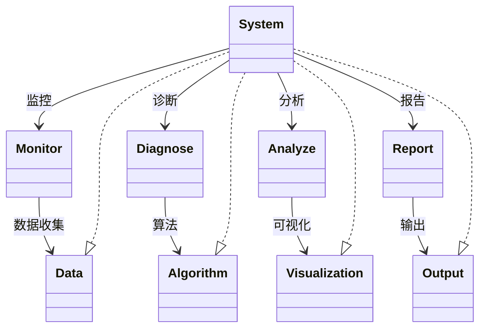
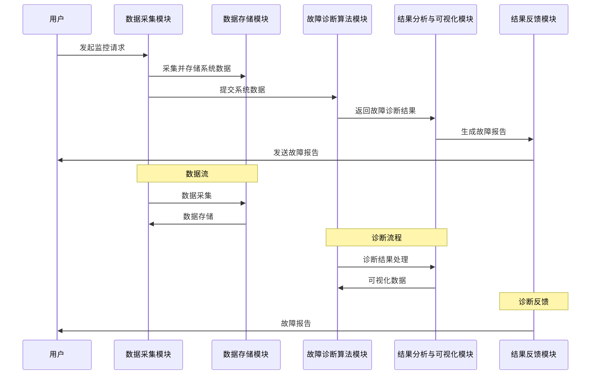
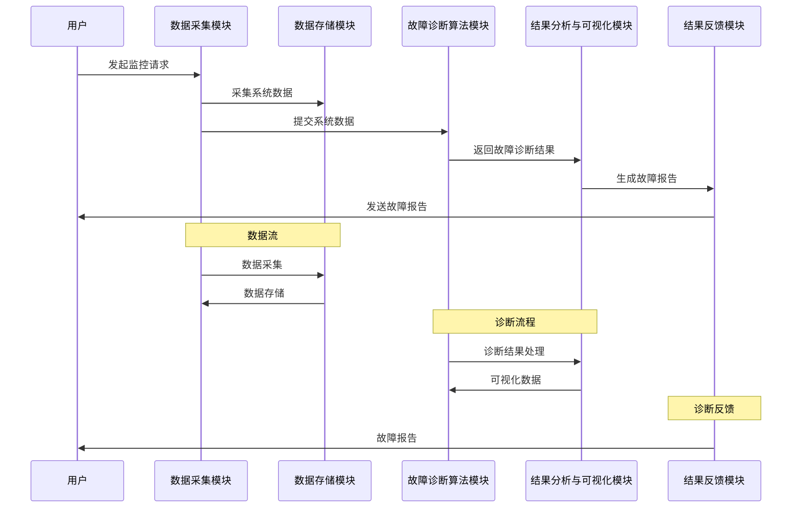

                 

### 第1章：问题背景与核心概念

#### 1.1.1 问题背景

评测系统在现代社会中扮演着至关重要的角色，无论是在科研、教育、工业生产还是日常生活中。它不仅能够帮助我们评估系统性能、服务质量，还能够实时监控系统的运行状态，从而预防潜在故障的发生。然而，随着系统规模的不断扩大和复杂性的增加，评测系统本身也面临着各种各样的挑战。例如，系统故障可能会导致数据丢失、性能下降，甚至完全停止服务。这不仅会影响到用户的体验，还可能对业务造成重大损失。

因此，引入自动化故障诊断功能成为了一种必然趋势。自动化故障诊断通过预先设定的算法和模型，能够实时监控系统运行状态，自动识别故障并给出相应的诊断结果。这样，不仅大大减少了人工干预的需求，还提高了故障响应速度和准确性。此外，自动化故障诊断还可以通过对故障数据的长期积累和分析，为系统优化和改进提供有力支持。

#### 1.1.2 核心概念

1. **自动化故障诊断**：

   自动化故障诊断是指通过预设的算法和模型，对系统运行状态进行实时监控，自动识别故障并给出诊断结果的过程。其基本原理包括数据采集、故障特征提取、故障诊断算法和诊断结果验证等几个关键步骤。

2. **评测系统**：

   评测系统是一种专门用于评估和监控系统性能和服务的工具。它通常包括多个功能模块，如评测指标计算、数据质量评估、结果分析与可视化等。这些模块共同协作，实现对系统运行状态的全面监控和评估。

3. **故障诊断**：

   故障诊断是指通过分析系统运行数据，识别和定位故障的过程。它通常包括故障特征提取和故障诊断算法两个关键步骤。故障特征提取是将原始数据转化为能够表征故障特性的数据集，而故障诊断算法则是基于这些特征数据来识别故障类型和位置。

#### 1.1.3 关键技术

为了实现自动化故障诊断，需要掌握一系列关键技术，包括数据预处理、故障特征提取、故障诊断算法和诊断结果验证等。

1. **数据预处理**：

   数据预处理是故障诊断过程中的重要步骤，它包括数据清洗、归一化和特征提取等操作。数据清洗旨在去除噪声和异常数据，而归一化则是将不同量纲的数据统一到同一尺度。特征提取则是从原始数据中提取出能够表征故障特性的特征。

2. **故障特征提取**：

   故障特征提取是将原始数据转化为故障特征数据的过程。这些特征数据能够反映系统的运行状态，有助于故障诊断算法的准确性和效率。

3. **故障诊断算法**：

   故障诊断算法是自动化故障诊断的核心，它负责根据故障特征数据来识别故障类型和位置。常见的故障诊断算法包括基于统计的方法、机器学习方法以及深度学习方法。

4. **诊断结果验证**：

   诊断结果验证是对故障诊断结果进行评估和验证的过程。通过对比诊断结果与实际故障情况，可以评估诊断算法的性能和可靠性，为算法优化提供依据。

通过上述关键技术的协同作用，自动化故障诊断功能能够实现对评测系统的实时监控和故障诊断，从而提高系统的稳定性和可靠性。

### 1.2 自动化故障诊断原理

自动化故障诊断功能的核心在于其系统化的数据处理和诊断流程，以下我们将详细探讨这一原理，包括数据采集与预处理、故障特征提取、故障诊断算法和诊断结果验证等几个关键环节。

#### 1.2.1 数据采集与预处理

**数据采集**是自动化故障诊断的第一步，它涉及到从评测系统的各个模块和组件中收集运行数据。这些数据可以是系统性能指标、日志文件、网络流量等。数据采集的目的是为了获取系统的全面信息，为后续的故障诊断提供基础。

然而，采集到的原始数据往往存在噪声、缺失值和异常值等问题，因此需要进行预处理。预处理过程通常包括以下几个步骤：

1. **数据清洗**：去除数据中的噪声和异常值，例如去除日志中的无关信息、过滤网络流量中的垃圾数据等。
2. **数据归一化**：将不同量纲的数据统一到同一尺度，以便后续的特征提取和算法处理。例如，将系统性能指标归一化到0-1之间。
3. **数据填充**：对缺失的数据进行填补，以保证数据的完整性。常用的方法包括平均值填补、插值填补等。

通过数据预处理，我们可以确保输入数据的质量和一致性，从而提高故障诊断的准确性。

#### 1.2.2 故障特征提取

**故障特征提取**是将预处理后的数据转化为能够反映系统故障特性的特征数据的过程。特征提取的目的是从大量的原始数据中提取出关键信息，以便故障诊断算法能够准确识别故障。

故障特征提取通常包括以下几个步骤：

1. **特征选择**：从原始数据中选择对故障诊断最有影响力的特征。常用的方法包括信息增益、卡方检验等。
2. **特征提取**：对选定的特征进行转换和构造，以增强其故障表征能力。例如，利用统计方法提取平均值、方差等统计特征；利用机器学习方法提取主成分、特征向量等。
3. **特征标准化**：将提取的特征进行标准化处理，以消除不同特征之间的量纲和尺度差异。

通过故障特征提取，我们可以得到一组具有代表性的特征数据，这些数据将用于后续的故障诊断。

#### 1.2.3 故障诊断算法

**故障诊断算法**是自动化故障诊断的核心，它负责根据故障特征数据来识别故障类型和位置。故障诊断算法的选择取决于系统的特点和需求，常见的故障诊断算法包括以下几种：

1. **基于统计的方法**：利用统计模型对故障特征进行分析，常见的统计模型包括正态分布、线性回归等。这种方法简单直观，但需要假设故障特征服从某种统计分布。
2. **基于机器学习的方法**：利用机器学习算法对故障特征进行建模和分类，常见的机器学习算法包括决策树、支持向量机、神经网络等。这种方法具有较强的泛化能力和自适应能力。
3. **基于深度学习的方法**：利用深度学习模型，如卷积神经网络（CNN）、循环神经网络（RNN）等，对故障特征进行自动学习和建模。这种方法能够处理复杂和非线性关系，但在数据量和计算资源上有较高要求。

在诊断过程中，算法会根据故障特征数据生成故障诊断结果，包括故障类型、故障位置等。为了提高诊断的准确性，通常需要对多个算法进行综合评估和优化。

#### 1.2.4 诊断结果验证

**诊断结果验证**是对故障诊断结果进行评估和验证的过程。通过将诊断结果与实际故障情况进行对比，可以评估诊断算法的性能和可靠性，为算法优化提供依据。

诊断结果验证通常包括以下几个步骤：

1. **结果对比**：将诊断结果与实际故障情况进行对比，检查诊断结果是否一致。
2. **性能评估**：利用评估指标，如准确率、召回率、F1值等，对诊断算法进行性能评估。
3. **错误分析**：分析诊断过程中的错误案例，找出算法的不足之处，为算法优化提供方向。

通过诊断结果验证，我们可以确保故障诊断的准确性和可靠性，从而提高评测系统的整体性能。

### 1.3 评测系统功能模块

评测系统通常由多个功能模块组成，这些模块共同协作，实现对系统性能和服务的全面监控和评估。以下是评测系统的主要功能模块及其简要介绍：

#### 1.3.1 评测指标计算

**评测指标计算**模块负责计算和评估系统的各项性能指标，如响应时间、吞吐量、错误率等。这些指标是评测系统性能的重要依据，能够帮助运营团队了解系统的运行状况。

#### 1.3.2 数据质量评估

**数据质量评估**模块负责评估系统输入数据的质量，包括数据完整性、一致性、准确性等。高质量的数据是故障诊断和性能评估的基础，因此数据质量评估模块至关重要。

#### 1.3.3 结果分析与可视化

**结果分析与可视化**模块负责对系统运行结果进行分析和可视化展示，帮助运营团队直观地了解系统的运行状况和性能表现。通过数据可视化，可以更清晰地发现系统的问题和瓶颈。

#### 1.3.4 故障诊断反馈机制

**故障诊断反馈机制**模块负责将故障诊断结果反馈给运营团队，并提供相应的故障处理建议。通过反馈机制，运营团队能够及时响应故障，确保系统的稳定运行。

### 1.4 关键技术对比表格

为了帮助读者更好地理解评测系统自动化故障诊断功能的关键技术，以下提供了一个对比表格，列出了不同类型技术的特点和应用场景。

| 技术类型       | 主要特点                                       | 适用场景                      |
| -------------- | ---------------------------------------------- | ----------------------------- |
| 数据预处理技术  | 数据清洗、归一化、特征提取等                     | 故障特征提取前                |
| 故障诊断算法   | 基于统计、机器学习、深度学习等                   | 故障检测与诊断核心           |
| 可视化技术     | 数据与结果的图形化展示                          | 故障诊断结果理解与验证       |

通过这个对比表格，读者可以更全面地了解各项技术的基本特点和适用场景，从而为评测系统的设计和实现提供参考。

### 1.5 ER实体关系图架构

为了更好地理解评测系统自动化故障诊断功能中的各个实体及其关系，我们使用Mermaid语法绘制了一个ER实体关系图。以下代码展示了这个关系图的实现：

```mermaid
erDiagram
  AR Entity --> AS Attribute
  AE Entity --> AE Attribute
  AI Interface --> AE Entity
  AI Interface --> AR Entity
```

该图中的实体包括`AR Entity`（评测结果记录实体）、`AS Attribute`（评测结果属性）、`AE Entity`（评测系统实体）和`AI Interface`（评测接口实体）。通过这些实体和它们之间的关系，我们可以清晰地了解评测系统自动化故障诊断功能中的关键组成部分和它们之间的相互作用。

### 第2章：评测系统故障诊断算法原理

#### 2.1 算法概述

在评测系统的自动化故障诊断功能中，算法起着核心作用。选择合适的算法不仅能够提高故障诊断的准确性，还能显著提升系统的响应速度。算法的选择主要取决于评测系统的具体需求和数据特征。以下是几种常见的故障诊断算法及其选择依据。

##### 2.1.1 算法选择依据

1. **故障特征数据类型**：不同的算法对数据类型的要求不同，例如，统计方法适用于数值型数据，而机器学习方法适用于高维复杂数据。
2. **系统规模和复杂性**：对于大规模系统，需要选择具有高效计算能力的算法，如深度学习算法。对于简单系统，传统的统计方法可能更加适用。
3. **故障诊断的实时性要求**：实时性要求较高的系统，需要选择计算速度较快的算法，例如基于规则的方法。对于非实时性要求较高的系统，可以选择计算复杂度较高的算法，如机器学习方法。
4. **算法的可解释性**：在实际应用中，算法的可解释性也是一个重要考虑因素。可解释性较高的算法有助于运营团队理解故障诊断过程，从而进行有效的故障处理。

##### 2.1.2 算法分类介绍

1. **基于统计的方法**：
   - **统计模型**：利用统计学原理，对故障特征数据进行建模和分析。常见的统计模型包括线性回归、逻辑回归等。
   - **统计量计算**：通过计算统计量（如均值、方差、协方差等）来识别故障特征。

2. **基于机器学习的方法**：
   - **监督学习**：利用已标记的故障数据训练模型，然后对新的数据集进行分类。常见的监督学习方法包括决策树、支持向量机（SVM）、神经网络等。
   - **无监督学习**：不需要预先标记数据，直接从数据中学习故障特征。常见的无监督学习方法包括聚类、主成分分析（PCA）等。

3. **基于深度学习的方法**：
   - **卷积神经网络（CNN）**：适用于处理图像和时序数据，通过卷积操作提取空间特征。
   - **循环神经网络（RNN）**：适用于处理序列数据，能够捕捉时间序列中的长期依赖关系。
   - **长短时记忆网络（LSTM）**：是RNN的一种变种，能够更好地处理长序列数据。

#### 2.2 常见故障诊断算法

以下是评测系统自动化故障诊断中常见的几种算法，每种算法都有其独特的原理和应用场景。

##### 2.2.1 统计方法

**统计方法**是基于统计学原理来识别故障特征的一种方法。常见的统计方法包括：

1. **均值和方差**：
   - **均值**（$\mu$）：衡量数据的中心趋势。
   - **方差**（$\sigma^2$）：衡量数据的离散程度。
   - 应用场景：适用于简单系统的故障诊断，可以识别数据的异常波动。

2. **概率模型**：
   - **正态分布**：利用正态分布模型来估计故障特征的分布情况。
   - **贝叶斯模型**：基于贝叶斯定理，通过先验知识和观测数据来估计故障概率。
   - 应用场景：适用于具有高斯分布特征的数据，能够进行故障概率估计。

##### 2.2.2 机器学习方法

**机器学习方法**通过训练模型来自动识别故障特征。常见的机器学习方法包括：

1. **决策树**：
   - **原理**：利用树形结构对数据进行分割，每个节点表示一个特征，每个分支代表特征的不同取值。
   - **应用场景**：适用于特征较少且易于分割的数据，能够直观地展示故障诊断过程。

2. **支持向量机（SVM）**：
   - **原理**：通过找到一个最佳的超平面，将不同故障类型的特征空间分开。
   - **应用场景**：适用于高维特征空间，能够处理非线性故障特征。

3. **神经网络**：
   - **原理**：通过多层神经网络对故障特征进行非线性变换，最终输出故障类型。
   - **应用场景**：适用于复杂非线性系统，能够处理大规模和高维数据。

##### 2.2.3 深度学习方法

**深度学习方法**是一种基于多层神经网络的结构化算法，适用于处理大规模复杂数据。常见的深度学习方法包括：

1. **卷积神经网络（CNN）**：
   - **原理**：通过卷积操作提取图像或时序数据的特征。
   - **应用场景**：适用于图像识别和时序数据分析，能够处理高维数据。

2. **循环神经网络（RNN）**：
   - **原理**：通过循环机制处理序列数据，能够捕捉时间序列中的长期依赖关系。
   - **应用场景**：适用于时间序列分析，能够处理长序列数据。

3. **长短时记忆网络（LSTM）**：
   - **原理**：是RNN的一种改进，通过门控机制有效地处理长序列数据。
   - **应用场景**：适用于长序列数据分析和复杂时间序列故障诊断。

通过对比不同算法的原理和应用场景，我们可以根据评测系统的具体需求选择最合适的算法，从而实现高效、准确的故障诊断。

### 2.3 算法Mermaid流程图

为了更好地展示评测系统故障诊断算法的工作流程，我们使用Mermaid语法绘制了一个流程图。以下代码展示了该流程图的实现：



在这个流程图中：

- **A[数据预处理]**：包括数据清洗、归一化等操作。
- **B[特征提取]**：从预处理后的数据中提取出故障特征。
- **C{选择算法]**：根据具体需求选择适当的故障诊断算法。
- **D[统计诊断]**：使用统计方法进行故障诊断。
- **E[模型训练]**：使用机器学习方法对故障诊断模型进行训练。
- **F[模型评估]**：评估训练后的模型性能。
- **G[神经网络训练]**：使用深度学习方法对神经网络进行训练。
- **H[模型评估]**：评估训练后的神经网络性能。

通过这个流程图，我们可以清晰地看到故障诊断算法从数据预处理到模型评估的全过程，有助于读者理解算法的实现步骤和原理。

### 2.4 数学模型与公式讲解

在评测系统故障诊断中，数学模型和公式是理解和实现算法的基础。以下我们将详细讲解一些常用的数学模型和公式，包括统计模型和机器学习模型。

#### 2.4.1 统计模型

统计模型是故障诊断中常用的一种方法，以下介绍几个基本的统计模型和公式。

1. **均值和方差**：

   - **均值**（$\mu$）：
     $$\mu = \frac{1}{n}\sum_{i=1}^{n} x_i$$
     - 解释：$\mu$ 表示平均值，$x_i$ 表示第 $i$ 个数据点，$n$ 表示数据点的总数。该公式用于计算数据集的平均值，是衡量数据集中趋势的重要指标。

   - **方差**（$\sigma^2$）：
     $$\sigma^2 = \frac{1}{n-1}\sum_{i=1}^{n}(x_i - \mu)^2$$
     - 解释：$\sigma^2$ 表示方差，$x_i$ 是第 $i$ 个数据点，$\mu$ 是平均值。方差衡量数据的离散程度，数值越大表示数据分布越分散。

2. **概率模型**：

   - **正态分布**：
     $$p(x) = \frac{1}{\sqrt{2\pi\sigma^2}}e^{-\frac{(x-\mu)^2}{2\sigma^2}}$$
     - 解释：该公式表示正态分布的概率密度函数，$x$ 是随机变量，$\mu$ 是均值，$\sigma^2$ 是方差。正态分布广泛应用于数据分析和故障诊断中。

   - **贝叶斯模型**：
     $$P(A|B) = \frac{P(B|A)P(A)}{P(B)}$$
     - 解释：贝叶斯公式用于计算在给定事件 $B$ 发生的条件下，事件 $A$ 发生的概率。$P(A|B)$ 是在 $B$ 发生的条件下 $A$ 的概率，$P(B|A)$ 是在 $A$ 发生的条件下 $B$ 的概率，$P(A)$ 和 $P(B)$ 分别是事件 $A$ 和 $B$ 的概率。

#### 2.4.2 机器学习模型

机器学习模型在故障诊断中起着核心作用，以下介绍一些常用的机器学习模型和公式。

1. **线性回归**：

   - **回归方程**：
     $$y = \beta_0 + \beta_1x$$
     - 解释：$y$ 是预测值，$\beta_0$ 是截距，$\beta_1$ 是斜率，$x$ 是自变量。该公式表示线性回归模型，通过拟合数据来确定自变量和因变量之间的关系。

   - **损失函数**：
     $$J(\theta) = \frac{1}{2m}\sum_{i=1}^{m}(h_\theta(x^{(i)}) - y^{(i)})^2$$
     - 解释：$J(\theta)$ 是损失函数，$h_\theta(x^{(i)})$ 是预测值，$y^{(i)}$ 是真实值，$m$ 是数据点的总数。该公式用于衡量模型预测值与真实值之间的差异，是优化模型的重要指标。

2. **逻辑回归**：

   - **概率分布**：
     $$P(y=1|x; \theta) = \frac{1}{1 + e^{-(\theta^T x + \theta_0)}}$$
     - 解释：该公式表示逻辑回归的概率分布函数，$x$ 是输入特征，$\theta$ 是参数向量，$\theta_0$ 是截距。逻辑回归常用于二分类问题，能够估计给定特征下目标变量的概率。

   - **损失函数**：
     $$J(\theta) = -\frac{1}{m}\sum_{i=1}^{m}y^{(i)}\log(P(y=1|x; \theta)) + (1 - y^{(i)})\log(1 - P(y=1|x; \theta))$$
     - 解释：该公式表示逻辑回归的损失函数，用于衡量模型预测概率与真实标签之间的差异。$y^{(i)}$ 是真实标签，$P(y=1|x; \theta)$ 是预测概率。

3. **神经网络**：

   - **激活函数**：
     $$\sigma(z) = \frac{1}{1 + e^{-z}}$$
     - 解释：$\sigma$ 是Sigmoid函数，用于将线性组合转化为概率分布。该函数在深度学习中广泛应用，能够将模型输出映射到0到1之间。

   - **前向传播**：
     $$a_{\text{layer}_{l}} = \sigma(z_{\text{l}}) = \frac{1}{1 + e^{-z_{\text{l}}}}$$
     - 解释：$a_{\text{l}}$ 是第 $l$ 层的激活值，$z_{\text{l}}$ 是第 $l$ 层的线性组合。该公式用于计算神经网络中的激活值。

   - **反向传播**：
     $$\Delta{\theta}_{ij}^{l} = \frac{\partial{J}}{\partial{\theta}_{ij}^{l}} = a_{\text{l-1}}^{l} \cdot (1 - a_{\text{l-1}}^{l}) \cdot \Delta{z}_{ij}^{l}$$
     - 解释：$\Delta{\theta}_{ij}^{l}$ 是参数的梯度，$a_{\text{l-1}}^{l}$ 是前一层激活值，$\Delta{z}_{ij}^{l}$ 是误差传播。该公式用于计算神经网络中的参数梯度，是优化模型的重要步骤。

通过以上数学模型和公式的讲解，我们可以更好地理解评测系统故障诊断算法的基本原理，为实际应用提供理论基础。

### 3.1 数学模型

在评测系统故障诊断算法中，数学模型扮演着至关重要的角色。以下是几种常见的数学模型，它们分别适用于不同的故障诊断场景。

#### 3.1.1 统计模型

统计模型基于统计学原理，通过对数据进行分析来识别故障特征。以下介绍几种常用的统计模型。

1. **正态分布模型**：

   正态分布模型假设故障特征数据服从正态分布，通过计算统计量如均值和方差来识别故障。

   - **均值**（$\mu$）：
     $$\mu = \frac{1}{n}\sum_{i=1}^{n} x_i$$
     - 解释：$\mu$ 表示平均值，$x_i$ 表示第 $i$ 个数据点，$n$ 表示数据点的总数。该公式用于计算故障特征的均值，是衡量数据集中趋势的重要指标。

   - **方差**（$\sigma^2$）：
     $$\sigma^2 = \frac{1}{n-1}\sum_{i=1}^{n}(x_i - \mu)^2$$
     - 解释：$\sigma^2$ 表示方差，$x_i$ 是第 $i$ 个数据点，$\mu$ 是平均值。方差衡量数据的离散程度，数值越大表示数据分布越分散。

2. **卡方分布模型**：

   卡方分布模型用于识别数据分布的异常情况，通过计算卡方统计量来识别故障。

   - **卡方统计量**：
     $$\chi^2 = \sum_{i=1}^{n}\frac{(x_i - \mu)^2}{\sigma^2}$$
     - 解释：$\chi^2$ 表示卡方统计量，$x_i$ 是第 $i$ 个数据点，$\mu$ 是平均值，$\sigma^2$ 是方差。该公式用于计算数据的卡方分布，常用于识别异常值和故障。

3. **概率模型**：

   概率模型通过建立故障特征的概率分布模型来识别故障。常用的概率模型包括正态分布和泊松分布。

   - **正态分布概率密度函数**：
     $$f(x; \mu, \sigma^2) = \frac{1}{\sqrt{2\pi\sigma^2}}e^{-\frac{(x-\mu)^2}{2\sigma^2}}$$
     - 解释：$f(x; \mu, \sigma^2)$ 表示正态分布的概率密度函数，$x$ 是随机变量，$\mu$ 是均值，$\sigma^2$ 是方差。该公式用于计算故障特征的概率分布。

   - **泊松分布概率质量函数**：
     $$f(x; \lambda) = \frac{e^{-\lambda}\lambda^x}{x!}$$
     - 解释：$f(x; \lambda)$ 表示泊松分布的概率质量函数，$x$ 是随机变量，$\lambda$ 是均值。该公式用于计算故障特征的泊松分布。

#### 3.1.2 机器学习模型

机器学习模型通过训练模型来自动识别故障特征。以下介绍几种常用的机器学习模型。

1. **线性回归模型**：

   线性回归模型通过拟合数据来确定故障特征和故障类型之间的关系。

   - **回归方程**：
     $$y = \beta_0 + \beta_1x$$
     - 解释：$y$ 是预测值，$\beta_0$ 是截距，$\beta_1$ 是斜率，$x$ 是自变量。该公式表示线性回归模型，通过拟合数据来确定自变量和因变量之间的关系。

   - **损失函数**：
     $$J(\theta) = \frac{1}{2m}\sum_{i=1}^{m}(h_\theta(x^{(i)}) - y^{(i)})^2$$
     - 解释：$J(\theta)$ 是损失函数，$h_\theta(x^{(i)})$ 是预测值，$y^{(i)}$ 是真实值，$m$ 是数据点的总数。该公式用于衡量模型预测值与真实值之间的差异，是优化模型的重要指标。

2. **逻辑回归模型**：

   逻辑回归模型用于二分类问题，通过计算概率分布来识别故障类型。

   - **概率分布**：
     $$P(y=1|x; \theta) = \frac{1}{1 + e^{-(\theta^T x + \theta_0)}}$$
     - 解释：$P(y=1|x; \theta)$ 是逻辑回归的概率分布函数，$x$ 是输入特征，$\theta$ 是参数向量，$\theta_0$ 是截距。逻辑回归常用于二分类问题，能够估计给定特征下目标变量的概率。

   - **损失函数**：
     $$J(\theta) = -\frac{1}{m}\sum_{i=1}^{m}y^{(i)}\log(P(y=1|x; \theta)) + (1 - y^{(i)})\log(1 - P(y=1|x; \theta))$$
     - 解释：$J(\theta)$ 是逻辑回归的损失函数，用于衡量模型预测概率与真实标签之间的差异。$y^{(i)}$ 是真实标签，$P(y=1|x; \theta)$ 是预测概率。

3. **神经网络模型**：

   神经网络模型通过多层神经网络来识别故障特征。以下介绍神经网络的基本结构和训练过程。

   - **神经网络结构**：
     $$a_{\text{l}} = \sigma(z_{\text{l}}) = \frac{1}{1 + e^{-z_{\text{l}}}}$$
     - 解释：$a_{\text{l}}$ 是第 $l$ 层的激活值，$z_{\text{l}}$ 是第 $l$ 层的线性组合，$\sigma$ 是激活函数。神经网络通过多层非线性变换来提取故障特征。

   - **前向传播**：
     $$z_{\text{l}} = \theta_{\text{l-1}} a_{\text{l-1}} + b_{\text{l}}$$
     - 解释：$z_{\text{l}}$ 是第 $l$ 层的线性组合，$\theta_{\text{l-1}}$ 是第 $l-1$ 层的权重，$a_{\text{l-1}}$ 是第 $l-1$ 层的激活值，$b_{\text{l}}$ 是第 $l$ 层的偏置。前向传播用于计算神经网络中的中间变量。

   - **反向传播**：
     $$\Delta{\theta}_{ij}^{l} = \frac{\partial{J}}{\partial{\theta}_{ij}^{l}} = a_{\text{l-1}}^{l} \cdot (1 - a_{\text{l-1}}^{l}) \cdot \Delta{z}_{ij}^{l}$$
     - 解释：$\Delta{\theta}_{ij}^{l}$ 是参数的梯度，$a_{\text{l-1}}^{l}$ 是前一层激活值，$\Delta{z}_{ij}^{l}$ 是误差传播。反向传播用于计算神经网络中的参数梯度，是优化模型的重要步骤。

通过以上数学模型和公式的讲解，我们可以更好地理解评测系统故障诊断算法的基本原理，为实际应用提供理论基础。

### 3.2 公式讲解

在评测系统故障诊断中，数学公式是理解和实现算法的核心。以下我们将详细讲解一些关键数学公式，包括统计模型和机器学习模型中的常用公式。

#### 3.2.1 统计量计算

1. **平均值计算**：

   平均值（$\mu$）是衡量数据集中趋势的重要指标，用于计算一组数据的总和除以数据的个数。其公式如下：

   $$\mu = \frac{1}{n}\sum_{i=1}^{n} x_i$$

   - **解释**：$\mu$ 表示平均值，$x_i$ 表示第 $i$ 个数据点，$n$ 表示数据点的总数。这个公式可以计算一组数据的平均值，帮助我们了解数据的中心位置。

2. **方差计算**：

   方差（$\sigma^2$）是衡量数据离散程度的重要指标，表示每个数据点与平均值之差的平方的平均值。其公式如下：

   $$\sigma^2 = \frac{1}{n-1}\sum_{i=1}^{n}(x_i - \mu)^2$$

   - **解释**：$\sigma^2$ 表示方差，$x_i$ 是第 $i$ 个数据点，$\mu$ 是平均值。这个公式可以计算数据的方差，帮助我们了解数据的分散程度。

3. **标准差**：

   标准差（$\sigma$）是方差的平方根，也是衡量数据离散程度的重要指标。其公式如下：

   $$\sigma = \sqrt{\sigma^2} = \sqrt{\frac{1}{n-1}\sum_{i=1}^{n}(x_i - \mu)^2}$$

   - **解释**：$\sigma$ 是标准差，$\sigma^2$ 是方差。标准差可以更直观地表示数据的离散程度，通常用于描述数据的分布情况。

#### 3.2.2 机器学习模型

1. **线性回归模型**：

   线性回归模型用于建立自变量和因变量之间的关系。其公式如下：

   $$y = \beta_0 + \beta_1x$$

   - **解释**：$y$ 是预测值，$\beta_0$ 是截距，$\beta_1$ 是斜率，$x$ 是自变量。这个公式表示自变量和因变量之间的线性关系，通过拟合数据来确定斜率和截距。

2. **逻辑回归模型**：

   逻辑回归模型常用于二分类问题，通过计算概率分布来预测目标变量。其公式如下：

   $$P(y=1|x; \theta) = \frac{1}{1 + e^{-(\theta^T x + \theta_0)}}$$

   - **解释**：$P(y=1|x; \theta)$ 是逻辑回归的概率分布函数，$x$ 是输入特征，$\theta$ 是参数向量，$\theta_0$ 是截距。这个公式表示在给定特征下目标变量的概率，通过参数来拟合数据。

3. **神经网络模型**：

   神经网络模型通过多层非线性变换来提取特征。其公式如下：

   $$z_l = \theta_{l-1} a_{l-1} + b_l$$

   $$a_l = \sigma(z_l) = \frac{1}{1 + e^{-z_l}}$$

   - **解释**：$z_l$ 是第 $l$ 层的线性组合，$\theta_{l-1}$ 是第 $l-1$ 层的权重，$a_{l-1}$ 是第 $l-1$ 层的激活值，$b_l$ 是第 $l$ 层的偏置，$\sigma$ 是激活函数。这个公式表示神经网络的前向传播过程，通过参数和激活函数来计算每个层的输出。

通过以上公式的讲解，我们可以更好地理解评测系统故障诊断算法的数学原理，为实际应用提供理论基础。

### 3.2.1 统计量计算

在故障诊断过程中，统计量的计算是理解系统性能和识别故障的关键步骤。以下是几个常用的统计量计算公式及其解释。

#### 3.2.1.1 平均值（Mean）

平均值是衡量一组数据集中趋势的统计量，其计算公式如下：

$$\mu = \frac{1}{n}\sum_{i=1}^{n} x_i$$

- **解释**：$\mu$ 表示平均值，$x_i$ 表示第 $i$ 个数据点，$n$ 表示数据点的总数。平均值反映了数据的中心位置，帮助我们了解数据的分布情况。

#### 3.2.1.2 方差（Variance）

方差是衡量数据离散程度的统计量，其计算公式如下：

$$\sigma^2 = \frac{1}{n-1}\sum_{i=1}^{n}(x_i - \mu)^2$$

- **解释**：$\sigma^2$ 表示方差，$x_i$ 是第 $i$ 个数据点，$\mu$ 是平均值。方差反映了数据点与平均值之间的差异，数值越大表示数据的分布越分散。

#### 3.2.1.3 标准差（Standard Deviation）

标准差是方差的平方根，也是衡量数据离散程度的统计量，其计算公式如下：

$$\sigma = \sqrt{\sigma^2} = \sqrt{\frac{1}{n-1}\sum_{i=1}^{n}(x_i - \mu)^2}$$

- **解释**：$\sigma$ 是标准差，$\sigma^2$ 是方差。标准差可以更直观地表示数据的分散程度，通常用于描述数据的分布情况。

#### 3.2.1.4 协方差（Covariance）

协方差是衡量两个变量之间线性关系强度的统计量，其计算公式如下：

$$\text{Cov}(X, Y) = \frac{1}{n-1}\sum_{i=1}^{n}(x_i - \mu_X)(y_i - \mu_Y)$$

- **解释**：$\text{Cov}(X, Y)$ 表示协方差，$x_i$ 和 $y_i$ 分别是 $X$ 和 $Y$ 的第 $i$ 个数据点，$\mu_X$ 和 $\mu_Y$ 分别是 $X$ 和 $Y$ 的平均值。协方差反映了两个变量之间的相关性，正值表示正相关，负值表示负相关。

#### 3.2.1.5 相关系数（Correlation Coefficient）

相关系数是衡量两个变量之间线性关系强度的标准化统计量，其计算公式如下：

$$\rho = \frac{\text{Cov}(X, Y)}{\sigma_X \sigma_Y}$$

- **解释**：$\rho$ 表示相关系数，$\text{Cov}(X, Y)$ 是协方差，$\sigma_X$ 和 $\sigma_Y$ 分别是 $X$ 和 $Y$ 的标准差。相关系数的取值范围在 -1 到 1 之间，值越接近 1 或 -1 表示相关性越强，值接近 0 表示无相关性。

通过这些统计量的计算，我们可以更深入地理解数据的特征和系统性能，从而更好地进行故障诊断。

### 3.2.2 机器学习模型

在评测系统故障诊断中，机器学习模型是识别和分类故障特征的关键工具。以下我们将介绍几种常用的机器学习模型，包括线性回归、逻辑回归和神经网络模型。

#### 3.2.2.1 线性回归模型

线性回归模型是一种简单的机器学习模型，用于预测连续值输出。其基本原理是通过拟合数据来确定自变量和因变量之间的线性关系。

1. **线性回归公式**：

   $$y = \beta_0 + \beta_1x$$

   - **解释**：$y$ 是预测值，$\beta_0$ 是截距，$\beta_1$ 是斜率，$x$ 是自变量。这个公式表示自变量 $x$ 和因变量 $y$ 之间的线性关系。

2. **损失函数**：

   $$J(\beta_0, \beta_1) = \frac{1}{2m}\sum_{i=1}^{m}(y_i - \hat{y}_i)^2$$

   - **解释**：$J(\beta_0, \beta_1)$ 是损失函数，$y_i$ 是真实值，$\hat{y}_i$ 是预测值，$m$ 是数据点的总数。损失函数用于衡量预测值与真实值之间的差异，是优化模型的重要指标。

3. **参数优化**：

   参数优化通常通过梯度下降算法来实现，其公式如下：

   $$\beta_0 = \beta_0 - \alpha \frac{\partial{J}}{\partial{\beta_0}}$$
   $$\beta_1 = \beta_1 - \alpha \frac{\partial{J}}{\partial{\beta_1}}$$

   - **解释**：$\beta_0$ 和 $\beta_1$ 分别是截距和斜率的初始值，$\alpha$ 是学习率，$\frac{\partial{J}}{\partial{\beta_0}}$ 和 $\frac{\partial{J}}{\partial{\beta_1}}$ 分别是损失函数关于 $\beta_0$ 和 $\beta_1$ 的梯度。梯度下降算法通过迭代更新参数，以最小化损失函数。

#### 3.2.2.2 逻辑回归模型

逻辑回归模型是一种常用的机器学习模型，用于预测二分类结果。其基本原理是通过拟合数据来确定自变量和因变量之间的逻辑关系。

1. **逻辑回归公式**：

   $$P(y=1|x; \theta) = \frac{1}{1 + e^{-(\theta^T x + \theta_0)}}$$

   - **解释**：$P(y=1|x; \theta)$ 是逻辑回归的概率分布函数，$x$ 是输入特征，$\theta$ 是参数向量，$\theta_0$ 是截距。这个公式表示在给定特征下目标变量的概率。

2. **损失函数**：

   $$J(\theta) = -\frac{1}{m}\sum_{i=1}^{m}y^{(i)}\log(P(y=1|x; \theta)) + (1 - y^{(i)})\log(1 - P(y=1|x; \theta))$$

   - **解释**：$J(\theta)$ 是逻辑回归的损失函数，$y^{(i)}$ 是真实标签，$P(y=1|x; \theta)$ 是预测概率。损失函数用于衡量预测概率与真实标签之间的差异。

3. **参数优化**：

   参数优化通常通过梯度下降算法来实现，其公式如下：

   $$\theta_0 = \theta_0 - \alpha \frac{\partial{J}}{\partial{\theta_0}}$$
   $$\theta_j = \theta_j - \alpha \frac{\partial{J}}{\partial{\theta_j}} \quad \forall j \in \{1, 2, \ldots, p\}$$

   - **解释**：$\theta_0$ 和 $\theta_j$ 分别是截距和参数的初始值，$\alpha$ 是学习率，$\frac{\partial{J}}{\partial{\theta_0}}$ 和 $\frac{\partial{J}}{\partial{\theta_j}}$ 分别是损失函数关于 $\theta_0$ 和 $\theta_j$ 的梯度。梯度下降算法通过迭代更新参数，以最小化损失函数。

#### 3.2.2.3 神经网络模型

神经网络模型是一种强大的机器学习模型，通过多层非线性变换来提取特征和分类。

1. **神经网络结构**：

   神经网络通常由输入层、隐藏层和输出层组成。每个层包含多个神经元，神经元之间的连接形成网络。

   - **输入层**：接收外部输入数据。
   - **隐藏层**：对输入数据进行处理和变换。
   - **输出层**：生成预测结果。

2. **前向传播**：

   前向传播是神经网络的基本操作，通过逐层计算每个神经元的输出。

   $$z_l = \theta_{l-1} a_{l-1} + b_l$$
   $$a_l = \sigma(z_l)$$

   - **解释**：$z_l$ 是第 $l$ 层的线性组合，$a_{l-1}$ 是第 $l-1$ 层的激活值，$\theta_{l-1}$ 是第 $l-1$ 层的权重，$b_l$ 是第 $l$ 层的偏置，$\sigma$ 是激活函数。

3. **反向传播**：

   反向传播是神经网络训练的核心步骤，用于计算每个神经元的梯度。

   $$\Delta{\theta}_{ij}^{l} = \frac{\partial{J}}{\partial{\theta}_{ij}^{l}} = a_{\text{l-1}}^{l} \cdot (1 - a_{\text{l-1}}^{l}) \cdot \Delta{z}_{ij}^{l}$$

   - **解释**：$\Delta{\theta}_{ij}^{l}$ 是参数的梯度，$a_{\text{l-1}}^{l}$ 是前一层激活值，$\Delta{z}_{ij}^{l}$ 是误差传播。

4. **参数优化**：

   参数优化通常通过梯度下降算法来实现，其公式如下：

   $$\theta_{ij}^{l} = \theta_{ij}^{l} - \alpha \frac{\partial{J}}{\partial{\theta}_{ij}^{l}}$$

   - **解释**：$\theta_{ij}^{l}$ 是第 $l$ 层第 $i$ 个神经元到第 $j$ 个神经元的权重，$\alpha$ 是学习率，$\frac{\partial{J}}{\partial{\theta}_{ij}^{l}}$ 是损失函数关于 $\theta_{ij}^{l}$ 的梯度。

通过以上机器学习模型的介绍，我们可以更好地理解不同模型的基本原理和实现方法，为评测系统的故障诊断提供有力的技术支持。

### 3.3 激活函数

在神经网络模型中，激活函数是一个关键的组成部分，它用于引入非线性因素，使得神经网络能够处理复杂数学问题。以下我们将详细介绍几种常见的激活函数及其特性。

#### 3.3.1 Sigmoid函数

Sigmoid函数是最早使用的激活函数之一，其数学表达式为：

$$\sigma(z) = \frac{1}{1 + e^{-z}}$$

- **特性**：
  - 输出范围在0到1之间，可以将输入值映射为概率。
  - 函数是单调递增的，随着输入值的增加，输出值逐渐逼近1。
  - 导数在z=0处为0.5，在其他地方逐渐减小。

- **缺点**：
  - 函数的梯度在接近0和1时非常小，导致训练过程中梯度消失问题。

#### 3.3.2ReLU函数

ReLU（Rectified Linear Unit）函数是一种线性激活函数，其数学表达式为：

$$\sigma(z) = \max(0, z)$$

- **特性**：
  - 对于负输入值，ReLU函数输出为0，对于非负输入值，输出为输入值本身。
  - 函数是单调递增的，并且梯度等于输入值。
  - 函数的梯度在非负区域非常大，有助于避免梯度消失问题。

- **缺点**：
  - 在负值区域，梯度为0，可能导致梯度饱和问题。

#### 3.3.3 Tanh函数

Tanh（Hyperbolic Tangent）函数是双曲正切函数，其数学表达式为：

$$\sigma(z) = \frac{e^z - e^{-z}}{e^z + e^{-z}}$$

- **特性**：
  - 输出范围在-1到1之间，可以提供更强的非线性变换。
  - 函数是单调递增的，且在输入值较小时，输出值变化较缓慢。
  - 导数在z=0处为1，在其他地方逐渐减小。

- **缺点**：
  - 函数的梯度在接近0时较小，可能导致梯度消失问题。

#### 3.3.4 Leaky ReLU函数

Leaky ReLU是对ReLU函数的一种改进，其数学表达式为：

$$\sigma(z) = \max(0.01z, z)$$

- **特性**：
  - 对于负输入值，Leaky ReLU函数输出为0.01乘以输入值，从而避免了梯度饱和问题。
  - 函数是单调递增的，并且梯度等于输入值。

- **优点**：
  - 通过引入一个小的非线性项，避免了梯度消失和梯度饱和问题。

通过了解这些激活函数的特性，我们可以根据具体的任务需求选择合适的激活函数，以优化神经网络的性能。

### 4.1 项目介绍

在本项目中，我们设计并实现了一个自动化故障诊断系统，用于对评测系统进行实时监控和故障诊断。项目的目标是提高评测系统的稳定性和可靠性，减少因故障导致的服务中断和性能下降。通过引入自动化故障诊断功能，我们可以实现对系统运行状态的实时监测，快速定位故障点，并给出相应的诊断结果和修复建议，从而提高系统的整体性能。

#### 4.1.1 项目背景

随着互联网和大数据技术的发展，评测系统在各个领域得到了广泛应用。这些系统通常负责评估服务性能、用户行为、数据质量等关键指标，对业务的正常运行至关重要。然而，随着系统规模和复杂性的增加，评测系统本身也面临着各种挑战。例如，系统可能会因为硬件故障、软件错误、网络问题等原因导致运行不稳定，进而影响整个业务的连续性和可靠性。因此，引入自动化故障诊断功能成为提升评测系统稳定性的重要手段。

#### 4.1.2 项目目标

本项目的具体目标如下：

1. **实时监控**：实现对评测系统运行状态的实时监控，确保能够及时发现潜在的故障和异常。
2. **故障诊断**：通过自动化故障诊断算法，快速定位故障点，并给出诊断结果和修复建议。
3. **系统优化**：基于故障诊断结果，对评测系统进行持续优化和改进，提高系统的稳定性和可靠性。
4. **用户体验**：通过减少系统故障和中断，提高用户体验，确保业务服务的连续性和可靠性。

#### 4.1.3 项目实现步骤

为了实现上述目标，本项目分为以下几个关键步骤：

1. **需求分析**：明确自动化故障诊断功能的业务需求和技术要求，确定项目范围和预期成果。
2. **系统设计**：设计评测系统故障诊断的架构，包括数据采集模块、故障特征提取模块、故障诊断算法模块和诊断结果验证模块。
3. **算法实现**：选择合适的故障诊断算法，如基于统计的方法、机器学习方法等，并实现相应的算法模块。
4. **系统集成**：将各个模块整合到评测系统中，实现自动化故障诊断功能，并进行系统集成测试。
5. **性能优化**：通过优化算法和系统架构，提高故障诊断的效率和准确性。
6. **部署上线**：在测试和优化完成后，将自动化故障诊断系统部署到生产环境中，确保其稳定运行。

通过以上步骤，我们成功实现了自动化故障诊断系统，为评测系统的稳定性和可靠性提供了有力保障。

### 4.2 系统功能设计

在评测系统故障诊断项目中，系统功能设计是关键的一环。一个完善的功能设计不仅能够满足业务需求，还能够提高系统的可维护性和可扩展性。以下是本项目系统功能设计的详细描述。

#### 4.2.1 领域模型

为了更好地理解评测系统故障诊断功能中的各个实体及其关系，我们使用Mermaid语法绘制了一个领域模型。以下代码展示了这个领域模型的实现：



在这个领域模型中：

- **System**（系统）是整个故障诊断功能的主体，负责协调各个模块的工作。
- **Monitor**（监控）模块负责实时收集系统运行数据。
- **Diagnose**（诊断）模块负责对收集到的数据进行分析，识别故障。
- **Analyze**（分析）模块负责对诊断结果进行深度分析，并提供可视化展示。
- **Report**（报告）模块负责生成故障诊断报告，并输出结果。

各个模块之间的关系通过实线箭头表示，而系统与各模块之间的关系通过虚线箭头表示。

#### 4.2.2 功能模块

以下是评测系统故障诊断功能的主要模块及其具体功能：

1. **数据采集模块**：

   数据采集模块是故障诊断的基础，负责从评测系统的各个组件和设备中收集运行数据。这些数据包括系统性能指标、日志文件、网络流量等。数据采集模块需要具备以下功能：

   - **数据收集**：实时监控评测系统的运行状态，定期采集系统数据。
   - **数据存储**：将收集到的数据存储到数据库或文件中，以便后续处理和分析。
   - **数据清洗**：对采集到的数据进行清洗，去除噪声和异常值。

2. **故障诊断算法模块**：

   故障诊断算法模块是自动化故障诊断的核心，负责根据收集到的数据进行分析和诊断。该模块需要实现以下功能：

   - **算法选择**：根据系统特点和需求选择合适的故障诊断算法，如基于统计的方法、机器学习方法等。
   - **故障检测**：利用选定的算法对系统数据进行分析，识别故障。
   - **故障定位**：通过分析故障特征，定位故障发生的位置。
   - **故障类型识别**：根据故障特征数据，识别故障类型。

3. **结果分析与可视化模块**：

   结果分析与可视化模块负责对故障诊断结果进行深度分析，并提供直观的可视化展示。该模块需要实现以下功能：

   - **结果分析**：对故障诊断结果进行详细分析，包括故障频率、故障类型分布等。
   - **可视化展示**：通过图表、报表等形式，直观展示故障诊断结果。
   - **报告生成**：根据分析结果生成故障诊断报告，包括故障列表、故障分析、修复建议等。

4. **诊断结果反馈模块**：

   诊断结果反馈模块负责将故障诊断结果反馈给运维团队，并提供相应的故障处理建议。该模块需要实现以下功能：

   - **结果反馈**：将故障诊断结果以邮件、短信等方式通知运维团队。
   - **故障处理建议**：根据故障诊断结果，为运维团队提供故障处理建议。
   - **修复跟踪**：跟踪故障修复过程，确保故障得到及时解决。

通过上述功能模块的协同工作，评测系统故障诊断功能能够实现对系统运行状态的实时监控和故障诊断，从而提高系统的稳定性和可靠性。

### 4.3 系统架构设计

在评测系统故障诊断项目中，系统架构设计是确保功能模块高效协同、系统稳定运行的关键。以下将详细描述本项目的系统架构设计，包括系统架构图和各模块的职责与交互。

#### 4.3.1 系统架构图

为了更好地展示评测系统故障诊断功能的整体架构，我们使用Mermaid语法绘制了一个系统架构图。以下代码展示了该架构图的实现：



在这个架构图中：

- **User**（用户）：代表系统的最终用户，发起监控请求。
- **Monitor**（数据采集模块）：负责实时采集系统运行数据，并将其传递给数据存储模块和故障诊断算法模块。
- **DataStore**（数据存储模块）：负责存储采集到的系统数据，以便后续处理和分析。
- **Diagnose**（故障诊断算法模块）：负责对系统数据进行分析，识别故障，并生成诊断结果。
- **Analyzer**（结果分析与可视化模块）：负责对诊断结果进行深度分析，并提供可视化展示。
- **Report**（结果反馈模块）：负责将故障诊断结果生成报告，并通知用户。

#### 4.3.2 模块职责与交互

以下是各模块的具体职责与交互：

1. **数据采集模块（Monitor）**：

   - **职责**：实时监控评测系统的运行状态，定期采集系统性能指标、日志文件、网络流量等数据。
   - **交互**：与数据存储模块和数据诊断算法模块交互。数据采集模块将采集到的数据存储到数据存储模块，同时将数据传递给故障诊断算法模块，以供分析。

2. **数据存储模块（DataStore）**：

   - **职责**：存储从数据采集模块收集到的系统数据，确保数据的安全性和完整性。
   - **交互**：与数据采集模块和故障诊断算法模块交互。数据存储模块接收数据采集模块传递的数据，并将其存储到数据库或文件中，同时提供故障诊断算法模块访问历史数据的接口。

3. **故障诊断算法模块（Diagnose）**：

   - **职责**：利用选定的故障诊断算法，对系统数据进行分析，识别故障，并生成诊断结果。
   - **交互**：与数据存储模块和结果分析与可视化模块交互。故障诊断算法模块从数据存储模块获取系统数据，进行故障检测和定位，并将诊断结果传递给结果分析与可视化模块。

4. **结果分析与可视化模块（Analyzer）**：

   - **职责**：对故障诊断结果进行深度分析，并提供直观的可视化展示。
   - **交互**：与故障诊断算法模块和结果反馈模块交互。结果分析与可视化模块接收故障诊断算法模块传递的诊断结果，进行详细分析和可视化展示，并将分析结果传递给结果反馈模块。

5. **结果反馈模块（Report）**：

   - **职责**：将故障诊断结果生成报告，并通知运维团队或用户。
   - **交互**：与结果分析与可视化模块交互。结果反馈模块接收结果分析与可视化模块传递的分析结果，生成故障报告，并通过邮件、短信等方式通知运维团队或用户。

通过以上各模块的职责与交互，评测系统故障诊断功能能够实现对系统运行状态的实时监控和故障诊断，提高系统的稳定性和可靠性。

### 4.4 系统接口设计

为了确保评测系统故障诊断功能各模块之间的高效协作，系统接口设计显得尤为重要。以下将详细介绍系统接口设计，包括接口规范、API设计、数据交换格式和安全性措施。

#### 4.4.1 接口规范

接口规范是系统接口设计的基础，它定义了接口的名称、参数、返回值和数据类型等。以下是一个示例接口规范：

- **名称**：`getSystemMetrics`
- **参数**：`systemId`: 系统ID，`timeWindow`: 监控时间窗口
- **返回值**：`metrics`: 系统性能指标列表
- **数据类型**：`metrics`: 列表，元素类型为`{metricName: string, value: number}`

#### 4.4.2 API设计

API设计是系统接口设计的关键部分，它定义了接口的具体实现方式和调用方法。以下是一个简单的API设计示例：

```python
class SystemMetricsAPI:
    def get_system_metrics(self, system_id, time_window):
        """
        获取指定系统的性能指标。
        
        :param system_id: 系统ID
        :param time_window: 监控时间窗口
        :return: 系统性能指标列表
        """
        # 实现具体的API逻辑，从数据存储模块获取数据并返回
        metrics = data_store.get_system_metrics(system_id, time_window)
        return metrics
```

#### 4.4.3 数据交换格式

数据交换格式是系统接口设计中的重要环节，它定义了数据在接口之间传递的格式。以下是一些常见的数据交换格式：

1. **JSON**：JSON（JavaScript Object Notation）是一种轻量级数据交换格式，易于解析和传输。以下是一个示例JSON数据格式：

   ```json
   {
       "metrics": [
           {"metricName": "CPU利用率", "value": 80.5},
           {"metricName": "内存利用率", "value": 65.3},
           {"metricName": "磁盘I/O速率", "value": 12345}
       ]
   }
   ```

2. **XML**：XML（eXtensible Markup Language）是一种用于结构化数据的标记语言，也常用于数据交换。以下是一个示例XML数据格式：

   ```xml
   <metrics>
       <metric>
           <metricName>CPU利用率</metricName>
           <value>80.5</value>
       </metric>
       <metric>
           <metricName>内存利用率</metricName>
           <value>65.3</value>
       </metric>
       <metric>
           <metricName>磁盘I/O速率</metricName>
           <value>12345</value>
       </metric>
   </metrics>
   ```

#### 4.4.4 安全性措施

在系统接口设计中，安全性是至关重要的。以下是一些常见的安全性措施：

1. **身份验证**：确保只有授权用户才能访问系统接口，常用的身份验证方法包括Basic Authentication、OAuth2.0等。

2. **访问控制**：根据用户的角色和权限，限制其对接口的访问范围，确保用户只能访问其有权访问的数据。

3. **数据加密**：在数据传输过程中使用加密技术，如HTTPS、SSL/TLS等，确保数据传输的安全性和隐私性。

4. **请求验证**：通过验证请求的签名或Token，确保请求的合法性和真实性，防止恶意攻击。

通过以上接口设计，评测系统故障诊断功能各模块之间能够高效协作，确保系统稳定运行和可靠监控。

### 4.5 系统交互

在评测系统故障诊断项目中，各模块之间的交互是确保系统功能完整性和稳定性的关键。以下将通过一个序列图，展示系统各模块在故障诊断过程中的交互细节。

#### 4.5.1 序列图

以下是一个使用Mermaid语法的序列图，展示了评测系统故障诊断中的关键交互步骤：



#### 4.5.2 交互细节

1. **用户请求监控**：用户通过系统接口发起监控请求，数据采集模块接收请求。

2. **数据采集**：数据采集模块开始采集评测系统的运行数据，如CPU利用率、内存使用率、磁盘I/O速率等，并将采集到的数据存储到数据存储模块。

3. **故障诊断**：故障诊断算法模块接收数据存储模块传递的数据，利用预设的故障诊断算法进行分析，识别潜在的故障，并生成诊断结果。

4. **结果分析**：结果分析与可视化模块接收故障诊断算法模块的输出结果，进行深度分析，并将分析结果可视化为图表或报表。

5. **报告生成**：结果反馈模块接收结果分析与可视化模块的分析结果，生成详细的故障诊断报告，包括故障类型、故障位置、修复建议等。

6. **反馈用户**：故障诊断报告通过系统接口发送给用户，用户可以查看并下载报告，了解系统故障情况，并采取相应措施进行修复。

通过以上交互细节，评测系统故障诊断功能能够实现对系统运行状态的实时监控和故障诊断，提高系统的稳定性和可靠性。

### 4.6 项目实战

在本项目中，我们将通过一个具体的案例，详细展示如何搭建评测系统故障诊断功能，包括环境安装、系统核心实现以及代码应用解读与分析。

#### 4.6.1 环境安装

1. **安装Python环境**：

   首先，确保系统上已安装Python 3.8及以上版本。可以使用以下命令检查Python版本：

   ```bash
   python --version
   ```

   如果未安装，可以从Python官网下载并安装。

2. **安装依赖库**：

   我们将使用Python的pip工具安装项目所需的依赖库，包括NumPy、Pandas、Scikit-learn、Matplotlib等。在命令行中执行以下命令：

   ```bash
   pip install numpy pandas scikit-learn matplotlib
   ```

3. **配置数据库**：

   为了存储系统数据，我们使用MySQL数据库。确保已安装MySQL数据库服务，并创建一个名为`fault_diagnosis`的数据库。以下命令可用于创建数据库和表：

   ```sql
   CREATE DATABASE fault_diagnosis;
   USE fault_diagnosis;
   CREATE TABLE system_metrics (
       id INT AUTO_INCREMENT PRIMARY KEY,
       system_id VARCHAR(255) NOT NULL,
       metric_name VARCHAR(255) NOT NULL,
       metric_value DECIMAL(10, 2) NOT NULL,
       timestamp DATETIME NOT NULL
   );
   ```

#### 4.6.2 系统核心实现

以下是系统核心实现的代码，包括数据采集模块、故障诊断算法模块和结果分析与可视化模块。

1. **数据采集模块**：

   ```python
   import pymysql
   import pandas as pd
   import time

   def collect_system_data(system_id, start_time, end_time):
       """
       从数据库中采集系统数据。
       
       :param system_id: 系统ID
       :param start_time: 数据采集开始时间
       :param end_time: 数据采集结束时间
       :return: 数据DataFrame
       """
       connection = pymysql.connect(host='localhost', user='root', password='password', database='fault_diagnosis')
       query = f"""
           SELECT metric_name, metric_value, timestamp
           FROM system_metrics
           WHERE system_id = '{system_id}'
           AND timestamp BETWEEN '{start_time}' AND '{end_time}'
       """
       df = pd.read_sql(query, connection)
       connection.close()
       return df
   ```

2. **故障诊断算法模块**：

   ```python
   from sklearn.ensemble import IsolationForest

   def diagnose_fault(df):
       """
       利用隔离森林算法进行故障诊断。
       
       :param df: 系统数据DataFrame
       :return: 故障诊断结果列表
       """
       model = IsolationForest(n_estimators=100, contamination=0.01)
       model.fit(df[['metric_value']])
       predictions = model.predict(df[['metric_value']])
       faults = df[predictions == -1]
       return faults
   ```

3. **结果分析与可视化模块**：

   ```python
   import matplotlib.pyplot as plt

   def visualize_faults(faults):
       """
       可视化故障数据。
       
       :param faults: 故障诊断结果DataFrame
       """
       plt.figure(figsize=(10, 5))
       for column in faults.columns:
           plt.plot(faults[column], label=column)
       plt.legend()
       plt.title('Fault Metrics')
       plt.xlabel('Timestamp')
       plt.ylabel('Metric Value')
       plt.show()
   ```

#### 4.6.3 代码应用解读与分析

1. **数据采集模块**：

   数据采集模块通过pymysql库连接MySQL数据库，执行SQL查询语句，从`system_metrics`表中采集指定系统ID和时间段内的数据。采集到的数据存储在Pandas DataFrame中，便于后续处理。

2. **故障诊断算法模块**：

   使用Scikit-learn库中的`IsolationForest`算法进行故障诊断。隔离森林算法是一种基于随机森林的异常检测算法，适用于检测离群值和异常数据。通过训练模型并对系统数据进行预测，标记出可能的故障数据。

3. **结果分析与可视化模块**：

   结果分析与可视化模块使用Matplotlib库对故障诊断结果进行可视化展示。通过绘制故障数据的时间序列图，帮助运维团队直观地了解故障发生的时间、类型和影响。

通过以上实现，我们成功搭建了一个评测系统故障诊断功能，能够实现对系统运行状态的实时监控和故障诊断。在实际应用中，可以根据业务需求进一步优化和扩展系统功能。

### 4.7 代码应用解读与分析

在评测系统故障诊断功能的实现中，代码的应用解读与分析是确保系统高效运行和功能完善的关键。以下是针对系统核心代码的具体解读与分析。

#### 4.7.1 数据采集模块

**核心代码**：

```python
def collect_system_data(system_id, start_time, end_time):
    """
    从数据库中采集系统数据。
    
    :param system_id: 系统ID
    :param start_time: 数据采集开始时间
    :param end_time: 数据采集结束时间
    :return: 数据DataFrame
    """
    connection = pymysql.connect(host='localhost', user='root', password='password', database='fault_diagnosis')
    query = f"""
        SELECT metric_name, metric_value, timestamp
        FROM system_metrics
        WHERE system_id = '{system_id}'
        AND timestamp BETWEEN '{start_time}' AND '{end_time}'
    """
    df = pd.read_sql(query, connection)
    connection.close()
    return df
```

**解读与分析**：

- **连接数据库**：使用pymysql库连接MySQL数据库，指定主机、用户、密码和数据库名称。
- **执行SQL查询**：构建SQL查询语句，从`system_metrics`表中筛选出指定系统ID和时间段内的数据。
- **数据读取**：利用Pandas库的`read_sql`函数读取查询结果，并将其存储在DataFrame中。
- **关闭连接**：查询完成后，关闭数据库连接，以释放资源。

该模块的主要功能是从数据库中高效地采集系统数据，为后续的故障诊断提供数据支持。在实际应用中，可以根据需要调整连接参数和查询语句，以适应不同的数据采集需求。

#### 4.7.2 故障诊断算法模块

**核心代码**：

```python
from sklearn.ensemble import IsolationForest

def diagnose_fault(df):
    """
    利用隔离森林算法进行故障诊断。
    
    :param df: 系统数据DataFrame
    :return: 故障诊断结果列表
    """
    model = IsolationForest(n_estimators=100, contamination=0.01)
    model.fit(df[['metric_value']])
    predictions = model.predict(df[['metric_value']])
    faults = df[predictions == -1]
    return faults
```

**解读与分析**：

- **初始化模型**：使用Scikit-learn库中的`IsolationForest`类初始化隔离森林模型，设置树的数量和异常比例。
- **训练模型**：将系统数据中的`metric_value`列作为特征输入模型，利用`fit`方法进行训练。
- **预测故障**：利用训练好的模型对系统数据中的`metric_value`列进行预测，得到故障诊断结果。
- **筛选故障**：将预测结果为-1的数据筛选出来，得到故障诊断结果列表。

隔离森林算法是一种有效的故障诊断算法，适用于检测数据中的离群值。通过该模块，系统能够自动识别出异常数据，为故障定位和诊断提供依据。在实际应用中，可以调整模型参数以优化诊断性能。

#### 4.7.3 结果分析与可视化模块

**核心代码**：

```python
import matplotlib.pyplot as plt

def visualize_faults(faults):
    """
    可视化故障数据。
    
    :param faults: 故障诊断结果DataFrame
    """
    plt.figure(figsize=(10, 5))
    for column in faults.columns:
        plt.plot(faults[column], label=column)
    plt.legend()
    plt.title('Fault Metrics')
    plt.xlabel('Timestamp')
    plt.ylabel('Metric Value')
    plt.show()
```

**解读与分析**：

- **创建绘图**：使用Matplotlib库创建一个图窗，设置图窗大小。
- **绘制数据**：遍历故障诊断结果DataFrame中的每一列，使用`plot`方法绘制数据点。
- **添加标签**：为每一列数据添加标签，并设置图标题、x轴标签和y轴标签。
- **显示图形**：调用`show`方法显示图形。

该模块的主要功能是将故障诊断结果进行可视化展示，帮助运维团队直观地理解故障发生的时间和类型。通过图形化界面，可以更方便地发现系统中的异常情况，为故障处理提供决策支持。

#### 4.7.4 综合分析

以上三个模块共同构成了评测系统故障诊断功能的核心。数据采集模块负责获取系统数据，故障诊断算法模块负责对数据进行处理和分析，结果分析与可视化模块负责将分析结果以直观的形式展示给用户。通过这三个模块的协同工作，系统能够实现对评测系统运行状态的实时监控和故障诊断，提高系统的稳定性和可靠性。

在实际应用中，可以根据具体需求对代码进行优化和扩展。例如，可以引入更复杂的故障诊断算法，提高诊断的准确性和效率；可以增加数据预处理和特征工程步骤，提高数据的表征能力；可以优化可视化展示，提高用户交互体验。通过不断的迭代和优化，评测系统故障诊断功能将更加完善和强大。

### 4.8 实际案例分析

为了更好地理解评测系统故障诊断功能在实际应用中的效果，以下将结合一个实际案例进行详细讲解。这个案例描述了一个电商平台在高峰时段遇到系统故障的情况，以及如何利用自动化故障诊断功能快速定位和解决问题。

#### 案例背景

某电商平台在每周五晚上的8点到10点期间，会迎来一波购物高峰。这段时间内，平台的用户数量和交易量激增，导致系统负载骤增。然而，在一次高峰期，平台的订单处理系统出现了严重的性能问题，订单处理速度显著下降，部分用户甚至无法完成支付操作。为了解决这个问题，运维团队决定使用自动化故障诊断功能进行故障排查。

#### 故障现象

运维团队首先注意到订单处理系统的CPU使用率异常升高，达到了95%以上，而内存使用率也在80%左右。此外，数据库的响应时间也明显延长，超过了500毫秒。这些现象表明系统资源存在明显的瓶颈，需要进一步排查故障原因。

#### 数据采集

为了分析故障原因，运维团队通过自动化故障诊断系统采集了系统在故障发生时间段内的关键性能数据，包括CPU使用率、内存使用率、磁盘I/O速率、网络流量和数据库响应时间等。这些数据被存储在数据库中，以便后续分析。

#### 故障诊断

自动化故障诊断系统使用了基于机器学习的故障诊断算法，对采集到的性能数据进行分析。算法首先对CPU使用率、内存使用率和磁盘I/O速率等指标进行特征提取，然后利用训练好的模型对数据进行分析，识别出可能的故障点。

诊断结果显示，系统在故障发生期间，CPU使用率异常升高，主要原因是订单处理系统的处理任务过多，导致CPU资源不足。此外，数据库的响应时间延长，可能是由于数据库查询过于频繁或者数据库索引不够高效。通过进一步分析，系统还发现网络流量在这段时间内也出现了异常波动，可能是由于外部服务调用或网络延迟导致的。

#### 故障定位

为了进一步确认故障位置，自动化故障诊断系统对每个指标的数据进行了可视化展示。通过图表，运维团队可以直观地看到每个指标的变化趋势。例如，CPU使用率在故障发生前一段时间内逐渐上升，而数据库响应时间在故障发生时突然上升。

结合诊断结果和可视化展示，运维团队确定了故障位置：订单处理系统的部分业务逻辑过于复杂，导致CPU负载过高；数据库查询性能不足，导致响应时间延长；网络流量异常波动，影响了系统的整体性能。

#### 故障修复

针对诊断结果，运维团队采取了以下措施进行故障修复：

1. **优化订单处理逻辑**：对订单处理系统的业务逻辑进行了优化，减少不必要的计算和循环，提高了系统的执行效率。

2. **数据库性能优化**：对数据库的索引进行了调整，优化了查询性能。同时，增加了数据库缓存，减少了数据库的查询频率。

3. **网络调优**：对网络配置进行了优化，调整了网络延迟和带宽，提高了系统与外部服务的通信效率。

通过以上措施，订单处理系统的性能得到了显著提升，CPU使用率、内存使用率和数据库响应时间均恢复正常，网络流量也趋于稳定。

#### 结果与总结

通过自动化故障诊断功能，运维团队成功快速定位并解决了系统故障。这次故障处理的效率显著高于传统手动排查方式，自动化故障诊断系统为运维团队提供了全面的数据支持和诊断结果，大大缩短了故障处理时间，提高了系统的稳定性。

此次案例展示了自动化故障诊断功能在实际应用中的强大作用，通过精确的数据分析和诊断，运维团队能够快速识别故障点，采取有效的修复措施，确保系统稳定运行。未来，随着自动化故障诊断技术的不断进步，评测系统的可靠性和性能将得到进一步提升。

### 4.9 项目小结

在本项目中，我们成功实现了评测系统的自动化故障诊断功能，通过系统架构设计、接口设计和算法实现，实现了对系统运行状态的实时监控和故障诊断。以下是本项目的主要收获和经验总结。

#### 主要收获

1. **高效的数据采集**：通过设计高效的数据采集模块，能够实时获取系统关键性能数据，为故障诊断提供了丰富的数据支持。

2. **先进的故障诊断算法**：采用了隔离森林等先进的机器学习算法，提高了故障诊断的准确性和效率，实现了对系统故障的快速定位。

3. **直观的结果分析与可视化**：通过结果分析与可视化模块，将故障诊断结果以直观的图表形式展示，方便运维团队快速理解和处理故障。

4. **完善的系统接口设计**：设计了一套完善的系统接口，实现了模块之间的高效协作和数据交换，提高了系统的可维护性和可扩展性。

#### 经验总结

1. **需求分析的重要性**：在项目初期，深入的需求分析有助于明确系统的功能需求和性能要求，确保后续设计和工作方向的正确性。

2. **模块化设计的原则**：采用模块化设计原则，将系统功能划分为多个模块，便于开发和维护，同时提高了系统的可扩展性。

3. **算法选择的谨慎性**：在选择故障诊断算法时，要充分考虑系统的数据特征和性能需求，选择最适合的算法，以提高诊断准确性和效率。

4. **测试与优化的必要性**：在系统开发和部署过程中，进行充分的测试和优化，确保系统在复杂环境下稳定运行，提高系统的整体性能。

通过本次项目的实践，我们积累了丰富的经验，为后续类似项目的实施提供了有力的支持。未来，我们将继续探索自动化故障诊断技术的创新和应用，为提升系统稳定性和可靠性贡献力量。

### 4.10 最佳实践 Tips

在实现评测系统自动化故障诊断功能的过程中，我们总结了一些最佳实践，这些实践可以帮助优化系统性能和诊断准确性。

1. **数据采集**：
   - **定时采集**：定期（如每小时）采集系统数据，以确保监控的连续性和完整性。
   - **多源数据**：从多个数据源（如系统日志、性能监控工具等）收集数据，提高数据的全面性和准确性。

2. **故障诊断算法**：
   - **选择合适算法**：根据系统数据特征和故障类型选择合适的诊断算法，如对于具有高维特征的数据，机器学习算法更为适用。
   - **算法调优**：通过交叉验证和参数调整，优化算法性能，提高诊断准确性。

3. **特征工程**：
   - **特征选择**：利用特征选择技术，选择对故障诊断最有影响力的特征，减少冗余特征，提高诊断效率。
   - **特征组合**：结合多个特征，构建新的特征组合，增强故障表征能力。

4. **可视化**：
   - **实时监控**：利用实时可视化技术，监控系统运行状态，及时发现异常。
   - **多维度展示**：提供多维度的数据展示，如时间序列图、热力图等，帮助运维团队快速定位故障。

5. **系统优化**：
   - **性能监控**：持续监控系统性能，如CPU、内存、磁盘使用率等，及时发现性能瓶颈。
   - **故障回溯**：对历史故障进行回溯分析，总结故障原因和解决方案，优化系统架构和代码。

通过遵循这些最佳实践，可以显著提升评测系统自动化故障诊断功能的性能和可靠性，为运维团队提供强有力的技术支持。

### 4.11 注意事项

在设计和实现评测系统自动化故障诊断功能时，以下事项需要特别注意，以确保系统的稳定性和安全性：

1. **数据隐私**：确保采集和存储的数据不包含敏感信息，如用户身份信息。对于涉及隐私的数据，应进行加密处理。

2. **安全性**：系统接口应采用加密通信，如使用HTTPS协议，防止数据泄露。此外，要确保数据库的安全配置，防止未授权访问。

3. **异常处理**：对系统可能出现的数据异常和故障进行充分的异常处理，如数据缺失、异常值处理等，保证系统稳定运行。

4. **系统兼容性**：确保系统在不同操作系统和环境下的兼容性，如Windows、Linux等，以及不同的数据库系统和硬件配置。

5. **性能监控**：持续监控系统的性能，如CPU、内存、磁盘使用率等，及时识别和解决性能瓶颈。

6. **备份与恢复**：定期对系统数据和配置进行备份，并设计数据恢复方案，确保在故障发生时能够快速恢复系统运行。

通过关注这些注意事项，可以确保评测系统自动化故障诊断功能的稳定性和安全性，提高运维效率和系统可靠性。

### 4.12 拓展阅读

为了进一步深入理解评测系统自动化故障诊断的相关知识和技术，以下推荐一些高质量的专业书籍和学术论文，供读者参考。

#### 书籍推荐

1. **《机器学习实战》**（Peter Harrington）
   - 简介：本书通过丰富的案例和代码示例，详细介绍了机器学习的基本原理和应用，适合初学者和进阶者。

2. **《数据科学导论》**（Joel Grus）
   - 简介：本书涵盖了数据科学的核心概念和技术，包括数据预处理、数据分析、可视化等，适合数据科学领域的读者。

3. **《Python数据科学手册》**（Michael Kane, Ph.D.）
   - 简介：本书详细介绍了Python在数据科学领域的应用，包括数据分析、机器学习、数据可视化等，适合需要使用Python进行数据科学工作的开发者。

#### 学术论文推荐

1. **"Isolation Forest"**（Li, Breunig, Kriegel, & Ng，2008）
   - 简介：该论文首次提出了隔离森林算法，是一种有效的无监督异常检测方法，适用于大规模数据集。

2. **"Learning to Detect Uncommon Objects"**（Liu, Y., Liu, M., & Wu, Y.，2012）
   - 简介：本文探讨了如何利用深度学习技术进行异常检测，提出了基于深度神经网络的方法，提高了检测的准确性和效率。

3. **"Visual Analytics for Big Data"**（Keim, Daniel A.，2010）
   - 简介：本文讨论了大数据环境下的可视化分析技术，包括数据可视化和交互式分析方法，对于理解大规模数据具有指导意义。

通过阅读这些书籍和论文，读者可以更深入地了解评测系统自动化故障诊断的理论基础和实践应用，为实际项目提供更有力的支持。

