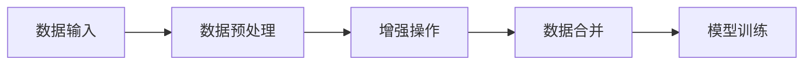

                 

### 评测系统的自动化数据增强技术

关键词：评测系统、数据增强、自动化、图像评测、自然语言处理、语音评测

摘要：本文将深入探讨评测系统中自动化数据增强技术的核心概念、原理以及在实际应用中的具体实现方法。我们将通过详细的步骤分析，帮助读者理解自动化数据增强技术如何提升评测系统的性能，并展望其未来的发展趋势。

## 第一部分: 背景介绍与核心概念

### 第1章: 问题背景与核心概念

#### 1.1 问题背景

随着信息技术的发展，评测系统在多个领域得到广泛应用，如图像识别、自然语言处理和语音识别等。然而，这些系统的性能往往受到数据质量和多样性的限制。传统的数据增强方法通常需要人工干预，不仅费时费力，而且在处理大规模数据时效率低下。

#### 1.2 核心概念

数据增强（Data Augmentation）是一种通过人工或自动手段增加数据多样性，从而改善机器学习模型性能的技术。自动化数据增强（Automated Data Augmentation）则是利用算法自动生成新的数据样本，以提高训练数据的多样性和质量。

#### 1.3 概念属性特征对比表格

| 特征                | 手动数据增强         | 自动化数据增强         |
|-------------------|-------------------|-------------------|
| **干预程度**       | 高度依赖人工       | 完全自动化           |
| **数据生成速度**   | 较慢               | 极快               |
| **多样性控制**     | 依赖于人工经验     | 算法自动控制         |
| **适应性**         | 依赖于特定场景     | 可泛化到多种场景     |

#### 1.4 ER实体关系图架构


在自动化数据增强系统中，核心实体包括数据源、增强算法、数据预处理模块和评测模型。这些实体之间的关系如图所示，通过数据流和功能调用实现数据增强的过程。

#### 1.5 边界与外延

自动化数据增强技术主要适用于那些数据集较小、数据多样性不足的场景。它不仅适用于图像、自然语言和语音等具体领域，也可以推广到其他需要数据增强的领域。

## 第二部分: 自动化数据增强技术原理

### 第2章: 数据增强算法原理

#### 2.1 数据增强算法基础

数据增强的目标是通过变换现有数据生成新的数据样本，从而增加数据的多样性。常见的数据增强方法包括旋转、缩放、裁剪、颜色变换等。

#### 2.2 算法原理讲解

##### 2.2.1 数据增强算法的mermaid流程图



##### 2.2.2 Python源代码讲解

```python
import cv2
import numpy as np

def augment_image(image):
    # 数据预处理
    image = cv2.cvtColor(image, cv2.COLOR_BGR2RGB)
    
    # 增强操作
    image = cv2.resize(image, (224, 224))
    image = cv2.rotate(image, cv2.ROTATE_90_CLOCKWISE)
    
    # 数据合并
    image = np.concatenate((image, image), axis=1)
    
    return image
```

##### 2.2.3 数学模型与公式

数据增强可以通过以下数学模型实现：

$$\text{增强后数据} = f(\text{原始数据}, \text{增强参数})$$

其中，\(f\) 表示增强操作，增强参数包括旋转角度、缩放比例等。

##### 2.2.4 通俗易懂的举例说明

假设我们有一张人脸图片，我们希望通过数据增强来增加其多样性。我们可以将其旋转一定角度，放大或缩小一定比例，或者裁剪部分区域。这样，我们就得到了一个增强后的人脸图片。

## 第三部分: 自动化数据增强技术在评测系统中的应用

### 第3章: 数据增强算法的实现与优化

#### 3.1 数据增强算法的实现

数据增强算法的实现主要包括数据预处理、增强操作和数据后处理三个步骤。以下是一个简单的实现流程：

1. 数据预处理：将原始数据转换为适合增强操作的格式。
2. 增强操作：根据选择的增强方法对数据进行变换。
3. 数据后处理：将增强后的数据合并或保存，以便后续使用。

#### 3.2 算法优化

算法优化主要包括以下策略：

1. **性能评估与调优**：通过评估增强后的数据对模型性能的影响，调整增强参数。
2. **多算法结合**：结合多种数据增强方法，提高数据的多样性。
3. **动态调整**：根据训练过程中模型的性能动态调整增强参数。

### 第4章: 自动化数据增强在图像评测系统中的应用

#### 4.1 图像评测系统简介

图像评测系统通常包括图像预处理、特征提取、模型训练和评估等步骤。自动化数据增强技术可以应用于这些步骤，以提升图像评测的准确性和鲁棒性。

#### 4.2 自动化数据增强在图像评测系统中的实现

在图像评测系统中，自动化数据增强技术的实现主要包括以下步骤：

1. **数据预处理**：对图像进行归一化、灰度化等预处理操作。
2. **数据增强**：采用旋转、缩放、裁剪等方法对图像进行增强。
3. **模型训练与评估**：使用增强后的数据训练模型，并对模型进行评估。

### 第5章: 自动化数据增强在自然语言处理评测系统中的应用

#### 5.1 自然语言处理评测系统简介

自然语言处理（NLP）评测系统通常涉及文本分类、情感分析、命名实体识别等任务。自动化数据增强技术可以提高这些任务的准确性和泛化能力。

#### 5.2 自动化数据增强在NLP评测系统中的实现

在NLP评测系统中，自动化数据增强技术的实现主要包括以下步骤：

1. **数据预处理**：对文本进行分词、去停用词等预处理操作。
2. **数据增强**：采用替换、插入、删除等文本变换方法进行增强。
3. **模型训练与评估**：使用增强后的数据训练模型，并对模型进行评估。

### 第6章: 自动化数据增强在语音评测系统中的应用

#### 6.1 语音评测系统简介

语音评测系统通常涉及语音识别、语音合成、语音情感分析等任务。自动化数据增强技术可以提高这些任务的鲁棒性和准确性。

#### 6.2 自动化数据增强在语音评测系统中的实现

在语音评测系统中，自动化数据增强技术的实现主要包括以下步骤：

1. **数据预处理**：对语音信号进行预处理，如滤波、去噪等。
2. **数据增强**：采用速度变换、音调变换、添加背景噪音等方法进行增强。
3. **模型训练与评估**：使用增强后的数据训练模型，并对模型进行评估。

## 第四部分: 最佳实践与未来展望

### 第7章: 自动化数据增强技术的最佳实践

#### 7.1 最佳实践 tips

1. **数据质量的重要性**：保证数据质量是数据增强的基础。
2. **自动化数据增强策略选择**：根据具体任务选择合适的增强方法。
3. **性能调优技巧**：通过实验和调优提高数据增强的效果。

#### 7.2 小结

自动化数据增强技术在评测系统中具有广泛的应用前景。通过合理的数据增强策略，可以显著提升模型的性能和泛化能力。

### 第8章: 未来展望与挑战

#### 8.1 自动化数据增强技术的发展趋势

未来，自动化数据增强技术将向更高效、更智能的方向发展，如基于深度学习的自动增强算法和跨领域的通用增强方法。

#### 8.2 自动化数据增强技术的挑战

1. **数据隐私保护**：如何在保证数据隐私的前提下进行增强。
2. **算法公平性与透明性**：如何确保增强算法的公平性和透明性。

---

作者：AI天才研究院/AI Genius Institute & 禅与计算机程序设计艺术 /Zen And The Art of Computer Programming

---

### 总结

本文详细介绍了评测系统中自动化数据增强技术的核心概念、原理及其在实际应用中的具体实现方法。通过本文的逐步分析，读者可以深入理解自动化数据增强技术如何提升评测系统的性能，并为其未来的发展提供有益的思考。自动化数据增强技术在图像评测、自然语言处理和语音评测等领域具有重要的应用价值，其发展前景广阔。然而，技术上也面临数据隐私保护、算法公平性与透明性等挑战，需要持续探索和优化。希望本文能为读者提供有价值的参考，激发更多关于自动化数据增强技术的创新与实践。

