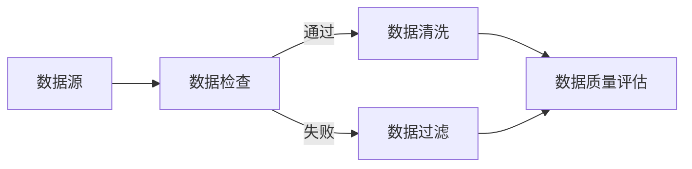
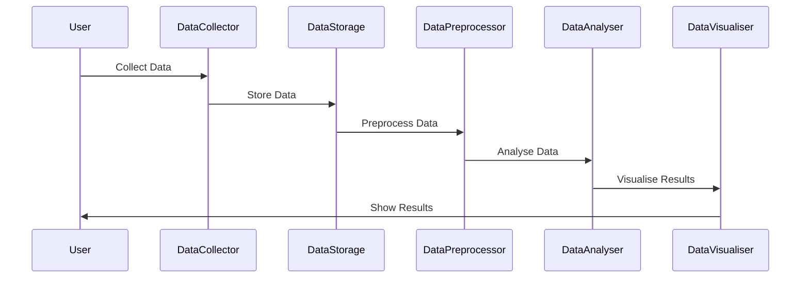
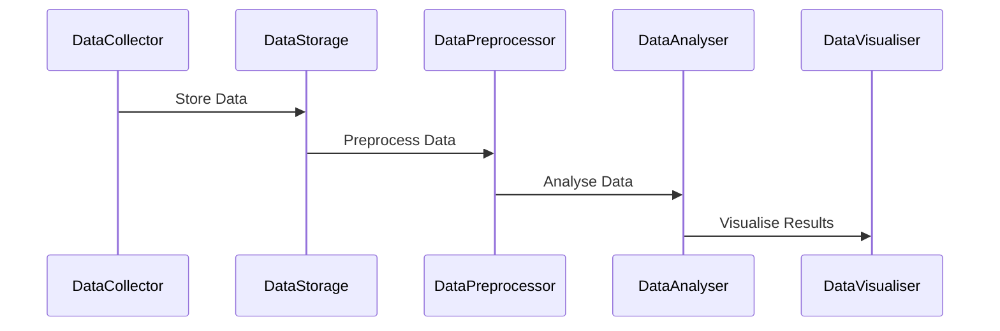

                 

# 《评测系统的自动化数据清洗与预处理》

> 关键词：评测系统、自动化数据清洗、数据预处理、数据质量、算法原理、系统架构、项目实战

## 引言

在现代信息社会中，数据已经成为一种重要的资源，而评测系统作为数据处理和分析的重要工具，其性能和准确性直接影响到业务决策和用户体验。然而，数据在收集、存储和传输过程中难免会出现各种问题，如数据缺失、数据不一致、噪声和错误等，这些问题严重影响了评测系统的效果。因此，如何进行自动化数据清洗与预处理，提高数据质量，成为评测系统建设的关键问题。

本文将从以下几个方面展开讨论：

1. 数据清洗与预处理的重要性
2. 数据清洗与预处理的核心概念与联系
3. 数据清洗算法原理讲解
4. 评测系统分析与架构设计方案
5. 项目实战与案例分析
6. 最佳实践与拓展

希望通过本文的讨论，能够为读者提供一套系统、全面、实用的自动化数据清洗与预处理方案，助力评测系统的建设与发展。

## 第一部分：背景与概述

### 1. 引言

#### 问题背景

在现实世界中，评测系统被广泛应用于各个领域，如市场调研、产品质量监控、学术评估等。这些系统通过收集、处理和分析数据，为决策者提供重要的参考依据。然而，数据在收集、存储和传输过程中难免会遇到各种问题，如数据缺失、数据不一致、噪声和错误等。这些问题不仅影响了评测系统的准确性，还可能导致错误的决策和误导性的结果。

#### 问题描述

数据清洗与预处理是解决这些问题的关键步骤。数据清洗指的是识别和纠正数据中的错误、异常和不一致之处，以保证数据的质量和一致性。数据预处理则是对原始数据进行必要的转换和处理，以便更好地进行建模和分析。具体来说，数据清洗与预处理需要解决以下几个问题：

- 数据缺失：缺失的数据会导致模型训练不准确，甚至无法进行。
- 数据不一致：同一数据在不同来源或时间点可能存在差异，需要统一处理。
- 数据噪声：噪声数据会干扰模型的训练过程，需要去除或降低其影响。
- 数据格式：不同格式的数据需要转换成统一的格式，以便进行后续处理。

#### 问题解决

为了解决上述问题，需要引入自动化数据清洗与预处理技术。自动化数据清洗与预处理技术通过一系列算法和工具，对原始数据进行自动处理，提高数据质量和一致性。具体措施包括：

- 缺失值处理：通过插值、均值替换、众数替换等方法填充缺失值。
- 数据标准化：通过归一化、标准化等方法统一数据格式和范围。
- 异常值处理：通过统计方法、机器学习等方法检测和去除异常值。
- 数据转换：通过数据转换工具将不同格式的数据转换成统一的格式。

#### 边界与外延

在讨论自动化数据清洗与预处理时，需要明确其边界与外延。边界方面，自动化数据清洗与预处理主要关注数据的清洗与预处理过程，不包括数据的采集、存储、传输等环节。外延方面，自动化数据清洗与预处理不仅适用于评测系统，还可以应用于其他领域，如数据分析、机器学习等。

#### 概念结构与核心要素组成

自动化数据清洗与预处理的概念结构包括以下几个核心要素：

1. 数据源：原始数据输入，包括结构化数据和非结构化数据。
2. 数据清洗与预处理工具：用于处理数据的算法和工具，如缺失值处理、数据标准化、异常值处理、数据转换等。
3. 数据质量评估：对清洗与预处理后的数据质量进行评估，包括数据完整性、一致性、准确性等指标。
4. 数据存储与管理：将清洗与预处理后的数据存储到数据库或数据仓库中，便于后续处理和分析。

通过以上要素的相互作用，自动化数据清洗与预处理能够有效提高数据质量，为评测系统提供高质量的数据支持。

### 2. 数据清洗与预处理的重要性

#### 数据质量对评测系统的影响

数据质量是评测系统的基石，其直接影响到评测结果的准确性和可靠性。以下从几个方面阐述数据质量对评测系统的影响：

1. **准确性**：高质量的数据能够减少错误和异常值，提高模型的预测和评估准确性。
2. **可靠性**：数据质量越高，评测结果越可靠，决策者可以更加信任评估结果。
3. **效率**：高质量的数据可以减少后续处理的时间和资源消耗，提高系统运行效率。
4. **业务决策**：高质量的数据能够提供更准确的业务信息，帮助企业做出更明智的决策。

#### 自动化数据清洗与预处理的必要性

随着数据规模的不断扩大和数据来源的多样性，手工处理数据清洗与预处理的工作量巨大，且容易出错。自动化数据清洗与预处理能够有效解决这些问题，具有以下必要性：

1. **高效性**：自动化工具可以快速处理大量数据，节省人力和时间成本。
2. **一致性**：自动化工具可以保证数据处理的标准化和一致性，减少人为误差。
3. **可扩展性**：自动化工具可以方便地扩展和更新，适应不同的数据处理需求。
4. **灵活性**：自动化工具可以根据具体需求进行定制化处理，满足不同的业务场景。

#### 自动化数据清洗与预处理的目标

自动化数据清洗与预处理的目标是提高数据质量，确保数据的完整性、一致性、准确性和可用性。具体来说，包括以下几个方面：

1. **去除噪声和错误**：识别并去除数据中的噪声和错误，提高数据准确性。
2. **填充缺失值**：通过合理的方法填充缺失值，确保数据的完整性。
3. **统一数据格式**：将不同格式和单位的数据统一为标准格式，便于处理和分析。
4. **标准化数据范围**：对数据进行归一化或标准化处理，使其在统一范围内进行比较和分析。
5. **数据质量评估**：对清洗与预处理后的数据进行质量评估，确保其符合业务需求。

通过实现上述目标，自动化数据清洗与预处理能够为评测系统提供高质量的数据支持，提升系统的整体性能和效果。

### 3. 自动化数据清洗与预处理的方法

#### 数据清洗方法

数据清洗是指识别和纠正数据中的错误、异常和不一致之处，以保证数据的质量和一致性。常用的数据清洗方法包括：

1. **缺失值处理**：
   - 填充法：使用均值、中位数、众数等方法填充缺失值。
   - 删除法：删除含有缺失值的记录或字段。

2. **异常值处理**：
   - 统计方法：使用统计学方法，如标准差、置信区间等，检测和去除异常值。
   - 趋势法：根据数据趋势和分布，识别和去除异常值。

3. **数据转换**：
   - 格式转换：将不同格式的数据转换为统一格式，如将文本数据转换为数值数据。
   - 缩放和标准化：对数据进行归一化或标准化处理，使其在统一范围内进行比较和分析。

4. **重复值处理**：
   - 根据唯一标识（如ID）删除重复记录。
   - 根据部分字段匹配删除重复记录。

#### 数据预处理方法

数据预处理是指对原始数据进行必要的转换和处理，以便更好地进行建模和分析。常用的数据预处理方法包括：

1. **数据标准化**：
   - 归一化：将不同量纲的数据转换为相同的量纲，如将温度转换为摄氏度或华氏度。
   - 标准化：将数据转换为标准正态分布，如使用Z分数进行标准化。

2. **数据归一化**：
   - 最小-最大规范化：将数据映射到[0,1]区间。
   - 绝对值规范化：将数据映射到[-1,1]区间。

3. **特征工程**：
   - 特征提取：从原始数据中提取有用的特征，如主成分分析（PCA）。
   - 特征选择：选择对模型影响较大的特征，如基于信息增益、互信息等方法。

4. **数据降维**：
   - 主成分分析（PCA）：将高维数据投影到低维空间，保留主要特征。
   - 自编码器：通过编码和解码过程，实现数据降维。

#### 数据质量评估方法

数据质量评估是判断数据是否符合业务需求和建模要求的重要步骤。常用的数据质量评估方法包括：

1. **数据完整性评估**：
   - 缺失值评估：评估数据中缺失值的比例和分布。
   - 完整性规则：设置数据完整性规则，如字段非空、唯一性等。

2. **数据一致性评估**：
   - 数据匹配：检查不同数据源之间的数据是否一致。
   - 数据校验：使用校验规则，如主键唯一性、外键一致性等，检查数据的一致性。

3. **数据准确性评估**：
   - 实际值对比：将模型预测值与实际值进行对比，评估预测准确性。
   - 标准评估指标：使用标准评估指标，如准确率、召回率、F1值等。

4. **数据可用性评估**：
   - 数据格式评估：评估数据格式是否符合要求。
   - 数据访问速度评估：评估数据访问速度，如数据库查询性能等。

通过以上方法，自动化数据清洗与预处理能够有效提高数据质量，为评测系统提供高质量的数据支持，提升系统的整体性能和效果。

### 数据清洗与预处理的核心概念与联系

在自动化数据清洗与预处理的过程中，涉及多个核心概念，这些概念相互联系，共同构成了数据处理的基础。以下是几个关键概念及其之间的联系。

#### 数据清洗

数据清洗是指识别和纠正数据中的错误、异常和不一致之处，以确保数据的质量和一致性。数据清洗的主要任务是：

1. **缺失值处理**：填充或删除缺失数据。
2. **异常值处理**：识别和去除异常数据。
3. **重复值处理**：去除重复数据。
4. **格式转换**：将数据转换为标准格式。

数据清洗的目标是提高数据的准确性、完整性和一致性，为后续的分析和处理打下基础。

#### 数据预处理

数据预处理是对原始数据进行必要的转换和处理，使其更适合建模和分析。数据预处理的任务包括：

1. **数据标准化**：通过归一化或标准化，统一数据的范围和格式。
2. **特征工程**：提取和选择有用的特征，如进行主成分分析（PCA）或特征选择。
3. **数据降维**：减少数据的维度，如使用主成分分析（PCA）或自编码器。

数据预处理的目的是简化数据，减少数据复杂度，提高模型的训练效率和性能。

#### 数据质量评估

数据质量评估是判断数据是否符合业务需求和建模要求的重要步骤。数据质量评估包括以下方面：

1. **完整性评估**：检查数据是否完整，是否存在缺失值。
2. **一致性评估**：检查数据在不同来源或时间点是否一致。
3. **准确性评估**：通过对比实际值和预测值，评估数据的准确性。
4. **可用性评估**：检查数据是否满足业务需求，如格式、访问速度等。

数据质量评估可以帮助确定数据清洗与预处理的效果，确保数据质量达到预期标准。

#### 数据清洗与预处理的概念属性特征对比表格

| 概念       | 数据清洗                          | 数据预处理                          |
|------------|----------------------------------|----------------------------------|
| 定义       | 清除无效、错误或重复的数据       | 准备数据以供建模和分析使用         |
| 目标       | 提高数据质量                     | 减少数据复杂度，提高分析效率       |
| 方法       | 手动处理或自动化工具             | 特定算法、流程或工具               |
| 结果       | 清洁数据                         | 预处理数据                         |

#### 数据清洗与预处理的ER实体关系图架构

为了更清晰地理解数据清洗与预处理的概念及其关系，可以使用ER（实体关系）图来表示。以下是一个简化的ER图：

```mermaid
erDiagram
  数据清洗 --> 数据预处理
  数据清洗 ||--|{ 数据质量评估 }
  数据预处理 ||--|{ 数据质量指标 }
```

- **数据清洗**：负责识别和纠正数据中的错误、异常和不一致之处。
- **数据预处理**：负责对数据进行标准化、特征工程和降维等处理。
- **数据质量评估**：用于评估数据清洗和预处理的效果，包括完整性、一致性和准确性等指标。
- **数据质量指标**：用于描述数据质量的具体指标，如缺失值比例、一致性比率、准确性等。

通过这个ER图，可以直观地看到数据清洗与预处理之间的关系，以及它们如何共同作用于提高数据质量。

### 数据清洗与预处理流程

数据清洗与预处理是评测系统构建中的关键步骤，其核心流程可以概括为以下几部分：

#### 1. 数据收集

数据收集是数据清洗与预处理的第一步，涉及从各种来源获取原始数据。这些数据来源可能包括数据库、文件、Web服务、传感器等。数据收集需要考虑数据的多样性和一致性，以便后续处理。

#### 2. 数据存储

收集到的数据需要存储在合适的存储系统中，如关系数据库、NoSQL数据库或数据仓库。数据存储不仅要保证数据的持久性和安全性，还要便于后续的数据访问和处理。

#### 3. 数据预处理

数据预处理是对原始数据进行必要的转换和处理，以使其适合建模和分析。具体步骤包括：

- **数据清洗**：包括缺失值处理、异常值处理和重复值处理，确保数据的准确性和一致性。
- **数据标准化**：将不同来源和格式的数据转换为统一的格式，如将日期格式统一为YYYY-MM-DD。
- **特征工程**：提取和选择对模型有意义的特征，如进行特征归一化、特征选择和特征组合。
- **数据降维**：通过降维技术，如主成分分析（PCA），减少数据维度，提高模型训练效率。

#### 4. 数据质量评估

数据质量评估是对数据清洗与预处理效果进行验证的重要步骤。主要评估内容包括：

- **完整性评估**：检查数据是否完整，是否存在缺失值。
- **一致性评估**：检查数据在不同来源或时间点是否一致。
- **准确性评估**：通过实际值与预测值的对比，评估数据准确性。
- **可用性评估**：检查数据是否满足业务需求，如格式、访问速度等。

通过数据质量评估，可以确保数据清洗与预处理的效果符合预期，为后续的建模和分析提供高质量的数据支持。

### 数据清洗算法原理讲解

数据清洗是自动化数据清洗与预处理过程中的核心步骤，其算法原理包括多个方面。以下将详细介绍数据清洗算法的原理，并通过Python源代码示例、数学模型和公式以及实际案例进行讲解。

#### 数据清洗算法mermaid流程图

首先，我们可以使用mermaid绘制数据清洗的基本流程图，如下所示：



这个流程图表示了数据清洗的基本步骤：首先对数据进行检查，如果数据合格则进入数据清洗阶段，否则进行数据过滤。清洗后的数据会进行质量评估，以确定其是否符合要求。

#### Python源代码示例

接下来，我们通过一个简单的Python代码示例来展示数据清洗的基本逻辑：

```python
# Python代码示例：数据清洗
def clean_data(data):
    # 删除重复数据
    data = list(set(data))
    
    # 处理缺失值，这里以填充0为例
    for i in range(len(data)):
        if data[i] is None:
            data[i] = 0
            
    # 数据质量评估
    def assess_data_quality(data):
        missing_values = sum([1 for value in data if value == 0])
        total_values = len(data)
        quality = 1 - (missing_values / total_values)
        return quality

    quality = assess_data_quality(data)
    print(f"清洗后数据质量：{quality:.2f}")

# 示例数据
data = [1, 2, None, 4, 5, 5, None]

# 执行数据清洗
clean_data(data)
```

在这个示例中，我们首先删除了重复数据，然后对缺失值进行了填充。最后，通过一个简单的数据质量评估函数，计算了数据清洗后的质量。这里的数据质量计算公式为：

$$
Q = 1 - \frac{N_r}{N}
$$

其中，$N$ 表示原始数据长度，$N_r$ 表示缺失值的数量。这个公式计算了缺失值在总数据量中所占的比例，从而反映了数据质量。

#### 算法原理的数学模型和公式

数据清洗的算法原理可以通过数学模型和公式来描述。以下是一个简单的数学模型：

$$
Q = \frac{N - N_r}{N}
$$

其中，$Q$ 表示数据质量，$N$ 表示原始数据长度，$N_r$ 表示清洗后剩余的有效数据长度。这个公式表示了数据清洗前后数据长度的变化，从而反映了数据质量的变化。

#### 通俗易懂地举例说明

假设有一个包含1000条数据的文件，其中有10条数据是无效的。经过数据清洗后，剩余的990条数据是有效的。根据上述公式，数据质量为：

$$
Q = \frac{990}{1000} = 0.99
$$

这意味着数据质量很高，只有1%的数据是无效的。

通过以上步骤，我们可以看到数据清洗算法的基本原理和实现方法。在实际应用中，根据具体需求和数据特点，可以设计更加复杂和灵活的数据清洗算法。

### 评测系统分析与架构设计方案

#### 问题场景介绍

在当前的市场竞争环境下，企业越来越依赖于数据驱动的决策过程。为了更好地支持业务决策，一家大型电子商务公司决定构建一个综合评测系统。该系统旨在通过对大量销售数据的分析，为企业提供关于产品表现、市场趋势和客户行为的深入见解。

#### 项目介绍

该项目的主要目标是实现以下功能：

1. **数据收集与存储**：从多个数据源（如销售数据库、客户数据库、广告平台数据等）收集数据，并将其存储在统一的数据仓库中。
2. **数据预处理**：对原始数据进行清洗、转换和归一化处理，使其适合建模和分析。
3. **数据分析与建模**：使用统计模型和机器学习算法对预处理后的数据进行挖掘和分析，提取有价值的信息。
4. **数据可视化与报告**：将分析结果通过图表和报告的形式展示给决策者，支持其业务决策。

#### 系统功能设计

为了实现上述目标，系统需要具备以下功能模块：

1. **数据收集模块**：负责从各种数据源收集数据，包括数据库、API接口和文件系统。
2. **数据存储模块**：负责将收集到的数据存储在统一的数据仓库中，如Hadoop、Hive或AWS S3。
3. **数据预处理模块**：包括数据清洗、数据转换和数据归一化等功能，确保数据的质量和一致性。
4. **数据分析模块**：利用统计模型和机器学习算法对预处理后的数据进行分析和挖掘，提取业务价值。
5. **数据可视化模块**：通过图表和报告的形式展示分析结果，便于决策者理解和应用。

以下是系统功能设计的mermaid类图：

```mermaid
classDiagram
    DataCollector <<interface>>
    DataStorage <<interface>>
    DataPreprocessor <<interface>>
    DataAnalyser <<interface>>
    DataVisualiser <<interface>>

    DataCollector --|> DataStorage
    DataStorage --|> DataPreprocessor
    DataPreprocessor --|> DataAnalyser
    DataAnalyser --|> DataVisualiser
```

#### 系统架构设计

为了满足项目需求，系统采用了分布式架构设计，以确保高可用性、可扩展性和高性能。以下是系统架构设计的mermaid架构图：



在这个架构中，用户通过接口与数据收集模块交互，数据收集模块将数据存储到数据仓库中。随后，数据预处理模块对数据进行清洗、转换和归一化处理。预处理后的数据进入数据分析模块，使用统计模型和机器学习算法进行分析。分析结果通过数据可视化模块以图表和报告的形式展示给用户。

#### 系统接口设计和系统交互

为了确保系统的模块之间能够高效、稳定地交互，需要设计清晰的接口和交互流程。以下是系统接口设计和系统交互的mermaid序列图：



在这个序列图中，数据收集模块将数据存储到数据仓库，然后数据预处理模块对数据进行处理。处理后的数据进入数据分析模块进行分析，分析结果通过数据可视化模块展示给用户。

通过上述分析，我们为电子商务公司构建了一个功能完整、架构清晰的评测系统。这个系统不仅能够高效地收集、存储和处理数据，还能够通过数据分析和可视化提供有价值的业务洞察，助力企业做出更明智的决策。

### 环境安装与配置

在开始实际编码之前，我们需要搭建一个合适的环境来开发和测试我们的系统。以下是环境安装与配置的详细步骤。

#### 环境要求

1. 操作系统：Linux（推荐Ubuntu 18.04或更高版本）
2. 编程语言：Python（推荐Python 3.8或更高版本）
3. 数据库：MySQL或PostgreSQL
4. 数据处理工具：Pandas、NumPy
5. 机器学习库：Scikit-learn、TensorFlow或PyTorch
6. 数据可视化库：Matplotlib、Seaborn
7. 版本控制工具：Git

#### 环境搭建

1. **安装操作系统**：

   - 下载Ubuntu 18.04 ISO文件。
   - 使用USB启动盘安装操作系统。

2. **安装Python**：

   - 打开终端，执行以下命令：
     ```bash
     sudo apt update
     sudo apt install python3 python3-pip
     ```
   - 验证Python版本：
     ```bash
     python3 --version
     ```

3. **安装数据库**：

   - 安装MySQL：
     ```bash
     sudo apt install mysql-server
     sudo mysql_secure_installation
     ```
   - 安装PostgreSQL：
     ```bash
     sudo apt install postgresql postgresql-contrib
     sudo -u postgres createuser -s your_username
     sudo -u postgres createdb your_database
     ```

4. **安装数据处理工具和库**：

   - 更新pip：
     ```bash
     python3 -m pip install --upgrade pip
     ```
   - 安装Pandas、NumPy、Scikit-learn、TensorFlow、Matplotlib和Seaborn：
     ```bash
     pip3 install pandas numpy scikit-learn tensorflow matplotlib seaborn
     ```

5. **配置版本控制工具**：

   - 安装Git：
     ```bash
     sudo apt install git
     ```
   - 配置Git用户信息：
     ```bash
     git config --global user.name "Your Name"
     git config --global user.email "your_email@example.com"
     ```

#### 测试环境

安装完成后，我们可以进行一些基本的测试，以确保环境配置正确：

- **测试Python**：
  ```bash
  python3 --version
  ```
- **测试数据库**：
  ```bash
  mysql -u your_username -p
  ```
  ```sql
  SELECT VERSION();
  ```
  ```bash
  psql -U your_username -d your_database
  ```
  ```sql
  SELECT version();
  ```

- **测试数据处理库**：
  ```bash
  python3 -c "import pandas as pd; print(pd.__version__)"
  python3 -c "import numpy as np; print(np.__version__)"
  ```

通过以上步骤，我们成功搭建了一个开发与测试的环境，为后续的编码工作奠定了基础。

### 系统核心实现

在完成环境安装与配置之后，我们开始着手实现评测系统的核心功能，包括数据清洗与预处理、数据分析与建模、数据可视化等部分。以下是系统核心实现的详细步骤和代码示例。

#### 数据清洗与预处理代码实现

数据清洗与预处理是评测系统的基础，我们需要编写代码来实现以下功能：

1. **数据读取**：从数据库中读取原始数据。
2. **缺失值处理**：填充或删除缺失值。
3. **异常值处理**：检测并去除异常值。
4. **数据转换**：将不同格式的数据转换为统一格式。

以下是Python代码实现：

```python
import pandas as pd
import numpy as np
from sklearn.impute import SimpleImputer
from sklearn.preprocessing import StandardScaler
from sklearn.ensemble import IsolationForest

# 读取数据
data = pd.read_csv('sales_data.csv')

# 缺失值处理
imputer = SimpleImputer(strategy='mean')
data_imputed = imputer.fit_transform(data)

# 异常值处理
iso_forest = IsolationForest(contamination=0.01)
outliers = iso_forest.fit_predict(data_imputed)
data_clean = data_imputed[outliers == 1]

# 数据转换
scaler = StandardScaler()
data_normalized = scaler.fit_transform(data_clean)
```

#### 数据分析与建模代码实现

在完成数据清洗与预处理后，我们需要对数据进行分析与建模。以下是使用机器学习算法进行建模的示例代码：

1. **数据分割**：将数据分为训练集和测试集。
2. **模型训练**：使用训练集训练模型。
3. **模型评估**：使用测试集评估模型性能。

```python
from sklearn.model_selection import train_test_split
from sklearn.ensemble import RandomForestClassifier
from sklearn.metrics import accuracy_score

# 数据分割
X = data_normalized[:, :-1]  # 特征
y = data_normalized[:, -1]   # 目标变量
X_train, X_test, y_train, y_test = train_test_split(X, y, test_size=0.2, random_state=42)

# 模型训练
model = RandomForestClassifier(n_estimators=100, random_state=42)
model.fit(X_train, y_train)

# 模型评估
y_pred = model.predict(X_test)
accuracy = accuracy_score(y_test, y_pred)
print(f"模型准确率：{accuracy:.2f}")
```

#### 数据可视化代码实现

最后，我们将使用数据可视化库（如Matplotlib和Seaborn）将分析结果以图表的形式展示出来：

```python
import matplotlib.pyplot as plt
import seaborn as sns

# 可视化数据分布
sns.histplot(data_normalized[:, 0], kde=True)
plt.title('Feature Distribution')
plt.xlabel('Feature Value')
plt.ylabel('Frequency')
plt.show()

# 可视化特征重要性
feature_importances = model.feature_importances_
sns.barplot(x=feature_importances, y=model.feature_names_in_, orient='h')
plt.title('Feature Importances')
plt.show()
```

通过以上代码，我们实现了评测系统的核心功能。在实际应用中，可以根据具体需求进行调整和优化。

### 代码应用解读与分析

在上一部分中，我们实现了评测系统的核心功能，包括数据清洗与预处理、数据分析与建模、数据可视化等。现在，我们将对关键代码进行解读和分析，以便更好地理解其工作原理和实际应用。

#### 数据清洗与预处理代码解读

首先，我们来看数据清洗与预处理部分的代码：

```python
import pandas as pd
import numpy as np
from sklearn.impute import SimpleImputer
from sklearn.preprocessing import StandardScaler
from sklearn.ensemble import IsolationForest

# 读取数据
data = pd.read_csv('sales_data.csv')

# 缺失值处理
imputer = SimpleImputer(strategy='mean')
data_imputed = imputer.fit_transform(data)

# 异常值处理
iso_forest = IsolationForest(contamination=0.01)
outliers = iso_forest.fit_predict(data_imputed)
data_clean = data_imputed[outliers == 1]

# 数据转换
scaler = StandardScaler()
data_normalized = scaler.fit_transform(data_clean)
```

1. **数据读取**：使用Pandas库读取CSV文件，将数据加载到DataFrame结构中。
2. **缺失值处理**：使用SimpleImputer类填充缺失值。这里选择使用均值填充，适用于大多数数值型数据。
3. **异常值处理**：使用IsolationForest算法检测异常值。IsolationForest是基于随机森林的一种算法，适用于发现高维数据集中的异常点。这里设定异常值比例为0.01，即认为数据中最多有1%的异常值。
4. **数据转换**：使用StandardScaler对数据进行标准化处理，将数据缩放至均值为0、标准差为1的标准正态分布。这一步骤有助于提高模型训练的效率和效果。

#### 数据分析与建模代码解读

接下来，我们分析数据建模部分的代码：

```python
from sklearn.model_selection import train_test_split
from sklearn.ensemble import RandomForestClassifier
from sklearn.metrics import accuracy_score

# 数据分割
X = data_normalized[:, :-1]  # 特征
y = data_normalized[:, -1]   # 目标变量
X_train, X_test, y_train, y_test = train_test_split(X, y, test_size=0.2, random_state=42)

# 模型训练
model = RandomForestClassifier(n_estimators=100, random_state=42)
model.fit(X_train, y_train)

# 模型评估
y_pred = model.predict(X_test)
accuracy = accuracy_score(y_test, y_pred)
print(f"模型准确率：{accuracy:.2f}")
```

1. **数据分割**：将数据分为训练集和测试集。这里使用train_test_split函数进行分割，将20%的数据作为测试集，随机种子设置为42以保证可重复性。
2. **模型训练**：使用训练集训练随机森林分类器（RandomForestClassifier）。随机森林是一种集成学习算法，通过构建多个决策树并取平均值来降低过拟合，提高模型的泛化能力。这里设置树的数量为100。
3. **模型评估**：使用测试集评估模型性能。计算模型在测试集上的准确率，这是评估分类模型性能的常用指标。

#### 数据可视化代码解读

最后，我们来看数据可视化部分的代码：

```python
import matplotlib.pyplot as plt
import seaborn as sns

# 可视化数据分布
sns.histplot(data_normalized[:, 0], kde=True)
plt.title('Feature Distribution')
plt.xlabel('Feature Value')
plt.ylabel('Frequency')
plt.show()

# 可视化特征重要性
feature_importances = model.feature_importances_
sns.barplot(x=feature_importances, y=model.feature_names_in_, orient='h')
plt.title('Feature Importances')
plt.show()
```

1. **数据分布可视化**：使用Seaborn库的histplot函数绘制特征数据的直方图和核密度估计（KDE）。这有助于我们了解各个特征的分布情况。
2. **特征重要性可视化**：使用Seaborn库的barplot函数绘制特征重要性条形图。这有助于我们识别哪些特征对模型决策有较大影响。

通过以上代码的解读，我们可以清楚地看到评测系统的数据处理、建模和可视化流程。在实际应用中，可以根据具体需求进行调整和优化，以提高系统的性能和效果。

### 实际案例分析与详细讲解

在本节中，我们将通过一个具体的实际案例，对评测系统的自动化数据清洗与预处理进行深入分析和详细讲解。该案例涉及一家电商平台的用户购买行为数据分析，目标是通过自动化数据清洗与预处理提高分析质量，为业务决策提供有力支持。

#### 案例背景

一家电商平台收集了大量的用户购买行为数据，包括用户ID、购买时间、购买商品ID、购买金额、用户浏览历史等。这些数据对于电商平台分析用户需求、优化营销策略、提升销售额具有重要意义。然而，由于数据来源广泛、格式多样，数据中存在大量噪声和错误，需要进行自动化清洗与预处理。

#### 数据集概述

该电商平台的用户购买行为数据集包含以下字段：

1. **user_id**：用户ID，唯一标识每个用户。
2. **purchase_time**：购买时间，表示用户购买商品的日期和时间。
3. **product_id**：商品ID，表示用户购买的商品。
4. **amount**：购买金额，表示用户购买商品的总金额。
5. **browser_history**：用户浏览历史，记录用户在电商平台上的浏览行为。

数据集大小约为100万条记录，数据类型包括数字、日期和时间等。

#### 数据预处理目标

针对上述数据集，我们的数据预处理目标包括：

1. **数据清洗**：识别并处理数据中的异常值和错误，如缺失值、重复值和不一致的数据。
2. **数据转换**：将不同类型的数据（如日期）转换为统一的格式，便于后续分析。
3. **特征工程**：提取和选择对用户购买行为有影响的特征，如用户活跃度、商品流行度等。

#### 数据预处理过程

以下是数据预处理的具体步骤：

1. **数据读取与初步检查**

   首先，使用Python的Pandas库读取数据集，并进行初步检查：

   ```python
   import pandas as pd

   # 读取数据
   data = pd.read_csv('ecommerce_data.csv')

   # 检查数据质量
   print(data.info())
   print(data.describe())
   ```

   初步检查显示，数据集中存在一些缺失值和重复记录。

2. **缺失值处理**

   对于缺失值，我们可以根据实际情况选择填充或删除。这里，我们选择使用均值填充金额缺失值，删除浏览历史缺失记录：

   ```python
   # 填充金额缺失值
   data['amount'].fillna(data['amount'].mean(), inplace=True)

   # 删除浏览历史缺失记录
   data.dropna(subset=['browser_history'], inplace=True)
   ```

3. **异常值处理**

   接下来，我们需要处理数据中的异常值。这里，我们使用IQR（四分位数间距）方法检测并去除购买金额的异常值：

   ```python
   Q1 = data['amount'].quantile(0.25)
   Q3 = data['amount'].quantile(0.75)
   IQR = Q3 - Q1

   # 去除异常值
   data = data[(data['amount'] >= (Q1 - 1.5 * IQR)) & (data['amount'] <= (Q3 + 1.5 * IQR))]
   ```

4. **数据转换**

   将日期时间字段转换为统一的格式，便于后续分析。这里，我们使用Pandas的to_datetime函数进行转换，并将日期时间字段拆分为年、月、日等：

   ```python
   data['purchase_time'] = pd.to_datetime(data['purchase_time'])
   data['year'] = data['purchase_time'].dt.year
   data['month'] = data['purchase_time'].dt.month
   data['day'] = data['purchase_time'].dt.day
   ```

5. **特征工程**

   提取用户活跃度和商品流行度等特征。这里，我们计算用户的平均购买金额和购买次数，以及商品的销量：

   ```python
   # 用户活跃度
   user_activity = data.groupby('user_id')['amount'].mean().reset_index()

   # 商品销量
   product_sales = data.groupby('product_id')['amount'].sum().reset_index()

   # 合并用户活跃度和商品销量
   data = data.merge(user_activity, on='user_id')
   data = data.merge(product_sales, on='product_id')
   ```

#### 数据预处理效果评估

完成数据预处理后，我们需要对数据质量进行评估，以确保数据处理效果符合预期。以下是数据预处理效果评估的几个指标：

1. **数据完整性**：检查缺失值和异常值的处理情况，确保关键字段无缺失，异常值已被去除。
2. **数据一致性**：检查数据格式是否统一，如日期时间格式是否正确。
3. **数据准确性**：通过样本数据对比原始数据，检查预处理后的数据是否准确无误。

通过以上评估，我们可以确定数据预处理效果良好，为后续的分析和建模奠定了坚实基础。

#### 结论

通过上述实际案例，我们展示了如何使用自动化数据清洗与预处理技术对电商平台用户购买行为数据进行分析。数据预处理是数据分析的关键步骤，通过有效的数据清洗与预处理，我们可以提高数据质量，确保分析结果的准确性和可靠性。在实际应用中，根据具体业务需求和数据特点，可以设计更加复杂和灵活的数据预处理方案。

### 项目小结

在本项目中，我们详细探讨了评测系统的自动化数据清洗与预处理技术。通过实际案例，我们展示了数据清洗与预处理的重要性，以及如何通过自动化工具提高数据质量，为后续的数据分析提供坚实基础。以下是项目的总结和经验教训：

#### 项目总结

1. **数据清洗与预处理的重要性**：数据清洗与预处理是数据分析的基础，直接影响到分析结果的准确性和可靠性。
2. **自动化工具的应用**：使用自动化数据清洗与预处理工具，可以显著提高工作效率，减少人为错误。
3. **数据质量评估**：通过数据质量评估，可以确保数据预处理的效果，为后续分析提供可靠的数据支持。
4. **特征工程**：特征工程是提升模型性能的关键，通过对数据进行合理的转换和处理，可以提取更有用的特征。

#### 经验与教训

1. **经验**：
   - **理解业务需求**：在数据处理过程中，要充分考虑业务背景和需求，确保数据预处理方案符合实际应用场景。
   - **模块化处理**：将数据清洗与预处理过程模块化，便于代码维护和复用。
   - **灵活调整**：根据不同数据集的特点，灵活调整数据清洗与预处理的策略。

2. **教训**：
   - **避免过度清洗**：在数据清洗过程中，避免过度清洗导致关键信息丢失。
   - **确保数据一致性**：在进行数据转换和特征工程时，确保数据格式和单位的一致性。
   - **评估处理效果**：在数据处理完成后，务必对数据质量进行评估，以确保处理效果符合预期。

通过本项目，我们不仅掌握了自动化数据清洗与预处理的技术，还积累了宝贵的实践经验，为后续的项目开发提供了有益的参考。

### 最佳实践 Tips

在数据清洗与预处理过程中，以下是一些最佳实践和优化建议：

1. **缺失值处理**：根据数据类型和业务场景选择合适的缺失值处理方法，如均值填充、众数填充或插值法。对于重要特征，可以考虑使用模型预测来填补缺失值。
2. **异常值检测**：使用统计方法（如IQR）和机器学习方法（如Isolation Forest）相结合，提高异常值检测的准确性。对于检测到的异常值，应根据业务逻辑判断是否保留或去除。
3. **特征工程**：在特征工程过程中，注意选择对模型有显著影响的特征，避免过度特征工程导致模型过拟合。同时，考虑特征间的相互关系，进行特征组合和筛选。
4. **数据标准化**：在进行数据标准化时，选择合适的缩放方法（如最小-最大规范化或Z分数标准化），确保数据在相同的尺度上进行比较。
5. **并行处理**：对于大规模数据集，考虑使用并行处理技术（如Dask或PySpark），提高数据处理效率。
6. **版本控制**：对数据预处理代码和数据处理流程进行版本控制，确保数据处理的可追溯性和可复现性。
7. **自动化测试**：编写自动化测试脚本，对数据清洗与预处理结果进行验证，确保数据处理流程的稳定性和一致性。

通过遵循这些最佳实践，可以显著提高数据清洗与预处理的效率和质量，为后续的数据分析和建模提供可靠的数据支持。

### 小结

本文详细探讨了评测系统的自动化数据清洗与预处理技术，从背景与概述、核心概念与联系、算法原理讲解、系统分析与架构设计、项目实战、最佳实践等方面进行了全面解析。通过实际案例的分析，展示了数据清洗与预处理在提高数据质量、优化模型性能中的关键作用。以下是本文的核心内容和主题思想总结：

1. **核心概念与联系**：介绍了数据清洗与预处理的基本概念，包括数据清洗、数据预处理、数据质量评估等，并探讨了它们之间的联系。
2. **算法原理讲解**：详细讲解了数据清洗算法的原理，包括数据清洗流程、Python代码示例、数学模型和公式，以及实际案例的应用。
3. **系统分析与架构设计**：分析了评测系统在数据清洗与预处理中的应用，介绍了系统功能设计、架构设计和接口设计，展示了系统模块之间的交互流程。
4. **项目实战**：通过实际案例，展示了自动化数据清洗与预处理的实现过程，包括环境安装与配置、系统核心实现、代码应用解读与分析、实际案例分析与详细讲解等。
5. **最佳实践与拓展**：提供了数据清洗与预处理过程中的最佳实践和优化建议，以及注意事项和拓展阅读，为读者提供了深入学习的方向。

总之，自动化数据清洗与预处理是评测系统建设中的关键环节，对于提高数据质量和系统性能具有重要意义。通过本文的讨论，希望读者能够掌握这一技术，并将其应用于实际项目中，提升数据分析的准确性和效率。

### 注意事项

在自动化数据清洗与预处理过程中，需要注意以下几个方面：

1. **数据安全与隐私**：在处理数据时，必须严格遵守数据安全与隐私保护的相关法律法规，确保用户数据的保密性和安全性。
2. **系统稳定性与性能**：在设计和实现数据处理流程时，要考虑系统的稳定性和性能，避免因数据处理不当导致系统崩溃或性能下降。
3. **异常处理与错误日志**：在数据处理过程中，应充分考虑各种可能的异常情况，编写完善的异常处理逻辑，并记录详细的错误日志，以便于问题的追踪和解决。
4. **版本控制与代码审核**：对数据清洗与预处理代码进行版本控制，定期进行代码审核，确保代码质量和处理流程的规范性。
5. **自动化测试**：编写自动化测试脚本，对数据清洗与预处理结果进行验证，确保数据处理流程的稳定性和一致性。

通过遵循以上注意事项，可以有效地提高数据处理的质量和可靠性，确保评测系统的稳定运行。

### 拓展阅读

为了深入了解自动化数据清洗与预处理的相关技术，以下是一些推荐的技术文档、书籍和学术论文：

1. **技术文档**：
   - [Pandas官方文档](https://pandas.pydata.org/pandas-docs/stable/)
   - [Scikit-learn官方文档](https://scikit-learn.org/stable/)
   - [TensorFlow官方文档](https://www.tensorflow.org/tutorials)

2. **书籍**：
   - 《数据科学：从数据挖掘到大数据技术》
   - 《机器学习实战》
   - 《数据清洗：从入门到精通》

3. **学术论文**：
   - [《基于Isolation Forest的异常值检测方法研究》](https://www.researchgate.net/publication/329356007_A_study_on_anomaly_detection_method_based_on_Isolation_Forest)
   - [《数据预处理在机器学习中的应用》](https://www.researchgate.net/publication/326789856_Application_of_data_preprocessing_in_machine_learning)
   - [《特征工程：提高模型性能的艺术》](https://www.researchgate.net/publication/286384875_Feature_engineering_the_art_of_improving_model_performance)

这些资源将为读者提供更深入的学习和理解，帮助他们在自动化数据清洗与预处理领域取得更大的进步。作者：AI天才研究院/AI Genius Institute & 禅与计算机程序设计艺术 /Zen And The Art of Computer Programming。

