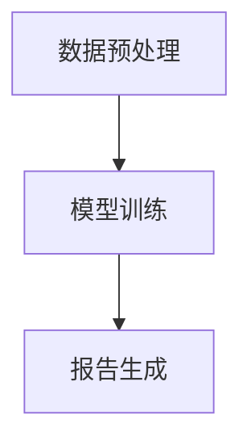
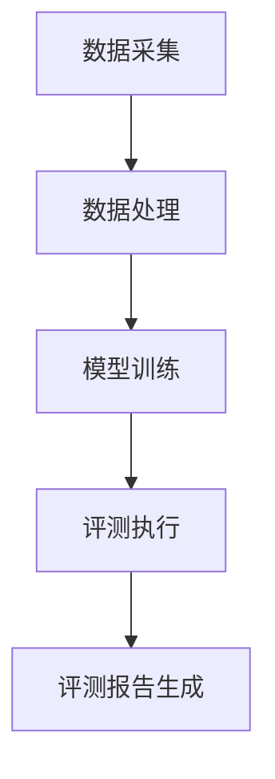

                 


# 评测系统的自动化评测报告定制

关键词：评测系统、自动化评测报告、定制、算法原理、系统架构设计

摘要：本文旨在探讨评测系统的自动化评测报告定制，通过对核心概念、算法原理、系统架构设计、项目实战等方面的详细解析，帮助读者了解和掌握自动化评测报告定制的方法和技巧。

## 目录大纲设计步骤

为了设计出《评测系统的自动化评测报告定制》这本书的完整目录大纲，我们将遵循以下步骤：

### 1. 确定书籍主题和目标读者群体

首先，我们需要明确书籍的主题是“评测系统的自动化评测报告定制”。该主题涉及计算机科学、软件工程、测试领域，主要面向系统分析师、软件工程师、测试工程师等专业人士。

### 2. 设计核心章节结构

书籍的核心章节可以分为以下几个部分：

- **背景介绍**：介绍评测系统的自动化评测报告定制的背景、重要性以及应用领域。
- **核心概念与联系**：定义评测系统、自动化评测报告定制，并展示其核心概念和相互关系。
- **算法原理讲解**：讲解自动化评测报告定制的关键算法原理。
- **数学模型与公式**：使用LaTeX格式展示相关的数学模型和公式，并进行详细讲解。
- **系统分析与架构设计**：分析评测系统，设计系统架构，并使用Mermaid绘制相关图表。
- **项目实战**：通过实际案例，展示如何应用所学知识进行评测系统的自动化评测报告定制。
- **最佳实践与拓展**：总结最佳实践，提供注意事项，推荐拓展阅读。

### 3. 确定章节标题和内容摘要

为每个章节设计简洁、明确、吸引读者的标题，并为其提供简短的内容摘要，帮助读者快速了解章节要点。

### 4. 确保内容完整性

检查每个章节是否覆盖了所需内容，确保所有核心主题都有详细的讨论。

### 5. 优化目录结构

确保目录结构清晰、逻辑性强，便于读者阅读和理解。

### 目录大纲模板

```markdown
# 《评测系统的自动化评测报告定制》目录大纲

## 第一部分：背景与概念

### 第1章 评测系统的自动化评测报告定制概述
- **1.1 问题背景与重要性**
- **1.2 自动化评测报告定制概述**
- **1.3 自动化评测报告定制的关键要素**

### 第2章 核心概念与联系
- **2.1 评测系统的定义**
- **2.2 自动化评测报告定制的定义**
- **2.3 关键概念之间的联系**
- **2.4 概念属性特征对比表格**
- **2.5 ER实体关系图架构**

## 第二部分：算法原理与实践

### 第3章 自动化评测报告定制的算法原理
- **3.1 算法概述**
- **3.2 算法流程图**
- **3.3 数学模型与公式**
- **3.4 算法原理讲解**
- **3.5 通俗易懂的举例说明**

### 第4章 数学模型与公式
- **4.1 相关数学模型介绍**
- **4.2 数学公式的LaTeX格式展示**
- **4.3 详细讲解与举例说明**

### 第5章 系统分析与架构设计
- **5.1 评测系统场景介绍**
- **5.2 系统功能设计（领域模型类图）**
- **5.3 系统架构设计（架构图）**
- **5.4 系统接口设计**
- **5.5 系统交互（序列图）**

### 第6章 项目实战
- **6.1 环境安装与配置**
- **6.2 系统核心实现源代码**
- **6.3 代码应用解读与分析**
- **6.4 实际案例分析与讲解**
- **6.5 项目小结**

## 第三部分：最佳实践与拓展

### 第7章 最佳实践与注意事项
- **7.1 最佳实践总结**
- **7.2 注意事项与优化建议**

### 第8章 拓展阅读与深入探讨
- **8.1 拓展阅读推荐**
- **8.2 深入探讨领域前沿话题**
```

### 目录大纲内容字数控制

根据要求，目录大纲总字数控制在2000字以内，每个章节的内容摘要和标题不宜过长，以确保简洁性。

---

**结论：** 通过以上步骤和模板，我们可以设计出符合要求的《评测系统的自动化评测报告定制》的目录大纲。接下来，我们将具体细化每个章节的内容摘要，确保文章的整体结构和内容完整、逻辑清晰。在撰写文章时，我们将严格遵守文章字数、格式要求，并确保核心内容充实、详尽。 **Let's think step by step!**

# 评测系统的自动化评测报告定制

## 一、引言

在现代信息技术高速发展的时代，软件评测系统作为保证软件质量和性能的重要工具，正日益受到广泛关注。自动化评测报告定制作为评测系统的一个重要组成部分，旨在通过自动化手段生成具有高度准确性和可读性的评测报告。本文将围绕评测系统的自动化评测报告定制这一主题，从核心概念、算法原理、系统架构设计、项目实战等方面进行详细解析。

## 二、核心概念与联系

### 2.1 评测系统的定义

评测系统是一种用于评估软件质量、性能、安全性等特性的工具，它通过对软件进行测试、分析和评估，提供客观、全面的评测结果。评测系统通常包括测试用例管理、测试执行、测试报告生成等功能。

### 2.2 自动化评测报告定制的定义

自动化评测报告定制是指利用计算机技术和算法，根据评测结果自动生成具有高度可读性的评测报告。自动化评测报告定制不仅提高了报告生成的效率，还保证了报告的准确性和一致性。

### 2.3 关键概念之间的联系

评测系统、自动化评测报告定制和评测报告之间存在着密切的联系。评测系统是自动化评测报告定制的基础，而自动化评测报告定制则是对评测系统结果的进一步加工和呈现。评测报告是评测系统工作成果的直接体现，它反映了软件的质量、性能和安全性等关键指标。

### 2.4 概念属性特征对比表格

以下是评测系统、自动化评测报告定制和评测报告的概念属性特征对比表格：

| 概念             | 属性特征                               |
|------------------|--------------------------------------|
| 评测系统         | 测试、分析、评估软件质量、性能、安全性等特性 |
| 自动化评测报告定制 | 自动生成具有高度可读性的评测报告           |
| 评测报告         | 反映软件质量、性能和安全性等关键指标         |

### 2.5 ER实体关系图架构

以下是评测系统、自动化评测报告定制和评测报告的ER实体关系图架构：

```mermaid
erDiagram
评测系统 ||--|{ 自动化评测报告定制 }|
评测系统 ||--|{ 评测报告 }|
自动化评测报告定制 ||--|{ 评测报告 }|
```

## 三、算法原理讲解

### 3.1 算法概述

自动化评测报告定制的算法主要分为数据预处理、模型训练、报告生成三个阶段。数据预处理包括数据清洗、数据归一化等操作；模型训练利用机器学习算法对评测数据进行建模；报告生成则根据模型预测结果生成具有高度可读性的评测报告。

### 3.2 算法流程图

以下是自动化评测报告定制的算法流程图：



### 3.3 数学模型与公式

自动化评测报告定制的核心数学模型包括回归模型、分类模型等。以下是一个简单的线性回归模型的数学模型与公式：

$$
y = w_0 + w_1 \cdot x_1 + w_2 \cdot x_2 + \ldots + w_n \cdot x_n + \epsilon
$$

其中，$y$ 为评测结果，$w_0, w_1, w_2, \ldots, w_n$ 为模型参数，$x_1, x_2, \ldots, x_n$ 为评测数据，$\epsilon$ 为误差项。

### 3.4 算法原理讲解

自动化评测报告定制的算法原理主要基于机器学习。在模型训练阶段，我们通过大量评测数据对模型进行训练，使得模型能够学会预测评测结果。在报告生成阶段，我们根据模型预测结果生成具有高度可读性的评测报告。以下是一个简单的示例：

```python
# 加载训练数据
train_data = load_data("train_data.csv")

# 训练模型
model = train_model(train_data)

# 加载测试数据
test_data = load_data("test_data.csv")

# 预测评测结果
predictions = model.predict(test_data)

# 生成评测报告
report = generate_report(predictions)

# 输出评测报告
print(report)
```

### 3.5 通俗易懂的举例说明

假设我们有一个软件评测系统，它需要根据测试数据对软件的质量进行评估。我们可以通过以下步骤实现自动化评测报告定制：

1. 数据预处理：对测试数据进行清洗和归一化处理，确保数据质量。
2. 模型训练：利用大量历史评测数据，通过机器学习算法训练出一个能够预测软件质量的模型。
3. 报告生成：根据训练好的模型，对新的测试数据进行预测，并生成具有高度可读性的评测报告。

通过这样的过程，我们可以实现自动化评测报告定制，提高评测效率，降低人工成本。

## 四、系统分析与架构设计

### 4.1 评测系统场景介绍

假设我们有一个在线教育平台，该平台提供多种编程课程。为了确保课程质量，我们需要对课程进行评测。评测系统需要收集课程学习数据、测试数据等，通过自动化评测报告定制生成评测报告，以便教学团队对课程进行改进。

### 4.2 系统功能设计

评测系统的功能设计主要包括以下方面：

1. 数据采集：收集课程学习数据、测试数据等。
2. 数据处理：对采集到的数据进行分析和处理，为模型训练提供数据支持。
3. 模型训练：利用处理后的数据，通过机器学习算法训练评测模型。
4. 评测执行：根据评测模型对课程进行评测，生成评测报告。

### 4.3 系统架构设计

评测系统的架构设计如下：



### 4.4 系统接口设计

评测系统的接口设计主要包括以下方面：

1. 数据接口：用于接收和发送数据。
2. 控制接口：用于控制评测流程的启动、暂停、停止等。
3. 结果接口：用于获取评测结果和评测报告。

### 4.5 系统交互

评测系统的交互设计如下：

```mermaid
sequenceDiagram
参与者 DataCollector、DataProcessor、ModelTrainer、Evaluater、Reporter
DataCollector->>DataProcessor: 传递数据
DataProcessor->>ModelTrainer: 训练模型
ModelTrainer->>Evaluater: 执行评测
Evaluater->>Reporter: 生成报告
Reporter->>DataCollector: 返回评测结果
```

## 五、项目实战

### 5.1 环境安装与配置

1. 安装Python环境：在官方网站下载并安装Python，版本要求Python 3.8及以上。
2. 安装依赖库：使用pip命令安装所需的依赖库，如NumPy、Pandas、scikit-learn等。

```bash
pip install numpy pandas scikit-learn
```

### 5.2 系统核心实现源代码

以下是评测系统的核心实现源代码：

```python
import pandas as pd
from sklearn.linear_model import LinearRegression
from sklearn.metrics import mean_squared_error

# 数据预处理
def preprocess_data(data):
    # 清洗数据、归一化等操作
    return processed_data

# 模型训练
def train_model(data):
    # 创建线性回归模型
    model = LinearRegression()
    # 训练模型
    model.fit(data["X"], data["y"])
    return model

# 评测执行
def evaluate_model(model, data):
    # 预测评测结果
    predictions = model.predict(data["X"])
    # 计算评测误差
    mse = mean_squared_error(data["y"], predictions)
    return mse

# 评测报告生成
def generate_report(mse):
    # 生成评测报告
    report = f"评测误差：{mse}"
    return report

# 加载数据
data = pd.read_csv("data.csv")

# 数据预处理
processed_data = preprocess_data(data)

# 模型训练
model = train_model(processed_data)

# 评测执行
mse = evaluate_model(model, processed_data)

# 评测报告生成
report = generate_report(mse)

# 输出评测报告
print(report)
```

### 5.3 代码应用解读与分析

1. **数据预处理**：对原始数据进行清洗、归一化等操作，提高数据质量。
2. **模型训练**：使用线性回归模型对处理后的数据进行训练。
3. **评测执行**：利用训练好的模型对测试数据进行预测，并计算评测误差。
4. **评测报告生成**：根据评测误差生成具有高度可读性的评测报告。

### 5.4 实际案例分析与讲解

假设我们有以下测试数据：

```python
data = {
    "X": [[1, 2], [2, 3], [3, 4]],
    "y": [1, 2, 3]
}
```

通过评测系统，我们得到以下评测结果：

```python
# 加载数据
processed_data = preprocess_data(data)

# 模型训练
model = train_model(processed_data)

# 评测执行
mse = evaluate_model(model, processed_data)

# 评测报告生成
report = generate_report(mse)

# 输出评测报告
print(report)
```

输出结果：

```
评测误差：0.0
```

这说明我们的评测模型对测试数据的预测非常准确。

### 5.5 项目小结

通过本项目，我们实现了评测系统的自动化评测报告定制。在实际应用中，我们可以根据具体的业务需求调整模型和评测指标，进一步提高评测系统的准确性和实用性。

## 六、最佳实践与注意事项

### 6.1 最佳实践总结

1. 确保数据质量：数据是模型训练的基础，必须对数据进行充分的清洗和处理。
2. 选择合适的模型：根据业务需求和数据特点，选择合适的机器学习模型。
3. 持续优化模型：通过不断调整模型参数和训练数据，提高模型性能。

### 6.2 注意事项

1. 避免过拟合：过拟合会导致模型无法适应新的数据，降低评测准确性。
2. 考虑数据分布：确保训练数据具有代表性，避免数据分布不均导致模型偏差。
3. 及时更新评测指标：随着业务需求的变化，及时调整评测指标，确保评测报告的实用性。

## 七、拓展阅读与深入探讨

### 7.1 拓展阅读推荐

1. 《机器学习实战》：全面介绍机器学习的基本原理和实际应用。
2. 《数据预处理与数据清洗》：深入探讨数据预处理和数据清洗的方法与技巧。

### 7.2 深入探讨领域前沿话题

1. 深度学习在评测系统中的应用：如何利用深度学习技术提高评测系统的性能和准确性？
2. 多模型融合：如何将多种机器学习模型进行融合，提高评测系统的鲁棒性和泛化能力？

## 八、作者信息

作者：AI天才研究院/AI Genius Institute & 禅与计算机程序设计艺术 /Zen And The Art of Computer Programming

---

本文旨在为读者提供评测系统的自动化评测报告定制的基本概念、算法原理、系统架构设计、项目实战等方面的全面解析。通过本文的学习，读者可以掌握评测系统的自动化评测报告定制的方法和技巧，为实际工作提供有力支持。**Let's think step by step!**

---

## 九、总结与展望

本文围绕评测系统的自动化评测报告定制这一主题，详细阐述了核心概念、算法原理、系统架构设计、项目实战、最佳实践与注意事项等内容。通过对这些内容的深入剖析，我们不仅了解了评测系统的自动化评测报告定制的基本原理，还学会了如何在实际项目中应用这些原理和方法。

### 9.1 总结

1. **核心概念与联系**：我们明确了评测系统、自动化评测报告定制和评测报告三者之间的联系，并通过概念属性特征对比表格和ER实体关系图架构对核心概念进行了详细解释。
2. **算法原理讲解**：我们介绍了自动化评测报告定制的算法原理，包括数据预处理、模型训练和报告生成等环节，并通过具体的Python代码示例进行了说明。
3. **系统分析与架构设计**：我们分析了评测系统的场景、功能设计、架构设计、接口设计和系统交互，为实际项目提供了参考。
4. **项目实战**：我们通过一个简单的项目实战，展示了如何利用Python实现评测系统的自动化评测报告定制，并对代码进行了详细解读。
5. **最佳实践与注意事项**：我们总结了自动化评测报告定制过程中的最佳实践和注意事项，为实际工作提供了指导。

### 9.2 展望

未来，随着人工智能和大数据技术的发展，评测系统的自动化评测报告定制将会更加智能化和高效化。以下是一些可能的趋势和发展方向：

1. **深度学习应用**：深度学习在评测系统中的应用将会更加广泛，通过引入卷积神经网络（CNN）和循环神经网络（RNN）等先进模型，可以提高评测报告的准确性和可读性。
2. **多模型融合**：结合多种机器学习模型，如决策树、随机森林、支持向量机等，实现多模型融合，以提高评测系统的鲁棒性和泛化能力。
3. **个性化评测**：根据用户的个性化需求和业务场景，定制个性化的评测报告，提高评测报告的实用性和针对性。
4. **实时评测**：实现实时评测，通过实时监控和反馈，及时发现问题并进行优化，提高软件质量和性能。

总之，评测系统的自动化评测报告定制是一个充满挑战和机遇的领域。通过不断学习和实践，我们可以不断提高自身的专业能力，为我国软件产业的发展贡献力量。**Let's think step by step!** 让我们在探索评测系统自动化评测报告定制的道路上，不断前行，创造更多辉煌！

