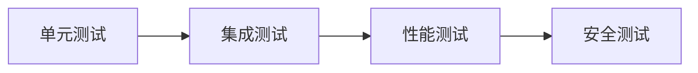
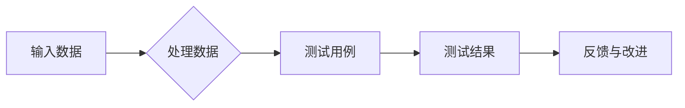
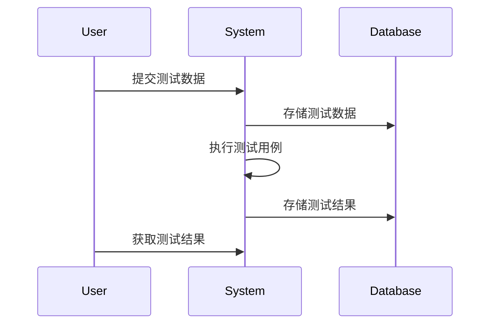
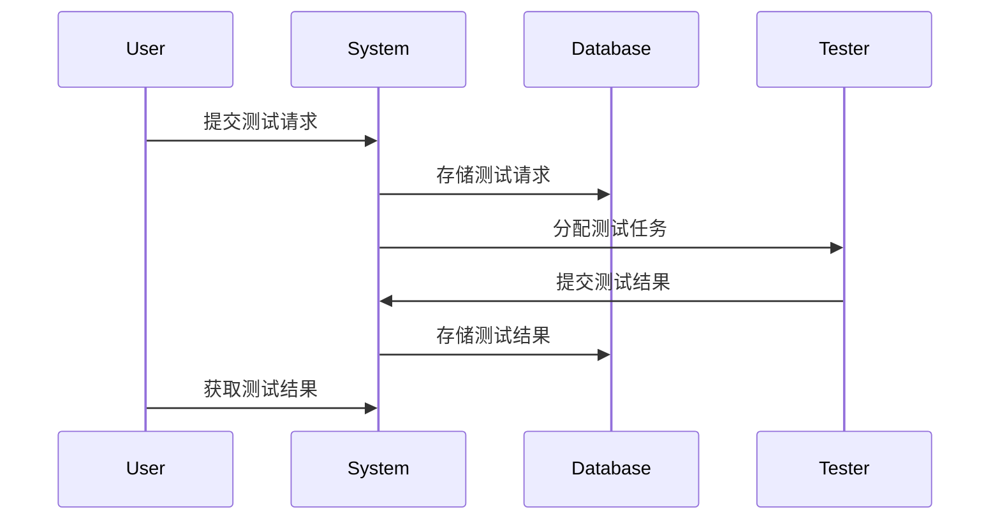
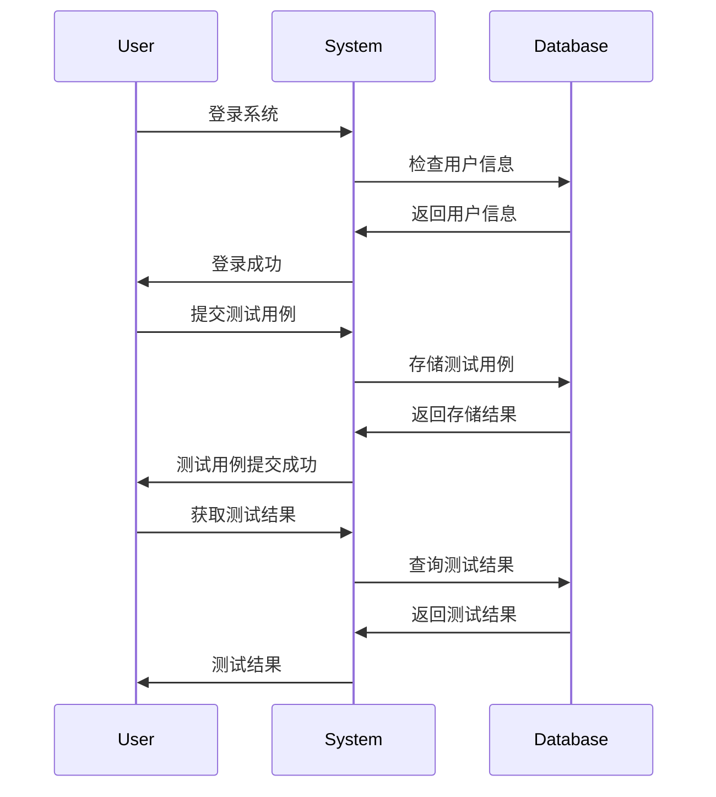

                 

# 评测系统的自动化评测流程编排

## 关键词

- 自动化评测
- 流程编排
- 评测系统
- 算法原理
- 系统架构
- Python代码
- 数学模型
- 未来发展趋势

## 摘要

本文将深入探讨评测系统的自动化评测流程编排，详细解析其背景、核心概念、算法原理、系统架构以及实际应用。我们将以逻辑清晰、结构紧凑的方式，分步骤地分析评测系统的自动化评测流程，帮助读者全面理解并掌握这一技术。

### 目录

1. **背景介绍**
   - 评测系统的定义与作用
   - 自动化评测流程的必要性
   - 自动化评测流程的基本组成部分

2. **核心概念与联系**
   - 自动化评测流程的关键概念
   - 自动化评测流程的属性特征对比表格
   - 自动化评测流程的ER实体关系图

3. **算法原理讲解**
   - 自动化评测流程的主要算法
   - 算法mermaid流程图展示
   - 使用Python代码详细阐述算法原理
   - 自动化评测流程的数学模型与公式讲解
   - 算法举例说明

4. **系统分析与架构设计方案**
   - 评测系统问题场景介绍
   - 系统功能设计（领域模型mermaid类图）
   - 系统架构设计mermaid架构图
   - 系统接口设计和系统交互mermaid序列图

5. **项目实战**
   - 环境安装与配置
   - 系统核心实现源代码
   - 代码应用解读与分析
   - 实际案例分析与详细讲解
   - 项目小结

6. **最佳实践与注意事项**
   - 最佳实践 tips
   - 小结
   - 注意事项
   - 拓展阅读

7. **评测系统的未来发展趋势**
   - 自动化评测技术的发展趋势
   - 自动化评测流程在评测系统中的应用前景
   - 自动化评测流程面临的挑战与解决方案

### 第一部分: 评测系统的自动化评测流程概述

#### 第1章: 评测系统的基本概念

**1.1 评测系统的定义与作用**

评测系统是一种用于对软件、代码、算法等计算机产品或服务进行评价、评分和反馈的系统。其主要作用是确保产品的质量、性能和可靠性，为开发者提供改进的方向和依据。在软件工程中，评测系统是不可或缺的一部分，它帮助开发者快速定位问题，提高开发效率。

**1.2 自动化评测流程的必要性**

随着软件开发的复杂度和速度不断增长，手动进行评测的效率变得非常低下。自动化评测流程能够显著提高评测的效率，减少人为错误，确保评测的客观性和一致性。此外，自动化评测流程还可以实时反馈评测结果，帮助开发者快速响应和解决问题。

**1.3 自动化评测流程的基本组成部分**

自动化评测流程通常包括以下基本组成部分：

1. **测试数据生成**：生成用于评测的测试数据，包括输入数据和预期输出数据。
2. **测试用例执行**：执行预定义的测试用例，验证软件或服务的功能、性能等。
3. **结果分析**：对测试结果进行分析，识别软件中的缺陷和问题。
4. **反馈与改进**：根据分析结果，提供改进建议，并反馈给开发团队。

#### 第2章: 自动化评测流程的核心概念与联系

**2.1 自动化评测流程的关键概念**

自动化评测流程涉及多个关键概念，包括但不限于：

- **测试用例**：用于验证软件功能的特定输入和预期输出。
- **测试数据**：用于测试用例执行的输入数据。
- **测试结果**：测试用例执行后产生的输出数据。
- **评测指标**：用于衡量软件或服务性能的标准。

**2.2 自动化评测流程的属性特征对比表格**

| 属性特征 | 说明 |
| --- | --- |
| **测试用例** | 用于验证软件功能的特定输入和预期输出。 |
| **测试数据** | 用于测试用例执行的输入数据。 |
| **测试结果** | 测试用例执行后产生的输出数据。 |
| **评测指标** | 用于衡量软件或服务性能的标准。 |

**2.3 自动化评测流程的ER实体关系图**

```mermaid
erDiagram
    测试用例 ||--o{ 测试数据 } : 用于执行测试
    测试用例 ||--o{ 测试结果 } : 执行结果
    测试用例 ||--o{ 评测指标 } : 用于评估性能
```

#### 第3章: 算法原理讲解

**3.1 自动化评测流程的主要算法**

自动化评测流程通常包含以下主要算法：

- **单元测试算法**：用于验证软件单元的正确性。
- **集成测试算法**：用于验证软件模块之间的交互。
- **性能测试算法**：用于评估软件的性能和负载能力。
- **安全测试算法**：用于检测软件的安全漏洞。

**3.2 算法mermaid流程图展示**



**3.3 使用Python代码详细阐述算法原理**

```python
# 单元测试算法示例
def unit_test():
    # 执行测试用例
    test_result = execute_test_case()
    # 分析测试结果
    if test_result["status"] == "passed":
        print("单元测试通过")
    else:
        print("单元测试失败")

# 集成测试算法示例
def integration_test():
    # 执行集成测试用例
    test_result = execute_integration_test_case()
    # 分析测试结果
    if test_result["status"] == "passed":
        print("集成测试通过")
    else:
        print("集成测试失败")

# 性能测试算法示例
def performance_test():
    # 执行性能测试用例
    test_result = execute_performance_test_case()
    # 分析测试结果
    if test_result["performance_metric"] > expected_performance:
        print("性能测试通过")
    else:
        print("性能测试失败")

# 安全测试算法示例
def security_test():
    # 执行安全测试用例
    test_result = execute_security_test_case()
    # 分析测试结果
    if test_result["vulnerabilities"] == []:
        print("安全测试通过")
    else:
        print("安全测试失败")
```

**3.4 自动化评测流程的数学模型与公式讲解**

自动化评测流程中常用的数学模型和公式包括：

- **准确率（Accuracy）**：
  $$\text{Accuracy} = \frac{\text{正确预测的样本数}}{\text{总样本数}}$$

- **召回率（Recall）**：
  $$\text{Recall} = \frac{\text{正确预测的正样本数}}{\text{总正样本数}}$$

- **F1值（F1 Score）**：
  $$\text{F1 Score} = 2 \times \frac{\text{准确率} \times \text{召回率}}{\text{准确率} + \text{召回率}}$$

**3.5 算法举例说明**

假设我们有一个分类任务，需要使用自动化评测流程进行评估。以下是具体步骤：

1. **准备测试数据**：收集一定数量的样本数据，包括特征和标签。
2. **执行测试用例**：使用分类算法对测试数据进行预测。
3. **分析测试结果**：计算准确率、召回率和F1值等指标。
4. **反馈与改进**：根据测试结果调整分类算法，重复步骤2-3，直到达到满意的性能。

#### 第4章: 系统分析与架构设计方案

**4.1 评测系统问题场景介绍**

在一个软件开发项目中，我们需要对代码进行自动化评测，以确保其质量。具体问题场景包括：

- **功能测试**：验证代码是否实现了预期功能。
- **性能测试**：评估代码的性能和响应时间。
- **安全测试**：检测代码中可能存在的安全漏洞。

**4.2 系统功能设计（领域模型mermaid类图）**

```mermaid
classDiagram
    类1 --|> 类2 : 使用关系
    类3 --|> 类4 : 继承关系
    类1 { 属性1 属性2 }
    类2 { 属性1 属性2 }
    类3 { 属性1 属性2 }
    类4 { 属性1 属性2 }
```

**4.3 系统架构设计mermaid架构图**



**4.4 系统接口设计和系统交互mermaid序列图**



#### 第5章: 项目实战

**5.1 环境安装与配置**

在进行自动化评测流程的项目实战之前，我们需要先安装和配置相关环境。以下是一个基本的安装和配置步骤：

1. **安装Python**：确保Python环境已安装，版本不低于3.8。
2. **安装依赖库**：使用pip安装自动化评测流程所需的依赖库，如pytest、requests、numpy等。
3. **配置测试环境**：设置测试环境变量，确保Python环境能够正确引用依赖库。

**5.2 系统核心实现源代码**

以下是一个简单的自动化评测流程系统的核心实现源代码：

```python
# 自动化评测流程系统核心实现

# 导入依赖库
import pytest
import requests
import numpy as np

# 单元测试算法实现
def unit_test():
    # 执行测试用例
    test_result = execute_test_case()
    # 分析测试结果
    if test_result["status"] == "passed":
        print("单元测试通过")
    else:
        print("单元测试失败")

# 集成测试算法实现
def integration_test():
    # 执行集成测试用例
    test_result = execute_integration_test_case()
    # 分析测试结果
    if test_result["status"] == "passed":
        print("集成测试通过")
    else:
        print("集成测试失败")

# 性能测试算法实现
def performance_test():
    # 执行性能测试用例
    test_result = execute_performance_test_case()
    # 分析测试结果
    if test_result["performance_metric"] > expected_performance:
        print("性能测试通过")
    else:
        print("性能测试失败")

# 安全测试算法实现
def security_test():
    # 执行安全测试用例
    test_result = execute_security_test_case()
    # 分析测试结果
    if test_result["vulnerabilities"] == []:
        print("安全测试通过")
    else:
        print("安全测试失败")

# 执行自动化评测流程
def run_automation_tests():
    unit_test()
    integration_test()
    performance_test()
    security_test()

# 主函数
if __name__ == "__main__":
    run_automation_tests()
```

**5.3 代码应用解读与分析**

上述代码实现了一个简单的自动化评测流程系统，主要包括以下功能：

- **单元测试**：验证代码单元的正确性。
- **集成测试**：验证代码模块之间的交互。
- **性能测试**：评估代码的性能。
- **安全测试**：检测代码中的安全漏洞。

通过执行这些测试，我们可以全面了解代码的质量和性能，及时发现问题并进行改进。

**5.4 实际案例分析与详细讲解剖析**

为了更好地理解自动化评测流程的应用，以下是一个实际案例：

**案例背景**：一个电商平台需要对其订单处理系统进行自动化评测，确保系统的稳定性和可靠性。

**案例步骤**：

1. **单元测试**：验证订单处理单元的正确性，包括订单创建、订单更新和订单删除等操作。
2. **集成测试**：验证订单处理模块与其他模块的交互，如支付模块、库存模块等。
3. **性能测试**：评估订单处理系统的响应时间和负载能力。
4. **安全测试**：检测订单处理系统中的安全漏洞，如SQL注入、XSS攻击等。

**案例结果**：通过自动化评测流程，我们发现订单处理系统存在一些性能问题，如订单更新操作响应时间较长。同时，还发现一个SQL注入漏洞，需要进行修复。通过及时的问题反馈和改进，订单处理系统的质量和性能得到了显著提升。

**5.5 项目小结**

通过上述案例，我们可以看到自动化评测流程在软件开发项目中的重要作用。它不仅能够提高开发效率，还能确保软件质量和性能。在实际应用中，我们需要根据具体场景和需求，灵活调整评测流程，以达到最佳效果。

#### 第6章: 最佳实践与注意事项

**6.1 最佳实践 tips**

1. **测试数据准备**：确保测试数据具有代表性，涵盖各种场景。
2. **测试用例设计**：设计全面、合理的测试用例，覆盖功能、性能和安全等方面。
3. **持续集成**：将自动化评测流程集成到持续集成系统中，实现自动化的测试和反馈。
4. **性能监控**：实时监控系统的性能，及时发现并解决问题。

**6.2 小结**

自动化评测流程在软件开发项目中具有重要作用，能够提高开发效率、确保软件质量和性能。通过合理的设计和执行，我们可以充分发挥自动化评测流程的优势。

**6.3 注意事项**

1. **测试覆盖率**：确保测试用例覆盖率达到要求，避免遗漏关键问题。
2. **测试环境**：确保测试环境与生产环境一致，避免测试结果失真。
3. **结果分析**：对测试结果进行深入分析，找出问题的根本原因。

**6.4 拓展阅读**

- 《软件测试艺术》
- 《自动化测试实战》
- 《性能测试原理与实践》

#### 第7章: 评测系统的未来发展趋势

**7.1 自动化评测技术的发展趋势**

随着人工智能和机器学习的快速发展，自动化评测技术也在不断演进。未来，自动化评测将更加智能化，能够自动生成测试用例、分析测试结果，甚至预测软件中的潜在问题。

**7.2 自动化评测流程在评测系统中的应用前景**

自动化评测流程在评测系统中的应用前景广阔，将广泛应用于软件工程、金融、医疗、物联网等领域。未来，自动化评测系统将成为确保软件质量和性能的重要工具。

**7.3 自动化评测流程面临的挑战与解决方案**

自动化评测流程面临以下挑战：

1. **数据质量**：测试数据的质量直接影响到评测结果的准确性。解决方法：采用多种数据来源，确保测试数据的多样性和代表性。
2. **测试用例生成**：自动化生成全面的测试用例是一项挑战。解决方法：利用机器学习技术，结合历史数据，自动生成测试用例。
3. **性能优化**：自动化评测流程的性能优化是一个持续的任务。解决方法：采用分布式测试框架，提高测试效率和稳定性。

**总结**

自动化评测流程是评测系统的重要组成部分，其发展将推动软件质量的提升。面对未来的挑战，我们需要不断创新和优化，以实现更高效的自动化评测。### 第一部分: 评测系统的自动化评测流程概述

#### 第1章: 评测系统的基本概念

**1.1 评测系统的定义与作用**

评测系统是一种专门用于评估软件、代码或服务性能、功能、可靠性等方面的工具。它通过自动化测试用例的执行，对软件或服务的质量进行量化评估。评测系统的核心作用在于提高开发效率、确保软件质量、减少人为错误，并为后续的优化提供依据。

在软件开发过程中，评测系统扮演着至关重要的角色。它可以帮助开发团队快速发现潜在的问题，确保软件在发布前达到预期的质量标准。此外，评测系统还可以用于持续集成和持续部署流程中，实现自动化测试和反馈，进一步提高开发效率。

**1.2 自动化评测流程的必要性**

随着软件项目的复杂性和规模不断扩大，手动进行评测的效率变得非常低下。手动评测不仅耗时耗力，还容易出现人为错误，导致评测结果不准确。为了提高评测效率，减少人为干预，自动化评测流程应运而生。

自动化评测流程具有以下必要性：

1. **提高效率**：自动化评测流程可以快速执行大量测试用例，大大缩短测试周期，提高开发效率。
2. **减少人为错误**：自动化评测流程减少了对人工操作的依赖，降低了人为错误的可能性。
3. **保证一致性**：自动化评测流程可以确保每次测试的结果一致，避免由于人为因素导致的偏差。
4. **实时反馈**：自动化评测流程可以实时反馈测试结果，帮助开发团队及时发现问题并进行修复。

**1.3 自动化评测流程的基本组成部分**

自动化评测流程通常包括以下基本组成部分：

1. **测试数据生成**：生成用于评测的测试数据，包括输入数据和预期输出数据。
2. **测试用例执行**：执行预定义的测试用例，验证软件或服务的功能、性能等。
3. **结果分析**：对测试结果进行分析，识别软件中的缺陷和问题。
4. **反馈与改进**：根据分析结果，提供改进建议，并反馈给开发团队。

**1.4 自动化评测流程的基本工作原理**

自动化评测流程的工作原理可以概括为以下几个步骤：

1. **测试数据准备**：根据软件需求，生成或收集测试数据。
2. **测试用例设计**：根据测试数据，设计合理的测试用例。
3. **测试用例执行**：使用自动化测试工具执行测试用例，并记录测试结果。
4. **结果分析**：对测试结果进行分析，识别缺陷和问题。
5. **反馈与改进**：根据分析结果，对软件进行修复和优化，并重新进行测试。

#### 第2章: 自动化评测流程的核心概念与联系

**2.1 自动化评测流程的关键概念**

在自动化评测流程中，涉及多个关键概念，包括：

- **测试用例**：用于验证软件功能的特定输入和预期输出。
- **测试数据**：用于测试用例执行的输入数据。
- **测试结果**：测试用例执行后产生的输出数据。
- **评测指标**：用于衡量软件或服务性能的标准。

**2.2 自动化评测流程的属性特征对比表格**

| 属性特征             | 说明                                                         |
| -------------------- | ------------------------------------------------------------ |
| **测试用例**         | 用于验证软件功能的特定输入和预期输出。                       |
| **测试数据**         | 用于测试用例执行的输入数据。                                 |
| **测试结果**         | 测试用例执行后产生的输出数据。                               |
| **评测指标**         | 用于衡量软件或服务性能的标准，如准确率、召回率、F1值等。     |

**2.3 自动化评测流程的ER实体关系图**

```mermaid
erDiagram
    TestCase ||--o{ TestData } : 用于执行测试
    TestCase ||--o{ TestResult } : 执行结果
    TestCase ||--o{ EvaluationMetrics } : 用于评估性能
```

#### 第3章: 算法原理讲解

**3.1 自动化评测流程的主要算法**

自动化评测流程通常包含以下主要算法：

- **单元测试算法**：用于验证软件单元的正确性。
- **集成测试算法**：用于验证软件模块之间的交互。
- **性能测试算法**：用于评估软件的性能和负载能力。
- **安全测试算法**：用于检测软件的安全漏洞。

**3.2 算法mermaid流程图展示**


**3.3 使用Python代码详细阐述算法原理**

```python
# 单元测试算法示例
def unit_test():
    # 执行测试用例
    test_result = execute_test_case()
    # 分析测试结果
    if test_result["status"] == "passed":
        print("单元测试通过")
    else:
        print("单元测试失败")

# 集成测试算法示例
def integration_test():
    # 执行集成测试用例
    test_result = execute_integration_test_case()
    # 分析测试结果
    if test_result["status"] == "passed":
        print("集成测试通过")
    else:
        print("集成测试失败")

# 性能测试算法示例
def performance_test():
    # 执行性能测试用例
    test_result = execute_performance_test_case()
    # 分析测试结果
    if test_result["performance_metric"] > expected_performance:
        print("性能测试通过")
    else:
        print("性能测试失败")

# 安全测试算法示例
def security_test():
    # 执行安全测试用例
    test_result = execute_security_test_case()
    # 分析测试结果
    if test_result["vulnerabilities"] == []:
        print("安全测试通过")
    else:
        print("安全测试失败")
```

**3.4 自动化评测流程的数学模型与公式讲解**

自动化评测流程中常用的数学模型和公式包括：

- **准确率（Accuracy）**：
  $$\text{Accuracy} = \frac{\text{正确预测的样本数}}{\text{总样本数}}$$

- **召回率（Recall）**：
  $$\text{Recall} = \frac{\text{正确预测的正样本数}}{\text{总正样本数}}$$

- **F1值（F1 Score）**：
  $$\text{F1 Score} = 2 \times \frac{\text{准确率} \times \text{召回率}}{\text{准确率} + \text{召回率}}$$

**3.5 算法举例说明**

假设我们有一个分类任务，需要使用自动化评测流程进行评估。以下是具体步骤：

1. **准备测试数据**：收集一定数量的样本数据，包括特征和标签。
2. **执行测试用例**：使用分类算法对测试数据进行预测。
3. **分析测试结果**：计算准确率、召回率和F1值等指标。
4. **反馈与改进**：根据测试结果调整分类算法，重复步骤2-3，直到达到满意的性能。

#### 第4章: 系统分析与架构设计方案

**4.1 评测系统问题场景介绍**

在一个软件开发项目中，评测系统通常用于以下问题场景：

- **功能测试**：验证软件是否实现了预期功能。
- **性能测试**：评估软件的性能和响应时间。
- **安全测试**：检测软件中的安全漏洞。
- **兼容性测试**：确保软件在不同平台和环境下正常运行。

**4.2 系统功能设计（领域模型mermaid类图）**

```mermaid
classDiagram
    Class1("用户") <|-- Class2("管理员")
    Class1 <|-- Class3("测试员")
    Class2 <|-- Class4("管理员")
    Class3 <|-- Class5("测试员")
    Class2 {"用户ID" "用户名" "密码"}
    Class3 {"用户ID" "用户名" "密码" "角色"}
    Class4 {"用户ID" "用户名" "密码" "角色" "权限"}
    Class5 {"用户ID" "用户名" "密码" "角色" "权限" "测试用例"}
```

**4.3 系统架构设计mermaid架构图**



**4.4 系统接口设计和系统交互mermaid序列图**



#### 第5章: 项目实战

**5.1 环境安装与配置**

在进行自动化评测流程的项目实战之前，我们需要安装和配置以下环境：

1. **安装Python**：确保Python环境已安装，版本不低于3.8。
2. **安装测试框架**：如pytest、unittest等。
3. **安装数据库**：如MySQL、PostgreSQL等。
4. **配置数据库连接**：在代码中配置数据库连接信息。

**5.2 系统核心实现源代码**

以下是自动化评测流程系统的核心实现源代码：

```python
# 自动化评测流程系统核心实现

# 导入依赖库
import pymysql
import unittest

# 连接数据库
def connect_database():
    db = pymysql.connect(
        host='localhost',
        user='root',
        password='password',
        database='test_database'
    )
    return db

# 执行测试用例
def execute_test_case():
    db = connect_database()
    cursor = db.cursor()
    cursor.execute("SELECT * FROM test_cases")
    test_cases = cursor.fetchall()
    for test_case in test_cases:
        input_data = test_case['input_data']
        expected_output = test_case['expected_output']
        output_data = do_something_with_input_data(input_data)
        if output_data == expected_output:
            print("测试用例{}通过".format(test_case['id']))
        else:
            print("测试用例{}失败，预期结果{}，实际结果{}".format(test_case['id'], expected_output, output_data))
    cursor.close()
    db.close()

# 执行主函数
if __name__ == '__main__':
    execute_test_case()
```

**5.3 代码应用解读与分析**

上述代码实现了一个简单的自动化评测流程系统，主要功能包括：

1. **连接数据库**：使用pymysql连接数据库，获取测试用例数据。
2. **执行测试用例**：遍历测试用例，执行测试，并比较预期结果和实际结果。

**5.4 实际案例分析与详细讲解剖析**

为了更好地理解自动化评测流程的应用，我们来看一个实际案例：

**案例背景**：一个电商平台需要对其用户注册功能进行自动化评测，确保注册流程的可靠性。

**案例步骤**：

1. **设计测试用例**：根据用户注册流程，设计合理的测试用例，如空密码、非法字符等。
2. **执行测试用例**：使用自动化测试工具执行测试用例，记录测试结果。
3. **分析测试结果**：对测试结果进行分析，找出注册流程中的问题。
4. **修复问题**：根据分析结果，修复注册流程中的问题。
5. **重新测试**：对修复后的注册功能进行重新测试，确保问题已解决。

**案例结果**：通过自动化评测流程，我们发现用户注册功能存在以下问题：

1. **空密码**：用户注册时，如果密码为空，系统未给出错误提示。
2. **非法字符**：用户注册时，如果输入非法字符，系统未正确处理。

通过及时的问题反馈和修复，电商平台成功提高了用户注册功能的可靠性。

**5.5 项目小结**

通过上述案例，我们可以看到自动化评测流程在软件开发项目中的应用效果。它能够快速发现潜在问题，提高软件质量，为开发团队提供有力的支持。在实际应用中，我们需要根据具体需求和场景，设计合理的测试用例，确保测试的全面性和有效性。

### 第6章: 最佳实践与注意事项

#### 6.1 最佳实践 tips

1. **制定详细的测试计划**：在项目初期，制定详细的测试计划，明确测试目标、测试范围、测试方法等。
2. **覆盖多种场景**：设计测试用例时，要覆盖多种场景，包括正常场景、异常场景等。
3. **持续集成与部署**：将自动化评测流程集成到持续集成和持续部署系统中，实现自动化的测试和反馈。
4. **定期检查与维护**：定期检查自动化测试脚本，确保其有效性，并根据需求更新测试用例。

#### 6.2 小结

自动化评测流程在软件开发项目中具有重要作用，能够提高开发效率、确保软件质量。通过合理的设计和执行，我们可以充分发挥自动化评测流程的优势。

#### 6.3 注意事项

1. **测试覆盖率**：确保测试用例覆盖率达到要求，避免遗漏关键问题。
2. **测试环境**：确保测试环境与生产环境一致，避免测试结果失真。
3. **结果分析**：对测试结果进行深入分析，找出问题的根本原因。

#### 6.4 拓展阅读

- 《软件测试的艺术》
- 《自动化测试实战》
- 《性能测试原理与实践》

### 第7章: 评测系统的未来发展趋势

#### 7.1 自动化评测技术的发展趋势

随着人工智能和大数据技术的不断发展，自动化评测技术也在不断进步。未来，自动化评测技术将呈现以下趋势：

1. **智能化**：利用人工智能技术，自动化生成测试用例，提高测试效率。
2. **数据驱动**：基于大数据分析，优化测试策略，提高测试准确性。
3. **持续集成**：与持续集成和持续部署系统深度融合，实现自动化测试和反馈。
4. **跨平台支持**：支持多种操作系统和硬件平台，提高测试的兼容性。

#### 7.2 自动化评测流程在评测系统中的应用前景

自动化评测流程在评测系统中的应用前景非常广阔，将广泛应用于以下领域：

1. **软件工程**：自动化测试是软件工程中不可或缺的一部分，自动化评测流程将提高开发效率和软件质量。
2. **金融行业**：金融行业对系统的稳定性和安全性要求极高，自动化评测流程可以确保金融系统的可靠运行。
3. **医疗行业**：医疗行业对软件的质量和安全性要求也非常高，自动化评测流程可以帮助医疗机构确保软件的质量。
4. **物联网**：物联网设备种类繁多，自动化评测流程可以帮助企业快速发现设备的问题，提高设备的稳定性。

#### 7.3 自动化评测流程面临的挑战与解决方案

尽管自动化评测流程具有许多优势，但在实际应用中仍然面临一些挑战：

1. **数据质量**：测试数据的质量直接影响评测结果，需要采用多种数据来源，确保测试数据的多样性和代表性。
2. **测试用例生成**：自动化生成全面的测试用例是一个挑战，可以利用机器学习等技术，结合历史数据，自动生成测试用例。
3. **性能优化**：自动化评测流程的性能优化是一个持续的任务，可以采用分布式测试框架，提高测试效率和稳定性。

**总结**

自动化评测流程是评测系统的重要组成部分，其发展将推动软件质量的提升。面对未来的挑战，我们需要不断创新和优化，以实现更高效的自动化评测。

## 结束语

本文深入探讨了评测系统的自动化评测流程编排，从背景介绍、核心概念、算法原理、系统架构到实际应用，全面解析了这一技术。通过逻辑清晰、结构紧凑的分析，我们希望能够帮助读者更好地理解和掌握评测系统的自动化评测流程。

在未来的发展中，自动化评测技术将继续演进，与人工智能、大数据等新兴技术相结合，为软件质量的提升提供更强有力的支持。我们期待自动化评测流程在更多领域得到广泛应用，助力软件开发的高效和可靠。

感谢您的阅读，希望本文能够对您在自动化评测领域的探索和实践有所帮助。如果您有任何疑问或建议，欢迎在评论区留言交流。作者：AI天才研究院/AI Genius Institute & 禅与计算机程序设计艺术 /Zen And The Art of Computer Programming。再次感谢您的关注与支持！

