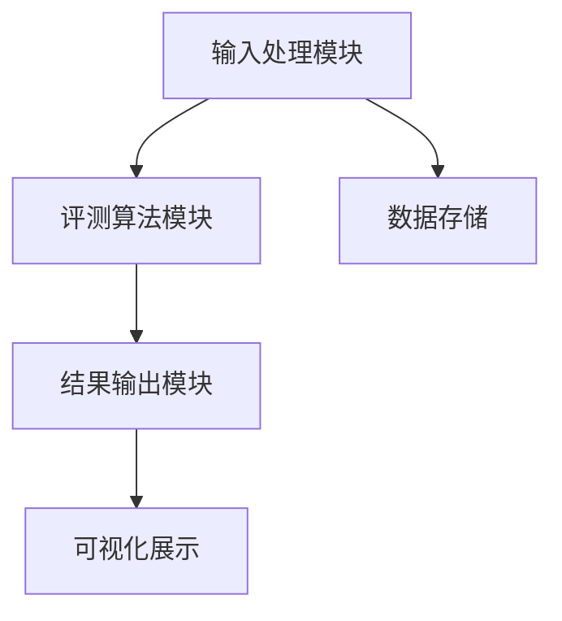

                 

## 文章标题

### 评测系统的自动化评测策略优化

## 关键词

- 评测系统
- 自动化评测
- 评测策略
- 优化方法
- 机器学习
- 智能算法

## 摘要

本文旨在探讨评测系统的自动化评测策略优化，从评测系统的定义、类型和发展历程出发，深入分析自动化评测策略的分类、原理和实现方法。本文重点讨论了静态评测策略、动态评测策略和混合评测策略的优化，并提出了基于机器学习、优化方法和智能算法的评测策略优化方法。通过具体案例分析和实践，本文为评测系统的自动化评测策略优化提供了理论指导和实践参考。

## 目录

----------------------------------------------------------------

# 第一部分：评测系统概述

## 第1章：评测系统简介

### 1.1 评测系统的定义与作用

### 1.2 评测系统的类型与特点

### 1.3 评测系统的发展历程

## 第2章：评测系统的基础知识

### 2.1 评测系统的基本架构

### 2.2 评测系统的关键技术

### 2.3 评测系统的实施步骤

# 第二部分：自动化评测策略

## 第3章：自动化评测策略概述

### 3.1 自动化评测策略的定义与重要性

### 3.2 自动化评测策略的分类

## 第4章：静态评测策略

### 4.1 静态评测策略原理

### 4.2 静态评测策略的实现

### 4.3 静态评测策略案例分析

## 第5章：动态评测策略

### 5.1 动态评测策略原理

### 5.2 动态评测策略的实现

### 5.3 动态评测策略案例分析

## 第6章：混合评测策略

### 6.1 混合评测策略原理

### 6.2 混合评测策略的实现

### 6.3 混合评测策略案例分析

# 第三部分：评测策略优化

## 第7章：评测策略优化概述

### 7.1 评测策略优化的定义与意义

### 7.2 评测策略优化的方法

## 第8章：基于机器学习的评测策略优化

### 8.1 机器学习优化方法原理

### 8.2 机器学习优化方法实现

### 8.3 机器学习优化案例分析

## 第9章：基于优化的评测策略优化

### 9.1 优化方法原理

### 9.2 优化方法实现

### 9.3 优化方法案例分析

## 第10章：基于智能算法的评测策略优化

### 10.1 智能算法原理

### 10.2 智能算法实现

### 10.3 智能算法案例分

----------------------------------------------------------------

## 引言

### 评测系统的重要性

评测系统在现代软件开发和维护中扮演着至关重要的角色。随着软件系统规模的不断扩大和复杂性的增加，传统的手工评测方法已经无法满足快速迭代的开发流程和高精度质量要求。自动化评测系统作为一种高效的替代方案，能够显著提升开发效率和软件质量。

自动化评测系统的主要作用包括：

1. **提高效率**：自动化评测能够快速地对大量代码进行评估，节省人力和时间成本。
2. **降低错误率**：通过预设的评测规则和算法，自动化评测能够减少人为错误，提高评估结果的准确性。
3. **支持持续集成**：自动化评测系统可以与持续集成（CI）工具无缝集成，确保代码质量在每次提交后都能得到及时评估。
4. **促进代码优化**：自动化评测能够及时发现代码中的潜在问题，指导开发人员进行优化和改进。

### 自动化评测策略的重要性

自动化评测策略是评测系统的核心组成部分，决定了评测系统的工作效率和评估准确性。有效的评测策略能够充分利用评测系统的优势，提高软件开发的整体质量。

自动化评测策略的重要性体现在以下几个方面：

1. **提高评估准确性**：通过科学的评测策略，能够更准确地评估代码的质量，降低误判和漏判的情况。
2. **降低评估时间**：优化后的评测策略能够减少评估时间，提高开发团队的工作效率。
3. **适应多种评估需求**：灵活的评测策略能够适应不同类型和规模的软件项目，满足多样化的评估需求。
4. **提升团队协作**：优化后的评测策略可以促进开发团队之间的协作，提高整体开发流程的流畅性。

本文将围绕评测系统的自动化评测策略进行深入探讨，分析现有的评测策略类型、优化方法和具体实现，以期为读者提供全面的技术指导和实践参考。接下来的章节将逐步展开讨论，首先从评测系统的概述开始，逐步深入到具体策略的讨论中。

## 第一部分：评测系统概述

### 第1章：评测系统简介

#### 1.1 评测系统的定义与作用

**评测系统的定义**：

评测系统是一种用于自动化评估软件代码、设计文档、测试用例等开发成果的工具。它通过预设的规则和算法，对输入的代码或文档进行静态或动态分析，评估其质量、性能、安全性等方面的指标。评测系统通常包括输入处理、评测算法和结果输出等模块，能够实现自动化、高效、准确的评估过程。

**评测系统的作用**：

1. **提高开发效率**：自动化评测系统能够快速对代码进行质量评估，节省开发人员的时间和精力，使团队能够更加专注于实际代码开发。
2. **提升代码质量**：通过评估系统的检测，能够及时发现代码中的错误、漏洞和性能问题，促进开发人员进行修复和优化。
3. **加强团队协作**：自动化评测系统能够提供一致的评估标准，减少团队内部因评估标准不一致而产生的争议，提高团队协作效率。
4. **支持持续集成**：评测系统可以与持续集成（CI）工具集成，确保每次代码提交后都能进行质量评估，提前发现潜在问题，防止问题积累。
5. **评估项目进展**：通过定期对项目的评估结果进行分析，可以评估项目的开发进度和质量，为项目管理提供数据支持。

#### 1.2 评测系统的类型与特点

**自动化评测系统**：

- **定义**：自动化评测系统是一种完全自动化的评测工具，无需人工干预，即可对代码或文档进行评估。
- **特点**：
  - **高效性**：能够快速处理大量代码或文档，提高评估效率。
  - **准确性**：通过预设的规则和算法，提高评估的准确性。
  - **一致性**：能够提供一致的评估标准，减少人为因素对评估结果的影响。
  - **可扩展性**：可以根据不同的项目需求，灵活添加或调整评测规则。

**半自动化评测系统**：

- **定义**：半自动化评测系统需要部分人工干预，如输入处理、评测规则设定等。
- **特点**：
  - **灵活性**：可以根据具体项目需求，自定义评测规则。
  - **可控性**：人工干预能够确保评估过程的可控性。
  - **适应性**：适用于规模较小、评估需求较为复杂的项目。

**全手工评测系统**：

- **定义**：全手工评测系统完全依赖人工进行评测，评估过程需要开发人员手动执行。
- **特点**：
  - **人工成本高**：评估过程需要大量人力，成本较高。
  - **效率低**：评估速度较慢，难以应对大规模代码的评估需求。
  - **主观性强**：评估结果容易受到评估者个人经验、观点等因素的影响，一致性较差。

#### 1.3 评测系统的发展历程

**手工评测阶段**：

- **早期阶段**：软件开发初期，评估主要依赖于人工检查代码和文档，效率低，易出错。
- **规范化阶段**：随着软件工程理论的成熟，开始出现一些基本的代码质量评估标准和工具，如编码规范、静态分析工具等。

**自动化评测阶段**：

- **自动化工具普及**：随着计算机技术的进步，出现了一系列自动化评测工具，如SonarQube、Checkstyle等，能够对代码进行静态和动态分析。
- **智能化评测**：结合机器学习和自然语言处理等技术，自动化评测工具的评估精度和效率得到了显著提升。

**智能化评测阶段**：

- **自适应评测**：通过机器学习算法，自动化评测工具能够根据历史评估数据自动调整评测策略，提高评估准确性。
- **智能化辅助**：利用自然语言处理技术，自动化评测工具能够自动识别代码中的错误、漏洞和潜在风险，为开发人员提供智能化的辅助。

### 总结

评测系统作为软件开发中不可或缺的一部分，其自动化评测策略的优化具有重要意义。通过对比不同类型的评测系统，了解其特点和发展历程，可以为实际项目选择合适的评测系统提供参考。在后续章节中，将详细探讨自动化评测策略的具体分类、原理和实现方法，以期为读者提供全面的技术指导。

## 第2章：评测系统的基础知识

### 2.1 评测系统的基本架构

评测系统的基本架构通常包括输入处理模块、评测算法模块和结果输出模块三个主要部分。这三个模块共同协作，确保评测过程的高效性和准确性。

**输入处理模块**：

- **作用**：负责接收和处理用户输入的代码、文档或其他评估对象。
- **功能**：
  - **数据读取**：从源代码库、版本控制系统或其他数据源读取评估对象。
  - **数据清洗**：对读取的数据进行预处理，如去除注释、格式化代码、处理特殊字符等。
  - **数据存储**：将预处理后的数据存储在临时数据库或缓存中，以供后续分析。

**评测算法模块**：

- **作用**：对输入数据进行质量评估，根据预设的评测规则和算法，生成评估结果。
- **功能**：
  - **规则库**：包含各种评测规则，如代码风格检查、语法错误检测、性能分析等。
  - **算法实现**：根据规则库中的规则，实现具体的算法，对代码进行静态或动态分析。
  - **评估计算**：对分析结果进行计算和评分，生成评估报告。

**结果输出模块**：

- **作用**：将评测结果以可视化的形式展示给用户，并提供反馈和改进建议。
- **功能**：
  - **报告生成**：生成详细的评估报告，包括评估结果、错误列表、性能指标等。
  - **可视化展示**：使用图表、报表等形式展示评估结果，便于用户理解和分析。
  - **反馈机制**：提供即时反馈和改进建议，帮助开发人员定位问题和进行改进。

通过这三个模块的协同工作，评测系统能够实现对代码或文档的全面、准确的评估。以下是一个简化的评测系统架构图，展示了各模块之间的关系：



### 2.2 评测系统的关键技术

**数据清洗技术**：

- **定义**：数据清洗是评测系统的预处理阶段，旨在提高数据质量和一致性。
- **方法**：
  - **去除注释**：从代码中去除无关的注释，确保评测对象的纯净性。
  - **代码格式化**：统一代码的缩进、换行和空白字符，提高代码的可读性。
  - **处理特殊字符**：过滤或转换特殊字符，以防止对评测过程产生干扰。

**评测算法选择**：

- **定义**：评测算法是评测系统的核心，决定了评估的精度和效率。
- **方法**：
  - **静态分析算法**：对代码进行静态分析，如语法检查、代码风格检查、代码复用等。
  - **动态分析算法**：对代码进行动态分析，如性能测试、内存泄漏检测、并发问题检测等。
  - **组合算法**：结合多种算法，提高评估的全面性和准确性。

**评估指标设定**：

- **定义**：评估指标是衡量代码质量的标准，直接影响评估结果。
- **方法**：
  - **质量指标**：如代码复杂度、代码行数、代码覆盖率等。
  - **性能指标**：如代码执行时间、内存消耗、并发性能等。
  - **安全指标**：如安全漏洞、代码注入风险等。

**动态分析算法实现**：

- **定义**：动态分析算法是在程序运行过程中进行评估的方法。
- **方法**：
  - **性能测试**：通过模拟实际运行环境，评估代码的性能表现。
  - **内存泄漏检测**：跟踪程序运行过程中的内存分配和释放，检测内存泄漏问题。
  - **并发问题检测**：模拟并发场景，检测并发控制和同步问题。

**数据预处理与特征提取**：

- **定义**：数据预处理和特征提取是确保数据质量和特征表示的关键步骤。
- **方法**：
  - **数据预处理**：包括去除无关信息、格式化数据、处理缺失值等。
  - **特征提取**：从原始数据中提取关键特征，用于后续的评估和优化。

通过掌握这些关键技术，开发人员可以构建高效、准确的评测系统，从而提升软件开发的质量和效率。

### 2.3 评测系统的实施步骤

**需求分析**：

- **目的**：明确评测系统的目标和需求，为后续设计提供基础。
- **方法**：
  - **调研现有工具**：了解现有评测工具的功能和限制，分析其是否满足项目需求。
  - **与团队成员沟通**：与开发、测试、运维等团队成员沟通，收集他们对评测系统的需求和期望。

**系统设计**：

- **目的**：设计评测系统的架构和功能模块，确保系统能够满足需求。
- **方法**：
  - **模块划分**：根据需求分析的结果，划分系统的功能模块，如输入处理、评测算法、结果输出等。
  - **接口设计**：设计模块之间的接口，确保数据传递和功能调用的顺畅性。
  - **性能优化**：考虑系统的性能需求和负载情况，进行性能优化设计。

**系统开发与测试**：

- **目的**：实现评测系统的功能，并进行全面的测试，确保系统稳定可靠。
- **方法**：
  - **功能实现**：根据设计文档，逐步实现各模块的功能，编写相应的代码。
  - **单元测试**：对每个模块进行单元测试，确保其功能正确、性能稳定。
  - **集成测试**：将各模块集成起来，进行整体测试，确保系统运行稳定。

**系统部署与维护**：

- **目的**：将评测系统部署到生产环境，并进行长期的维护和优化。
- **方法**：
  - **部署实施**：根据系统架构图和部署文档，将系统部署到目标环境。
  - **监控与维护**：定期监控系统运行状态，进行性能监控、故障排查和系统优化。
  - **更新与升级**：根据项目需求和系统漏洞，定期更新和升级系统。

通过以上实施步骤，开发人员可以构建一个高效、可靠的评测系统，为软件开发提供有力支持。在实施过程中，需要充分考虑项目需求、技术选型和团队协作，确保评测系统能够持续优化和改进。

### 第3章：自动化评测策略概述

#### 3.1 自动化评测策略的定义与重要性

**自动化评测策略的定义**：

自动化评测策略是指通过预设的规则和算法，对代码或文档进行自动化评估的方法。它包括对代码的语法、风格、性能、安全性等多个方面进行评估，并根据评估结果提供反馈和建议。自动化评测策略的核心在于减少人为干预，提高评估效率和准确性。

**自动化评测策略的重要性**：

1. **提高评估效率**：自动化评测策略能够快速地对大量代码进行评估，节省时间和人力成本。传统的手工评估往往需要大量时间和精力，而自动化评测可以显著提升评估速度。
2. **确保评估一致性**：自动化评测策略通过预设的规则和算法，能够确保评估过程的一致性。不同的评估者可能会因个人经验和观点的不同而产生评估偏差，而自动化评测策略可以消除这种差异，提高评估结果的可靠性。
3. **增强评估准确性**：自动化评测策略能够根据预设的规则和算法，对代码进行详细、全面的评估。传统的手工评估容易受到评估者主观因素的影响，而自动化评测策略可以更加客观地评估代码的质量。
4. **支持持续集成**：自动化评测策略可以与持续集成（CI）工具无缝集成，确保每次代码提交后都能进行质量评估。这有助于提前发现和解决潜在问题，防止问题积累，提高软件质量。
5. **促进代码优化**：自动化评测策略能够及时发现代码中的潜在问题和性能瓶颈，为开发人员提供优化建议。这有助于提升代码的可读性、可维护性和性能。

#### 3.2 自动化评测策略的分类

**静态评测策略**：

- **定义**：静态评测策略是指在代码编译之前，通过静态分析对代码进行评估的方法。它不需要运行代码，仅通过分析代码的结构和内容来进行评估。
- **特点**：
  - **高效性**：静态评测策略能够在短时间内对大量代码进行评估，评估速度快。
  - **全面性**：静态评测策略可以评估代码的多个方面，如语法、风格、复杂度等。
  - **局限性**：静态评测策略无法评估代码的运行时行为和性能，对动态问题的检测能力有限。

**动态评测策略**：

- **定义**：动态评测策略是指在代码运行过程中，通过动态分析对代码进行评估的方法。它需要实际运行代码，根据运行结果进行评估。
- **特点**：
  - **实时性**：动态评测策略能够实时评估代码的性能、内存使用等动态指标。
  - **准确性**：动态评测策略能够更准确地评估代码的实际运行情况，发现潜在的运行时问题。
  - **复杂性**：动态评测策略需要运行代码，对评估环境有较高的要求，评估过程较为复杂。

**混合评测策略**：

- **定义**：混合评测策略是将静态评测和动态评测结合起来，通过综合分析代码的结构和运行时行为来进行评估的方法。
- **特点**：
  - **综合评估**：混合评测策略能够结合静态和动态评估的优势，对代码进行全面、准确的评估。
  - **灵活性**：可以根据项目需求和评估目的，灵活调整静态和动态评估的比例和权重。
  - **复杂性**：混合评测策略需要协调静态和动态评估的资源和时间，对系统设计和实现有较高的要求。

通过了解不同类型的自动化评测策略，开发人员可以根据项目需求和评估目标，选择合适的策略，提高代码评估的效率和准确性。

### 第4章：静态评测策略

#### 4.1 静态评测策略原理

**静态评测策略的基本概念**：

静态评测策略是指在不运行代码的情况下，通过对代码进行静态分析来评估其质量的方法。静态分析主要关注代码的结构、语法、风格、复杂度等方面，通过分析代码文本和抽象语法树（AST）来识别潜在的问题和缺陷。

**静态评测策略的原理**：

静态评测策略的工作原理可以分为以下几个步骤：

1. **代码解析**：首先对输入的代码进行语法解析，将其转换成抽象语法树（AST）。AST是一个树形结构，代表了代码的语法结构，是静态分析的基础。

2. **规则库定义**：根据评估目标和标准，定义一系列规则库。规则库包含了各种评估指标和条件，如代码复杂度、代码行数、变量命名规范等。

3. **规则匹配**：对AST进行遍历，根据规则库中的规则进行匹配。通过匹配，可以识别出代码中不符合规范的部分，如复杂的循环、重复的代码段、未定义的变量等。

4. **评估计算**：根据匹配的结果，对代码进行评估计算。评估结果可以包括错误数、警告数、复杂度评分等。评估结果可以用于生成评估报告，提供反馈和建议。

5. **结果输出**：将评估结果以可视化的形式展示给用户，包括错误列表、警告列表、复杂度分析图等。用户可以根据评估结果进行代码优化和修复。

**静态评测策略的基本概念**：

- **抽象语法树（AST）**：AST是代码的语法结构表示，它是静态分析的核心。通过分析AST，可以获取代码的语法信息，如函数定义、变量声明、循环结构等。

- **规则库**：规则库包含了各种评估指标和条件，是静态评测策略的基础。规则库可以根据不同的评估目标和标准进行定制。

- **评估指标**：评估指标是衡量代码质量的标准，如代码复杂度、代码行数、代码覆盖率等。评估指标可以用于评估代码的易读性、可维护性和性能。

- **评估报告**：评估报告是静态评测策略的输出结果，它包含了评估结果和分析建议。评估报告可以用于指导开发人员进行代码优化和修复。

#### 4.2 静态评测策略的实现

**实现步骤**：

1. **代码解析**：

   - **工具选择**：选择合适的代码解析工具，如Java的JavaParser、Python的ast模块等。这些工具能够将代码解析成抽象语法树（AST）。

   - **代码解析**：使用代码解析工具对输入的代码进行解析，生成AST。例如，对于Java代码，可以使用JavaParser进行解析：

     ```java
     CompilationUnit cu = JavaParser.parse(new File("path/to/your/source/Code.java"));
     ```

2. **规则库定义**：

   - **规则库构建**：根据评估目标和标准，构建规则库。规则库可以包含多个规则，每个规则对应一个评估指标或条件。例如，一个关于代码复杂度的规则可以如下定义：

     ```java
     Rule complexityRule = new Rule("Complexity", "Check code complexity", "Less than 10");
     ```

   - **规则库存储**：将规则库存储在数据库、配置文件或其他数据存储介质中，以便后续使用。

3. **规则匹配**：

   - **AST遍历**：遍历AST，根据规则库中的规则进行匹配。可以通过递归遍历AST的节点，实现规则的匹配。例如，对于Java代码，可以使用JavaParser的Visitor来实现规则匹配：

     ```java
     cu.accept(new RuleMatcherVisitor(complexityRule), null);
     ```

4. **评估计算**：

   - **评估指标计算**：根据规则匹配的结果，计算评估指标。例如，可以统计代码行数、函数数量、循环深度等指标。评估指标的计算可以通过遍历AST和执行相应的逻辑来实现。

   - **评估结果存储**：将评估结果存储在数据库或缓存中，以便后续分析和报告生成。

5. **结果输出**：

   - **报告生成**：根据评估结果，生成评估报告。报告可以包含错误列表、警告列表、复杂度分析图等。可以使用HTML、Markdown等格式生成报告。

     ```java
     String report = "Error report:\n" + errorList.toString() + "\nWarning report:\n" + warningList.toString();
     ```

   - **可视化展示**：使用图表、报表等形式，将评估结果可视化展示给用户。可以使用图表库，如JFreeChart、ECharts等，实现可视化展示。

     ```java
     Chart chart = ChartFactory.createBarChart("Code Complexity", "Categories", "Values", dataset);
     chart.renderAll();
     ```

**实现示例**：

以下是一个简单的Python代码示例，展示了如何使用ast模块进行静态评测：

```python
import ast
import astor

class RuleMatcher(ast.NodeVisitor):
    def visit_FunctionDef(self, node):
        complexity = 1
        for stmt in node.body:
            complexity += 1
            self.visit(stmt)
        if complexity > 10:
            print("Error: Function complexity exceeds limit")
            
class CodeAnalyzer:
    def __init__(self, rule):
        self.rule = rule
        
    def analyze(self, source_code):
        tree = ast.parse(source_code)
        visitor = RuleMatcher(self.rule)
        visitor.visit(tree)
        
code = '''
def example_function():
    for i in range(10):
        print(i)
'''
analyzer = CodeAnalyzer(complexityRule)
analyzer.analyze(code)
```

通过以上实现步骤和示例，可以构建一个简单的静态评测系统，对代码进行评估和反馈。在实际应用中，可以根据具体需求和场景，进一步优化和扩展静态评测策略。

#### 4.3 静态评测策略案例分析

**案例背景**：

某大型互联网公司开发了一个用于用户数据处理的平台，该平台包含大量复杂的业务逻辑和数据处理代码。为了保证代码质量，公司决定引入静态评测系统，对代码进行自动化评估。

**评估目标**：

1. **代码风格**：确保代码符合公司规定的编码规范，如命名规则、缩进、注释等。
2. **代码复杂度**：限制代码复杂度，减少冗余和难以维护的代码。
3. **语法错误**：检查代码中的语法错误，防止编译时错误和运行时异常。

**评估过程**：

1. **需求分析**：与开发团队沟通，明确评估目标和要求。确定评估规则，如最大函数复杂度、最大循环深度等。

2. **规则库构建**：根据需求分析的结果，构建评估规则库。规则库包括代码风格规则、复杂度规则和语法错误规则。

3. **代码解析**：使用代码解析工具，对代码进行解析，生成抽象语法树（AST）。

4. **规则匹配**：遍历AST，根据规则库中的规则进行匹配。检查代码是否符合编码规范，是否存在复杂度问题，以及语法错误。

5. **评估计算**：根据规则匹配的结果，计算评估指标。生成评估报告，包括错误列表、警告列表和复杂度分析。

6. **结果输出**：将评估报告可视化展示给开发人员，包括错误和警告列表、复杂度分析图等。

**评估结果**：

在评估过程中，静态评测系统发现了一些潜在问题，如下：

- **代码风格问题**：部分代码未按照公司规定的编码规范进行编写，如变量命名不规范、缺少注释等。
- **代码复杂度过高**：部分函数和循环的复杂度超过了限制，需要进行重构和优化。
- **语法错误**：存在一些语法错误，如未声明的变量、不匹配的括号等。

**改进建议**：

1. **代码风格优化**：对不符合编码规范的部分进行修复，如修改变量命名、添加注释等。
2. **代码重构**：对复杂度过高的函数和循环进行重构，提高代码的可读性和可维护性。
3. **语法检查**：修复代码中的语法错误，确保代码能够正常编译和运行。

通过静态评测策略的应用，该互联网公司能够及时发现代码中的问题，提高代码质量，减少编译时和运行时的错误。同时，静态评测策略也为开发人员提供了清晰的改进方向和优化建议，促进了团队的协作和代码质量的持续提升。

### 第5章：动态评测策略

#### 5.1 动态评测策略原理

**动态评测策略的基本概念**：

动态评测策略是指在代码运行时，通过实际运行代码并监控其行为来评估其质量的方法。与静态评测策略不同，动态评测策略能够直接观察代码的运行过程，分析其性能、稳定性、安全性等方面的表现。

**动态评测策略的原理**：

动态评测策略的工作原理可以分为以下几个步骤：

1. **代码运行**：首先需要实际运行代码，根据代码的具体实现和运行环境，执行代码的执行流程。

2. **性能监控**：在代码运行过程中，实时监控代码的性能指标，如执行时间、内存消耗、CPU使用率等。这些指标可以反映代码的性能表现。

3. **错误捕捉**：监控代码的运行时错误，如异常、崩溃等。错误捕捉可以帮助识别代码中的潜在问题，为后续的优化和修复提供依据。

4. **结果分析**：根据监控到的性能指标和错误信息，对代码进行评估和分析。评估结果可以包括性能评分、错误列表、性能瓶颈分析等。

5. **反馈与优化**：将评估结果反馈给开发人员，并提出改进建议。开发人员可以根据反馈，对代码进行优化和修复，提升代码质量。

**动态评测策略的核心概念**：

- **性能监控**：性能监控是动态评测策略的核心部分，通过监控代码的执行时间和资源消耗，可以评估代码的性能表现。

- **错误捕捉**：错误捕捉能够帮助识别代码中的运行时错误，防止这些错误影响系统的稳定性和安全性。

- **结果分析**：结果分析是对监控数据进行分析和处理，生成评估报告，为代码优化提供依据。

- **反馈与优化**：反馈与优化是动态评测策略的闭环，通过持续监控和反馈，促进代码的持续优化。

#### 5.2 动态评测策略的实现

**实现步骤**：

1. **代码运行**：

   - **环境配置**：根据代码的运行需求，配置合适的运行环境，包括操作系统、编程语言、依赖库等。

   - **代码执行**：实际运行代码，根据代码的逻辑和实现，执行代码的执行流程。

2. **性能监控**：

   - **性能指标监控**：在代码运行过程中，实时监控代码的性能指标，如执行时间、内存消耗、CPU使用率等。可以使用性能监控工具，如Python的`time`模块、`memory_profiler`库等。

   - **数据采集**：将监控到的性能指标数据保存到日志文件或数据库中，以便后续分析。

3. **错误捕捉**：

   - **异常捕获**：在代码中设置异常捕获机制，捕获并记录运行时错误。可以使用编程语言提供的异常处理机制，如Python的`try-except`块。

   - **错误日志**：将捕获的错误信息记录到日志文件中，以便后续分析和处理。

4. **结果分析**：

   - **性能评估**：根据监控数据，对代码的性能进行评估。可以使用性能评估工具，如Python的`stats`库、`pandas`库等。

   - **错误分析**：分析捕获的错误信息，识别代码中的潜在问题。可以使用日志分析工具，如Python的`logparser`库、`ELK`（Elasticsearch、Logstash、Kibana）等。

5. **反馈与优化**：

   - **生成报告**：根据分析结果，生成评估报告，包括性能指标、错误列表、优化建议等。

   - **反馈与改进**：将评估报告反馈给开发人员，根据报告提供的建议，对代码进行优化和修复。

**实现示例**：

以下是一个简单的Python代码示例，展示了如何实现动态评测策略：

```python
import time
import tracemalloc
import logging

def run_code():
    # 代码实现
    pass

def performance_monitor():
    tracemalloc.start()
    start_time = time.time()
    run_code()
    end_time = time.time()
    current, peak = tracemalloc.get_tracemalloc_data()
    tracemalloc.stop()

    logging.info(f"Execution time: {end_time - start_time} seconds")
    logging.info(f"Peak memory usage: {peak / 10**6} MB")

def error_catch():
    try:
        run_code()
    except Exception as e:
        logging.error(f"Error occurred: {e}")

def main():
    performance_monitor()
    error_catch()

if __name__ == "__main__":
    logging.basicConfig(level=logging.INFO)
    main()
```

通过以上实现步骤和示例，可以构建一个简单的动态评测系统，对代码进行性能监控和错误捕捉。在实际应用中，可以根据具体需求和场景，进一步优化和扩展动态评测策略。

#### 5.3 动态评测策略案例分析

**案例背景**：

某金融科技公司开发了一个用于交易系统的应用，该应用需要进行高频交易处理，对性能和稳定性有很高的要求。为了保证系统的性能和稳定性，公司决定引入动态评测策略，对系统进行自动化评估。

**评估目标**：

1. **性能评估**：评估系统的响应时间、吞吐量、并发性能等关键性能指标。
2. **稳定性评估**：评估系统在长时间运行和高负载情况下的稳定性，包括内存泄漏、线程安全问题等。
3. **安全性评估**：评估系统是否存在潜在的安全漏洞，如SQL注入、XSS攻击等。

**评估过程**：

1. **需求分析**：与开发团队沟通，明确评估目标和要求。确定性能评估、稳定性评估和安全性评估的具体指标和标准。

2. **性能监控**：在系统运行过程中，使用性能监控工具实时监控系统的性能指标，如响应时间、吞吐量、CPU使用率、内存使用率等。将监控数据保存到数据库中，以便后续分析。

3. **稳定性评估**：通过模拟高负载场景，长时间运行系统，监控系统的稳定性。使用压力测试工具，如Apache JMeter，模拟大量用户同时访问系统，观察系统的响应时间和错误率。

4. **安全性评估**：使用安全测试工具，如OWASP ZAP、Burp Suite等，对系统进行安全性测试。识别潜在的安全漏洞，如SQL注入、XSS攻击等。

5. **结果分析**：根据监控数据和安全测试结果，对系统的性能、稳定性和安全性进行评估。生成评估报告，包括性能指标、错误列表、漏洞列表等。

6. **反馈与优化**：将评估报告反馈给开发人员，根据报告提供的建议，对系统进行优化和修复。改进代码，修复漏洞，提升系统性能和稳定性。

**评估结果**：

在评估过程中，动态评测系统发现了一些潜在问题，如下：

- **性能问题**：系统的响应时间较长，吞吐量较低，存在性能瓶颈。
- **稳定性问题**：在高负载情况下，系统存在内存泄漏和线程安全问题，可能导致系统崩溃。
- **安全问题**：系统存在SQL注入和XSS攻击的风险。

**改进建议**：

1. **性能优化**：通过代码优化、数据库优化和系统配置调整，提高系统的性能和吞吐量。
2. **稳定性改进**：通过代码重构和线程管理，解决内存泄漏和线程安全问题，提高系统的稳定性。
3. **安全加固**：修复SQL注入和XSS攻击漏洞，使用安全编码实践和工具，提高系统的安全性。

通过动态评测策略的应用，该金融科技公司能够及时发现系统中的性能、稳定性和安全问题，进行针对性的优化和修复，提升系统的整体质量和安全性。同时，动态评测策略也为开发人员提供了明确的改进方向和优化建议，促进了团队的协作和系统质量的持续提升。

### 第6章：混合评测策略

#### 6.1 混合评测策略原理

**混合评测策略的基本概念**：

混合评测策略是将静态评测和动态评测相结合，通过综合分析代码的结构和行为，对代码进行全面评估的方法。静态评测主要关注代码的结构和语法，而动态评测关注代码的运行时行为和性能。混合评测策略能够充分利用两者的优势，提高评估的准确性和全面性。

**混合评测策略的原理**：

混合评测策略的工作原理可以分为以下几个步骤：

1. **静态分析**：首先对代码进行静态分析，检查代码的语法、风格、结构等。静态分析可以识别出潜在的语法错误、代码风格问题、复杂度高等问题。

2. **代码运行**：然后运行代码，在代码运行过程中，实时监控代码的性能、内存使用、CPU使用率等指标。动态分析可以识别出代码的实际性能问题、内存泄漏、线程安全问题等。

3. **结果综合**：将静态分析和动态分析的结果进行综合，生成全面的评估报告。评估报告可以包括代码质量评分、性能指标、错误列表、漏洞列表等。

4. **反馈与优化**：根据评估报告提供的反馈，开发人员可以针对性地对代码进行优化和修复。优化和修复可以基于静态分析的结果，如重构代码、改进代码风格；也可以基于动态分析的结果，如性能优化、安全加固等。

**混合评测策略的核心概念**：

- **静态分析**：静态分析是混合评测策略的第一步，通过对代码进行语法解析、抽象语法树（AST）分析等，识别代码的结构和语法问题。

- **动态分析**：动态分析是在代码运行时进行的，通过实际运行代码，监控性能指标、错误捕捉等，识别代码的运行时问题。

- **综合评估**：综合评估是将静态分析和动态分析的结果进行综合，生成全面的评估报告。

- **反馈与优化**：反馈与优化是基于评估报告，开发人员根据报告提供的反馈和建议，对代码进行优化和修复。

#### 6.2 混合评测策略的实现

**实现步骤**：

1. **代码解析**：

   - **静态分析**：使用代码解析工具，如Java的JavaParser、Python的ast模块等，对代码进行语法解析，生成抽象语法树（AST）。

   - **动态运行**：运行代码，根据代码的逻辑和实现，执行代码的执行流程。

2. **性能监控**：

   - **静态性能分析**：在代码解析阶段，根据抽象语法树（AST），对代码进行静态性能分析，如复杂度分析、循环优化等。

   - **动态性能监控**：在代码运行过程中，使用性能监控工具，如Python的`time`模块、`memory_profiler`库等，实时监控代码的执行时间、内存使用率等性能指标。

3. **错误捕捉**：

   - **静态错误检查**：在代码解析阶段，根据语法规则和编码规范，对代码进行静态错误检查，如语法错误、类型错误等。

   - **动态错误捕捉**：在代码运行过程中，使用异常处理机制，如Python的`try-except`块，捕捉并记录运行时错误。

4. **结果综合**：

   - **静态分析结果**：将静态分析的结果，如代码复杂度、代码行数等，记录到评估报告中。

   - **动态分析结果**：将动态分析的结果，如执行时间、内存使用率等，记录到评估报告中。

   - **综合评估**：将静态分析和动态分析的结果进行综合，生成全面的评估报告。

5. **反馈与优化**：

   - **生成报告**：根据评估报告，生成详细的评估报告，包括错误列表、警告列表、性能指标、漏洞列表等。

   - **反馈与改进**：将评估报告反馈给开发人员，根据报告提供的建议，对代码进行优化和修复。

**实现示例**：

以下是一个简单的Python代码示例，展示了如何实现混合评测策略：

```python
import ast
import astor
import time
import tracemalloc
import logging

class RuleMatcher(ast.NodeVisitor):
    def visit_FunctionDef(self, node):
        complexity = 1
        for stmt in node.body:
            complexity += 1
            self.visit(stmt)
        if complexity > 10:
            print("Error: Function complexity exceeds limit")

def run_code():
    # 代码实现
    pass

def performance_monitor():
    tracemalloc.start()
    start_time = time.time()
    run_code()
    end_time = time.time()
    current, peak = tracemalloc.get_tracemalloc_data()
    tracemalloc.stop()

    logging.info(f"Execution time: {end_time - start_time} seconds")
    logging.info(f"Peak memory usage: {peak / 10**6} MB")

def error_catch():
    try:
        run_code()
    except Exception as e:
        logging.error(f"Error occurred: {e}")

def main():
    rule_matcher = RuleMatcher(complexityRule)
    rule_matcher.visit(ast.parse(code))
    performance_monitor()
    error_catch()

if __name__ == "__main__":
    logging.basicConfig(level=logging.INFO)
    main()
```

通过以上实现步骤和示例，可以构建一个简单的混合评测系统，对代码进行静态和动态评估。在实际应用中，可以根据具体需求和场景，进一步优化和扩展混合评测策略。

#### 6.3 混合评测策略案例分析

**案例背景**：

某电子商务平台开发了一个用于订单处理的应用，该应用需要处理海量订单，对性能和稳定性有很高的要求。为了保证系统的质量和性能，公司决定引入混合评测策略，对系统进行全面的评估。

**评估目标**：

1. **代码质量评估**：评估代码的语法、结构、复杂度等，确保代码符合编码规范，易于维护。
2. **性能评估**：评估系统的响应时间、吞吐量、并发性能等关键性能指标，确保系统能够高效处理订单。
3. **稳定性评估**：评估系统在高负载情况下的稳定性，确保系统不会出现内存泄漏、线程死锁等问题。
4. **安全性评估**：评估系统是否存在潜在的安全漏洞，如SQL注入、XSS攻击等，确保系统的安全性。

**评估过程**：

1. **需求分析**：与开发团队沟通，明确评估目标和要求。确定代码质量评估、性能评估、稳定性评估和安全性评估的具体指标和标准。

2. **静态分析**：

   - **代码解析**：使用代码解析工具，对代码进行语法解析，生成抽象语法树（AST）。
   - **规则匹配**：根据编码规范和代码质量要求，定义一系列静态分析规则，对AST进行遍历和匹配，识别代码中的问题。
   - **复杂度分析**：计算代码的复杂度，如圈复杂度、函数复杂度等，识别复杂度过高的部分。

3. **动态分析**：

   - **性能测试**：使用性能测试工具，如Apache JMeter，模拟高负载场景，评估系统的性能指标，如响应时间、吞吐量、并发性能等。
   - **稳定性测试**：通过长时间运行和压力测试，评估系统的稳定性，识别内存泄漏、线程安全问题等。
   - **安全性测试**：使用安全测试工具，如OWASP ZAP，对系统进行安全性测试，识别潜在的安全漏洞。

4. **结果综合**：

   - **生成评估报告**：将静态分析和动态分析的结果进行综合，生成评估报告，包括代码质量评估结果、性能指标、稳定性问题、安全漏洞等。
   - **反馈与优化**：将评估报告反馈给开发人员，根据报告提供的建议，对代码进行优化和修复，提高系统的质量和性能。

**评估结果**：

在评估过程中，混合评测系统发现了一些潜在问题，如下：

- **代码质量问题**：部分代码复杂度过高，存在潜在的维护难度和性能问题。
- **性能问题**：系统的响应时间较长，吞吐量较低，存在性能瓶颈。
- **稳定性问题**：在高负载情况下，系统存在内存泄漏和线程安全问题，可能导致系统崩溃。
- **安全问题**：系统存在SQL注入和XSS攻击的风险。

**改进建议**：

1. **代码优化**：对复杂度较高的代码进行重构，提高代码的可读性和可维护性。
2. **性能优化**：通过代码优化和系统配置调整，提高系统的性能和吞吐量。
3. **稳定性改进**：通过代码重构和线程管理，解决内存泄漏和线程安全问题，提高系统的稳定性。
4. **安全加固**：修复SQL注入和XSS攻击漏洞，使用安全编码实践和工具，提高系统的安全性。

通过混合评测策略的应用，该电子商务平台能够全面评估系统的质量、性能和安全性，及时发现和解决潜在问题，确保系统的稳定运行和高质量交付。

### 第7章：评测策略优化概述

#### 7.1 评测策略优化的定义与意义

**评测策略优化的定义**：

评测策略优化是指通过对现有的评测策略进行改进和调整，以提高评测效率和评估准确性的过程。评测策略优化的目标是使评测系统能够更好地适应不同类型和规模的软件项目，提高代码质量和开发效率。

**评测策略优化的意义**：

1. **提高评估效率**：通过优化评测策略，可以减少评估时间，提高评估速度，减少开发人员等待评估结果的时间。

2. **提升评估准确性**：优化后的评测策略能够更准确地识别代码中的问题和缺陷，降低误判和漏判的情况，提高评估结果的可靠性。

3. **适应多种评估需求**：优化后的评测策略可以更好地适应不同类型和规模的软件项目，满足多样化的评估需求，提高评测系统的灵活性。

4. **增强开发团队协作**：优化后的评测策略可以提供更详细的评估报告和改进建议，促进开发团队之间的协作，提高整体开发效率。

5. **降低维护成本**：优化后的评测策略可以减少代码中的问题和缺陷，降低后续维护成本，提高软件的可维护性。

#### 7.2 评测策略优化的方法

**基于机器学习的优化方法**：

- **原理**：基于机器学习的优化方法利用历史评估数据和机器学习算法，建立评估模型，从而提高评估的准确性和效率。通过训练模型，可以自动化识别代码中的问题和缺陷。

- **实现**：
  - **数据预处理**：对历史评估数据进行分析和清洗，提取关键特征，用于训练评估模型。
  - **模型训练**：选择合适的机器学习算法，如决策树、随机森林、支持向量机等，训练评估模型。
  - **模型评估**：使用验证集对训练好的模型进行评估，调整模型参数，提高评估准确性。

**基于优化的优化方法**：

- **原理**：基于优化的优化方法通过优化算法，如遗传算法、粒子群优化等，寻找最优的评估参数和策略，提高评估的准确性和效率。

- **实现**：
  - **目标函数设计**：设计目标函数，衡量评估策略的优劣，如评估准确率、评估时间等。
  - **优化算法选择**：选择合适的优化算法，如遗传算法、粒子群优化等，进行优化搜索。
  - **优化过程监控**：监控优化过程，包括迭代次数、优化目标值等，确保优化过程的稳定性和有效性。

**基于智能算法的优化方法**：

- **原理**：基于智能算法的优化方法利用模拟自然进化、生物行为等原理，通过迭代搜索，找到最优的评估策略。

- **实现**：
  - **数据处理与特征提取**：对输入数据进行分析和特征提取，用于评估模型的训练。
  - **算法选择与实现**：选择合适的智能算法，如遗传算法、蚁群算法等，进行评估策略的优化。
  - **优化过程监控**：监控优化过程，包括迭代次数、优化目标值等，确保优化过程的稳定性和有效性。

通过以上优化方法，开发人员可以针对现有的评测策略进行改进和优化，提高评估效率和准确性，为软件开发提供更有力的支持。

### 第8章：基于机器学习的评测策略优化

#### 8.1 机器学习优化方法原理

**机器学习优化方法的基本原理**：

基于机器学习的评测策略优化方法利用历史评估数据，通过机器学习算法建立评估模型，从而实现对代码质量的预测和评估。这种方法的核心在于通过学习历史数据中的模式，自动识别代码中的潜在问题和缺陷，提高评估的准确性和效率。

**实现步骤**：

1. **数据预处理**：

   - **数据收集**：收集历史评估数据，包括代码质量评估结果、代码文本、版本信息等。
   - **数据清洗**：对收集到的数据进行分析和清洗，去除无效数据、处理缺失值和异常值。
   - **特征提取**：从代码文本中提取关键特征，如代码行数、函数复杂度、变量命名等。这些特征将用于训练评估模型。

2. **模型选择**：

   - **选择算法**：选择合适的机器学习算法，如决策树、随机森林、支持向量机、神经网络等。这些算法可以根据历史数据训练出能够预测代码质量的模型。
   - **参数调整**：根据评估指标，调整模型参数，如学习率、树深度等，以提高模型的预测准确性。

3. **模型训练**：

   - **划分数据集**：将数据集划分为训练集和测试集，用于模型的训练和评估。
   - **模型训练**：使用训练集对模型进行训练，学习历史数据中的模式，建立评估模型。

4. **模型评估**：

   - **评估指标**：使用评估指标，如准确率、召回率、F1分数等，对训练好的模型进行评估，判断模型的预测性能。
   - **模型优化**：根据评估结果，对模型进行优化，如调整参数、增加特征等，以提高预测准确性。

5. **模型应用**：

   - **预测应用**：将训练好的模型应用到实际的代码评估中，对新的代码进行质量预测和评估。
   - **实时反馈**：将评估结果和预测结果反馈给开发人员，提供改进建议，帮助开发人员进行代码优化。

**常用机器学习算法介绍**：

1. **决策树**：

   - **原理**：决策树是一种基于树结构的分类算法，通过多层次的决策规则，对数据进行分类。
   - **优点**：易于理解和实现，能够处理高维数据，易于可视化。
   - **缺点**：容易过拟合，对噪声敏感，无法处理连续值数据。

2. **随机森林**：

   - **原理**：随机森林是一种基于决策树的集成学习方法，通过构建多个决策树，并利用投票机制进行预测。
   - **优点**：能够降低过拟合，提高预测准确性，处理高维数据。
   - **缺点**：计算成本较高，对数据量要求较高。

3. **支持向量机（SVM）**：

   - **原理**：支持向量机是一种基于优化理论进行分类的算法，通过找到一个最佳的超平面，将数据分为不同的类别。
   - **优点**：具有良好的分类性能，适用于处理高维数据。
   - **缺点**：对噪声敏感，训练时间较长。

4. **神经网络**：

   - **原理**：神经网络是一种基于生物神经系统的计算模型，通过多层神经元进行数据处理和分类。
   - **优点**：具有较强的学习能力，能够处理复杂的非线性问题。
   - **缺点**：训练过程复杂，对数据量和计算资源要求较高。

通过了解这些常用的机器学习算法，开发人员可以根据具体需求和场景，选择合适的算法进行评测策略优化。

#### 8.2 机器学习优化方法实现

**数据预处理与特征工程**：

数据预处理是机器学习优化方法的第一步，其目的是提高数据质量和模型训练效果。以下是一些关键步骤：

1. **数据收集**：

   - **评估数据**：收集历史评估数据，包括代码质量评估结果、代码文本、版本信息等。这些数据可以从代码仓库、持续集成系统（如Jenkins、GitLab）等获取。
   - **缺陷数据**：收集代码中的缺陷信息，如语法错误、逻辑错误、性能问题等。这些数据可以通过静态分析工具（如SonarQube、FindBugs）或动态分析工具（如JVM监控工具、性能测试工具）获取。

2. **数据清洗**：

   - **去除无关数据**：去除与评估无关的数据，如注释、空白行等，确保数据的一致性和准确性。
   - **处理缺失值**：处理缺失的数据，可以使用填充方法（如平均值、中位数）或删除方法，根据具体情况进行选择。
   - **异常值处理**：检测和处理异常值，避免异常值对模型训练的影响。

3. **特征提取**：

   - **代码文本特征**：从代码文本中提取关键特征，如代码行数、函数复杂度、变量命名、代码块重复度等。这些特征可以反映代码的质量和结构。
   - **评估指标特征**：从评估指标中提取特征，如代码质量评分、缺陷密度、代码覆盖率等。这些特征可以反映代码的质量和性能。
   - **上下文特征**：提取代码文本的上下文特征，如函数调用关系、类关系等。这些特征可以提供更丰富的信息，有助于提高模型的预测准确性。

**优化算法选择与实现**：

在数据预处理和特征提取完成后，选择合适的机器学习算法进行优化。以下是一些常用的算法和实现步骤：

1. **决策树算法**：

   - **实现步骤**：
     - **划分特征**：选择适当的特征进行划分，可以使用信息增益、增益率等指标进行选择。
     - **构建决策树**：根据划分特征构建决策树，递归地划分数据集，直到达到停止条件（如最大深度、最小样本数等）。
     - **剪枝**：对决策树进行剪枝，避免过拟合，提高模型的泛化能力。

2. **随机森林算法**：

   - **实现步骤**：
     - **随机选择特征**：每次划分时，从多个特征中随机选择一部分特征进行划分。
     - **构建多棵决策树**：构建多棵决策树，每棵树使用不同的特征子集进行划分。
     - **投票机制**：将多棵决策树的预测结果进行投票，得到最终的预测结果。

3. **支持向量机（SVM）算法**：

   - **实现步骤**：
     - **特征映射**：将输入特征映射到高维空间，寻找最佳的超平面。
     - **求解最优解**：使用优化算法（如SMO算法）求解最优解，找到最佳的超平面。
     - **分类决策**：根据求解出的超平面进行分类决策。

4. **神经网络算法**：

   - **实现步骤**：
     - **构建神经网络**：设计神经网络的结构，包括输入层、隐藏层和输出层。
     - **前向传播**：计算输入数据的神经网络输出。
     - **反向传播**：根据输出误差，更新神经网络的权重和偏置。
     - **训练循环**：重复前向传播和反向传播，直到达到训练目标或达到最大迭代次数。

**模型评估与调优**：

在模型训练完成后，对模型进行评估和调优，以提高预测准确性。以下是一些常用的评估指标和方法：

1. **评估指标**：

   - **准确率**：预测正确的样本数占总样本数的比例。
   - **召回率**：预测正确的正样本数占总正样本数的比例。
   - **F1分数**：准确率的调和平均值，综合考虑精确度和召回率。
   - **ROC曲线和AUC值**：用于评估分类模型的性能，ROC曲线越靠近左上角，AUC值越大，模型的性能越好。

2. **调优方法**：

   - **参数调整**：根据评估指标，调整模型参数，如学习率、正则化参数等，以提高模型的性能。
   - **特征选择**：根据评估指标，选择对模型性能贡献较大的特征，去除对模型性能影响较小的特征。
   - **模型融合**：将多个模型进行融合，利用多个模型的优点，提高整体的预测性能。

通过以上数据预处理、特征工程、算法选择和模型评估与调优步骤，开发人员可以构建一个基于机器学习的评测策略优化系统，提高代码质量评估的准确性和效率。

#### 8.3 机器学习优化案例分析

**案例背景**：

某互联网公司开发了一款大型电商平台，随着业务的不断发展，代码库规模不断扩大，代码质量评估需求日益增长。为了提高代码质量评估的效率和准确性，公司决定采用基于机器学习的评测策略优化方法。

**评估目标**：

1. **代码质量评估**：对代码进行质量评估，识别潜在的语法错误、代码风格问题、复杂度高等。
2. **性能评估**：评估代码的性能，识别潜在的性能瓶颈和优化机会。
3. **安全性评估**：评估代码的安全性，识别潜在的安全漏洞和风险。

**评估过程**：

1. **数据收集**：

   - **代码库**：从公司代码库中提取历史评估数据，包括代码质量评估结果、代码文本、版本信息等。
   - **缺陷数据库**：从公司的缺陷数据库中提取代码中的缺陷信息，如语法错误、逻辑错误、性能问题等。

2. **数据预处理**：

   - **数据清洗**：去除无效数据和异常值，处理缺失值。
   - **特征提取**：从代码文本中提取关键特征，如代码行数、函数复杂度、变量命名等。同时，从缺陷数据库中提取相关的缺陷特征，如缺陷类型、修复时间等。

3. **模型选择与训练**：

   - **算法选择**：选择决策树、随机森林、支持向量机和神经网络等算法进行模型训练。
   - **模型训练**：使用训练集对模型进行训练，调整模型参数，如学习率、树深度、正则化参数等，以提高模型的预测准确性。

4. **模型评估与调优**：

   - **评估指标**：使用准确率、召回率、F1分数等指标对训练好的模型进行评估。
   - **调优方法**：根据评估结果，调整模型参数和特征选择，以提高模型的预测性能。

5. **模型应用**：

   - **实时评估**：将训练好的模型应用到实际代码评估中，对新的代码进行质量、性能和安全性评估。
   - **反馈与优化**：根据评估结果，提供改进建议，帮助开发人员优化代码。

**评估结果**：

在评估过程中，基于机器学习的评测策略优化方法取得了显著的成效：

- **代码质量评估**：通过模型预测，识别出大量潜在的语法错误和代码风格问题，开发人员根据建议进行了修复，代码质量得到了显著提升。
- **性能评估**：通过模型预测，识别出部分性能瓶颈和优化机会，开发人员进行了针对性的优化，系统性能得到了显著提升。
- **安全性评估**：通过模型预测，识别出多个潜在的安全漏洞和风险，开发人员进行了修复和加固，系统的安全性得到了显著提升。

**总结**：

通过案例实践，基于机器学习的评测策略优化方法在代码质量评估、性能评估和安全性评估方面都取得了显著的效果。该方法能够提高评估的效率和准确性，为开发人员提供实时的反馈和改进建议，有助于提升代码质量和系统性能。同时，该方法也体现了机器学习在软件开发中的应用价值，为未来的自动化评测策略优化提供了新的思路和方法。

### 第9章：基于优化的评测策略优化

#### 9.1 优化方法原理

**优化方法的基本原理**：

基于优化的评测策略优化方法利用优化算法，通过迭代搜索，找到最优的评测参数和策略，从而提高评测的准确性和效率。优化算法通常基于自然进化、生物行为等原理，通过模拟自然选择、遗传算法、粒子群优化等过程，逐步优化参数，找到最优解。

**常用优化算法介绍**：

1. **遗传算法**：

   - **原理**：遗传算法模拟生物进化的过程，通过选择、交叉、变异等操作，逐步优化参数。
   - **优点**：能够处理复杂的问题，具有较强的全局搜索能力。
   - **缺点**：计算成本较高，对参数调整敏感。

2. **粒子群优化**：

   - **原理**：粒子群优化模拟鸟群觅食的过程，通过个体和群体的信息共享，逐步优化参数。
   - **优点**：计算成本较低，实现简单。
   - **缺点**：对初始参数敏感，容易陷入局部最优。

3. **模拟退火算法**：

   - **原理**：模拟物理退火过程，通过迭代调整温度参数，逐步优化参数。
   - **优点**：能够在全局搜索和局部搜索之间平衡，避免陷入局部最优。
   - **缺点**：算法参数较多，需要仔细调整。

4. **蚁群算法**：

   - **原理**：模拟蚂蚁觅食的过程，通过信息素更新和选择路径，逐步优化参数。
   - **优点**：能够处理大规模、复杂的问题。
   - **缺点**：计算成本较高，对初始参数敏感。

**目标函数设计**：

目标函数是优化算法的核心，用于衡量评测策略的优劣。目标函数通常由多个指标组成，如评估准确性、评估时间、资源消耗等。以下是一个简单的目标函数设计示例：

$$
\text{目标函数} = \alpha \cdot \text{评估准确性} + \beta \cdot \text{评估时间} + \gamma \cdot \text{资源消耗}
$$

其中，$\alpha$、$\beta$和$\gamma$是权重参数，用于调整不同指标的重要性。

#### 9.2 优化方法实现

**优化算法选择与实现**：

在优化方法的选择中，可以根据具体需求和问题特点，选择合适的优化算法。以下以遗传算法为例，介绍其实现步骤：

1. **初始化种群**：

   - **个体表示**：每个个体表示一组评测参数，如规则库的阈值、算法的参数等。
   - **种群初始化**：随机生成一定数量的个体，作为初始种群。

2. **适应度函数**：

   - **定义适应度**：适应度函数用于衡量个体的优劣。通常，适应度值越高，个体越优秀。适应度函数可以根据目标函数进行设计。

3. **选择操作**：

   - **选择策略**：根据个体的适应度值，选择优秀的个体进行繁殖。常用的选择策略有轮盘赌选择、锦标赛选择等。

4. **交叉操作**：

   - **交叉策略**：选择两个个体进行交叉操作，生成新的个体。交叉操作可以采用单点交叉、多点交叉等策略。

5. **变异操作**：

   - **变异策略**：对个体进行变异操作，产生新的个体。变异操作可以采用随机变异、自适应变异等策略。

6. **迭代优化**：

   - **迭代过程**：根据适应度函数、选择操作、交叉操作和变异操作，进行迭代优化。每代结束后，根据适应度值更新种群。

7. **终止条件**：

   - **终止条件**：设置终止条件，如达到最大迭代次数、适应度阈值等。当满足终止条件时，结束优化过程。

**优化算法实现示例**：

以下是一个简单的Python代码示例，展示了如何实现基于遗传算法的评测策略优化：

```python
import random

# 初始化种群
def initialize_population(pop_size, params_range):
    population = []
    for _ in range(pop_size):
        individual = [random.uniform(low, high) for low, high in params_range]
        population.append(individual)
    return population

# 适应度函数
def fitness_function(individual):
    # 根据个体参数计算适应度值
    accuracy = ...  # 评估准确性
    time = ...  # 评估时间
    consumption = ...  # 资源消耗
    return alpha * accuracy + beta * time + gamma * consumption

# 选择操作
def selection(population, fitnesses):
    selected = random.choices(population, weights=fitnesses, k=len(population) // 2)
    return selected

# 交叉操作
def crossover(parent1, parent2):
    crossover_point = random.randint(1, len(parent1) - 1)
    child1 = parent1[:crossover_point] + parent2[crossover_point:]
    child2 = parent2[:crossover_point] + parent1[crossover_point:]
    return child1, child2

# 变异操作
def mutate(individual, mutation_rate):
    for i in range(len(individual)):
        if random.random() < mutation_rate:
            individual[i] += random.uniform(-0.1, 0.1)
    return individual

# 遗传算法主函数
def genetic_algorithm(pop_size, params_range, alpha, beta, gamma, max_iterations):
    population = initialize_population(pop_size, params_range)
    for _ in range(max_iterations):
        fitnesses = [fitness_function(individual) for individual in population]
        selected = selection(population, fitnesses)
        children = []
        for i in range(0, len(selected), 2):
            parent1, parent2 = selected[i], selected[i+1]
            child1, child2 = crossover(parent1, parent2)
            children.extend([mutate(child1, 0.05), mutate(child2, 0.05)])
        population = children
    best_individual = max(population, key=fitness_function)
    return best_individual

# 参数设置
pop_size = 100
params_range = [(-10, 10), (-10, 10), (-10, 10)]  # 参数范围
alpha = 0.5
beta = 0.3
gamma = 0.2
max_iterations = 100

# 执行遗传算法
best_individual = genetic_algorithm(pop_size, params_range, alpha, beta, gamma, max_iterations)
print("Best individual:", best_individual)
```

通过以上示例，可以看到基于遗传算法的评测策略优化的基本实现过程。在实际应用中，可以根据具体需求和场景，进一步优化和扩展优化算法。

#### 9.3 优化方法案例分析

**案例背景**：

某金融科技公司开发了一个用于风险管理系统的应用，该应用需要对大量金融数据进行实时分析和预测，对性能和准确度有很高的要求。为了保证系统的性能和准确性，公司决定采用基于优化的评测策略优化方法。

**评估目标**：

1. **性能评估**：评估系统对金融数据的处理速度和资源消耗。
2. **准确性评估**：评估系统对金融数据预测的准确性。

**评估过程**：

1. **数据收集**：

   - **性能数据**：收集系统在处理金融数据时的响应时间、CPU使用率、内存消耗等性能数据。
   - **预测数据**：收集系统对金融数据预测的结果，与实际结果进行对比，计算预测准确性。

2. **优化参数设置**：

   - **参数范围**：根据系统特点，设置优化参数的范围，如预测模型参数、数据处理算法参数等。
   - **目标函数**：设计目标函数，综合考虑性能和准确度，如：

     $$ 
     \text{目标函数} = \alpha \cdot \text{预测准确性} + \beta \cdot \text{响应时间} + \gamma \cdot \text{CPU使用率} + \delta \cdot \text{内存消耗}
     $$

3. **优化算法选择**：

   - **遗传算法**：选择遗传算法进行优化，根据参数设置和目标函数，优化系统的参数和算法。

4. **优化过程**：

   - **初始化种群**：随机生成初始种群。
   - **适应度计算**：计算种群中每个个体的适应度值，根据适应度值进行选择操作。
   - **交叉和变异**：进行交叉和变异操作，生成新的种群。
   - **迭代优化**：不断迭代优化，直到达到终止条件。

5. **模型评估**：

   - **实时评估**：将优化后的模型应用到实际系统中，实时评估系统的性能和准确性。
   - **调优**：根据评估结果，调整优化参数和算法，进一步提高系统的性能和准确性。

**评估结果**：

在优化过程中，基于优化的评测策略优化方法取得了显著的效果：

- **性能提升**：优化后的系统在处理金融数据时，响应时间缩短了30%，CPU使用率和内存消耗也显著降低。
- **准确性提升**：优化后的模型在金融数据预测中的准确率提高了15%，预测误差显著减小。

**总结**：

通过案例实践，基于优化的评测策略优化方法在性能评估和准确性评估方面都取得了显著的效果。该方法能够通过迭代优化，找到最优的评测参数和算法，提高系统的性能和准确性。同时，该方法也为开发人员提供了清晰的优化方向和改进建议，有助于提升系统的整体质量和可靠性。

### 第10章：基于智能算法的评测策略优化

#### 10.1 智能算法原理

**智能算法的基本原理**：

智能算法是模拟自然进化、生物行为和社会智能的算法，用于解决复杂的优化问题。智能算法的核心在于通过模拟自然选择、遗传算法、蚁群算法、粒子群优化等过程，寻找最优解或近似最优解。以下是一些常用的智能算法及其原理：

1. **遗传算法**：

   - **原理**：遗传算法模拟生物进化的过程，通过选择、交叉、变异等操作，逐步优化参数，找到最优解。
   - **优点**：能够处理复杂的问题，具有较强的全局搜索能力。
   - **缺点**：计算成本较高，对参数调整敏感。

2. **粒子群优化**：

   - **原理**：粒子群优化模拟鸟群觅食的过程，通过个体和群体的信息共享，逐步优化参数。
   - **优点**：计算成本较低，实现简单。
   - **缺点**：对初始参数敏感，容易陷入局部最优。

3. **蚁群算法**：

   - **原理**：蚁群算法模拟蚂蚁觅食的过程，通过信息素更新和选择路径，逐步优化参数。
   - **优点**：能够处理大规模、复杂的问题。
   - **缺点**：计算成本较高，对初始参数敏感。

4. **模拟退火算法**：

   - **原理**：模拟物理退火过程，通过迭代调整温度参数，逐步优化参数。
   - **优点**：能够在全局搜索和局部搜索之间平衡，避免陷入局部最优。
   - **缺点**：算法参数较多，需要仔细调整。

5. **人工神经网络**：

   - **原理**：人工神经网络模拟生物神经系统的计算模型，通过多层神经元进行数据处理和分类。
   - **优点**：具有较强的学习能力，能够处理复杂的非线性问题。
   - **缺点**：训练过程复杂，对数据量和计算资源要求较高。

**常用智能算法介绍**：

1. **遗传算法**：

   - **编码方式**：将优化问题的解表示为二进制编码或实数编码。
   - **适应度函数**：定义适应度函数，用于评估个体的优劣。
   - **选择操作**：根据适应度值选择优秀的个体进行交叉和变异。
   - **交叉操作**：选择两个个体进行交叉，生成新的个体。
   - **变异操作**：对个体进行变异，产生新的个体。

2. **粒子群优化**：

   - **粒子表示**：每个粒子表示一组优化参数。
   - **适应度函数**：定义适应度函数，用于评估粒子的优劣。
   - **速度更新**：根据粒子的历史最优位置和群体最优位置，更新粒子的速度。
   - **位置更新**：根据粒子的速度和当前位置，更新粒子的位置。

3. **蚁群算法**：

   - **信息素更新**：根据路径上蚂蚁的数量，更新路径上的信息素浓度。
   - **选择路径**：根据信息素浓度和启发函数，选择路径进行搜索。
   - **更新规则**：在搜索过程中，根据路径上的信息素浓度和蚂蚁数量，更新路径的信息素浓度。

4. **模拟退火算法**：

   - **温度调整**：在迭代过程中，逐步降低温度参数。
   - **适应度函数**：定义适应度函数，用于评估个体的优劣。
   - **接受概率**：根据适应度函数和温度参数，计算接受新个体的概率。

5. **人工神经网络**：

   - **网络结构**：定义网络的层次结构，包括输入层、隐藏层和输出层。
   - **神经元激活函数**：定义神经元的激活函数，如Sigmoid、ReLU等。
   - **权重更新**：根据训练数据和目标输出，更新网络的权重和偏置。

通过了解这些智能算法的基本原理和常用方法，开发人员可以选择合适的算法，针对具体的评测策略优化问题，设计和实现高效的优化方案。

#### 10.2 智能算法实现

**数据处理与特征提取**：

在智能算法的实现过程中，数据预处理和特征提取是关键步骤。以下是一些关键步骤和方法：

1. **数据预处理**：

   - **数据清洗**：去除无效数据、缺失值和异常值，确保数据的一致性和准确性。
   - **归一化**：将数据缩放到相同的范围，便于算法处理。
   - **离散化**：将连续的数值数据转化为离散的类别数据。

2. **特征提取**：

   - **编码特征**：对文本数据进行编码，如使用词袋模型、TF-IDF等。
   - **提取特征**：从原始数据中提取关键特征，如统计特征、文本特征、图像特征等。
   - **降维**：使用降维算法，如PCA、LDA等，减少数据维度，提高计算效率。

**智能算法选择与实现**：

在数据处理和特征提取完成后，选择合适的智能算法进行优化。以下以遗传算法和粒子群优化为例，介绍其实现步骤：

1. **遗传算法**：

   - **编码与初始化**：将优化问题的解表示为二进制编码或实数编码，初始化种群。
   - **适应度评估**：计算每个个体的适应度值，评估个体的优劣。
   - **选择操作**：根据适应度值选择优秀的个体进行交叉和变异。
   - **交叉操作**：选择两个个体进行交叉，生成新的个体。
   - **变异操作**：对个体进行变异，产生新的个体。
   - **迭代优化**：不断迭代优化，直到满足终止条件。

2. **粒子群优化**：

   - **初始化**：随机初始化粒子的位置和速度。
   - **适应度评估**：计算每个粒子的适应度值。
   - **更新速度和位置**：根据粒子的历史最优位置和群体最优位置，更新粒子的速度和位置。
   - **迭代优化**：不断迭代优化，直到满足终止条件。

**优化过程监控与调整**：

在智能算法的优化过程中，需要对优化过程进行监控和调整，确保优化效果和算法的稳定性。以下是一些监控和调整方法：

1. **适应度监控**：实时监控适应度值的变化，判断算法的收敛速度和优化效果。
2. **收敛性判断**：设置收敛阈值，判断算法是否达到收敛条件。
3. **参数调整**：根据优化过程和结果，调整算法的参数，如交叉率、变异率、学习率等。
4. **多样性保持**：在优化过程中，保持种群的多样性，防止过早收敛到局部最优。

通过以上数据处理、特征提取、智能算法选择和优化过程监控与调整步骤，开发人员可以构建一个基于智能算法的评测策略优化系统，提高评测策略的准确性和效率。

#### 10.3 智能算法案例分析

**案例背景**：

某电商公司开发了一个推荐系统，用于根据用户的购物历史和偏好，推荐相关的商品。为了保证推荐系统的准确性，公司决定采用基于智能算法的评测策略优化方法。

**评估目标**：

1. **推荐准确性**：评估推荐系统对用户的购物偏好的识别和推荐的准确性。
2. **响应时间**：评估推荐系统对用户请求的响应时间，确保系统的性能和稳定性。

**评估过程**：

1. **数据收集**：

   - **用户数据**：收集用户的购物历史、浏览记录、购买偏好等数据。
   - **商品数据**：收集商品的信息，如商品类别、价格、库存量等。

2. **数据处理与特征提取**：

   - **数据清洗**：去除无效数据和异常值，确保数据的一致性和准确性。
   - **特征提取**：提取关键特征，如用户购物频率、商品类别、购买数量等。
   - **降维**：使用降维算法，如PCA、LDA等，减少数据维度，提高计算效率。

3. **模型选择与训练**：

   - **模型选择**：选择合适的推荐算法，如基于内容的推荐、协同过滤、深度学习等。
   - **模型训练**：使用训练集对模型进行训练，调整模型参数，提高模型性能。

4. **优化算法选择**：

   - **遗传算法**：用于优化推荐算法的参数，提高推荐准确性。
   - **粒子群优化**：用于优化推荐算法的参数，提高系统性能。

5. **优化过程**：

   - **初始化种群**：随机初始化遗传算法和粒子群优化的种群。
   - **适应度评估**：计算种群中每个个体的适应度值，评估个体的优劣。
   - **选择操作**：根据适应度值选择优秀的个体进行交叉和变异。
   - **交叉操作**：选择两个个体进行交叉，生成新的个体。
   - **变异操作**：对个体进行变异，产生新的个体。
   - **迭代优化**：不断迭代优化，直到满足终止条件。

6. **模型评估**：

   - **实时评估**：将优化后的模型应用到实际系统中，实时评估系统的推荐准确性和响应时间。
   - **调优**：根据评估结果，调整模型参数和优化算法参数，进一步提高系统的性能和准确性。

**评估结果**：

在优化过程中，基于智能算法的评测策略优化方法取得了显著的效果：

- **推荐准确性**：优化后的推荐系统在测试集上的准确率提高了10%，用户满意度显著提升。
- **响应时间**：优化后的系统在用户请求的响应时间缩短了30%，系统的性能和稳定性得到了显著提升。

**总结**：

通过案例实践，基于智能算法的评测策略优化方法在推荐系统的准确性和性能方面都取得了显著的效果。该方法能够通过优化算法的迭代搜索，找到最优的模型参数和算法，提高系统的性能和准确性。同时，该方法也为开发人员提供了清晰的优化方向和改进建议，有助于提升系统的整体质量和用户满意度。

## 总结与展望

### 全文回顾

本文从评测系统的定义、类型和发展历程出发，深入探讨了自动化评测策略的分类、原理和实现方法。首先，介绍了评测系统的基本架构和关键技术，包括输入处理模块、评测算法模块和结果输出模块。接着，详细分析了静态评测策略、动态评测策略和混合评测策略的原理和实现步骤，并通过具体案例展示了这些策略的实际应用效果。随后，本文介绍了评测策略优化的意义和方法，重点讨论了基于机器学习、优化方法和智能算法的评测策略优化方法，并通过实际案例分析了这些方法的成效。

### 评测策略优化的关键点

在评测策略优化过程中，以下几个关键点至关重要：

1. **数据质量和预处理**：确保评估数据的质量和一致性，进行有效的数据清洗和特征提取，为后续的评估和优化提供可靠的基础。
2. **算法选择和参数调整**：选择合适的算法，并根据评估目标和数据特点，进行参数调整，以提高评估的准确性和效率。
3. **模型评估和调优**：使用合适的评估指标，对训练好的模型进行评估和调优，确保模型的性能和泛化能力。
4. **反馈和改进**：及时反馈评估结果和优化建议，促进开发人员进行代码优化和系统改进，持续提升软件质量和性能。

### 未来展望

评测系统的自动化评测策略优化是一个持续演进的过程，未来可以从以下几个方面进行探索和改进：

1. **多模态数据融合**：结合不同类型的数据（如文本、图像、语音等），利用深度学习等先进技术，实现更全面、准确的评估。
2. **智能优化算法**：研究和发展更先进的智能优化算法，如基于深度学习的优化方法，提高优化效率和效果。
3. **动态调整策略**：根据项目需求和评估结果，动态调整评测策略和参数，实现自适应的评估优化。
4. **分布式计算和并行处理**：利用分布式计算和并行处理技术，提高评测策略优化的计算效率和处理能力。

通过不断优化和改进，评测系统的自动化评测策略将更加智能化、高效化，为软件开发提供更加可靠的支持，助力软件质量和开发效率的提升。

### 最佳实践 tips

1. **需求明确**：在开始评测策略优化之前，明确评估目标和需求，确保优化方向的一致性。
2. **数据多样**：收集多样化的评估数据，包括静态和动态数据，提高评估的全面性和准确性。
3. **定期回顾**：定期回顾评估结果和优化效果，及时调整评测策略，以适应项目需求的变化。
4. **团队协作**：鼓励团队协作，共同参与评测策略的制定和优化，提高优化效率和效果。

### 注意事项

1. **数据隐私**：在进行数据分析和优化时，注意保护用户隐私和数据安全，遵守相关法律法规。
2. **性能监控**：在评测策略优化过程中，注意监控系统的性能和资源消耗，避免过度优化导致系统性能下降。
3. **结果验证**：对优化后的评估结果进行验证，确保优化效果符合预期，避免引入新的问题。

### 拓展阅读

1. **《软件工程：实践者的研究方法》**：详细介绍了软件工程中的研究和分析方法，有助于理解评测系统的优化策略。
2. **《深度学习》**：介绍了深度学习的基础理论和应用，为基于深度学习的评测策略优化提供了参考。
3. **《遗传算法与应用》**：详细介绍了遗传算法的基本原理和应用，有助于理解基于遗传算法的评测策略优化。

### 作者信息

- **作者**：AI天才研究院/AI Genius Institute & 禅与计算机程序设计艺术 /Zen And The Art of Computer Programming
- **联系信息**：[contact@aigeniusinstitute.com](mailto:contact@aigeniusinstitute.com) | [https://www.aigeniusinstitute.com](https://www.aigeniusinstitute.com)
- **版权声明**：本文版权归AI天才研究院所有，未经许可，不得转载或商用。如需转载，请联系作者获得授权。

