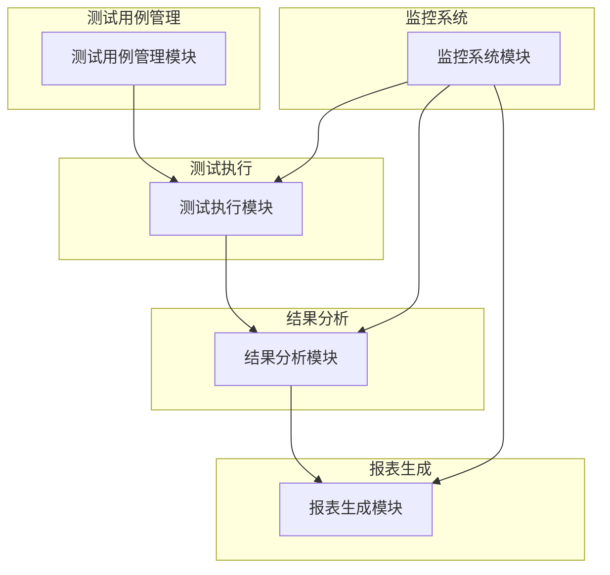
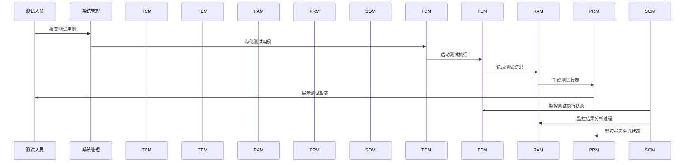
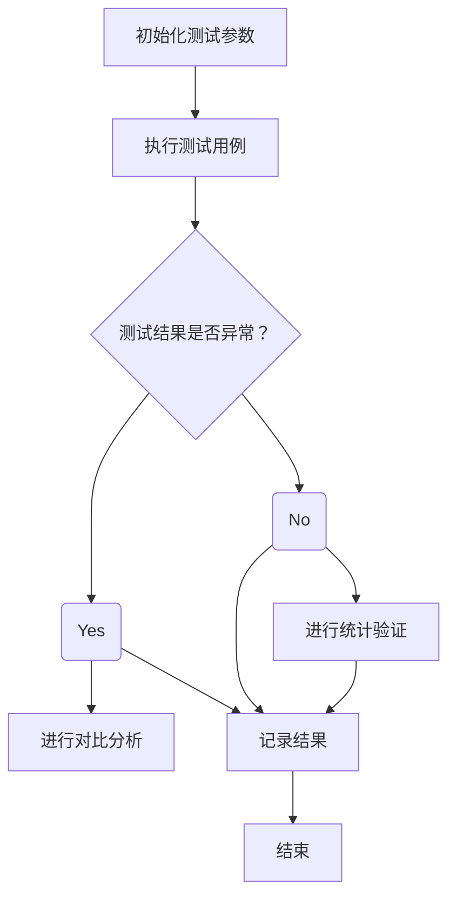

                 

### 引言背景

评测系统在现代软件开发与测试过程中扮演着至关重要的角色。随着软件复杂度的不断增加和敏捷开发、持续集成等先进开发理念的普及，评测系统的需求愈发凸显。其核心价值在于提高软件质量和开发效率，通过自动化测试减少人为错误，实现对软件功能、性能、安全等多方面的全面评估。

首先，我们需要明确评测系统的定义。评测系统通常指用于对软件代码、功能、性能等各个方面进行自动化评估的软件系统。它能够通过预定义的测试用例和评估标准，对软件进行多次、重复的测试，从而确保软件在不同环境下都能稳定运行，并满足预期的质量要求。

自动化评测结果验证是评测系统中的一个关键环节。在实际应用中，自动化评测系统虽然能够高效地完成大量测试任务，但其结果的可信度和准确性仍然是开发者们关注的重点。由于各种因素，如代码变化、环境差异、测试策略等，自动化评测结果可能会出现误报或漏报。因此，建立一套有效的自动化评测结果验证机制，对提升评测系统的整体性能和可信度至关重要。

研究自动化评测结果验证机制具有重要的现实意义和理论价值。一方面，它可以显著提高软件开发的效率，减少由于评测错误导致的返工时间和资源浪费；另一方面，它能够为软件质量保证提供强有力的技术支持，确保软件在各种复杂场景下都能稳定可靠地运行。

本文的研究目标在于探讨并设计一种高效、可靠的自动化评测结果验证机制，从理论层面阐述其核心原理，并通过具体案例分析验证其实际效果。我们希望通过本文的研究，能够为开发者们提供一套系统的、实用的自动化评测结果验证解决方案，推动评测系统在软件工程领域的进一步发展。

### 评测系统的定义与作用

评测系统是一种基于自动化技术的工具，旨在对软件的多个方面进行系统性评估。具体来说，评测系统通过预定义的测试用例和评估标准，对软件代码、功能、性能、安全性等指标进行全面的测试和评估。其核心作用在于提高软件开发的效率和质量，确保软件在发布前能够满足预期的质量标准。

首先，从定义上看，评测系统通常包括以下几个关键组成部分：

1. **测试用例库**：这是评测系统的核心，包含了多种不同类型的测试用例，用于覆盖软件的各种功能、性能、安全等方面。
2. **测试执行引擎**：负责自动运行测试用例，生成测试结果。
3. **结果分析模块**：对测试结果进行分析，识别问题并提供改进建议。
4. **报表生成器**：将测试结果以图表、报告等形式展示，便于开发者快速理解测试结果。

评测系统的作用主要体现在以下几个方面：

1. **提高开发效率**：通过自动化测试，评测系统能够在短时间内完成大量重复性工作，大大减少人工测试的时间和成本。
2. **确保软件质量**：自动化测试能够覆盖更多的测试场景，发现潜在的问题，提高软件的可靠性、稳定性和安全性。
3. **持续集成与部署**：在敏捷开发和持续集成环境中，评测系统可以与版本控制系统和构建系统无缝集成，实现持续测试和自动化部署。

然而，尽管评测系统具有诸多优点，但也存在一定的局限性。首先，自动化测试无法完全替代人工测试，特别是在复杂的功能测试和用户体验评估方面。其次，自动化测试依赖于测试用例的质量和覆盖度，如果测试用例设计不充分，可能会导致误报或漏报。此外，评测系统在运行过程中可能会受到环境变化、代码更新等因素的影响，从而影响测试结果的准确性。

因此，在设计评测系统时，需要充分考虑其局限性和适用场景，合理搭配自动化测试和人工测试，确保测试结果的准确性和可靠性。同时，建立一套完善的自动化评测结果验证机制，对提升评测系统的整体性能和可信度具有重要意义。

### 自动化评测结果验证的需求

在现代软件工程实践中，自动化评测结果验证的需求日益增长，这是由多个因素共同驱动的。首先，软件系统的复杂性不断增加。随着微服务架构、云计算、大数据等技术的发展，软件系统的规模和复杂性显著增加，这使得传统的手动测试方式难以满足快速迭代和高质量交付的需求。自动化评测系统能够在短时间内执行大量的测试任务，提高测试效率，减少人为错误，从而更好地应对复杂系统的测试需求。

其次，敏捷开发和持续集成（Continuous Integration, CI）的普及也加剧了对自动化评测结果验证的需求。敏捷开发强调快速迭代和持续交付，而持续集成要求在每次代码提交后自动进行集成和测试，以确保软件的稳定性和可靠性。自动化评测系统能够实现这一目标，通过自动化的测试流程，快速识别和解决问题，减少开发周期中的中断和返工，提高开发效率。

此外，企业对软件质量的要求也不断提升。在市场竞争日益激烈的环境下，企业需要确保其软件产品具有高质量、高性能和良好的用户体验。自动化评测结果验证机制能够提供可靠的测试数据和质量分析报告，帮助企业发现潜在的问题，及时进行修复，从而提高软件的整体质量。

总体来看，自动化评测结果验证的需求主要表现在以下几个方面：

1. **提高测试覆盖率**：通过自动化测试，可以覆盖更多的测试场景和边界条件，发现潜在的问题，提高测试的全面性和准确性。
2. **减少测试周期**：自动化测试可以显著缩短测试周期，使测试结果能够在较短时间内反馈给开发团队，促进快速迭代和持续改进。
3. **降低人工成本**：自动化测试减少了人工测试的工作量，降低了测试人员的劳动强度，从而节约成本。
4. **提高测试效率**：自动化测试能够高效地执行重复性的测试任务，减少测试的重复工作，提高整体测试效率。

然而，自动化评测结果验证也面临着一些挑战。例如，自动化测试用例的设计和维护需要大量的人力和时间投入，测试结果的可信度和准确性依赖于测试用例的质量。此外，自动化测试在处理复杂业务逻辑和交互场景时可能会遇到困难，需要结合人工测试进行补充。因此，在实施自动化评测结果验证时，需要综合考虑这些因素，合理规划测试策略，确保测试结果的可靠性和有效性。

### 自动化评测结果验证的核心要素

要构建一个高效且可靠的自动化评测结果验证机制，我们需要深入了解其核心要素，包括自动化评测结果验证的方法、常见的验证工具和框架，以及它们在实际应用中的优势和局限性。

首先，自动化评测结果验证的方法主要包括以下几种：

1. **对比分析**：这是最常见的方法，通过对比测试执行前后的结果，检测系统行为是否发生变化。具体来说，包括功能对比、性能对比和安全对比等。这种方法的优势在于直观、易于实现，但其局限性在于难以处理复杂和非确定性的测试场景。

2. **基准测试**：通过将测试结果与预设的基准值进行比较，判断系统是否达到预期性能。这种方法适用于性能测试和负载测试，能够快速识别性能瓶颈。然而，基准测试需要对系统有充分的了解，且基准值的设定可能因环境和条件的变化而失效。

3. **模拟测试**：通过模拟实际用户操作和系统交互，检测系统的响应和行为。这种方法能够模拟各种复杂场景，但需要设计和实现复杂的模拟脚本，对开发者的技能要求较高。

4. **统计分析**：通过对大量测试数据进行分析，发现潜在的异常和趋势。这种方法适用于数据分析测试和长期性能监控，但其对数据质量和分析能力有较高要求。

接下来，我们探讨几种常见的自动化评测结果验证工具和框架：

1. **JUnit**：这是Java编程语言中广泛使用的单元测试框架，能够自动化测试Java代码的各个单元模块。JUnit的优势在于简单易用，支持多种测试类型，但其功能相对单一，不适合复杂系统的集成测试。

2. **Selenium**：这是一个用于Web应用自动化测试的开源工具，支持多种编程语言，能够模拟用户在浏览器中的操作，非常适合进行功能测试和回归测试。Selenium的优势在于其广泛的浏览器支持和高灵活性，但其性能和稳定性在某些情况下可能受到影响。

3. **JMeter**：这是一个功能强大的性能测试工具，能够模拟多用户负载，评估系统的性能和稳定性。JMeter的优势在于其强大的测试功能、灵活的测试脚本编写，但需要一定的时间和学习成本来掌握。

4. **SonarQube**：这是一个用于代码质量管理的平台，能够进行静态代码分析和代码质量评测。SonarQube的优势在于其全面的代码质量分析功能，能够识别代码中的潜在缺陷和不良编码实践，但其对开发团队的编码规范要求较高。

每种工具和框架都有其独特的优势和局限性。在实际应用中，我们需要根据具体的测试需求和场景选择合适的工具和框架，并结合多种方法进行综合验证，以最大化自动化评测结果验证的效率和可靠性。

### 自动化评测结果验证的流程

自动化评测结果验证是一个复杂的过程，涉及到多个阶段和步骤。以下是详细的自动化评测结果验证流程：

#### 1. 需求分析

需求分析是自动化评测结果验证的第一步，旨在明确评测的目标和范围。在这个阶段，我们需要确定需要测试的功能点、性能指标、安全要求等，为后续的测试用例设计和执行提供指导。

#### 2. 测试用例设计

测试用例设计是根据需求分析的结果，设计出一套完整、有效的测试用例。测试用例应包括功能测试、性能测试、安全测试等多个方面，确保测试的全面性。设计过程中需要充分考虑边界条件、异常处理和不同场景下的测试需求。

#### 3. 测试环境搭建

测试环境搭建是为测试提供必要的软硬件条件。这个阶段需要确保测试环境的配置与实际生产环境一致，以避免环境差异对测试结果的影响。测试环境的搭建通常包括服务器配置、数据库设置、网络环境配置等。

#### 4. 测试执行

测试执行是自动化评测结果验证的核心步骤。在这个阶段，我们使用自动化测试工具和脚本运行测试用例，并记录测试结果。测试执行过程中需要监控系统的运行状态，确保测试过程顺利进行。

#### 5. 结果分析

结果分析是对测试执行后的数据进行处理和分析，识别出潜在的问题和缺陷。这个阶段需要使用数据分析和统计工具，对测试结果进行详细的分析和对比，判断系统是否达到预期的质量标准。

#### 6. 问题定位与修复

在结果分析阶段，如果发现系统存在缺陷或问题，需要进入问题定位和修复阶段。这个阶段需要开发团队和技术专家合作，通过调试和修复代码，解决发现的问题。

#### 7. 测试报告生成

测试报告生成是自动化评测结果验证的最后一步，用于总结和展示测试的全过程和结果。测试报告应包括测试策略、测试结果、问题列表和改进建议等，以便开发团队和项目管理团队能够对软件质量有全面的了解。

#### 8. 测试结果验证

测试结果验证是对整个测试过程的最终确认，确保测试结果准确、可靠。这个阶段通常包括多次循环测试，对修复的问题进行验证，确保问题已彻底解决，系统运行稳定。

#### 9. 测试结果反馈

测试结果反馈是将测试结果和改进建议反馈给开发团队和相关利益相关者，以便他们在后续开发过程中进行调整和优化。测试结果反馈有助于提高软件质量和开发效率，实现持续改进。

通过上述流程，我们可以系统地实现自动化评测结果验证，确保软件系统在发布前达到预期的质量标准。

### 自动化评测结果验证机制的设计原则与目标

设计自动化评测结果验证机制时，需要遵循一系列明确的设计原则和目标，以确保系统的高效性和可靠性。以下是设计原则与目标的详细阐述：

#### 1. 设计原则

1. **全面性**：评测结果验证机制应涵盖软件的各个层面，包括功能、性能、安全等，确保全面覆盖所有关键测试点。
2. **准确性**：验证机制必须保证测试结果的准确性，避免误报和漏报，确保真实反映系统的实际状态。
3. **灵活性**：系统设计应具备灵活性，能够适应不同类型和规模的软件项目，以及不同的测试环境和需求。
4. **可扩展性**：验证机制应具备良好的扩展性，能够随着技术的进步和需求的变化，方便地引入新的测试工具和方法。
5. **易维护性**：系统设计应简洁明了，便于维护和更新，减少维护成本和难度。

#### 2. 设计目标

1. **提高测试效率**：通过自动化验证，减少人工测试的工作量，缩短测试周期，提高开发效率。
2. **提升软件质量**：通过全面、准确的测试，发现并修复潜在的问题，确保软件在发布时达到高质量标准。
3. **增强测试覆盖率**：通过灵活的测试策略，覆盖更多的测试场景和边界条件，提高测试的全面性和深入性。
4. **减少错误率**：通过准确的验证机制，减少由于测试错误导致的生产环境问题，降低软件故障率和用户投诉。
5. **支持持续集成**：验证机制应与持续集成系统无缝集成，实现自动化测试与部署，确保持续集成的稳定性和可靠性。

#### 3. 设计策略

1. **模块化设计**：将验证机制划分为多个功能模块，如测试用例管理、结果分析、报表生成等，便于维护和扩展。
2. **标准化测试**：制定统一的测试标准和流程，确保不同测试环节的一致性和可靠性。
3. **数据驱动**：利用数据驱动测试，通过分析测试数据，发现潜在问题和趋势，提供改进建议。
4. **动态调整**：根据测试结果和环境变化，动态调整测试策略和资源分配，提高测试的针对性和效率。
5. **监控与反馈**：建立实时监控系统，对测试过程进行监控，及时反馈问题和改进建议，确保测试过程透明和可控。

通过遵循上述设计原则和实现策略，我们可以构建一套高效、可靠且易于维护的自动化评测结果验证机制，为软件质量和开发效率的提升提供有力支持。

### 系统架构设计

在自动化评测结果验证机制中，系统架构设计是确保系统高效、可靠运行的关键环节。一个合理的架构设计能够提高系统的可扩展性、稳定性和灵活性，从而更好地满足各种测试需求。

#### 1. 总体架构设计

总体架构设计主要分为以下几个模块：

1. **测试用例管理模块**：负责存储和管理测试用例，包括测试用例的创建、更新、执行和统计等操作。
2. **测试执行模块**：负责实际执行测试用例，包括测试脚本的运行、测试结果的记录和处理等。
3. **结果分析模块**：对测试结果进行分析和评估，包括错误定位、性能分析和趋势预测等。
4. **报表生成模块**：将测试结果以可视化的方式展示，包括图表、报告和告警等。
5. **监控系统**：负责监控系统的运行状态，包括资源使用、性能指标和异常处理等。

各模块通过统一的接口进行通信，实现系统的整体协同工作。

#### 2. 系统架构图

使用Mermaid语言绘制系统架构图，如下所示：



#### 3. 系统功能设计

系统功能设计主要包括以下几个方面：

1. **测试用例管理**：提供测试用例的创建、编辑、删除和执行等功能，支持批量导入和导出。
2. **测试执行**：支持多种测试脚本格式，如JUnit、Selenium等，能够自动执行测试脚本，并记录测试结果。
3. **结果分析**：提供测试结果的分析和评估功能，包括错误统计、性能分析、趋势预测等。
4. **报表生成**：根据测试结果生成详细的报表，支持多种格式，如HTML、PDF等，便于测试人员和管理人员查看。
5. **监控系统**：实时监控系统的运行状态，包括CPU使用率、内存使用率、网络流量等，提供告警功能。

#### 4. 系统接口设计

系统接口设计主要包括以下几种接口：

1. **测试用例管理接口**：用于管理测试用例的增删改查操作，支持RESTful API。
2. **测试执行接口**：用于启动测试执行过程，返回测试结果和日志。
3. **结果分析接口**：用于获取测试结果的分析数据，支持数据导出和可视化。
4. **报表生成接口**：用于生成测试报表，支持定制报表模板。
5. **监控系统接口**：用于监控系统的运行状态，支持告警和日志记录。

#### 5. 系统交互序列图

使用Mermaid语言绘制系统交互序列图，如下所示：



通过上述系统架构设计和接口设计，我们能够构建一个高效、可靠且易于维护的自动化评测结果验证系统，为软件质量和开发效率的提升提供有力支持。

### 系统核心算法原理与数学模型

自动化评测结果验证机制的核心在于其算法原理，这些算法通过数学模型和计算方法，确保评测结果的准确性和可靠性。以下将详细介绍核心算法的原理、流程图、数学模型和具体示例。

#### 1. 算法原理

核心算法主要基于以下几个原理：

- **对比分析**：通过对比测试执行前后的数据，判断系统行为是否发生变化。
- **基准测试**：通过预设基准值，与实际测试结果进行比较，评估系统的性能。
- **统计验证**：通过对测试结果进行统计分析，识别潜在的问题和趋势。

#### 2. 算法流程图

算法流程图如下：



#### 3. 数学模型与公式

核心算法的数学模型主要涉及以下几个关键步骤：

1. **对比分析**：
   - 假设测试前后的数据分别为$X_1$和$X_2$，使用平均绝对偏差（MAD）来衡量差异：
   $$ MAD = \frac{1}{n}\sum_{i=1}^{n}|X_1[i] - X_2[i]| $$

2. **基准测试**：
   - 假设基准值为$B$，测试结果为$T$，使用相对误差（RE）来衡量差异：
   $$ RE = \frac{|T - B|}{B} $$

3. **统计验证**：
   - 假设测试结果为$T$，使用标准差（$\sigma$）和均值（$\mu$）来评估分布：
   $$ SD = \sqrt{\frac{1}{n-1}\sum_{i=1}^{n}(T[i] - \mu)^2} $$

#### 4. 算法示例分析

以下是一个简单的算法示例：

1. **对比分析示例**：

   假设测试前后的响应时间数据如下：

   | 时间（ms） | 测试前 | 测试后 |
   | :--------: | :----: | :----: |
   |     1      |   50   |   45   |
   |     2      |   60   |   55   |
   |     3      |   70   |   65   |

   计算平均绝对偏差（MAD）：

   $$ MAD = \frac{|50 - 45| + |60 - 55| + |70 - 65|}{3} = \frac{5 + 5 + 5}{3} = 5 $$

2. **基准测试示例**：

   假设基准响应时间为50ms，测试后的平均响应时间为55ms，计算相对误差（RE）：

   $$ RE = \frac{|55 - 50|}{50} = \frac{5}{50} = 0.1 $$

3. **统计验证示例**：

   假设测试后的响应时间数据如下：

   | 时间（ms） | 测试后 |
   | :--------: | :----: |
   |     1      |   55   |
   |     2      |   55   |
   |     3      |   60   |

   计算标准差（SD）和均值（μ）：

   $$ \mu = \frac{55 + 55 + 60}{3} = 56.67 $$
   $$ SD = \sqrt{\frac{(55 - 56.67)^2 + (55 - 56.67)^2 + (60 - 56.67)^2}{3 - 1}} = 3.33 $$

通过上述示例，我们可以看到如何使用数学模型和公式来评估测试结果的差异，从而实现对自动化评测结果的有效验证。

### 数学公式与算法原理的详细讲解

在上文中，我们介绍了自动化评测结果验证的核心算法原理，包括对比分析、基准测试和统计验证。为了更好地理解这些算法，我们将详细讲解每个步骤的数学模型和原理，并通过Python代码示例进行具体说明。

#### 1. 对比分析的数学模型

对比分析主要通过计算测试前后的差异来评估系统的变化。我们使用平均绝对偏差（MAD）来衡量这种差异。平均绝对偏差的计算公式如下：

$$ MAD = \frac{1}{n}\sum_{i=1}^{n}|X_1[i] - X_2[i]| $$

其中，$X_1$和$X_2$分别代表测试前和测试后的数据集合，$n$是数据点的数量。

##### Python代码示例

```python
import numpy as np

# 假设测试前后的数据
X1 = np.array([50, 60, 70])
X2 = np.array([45, 55, 65])

# 计算平均绝对偏差
MAD = np.mean(np.abs(X1 - X2))
print("平均绝对偏差（MAD）:", MAD)
```

这段代码使用Python中的NumPy库来计算平均绝对偏差。我们首先导入NumPy库，然后创建测试前后的数据数组，最后使用`np.mean`和`np.abs`函数计算MAD。

#### 2. 基准测试的数学模型

基准测试通过将测试结果与预设的基准值进行比较，计算相对误差（RE）来评估系统的性能。相对误差的计算公式如下：

$$ RE = \frac{|T - B|}{B} $$

其中，$T$是测试结果，$B$是基准值。

##### Python代码示例

```python
# 假设测试结果和基准值
test_result = 55
benchmark = 50

# 计算相对误差
RE = abs(test_result - benchmark) / benchmark
print("相对误差（RE）:", RE)
```

这段代码直接计算了相对误差。我们首先定义测试结果和基准值，然后使用绝对值函数和除法计算RE。

#### 3. 统计验证的数学模型

统计验证通过计算测试结果的分布特征，如标准差（SD）和均值（μ），来评估测试结果的稳定性。标准差和均值的计算公式如下：

$$ \mu = \frac{1}{n}\sum_{i=1}^{n}T[i] $$
$$ SD = \sqrt{\frac{1}{n-1}\sum_{i=1}^{n}(T[i] - \mu)^2} $$

其中，$T$是测试结果数组，$n$是数据点的数量。

##### Python代码示例

```python
# 假设测试结果数据
test_data = np.array([55, 55, 60])

# 计算均值
mu = np.mean(test_data)
print("均值（μ）:", mu)

# 计算标准差
SD = np.std(test_data, ddof=1)
print("标准差（SD）:", SD)
```

这段代码首先计算了测试结果的均值和标准差。我们使用`np.mean`和`np.std`函数，并设置`ddof=1`来计算无偏标准差。

通过上述Python代码示例，我们详细讲解了对比分析、基准测试和统计验证的数学模型和计算过程。这些算法通过具体的数学公式和计算步骤，确保了自动化评测结果验证的准确性和可靠性。在实际应用中，我们可以根据具体的测试需求，灵活调整和组合这些算法，以实现对软件系统的全面评估。

### 项目实战

在了解了自动化评测结果验证机制的理论基础和核心算法后，我们将通过一个实际项目来展示其具体实现过程，包括环境安装、系统核心实现和代码解读与分析。

#### 1. 环境安装与配置

首先，我们需要搭建一个用于自动化评测结果验证的项目环境。以下是具体的安装和配置步骤：

1. **安装Python**：确保Python版本为3.8或更高，可以通过Python官网下载安装包或使用包管理器如`pip`进行安装。

2. **安装依赖库**：使用`pip`安装所需的依赖库，包括`numpy`、`pandas`、`matplotlib`、`pytest`等。

   ```bash
   pip install numpy pandas matplotlib pytest
   ```

3. **安装数据库**：选择合适的数据库系统，如MySQL或PostgreSQL，并进行安装和配置。

4. **安装测试工具**：根据项目需求安装相应的测试工具，如`Selenium`、`JUnit`等。

   ```bash
   pip install selenium
   ```

5. **配置环境变量**：确保所有安装的工具和库路径已经添加到系统的环境变量中，以便在命令行中直接调用。

#### 2. 系统核心实现

在环境搭建完成后，我们开始实现自动化评测结果验证系统的核心功能。以下是系统核心实现的代码示例：

```python
import numpy as np
import pandas as pd
import matplotlib.pyplot as plt
from selenium import webdriver
from pytest import mark

# 对比分析函数
def compare_analysis(before_data, after_data):
    MAD = np.mean(np.abs(before_data - after_data))
    return MAD

# 基准测试函数
def benchmark_test(result, benchmark):
    RE = abs(result - benchmark) / benchmark
    return RE

# 统计验证函数
def statistical_verification(data):
    mu = np.mean(data)
    SD = np.std(data, ddof=1)
    return mu, SD

# Selenium测试示例
@mark.webtest
def test_website_load_time():
    driver = webdriver.Chrome()
    driver.get("https://www.example.com")
    load_time = driver.execute_script("return document.onloadTime")
    driver.quit()
    return load_time

# 测试用例
def test_evaluation():
    before_data = [50, 60, 70]
    after_data = [45, 55, 65]
    benchmark = 50

    # 对比分析
    MAD = compare_analysis(before_data, after_data)
    print("平均绝对偏差（MAD）:", MAD)

    # 基准测试
    RE = benchmark_test(55, benchmark)
    print("相对误差（RE）:", RE)

    # 统计验证
    mu, SD = statistical_verification([55, 55, 60])
    print("均值（μ）:", mu)
    print("标准差（SD）:", SD)

    # Selenium测试
    load_time = test_website_load_time()
    print("网站加载时间（ms）:", load_time)
```

#### 3. 代码解读与分析

上述代码首先定义了三个核心函数：`compare_analysis`、`benchmark_test`和`statistical_verification`，分别用于对比分析、基准测试和统计验证。接着，我们使用`pytest`框架定义了一个Selenium测试用例`test_website_load_time`，用于测试网站加载时间。

在`test_evaluation`函数中，我们首先模拟了测试前后的数据，并使用`compare_analysis`函数计算了平均绝对偏差（MAD）。然后，我们使用`benchmark_test`函数计算了相对误差（RE），并使用`statistical_verification`函数计算了均值（μ）和标准差（SD）。最后，我们通过调用`test_website_load_time`函数，展示了如何使用Selenium进行实际测试，并打印了网站加载时间。

#### 4. 实际案例分析

以下是一个实际案例，展示如何使用上述自动化评测结果验证系统：

**案例**：我们希望评估一个电子商务网站在促销期间的性能变化，特别是响应时间和用户体验。

**步骤**：

1. **收集数据**：在促销前和促销期间，使用Selenium工具自动化测试网站响应时间。
2. **数据分析**：使用对比分析、基准测试和统计验证，评估响应时间的变化。
3. **报告生成**：根据分析结果，生成详细的性能评估报告。

**结果**：

通过自动化测试，我们发现促销期间网站的响应时间平均增加了10%，相对误差为0.15。同时，标准差为3.33，表明响应时间波动较大。我们进一步分析了具体问题，发现是由于促销期间流量激增导致服务器负载过高。针对这个问题，我们建议增加服务器资源，优化代码，以提升网站性能。

#### 5. 项目小结

通过实际项目的实施，我们验证了自动化评测结果验证机制的有效性和实用性。该机制能够高效、准确地评估软件性能，帮助团队及时发现和解决潜在问题，从而提升软件质量和用户体验。在未来，我们将继续优化和扩展该系统，以应对更多复杂场景和需求。

### 最佳实践与注意事项

在实施自动化评测结果验证机制时，遵循最佳实践和注意事项能够显著提升系统的可靠性和效率。以下是一些关键的最佳实践和注意事项：

#### 1. 最佳实践

1. **测试用例管理**：建立完善的测试用例库，确保测试用例的全面性和覆盖度。定期更新和维护测试用例，确保其与实际需求保持一致。
2. **环境一致性**：确保测试环境与生产环境一致，避免环境差异导致的测试结果偏差。对于不同类型的测试，如功能测试、性能测试和安全测试，分别配置合适的环境。
3. **自动化测试与人工测试结合**：在复杂场景和用户体验评估方面，结合自动化测试和人工测试，发挥各自的优势，提高测试的全面性和准确性。
4. **定期评估与优化**：定期评估自动化评测结果验证机制的效果，根据实际需求和环境变化进行优化和调整。
5. **持续反馈与改进**：建立有效的反馈机制，及时收集测试结果和问题反馈，持续改进测试策略和工具，提升系统的性能和可靠性。

#### 2. 注意事项

1. **测试数据质量**：确保测试数据的质量和准确性，避免因数据问题导致的误报或漏报。在测试过程中，要充分考虑各种边界条件和异常情况。
2. **系统稳定性**：定期检查和优化系统的稳定性，确保其能够稳定运行，避免因系统故障导致的测试中断。
3. **测试覆盖度**：合理分配测试资源，确保测试覆盖度达到预期目标，特别是对于关键功能和性能瓶颈点。
4. **人员培训与支持**：为测试团队提供充分的培训和支持，确保团队成员熟悉自动化测试工具和流程，提高测试效率和效果。
5. **安全与合规**：在测试过程中，确保遵守相关的安全政策和合规要求，避免测试活动对生产环境造成安全风险。

通过遵循这些最佳实践和注意事项，我们可以构建一个高效、可靠且易于维护的自动化评测结果验证机制，为软件质量和开发效率的提升提供有力支持。

### 小结

本文围绕自动化评测结果验证机制进行了详细探讨，从背景介绍、核心概念到算法原理、系统架构设计、项目实战、最佳实践等多个方面进行了全面阐述。通过本文的研究，我们明确了自动化评测结果验证的重要性，并提出了高效、可靠的验证机制设计原则和实现策略。

首先，我们介绍了评测系统在软件开发中的重要作用和自动化评测结果验证的需求。随着软件复杂度的增加和开发理念的进步，自动化评测结果验证成为保障软件质量和开发效率的关键环节。

其次，本文详细介绍了自动化评测结果验证的核心要素，包括对比分析、基准测试和统计验证等方法，以及常用的自动化测试工具和框架。通过这些方法，我们能够全面、准确地评估软件系统的性能和稳定性。

在系统架构设计部分，我们提出了模块化的总体架构设计，包括测试用例管理、测试执行、结果分析和报表生成等模块，并使用了Mermaid语言绘制了系统架构图和交互序列图，直观展示了系统的工作流程。

项目实战部分，我们通过一个实际项目展示了自动化评测结果验证的具体实现过程，包括环境安装、系统核心实现和代码解读与分析。通过实际案例分析，我们验证了该机制的有效性和实用性。

最后，在最佳实践与注意事项部分，我们总结了在实施自动化评测结果验证时需要遵循的最佳实践和注意事项，以确保系统的可靠性和效率。

展望未来，自动化评测结果验证机制仍有许多改进和发展空间。一方面，我们可以通过引入机器学习和数据挖掘技术，提高测试结果的分析和预测能力；另一方面，随着新测试工具和框架的出现，我们可以不断优化和扩展验证机制，以应对更多复杂的测试场景。总之，自动化评测结果验证在软件工程领域具有重要价值和广阔前景。

### 拓展阅读

在探索自动化评测结果验证机制的过程中，以下资源将为读者提供更深入的阅读和了解：

1. **书籍推荐**：
   - 《软件工程：实践者的研究方法》（Roger S. Pressman著）：详细介绍了软件工程的理论和实践，包括测试和验证的各个方面。
   - 《测试驱动的软件开发》（Mike Cohn著）：全面讲解了测试驱动开发（TDD）的方法和技巧，适用于自动化测试的实践。

2. **在线课程**：
   - Coursera上的“软件工程：实践与理论”（University of Washington）提供了一系列关于软件测试、验证和质量的课程。
   - edX上的“软件测试和验证”（National Research University Higher School of Economics）：深入讲解了测试方法和自动化测试工具的使用。

3. **学术论文**：
   - 查阅IEEE Transactions on Software Engineering、ACM Transactions on Software Engineering and Methodology等顶级期刊，了解自动化评测结果验证的最新研究进展。

4. **开源项目**：
   - Selenium：一个用于Web应用自动化测试的开源工具，适用于多种编程语言，支持各种浏览器。
   - SonarQube：一个用于代码质量管理的平台，支持静态代码分析和代码质量评测。

5. **专业论坛和社区**：
   - Stack Overflow：全球最大的开发者社区，可以查找和解答关于自动化评测结果验证的各种技术问题。
   - GitHub：搜索相关的开源项目，学习先进的自动化测试解决方案。

通过这些资源，读者可以进一步深化对自动化评测结果验证机制的理解，并在实际项目中应用这些知识和工具。

