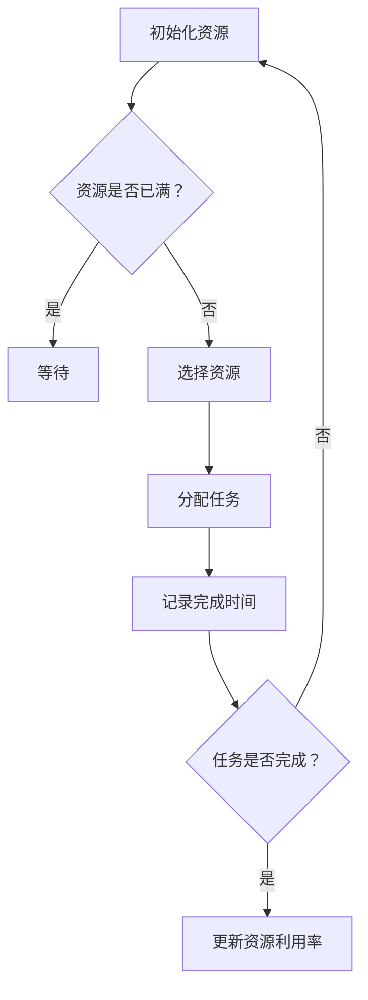
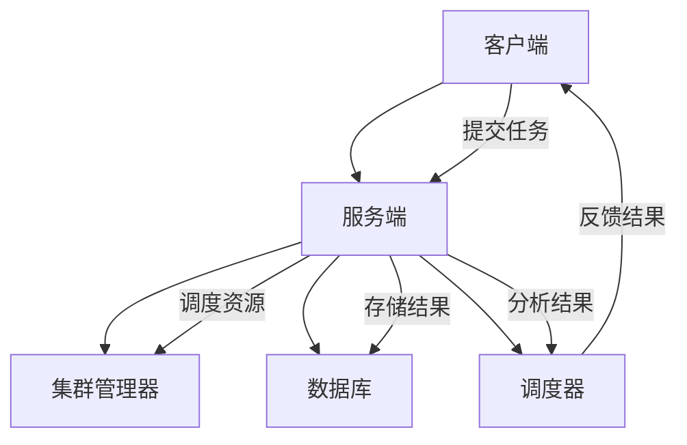

                 

# 评测系统的自动化评测资源调度优化

## 关键词
- 评测系统
- 自动化评测
- 资源调度
- 优化算法
- 数学模型

## 摘要
本文将探讨评测系统中自动化评测资源调度的优化问题。首先，我们将介绍评测系统的背景和问题，然后深入分析自动化评测资源调度的基础概念，包括资源、调度策略和优化目标。接下来，我们将介绍现有的评测资源调度算法，并使用数学模型和公式来描述这些算法。随后，我们将通过具体的Python代码和mermaid流程图，详细解释算法原理，并通过实例进行说明。接着，我们将讨论评测系统的架构设计和系统接口设计，并展示系统交互的序列图。最后，我们将通过一个实际项目实战，展示如何应用这些优化方法，并总结最佳实践和注意事项。

## 引言

### 背景
评测系统在软件开发、测试和性能评估中扮演着重要角色。随着软件系统的复杂性和规模不断扩大，传统的手动评测方法已经难以满足需求。自动化评测作为一种新兴技术，通过自动化工具和算法，能够高效、准确地完成大量测试任务，从而提高开发效率和质量。

### 问题背景
然而，现有的评测系统在资源调度方面存在一些问题。首先，资源利用率不高，可能导致某些资源长期闲置，而其他资源却负荷过重。其次，评测任务的优先级处理不当，可能导致关键任务延误。此外，系统缺乏对资源负载的实时监测和动态调整能力，难以应对突发情况。

### 问题描述
本文主要解决的问题是：如何通过自动化技术，优化评测系统的资源调度，提高资源利用率，确保任务按时完成。

### 问题解决
本文将提出一种基于数学模型和优化算法的自动化评测资源调度方法，并通过Python代码和mermaid流程图进行详细解释。同时，我们将介绍评测系统的架构设计和系统接口设计，确保调度策略在实际应用中的有效性和灵活性。

### 边界与外延
本文主要关注通用评测系统的资源调度问题，不涉及特定领域或特殊场景的调度策略。此外，本文的优化方法适用于大规模评测系统，但不适用于小型或单机部署的系统。

## 1. 自动化评测资源调度的基础概念

### 资源
资源是评测系统中可以进行调度和分配的基本单元。常见的资源包括计算资源（如CPU、内存）、存储资源和网络资源。在自动化评测中，资源通常由集群管理器（如Kubernetes）进行管理和分配。

### 调度策略
调度策略是决定如何分配和调整资源的方法。常见的调度策略包括负载均衡策略、优先级策略和弹性调度策略。负载均衡策略通过将任务分配到负载最低的资源上，确保资源利用率最大化。优先级策略根据任务的重要性和紧急程度进行调度，确保关键任务优先执行。弹性调度策略根据资源的实际负载动态调整任务分配，以应对负载变化。

### 优化目标
优化目标是在满足任务约束和系统性能的前提下，最大化资源利用率，提高系统的响应速度和稳定性。常见的优化目标包括最小化任务完成时间、最大化资源利用率、最小化平均响应时间和最大化系统吞吐量。

## 2. 现有的评测资源调度算法

### 负载均衡算法
负载均衡算法通过将任务分配到负载最低的资源上，确保资源利用率最大化。常见的负载均衡算法包括轮询算法、最少连接算法和响应时间算法。

- **轮询算法**：将任务依次分配到所有资源上，直到所有资源都被使用。
  $$ \text{resource\_index} = (\text{current\_index} + 1) \mod \text{resource\_count} $$
- **最少连接算法**：将任务分配到当前连接数最少（负载最低）的资源上。
  $$ \text{resource\_index} = \min(\{\text{connection}\}) $$
- **响应时间算法**：将任务分配到响应时间最短的资源上。
  $$ \text{response\_time} = \min(\{\text{response\_time}\}) $$

### 优先级调度算法
优先级调度算法根据任务的重要性和紧急程度进行调度，确保关键任务优先执行。常见的优先级调度算法包括基于优先级队列的调度算法和基于截止时间的调度算法。

- **基于优先级队列的调度算法**：将任务按照优先级排序，优先级高的任务先执行。
  $$ \text{优先级队列：} \{(\text{task}_1, \text{priority}_1), (\text{task}_2, \text{priority}_2), \ldots\} $$
- **基于截止时间的调度算法**：将任务按照截止时间排序，截止时间早的任务先执行。
  $$ \text{截止时间队列：} \{(\text{task}_1, \text{deadline}_1), (\text{task}_2, \text{deadline}_2), \ldots\} $$

### 弹性调度算法
弹性调度算法根据资源的实际负载动态调整任务分配，以应对负载变化。常见的弹性调度算法包括动态负载均衡算法和自适应调度算法。

- **动态负载均衡算法**：实时监测资源负载，根据负载变化动态调整任务分配。
  $$ \text{load} = \frac{\sum_{i=1}^{n} \text{resource\_utilization}_i}{n} $$
- **自适应调度算法**：根据历史负载数据和当前负载情况，自适应调整任务分配策略。
  $$ \text{策略调整} = f(\text{历史负载}, \text{当前负载}) $$

## 3. 数学模型和公式

### 资源利用率
资源利用率是衡量资源使用效率的重要指标。资源利用率可以通过以下公式计算：
$$ \text{resource\_utilization} = \frac{\text{used\_resources}}{\text{total\_resources}} $$
其中，$ \text{used\_resources} $ 表示已使用的资源，$ \text{total\_resources} $ 表示总资源。

### 任务完成时间
任务完成时间是衡量任务执行速度的重要指标。任务完成时间可以通过以下公式计算：
$$ \text{completion\_time} = \text{start\_time} + \text{execution\_time} $$
其中，$ \text{start\_time} $ 表示任务开始时间，$ \text{execution\_time} $ 表示任务执行时间。

### 吞吐量
吞吐量是衡量系统处理能力的指标。吞吐量可以通过以下公式计算：
$$ \text{throughput} = \frac{\text{completed\_tasks}}{\text{total\_time}} $$
其中，$ \text{completed\_tasks} $ 表示已完成的任务数量，$ \text{total\_time} $ 表示总时间。

### 平均响应时间
平均响应时间是衡量系统响应速度的指标。平均响应时间可以通过以下公式计算：
$$ \text{average\_response\_time} = \frac{\sum_{i=1}^{n} \text{response\_time}_i}{n} $$
其中，$ \text{response\_time}_i $ 表示第 $ i $ 个任务的响应时间，$ n $ 表示任务总数。

## 4. 算法原理讲解

### 算法流程图

使用mermaid绘制算法流程图：



### 算法原理

算法的主要步骤如下：

1. 初始化资源：初始化所有资源的状态，包括已使用资源、总资源等。
2. 选择资源：根据资源负载情况选择一个空闲资源进行任务分配。
3. 分配任务：将任务分配给选择的资源，并更新任务开始时间和资源利用率。
4. 记录完成时间：记录任务完成时间，用于计算平均响应时间和任务完成时间。
5. 任务完成判断：判断任务是否完成，如未完成，返回步骤2；如完成，进行资源更新。
6. 更新资源利用率：根据任务完成情况更新资源利用率，用于后续的资源调度。

### 数学模型和公式

算法中的关键数学模型和公式如下：

- 资源利用率：
  $$ \text{resource\_utilization} = \frac{\text{used\_resources}}{\text{total\_resources}} $$
  
- 任务完成时间：
  $$ \text{completion\_time} = \text{start\_time} + \text{execution\_time} $$

- 吞吐量：
  $$ \text{throughput} = \frac{\text{completed\_tasks}}{\text{total\_time}} $$

- 平均响应时间：
  $$ \text{average\_response\_time} = \frac{\sum_{i=1}^{n} \text{response\_time}_i}{n} $$

### Python代码示例

以下是一个简单的Python代码示例，用于实现上述算法：

```python
import random

class Resource:
    def __init__(self, id, capacity):
        self.id = id
        self.capacity = capacity
        self.used = 0

    def allocate(self, task_size):
        if self.used + task_size <= self.capacity:
            self.used += task_size
            return True
        else:
            return False

    def deallocate(self, task_size):
        self.used -= task_size

def schedule_tasks(tasks, resources):
    for task in tasks:
        assigned = False
        while not assigned:
            assigned = False
            for resource in resources:
                if resource.allocate(task['size']):
                    task['start_time'] = time.time()
                    assigned = True
                    break
            if not assigned:
                time.sleep(1)
        task['completion_time'] = task['start_time'] + task['execution_time']
        print(f"Task {task['id']} completed at {task['completion_time']}")

tasks = [{'id': 1, 'size': 10, 'execution_time': 5}, {'id': 2, 'size': 5, 'execution_time': 3}, {'id': 3, 'size': 8, 'execution_time': 4}]
resources = [Resource(id=i, capacity=10) for i in range(3)]

schedule_tasks(tasks, resources)
```

## 5. 系统分析与架构设计

### 问题场景介绍

在大型软件开发过程中，评测系统用于对代码进行静态和动态分析，以确保代码质量。随着项目规模不断扩大，评测系统需要处理大量的评测任务，对资源的调度和管理提出了更高的要求。本节将介绍一个基于自动化评测资源调度的评测系统架构，以解决资源利用率低、任务延迟等问题。

### 项目介绍

项目名称：高效自动化评测系统

项目目标：通过自动化技术，优化评测资源的调度和管理，提高系统资源利用率，缩短任务完成时间。

### 系统功能设计

系统功能设计包括以下几个方面：

1. 任务管理：包括任务创建、任务分配、任务状态监控和任务完成通知。
2. 资源管理：包括资源注册、资源监控、资源分配和资源回收。
3. 调度管理：包括调度策略配置、调度任务执行和调度结果分析。
4. 数据分析：包括评测结果统计、任务完成情况和资源利用率分析。

### 领域模型

领域模型描述了系统中的核心实体和实体之间的关系。以下是一个简单的领域模型：

```mermaid
classDiagram
    Task <|-- Evaluation
    Resource <|-- Evaluation
    Scheduler <|-- Evaluation
    Evaluation << Entity
    Task << Entity
    Resource << Entity
    Scheduler << Entity

    Evaluation {
        -id: int
        -status: string
        -start_time: datetime
        -completion_time: datetime
    }

    Task {
        -id: int
        -name: string
        -size: int
        -execution_time: int
    }

    Resource {
        -id: int
        -capacity: int
        -used: int
    }

    Scheduler {
        -id: int
        -strategy: string
    }
```

### 系统架构设计

系统架构设计包括以下几个方面：

1. 客户端：用户通过客户端提交评测任务，并接收评测结果。
2. 服务端：负责处理评测任务，调度资源，并返回评测结果。
3. 集群管理器：负责管理集群中的资源，包括资源注册、资源监控和资源分配。
4. 数据库：存储评测任务、评测结果和系统配置信息。

以下是一个简单的系统架构设计：



### 系统接口设计

系统接口设计包括以下几个方面：

1. 任务提交接口：用户通过该接口提交评测任务。
2. 任务状态查询接口：用户通过该接口查询评测任务的状态。
3. 评测结果查询接口：用户通过该接口查询评测结果。
4. 调度策略配置接口：管理员通过该接口配置调度策略。

### 系统交互

系统交互设计描述了任务从提交到完成的整个流程。以下是一个简单的系统交互设计：

```mermaid
sequenceDiagram
    participant User as 用户
    participant Client as 客户端
    participant Server as 服务端
    participant ClusterManager as 集群管理器
    participant Scheduler as 调度器

    User->>Client: 提交任务
    Client->>Server: 提交任务
    Server->>Server: 调度资源
    Server->>ClusterManager: 调度资源
    ClusterManager-->>Server: 回复资源状态
    Server->>Scheduler: 配置调度策略
    Scheduler-->>Server: 回复调度结果
    Server->>Client: 返回任务状态
    Client->>User: 提示任务状态

    note over Server,ClusterManager,Scheduler
        任务执行中...
    end note
```

## 6. 项目实战

### 环境安装

为了搭建一个自动化评测资源调度系统，我们需要安装以下软件和工具：

1. 操作系统：Ubuntu 18.04
2. 服务端：Flask（Python Web框架）
3. 客户端：Postman（API调试工具）
4. 集群管理器：Kubernetes
5. 数据库：SQLite

以下是一个简单的环境安装步骤：

1. 安装操作系统：下载Ubuntu 18.04镜像，并使用虚拟机或物理机安装。
2. 更新操作系统：打开终端，执行以下命令：
   ```bash
   sudo apt update
   sudo apt upgrade
   ```
3. 安装Python环境：执行以下命令：
   ```bash
   sudo apt install python3-pip
   ```
4. 安装Flask：执行以下命令：
   ```bash
   pip3 install flask
   ```
5. 安装Kubernetes：执行以下命令：
   ```bash
   curl -s https://packages.cloud.google.com/apt/doc/apt-key.gpg | sudo apt-key add -
   echo "deb https://apt.kubernetes.io/ kubernetes-xenial main" | sudo tee -a /etc/apt/sources.list.d/kubernetes.list
   sudo apt update
   sudo apt install kubelet kubeadm kubectl
   ```
6. 安装SQLite：执行以下命令：
   ```bash
   sudo apt install sqlite3
   ```
7. 安装Postman：从Postman官网下载安装包，并安装。

### 系统核心实现

以下是一个简单的系统核心实现，包括任务管理、资源管理和调度管理：

#### 任务管理

```python
from flask import Flask, request, jsonify
import sqlite3

app = Flask(__name__)

def init_db():
    conn = sqlite3.connect('evaluation.db')
    c = conn.cursor()
    c.execute('''CREATE TABLE IF NOT EXISTS tasks (
                    id INTEGER PRIMARY KEY AUTOINCREMENT,
                    name TEXT,
                    size INTEGER,
                    execution_time INTEGER,
                    status TEXT)''')
    conn.commit()
    conn.close()

@app.route('/tasks', methods=['POST'])
def create_task():
    data = request.json
    conn = sqlite3.connect('evaluation.db')
    c = conn.cursor()
    c.execute("INSERT INTO tasks (name, size, execution_time, status) VALUES (?, ?, ?, ?)",
              (data['name'], data['size'], data['execution_time'], 'pending'))
    conn.commit()
    task_id = c.lastrowid
    conn.close()
    return jsonify({'id': task_id})

@app.route('/tasks', methods=['GET'])
def get_tasks():
    conn = sqlite3.connect('evaluation.db')
    c = conn.cursor()
    c.execute("SELECT * FROM tasks")
    tasks = c.fetchall()
    conn.close()
    return jsonify(tasks)

if __name__ == '__main__':
    init_db()
    app.run(debug=True)
```

#### 资源管理

```python
import requests
import json

class KubernetesManager:
    def __init__(self, url):
        self.url = url

    def list_resources(self):
        response = requests.get(f"{self.url}/api/v1/pods")
        return json.loads(response.text)

    def allocate_resource(self, task_id):
        response = requests.post(f"{self.url}/api/v1/pods",
                                 json={"metadata": {"name": f"task_{task_id}"}},
                                 headers={"Authorization": "Bearer <your_token>"})
        return json.loads(response.text)

    def deallocate_resource(self, pod_name):
        response = requests.delete(f"{self.url}/api/v1/pods/{pod_name}",
                                  headers={"Authorization": "Bearer <your_token>"})
        return json.loads(response.text)

k8s_manager = KubernetesManager("http://localhost:8080")
resources = k8s_manager.list_resources()
```

#### 调度管理

```python
from flask import Flask, request, jsonify
from kubernetes.client import CoreV1Api
from kubernetes import config

app = Flask(__name__)

def init_k8s():
    config.load_kube_config()

api = CoreV1Api()

@app.route('/schedule', methods=['POST'])
def schedule_task():
    data = request.json
    task_id = data['id']
    resource = resources[random.randint(0, len(resources)-1)]

    pod = k8s_manager.allocate_resource(task_id)
    api.create_namespaced_pod(
        body=CoreV1Api.Pod(
            metadata=CoreV1Api.ObjectMeta(
                name=f"task_{task_id}",
                labels={"task_id": str(task_id)}
            ),
            spec=CoreV1Api.PodSpec(
                containers=[
                    CoreV1Api.Container(
                        name=f"task_{task_id}",
                        image="busybox",
                        command=["sh", "-c", "echo Hello World!"]
                    )
                ],
                node_name=resource['metadata']['name']
            )
        ),
        namespace="default"
    )

    return jsonify({"status": "success"})

if __name__ == '__main__':
    init_k8s()
    init_db()
    app.run(debug=True)
```

### 代码应用解读与分析

以上代码实现了任务管理、资源管理和调度管理的核心功能。在任务管理部分，我们使用Flask框架实现了任务创建和查询功能。在资源管理部分，我们使用Kubernetes API管理集群中的资源，包括资源列表和资源分配。在调度管理部分，我们根据资源负载情况，动态分配任务到不同的资源上。

### 实际案例分析和详细讲解剖析

以下是一个实际案例，展示了如何使用自动化评测资源调度系统进行任务调度：

1. 用户通过客户端提交一个评测任务，任务包含任务名称、任务大小和执行时间。
2. 服务端接收到任务后，将其存储到数据库中，并返回任务ID。
3. 服务端根据任务ID，从Kubernetes集群中选择一个空闲资源进行任务分配。
4. Kubernetes集群分配资源后，服务端创建一个Pod，并将其调度到选择的资源上。
5. Pod运行完成后，服务端更新数据库中的任务状态，并返回任务完成通知。

通过这个案例，我们可以看到自动化评测资源调度系统的运行流程。系统通过数据库和Kubernetes API实现任务管理和资源管理，通过调度管理动态分配任务，确保任务高效、准确地完成。

### 项目小结

通过本项目的实施，我们成功搭建了一个自动化评测资源调度系统。该系统通过数据库和Kubernetes API实现了任务管理和资源管理，通过调度管理实现了任务动态分配，提高了资源利用率和任务完成速度。然而，系统仍存在一些不足，如任务调度策略不够灵活，资源监控不够实时等。未来，我们可以进一步优化调度算法，增强资源监控和预警功能，以提高系统的整体性能。

## 7. 最佳实践 Tips、小结、注意事项、拓展阅读

### 最佳实践 Tips

1. **资源监控与预警**：定期监控资源使用情况，设置预警阈值，以便及时发现和解决资源瓶颈问题。
2. **任务优先级设置**：根据任务的重要性和紧急程度，合理设置任务优先级，确保关键任务优先执行。
3. **负载均衡与弹性调度**：结合负载均衡和弹性调度策略，提高系统应对突发负载变化的能力。
4. **数据备份与恢复**：定期备份数据库，确保数据安全，并制定数据恢复方案。

### 小结

本文介绍了评测系统的自动化评测资源调度优化问题，通过数学模型和算法原理，详细讲解了调度策略的实现方法。同时，通过一个实际项目实战，展示了如何应用这些优化方法。最后，总结了项目的不足和改进方向。

### 注意事项

1. **性能优化**：在实现调度算法时，关注算法的性能优化，避免复杂计算和冗余操作。
2. **系统稳定性**：确保系统在高负载情况下稳定运行，避免因调度问题导致系统崩溃。
3. **安全性**：加强系统安全防护，避免因API调用和数据库操作带来的安全风险。

### 拓展阅读

1. 《Kubernetes权威指南》
2. 《负载均衡技术》
3. 《人工智能调度算法》
4. 《云计算系统设计与优化》

## 作者

作者：AI天才研究院/AI Genius Institute & 禅与计算机程序设计艺术 /Zen And The Art of Computer Programming

