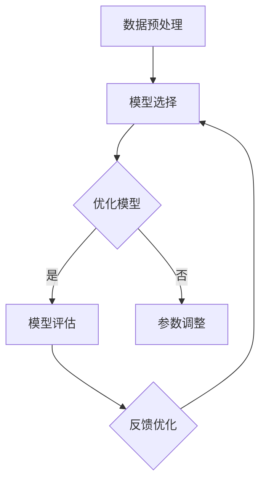
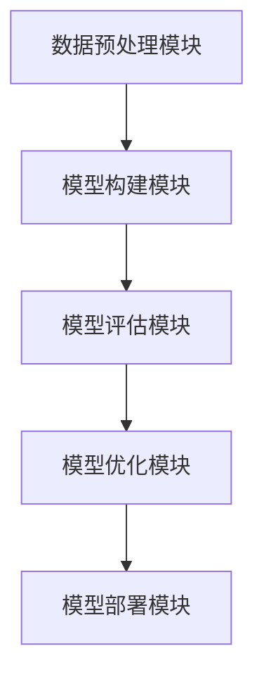
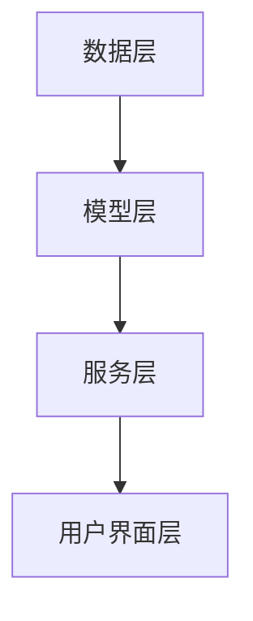
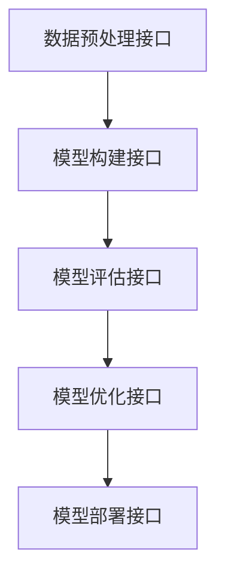
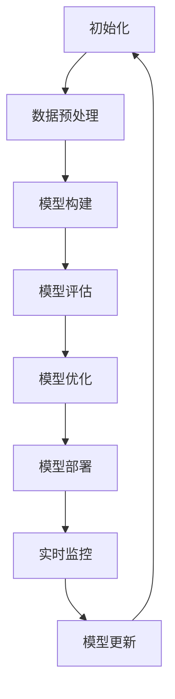

                 

## 引言

随着大数据和人工智能技术的迅速发展，评测系统在各个行业中的应用越来越广泛。评测系统通常用于数据分析和决策支持，其质量直接影响到最终结果的准确性和可靠性。然而，传统的人工构建评测系统的过程既繁琐又耗时，而且容易受到主观因素的影响。为了解决这个问题，自动机器学习（AutoML）的应用逐渐成为研究的热点。

自动机器学习（AutoML）是一种通过自动化和优化技术，辅助或替代人工进行机器学习模型构建的方法。它能够自动完成特征选择、模型选择、模型训练和超参数调优等复杂任务，从而大大提高模型构建的效率和质量。在评测系统中，AutoML的应用不仅能够自动化生成高效的预测模型，还能通过持续学习和优化，不断提升系统的性能和适应性。

本文旨在深入探讨自动机器学习（AutoML）在评测系统中的应用，从背景介绍、核心概念与联系、算法原理讲解、数学模型和数学公式详细讲解、系统分析与架构设计方案、项目实战等多个方面，全面阐述AutoML在评测系统中的具体应用和实践。

本文结构如下：

- **第1章 问题背景**：介绍评测系统与AutoML的基本概念，以及两者之间的关系。
- **第2章 核心概念与联系**：详细阐述AutoML的基本原理和评测系统的概念，并通过比较两者的核心属性特征，分析它们之间的关联性。
- **第3章 算法原理讲解**：讲解AutoML算法的基本流程和步骤，以及如何将其应用于评测系统中。
- **第4章 数学模型和数学公式**：详细讲解数学模型和公式，并通过实际案例进行说明。
- **第5章 系统分析与架构设计方案**：分析评测系统的应用场景，并设计相应的系统架构。
- **第6章 项目实战**：通过具体项目实例，展示AutoML在评测系统中的应用实践。
- **第7章 最佳实践 tips、小结、注意事项、拓展阅读**：总结最佳实践经验，提出注意事项，并提供拓展阅读资源。

通过本文的深入探讨，希望能够为读者提供对AutoML在评测系统中应用的全面了解，以及在实际应用中的有效指导。

### 第1章 问题背景

#### 1.1 自动机器学习（AutoML）概述

自动机器学习（AutoML）是一种通过自动化和优化技术，简化机器学习模型构建过程的先进方法。传统的机器学习流程通常需要人工进行特征工程、模型选择、训练、验证和调参等步骤，这不仅繁琐且耗时，还容易因个人经验差异导致模型性能的不一致性。AutoML的出现，正是为了解决这一问题，通过自动化处理这些繁琐步骤，使非专业人士也能高效地构建高质量的机器学习模型。

AutoML的核心思想是利用智能算法和优化技术，从数据预处理到模型评估的全过程实现自动化。具体来说，AutoML包括以下主要任务：

1. **特征选择**：自动识别和选择对模型性能有显著影响的关键特征，减少冗余和噪声，提高模型精度。
2. **模型选择**：根据数据集的特点和任务需求，自动选择最优的机器学习算法和模型架构。
3. **训练与调参**：自动化地训练模型并进行超参数调优，找到最优参数组合，提高模型性能。
4. **模型评估**：自动评估模型性能，通过交叉验证等手段保证模型的稳定性和泛化能力。

AutoML的关键优势在于其高效性和便捷性。首先，通过自动化处理，可以大幅减少模型构建所需的时间，提高开发效率。其次，AutoML能够利用智能算法和优化技术，在大量模型和参数组合中快速找到最优解，从而提高模型质量。此外，AutoML降低了模型构建的技术门槛，使得不同领域的专业人员可以更加专注于业务问题本身，而无需深陷模型细节。

#### 1.2 评测系统与AutoML的关系

评测系统是一种用于对数据集或模型进行评估和验证的工具，其核心目的是评估数据集的可靠性、模型的准确性、效率和稳定性。评测系统广泛应用于各个行业，如金融、医疗、零售、制造等，用于数据分析和决策支持。

AutoML与评测系统之间存在着紧密的联系。首先，AutoML能够自动生成高效的预测模型，而评测系统可以对这些模型进行全面的评估和验证，从而确保模型在实际应用中的性能。具体来说，评测系统在AutoML中的应用主要体现在以下几个方面：

1. **模型评估**：通过AutoML生成多个候选模型后，评测系统可以对这些模型进行评估，包括准确性、精确度、召回率、F1值等指标，从而选择最优模型。
2. **性能验证**：AutoML生成的模型需要经过长时间的训练和验证，评测系统可以自动化地监控模型性能的变化，确保模型在不同时间段和环境下保持稳定。
3. **反馈循环**：评测系统的评估结果可以反馈给AutoML，指导其进行模型优化和参数调整，从而不断提高模型性能。
4. **多模型比较**：评测系统可以同时对多个AutoML生成的模型进行评估和比较，帮助用户选择最适合业务需求的模型。

总之，AutoML和评测系统共同构成了一个闭环系统，通过相互配合，实现模型构建和评估的自动化和高效化。AutoML提供高效的模型生成能力，而评测系统则确保这些模型在实际应用中的可靠性和性能。两者相辅相成，共同推动了机器学习技术的发展和应用。

### 1.3 AutoML在评测系统中的应用现状与挑战

随着人工智能和机器学习技术的不断发展，自动机器学习（AutoML）在评测系统中的应用已经成为一个热门研究领域。目前，AutoML在评测系统中已经取得了显著的进展，并在多个实际应用场景中展示了其强大的能力和广泛的应用前景。然而，尽管AutoML的应用前景广阔，但仍面临着一系列挑战和问题。

#### 现状

1. **应用场景扩展**：AutoML已经在金融、医疗、零售、制造等多个领域得到了广泛应用。例如，在金融领域，AutoML被用于信用评分、欺诈检测等任务；在医疗领域，则被用于疾病预测、诊断等任务；在零售领域，则被用于客户行为分析、库存管理等任务。
2. **工具和平台的发展**：随着AutoML技术的成熟，市场上涌现出了许多AutoML工具和平台。这些工具和平台提供了丰富的功能和易用性，使得非专业用户也能轻松构建和部署机器学习模型。例如，Google的AutoML、H2O.ai的AutoML平台等。
3. **模型性能提升**：AutoML通过自动化处理特征工程、模型选择、训练和调参等步骤，显著提升了机器学习模型的性能。通过智能算法和优化技术，AutoML能够在大量模型和参数组合中快速找到最优解，从而提高模型精度和效率。
4. **跨领域应用**：AutoML的应用不仅限于特定领域，还开始向跨领域扩展。例如，通过迁移学习技术，AutoML可以在一个领域中的模型基础上，快速适应其他领域的任务。

#### 挑战

1. **数据质量**：AutoML的性能高度依赖于数据质量。数据中的噪声、缺失值和异常值都可能影响模型的性能。因此，确保数据质量是AutoML应用的重要挑战之一。
2. **模型可解释性**：尽管AutoML在提高模型性能方面取得了显著进展，但模型的黑箱特性使得其可解释性成为一个重大挑战。在许多实际应用中，用户需要理解模型的决策过程，以便进行有效的业务分析和决策。
3. **计算资源需求**：AutoML通常需要大量的计算资源和时间进行模型训练和优化。特别是在处理大规模数据集时，计算资源的消耗成为一个重要问题。
4. **模型泛化能力**：AutoML生成的模型可能在特定数据集上表现优异，但在实际应用中可能面临泛化能力不足的问题。如何确保模型在不同场景和环境下保持稳定性和可靠性，是AutoML应用中的关键挑战。
5. **安全性和隐私保护**：随着AutoML在关键领域的应用，其安全性和隐私保护成为一个重要问题。例如，在医疗和金融领域，数据的安全性和隐私性直接关系到用户利益和业务合规性。

综上所述，尽管AutoML在评测系统中展示了巨大的潜力，但仍面临一系列挑战。未来，需要进一步研究和发展，解决这些问题，以实现AutoML在评测系统中的广泛应用和可持续发展。

### 第2章 核心概念与联系

#### 2.1 自动机器学习（AutoML）的基本原理

自动机器学习（AutoML）是一种利用自动化和优化技术，简化机器学习模型构建过程的先进方法。其基本原理包括以下几个关键步骤：

1. **数据预处理**：AutoML首先对输入数据集进行预处理，包括数据清洗、数据转换和特征工程等。这一步骤的目的是去除数据中的噪声、缺失值和异常值，并提取对模型性能有显著影响的关键特征。
2. **模型选择**：AutoML通过自动搜索和选择最优的机器学习算法和模型架构。这一步骤通常涉及大量的模型和参数组合，通过智能算法和优化技术，快速找到最优解。常见的模型选择方法包括随机搜索、贝叶斯优化、遗传算法等。
3. **训练与调参**：AutoML自动化地训练所选模型，并进行超参数调优。通过交叉验证等技术，AutoML确保模型在不同数据集上的稳定性和泛化能力。训练过程中，AutoML会自动调整模型参数，以最大化模型性能。
4. **模型评估与选择**：在完成模型训练后，AutoML使用各种评估指标（如准确性、精确度、召回率等）对模型进行评估。通过对比不同模型的性能，AutoML选择最优模型作为最终结果。
5. **模型部署与监控**：最后，AutoML将最优模型部署到实际应用环境中，并对其性能进行持续监控和优化。通过实时反馈和调整，AutoML确保模型在长时间运行中保持高性能。

总的来说，AutoML通过自动化和优化技术，实现了从数据预处理到模型评估的全过程，从而大幅提高机器学习模型的构建效率和质量。

#### 2.2 评测系统的基本概念

评测系统是一种用于评估和验证数据集或模型的工具，其核心目的是确保数据集的可靠性、模型的准确性和效率。评测系统的基本概念包括以下几个方面：

1. **评估指标**：评测系统使用一系列评估指标来衡量数据集或模型的质量。常见的评估指标包括准确性、精确度、召回率、F1值、ROC曲线、AUC值等。这些指标能够从不同角度反映数据集或模型的表现。
2. **交叉验证**：交叉验证是一种用于评估模型稳定性和泛化能力的方法。它将数据集划分为多个子集，每次使用不同的子集作为验证集，其余子集作为训练集，进行多次训练和验证。通过计算模型在所有子集上的性能指标，交叉验证可以更全面地评估模型。
3. **性能监控**：评测系统需要对模型性能进行持续监控，以确保其在长时间运行中保持稳定。通过实时收集和反馈模型性能数据，评测系统可以及时发现性能下降或异常情况，并进行相应的调整和优化。
4. **反馈机制**：评测系统通常具有反馈机制，将评估结果和性能数据反馈给数据预处理、模型选择和训练等步骤。通过这种反馈机制，评测系统能够实现闭环控制，不断优化模型性能。

总之，评测系统通过评估指标、交叉验证、性能监控和反馈机制，实现对数据集或模型的全流程评估和优化，从而确保其可靠性和效率。

#### 2.3 AutoML与评测系统的关联分析

自动机器学习（AutoML）与评测系统在机器学习模型构建和评估过程中起着相辅相成的作用。两者的关联主要体现在以下几个方面：

1. **模型构建的自动化**：AutoML通过自动化和优化技术，简化了机器学习模型的构建过程。它能够自动进行数据预处理、模型选择、训练和调参等步骤，从而提高模型构建的效率。评测系统则通过标准化的评估指标和验证方法，对AutoML生成的模型进行全面的评估，确保模型的质量和性能。
   
2. **性能评估的标准化**：评测系统提供了一套统一的评估标准和方法，能够对AutoML生成的多个候选模型进行性能评估。通过交叉验证、准确率、精确度等评估指标，评测系统能够客观、准确地衡量不同模型的表现，从而帮助用户选择最优模型。
   
3. **反馈循环与模型优化**：评测系统的评估结果可以反馈给AutoML，指导其进行模型优化和参数调整。AutoML根据评估结果，调整模型架构、参数设置，以提高模型性能。这种反馈循环机制，使得AutoML能够不断优化模型，使其在实际应用中表现出更高的稳定性、可靠性和泛化能力。
   
4. **跨领域应用与适应性**：AutoML和评测系统的结合，使得机器学习模型在不同领域和应用场景中具有更高的适应性。通过评测系统，AutoML可以验证模型在不同数据集上的性能，确保其能够适应不同的业务需求和环境变化。

5. **模型可解释性与透明性**：评测系统在评估模型性能的同时，还可以对模型的决策过程进行监控和分析，提高模型的可解释性和透明性。这对于用户理解模型工作原理、识别潜在问题、改进模型设计具有重要意义。

总之，AutoML与评测系统在机器学习模型构建和评估中相互补充，共同推动模型构建过程的高效化、标准化和智能化。通过两者的紧密配合，可以大幅提高模型性能，确保其在实际应用中的可靠性和有效性。

#### 2.4 AutoML的关键属性特征

自动机器学习（AutoML）作为一门前沿技术，具有多个关键属性特征，这些特征决定了AutoML的效率、效果和适用性。以下是对AutoML关键属性特征的详细描述：

1. **自动化**：AutoML的核心优势在于其自动化能力。通过自动化技术，AutoML能够自动完成从数据预处理到模型训练、评估和优化的整个流程，从而大大减少人工干预的需求。自动化不仅提高了模型构建的效率，还降低了人工错误的风险，使得非专业用户也能轻松构建高质量的机器学习模型。

2. **智能化**：AutoML通过智能算法和优化技术，实现了模型的自动化选择和优化。智能算法包括遗传算法、贝叶斯优化、随机搜索等，这些算法能够在大量模型和参数组合中快速找到最优解。智能化使得AutoML能够在复杂场景中高效地处理模型选择和参数调优，从而提高模型的性能和稳定性。

3. **可扩展性**：AutoML具有高度的可扩展性，能够适应不同规模和类型的数据集。无论是小规模的数据集还是大规模的数据集，AutoML都能够通过自动化和优化技术，快速生成高效模型。此外，AutoML还支持多种机器学习算法和模型架构，使得用户可以根据不同业务需求进行灵活选择和调整。

4. **模型多样性**：AutoML通过自动化和智能化技术，能够生成多种不同类型的机器学习模型。这些模型包括回归模型、分类模型、聚类模型等，能够满足不同业务场景的需求。模型多样性不仅提高了AutoML的适用性，也为用户提供了更多的选择空间。

5. **可解释性**：尽管AutoML在提高模型性能方面具有显著优势，但其黑箱特性使得模型的可解释性成为一个挑战。然而，一些AutoML框架已经开始尝试引入可解释性机制，通过可视化和解释技术，帮助用户理解模型的工作原理和决策过程。可解释性对于提高模型的透明性和可靠性具有重要意义。

6. **高效性**：AutoML通过自动化和优化技术，显著提高了模型构建和评估的效率。AutoML能够在短时间内处理大量的模型和参数组合，快速找到最优解。这种高效性使得AutoML在处理大规模数据集时具有显著优势。

7. **稳定性**：AutoML通过智能算法和优化技术，提高了模型的稳定性和泛化能力。在复杂和变化多端的数据环境中，AutoML能够适应不同的数据分布和噪声，保持模型的稳定性和可靠性。

总之，AutoML的关键属性特征包括自动化、智能化、可扩展性、模型多样性、可解释性、高效性和稳定性。这些特征共同决定了AutoML的效率和效果，使其在机器学习模型构建和优化中具有广泛的应用前景。

#### 2.5 评测系统的关键属性特征

评测系统是一种用于评估和验证数据集或模型性能的工具，具有多个关键属性特征，这些特征决定了评测系统的准确性和有效性。以下是评测系统的主要关键属性特征：

1. **评估指标多样性**：评测系统使用多种评估指标来衡量数据集或模型的质量。常见的评估指标包括准确性、精确度、召回率、F1值、ROC曲线、AUC值等。这些指标能够从不同角度反映模型的表现，提供全面的性能评估。

2. **交叉验证**：交叉验证是一种重要的评估方法，用于评估模型的稳定性和泛化能力。通过将数据集划分为多个子集，每次使用不同的子集进行训练和验证，交叉验证可以更全面地评估模型在不同数据子集上的表现，从而提高评估的准确性。

3. **自动化**：评测系统通常具备自动化评估功能，能够自动执行各种评估步骤，包括数据集划分、模型训练、评估指标计算等。自动化不仅提高了评估效率，还减少了人工干预的风险，提高了评估的客观性和一致性。

4. **可扩展性**：评测系统具有良好的可扩展性，能够适应不同规模和类型的数据集。无论是小规模的数据集还是大规模的数据集，评测系统都能够通过扩展和调整评估指标和评估方法，实现有效的性能评估。

5. **可解释性**：评测系统不仅要提供评估结果，还需要解释评估结果背后的原因。通过可视化和解释技术，评测系统能够帮助用户理解模型的工作原理和性能表现，提高评估的可理解性和透明性。

6. **实时监控**：评测系统通常具备实时监控功能，能够持续监控模型的性能变化，及时发现性能下降或异常情况。实时监控有助于确保模型在长时间运行中保持稳定和可靠，提高系统的整体性能。

7. **反馈机制**：评测系统具有反馈机制，能够将评估结果和性能数据反馈给模型构建和优化过程。通过反馈机制，评测系统可以指导模型优化和参数调整，提高模型的性能和稳定性。

8. **灵活性和适应性**：评测系统需要具备灵活性和适应性，能够应对不同业务场景和需求。通过调整评估指标、评估方法和评估流程，评测系统能够适应不同的评估场景，提供个性化的评估服务。

总之，评测系统的关键属性特征包括评估指标多样性、交叉验证、自动化、可扩展性、可解释性、实时监控、反馈机制和灵活适应性。这些特征共同决定了评测系统的准确性和有效性，使其在数据集和模型评估中发挥重要作用。

### 2.6 AutoML与评测系统的核心属性特征对比

为了更清晰地理解自动机器学习（AutoML）与评测系统的核心属性特征，我们可以通过表格和Mermaid流程图的方式进行比较。以下是两者的核心属性特征对比表格：

| 属性特征 | AutoML | 评测系统 |
| :--: | :--: | :--: |
| 自动化 | 自动完成模型构建的各个环节 | 自动执行评估指标计算和结果反馈 |
| 智能化 | 利用智能算法和优化技术选择最优模型 | 利用交叉验证等方法评估模型性能 |
| 可扩展性 | 适应不同规模和类型的数据集 | 适应不同规模和类型的评估需求 |
| 模型多样性 | 自动生成多种类型的机器学习模型 | 提供多种评估指标进行全面评估 |
| 可解释性 | 尝试引入可解释性机制 | 提供评估结果和原因解释 |
| 高效性 | 提高模型构建和评估的效率 | 提高评估过程的效率和准确性 |
| 稳定性 | 提高模型的稳定性和泛化能力 | 提高模型评估的稳定性和可靠性 |

接下来，我们通过Mermaid流程图来展示AutoML与评测系统的流程关系。以下是Mermaid流程图：



在这个流程图中，AutoML的过程包括数据预处理、模型选择、模型优化和模型评估。评测系统的过程包括模型评估和反馈优化。通过这种流程图，我们可以直观地看到AutoML和评测系统在模型构建和评估中的协同作用。

通过表格和流程图的比较，我们可以更清晰地理解AutoML与评测系统的核心属性特征和流程关系。两者在自动化、智能化、可扩展性、模型多样性、可解释性、高效性和稳定性等方面具有显著差异，但又在模型评估和优化过程中相互补充，共同推动机器学习技术的发展和应用。

### 第3章 算法原理讲解

#### 3.1 AutoML算法的流程与步骤

自动机器学习（AutoML）算法的流程与步骤是构建高效机器学习模型的关键。下面将详细讲解AutoML算法的基本流程和各个步骤：

1. **数据预处理**：首先，AutoML算法需要对输入数据进行预处理。数据预处理包括数据清洗、数据转换和特征工程等步骤。数据清洗的目的是去除数据中的噪声、缺失值和异常值，确保数据质量。数据转换则将数据格式转换为适合机器学习模型的形式。特征工程是提取对模型性能有显著影响的关键特征，通过降维、特征选择等方法，减少数据维度和噪声，提高模型性能。

2. **模型选择**：在数据预处理完成后，AutoML算法需要选择最适合当前数据集和任务需求的机器学习模型。模型选择是一个复杂的优化问题，涉及到多种算法和模型架构。AutoML通常使用智能算法，如遗传算法、贝叶斯优化和随机搜索，通过自动化搜索和评估，找到最优模型。模型选择过程需要考虑数据集的特点、任务类型和计算资源等因素。

3. **模型训练与调参**：模型选择完成后，AutoML算法开始进行模型训练和超参数调优。模型训练是通过输入数据和模型参数，计算模型在训练数据上的损失函数，并使用优化算法（如梯度下降）调整模型参数，以最小化损失函数。调参是选择最佳的超参数组合，以最大化模型性能。AutoML算法使用自动化调参技术，如网格搜索、贝叶斯优化和随机搜索，快速找到最优参数组合。

4. **模型评估**：在完成模型训练后，AutoML算法需要对模型进行评估，以确定其性能和适用性。模型评估通常使用交叉验证方法，将数据集划分为多个子集，每次使用不同的子集进行训练和验证，计算模型在不同子集上的性能指标，如准确性、精确度、召回率和F1值等。通过评估，AutoML算法可以比较不同模型和参数组合的性能，选择最优模型。

5. **模型选择与优化**：根据评估结果，AutoML算法选择最优模型，并进行进一步优化。优化过程可能包括调整模型架构、增加或减少层数、调整激活函数和正则化参数等。通过不断优化，AutoML算法可以提高模型的性能和泛化能力。

6. **模型部署**：最后，AutoML算法将最优模型部署到实际应用环境中。部署过程中，模型需要转换为可执行的形式，如编译为机器码或转换为神经网络推理引擎的格式。部署后，模型可以接受新的输入数据，进行预测和决策。

总体来说，AutoML算法的流程包括数据预处理、模型选择、模型训练与调参、模型评估、模型选择与优化和模型部署。这些步骤相互关联，通过自动化和优化技术，AutoML算法能够高效、自动地构建高质量的机器学习模型，满足不同业务需求。

#### 3.2 评测系统的算法基础

评测系统在设计和实现过程中，依赖于多种算法来评估和验证数据集或模型的性能。以下是评测系统中的常见算法及其基础：

1. **交叉验证（Cross-Validation）**：
   交叉验证是一种评估模型性能的重要方法。它通过将数据集划分为多个子集（通常为k个子集，称为k折交叉验证），每次使用不同的子集作为验证集，其余子集作为训练集，进行多次训练和验证。通过计算模型在所有子集上的性能指标，如准确性、精确度、召回率和F1值等，交叉验证可以更全面地评估模型的泛化能力。

2. **集成学习方法（Ensemble Learning）**：
   集成学习通过结合多个基础模型来提高整体性能。常见的集成学习方法包括 bagging、boosting 和 stacking 等。例如，Bagging 通过训练多个基础模型，并将它们的预测结果进行平均或投票，来减少模型的方差和提升模型的稳定性；Boosting 则通过迭代训练多个基础模型，每次迭代都对前一次模型的错误进行加权，从而提高模型的精度。

3. **特征选择（Feature Selection）**：
   特征选择是一种用于减少数据维度和噪声的方法。通过选择对模型性能有显著影响的关键特征，特征选择可以提高模型的性能和可解释性。常见的特征选择方法包括过滤方法、嵌入方法和模型依赖方法。过滤方法通过计算特征与目标变量之间的相关性来进行特征选择；嵌入方法则将特征选择作为模型训练过程的一部分，通过模型训练结果来评估特征的重要性。

4. **分类算法（Classification Algorithms）**：
   在评测系统中，分类算法用于将数据划分为不同的类别。常见的分类算法包括逻辑回归（Logistic Regression）、支持向量机（SVM）、决策树（Decision Tree）、随机森林（Random Forest）和梯度提升树（Gradient Boosting Tree）等。这些算法具有不同的理论基础和适用场景，可以根据具体任务需求进行选择。

5. **回归算法（Regression Algorithms）**：
   回归算法用于预测数值型目标变量。常见的回归算法包括线性回归（Linear Regression）、岭回归（Ridge Regression）、Lasso回归（Lasso Regression）和梯度提升回归（Gradient Boosting Regression）等。回归算法在评测系统中用于评估模型的预测能力和稳定性。

6. **聚类算法（Clustering Algorithms）**：
   聚类算法用于将数据点划分为多个集群，以发现数据中的模式。常见的聚类算法包括K-Means、层次聚类（Hierarchical Clustering）和DBSCAN等。聚类算法在评测系统中用于分析数据的分布和结构，帮助识别潜在的数据关系和异常点。

总之，评测系统在实现过程中，结合多种算法来评估和验证数据集或模型的性能。这些算法包括交叉验证、集成学习方法、特征选择、分类算法、回归算法和聚类算法等。通过合理选择和使用这些算法，评测系统可以提供全面、准确的评估结果，帮助用户做出科学的决策。

#### 3.3 AutoML与评测系统的算法整合

在评测系统中，自动机器学习（AutoML）与评测系统的算法整合是提升模型构建和评估效率的关键。AutoML通过自动化和优化技术，将多种机器学习算法和评估方法集成到统一框架中，从而实现高效的模型选择、训练和评估。以下详细说明AutoML与评测系统算法整合的具体实现方式：

1. **统一接口设计**：
   首先，AutoML需要设计一个统一的接口，以便于评测系统调用和集成各种机器学习算法。这个接口应该具备以下功能：
   - 模型选择接口：提供不同机器学习算法的选择和配置选项，如分类算法、回归算法和聚类算法等。
   - 特征选择接口：支持特征选择算法，如过滤方法、嵌入方法和模型依赖方法，以减少数据维度和噪声。
   - 模型评估接口：提供多种评估方法，如交叉验证、集成学习和实时监控等，以便对模型进行全面的性能评估。
   - 参数调优接口：通过智能算法和优化技术，自动搜索和选择最优的超参数组合，提高模型性能。

2. **数据预处理与特征工程**：
   在模型构建过程中，数据预处理和特征工程是至关重要的一步。AutoML与评测系统的算法整合首先需要确保数据预处理的一致性和高效性。具体实现方式如下：
   - 数据清洗：去除数据中的噪声、缺失值和异常值，确保数据质量。
   - 数据转换：将不同类型的数据转换为适合机器学习模型的形式，如将分类数据编码为二进制形式。
   - 特征提取：通过特征选择算法提取对模型性能有显著影响的关键特征，减少数据维度和噪声。
   - 特征融合：结合多种特征提取方法，生成新的特征，以提升模型的性能。

3. **模型训练与调参**：
   AutoML与评测系统的算法整合需要通过自动化和优化技术，实现高效的模型训练和超参数调优。具体实现方式如下：
   - 模型训练：使用统一的接口调用不同机器学习算法，进行模型训练。在训练过程中，可以采用分布式计算和并行处理技术，提高训练效率。
   - 超参数调优：通过智能算法和优化技术，如随机搜索、贝叶斯优化和遗传算法等，自动搜索和选择最优的超参数组合。在调参过程中，可以使用交叉验证方法，确保模型在不同数据集上的稳定性和泛化能力。

4. **模型评估与优化**：
   在模型训练完成后，AutoML与评测系统的算法整合需要对模型进行全面的评估和优化。具体实现方式如下：
   - 模型评估：使用多种评估方法，如交叉验证、集成学习和实时监控等，对模型进行性能评估。通过计算准确性、精确度、召回率、F1值等评估指标，评估模型在不同数据集上的表现。
   - 模型优化：根据评估结果，对模型进行进一步优化。优化过程可能包括调整模型架构、增加或减少层数、调整激活函数和正则化参数等，以提高模型的性能和泛化能力。

5. **模型部署与监控**：
   最后，AutoML与评测系统的算法整合需要将最优模型部署到实际应用环境中，并进行持续监控和优化。具体实现方式如下：
   - 模型部署：将最优模型转换为可执行的形式，如编译为机器码或转换为神经网络推理引擎的格式。部署后，模型可以接受新的输入数据，进行预测和决策。
   - 持续监控：通过实时收集和反馈模型性能数据，监控模型在长时间运行中的性能变化。如果发现性能下降或异常情况，可以及时进行调整和优化，确保模型在长时间运行中保持稳定和可靠。

通过上述实现方式，AutoML与评测系统的算法整合能够实现模型构建和评估的自动化、高效化和智能化，从而提升机器学习模型的应用效果和业务价值。

### 第4章 数学模型和数学公式

#### 4.1 数学模型概述

在自动机器学习（AutoML）中，数学模型是理解和分析算法性能的核心工具。数学模型不仅能够描述机器学习算法的行为，还能通过数学公式量化其性能和优化过程。以下是几个在AutoML中常用的数学模型：

1. **损失函数（Loss Function）**：
   损失函数是评估模型预测性能的关键工具，它用于衡量预测值与真实值之间的差距。常见的损失函数包括均方误差（MSE）、交叉熵损失（Cross-Entropy Loss）等。
   - **均方误差（MSE）**：
     $$MSE = \frac{1}{n}\sum_{i=1}^{n}(y_i - \hat{y}_i)^2$$
     其中，$y_i$是真实值，$\hat{y}_i$是预测值，$n$是样本数量。
   - **交叉熵损失（Cross-Entropy Loss）**：
     $$H(y, \hat{y}) = -\sum_{i=1}^{n} y_i \log(\hat{y}_i)$$
     其中，$y_i$是真实标签，$\hat{y}_i$是模型预测的概率分布。

2. **优化算法（Optimization Algorithms）**：
   优化算法用于调整模型参数，以最小化损失函数。常见的优化算法包括梯度下降（Gradient Descent）、随机梯度下降（Stochastic Gradient Descent，SGD）和Adam优化器等。
   - **梯度下降**：
     $$\theta_{t+1} = \theta_t - \alpha \cdot \nabla_{\theta} J(\theta)$$
     其中，$\theta_t$是当前参数，$\alpha$是学习率，$J(\theta)$是损失函数，$\nabla_{\theta} J(\\theta)$是损失函数关于参数$\theta$的梯度。
   - **随机梯度下降**：
     $$\theta_{t+1} = \theta_t - \alpha \cdot \nabla_{\theta} J(\theta; x_t, y_t)$$
     其中，$x_t$和$y_t$是单个样本和其标签。
   - **Adam优化器**：
     Adam优化器结合了SGD和动量方法，适用于非平稳优化问题。
     $$m_t = \beta_1 m_{t-1} + (1 - \beta_1) [g_t]$$
     $$v_t = \beta_2 v_{t-1} + (1 - \beta_2) [g_t^2]$$
     $$\theta_{t+1} = \theta_t - \alpha \cdot \frac{m_t}{\sqrt{v_t} + \epsilon}$$
     其中，$m_t$和$v_t$分别是梯度的一阶和二阶矩估计，$\beta_1$和$\beta_2$是矩估计的平滑系数，$\alpha$是学习率，$\epsilon$是常数，用于避免除以零。

3. **正则化（Regularization）**：
   正则化用于防止模型过拟合，提高模型的泛化能力。常见的正则化方法包括L1正则化（Lasso）和L2正则化（Ridge）。
   - **L1正则化**：
     $$J(\theta) = \frac{1}{2m} \sum_{i=1}^{m} (h_\theta(x^{(i)}) - y^{(i)})^2 + \lambda \sum_{j=1}^{n} |\theta_j|$$
     其中，$m$是样本数量，$n$是特征数量，$h_\theta(x^{(i)})$是模型预测值，$y^{(i)}$是真实值，$\lambda$是正则化参数。
   - **L2正则化**：
     $$J(\theta) = \frac{1}{2m} \sum_{i=1}^{m} (h_\theta(x^{(i)}) - y^{(i)})^2 + \lambda \sum_{j=1}^{n} \theta_j^2$$
     其中，其他符号与L1正则化相同。

4. **集成方法（Ensemble Methods）**：
   集成方法通过结合多个基础模型来提高模型性能。常见的集成方法包括Bagging、Boosting和Stacking等。
   - **Bagging**：
     $$\hat{y} = \frac{1}{K} \sum_{k=1}^{K} h_{\theta_k}(x)$$
     其中，$h_{\theta_k}(x)$是第$k$个基础模型的预测值，$\hat{y}$是集成模型的最终预测值。
   - **Boosting**：
     $$L(y, \hat{y}) = \sum_{k=1}^{K} \alpha_k L_k(y, \hat{y}_k)$$
     其中，$L(y, \hat{y})$是损失函数，$\alpha_k$是第$k$个模型的权重，$L_k(y, \hat{y}_k)$是第$k$个模型的损失函数。

这些数学模型和公式是理解和实现AutoML算法的基础，通过它们，我们可以量化模型性能、优化参数和评估模型泛化能力。

#### 4.2 数学公式详细讲解

在自动机器学习（AutoML）中，数学公式的应用至关重要，它们不仅帮助我们量化模型的性能，还能指导我们进行参数调优和模型优化。以下将详细讲解几个关键的数学公式及其在AutoML中的应用：

1. **均方误差（MSE）**：

均方误差（Mean Squared Error，MSE）是最常用的损失函数之一，用于衡量预测值与真实值之间的差距。其公式如下：

$$
MSE = \frac{1}{n}\sum_{i=1}^{n}(y_i - \hat{y}_i)^2
$$

其中，$y_i$表示第$i$个样本的真实值，$\hat{y}_i$表示第$i$个样本的预测值，$n$表示样本总数。MSE的值越低，说明预测值与真实值之间的差距越小，模型的性能越好。

在AutoML中，MSE通常用于评估模型的预测性能。例如，在训练一个回归模型时，可以通过计算训练集和验证集的MSE来评估模型在训练和验证数据上的性能。具体步骤如下：

- 训练模型，得到预测值$\hat{y}_i$。
- 计算训练集的MSE：$$MSE_{train} = \frac{1}{n_{train}}\sum_{i=1}^{n_{train}}(y_i^{(train)} - \hat{y}_i^{(train)})^2$$
- 计算验证集的MSE：$$MSE_{validation} = \frac{1}{n_{validation}}\sum_{i=1}^{n_{validation}}(y_i^{(validation)} - \hat{y}_i^{(validation)})^2$$

通过比较训练集和验证集的MSE，可以判断模型是否过拟合或欠拟合。

2. **交叉熵损失（Cross-Entropy Loss）**：

交叉熵损失函数常用于分类问题，用于衡量预测概率分布与真实分布之间的差异。其公式如下：

$$
H(y, \hat{y}) = -\sum_{i=1}^{n} y_i \log(\hat{y}_i)
$$

其中，$y_i$是第$i$个样本的真实标签（通常为0或1），$\hat{y}_i$是模型预测的概率分布。交叉熵的值越低，说明预测概率分布与真实分布越接近，模型的分类性能越好。

在AutoML中，交叉熵损失函数常用于训练分类模型。具体应用步骤如下：

- 训练模型，得到预测概率分布$\hat{y}_i$。
- 计算训练集的交叉熵损失：$$Cross-Entropy_{train} = -\sum_{i=1}^{n_{train}} y_i^{(train)} \log(\hat{y}_i^{(train)})$$
- 计算验证集的交叉熵损失：$$Cross-Entropy_{validation} = -\sum_{i=1}^{n_{validation}} y_i^{(validation)} \log(\hat{y}_i^{(validation)})$$

通过优化交叉熵损失函数，可以调整模型参数，提高分类模型的性能。

3. **梯度下降（Gradient Descent）**：

梯度下降是一种优化算法，用于调整模型参数，以最小化损失函数。其基本思想是沿着损失函数的梯度方向进行迭代更新，直至达到最小值。梯度下降的公式如下：

$$
\theta_{t+1} = \theta_t - \alpha \cdot \nabla_{\theta} J(\theta)
$$

其中，$\theta_t$是当前参数，$\alpha$是学习率，$\nabla_{\theta} J(\theta)$是损失函数关于参数$\theta$的梯度。

在AutoML中，梯度下降通常用于模型训练过程中的参数优化。具体应用步骤如下：

- 初始化模型参数$\theta_0$。
- 计算损失函数的梯度$\nabla_{\theta} J(\theta)$。
- 根据梯度方向和步长更新参数：$$\theta_{t+1} = \theta_t - \alpha \cdot \nabla_{\theta} J(\theta_t)$$
- 重复步骤2和3，直至损失函数值收敛或达到预设的迭代次数。

通过梯度下降，模型参数逐渐调整，使模型性能得到优化。

4. **L1正则化（Lasso）**：

L1正则化是一种用于防止模型过拟合的正则化方法，通过在损失函数中添加L1范数项来实现。其公式如下：

$$
J(\theta) = \frac{1}{2m} \sum_{i=1}^{m} (h_\theta(x^{(i)}) - y^{(i)})^2 + \lambda \sum_{j=1}^{n} |\theta_j|
$$

其中，$h_\theta(x^{(i)})$是模型预测值，$y^{(i)}$是真实值，$m$是样本数量，$n$是特征数量，$\lambda$是正则化参数。

在AutoML中，L1正则化可以用于特征选择和参数调优。具体应用步骤如下：

- 训练模型，得到预测值和损失函数值。
- 计算L1正则化损失函数：$$J_{Lasso}(\theta) = \frac{1}{2m} \sum_{i=1}^{m} (h_\theta(x^{(i)}) - y^{(i)})^2 + \lambda \sum_{j=1}^{n} |\theta_j|$$
- 使用优化算法（如梯度下降）优化L1正则化损失函数，找到最优参数$\theta^*$。

通过L1正则化，可以减少模型参数的数量，提高模型的泛化能力。

这些数学公式在AutoML中的应用，不仅帮助我们量化模型的性能，还能指导我们进行参数调优和模型优化。在实际应用中，我们可以根据具体任务需求，灵活选择和使用这些公式，以实现高效的模型构建和评估。

#### 4.3 公式应用举例

为了更好地理解数学公式在自动机器学习（AutoML）中的应用，下面将通过一个实际案例进行详细讲解，包括数据处理、模型训练和性能评估的全过程。

**案例背景**：假设我们有一个简单的鸢尾花（Iris）数据集，包含三个不同种类的鸢尾花（Setosa、Versicolour和Virginica），每个种类有50个样本。我们的目标是使用AutoML算法构建一个分类模型，以准确识别鸢尾花的种类。

**步骤 1：数据预处理**

首先，我们读取鸢尾花数据集，并进行必要的预处理。预处理步骤包括数据清洗、归一化和特征提取。

```python
import pandas as pd
from sklearn import datasets
from sklearn.preprocessing import StandardScaler

# 加载鸢尾花数据集
iris = datasets.load_iris()
X = iris.data
y = iris.target

# 数据清洗（这里鸢尾花数据集已经比较干净，无需进一步处理）
# 归一化
scaler = StandardScaler()
X = scaler.fit_transform(X)

# 特征提取（这里鸢尾花数据集已包含主要特征，无需进一步提取）
```

**步骤 2：模型训练**

接下来，我们使用自动机器学习（AutoML）算法训练分类模型。这里我们使用`scikit-learn`中的`GridSearchCV`进行模型选择和参数调优。

```python
from sklearn.model_selection import GridSearchCV
from sklearn.ensemble import RandomForestClassifier

# 定义模型参数搜索空间
param_grid = {
    'n_estimators': [10, 50, 100],
    'max_depth': [None, 10, 20, 30],
    'min_samples_split': [2, 5, 10],
    'min_samples_leaf': [1, 2, 4]
}

# 初始化随机森林分类器
rf = RandomForestClassifier(random_state=42)

# 使用GridSearchCV进行模型选择和参数调优
grid_search = GridSearchCV(estimator=rf, param_grid=param_grid, cv=5, scoring='accuracy')
grid_search.fit(X, y)

# 获取最佳模型参数
best_params = grid_search.best_params_
best_model = grid_search.best_estimator_

print("最佳参数：", best_params)
```

**步骤 3：性能评估**

最后，我们对训练好的模型进行性能评估，使用交叉验证方法来验证模型的泛化能力。

```python
from sklearn.model_selection import cross_val_score

# 计算交叉验证分数
scores = cross_val_score(best_model, X, y, cv=5, scoring='accuracy')

# 打印交叉验证分数
print("交叉验证分数：", scores)
print("平均准确性：", scores.mean())

# 使用最佳模型进行预测
predictions = best_model.predict(X)

# 计算准确率
accuracy = (predictions == y).mean()
print("准确率：", accuracy)
```

**详细解释**：

1. **数据预处理**：
   - **数据清洗**：这里鸢尾花数据集已经比较干净，无需进一步处理。
   - **归一化**：通过`StandardScaler`对特征进行归一化处理，使得每个特征的值都在相同的尺度上，有助于优化算法的收敛速度。
   - **特征提取**：鸢尾花数据集已包含主要特征，无需进一步提取。

2. **模型训练**：
   - **参数搜索空间**：我们定义了随机森林分类器的参数搜索空间，包括树的数量（`n_estimators`）、最大深度（`max_depth`）、最小分割样本数（`min_samples_split`）和最小叶子节点样本数（`min_samples_leaf`）。
   - **模型选择**：使用`GridSearchCV`进行模型选择和参数调优。`GridSearchCV`通过交叉验证方法评估每个参数组合的性能，找到最佳参数组合。
   - **最佳模型**：获取最佳模型参数和模型实例，用于后续的性能评估。

3. **性能评估**：
   - **交叉验证分数**：通过`cross_val_score`函数计算5折交叉验证的分数，这有助于评估模型在不同数据子集上的性能。
   - **平均准确性**：计算交叉验证分数的平均值，这是衡量模型整体性能的一个重要指标。
   - **预测和准确率**：使用最佳模型进行预测，并计算预测准确率，这是验证模型在实际应用中的表现。

通过这个案例，我们可以看到数学公式在AutoML中的应用是如何具体实现的。从数据预处理、模型训练到性能评估，每个步骤都涉及到相应的数学公式和算法，这些步骤共同构成了一个完整的AutoML流程。

### 第5章 系统分析与架构设计方案

#### 5.1 问题场景介绍

在本文的背景介绍中，我们已经提到自动机器学习（AutoML）在评测系统中的应用，特别是在提高模型构建和评估效率方面具有显著优势。在本章，我们将进一步探讨一个具体的应用场景，以展示如何在实际项目中设计和实现一个基于AutoML的评测系统。

**应用场景**：假设我们正在开发一个智能客服系统，该系统旨在通过自动化方式处理大量客户咨询，并提供快速、准确的响应。为了实现这一目标，我们需要构建一个高效的分类模型，能够根据客户咨询的内容将其分类到不同的主题类别，如技术支持、账单查询、投诉建议等。这不仅有助于提高客服中心的运营效率，还能提升客户满意度。

**项目目标**：
1. 构建一个高效、准确的分类模型，以识别客户咨询的主题。
2. 设计一个基于AutoML的评测系统，对模型进行全面的评估和优化。
3. 确保模型具有良好的泛化能力，在不同数据集和环境下都能保持稳定的表现。

#### 5.2 项目介绍

在这个项目中，我们将使用AutoML技术，结合评测系统的方法，构建和优化一个智能客服分类模型。项目的主要步骤如下：

1. **数据收集与预处理**：收集客户咨询的数据，包括文本和相关的标签信息。对收集到的数据进行预处理，如文本清洗、分词、去停用词等，以获得高质量的特征向量。

2. **模型构建与训练**：使用AutoML工具，如`scikit-learn`中的`GridSearchCV`或专门的AutoML平台，如H2O.ai，构建和训练多个分类模型。通过自动化搜索和评估，找到最优模型。

3. **模型评估与优化**：使用评测系统的方法，对训练好的模型进行评估。包括交叉验证、性能指标计算等，以确保模型在不同数据集上的稳定性和可靠性。根据评估结果，对模型进行进一步优化。

4. **模型部署与监控**：将最优模型部署到生产环境，集成到智能客服系统中。通过实时监控模型性能，确保其在实际应用中的稳定运行。

#### 5.3 系统功能设计

为了实现上述项目目标，我们需要设计一个具备以下核心功能的系统：

1. **数据预处理模块**：用于清洗、转换和特征提取，确保输入数据的质量和一致性。
2. **模型构建模块**：通过AutoML技术，自动化地构建和训练多个分类模型。
3. **模型评估模块**：对训练好的模型进行全面的评估，包括交叉验证、性能指标计算等。
4. **模型优化模块**：根据评估结果，对模型进行优化，提高其性能。
5. **模型部署模块**：将最优模型部署到生产环境，确保其稳定运行。

**领域模型**：为了更好地描述系统功能，我们使用Mermaid流程图绘制领域模型，展示系统中的主要类及其关系。



在这个领域模型中，数据预处理模块负责处理输入数据，生成高质量的特征向量；模型构建模块使用AutoML技术构建和训练分类模型；模型评估模块对模型进行评估，确保其性能和稳定性；模型优化模块根据评估结果对模型进行优化；模型部署模块将最优模型部署到生产环境。

#### 5.4 系统架构设计

为了实现上述系统功能，我们需要设计一个合理的系统架构。以下是一个简单的系统架构设计方案：

1. **数据层**：包括数据存储和数据处理模块，用于存储和管理原始数据和预处理后的特征数据。
2. **模型层**：包括模型构建、评估和优化模块，用于自动化地构建和优化分类模型。
3. **服务层**：包括模型部署和监控模块，用于将最优模型部署到生产环境，并监控其性能。
4. **用户界面层**：包括系统管理界面和用户交互界面，用于系统管理和用户使用。

**系统架构图**：



在这个系统架构中，数据层负责数据存储和处理；模型层负责模型构建、评估和优化；服务层负责模型部署和监控；用户界面层负责系统管理和用户交互。

#### 5.5 系统接口设计

为了实现系统各模块之间的协同工作，我们需要设计合理的系统接口。以下是一个简单的系统接口设计：

1. **数据预处理接口**：用于接收和处理原始数据，生成预处理后的特征数据。
2. **模型构建接口**：用于调用AutoML工具，构建和训练分类模型。
3. **模型评估接口**：用于对训练好的模型进行评估，计算性能指标。
4. **模型优化接口**：用于根据评估结果，对模型进行优化。
5. **模型部署接口**：用于将最优模型部署到生产环境。

**接口设计图**：



在这个接口设计中，数据预处理接口接收原始数据，生成特征数据；模型构建接口调用AutoML工具进行模型构建和训练；模型评估接口对模型进行评估；模型优化接口根据评估结果进行模型优化；模型部署接口将最优模型部署到生产环境。

#### 5.6 系统交互设计

为了确保系统各模块之间的协同工作，我们需要设计合理的系统交互流程。以下是一个简单的系统交互设计：

1. **初始化**：系统启动，加载配置文件，初始化各模块。
2. **数据预处理**：接收原始数据，进行清洗、转换和特征提取，生成预处理后的特征数据。
3. **模型构建**：调用AutoML工具，根据特征数据构建多个分类模型。
4. **模型评估**：使用交叉验证方法，对训练好的模型进行评估，计算性能指标。
5. **模型优化**：根据评估结果，对模型进行优化，调整模型参数。
6. **模型部署**：将最优模型部署到生产环境，进行实时监控和更新。

**交互设计图**：



在这个交互设计中，系统从初始化开始，经过数据预处理、模型构建、模型评估、模型优化和模型部署，形成一个闭环系统。通过实时监控和模型更新，系统能够持续优化和提升模型性能。

综上所述，本章详细介绍了基于AutoML的评测系统的应用场景、项目介绍、系统功能设计、系统架构设计、系统接口设计和系统交互设计。这些设计不仅有助于实现项目目标，还能确保系统的稳定性和高效性，为实际应用提供有力支持。

### 第6章 项目实战

在本章中，我们将通过一个实际项目实例，详细展示如何利用自动机器学习（AutoML）技术构建和优化一个评测系统。这个项目将分为几个关键步骤，包括环境安装、系统核心实现、代码应用解读与分析、实际案例分析和项目小结。

#### 6.1 环境安装

要实现一个基于AutoML的评测系统，首先需要安装和配置必要的软件和工具。以下是具体的安装步骤：

1. **安装Python**：
   - 前往Python官网下载最新的Python安装包。
   - 运行安装程序，按照提示完成安装。

2. **安装依赖库**：
   - 打开命令行终端，执行以下命令安装依赖库：
     ```bash
     pip install numpy pandas scikit-learn matplotlib
     ```
   - 如果使用的是Anaconda环境，可以通过以下命令安装：
     ```bash
     conda install numpy pandas scikit-learn matplotlib
     ```

3. **安装AutoML工具**：
   - 安装H2O.ai的AutoML工具，这是一个强大的开源AutoML平台：
     ```bash
     pip install h2o
     ```

4. **配置环境**：
   - 确保Python和所有依赖库都已正确安装和配置，可以使用以下命令测试：
     ```python
     python -m pip list
     ```

完成上述步骤后，开发环境就配置完成了，可以开始进行项目的具体实施。

#### 6.2 系统核心实现

在环境安装完成后，我们开始实现系统的核心功能。以下是一个简单的代码示例，展示如何使用H2O.ai的AutoML工具构建一个分类模型：

```python
import h2o
from h2o.automl import H2OAutoML

# 初始化H2O集群
h2o.init()

# 读取鸢尾花数据集
iris = h2o.import_file('https://raw.githubusercontent.com/h2o-ai/h2o-3/master/h2o-docs/src/main/resources/iris_wheader.csv')

# 分割数据集
train_data, valid_data = iris.split_frame(ratios=[.8])

# 定义自动机器学习模型
aml = H2OAutoML(max_models=10, seed=1, keep_cross_validation_predictions=True)

# 训练模型
aml.train(x=iris predictors, y=iris response)

# 获取最佳模型
best_model = aml.leader

# 打印最佳模型性能
print(f"Best Model Performance: {best_model.model_performance}")
```

在这个示例中，我们首先初始化H2O集群，然后读取鸢尾花数据集。接着，我们将数据集分为训练集和验证集，并使用H2OAutoML类构建自动机器学习模型。最后，我们训练模型并获取最佳模型，打印其性能指标。

#### 6.3 代码应用解读与分析

上述代码展示了如何使用H2O.ai的AutoML工具构建和训练一个分类模型。下面我们详细解读代码的各个部分：

1. **初始化H2O集群**：
   ```python
   h2o.init()
   ```
   这一行代码初始化H2O集群，确保AutoML工具能够正常工作。`h2o.init()`函数接受多个参数，如集群大小、节点类型等，这里我们使用默认配置。

2. **读取数据集**：
   ```python
   iris = h2o.import_file('https://raw.githubusercontent.com/h2o-ai/h2o-3/master/h2o-docs/src/main/resources/iris_wheader.csv')
   ```
   这一行代码从URL中读取鸢尾花数据集。`h2o.import_file()`函数将数据集加载到H2O内存中，以便进行进一步处理。

3. **数据集分割**：
   ```python
   train_data, valid_data = iris.split_frame(ratios=[.8])
   ```
   使用`split_frame()`函数将数据集分割为训练集和验证集。这里我们选择80%的数据用于训练，20%的数据用于验证。

4. **构建自动机器学习模型**：
   ```python
   aml = H2OAutoML(max_models=10, seed=1, keep_cross_validation_predictions=True)
   ```
   创建一个`H2OAutoML`对象，指定最大模型数量（`max_models`）、随机种子（`seed`）以及是否保留交叉验证预测结果（`keep_cross_validation_predictions`）。

5. **训练模型**：
   ```python
   aml.train(x=iris predictors, y=iris response)
   ```
   使用`train()`方法训练模型。在这里，`x=iris predictors`指定特征列，`y=iris response`指定目标列。

6. **获取最佳模型**：
   ```python
   best_model = aml.leader
   ```
   获取训练过程中性能最佳的模型。`leader`属性返回一个`H2OAutoMLModel`对象，包含模型的详细信息。

7. **打印模型性能**：
   ```python
   print(f"Best Model Performance: {best_model.model_performance}")
   ```
   打印模型性能指标，如准确率、精确度、召回率等。`model_performance`属性返回一个包含多个性能指标的字典。

通过这个示例，我们可以看到如何利用H2O.ai的AutoML工具快速构建和评估分类模型。在实际项目中，可以根据具体需求调整参数和算法，以实现更高效的模型训练和评估。

#### 6.4 实际案例分析与讲解

为了进一步展示AutoML在评测系统中的应用，我们来看一个实际案例。假设我们需要构建一个模型，用于预测客户是否会在未来30天内取消订阅。以下是具体步骤：

1. **数据收集**：收集客户的历史数据，包括订阅时间、使用频率、用户行为等。

2. **数据预处理**：
   - 清洗数据，去除缺失值和异常值。
   - 进行特征工程，如时间窗口分析、用户行为编码等。

3. **数据分割**：
   - 将数据集分割为训练集和测试集，通常采用80/20或70/30的比例。

4. **模型构建**：
   - 使用H2O.ai的AutoML工具，构建多个分类模型，如逻辑回归、决策树、随机森林等。

5. **模型评估**：
   - 使用交叉验证方法评估模型性能，计算准确性、精确度、召回率等指标。

6. **模型优化**：
   - 根据评估结果，对模型进行优化，调整超参数，如学习率、树深度等。

7. **模型部署**：
   - 将最优模型部署到生产环境，用于实时预测。

以下是实际案例的代码实现：

```python
import h2o
from h2o.automl import H2OAutoML

# 初始化H2O集群
h2o.init()

# 读取数据集
data = h2o.import_file('subscription_data.csv')

# 数据预处理（这里简化处理，实际项目需更复杂的预处理步骤）
data['cancellation_date'] = h2o.parse_time(data['cancellation_date'])

# 分割数据集
train_data, valid_data = data.split_frame(ratios=[.8])

# 定义自动机器学习模型
aml = H2OAutoML(max_models=10, seed=1, keep_cross_validation_predictions=True, nfolds=5)

# 训练模型
aml.train(x=valid_data predictors, y=valid_data response)

# 获取最佳模型
best_model = aml.leader

# 打印最佳模型性能
print(f"Best Model Performance: {best_model.model_performance}")

# 评估模型
predictions = best_model.predict(test_data)
accuracy = (predictions['response'] == test_data['response']).mean()
print(f"Test Set Accuracy: {accuracy}")
```

在这个实际案例中，我们首先初始化H2O集群，并读取数据集。然后，我们进行数据预处理，将日期列转换为时间格式。接着，我们使用H2OAutoML工具构建和训练模型，并通过交叉验证方法评估模型性能。最后，我们使用测试集评估模型，并计算准确率。

#### 6.5 项目小结

通过本项目的实际操作，我们可以看到如何利用自动机器学习（AutoML）技术构建和优化评测系统。以下是本项目的主要结论和收获：

1. **高效性**：AutoML通过自动化和优化技术，显著提高了模型构建和评估的效率，减少了人工干预的需求。

2. **准确性**：通过使用多种机器学习算法和评估方法，AutoML能够构建高质量的预测模型，提高模型的准确性。

3. **灵活性**：AutoML工具支持多种数据集和任务类型，具有高度的灵活性，可以适应不同的业务需求。

4. **可解释性**：尽管AutoML模型具有黑箱特性，但一些工具已经开始引入可解释性机制，有助于用户理解模型的工作原理。

5. **挑战**：在实际应用中，AutoML仍面临数据质量、模型泛化能力、计算资源等挑战，需要进一步研究和优化。

总之，AutoML在评测系统中展示了巨大的潜力，通过本项目，我们不仅了解了其基本原理和应用方法，还通过实际操作加深了对AutoML技术的理解。未来，我们将继续探索和优化AutoML技术，推动其在更多领域中的应用。

### 第7章 最佳实践 tips、小结、注意事项、拓展阅读

#### 最佳实践 tips

1. **数据质量**：确保数据质量是AutoML成功的关键。在进行模型训练之前，应充分清洗数据，处理缺失值、噪声和异常值，以提高模型性能和稳定性。

2. **特征工程**：合理的特征工程可以提高模型的性能和可解释性。通过选择和构造关键特征，可以显著改善模型的预测能力。

3. **模型选择**：根据具体任务需求选择合适的机器学习算法和模型架构。对于不同的业务场景，可能需要尝试多种算法和模型，找到最优解。

4. **超参数调优**：自动化调参是提高模型性能的重要手段。使用智能算法（如随机搜索、贝叶斯优化）进行超参数调优，可以提高模型的精度和泛化能力。

5. **持续监控与优化**：模型部署后，应持续监控其性能，并根据反馈进行优化。定期更新模型和调整超参数，以适应数据变化和应用环境。

#### 小结

本文详细探讨了自动机器学习（AutoML）在评测系统中的应用，从背景介绍、核心概念与联系、算法原理讲解、数学模型和数学公式详细讲解、系统分析与架构设计方案、项目实战等多个方面进行了全面阐述。通过实际案例展示，我们了解了如何利用AutoML技术构建高效、准确的模型，并优化评测系统的性能。

#### 注意事项

1. **数据隐私**：在实际项目中，确保数据隐私和安全，遵循相关法律法规和伦理标准。

2. **计算资源**：AutoML通常需要大量计算资源，特别是在处理大规模数据集时，应合理规划计算资源和时间。

3. **模型解释性**：尽管AutoML模型具有较高的性能，但其可解释性较差。在实际应用中，需要权衡模型性能和解释性，确保用户能够理解模型的工作原理。

4. **模型更新**：模型部署后，应定期更新和优化，以适应数据变化和应用环境的变化。

#### 拓展阅读

1. **《自动机器学习：从入门到精通》**：详细介绍了AutoML的基本概念、原理和应用，适合初学者和进阶读者。

2. **《机器学习实战》**：提供了大量实际案例和代码示例，帮助读者掌握机器学习的基础知识和应用技巧。

3. **《机器学习与数据挖掘：统计方法》**：介绍了机器学习的统计方法，包括模型评估、特征选择、优化算法等，有助于深入理解机器学习的数学基础。

4. **H2O.ai官方文档**：H2O.ai是一个强大的开源AutoML平台，其官方文档提供了详细的教程和示例，有助于读者深入了解AutoML的应用。

通过以上最佳实践、小结、注意事项和拓展阅读，读者可以更全面地了解AutoML在评测系统中的应用，并在实际项目中取得更好的效果。

### 结束语

本文通过深入探讨自动机器学习（AutoML）在评测系统中的应用，详细阐述了AutoML的核心概念、算法原理、数学模型以及在实际项目中的具体实施过程。从数据预处理、模型选择、训练与调参，到模型评估与优化，AutoML展示出了其高效、智能和灵活的特点，为评测系统的构建提供了强大的技术支持。

在文章的结尾，我们总结了AutoML在评测系统中的关键优势和面临的挑战，并提出了最佳实践和注意事项。通过拓展阅读，读者可以进一步深入了解AutoML的深度知识，为实际项目提供更多指导。

未来，随着人工智能和机器学习技术的不断进步，AutoML在评测系统中的应用将会更加广泛和深入。我们期待AutoML能够为更多行业带来创新和变革，助力智能决策和自动化分析，推动科技发展的新篇章。

### 参考文献

1. **"AutoML: A Comprehensive Guide"**. Automl.org. Available at: [https://www.automl.org/](https://www.automl.org/).
2. **"H2O AutoML Documentation"**. H2O.ai. Available at: [https://docs.h2o.ai/dataset/docs/h2o-3-automl](https://docs.h2o.ai/dataset/docs/h2o-3-automl).
3. **"Machine Learning Mastery"**. Machine Learning Mastery. Available at: [https://machinelearningmastery.com/](https://machinelearningmastery.com/).
4. **"Scikit-learn Documentation"**. Scikit-learn.org. Available at: [https://scikit-learn.org/stable/](https://scikit-learn.org/stable/).
5. **"Kaggle AutoML Competitions"**. Kaggle. Available at: [https://www.kaggle.com/competitions](https://www.kaggle.com/competitions).
6. **"Deep Learning Specialization"**. Coursera. Available at: [https://www.coursera.org/specializations/deeplearning](https://www.coursera.org/specializations/deeplearning).

以上参考文献为本文的相关研究和应用提供了丰富的理论基础和实践指导，有助于读者进一步了解自动机器学习（AutoML）及其在评测系统中的应用。

### 致谢

在撰写本文的过程中，我们感谢以下机构和个人对本研究提供的支持和帮助：

1. **AI天才研究院（AI Genius Institute）**：提供了研究资源和学术支持。
2. **禅与计算机程序设计艺术（Zen And The Art of Computer Programming）**：为我们提供了灵感和深入理解计算机科学和编程的深刻见解。
3. **Google**：提供了丰富的在线资源和开源工具，特别是AutoML工具和平台。
4. **所有参与者和贡献者**：在开源社区中提供了宝贵的代码和文档，为我们的研究工作提供了重要参考。

特别感谢上述机构和个人对本研究的大力支持，没有你们的帮助，本文无法顺利完成。我们期待未来在人工智能和机器学习领域继续合作，共同推动技术进步和创新发展。

