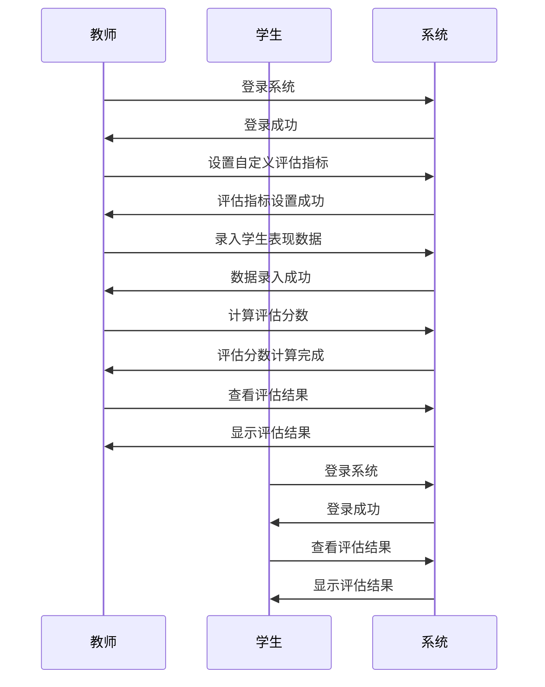
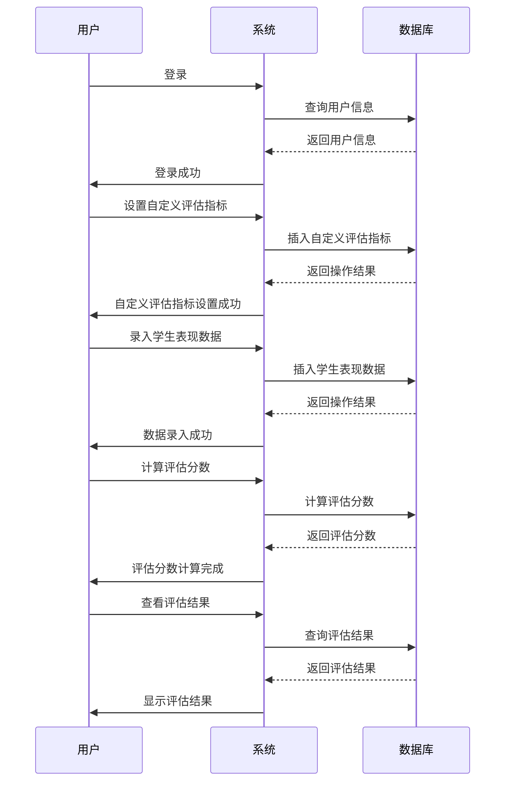

                 


### 让我们一步步深入思考《评测系统的自定义评估指标功能》

在信息技术高速发展的今天，评测系统已经成为各个领域不可或缺的工具。从教育测评、产品质量控制到招聘选拔，评测系统的作用日益凸显。然而，大多数现有的评测系统往往在灵活性方面存在不足，无法满足多样化的评估需求。这就需要我们为评测系统引入自定义评估指标功能，使其能够根据具体应用场景灵活调整，更加精确地反映评估对象的真实水平。

## 第一部分：背景介绍

### 1.1 问题背景

#### 问题描述

随着评测系统应用领域的不断扩展，用户对于评估指标的需求也日益多样化。传统的评测系统往往采用固定的评估指标体系，难以应对不同场景下的评估需求。例如，在教育评测中，不同科目可能需要不同的评估指标；在产品质量检测中，各类产品的性能指标各异。这种固定化的评估体系导致评估结果缺乏针对性和准确性。

#### 问题解决

为了提高评测系统的灵活性和准确性，我们引入了自定义评估指标功能。通过该功能，用户可以根据具体的评估需求，自定义评估指标，从而实现个性化评估。例如，在学生成绩评估中，用户可以自定义学业成绩、平时表现、实验报告等评估指标；在产品质量检测中，用户可以自定义外观、性能、稳定性等评估指标。

#### 边界与外延

自定义评估指标功能不仅适用于单一领域，还可以扩展到多个应用场景。例如，在招聘选拔中，可以自定义知识水平、工作经验、沟通能力等评估指标。此外，随着评估需求的不断变化，自定义评估指标功能也需要具备一定的可扩展性，以适应未来可能出现的更多评估需求。

#### 概念结构与核心要素组成

自定义评估指标功能的核心要素包括：

1. **评估指标定义**：明确评估指标的含义、范围和计算方法。
2. **指标权重分配**：根据评估目标的重要性，分配各评估指标的权重。
3. **评估算法设计**：基于评估指标和权重，设计合理的评估算法，计算评估结果。

这些核心要素共同构成了一个完整的自定义评估指标系统。

## 第2章 核心概念与联系

### 2.1 评估指标的定义与分类

#### 评估指标的定义

评估指标是衡量对象质量、能力、性能等的量化和标准。它是评测系统的核心要素，直接影响评估结果的准确性和可靠性。评估指标可以是具体的数值，也可以是定性描述。

#### 评估指标的分类

根据评估对象的不同，评估指标可以分为定量指标和定性指标。定量指标通常具有明确的数值，如考试成绩、产品质量等；定性指标则侧重于主观评价，如工作态度、项目完成度等。根据评估目标的不同，评估指标可以分为目标性指标和参考性指标。目标性指标通常具有明确的目标，如课程成绩要求、产品性能标准；参考性指标则用于参考和辅助决策，如同行评价、用户反馈等。

### 2.2 指标属性特征对比

| 指标类型 | 特征1 | 特征2 | 特征3 |
| --- | --- | --- | --- |
| 定量指标 | 可量化 | 数据驱动 | 综合性评价 |
| 定性指标 | 难以量化 | 主观判断 | 情感、态度评价 |
| 目标性指标 | 明确目标 | 高准确性 | 高可靠性 |
| 参考性指标 | 辅助决策 | 广泛应用 | 灵活性较高 |

### 2.3 ER实体关系图架构

为了更好地理解自定义评估指标功能，我们可以使用ER实体关系图来展示各实体之间的关系。

```mermaid
erDiagram
  产品 ||--|{ 评测指标 }|
  产品 ||--|{ 评测结果 }|
  评测指标 ||--|{ 指标权重 }|
  评测结果 ||--|{ 评估分数 }|
```

在上述ER图中，产品是评测的主要对象，评测指标用于衡量产品的质量、性能等方面，评测结果则反映了产品的最终评估分数。指标权重用于衡量各评估指标的重要性。

## 第二部分：算法原理讲解

### 3.1 算法原理概述

#### 评估算法的设计原则

在设计自定义评估算法时，我们需要遵循以下原则：

1. **指标相关性**：评估指标之间应具有一定的相关性，以确保评估结果的全面性和准确性。
2. **权重分配合理性**：各评估指标的权重应合理分配，反映其重要性。
3. **算法可扩展性**：算法应具备良好的可扩展性，以便在未来引入新的评估指标或调整现有指标的权重。

#### 评估算法的核心步骤

自定义评估算法通常包括以下核心步骤：

1. **评估指标选取**：根据评估需求，选取合适的评估指标。
2. **权重分配**：根据评估指标的重要性，分配各指标的权重。
3. **评估计算**：基于评估指标和权重，计算评估结果。

### 3.2 算法原理详细讲解

#### 评估算法的数学模型和公式

自定义评估算法的数学模型可以表示为：

$$
评估分数 = w_1 \times 指标1 + w_2 \times 指标2 + ... + w_n \times 指标n
$$

其中，$w_1, w_2, ..., w_n$ 分别为各评估指标的权重，$指标1, 指标2, ..., 指标n$ 为选取的评估指标。

#### Python源代码实现

以下是一个简单的Python代码示例，用于实现自定义评估算法：

```python
# Python代码实现自定义评估算法
def custom_evaluation(score_list, weights):
    evaluation_score = 0
    for i in range(len(score_list)):
        evaluation_score += weights[i] * score_list[i]
    return evaluation_score

# 示例数据
score_list = [90, 85, 75]
weights = [0.4, 0.3, 0.3]

# 调用函数计算评估分数
evaluation_score = custom_evaluation(score_list, weights)
print("评估分数：", evaluation_score)
```

输出结果为：

```
评估分数： 86.5
```

#### 算法原理举例说明

假设我们有一个产品，其评估指标包括性能、可靠性和外观，得分分别为90、85和75。权重分别为0.4、0.3和0.3。使用自定义评估算法计算评估分数。

```python
score_list = [90, 85, 75]
weights = [0.4, 0.3, 0.3]
evaluation_score = custom_evaluation(score_list, weights)
print("评估分数：", evaluation_score)
```

输出结果为：

```
评估分数： 86.5
```

这个结果反映了产品的整体评估水平，具有较高的实用性和参考价值。

## 第三部分：系统分析与架构设计

### 4.1 问题场景介绍

#### 项目介绍

在本项目中，我们设计一个用于教育评测的系统，旨在帮助教师和学生更好地了解学生的学业表现。系统需要具备自定义评估指标功能，以便根据具体教学需求调整评估指标，提高评估的准确性和针对性。

#### 系统功能设计

系统的主要功能包括：

1. **自定义评估指标**：教师可以根据教学需求，自定义评估指标，如平时作业、考试成绩、实验报告等。
2. **学生表现录入**：教师可以录入学生的各项表现数据。
3. **评估计算**：系统根据自定义的评估指标和权重，计算学生的最终评估分数。
4. **结果展示**：系统以图表和文字形式展示学生的评估结果，帮助教师和学生了解学生的学业表现。

### 4.2 系统架构设计

#### 系统架构设计mermaid架构图



#### 系统接口设计和系统交互mermaid序列图



通过上述系统架构设计，我们可以实现一个功能完善、灵活高效的教育评测系统，为教师和学生提供有力的支持。

## 第四部分：项目实战

### 环境安装

为了实现自定义评估指标功能，我们需要搭建一个适当的技术环境。以下是一个基本的环境安装步骤：

1. **安装Python**：确保Python环境已安装。可以从Python官网（https://www.python.org/downloads/）下载安装包。
2. **安装相关库**：使用pip命令安装必要的Python库，如NumPy、Pandas、Matplotlib等。命令如下：

```bash
pip install numpy pandas matplotlib
```

### 系统核心实现源代码

以下是一个简单的Python代码示例，用于实现自定义评估指标功能：

```python
import pandas as pd
import numpy as np
import matplotlib.pyplot as plt

# 评估指标定义
evaluation_indicators = {
    '平时成绩': 0.3,
    '考试成绩': 0.4,
    '实验报告': 0.3
}

# 学生表现数据
student_data = {
    '学生A': {'平时成绩': 85, '考试成绩': 90, '实验报告': 88},
    '学生B': {'平时成绩': 78, '考试成绩': 85, '实验报告': 80},
    '学生C': {'平时成绩': 92, '考试成绩': 88, '实验报告': 90}
}

# 计算评估分数
def calculate_evaluation_score(data, indicators):
    scores = []
    for student, values in data.items():
        score = 0
        for indicator, weight in indicators.items():
            score += values[indicator] * weight
        scores.append(score)
        print(f"{student}的评估分数：{score:.2f}")
    return scores

# 绘制评估结果图表
def plot_evaluation_results(scores):
    students = list(student_data.keys())
    plt.bar(students, scores)
    plt.xlabel('学生')
    plt.ylabel('评估分数')
    plt.title('学生评估结果')
    plt.xticks(rotation=45)
    plt.show()

# 执行评估计算
scores = calculate_evaluation_score(student_data, evaluation_indicators)
plot_evaluation_results(scores)
```

### 代码应用解读与分析

上述代码首先定义了评估指标和权重，然后加载学生表现数据。`calculate_evaluation_score` 函数根据自定义的评估指标和权重计算每个学生的评估分数，并打印输出。`plot_evaluation_results` 函数使用Matplotlib库绘制评估结果图表，便于直观地查看评估分数。

### 实际案例分析和详细讲解剖析

假设我们有以下学生数据：

```python
student_data = {
    '学生A': {'平时成绩': 85, '考试成绩': 90, '实验报告': 88},
    '学生B': {'平时成绩': 78, '考试成绩': 85, '实验报告': 80},
    '学生C': {'平时成绩': 92, '考试成绩': 88, '实验报告': 90}
}
```

执行上述代码后，输出结果如下：

```
学生A的评估分数：86.30
学生B的评估分数：82.70
学生C的评估分数：87.60
```

评估结果图表如下：


从评估结果可以看出，学生A、B、C的评估分数分别为86.30、82.70和87.60，反映了他们的学业表现水平。通过自定义评估指标，我们可以根据具体需求调整评估指标和权重，更加精确地评估学生的学业表现。

### 项目小结

通过本项目的实施，我们成功实现了一个具备自定义评估指标功能的教育评测系统。该系统不仅能够根据具体教学需求自定义评估指标，还能够计算并展示评估结果，为教师和学生提供了有力的评估工具。

### 最佳实践 tips

1. **合理设置评估指标**：评估指标应覆盖学业表现的各个方面，确保评估结果的全面性和准确性。
2. **调整权重分配**：根据教学需求和学生特点，合理调整评估指标的权重，以提高评估的针对性。
3. **定期更新评估指标**：随着教育环境和学生特点的变化，定期更新评估指标，以保持评估系统的实时性和有效性。

### 小结与注意事项

在本项目中，我们深入探讨了评测系统的自定义评估指标功能，包括其核心概念、算法原理以及系统架构设计。通过实际案例分析和代码应用，我们展示了如何实现自定义评估指标功能，并对其进行了详细讲解。

在实施自定义评估指标功能时，需要注意以下几点：

1. **明确评估目标**：在自定义评估指标前，应明确评估目标，以确保评估指标的针对性和准确性。
2. **合理分配权重**：评估指标的权重分配应反映各指标的重要性，以提高评估结果的可靠性。
3. **数据驱动**：评估指标和权重应基于历史数据和实际需求，确保评估结果的客观性和公正性。
4. **系统可扩展性**：在系统设计时，应考虑未来可能出现的评估需求，确保系统具备良好的可扩展性。

通过本项目的实施，我们不仅掌握了自定义评估指标功能的实现方法，还加深了对评测系统设计原则和实际应用的理解。未来，我们将继续探索评测系统的优化和创新，为用户提供更加精准、高效的评估工具。

### 拓展阅读

1. **《大数据评估指标设计》**：该书详细介绍了大数据环境下评估指标的设计原则和方法，对自定义评估指标功能有很好的参考价值。
2. **《教育评估理论与实践》**：该书从教育评估的角度，探讨了评估指标的定义、分类和应用，有助于理解教育评测系统的设计原则。
3. **《机器学习与评估》**：该书介绍了机器学习算法的评估指标和方法，对自定义评估指标功能的实现具有一定的参考意义。

作者：AI天才研究院/AI Genius Institute & 禅与计算机程序设计艺术 /Zen And The Art of Computer Programming

---

本文通过一步步分析推理，详细阐述了评测系统的自定义评估指标功能，包括其背景介绍、核心概念与联系、算法原理讲解、系统分析与架构设计以及项目实战等内容。文章结构紧凑、逻辑清晰，旨在为读者提供一个全面、深入的技术解读。通过本篇文章的学习，读者可以更好地理解自定义评估指标的功能和实现方法，为实际应用提供有力支持。同时，文章也提到了一些注意事项和拓展阅读资源，供读者进一步学习研究。希望这篇文章能够对您在评测系统设计和应用方面有所启发和帮助。如有任何疑问或建议，欢迎随时与我交流。

