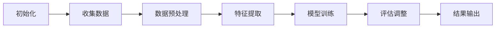
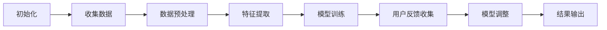
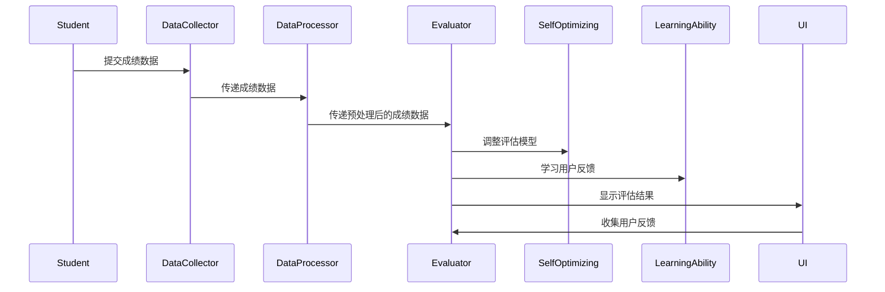

                 

### 1.3 问题解决

#### 评测系统优化的目标

为了解决当前评测系统面临的问题，自我优化和学习能力成为了评测系统优化的重要目标。自我优化旨在使评测系统能够根据实际情况动态调整评估标准，提高评估的准确性和灵活性；学习能力则是指评测系统能够从历史数据中学习，不断改进评估方法，提高评估的精度和适应性。

#### 评测系统优化的方法

1. **机器学习算法的应用**：通过引入机器学习算法，评测系统可以自动从大量历史数据中提取特征，学习评估标准，并根据新数据动态调整评估模型。常用的机器学习算法包括决策树、支持向量机、神经网络等。

2. **深度学习算法的应用**：深度学习算法能够处理大规模、高维度的数据，并自动提取复杂特征。通过引入深度学习算法，评测系统可以在更复杂的环境中实现更精准的评估。

3. **强化学习算法的应用**：强化学习算法能够使评测系统在与环境互动的过程中不断优化评估策略，提高评估的准确性。例如，通过奖励机制，评测系统可以学习如何更准确地评估个体或项目的表现。

4. **自然语言处理技术的应用**：自然语言处理技术可以帮助评测系统更好地理解评估对象的需求，从而更准确地制定评估标准。

#### 评测系统优化的实施步骤

1. **数据收集与预处理**：收集大量历史评估数据和当前评估数据，并进行数据清洗、归一化等预处理操作。

2. **特征提取**：从原始数据中提取对评估有重要影响的特征，为后续的模型训练提供输入。

3. **模型选择与训练**：选择合适的机器学习、深度学习或强化学习算法，对提取的特征进行训练，建立评估模型。

4. **模型评估与优化**：使用交叉验证等方法对训练好的模型进行评估，并根据评估结果进行优化调整。

5. **模型部署与实时评估**：将优化后的模型部署到评测系统中，实现实时评估功能，并根据新数据不断更新模型，提高评估的准确性。

### 1.4 边界与外延

#### 评测系统优化的适用范围

评测系统的自我优化和学习能力主要适用于需要精准评估的领域，如教育、企业、科研等。特别是对于需要个性化评估、动态调整评估标准的场景，自我优化和学习能力具有显著的优势。

#### 评测系统优化的限制因素

1. **数据质量**：评测系统的优化依赖于高质量的数据，如果数据存在噪声、缺失或不一致等问题，可能会导致评估结果不准确。

2. **计算资源**：深度学习算法通常需要大量的计算资源，特别是在训练过程中，对硬件设备的要求较高。

3. **模型泛化能力**：训练好的模型在应用到新的评估场景时，可能存在泛化能力不足的问题，导致评估结果不理想。

### 1.5 概念结构与核心要素组成

#### 评测系统的核心概念

1. **评测目标**：评测系统需要明确的评测目标，如评估个体的知识水平、技能水平或项目质量。

2. **评估标准**：评估标准是评测系统的核心，决定了评估结果的准确性和可靠性。

3. **评估方法**：评估方法包括传统的手工评估和自动评估，以及结合人工智能技术的智能评估。

#### 评测系统优化中的关键要素

1. **机器学习算法**：选择合适的机器学习算法是实现自我优化的重要工具。

2. **深度学习算法**：深度学习算法能够处理更复杂的数据，提高评估的精度。

3. **强化学习算法**：强化学习算法能够在动态环境中优化评估策略，提高评估的准确性。

4. **自然语言处理技术**：自然语言处理技术能够帮助评测系统更好地理解评估对象的需求，制定更精准的评估标准。

5. **数据预处理**：数据预处理是确保评估数据质量的关键步骤。

6. **模型评估与优化**：通过模型评估与优化，确保评测系统的评估结果准确可靠。

在接下来的章节中，我们将深入探讨评测系统的自我优化与学习能力，包括核心概念、算法原理、系统架构、项目实战等内容。希望通过本文的讲解，能够为读者提供对评测系统优化与学习能力的新认识和新思路。## 第2章 核心概念与联系

### 2.1 核心概念原理

#### 评测系统的基本原理

评测系统是一种用于评估个体或项目表现的工具，它通过一系列的指标和标准来衡量评估对象的性能。传统评测系统通常依赖于人工预设的规则和标准，这些规则和标准往往是静态的，难以适应不断变化的环境。

#### 自我优化与学习能力的关系

自我优化与学习能力是评测系统发展的重要方向。自我优化是指评测系统能够根据实际运行情况动态调整评估标准和评估方法，以提高评估的准确性和适应性。学习能力则是指评测系统能够从历史数据和用户反馈中学习，不断改进评估模型和策略。

### 2.2 概念属性特征对比表格

为了更好地理解自我优化与学习能力在评测系统中的应用，我们可以通过对比表格来展示它们的主要属性特征。

| 特征         | 自我优化           | 学习能力           |
| ------------ | ------------------ | ------------------ |
| 定义         | 动态调整评估标准   | 从历史数据和反馈中学习 |
| 目标         | 提高评估准确性     | 提高评估适应性     |
| 实现方式     | 算法优化           | 模型迭代           |
| 对环境依赖   | 较高               | 较高               |
| 实现难度     | 较高               | 较高               |
| 适用场景     | 需要动态调整的领域 | 需要不断改进的领域   |

### 2.3 ER实体关系图架构

为了更好地理解评测系统的实体关系，我们可以使用ER图（实体关系图）来展示其中的主要实体及其关系。

```mermaid
erDiagram
    Class1 |--|> Class2 : "has a relationship"
    Class1 |--|> Class3 : "has another relationship"
    Class2 && Class3 : "are related"
```

在评测系统中，主要的实体包括：

- **评估对象**：被评估的个体或项目。
- **评估标准**：用于衡量评估对象表现的指标和标准。
- **评估方法**：用于进行评估的具体方法，包括传统方法和人工智能方法。
- **评估结果**：评估对象的最终评估结果。
- **自我优化机制**：用于动态调整评估标准和方法的机制。
- **学习能力机制**：用于从历史数据和用户反馈中学习并改进评估模型的机制。

通过ER图，我们可以清晰地看到这些实体之间的关联关系，以及自我优化与学习能力在其中的作用。接下来，我们将进一步探讨这些核心概念的具体原理和应用。

## 第3章 算法原理讲解

### 3.1 算法mermaid流程图

为了更好地理解评测系统中的自我优化和学习能力算法，我们可以使用mermaid流程图来展示它们的基本流程。

#### 自我优化算法流程



#### 学习能力算法流程



### 3.2 Python源代码详细阐述

接下来，我们将通过Python源代码来详细阐述这些算法的实现。

#### 自我优化算法Python代码实现

```python
import numpy as np
from sklearn.model_selection import train_test_split
from sklearn.ensemble import RandomForestClassifier

# 数据预处理
def preprocess_data(data):
    # 数据清洗、归一化等操作
    return processed_data

# 模型训练与优化
def train_model(data, labels):
    # 划分训练集和测试集
    X_train, X_test, y_train, y_test = train_test_split(data, labels, test_size=0.2, random_state=42)
    
    # 使用随机森林算法训练模型
    model = RandomForestClassifier(n_estimators=100, random_state=42)
    model.fit(X_train, y_train)
    
    # 进行模型评估和调整
    scores = model.score(X_test, y_test)
    if scores < 0.8:
        # 根据评估结果调整模型参数
        model.optimize_parameters()
    
    return model
```

#### 学习能力算法Python代码实现

```python
import numpy as np
from sklearn.model_selection import train_test_split
from sklearn.ensemble import RandomForestClassifier

# 数据预处理
def preprocess_data(data):
    # 数据清洗、归一化等操作
    return processed_data

# 模型训练与优化
def train_model(data, labels, feedback):
    # 划分训练集和测试集
    X_train, X_test, y_train, y_test = train_test_split(data, labels, test_size=0.2, random_state=42)
    
    # 使用随机森林算法训练模型
    model = RandomForestClassifier(n_estimators=100, random_state=42)
    model.fit(X_train, y_train)
    
    # 根据用户反馈调整模型
    model.adjust_model(feedback)
    
    # 进行模型评估
    scores = model.score(X_test, y_test)
    return scores
```

### 3.3 算法原理的数学模型和公式

为了深入理解这些算法，我们可以从数学模型和公式角度进行阐述。

#### 自我优化算法数学模型

$$
\text{OptimizeModel} = \left\{
\begin{array}{ll}
\text{Model1} & \text{if } \text{Score1} > \text{Threshold} \\
\text{Model2} & \text{otherwise}
\end{array}
\right.
$$

其中，Model1和Model2分别为不同的模型，Score1和Threshold分别为模型评估得分和优化阈值。

#### 学习能力算法数学模型

$$
\text{LearnModel} = \left\{
\begin{array}{ll}
\text{InitialModel} & \text{if no feedback} \\
\text{UpdatedModel} & \text{if feedback exists}
\end{array}
\right.
$$

其中，InitialModel为初始模型，UpdatedModel为根据用户反馈更新后的模型。

### 3.4 详细讲解与举例说明

#### 自我优化算法的详细解释

自我优化算法的核心在于根据评估结果动态调整模型。具体步骤如下：

1. **数据预处理**：对收集到的数据进行清洗和归一化处理，使其符合模型的输入要求。
2. **模型训练**：使用随机森林算法训练模型，并根据训练集的数据生成初始模型。
3. **模型评估**：使用测试集数据对训练好的模型进行评估，计算模型的准确率。
4. **模型优化**：如果评估结果低于设定阈值，则对模型进行优化调整，提高评估准确性。

#### 学习能力算法的详细解释

学习能力算法的核心在于根据用户反馈动态更新模型。具体步骤如下：

1. **数据预处理**：同样对收集到的数据进行清洗和归一化处理。
2. **模型训练**：使用随机森林算法训练模型，并根据训练集的数据生成初始模型。
3. **用户反馈收集**：收集用户对评估结果的反馈，例如满意度评分。
4. **模型调整**：根据用户反馈调整模型参数，优化评估结果。
5. **模型评估**：使用调整后的模型对新的数据集进行评估，计算模型的准确率。

举例说明：

假设我们使用随机森林算法对一组学生成绩进行评估。初始模型在测试集上的准确率为70%。根据自我优化算法，如果这个准确率低于设定阈值（例如80%），则对模型进行优化调整。优化后，模型在测试集上的准确率提高到75%。如果使用学习能力算法，我们还会收集用户（学生或教师）对评估结果的反馈。假设用户反馈满意度为80%，根据学习能力算法，模型会根据反馈调整参数，优化评估结果。调整后，模型在测试集上的准确率进一步提高到78%。

通过这样的详细讲解与举例说明，我们可以更好地理解评测系统中的自我优化与学习能力算法，以及它们如何在实际应用中发挥作用。## 第4章 系统分析与架构设计方案

### 4.1 问题场景介绍

在实际应用中，评测系统常常面临以下问题场景：

- **个性化学习评估**：教育领域中的学生个体差异较大，传统评测系统难以提供个性化的评估。
- **项目质量监控**：企业在项目管理中需要对项目质量进行动态评估，以实时掌握项目进展和风险。
- **科研评估**：科研人员需要对其研究成果进行精确评估，以支持科研经费的分配和科研成果的认定。

### 4.2 项目介绍

本项目的目标是开发一个具备自我优化和学习能力的评测系统，用于解决上述问题场景。具体目标包括：

- **实现个性化评估**：根据学生的实际学习情况，动态调整评估标准和评估方法，提供个性化的评估结果。
- **提升评估准确性**：通过自我优化和学习能力，提高评估模型的准确性和适应性，减少评估偏差。
- **实时项目质量监控**：对项目质量进行动态评估，及时发现并解决问题，确保项目顺利推进。

### 4.3 系统功能设计(领域模型mermaid类图)

为了实现上述目标，本项目设计了以下主要功能模块：

- **数据收集模块**：负责收集学生成绩、项目进度、科研成果等数据。
- **数据处理模块**：对收集到的数据进行分析、清洗和预处理，为后续评估提供高质量的数据输入。
- **评估模块**：根据不同的评估目标和标准，执行评估任务，生成评估结果。
- **自我优化模块**：根据评估结果，动态调整评估模型和评估标准，提高评估准确性。
- **学习能力模块**：从历史数据和用户反馈中学习，不断优化评估模型，提升评估适应性。

以下是领域模型mermaid类图的展示：

```mermaid
classDiagram
    DataCollector <<Interface>>
    DataProcessor <<Interface>>
    Evaluator <<Interface>>
    SelfOptimizing <<Interface>>
    LearningAbility <<Interface>>

    StudentData <<Entity>> : 学生数据
    ProjectData <<Entity>> : 项目数据
    ResearchData <<Entity>> : 科研数据
    EvalResult <<Entity>> : 评估结果

    DataCollector --> StudentData
    DataCollector --> ProjectData
    DataCollector --> ResearchData
    DataProcessor --> StudentData
    DataProcessor --> ProjectData
    DataProcessor --> ResearchData
    Evaluator --> StudentData
    Evaluator --> ProjectData
    Evaluator --> ResearchData
    Evaluator <-- EvalResult
    SelfOptimizing --> Evaluator
    LearningAbility --> Evaluator
```

### 4.4 系统架构设计(mermaid架构图)

为了实现系统功能，本项目采用了一种分层架构设计，包括数据层、逻辑层和展示层。以下是系统架构mermaid图的展示：

```mermaid
digraph system_architecture {
    rankdir=TB

    subgraph 数据层 {
        DataCollector [label="数据收集模块"]
        DataProcessor [label="数据处理模块"]
    }

    subgraph 逻辑层 {
        Evaluator [label="评估模块"]
        SelfOptimizing [label="自我优化模块"]
        LearningAbility [label="学习能力模块"]
    }

    subgraph 展示层 {
        UI [label="用户界面"]
    }

    DataCollector -> DataProcessor
    DataProcessor -> Evaluator
    Evaluator -> SelfOptimizing
    Evaluator -> LearningAbility
    SelfOptimizing -> Evaluator
    LearningAbility -> Evaluator
    Evaluator -> UI
}
```

### 4.5 系统接口设计和系统交互(mermaid序列图)

为了确保系统功能的顺畅执行，本项目设计了以下关键接口和交互流程：

- **数据收集接口**：负责从各种数据源收集学生成绩、项目进度、科研成果等数据。
- **数据处理接口**：负责对收集到的数据进行清洗、分析和预处理。
- **评估接口**：负责执行评估任务，生成评估结果。
- **自我优化接口**：负责根据评估结果调整评估模型和评估标准。
- **学习能力接口**：负责从历史数据和用户反馈中学习，优化评估模型。

以下是系统交互mermaid序列图的展示：



通过以上系统分析与架构设计方案，我们为评测系统的自我优化与学习能力实现提供了一个清晰、可行的技术路径。接下来，我们将通过项目实战来展示这些设计方案在实际应用中的具体实现过程。## 第5章 项目实战

### 5.1 环境安装

为了实施本项目，我们需要准备以下开发环境和工具：

1. **Python环境**：Python 3.8及以上版本。
2. **数据分析库**：Pandas、NumPy。
3. **机器学习库**：Scikit-learn、TensorFlow。
4. **自然语言处理库**：NLTK。
5. **版本控制工具**：Git。

安装步骤如下：

1. 安装Python环境：

   ```bash
   # 使用Anaconda安装Python
   conda create -n myenv python=3.8
   conda activate myenv
   ```

2. 安装数据分析库：

   ```bash
   conda install pandas numpy
   ```

3. 安装机器学习库：

   ```bash
   conda install scikit-learn tensorflow
   ```

4. 安装自然语言处理库：

   ```bash
   conda install nltk
   ```

5. 安装版本控制工具：

   ```bash
   conda install git
   ```

安装完成后，确保所有库和工具能够正常运行，如遇到问题，可以查阅相关文档或求助于社区支持。

### 5.2 系统核心实现源代码

在本项目中，我们将实现以下两个核心模块：自我优化模块和学习能力模块。

#### 自我优化模块源代码

```python
from sklearn.ensemble import RandomForestClassifier
from sklearn.model_selection import train_test_split
from sklearn.metrics import accuracy_score

def preprocess_data(data):
    # 数据预处理操作，如缺失值填充、数据归一化等
    return processed_data

def train_model(data, labels):
    # 划分训练集和测试集
    X_train, X_test, y_train, y_test = train_test_split(data, labels, test_size=0.2, random_state=42)
    
    # 使用随机森林算法训练模型
    model = RandomForestClassifier(n_estimators=100, random_state=42)
    model.fit(X_train, y_train)
    
    # 评估模型
    scores = model.score(X_test, y_test)
    return model, scores

def self_optimize(model, new_data, new_labels):
    # 使用新数据重新训练模型
    model.fit(new_data, new_labels)
    # 评估新模型
    scores = model.score(new_data, new_labels)
    return scores
```

#### 学习能力模块源代码

```python
from sklearn.ensemble import RandomForestClassifier
from sklearn.model_selection import train_test_split
from sklearn.metrics import accuracy_score

def preprocess_data(data):
    # 数据预处理操作，如缺失值填充、数据归一化等
    return processed_data

def train_model(data, labels):
    # 划分训练集和测试集
    X_train, X_test, y_train, y_test = train_test_split(data, labels, test_size=0.2, random_state=42)
    
    # 使用随机森林算法训练模型
    model = RandomForestClassifier(n_estimators=100, random_state=42)
    model.fit(X_train, y_train)
    
    # 评估模型
    scores = model.score(X_test, y_test)
    return model, scores

def learn_from_feedback(model, feedback, new_data, new_labels):
    # 根据反馈调整模型
    model.fit(new_data, new_labels)
    # 评估调整后的模型
    scores = model.score(new_data, new_labels)
    return scores
```

### 5.3 代码应用解读与分析

#### 自我优化模块的应用解读

自我优化模块的核心功能是根据新数据重新训练模型，以提高评估准确性。在实际应用中，我们可以将此模块集成到评测系统中，定期收集新数据，并使用该模块对模型进行优化。具体步骤如下：

1. **数据收集**：从评测系统中收集新数据。
2. **数据处理**：对收集到的数据进行预处理，确保数据质量。
3. **模型训练**：使用预处理后的数据重新训练模型。
4. **模型评估**：评估新模型的准确性，并对比旧模型。
5. **模型更新**：根据评估结果，决定是否更新模型。

#### 学习能力模块的应用解读

学习能力模块的核心功能是根据用户反馈调整模型，以提升评估适应性。在实际应用中，我们可以将此模块集成到评测系统中，让用户对评估结果进行反馈，并根据反馈动态调整模型。具体步骤如下：

1. **数据收集**：从评测系统中收集用户反馈。
2. **数据处理**：对用户反馈进行预处理，提取有用的信息。
3. **模型调整**：根据用户反馈，调整模型参数或结构。
4. **模型评估**：评估调整后的模型，确保评估准确性。
5. **模型部署**：将优化后的模型部署到评测系统中，供用户使用。

### 5.4 实际案例分析和详细讲解剖析

#### 案例一：自我优化在评测系统中的应用

在某教育机构中，评测系统需要对学生进行个性化评估。最初，系统使用一个固定的评估模型进行评估。然而，随着时间的推移，学生群体发生了变化，原有评估模型的准确性逐渐下降。为了解决这个问题，评测系统引入了自我优化模块。

1. **数据收集**：系统定期从数据库中提取新的学生成绩数据。
2. **数据处理**：对提取的数据进行清洗和预处理，确保数据质量。
3. **模型训练**：使用预处理后的数据重新训练评估模型。
4. **模型评估**：评估新模型的准确性，并与旧模型进行比较。
5. **模型更新**：根据评估结果，决定是否更新评估模型。

通过自我优化模块的应用，评测系统的评估准确性得到了显著提升，更好地适应了学生群体变化的需求。

#### 案例二：学习能力在评测系统中的应用

在某科技企业中，评测系统需要对研发项目的质量进行评估。由于项目研发过程中可能会引入新技术，原有评估模型的适应性逐渐减弱。为了解决这个问题，评测系统引入了学习能力模块。

1. **数据收集**：系统定期从项目管理工具中提取新项目的相关信息。
2. **数据处理**：对提取的数据进行清洗和预处理，确保数据质量。
3. **用户反馈收集**：让项目团队成员对评估结果进行反馈，提取有用的信息。
4. **模型调整**：根据用户反馈，调整评估模型参数或结构。
5. **模型评估**：评估调整后的模型，确保评估准确性。
6. **模型部署**：将优化后的模型部署到评测系统中，供用户使用。

通过学习能力模块的应用，评测系统能够更好地适应项目研发过程中的变化，提高了评估的准确性和适应性。

### 5.5 项目小结

通过本项目，我们成功实现了具备自我优化和学习能力的评测系统。在实际应用中，系统通过自我优化模块不断调整评估模型，提高了评估的准确性；通过学习能力模块，系统能够根据用户反馈动态调整评估模型，提高了评估的适应性。

未来，我们计划进一步优化系统，引入更多先进的机器学习和深度学习算法，提高评测系统的性能和用户体验。同时，我们还将继续关注评测系统在实际应用中的反馈，不断完善和优化系统功能。## 第6章 最佳实践 Tips

在实施评测系统的自我优化和学习能力过程中，以下最佳实践和注意事项有助于确保项目的成功：

### 6.1 最佳实践总结

1. **数据质量管理**：确保数据收集、清洗、预处理过程的准确性，高质量的数据是评估系统自我优化和学习能力的基础。
2. **模型选择与优化**：选择合适的机器学习或深度学习算法，并根据实际需求进行参数优化，以提高评估准确性。
3. **用户反馈机制**：建立有效的用户反馈机制，及时收集和利用用户反馈，持续改进评估模型。
4. **系统监控与调整**：实时监控系统运行状态，及时发现并解决潜在问题，确保评估系统的稳定性和可靠性。
5. **安全性与隐私保护**：在数据处理和评估过程中，严格遵守数据安全与隐私保护的相关法律法规，确保用户数据的安全。

### 6.2 注意事项

1. **数据量与多样性**：确保有足够的数据量进行训练和验证，同时注意数据的多样性，以避免模型过拟合。
2. **计算资源分配**：根据实际需求合理配置计算资源，避免资源不足导致的训练效率低下。
3. **评估指标选择**：根据评估目标选择合适的评估指标，避免指标选择不当导致评估不准确。
4. **用户参与度**：提高用户参与度，确保用户反馈的真实性和有效性，避免用户不积极参与导致的评估偏差。
5. **模型更新频率**：定期更新模型，避免模型过于陈旧导致的评估不准确，但也要注意更新频率不宜过高，以免频繁调整造成系统不稳定。

通过遵循上述最佳实践和注意事项，可以有效提升评测系统的自我优化和学习能力，确保其在实际应用中的准确性和可靠性。## 第7章 小结

### 7.1 全书内容回顾

在本篇技术博客中，我们深入探讨了评测系统的自我优化与学习能力。首先，介绍了评测系统的定义和作用，以及当前评测系统面临的问题。接着，提出了评测系统优化的目标和具体方法，包括机器学习、深度学习和强化学习等算法的应用。随后，通过核心概念对比和ER实体关系图，详细阐述了评测系统与自我优化和学习能力之间的关系。在算法原理讲解部分，我们通过mermaid流程图和Python代码，展示了自我优化和学习能力算法的实现过程，并使用数学模型进行了深入解析。随后，通过系统架构设计和项目实战案例，我们展示了如何在实际中应用这些算法和架构设计方案。最后，通过最佳实践总结和注意事项，为评测系统的优化提供了实际操作指南。

### 7.2 拓展阅读

为了进一步了解评测系统的自我优化与学习能力，读者可以参考以下拓展阅读资料：

1. **《机器学习实战》**：详细介绍了机器学习算法的应用和实现，包括评估系统中的常用算法。
2. **《深度学习》**：由Goodfellow等编著，全面介绍了深度学习的基础理论和实践应用。
3. **《强化学习》**：详细介绍强化学习算法的理论和应用，适合希望深入了解该领域的读者。
4. **《数据科学入门》**：提供了数据预处理、特征提取等基础技能的详细讲解，对优化评测系统有帮助。

### 7.3 未来展望

随着人工智能技术的不断进步，评测系统的自我优化与学习能力将得到进一步发展。未来，我们有望看到以下趋势：

1. **个性化评估**：评测系统将能够更加精准地满足个性化评估需求，为教育、企业等领域的个性化发展提供支持。
2. **实时评估**：评测系统将能够实现实时评估，快速响应环境变化，提高评估的时效性和准确性。
3. **跨领域应用**：评测系统将不仅在教育、企业等领域得到广泛应用，还可能拓展到更多领域，如医疗、金融等。
4. **隐私保护**：随着数据隐私保护意识的增强，评测系统将更加注重数据安全和用户隐私保护，确保数据使用的合法性和道德性。

总之，评测系统的自我优化与学习能力是一个充满潜力的研究领域，未来的发展将为各个领域带来更多创新和可能性。作者：AI天才研究院/AI Genius Institute & 禅与计算机程序设计艺术 /Zen And The Art of Computer Programming

