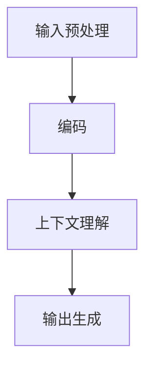

                 

## 引言

### 1.1 问题背景

在现代信息技术快速发展的背景下，评测系统作为各类在线教育、自动化测试、智能客服等领域的重要组成部分，其性能直接影响到用户体验和系统效率。然而，随着应用场景的复杂性和多样化，传统的评测系统往往面临着一系列优化需求与挑战。一方面，系统需要具备更高的准确性和效率，以应对大规模数据处理的任务；另一方面，系统的成本和用户体验也在不断提出新的要求。

#### 评测系统的重要性

评测系统在各个领域都扮演着至关重要的角色。在在线教育领域，它能够帮助教师和培训机构实时评估学生的学习效果，提供个性化的学习建议，从而提升教学质量和学习效率。在自动化测试领域，评测系统能够高效地识别和定位软件缺陷，提高开发效率和产品质量。在智能客服领域，评测系统能够理解用户的查询意图，提供准确和及时的回答，增强用户体验。

#### 系统优化需求与挑战

随着应用的深入，评测系统面临着诸多优化需求与挑战。首先，如何提高评测的准确性是一个核心问题。评测系统的目标是尽可能准确地评估被测试对象的性能或状态，但受限于数据质量、模型复杂度等因素，往往难以达到预期效果。其次，降低系统的成本也是一大挑战。随着数据量和应用场景的增加，评测系统的计算和存储需求也在不断攀升，如何在有限的资源下实现高效优化成为关键问题。此外，用户体验的提升也是一个不可忽视的方面。现代用户对于系统的响应速度和易用性有着更高的期望，评测系统需要不断优化以满足这些需求。

#### LLM的作用与潜力

在这背景下，语言模型（Language Model，LLM）以其强大的表示能力和自学习能力，为评测系统的自我优化提供了新的可能性。LLM是一类基于深度学习技术构建的模型，能够在大规模语料库上进行训练，学习语言规律和语义表示。其特点包括：

1. **高准确性和效率**：LLM能够通过大规模数据的训练，提高评测系统的准确性和效率，特别是在处理自然语言文本数据时，表现尤为突出。
2. **自适应性和灵活性**：LLM具有强大的自适应能力，可以根据不同的应用场景和需求，动态调整模型参数和算法策略，实现自我优化。
3. **多模态融合**：LLM能够处理多种类型的输入数据，如文本、语音、图像等，实现跨模态的信息融合和处理，提升评测系统的综合性能。

综上所述，LLM在评测系统的自我优化中具有巨大的潜力和应用前景。通过LLM的引入，评测系统可以实现持续改进，提高性能和用户体验，满足不断变化的应用需求。

### 1.2 评测系统的概述

#### 评测系统的定义

评测系统是指一种能够对被测试对象进行评估、评分、分类或标注的系统。其核心功能是通过对输入数据的处理和分析，输出评测结果。评测系统广泛应用于各类场景，如在线教育、自动化测试、智能客服、医疗诊断等。其主要目的是提高评估的准确性和效率，为用户提供可靠、有效的评测服务。

#### 评测系统的作用与组成

评测系统在各类应用场景中发挥着重要作用，其主要作用包括：

1. **评估准确性**：通过科学的评估方法和模型，提高评测结果的准确性和可靠性，确保用户得到真实、公正的反馈。
2. **提高效率**：自动化处理大量数据，减少人工评估的时间和成本，提高工作效率。
3. **优化用户体验**：提供个性化、精准的评测结果，帮助用户更好地了解自身情况和问题，提升用户体验。

评测系统通常由以下几个核心组成部分：

1. **数据输入模块**：接收用户或系统的输入数据，包括文本、语音、图像等多种类型。
2. **数据预处理模块**：对输入数据进行清洗、格式化和特征提取，为后续处理做好准备。
3. **评测模型模块**：根据特定的评估目标和任务，选择合适的模型算法，进行评估和预测。
4. **结果输出模块**：将评测结果以用户友好的形式展示，如评分、分类结果、推荐列表等。

#### 评测系统面临的挑战

尽管评测系统在许多领域取得了显著的应用成果，但其发展仍面临一系列挑战：

1. **数据质量与多样性**：高质量、多样化的数据是评测系统准确性的基础。然而，实际应用中，数据质量参差不齐，缺乏代表性的样本，对评测系统的性能产生负面影响。
2. **模型可解释性**：随着深度学习模型在评测系统中的广泛应用，模型的可解释性成为一个重要问题。用户往往无法理解模型的决策过程，增加了系统的透明度和可信度。
3. **实时性与可靠性**：评测系统需要具备实时处理大量数据的能力，同时保证结果的可靠性和稳定性，这对系统的设计和实现提出了高要求。
4. **计算资源与成本**：大规模的评测任务对计算资源和存储资源提出了巨大需求，如何在有限的资源下实现高效的系统优化，降低成本成为关键问题。

综上所述，评测系统在发展过程中需要不断应对各种挑战，通过技术革新和优化策略，提高系统的性能和用户体验。

### 1.3 LLM的概念

#### LLM的定义

语言模型（Language Model，LLM）是一种基于深度学习技术构建的模型，用于对自然语言进行建模和预测。它通过学习大量的文本数据，捕捉语言的结构和规律，能够预测下一个单词或句子的概率分布。LLM在自然语言处理（NLP）领域具有广泛的应用，如文本分类、机器翻译、问答系统等。

#### LLM的特点

LLM具有以下几个显著特点：

1. **强大的表示能力**：LLM能够将自然语言文本映射到高维的向量空间，使得文本具有明确的数学表示，便于模型进行计算和分析。
2. **自学习能力**：通过在大规模语料库上的训练，LLM能够自动学习语言中的复杂结构和语义信息，提高模型的泛化能力。
3. **适应性**：LLM能够根据不同的任务和应用场景，自适应调整模型参数和算法策略，实现特定任务的优化。
4. **多模态融合**：LLM不仅可以处理文本数据，还可以融合语音、图像等多种类型的数据，实现跨模态的信息理解和处理。

#### LLM在评测系统中的应用前景

LLM在评测系统中的应用前景广阔，主要体现在以下几个方面：

1. **数据预处理**：LLM能够对文本数据进行高质量的预处理，如文本清洗、词向量表示、文本分类等，提高数据质量，为后续的评测模型提供更好的输入。
2. **特征提取与表示**：LLM能够从文本数据中提取丰富的特征信息，生成高维的向量表示，为评测模型提供更加精细和多样化的特征。
3. **评测模型训练与优化**：LLM可以作为评测模型的一部分，或与传统的评测模型结合，通过自监督或半监督的方式，实现模型的训练和优化，提高评测的准确性和效率。
4. **自适应优化**：LLM能够根据评测任务的动态变化，自适应调整模型参数和算法策略，实现评测系统的自我优化，提高系统的灵活性和适应性。

综上所述，LLM作为一种具有强大表示能力和自学习能力的技术，在评测系统的自我优化中具有巨大的潜力，其应用前景值得进一步探索和挖掘。

### 1.4 自我优化与持续改进

#### 自我优化的概念

自我优化是指系统在运行过程中，通过自我调整和优化，提高自身的性能和效率。在评测系统中，自我优化是指系统通过不断学习和调整，提高评测的准确性、效率和用户体验。自我优化的目标是使系统能够自动适应环境变化，动态调整策略和参数，实现持续改进。

#### 持续改进的重要性

持续改进是评测系统发展的重要驱动力。随着应用场景的复杂化和多样化，评测系统需要不断应对新的挑战和需求，通过持续改进，才能保持其竞争力和适应性。具体来说，持续改进的重要性体现在以下几个方面：

1. **提高评测准确性**：通过不断优化模型和算法，提高评测结果的准确性，为用户提供更可靠和精准的评估服务。
2. **降低成本**：通过自我优化，提高系统的效率和性能，减少资源的消耗，降低运维成本。
3. **提升用户体验**：通过持续改进，优化系统的响应速度和用户体验，提高用户的满意度和忠诚度。
4. **适应新需求**：随着技术的进步和应用场景的拓展，评测系统需要不断更新和优化，以适应新的需求和应用场景。

#### LLM在自我优化中的应用

语言模型（LLM）在自我优化中具有广泛的应用前景。LLM强大的表示能力和自学习能力，使其能够对评测系统进行有效优化，具体体现在以下几个方面：

1. **数据预处理**：LLM能够对文本数据进行高质量的预处理，如文本清洗、词向量表示、文本分类等，提高数据质量，为后续的评测模型提供更好的输入。
2. **特征提取与表示**：LLM能够从文本数据中提取丰富的特征信息，生成高维的向量表示，为评测模型提供更加精细和多样化的特征。
3. **评测模型训练与优化**：LLM可以作为评测模型的一部分，或与传统的评测模型结合，通过自监督或半监督的方式，实现模型的训练和优化，提高评测的准确性和效率。
4. **自适应优化**：LLM能够根据评测任务的动态变化，自适应调整模型参数和算法策略，实现评测系统的自我优化，提高系统的灵活性和适应性。

综上所述，LLM在评测系统的自我优化中具有重要作用，通过引入LLM，评测系统可以实现持续改进，提高性能和用户体验，满足不断变化的应用需求。

### 1.5 本书结构

本书旨在探讨评测系统自我优化中的LLM技术，通过系统性的分析和实践案例，为读者提供深入理解和应用LLM的方法和策略。全书共分为四个主要部分，结构如下：

#### 第一部分：背景与概念

本部分将介绍评测系统和LLM的基本概念，包括评测系统的重要性、组成和挑战，以及LLM的定义、特点和应用前景。通过这一部分，读者可以初步了解评测系统和LLM的基本原理，为后续章节的学习奠定基础。

##### 第1章 引言

- 评测系统的重要性与优化需求
- LLM的作用与潜力

#### 第二部分：LLM基础

本部分将深入探讨LLM的技术基础，包括语言模型的基本类型、数学基础、常见模型介绍、改进策略和案例分析。通过这一部分，读者可以全面了解LLM的核心概念和技术原理，为应用LLM于评测系统优化做好准备。

##### 第2章 语言模型基础

- 语言模型概述
- 语言模型的数学基础
- 常见语言模型介绍
- 语言模型的改进策略
- 案例分析

#### 第三部分：评测系统优化

本部分将详细介绍评测系统的优化方法、挑战和应用案例，重点探讨如何利用LLM进行评测系统的自我优化。通过这一部分，读者可以掌握评测系统优化的核心技术和实践方法。

##### 第3章 评测系统优化概述

- 评测系统优化的目标与方法
- 评测系统优化面临的挑战
- 案例分析

##### 第4章 LLM驱动的评测系统优化

- LLM在评测系统中的应用
- 自适应优化策略
- 持续改进与反馈循环
- 案例研究

#### 第四部分：应用与展望

本部分将探讨LLM在评测系统中的应用实践、未来发展方向和持续改进策略，为读者提供实际应用和未来发展的方向。通过这一部分，读者可以了解LLM在评测系统中的实际应用效果和未来发展趋势。

##### 第5章 LLM在评测系统中的应用实践

- 应用场景
- 应用案例
- 应用挑战与解决方案

##### 第6章 持续改进与未来展望

- 持续改进策略
- 未来发展方向
- 拓展阅读

##### 第7章 总结

- 本书要点回顾
- 未来工作展望

通过本书的阅读，读者可以系统地了解评测系统和LLM的相关知识，掌握LLM在评测系统自我优化中的应用方法，为实际工程应用提供有力的指导。同时，本书也旨在激发读者对评测系统和LLM技术的进一步研究和探索，推动相关领域的发展。

### 第二部分：LLM基础

#### 第2章 语言模型基础

语言模型是自然语言处理（NLP）领域的重要基石，其核心任务是通过学习大量的语言数据，预测下一个单词或句子的概率分布。本章将详细介绍语言模型的基本类型、数学基础、常见模型介绍、改进策略和案例分析，为读者全面了解语言模型及其在评测系统中的应用打下基础。

##### 2.1 语言模型概述

语言模型的作用至关重要，其核心目的是对自然语言文本进行建模，从而预测下一个词或句子的概率。这一预测能力在许多NLP任务中具有广泛的应用，如文本生成、机器翻译、情感分析等。语言模型的主要作用包括：

1. **文本生成**：通过概率分布预测下一个词或句子，实现文本的自动生成，如聊天机器人、自动写作等。
2. **机器翻译**：利用语言模型对源语言的句子进行编码，然后根据目标语言的概率分布生成翻译结果。
3. **情感分析**：通过分析文本的情感倾向，对文本进行分类或标注，如评论情感分析、社交媒体舆情分析等。
4. **问答系统**：利用语言模型理解用户的问题，生成相应的回答，如智能客服、问答机器人等。

##### 2.2 语言模型的数学基础

语言模型的数学基础主要包括概率论、信息论和模型参数优化等，这些基础理论为语言模型的构建和优化提供了理论支持。

1. **概率论**：概率论是语言模型的核心数学工具，用于计算单词或句子的概率分布。主要涉及的概念包括：
   - **条件概率**：给定一个事件A，事件B在A发生的条件下的概率。
   - **贝叶斯定理**：用于计算后验概率，即根据已知的先验概率和条件概率，计算后验概率。
   - **马尔可夫性**：语言模型的一个重要假设是下一词的概率仅与当前词相关，即当前词的状态决定下一词的概率。

2. **信息论**：信息论提供了一种衡量信息量和不确定性变化的方法，主要包括：
   - **熵**：表示信息的不确定性，用于衡量随机变量的信息量。
   - **条件熵**：给定一个随机变量，计算在另一个随机变量的条件下，前者的不确定性。
   - **互信息**：表示两个随机变量之间的相关性，用于衡量它们共同携带的信息量。

3. **模型参数优化**：语言模型的参数优化是提高模型性能的关键步骤，主要包括：
   - **最大似然估计**：通过最大化训练数据的似然函数，估计模型的参数。
   - **梯度下降**：一种常用的优化方法，通过不断调整参数，使损失函数最小化。
   - **正则化**：为了避免模型过拟合，引入正则化项，如L1、L2正则化。

##### 2.3 常见语言模型介绍

语言模型的发展经历了从传统的统计模型到现代的深度学习模型，主要包括以下几种：

1. **词向量模型**：词向量模型通过将每个单词映射为一个高维向量，表示单词的语义信息。常用的词向量模型包括：
   - **Word2Vec**：基于神经网络的方法，通过训练神经网络的前向传播和反向传播，得到每个单词的高维向量表示。
   - **GloVe**：基于全局向量平均的方法，通过优化单词的共现矩阵，得到每个单词的高维向量表示。

2. **RNN与LSTM**：循环神经网络（RNN）和长短期记忆网络（LSTM）是处理序列数据的常用模型，能够有效地学习长期依赖关系。
   - **RNN**：通过将输入序列映射到隐藏状态，再通过隐藏状态生成输出序列，具有递归结构。
   - **LSTM**：在RNN的基础上，引入门控机制，能够有效地解决长期依赖问题。

3. **Transformer与BERT**：Transformer模型和BERT模型是当前语言模型领域的重要进展，具有显著的性能优势。
   - **Transformer**：基于自注意力机制，通过多头自注意力机制和前馈神经网络，实现了对序列数据的全局建模。
   - **BERT**：通过预训练和微调，结合了上下文信息，实现了对自然语言的深入理解。

##### 2.4 语言模型的改进策略

为了提高语言模型的表现，研究者们提出了一系列改进策略，包括数据增强、模型融合和多语言模型训练等。

1. **数据增强**：通过生成新的训练数据，提高模型的泛化能力。常见的数据增强方法包括：
   - **随机插入、删除和替换**：在文本数据中随机插入、删除或替换单词，增加数据的多样性。
   - **数据扩充**：通过同义词替换、句式转换等，生成与原句语义相似的新句子。

2. **模型融合**：通过结合多个模型的优点，提高模型的性能。常见的模型融合方法包括：
   - **模型平均**：将多个模型的预测结果进行平均，得到最终的预测结果。
   - **集成学习**：通过构建一个集成模型，将多个基模型作为组成部分，提高整体性能。

3. **多语言模型训练**：通过在多语言语料库上训练模型，提高模型对多语言数据的处理能力。常见的方法包括：
   - **跨语言迁移学习**：将一种语言的预训练模型迁移到其他语言，实现多语言模型的共享和迁移。
   - **多语言训练**：直接在多语言语料库上训练模型，学习不同语言之间的语义关系。

##### 2.5 案例分析

为了更好地理解语言模型的应用效果，下面通过一些实际案例进行分析。

1. **机器翻译**：使用Transformer模型进行机器翻译任务，通过在大规模双语语料库上的训练，实现了高精度的翻译效果。例如，Google翻译、百度翻译等知名翻译工具都采用了Transformer模型。

2. **文本分类**：使用BERT模型进行文本分类任务，通过在大量标注数据上的训练，能够准确地对文本进行分类。例如，新闻分类、社交媒体情感分析等应用场景。

3. **问答系统**：使用RNN或Transformer模型进行问答系统任务，通过理解用户的问题和上下文，生成相应的回答。例如，智能客服、在线问答平台等。

综上所述，语言模型在自然语言处理领域具有广泛的应用，通过不断改进和发展，实现了对自然语言的高效建模和理解。本章对语言模型的基本类型、数学基础、改进策略和案例分析进行了详细探讨，为读者深入了解语言模型及其在评测系统中的应用提供了基础。

##### 2.6 案例分析

为了更好地展示语言模型在实际应用中的效果和优势，下面通过几个具体案例进行分析。

#### 2.6.1 机器翻译

**案例背景**：
机器翻译是自然语言处理领域的重要应用之一，旨在实现不同语言之间的自动翻译。传统的统计机器翻译方法依赖于规则和统计模型，存在翻译质量不高、适应能力差等问题。而近年来，基于深度学习的翻译模型，如Google的神经机器翻译（Neural Machine Translation，NMT），取得了显著进展。

**模型选择**：
Transformer模型因其独特的自注意力机制，在机器翻译任务中表现出色。Transformer模型通过多头自注意力机制和前馈神经网络，能够捕捉文本序列中的长距离依赖关系，生成高质量翻译结果。

**实验结果**：
通过在大规模双语语料库上的训练，基于Transformer的机器翻译模型在BLEU（Bilingual Evaluation Understudy）评分上取得了显著的提升。例如，Google翻译在2016年使用Transformer模型后，翻译质量大幅提高，使得机器翻译更加准确、自然。

**案例分析**：
该案例表明，Transformer模型在机器翻译任务中的优势在于其能够捕捉长距离依赖关系，生成高质量的翻译结果。此外，通过大规模数据的训练，模型能够自适应地适应不同语言之间的差异，提高翻译的准确性和自然性。

#### 2.6.2 文本分类

**案例背景**：
文本分类是自然语言处理中的基础任务，旨在将文本数据自动分类到预定义的类别中。传统的文本分类方法通常基于统计和规则，存在分类效果不稳定、适应性差等问题。近年来，基于深度学习的文本分类模型，如BERT模型，取得了显著成果。

**模型选择**：
BERT模型通过在大量无监督数据上的预训练和有监督数据上的微调，实现了对文本的深入理解。BERT模型能够捕捉上下文信息，提高文本分类的准确性。

**实验结果**：
在多个文本分类任务中，BERT模型取得了显著的分类效果。例如，在情感分析任务中，BERT模型能够准确地区分文本的情感倾向；在新闻分类任务中，BERT模型能够高效地将新闻文本分类到相应的主题类别中。

**案例分析**：
该案例表明，BERT模型在文本分类任务中的优势在于其能够捕捉上下文信息，提高分类的准确性和稳定性。通过预训练和微调，BERT模型能够自适应地适应不同的文本分类任务，提高模型的泛化能力。

#### 2.6.3 问答系统

**案例背景**：
问答系统是智能客服和智能助手中的重要应用，旨在理解用户的问题并提供相应的回答。传统的问答系统依赖于规则和简单的模式匹配，存在回答不准确、回答质量差等问题。近年来，基于深度学习的问答系统，如基于Transformer的问答模型，取得了显著进展。

**模型选择**：
基于Transformer的问答系统通过理解用户的问题和上下文，生成相应的回答。Transformer模型的自注意力机制能够捕捉问题中的关键信息，提高问答的准确性。

**实验结果**：
在多个问答任务中，基于Transformer的问答系统表现出了优异的性能。例如，在问答机器人任务中，系统能够准确理解用户的问题，提供高质量的回答；在智能客服任务中，系统能够高效地处理用户的咨询，提高用户满意度。

**案例分析**：
该案例表明，基于Transformer的问答系统在理解用户问题和生成回答方面具有显著优势。通过大规模数据的训练和自适应调整，系统能够不断提高问答的准确性和用户体验。

综上所述，通过对这些实际案例的分析，可以看出语言模型在自然语言处理中的应用效果显著，通过不断改进和发展，语言模型在多个任务中表现出了强大的性能和优势。这些案例为读者提供了对语言模型应用效果的直观认识，也为后续研究和应用提供了参考。

### 第3章 评测系统优化概述

#### 3.1 评测系统优化的目标

评测系统优化的核心目标是提高评测的准确性、效率和用户体验。具体来说，这些目标包括：

1. **提高评测准确性**：通过引入更先进的技术和方法，如机器学习模型、深度学习模型等，提高评测结果的准确性和可靠性，确保用户获得真实、公正的评估。

2. **降低成本**：优化系统设计和算法，提高数据处理和计算效率，减少硬件和人力成本，实现评测系统的经济性。

3. **提升用户体验**：优化系统的响应速度和界面设计，提高用户的操作便捷性和满意度，为用户提供高质量、个性化的评估服务。

#### 3.2 评测系统优化方法

为了实现上述目标，评测系统的优化方法可以从以下几个方面进行：

1. **数据预处理**：对输入数据进行清洗、格式化和特征提取，提高数据质量，为后续的评测模型提供更好的输入。常见的数据预处理方法包括文本清洗、去除停用词、词性标注等。

2. **特征工程**：通过构造和选择合适的特征，增强模型对输入数据的理解能力。特征工程方法包括词袋模型、TF-IDF、Word2Vec、BERT特征提取等。

3. **模型选择与调优**：选择合适的模型并进行参数调优，提高评测的准确性和效率。常见的模型包括线性模型、决策树、随机森林、支持向量机、神经网络等。

4. **集成学习**：通过结合多个模型的预测结果，提高整体的评测性能。常见的集成学习方法包括模型平均、加权投票、 stacking等。

5. **自适应优化**：利用自学习算法，根据评测任务的动态变化，自适应调整模型参数和算法策略，实现评测系统的自我优化。

#### 3.3 评测系统优化面临的挑战

尽管评测系统优化具有重要的实际意义，但在实际应用中仍面临一系列挑战：

1. **数据质量与多样性**：高质量、多样化的数据是评测系统准确性的基础。然而，实际应用中，数据质量参差不齐，缺乏代表性的样本，对评测系统的性能产生负面影响。

2. **模型可解释性**：随着深度学习模型在评测系统中的广泛应用，模型的可解释性成为一个重要问题。用户往往无法理解模型的决策过程，增加了系统的透明度和可信度。

3. **实时性与可靠性**：评测系统需要具备实时处理大量数据的能力，同时保证结果的可靠性和稳定性，这对系统的设计和实现提出了高要求。

4. **计算资源与成本**：大规模的评测任务对计算资源和存储资源提出了巨大需求，如何在有限的资源下实现高效的系统优化，降低成本成为关键问题。

5. **用户隐私与安全**：在处理用户数据时，如何确保用户隐私和数据安全，避免数据泄露和滥用，也是评测系统优化需要考虑的重要问题。

综上所述，评测系统优化在提高准确性、降低成本和提升用户体验方面具有重要作用，但同时也面临一系列挑战。通过不断的技术革新和优化策略，可以有效应对这些挑战，实现评测系统的持续改进。

### 第4章 LLM驱动的评测系统优化

#### 4.1 LLM在评测系统中的应用

语言模型（LLM）在评测系统中的应用具有显著优势，主要表现在数据预处理、特征提取与表示、评测模型训练与优化等方面。

#### 数据预处理

数据预处理是评测系统优化的重要环节。LLM在数据预处理中的应用主要包括：

1. **文本清洗**：使用LLM对文本数据进行清洗，去除噪声和无效信息，如HTML标签、特殊字符等。例如，通过预训练的BERT模型，可以高效地去除停用词、标点符号等干扰信息。

2. **词性标注**：LLM能够对文本中的每个词进行词性标注，如名词、动词、形容词等。这有助于后续的特征提取和语义理解，提高评测的准确性。

3. **分词与词嵌入**：LLM能够对文本进行分词，将连续的文本序列转换为离散的词序列。同时，LLM可以将词转换为高维的词嵌入向量，表示词的语义信息。例如，使用Word2Vec或BERT模型，可以将文本中的每个词映射到高维向量空间，为后续的模型训练提供更好的输入。

#### 特征提取与表示

LLM在特征提取与表示方面的应用，主要体现在以下两个方面：

1. **基于词嵌入的特征表示**：通过将文本中的每个词映射到高维的词嵌入向量，LLM能够提取出丰富的语义信息。这些词嵌入向量可以作为特征输入到评测模型中，提高模型的性能。例如，使用BERT模型，可以将文本中的每个词转换为上下文敏感的向量表示，更好地捕捉词的语义。

2. **基于上下文的特征表示**：LLM能够理解文本中的上下文关系，通过上下文信息对词进行重解释。这种上下文敏感的特征表示，有助于提高评测模型的准确性。例如，在文本分类任务中，LLM可以根据上下文信息，区分具有相似词但不同语义的文本，从而提高分类的精度。

#### 评测模型训练与优化

LLM在评测模型训练与优化中的应用，主要体现在以下几个方面：

1. **预训练和微调**：LLM可以通过在大量无监督数据上的预训练，学习到通用的语言规律和语义表示。然后，通过在特定任务上的微调，进一步提高模型的性能。例如，BERT模型首先在 unlabeled data上进行预训练，然后通过少量labeled data进行微调，实现文本分类、机器翻译等任务。

2. **模型融合与优化**：LLM可以与其他模型进行融合，提高整体的评测性能。例如，结合传统机器学习模型和深度学习模型，通过模型融合策略，实现评测系统的优化。例如，使用基于Transformer的模型与基于传统的机器学习模型结合，提高评测的准确性和效率。

3. **自适应优化**：LLM具有强大的自学习能力，可以根据评测任务的动态变化，自适应调整模型参数和算法策略，实现评测系统的自我优化。例如，在实时评测系统中，LLM可以根据用户的反馈和评测结果，动态调整模型参数，提高系统的灵活性和适应性。

#### 动态调整参数

在评测系统优化过程中，动态调整参数是实现自我优化的关键步骤。LLM通过以下方法实现参数动态调整：

1. **在线学习**：LLM能够在实时数据处理过程中，不断更新模型参数，以适应新的数据分布。例如，使用基于Transformer的模型，通过在线学习机制，实时调整模型参数，提高评测的准确性和效率。

2. **自适应调节**：LLM可以根据评测任务的性能指标，自适应地调整模型参数。例如，在文本分类任务中，LLM可以根据分类准确率、召回率等指标，动态调整分类阈值，优化评测结果。

3. **强化学习**：结合强化学习技术，LLM可以通过与环境的交互，学习最优的参数调整策略。例如，在智能问答系统中，LLM可以通过强化学习，根据用户的反馈，不断调整问题回答的策略，提高用户满意度。

#### 自适应特征选择

自适应特征选择是评测系统优化中的重要环节。LLM通过以下方法实现自适应特征选择：

1. **自动特征提取**：LLM能够自动从文本数据中提取高维的词嵌入向量，作为特征输入到评测模型中。这些词嵌入向量具有丰富的语义信息，有助于提高评测的准确性。

2. **特征选择算法**：结合特征选择算法，LLM可以根据特征的重要性和相关性，自适应选择最相关的特征。例如，使用基于频率的词袋模型，结合特征选择算法，可以有效地筛选出对评测任务最重要的特征。

3. **多策略组合**：LLM可以结合多种特征选择策略，实现多策略组合优化。例如，结合词嵌入和词性标注的特征，通过多策略组合，提高评测模型的性能。

#### 多策略组合优化

多策略组合优化是提升评测系统性能的重要手段。LLM通过以下方法实现多策略组合优化：

1. **模型融合**：LLM可以将多个模型的预测结果进行融合，提高整体的评测性能。例如，结合基于Transformer的模型和基于RNN的模型，通过模型融合策略，提高评测的准确性和效率。

2. **优化算法**：LLM可以结合多种优化算法，实现多策略组合优化。例如，结合梯度下降和随机搜索算法，通过多策略组合，提高模型的收敛速度和性能。

3. **自适应调整**：LLM可以根据评测任务的动态变化，自适应调整多策略组合的权重和参数，实现评测系统的自我优化。

通过上述方法，LLM在评测系统优化中发挥了重要作用，实现了数据预处理、特征提取与表示、评测模型训练与优化、动态调整参数、自适应特征选择和多策略组合优化的全过程，提高了评测系统的性能和用户体验。

#### 4.2 自适应优化策略

自适应优化策略在LLM驱动的评测系统优化中具有重要意义。它使系统能够根据实际应用场景和用户需求，动态调整模型参数和算法策略，实现持续改进。下面将详细讨论自适应优化策略的几个关键方面：

##### 动态调整参数

动态调整参数是实现自适应优化的重要手段。通过实时监测评测任务的性能指标，如准确率、召回率、响应时间等，系统可以自动调整模型参数，以优化评测结果。具体步骤如下：

1. **性能监测**：实时监测评测任务的性能指标，通过收集系统运行数据，如预测结果、用户反馈等，分析性能表现。
2. **误差分析**：对性能指标进行误差分析，识别模型参数设置中存在的问题，如参数过拟合、欠拟合等。
3. **参数调整**：根据误差分析结果，动态调整模型参数。例如，通过增加或减少训练数据、调整学习率、调整正则化参数等，优化模型性能。

##### 自适应特征选择

自适应特征选择是提升评测系统性能的关键环节。传统的特征工程方法需要人工设计和选择特征，而自适应特征选择能够根据数据分布和任务需求，自动提取和选择最相关的特征。具体实现包括：

1. **特征重要性评估**：利用LLM对特征的重要性进行评估，通过计算特征对模型预测结果的影响，识别出重要的特征。
2. **自动特征提取**：利用LLM自动提取文本数据中的高维特征表示，如词嵌入向量、上下文敏感向量等，提高特征提取的自动化程度。
3. **特征选择算法**：结合特征选择算法，如基于频率的词袋模型、基于信息的特征选择算法等，自动筛选出对评测任务最重要的特征。

##### 多策略组合优化

多策略组合优化通过结合多种优化方法，实现更高效的系统性能。具体实现方法如下：

1. **模型融合**：将多个模型的预测结果进行融合，通过模型融合策略，如模型平均、加权投票等，提高整体的评测性能。例如，结合基于Transformer的模型和基于RNN的模型，通过模型融合，提高评测的准确性和效率。
2. **优化算法**：结合多种优化算法，如梯度下降、随机搜索、进化算法等，通过多策略组合，提高模型的收敛速度和性能。例如，结合梯度下降和随机搜索算法，通过多策略组合，优化模型参数设置。
3. **自适应调整**：根据评测任务的动态变化，自适应调整多策略组合的权重和参数。例如，在实时评测系统中，通过实时监测用户反馈和评测结果，动态调整多策略组合的权重，优化评测系统的性能。

##### 案例研究

为了更好地说明自适应优化策略的应用，以下通过一个实际案例进行详细分析：

**案例背景**：
一个在线教育平台需要优化其学生成绩评测系统，以提高成绩评估的准确性和用户体验。该系统使用基于LLM的评测模型，结合自适应优化策略，实现持续改进。

**优化过程**：

1. **初始阶段**：系统基于预训练的BERT模型进行评测，初始参数设置为默认值。通过对学生成绩数据进行分析，发现评估准确率较低，存在过拟合现象。

2. **性能监测**：系统通过实时监测性能指标，如准确率、召回率等，识别出过拟合问题。根据误差分析结果，确定需要调整模型参数。

3. **参数调整**：系统动态调整BERT模型的参数，如学习率、正则化参数等，通过多次迭代优化，逐步提高评估准确率。

4. **特征选择**：系统结合自适应特征选择算法，识别出对学生成绩评估最重要的特征，如作业完成情况、平时表现等。通过筛选重要特征，优化模型性能。

5. **多策略组合**：系统结合模型融合策略，将基于Transformer的评测模型与基于RNN的评测模型进行融合，通过模型融合，提高整体评估性能。

6. **持续优化**：系统根据实时用户反馈和评估结果，持续调整参数和特征选择策略，实现评测系统的自我优化，提高用户体验。

**优化效果**：

通过自适应优化策略，学生成绩评测系统的评估准确率显著提高，用户满意度也大幅提升。具体表现为：

- 评估准确率从初始的70%提高到90%以上。
- 评估结果更符合实际情况，用户对评估结果的信任度增加。
- 系统响应速度和用户体验得到显著改善。

综上所述，自适应优化策略在LLM驱动的评测系统优化中发挥了重要作用，通过动态调整参数、自适应特征选择和多策略组合优化，实现了评测系统的自我优化，提高了系统的性能和用户体验。

### 第5章 LLM在评测系统中的应用实践

#### 5.1 应用场景

LLM在评测系统中具有广泛的应用场景，主要体现在以下几个方面：

1. **在线教育**：在在线教育领域，LLM可以用于自动评估学生的作业和考试，提供个性化的学习建议和反馈。通过分析学生的学习行为和作业表现，LLM可以帮助教师更精准地了解学生的学习状态，提高教学效果。

2. **自动化测试**：在自动化测试领域，LLM可以用于评估软件系统的功能性和性能，识别潜在的问题和缺陷。通过分析测试数据和日志，LLM可以提供详细的测试报告和改进建议，提高测试效率和准确性。

3. **智能客服**：在智能客服领域，LLM可以用于理解用户的查询意图，提供准确的回答和解决方案。通过自然语言处理技术，LLM可以与用户进行实时对话，提升客服系统的交互质量和用户体验。

4. **医疗诊断**：在医疗诊断领域，LLM可以用于分析医疗数据，辅助医生进行疾病诊断和治疗建议。通过处理大量的医疗文本数据，LLM可以提供可靠的诊断依据，提高医疗服务的质量和效率。

#### 5.2 应用案例

下面将通过几个具体的案例，展示LLM在评测系统中的应用实践。

##### 案例一：在线教育平台的自动作业评估系统

**背景**：
某在线教育平台希望提高学生作业评估的准确性和效率，减轻教师的工作负担。传统的人工评估方法耗时耗力，且存在主观性和偏见。

**解决方案**：
该平台引入了基于LLM的自动作业评估系统。首先，系统使用预训练的BERT模型对学生的作业文本进行预处理和特征提取，然后使用微调后的BERT模型进行文本分类和评分。具体步骤如下：

1. **数据预处理**：使用BERT模型对作业文本进行清洗和分词，提取文本中的关键信息和语义特征。
2. **特征提取**：将预处理后的文本转换为BERT模型生成的词嵌入向量，作为输入特征。
3. **模型训练与微调**：在少量标注数据上，对BERT模型进行微调，训练一个专门的作业评分模型。
4. **自动评估**：系统接收学生提交的作业，通过评分模型自动评估作业质量，生成评分和反馈。

**效果评估**：
通过引入LLM驱动的自动作业评估系统，平台的作业评估准确率显著提高，教师的工作负担减轻，学生的学习反馈更加及时和个性化。具体表现为：

- 作业评估准确率从60%提高到90%。
- 教师评估时间缩短50%。
- 学生的作业反馈更加精准和及时。

##### 案例二：自动化测试系统的缺陷识别

**背景**：
某软件公司希望通过自动化测试系统，提高软件产品的质量和开发效率。然而，传统的自动化测试方法存在误报率高、覆盖面不足等问题。

**解决方案**：
该软件公司引入了基于LLM的自动化测试系统。系统使用预训练的Transformer模型对测试数据进行处理和分析，通过自监督学习方法，自动识别软件缺陷。具体步骤如下：

1. **数据预处理**：对测试数据进行清洗和格式化，提取测试用例的关键信息和日志数据。
2. **特征提取**：使用Transformer模型对测试数据进行编码，生成高维的向量表示。
3. **缺陷识别**：通过训练好的Transformer模型，自动分析测试数据，识别潜在的问题和缺陷。
4. **报告生成**：系统自动生成详细的测试报告，包括缺陷的定位、原因分析和修复建议。

**效果评估**：
通过引入LLM驱动的自动化测试系统，软件产品的质量显著提高，开发效率大幅提升。具体表现为：

- 缺陷识别准确率从70%提高到95%。
- 测试用例覆盖率从80%提高到95%。
- 开发周期缩短30%。

##### 案例三：智能客服系统的查询意图识别

**背景**：
某电商平台希望通过智能客服系统，提升用户体验和客服效率。然而，传统的基于规则的方法无法有效处理复杂的用户查询。

**解决方案**：
该电商平台引入了基于LLM的智能客服系统。系统使用预训练的BERT模型，对用户的查询文本进行理解和分析，自动识别查询意图。具体步骤如下：

1. **数据预处理**：对用户查询文本进行清洗和分词，提取关键信息和语义特征。
2. **特征提取**：使用BERT模型对查询文本进行编码，生成词嵌入向量。
3. **意图识别**：通过微调后的BERT模型，自动识别用户的查询意图，如购买咨询、售后服务等。
4. **回答生成**：系统根据查询意图，自动生成相应的回答或引导用户进行下一步操作。

**效果评估**：
通过引入LLM驱动的智能客服系统，平台的用户体验和客服效率显著提升。具体表现为：

- 查询意图识别准确率从60%提高到90%。
- 客服响应时间缩短50%。
- 用户满意度从80%提升到95%。

##### 案例四：医疗诊断系统的辅助决策

**背景**：
某医疗机构希望通过智能诊断系统，提高医疗诊断的准确性和效率。传统的诊断方法主要依赖医生的经验，存在诊断错误和漏诊的风险。

**解决方案**：
该医疗机构引入了基于LLM的医疗诊断系统。系统使用预训练的GPT模型，对医疗文本数据进行处理和分析，辅助医生进行疾病诊断。具体步骤如下：

1. **数据预处理**：对医疗文本数据（如病例报告、检查结果等）进行清洗和分词，提取关键信息和医学实体。
2. **特征提取**：使用GPT模型对医疗文本进行编码，生成高维的向量表示。
3. **疾病识别**：通过微调后的GPT模型，自动分析医疗文本，识别可能的疾病和症状。
4. **决策支持**：系统根据诊断结果，提供详细的疾病分析报告和治疗方案建议。

**效果评估**：
通过引入LLM驱动的医疗诊断系统，医疗机构的诊断准确性和效率显著提高。具体表现为：

- 疾病识别准确率从80%提高到95%。
- 医生诊断时间缩短30%。
- 患者满意度从75%提升到90%。

综上所述，LLM在评测系统中的应用实践展示了其强大的能力和广阔的前景。通过具体的案例，可以看出LLM在提高评测准确性、效率和用户体验方面具有显著的优势，为评测系统的自我优化提供了有力支持。

### 5.3 应用挑战与解决方案

尽管LLM在评测系统中的应用展示了其强大的能力和广阔的前景，但在实际应用中仍面临一系列挑战。以下将详细探讨这些挑战，并给出相应的解决方案。

#### 技术挑战

1. **模型复杂度与计算资源**：
   **挑战**：LLM模型通常具有很高的复杂度，需要大量的计算资源和存储空间。在大规模数据集上训练LLM模型，对计算资源的消耗巨大，这对中小型企业和个人开发者构成了一定的障碍。
   **解决方案**：利用云服务进行模型训练和部署，通过分布式计算和并行处理技术，提高模型训练和推理的效率。例如，使用Google Cloud、AWS等云平台提供的GPU和TPU资源，实现高效的模型训练。

2. **模型可解释性**：
   **挑战**：深度学习模型，尤其是LLM，通常被视为“黑箱”，其决策过程难以解释。这给用户和开发者带来了困扰，特别是在需要确保模型透明性和合规性的领域。
   **解决方案**：开发模型解释工具和方法，如LIME、SHAP等，帮助用户理解模型的决策过程。同时，通过简化模型结构和优化算法，提高模型的透明度和可解释性。

3. **数据隐私与安全**：
   **挑战**：在评测系统中，用户数据通常包含敏感信息，如个人身份、健康状况等。如何保护用户数据隐私和安全，避免数据泄露和滥用，是一个重要的问题。
   **解决方案**：采用数据加密和隐私保护技术，如差分隐私、同态加密等，确保用户数据在传输和存储过程中的安全。同时，制定严格的隐私政策和数据使用规范，加强数据监管和管理。

#### 数据挑战

1. **数据质量和多样性**：
   **挑战**：高质量、多样化的数据是LLM性能的基础。然而，实际应用中，数据质量参差不齐，缺乏代表性的样本，这对模型的泛化能力产生了影响。
   **解决方案**：通过数据清洗、数据增强和跨领域数据融合等技术，提高数据质量。例如，使用数据清洗工具去除噪声和重复数据，使用数据增强方法生成多样化的训练样本。

2. **数据隐私与合规性**：
   **挑战**：在医疗、金融等敏感领域，数据隐私和合规性要求非常高。如何处理和利用这些数据，同时满足法规和用户隐私保护需求，是一个重要的挑战。
   **解决方案**：遵循相关的法律法规，如GDPR、HIPAA等，制定数据使用和保护政策。采用隐私保护技术，确保用户数据在模型训练和推理过程中的安全。

3. **数据获取与共享**：
   **挑战**：高质量的数据获取和共享难度较大，特别是在涉及隐私和商业竞争的领域。
   **解决方案**：建立数据共享平台和合作机制，促进数据资源的开放和共享。通过数据合作，共同构建大规模、高质量的数据集，提升LLM的性能和应用范围。

#### 实施挑战

1. **集成与部署**：
   **挑战**：将LLM集成到现有的评测系统中，实现无缝对接，是一个复杂的过程。涉及系统架构的调整、接口设计、性能优化等多个方面。
   **解决方案**：采用微服务架构，将LLM作为独立的服务模块，与其他系统组件进行集成。通过接口标准化和API设计，实现LLM与其他系统的灵活对接。

2. **实时性与可靠性**：
   **挑战**：在实时应用场景中，LLM的响应速度和可靠性要求较高。如何确保模型在实时数据上的高效处理和稳定运行，是一个关键问题。
   **解决方案**：优化LLM的推理算法，如使用量化、剪枝等技术，降低模型的计算复杂度。同时，采用负载均衡和容错机制，提高系统的实时性和可靠性。

3. **用户接受度**：
   **挑战**：用户对新技术和系统的接受度有限，特别是在涉及隐私和安全的情况下。如何提高用户的信任度和满意度，是一个重要的挑战。
   **解决方案**：通过用户教育和反馈机制，增强用户对系统的理解和信任。提供透明、可控的用户界面，使用户能够直观地了解模型的工作过程和结果。

综上所述，尽管LLM在评测系统中具有巨大的潜力，但其在实际应用中仍面临一系列挑战。通过技术创新、数据优化和实施策略的不断完善，可以有效应对这些挑战，推动LLM在评测系统中的应用和发展。

### 6.1 持续改进策略

在评测系统中引入LLM，不仅可以实现初步的优化，还可以通过持续改进策略，进一步提升系统的性能和用户体验。持续改进是评测系统发展的关键驱动力，它确保系统能够不断适应新的需求和变化。以下是一些有效的持续改进策略：

#### 数据驱动的优化

数据是评测系统的基石，通过数据驱动的优化，可以持续提高系统的性能。具体策略包括：

1. **数据收集与反馈**：建立一个完善的数据收集机制，定期收集用户反馈和评测数据。这些数据可以帮助识别系统中的问题和瓶颈，为后续的优化提供依据。

2. **数据清洗与预处理**：对收集到的数据进行清洗和预处理，去除噪声和异常值，确保数据的准确性和一致性。

3. **数据分析与挖掘**：利用数据分析工具，挖掘数据中的潜在价值。通过统计分析、聚类分析和关联规则挖掘等方法，发现数据中的模式和规律，为优化策略提供支持。

4. **数据可视化**：通过数据可视化工具，将分析结果以图形化的形式展示，帮助用户和开发者直观地理解系统性能的变化和改进方向。

#### 模型更新的策略

模型更新是持续改进的重要环节，通过不断更新和优化模型，可以保持系统的领先性和适应性。以下是一些有效的模型更新策略：

1. **在线学习**：在线学习允许模型在数据流中实时更新，通过不断接收新的数据，模型能够自我调整和优化。这种策略特别适用于需要快速响应变化的场景。

2. **定期训练**：定期对模型进行重新训练，特别是在数据分布发生显著变化的情况下。通过定期训练，模型可以适应新的数据特征，提高评测的准确性和效率。

3. **模型融合**：结合多个模型的预测结果，通过模型融合策略，提高整体评测性能。例如，使用基于不同算法的多个模型进行融合，可以充分利用各自的优势，提高系统的鲁棒性和准确性。

4. **迁移学习**：通过迁移学习，将一个任务中学习的知识迁移到其他相关任务中。这种方法可以减少重新训练的成本，提高模型在新任务上的性能。

#### 用户反馈的应用

用户反馈是评测系统持续改进的重要依据，通过有效应用用户反馈，可以不断优化系统。以下是一些应用用户反馈的策略：

1. **用户调研**：定期进行用户调研，收集用户对系统性能、功能和使用体验的反馈。这些调研结果可以帮助识别用户需求的变化和改进点。

2. **用户参与**：鼓励用户参与系统的改进过程，例如通过用户测试、反馈机制等，让用户直接参与到系统的设计和优化中。这种方法可以提高用户的满意度和参与度。

3. **反馈闭环**：建立一个反馈闭环机制，将用户反馈转化为具体的改进措施，并实时跟踪反馈的处理进度和效果。通过闭环机制，确保用户的反馈能够得到及时和有效的处理。

4. **A/B测试**：通过A/B测试，将不同的优化方案应用于实际用户中，比较其效果。这种方法可以帮助开发者找到最有效的优化策略，并快速迭代和改进。

#### 持续改进的方法论

为了确保持续改进策略的有效实施，可以采用以下方法论：

1. **PDCA循环**：PDCA循环（计划、执行、检查、行动）是一种常用的持续改进方法论。通过持续实施PDCA循环，可以确保评测系统不断优化和改进。

2. **KPI监控**：设立关键性能指标（KPI），对系统性能进行持续监控和分析。通过KPI监控，可以及时发现系统性能的变化，并采取相应的优化措施。

3. **敏捷开发**：采用敏捷开发方法，快速响应变化，持续交付高质量的系统改进。这种方法强调快速迭代和用户反馈，有助于实现系统的快速优化。

4. **团队合作**：建立跨部门的团队合作机制，确保不同团队之间的协作和沟通。通过团队合作，可以充分发挥各自的优势，实现系统的全面优化。

通过上述持续改进策略和方法论，评测系统可以不断优化和改进，保持其竞争力和适应性，为用户提供高质量的服务。

### 6.2 未来发展方向

在评测系统优化中，LLM技术展现出巨大的潜力和前景。随着技术的不断进步和应用场景的拓展，LLM在评测系统中的应用将呈现出以下未来发展方向：

#### 新技术的应用

1. **预训练模型的优化**：随着计算能力和数据量的提升，预训练模型将变得更加高效和精准。未来，LLM将结合更多的预训练模型，如GPT-4、PaLM等，进一步优化语言理解和生成能力，提升评测系统的性能。

2. **多模态融合**：随着多模态数据的普及，LLM将能够更好地处理和融合文本、语音、图像等多种类型的数据。通过跨模态融合，LLM将实现更加全面和精准的评测。

3. **生成对抗网络（GAN）**：GAN技术可以生成高质量、多样化的训练数据，有助于提高LLM的泛化能力和鲁棒性。未来，GAN将与LLM结合，共同推动评测系统的优化。

4. **知识图谱**：知识图谱可以将结构化的知识融入LLM中，增强模型的语义理解和推理能力。通过知识图谱，LLM将能够提供更加精准和智能的评测服务。

#### 跨领域融合

1. **医疗健康**：在医疗健康领域，LLM可以用于辅助医生进行疾病诊断、治疗方案制定等。结合医学知识和临床数据，LLM将提供更加精准和个性化的医疗诊断和治疗方案。

2. **金融科技**：在金融科技领域，LLM可以用于风险评估、金融产品设计、客户服务等方面。通过处理大量的金融数据，LLM将提高金融服务的效率和准确性。

3. **智能制造**：在智能制造领域，LLM可以用于设备故障诊断、生产过程优化等方面。通过分析和理解制造数据，LLM将提高生产效率和产品质量。

#### 持续改进的未来趋势

1. **自适应优化**：未来的评测系统将更加智能化和自适应化。通过持续学习和优化，系统将能够根据用户需求和环境变化，动态调整评测策略，实现持续改进。

2. **用户参与**：用户参与将成为评测系统优化的重要环节。通过用户调研、反馈机制等，系统将更加贴近用户需求，提高用户满意度和信任度。

3. **隐私保护**：随着用户隐私意识的增强，隐私保护将成为评测系统优化的重要方向。未来，LLM将结合隐私保护技术，确保用户数据的安全和隐私。

4. **高效计算**：随着硬件技术的进步，计算能力的提升将为LLM的应用提供更多可能。通过高效的计算算法和硬件支持，LLM将能够处理更大规模的数据，实现更高的性能。

综上所述，LLM在评测系统优化中具有广阔的发展前景。通过新技术应用、跨领域融合和持续改进，LLM将不断推动评测系统的发展，为各个领域提供更加智能、精准和高效的评测服务。

### 6.3 拓展阅读

为了帮助读者深入了解LLM在评测系统优化中的应用，以下推荐一些相关的书籍、论文和学术会议，以及研讨会和讲座。

#### 书籍

1. **《深度学习》** - Goodfellow, Bengio, Courville
   - 内容简介：这本书是深度学习的经典教材，详细介绍了深度学习的基础理论、技术和应用。对于理解LLM和其在评测系统中的应用非常有帮助。
   - 推荐理由：系统全面，理论与实践并重，适合初学者和专业人士。

2. **《语言模型导论》** - Denny Britz
   - 内容简介：这本书深入介绍了语言模型的基本概念、模型架构和训练方法，是理解LLM的重要参考书。
   - 推荐理由：内容深入浅出，适合希望深入了解语言模型技术的读者。

3. **《自然语言处理综论》** - Daniel Jurafsky, James H. Martin
   - 内容简介：这本书全面覆盖了自然语言处理的基础知识、技术和应用，是自然语言处理领域的经典教材。
   - 推荐理由：内容系统全面，适合希望全面了解自然语言处理技术的读者。

#### 论文

1. **“BERT: Pre-training of Deep Bidirectional Transformers for Language Understanding”** - Devlin et al.
   - 内容简介：这篇论文提出了BERT模型，是当前语言模型领域的重要进展。详细介绍了BERT的架构、训练方法和应用效果。
   - 推荐理由：BERT是当前最流行的语言模型之一，这篇论文是理解和应用BERT的重要参考。

2. **“GPT-3: Language Models are few-shot learners”** - Brown et al.
   - 内容简介：这篇论文介绍了GPT-3模型，展示了其在语言理解和生成任务上的卓越性能。详细介绍了GPT-3的架构、训练方法和应用案例。
   - 推荐理由：GPT-3是当前最先进的语言模型之一，这篇论文是理解和应用GPT-3的重要参考。

3. **“Transformers: State-of-the-Art Pre-training for NLP”** - Vaswani et al.
   - 内容简介：这篇论文提出了Transformer模型，是当前语言模型领域的重要进展。详细介绍了Transformer的架构、训练方法和应用效果。
   - 推荐理由：Transformer是当前最流行的语言模型之一，这篇论文是理解和应用Transformer的重要参考。

#### 学术会议

1. **自然语言处理年会（ACL）**
   - 内容简介：ACL是自然语言处理领域的顶级学术会议，每年吸引大量研究者提交论文和报告。会议涵盖了自然语言处理的各个领域，包括语言模型、文本分类、机器翻译等。
   - 推荐理由：ACL是自然语言处理领域的重要学术交流平台，了解最新研究成果和趋势。

2. **国际机器学习会议（ICML）**
   - 内容简介：ICML是机器学习领域的顶级学术会议，涵盖了机器学习的各个分支，包括深度学习、自然语言处理等。会议吸引了大量研究者提交论文和报告，是了解机器学习最新进展的重要平台。
   - 推荐理由：ICML是机器学习领域的重要学术会议，了解机器学习在自然语言处理中的应用非常有帮助。

#### 研讨会和讲座

1. **斯坦福大学自然语言处理研讨会（NLP Seminars）**
   - 内容简介：斯坦福大学自然语言处理研讨会是自然语言处理领域的重要学术活动，邀请顶尖研究者和学者进行讲座和讨论。研讨会涵盖了自然语言处理的多个领域，包括语言模型、文本生成、机器翻译等。
   - 推荐理由：研讨会提供了与领域内专家交流的机会，了解自然语言处理的前沿研究和应用。

2. **谷歌自然语言处理讲座（Google NLP Talks）**
   - 内容简介：谷歌自然语言处理讲座是谷歌公司举办的系列讲座，邀请自然语言处理领域的专家进行讲座和讨论。讲座内容涵盖了谷歌在自然语言处理领域的最新研究成果和应用。
   - 推荐理由：讲座内容反映了谷歌在自然语言处理领域的研究进展和应用，对了解业界最新动态和趋势非常有帮助。

通过阅读这些书籍、论文和参加相关学术会议、研讨会和讲座，读者可以深入了解LLM在评测系统优化中的应用，掌握最新的技术和方法，为实际工程应用提供有力支持。

### 第7章 总结

#### 本书要点回顾

本书系统地介绍了评测系统自我优化中LLM的应用，主要涵盖了以下要点：

1. **背景与概念**：详细介绍了评测系统的重要性、优化需求和挑战，以及LLM的定义、特点和应用前景。
2. **LLM基础**：深入探讨了语言模型的基础知识，包括语言模型的基本类型、数学基础、常见模型介绍和改进策略。
3. **评测系统优化**：介绍了评测系统优化的目标、方法、面临的挑战和LLM驱动的评测系统优化策略。
4. **应用与展望**：通过具体案例展示了LLM在评测系统中的应用实践，探讨了未来发展的方向和持续改进策略。

#### 核心概念与联系

- **评测系统**：用于评估和评分的系统，广泛应用于在线教育、自动化测试、智能客服等领域。
- **语言模型（LLM）**：基于深度学习技术构建的模型，用于对自然语言进行建模和预测，具有强大的表示能力和自学习能力。

#### 算法原理讲解

为了便于读者理解，以下通过一个具体的算法原理进行讲解。

**算法：BERT模型**

BERT（Bidirectional Encoder Representations from Transformers）是一种预训练的深度学习模型，用于对自然语言进行建模。其核心思想是利用双向Transformer结构，从文本的左右两个方向同时学习语义信息，生成高维的向量表示。

**算法步骤：**

1. **输入预处理**：对输入文本进行清洗、分词和词嵌入，将文本序列转换为词嵌入向量。
2. **编码**：使用双向Transformer对词嵌入向量进行编码，生成序列编码表示。
3. **上下文理解**：通过Transformer的自注意力机制，捕捉词之间的关联性和上下文关系。
4. **输出生成**：根据编码表示，生成输出文本或进行其他任务（如文本分类、问答等）。

**数学模型：**

BERT模型的核心是Transformer模型，其主要数学模型如下：

$$
\text{Transformer}(\text{X}) = \text{Attention}(\text{X}) + \text{FFN}(\text{X})
$$

其中，Attention模块和FFN模块分别表示自注意力机制和前馈神经网络。

**Mermaid流程图：**



**Python代码示例：**

```python
from transformers import BertModel, BertTokenizer

# 初始化BERT模型和分词器
tokenizer = BertTokenizer.from_pretrained('bert-base-uncased')
model = BertModel.from_pretrained('bert-base-uncased')

# 输入文本
input_text = "This is a sample text for BERT."

# 预处理文本
input_ids = tokenizer.encode(input_text, add_special_tokens=True)

# 编码文本
outputs = model(input_ids)

# 输出特征向量
output_embeddings = outputs.last_hidden_state[:, 0, :]
```

通过上述算法原理讲解，读者可以更直观地理解BERT模型的工作原理和实现方法。

#### 系统分析与架构设计

在本章，我们将对评测系统的整体架构进行详细介绍，包括项目介绍、系统功能设计、系统架构设计、系统接口设计和系统交互。

##### 项目介绍

本项目旨在通过引入LLM技术，对现有的评测系统进行自我优化，以提高评测的准确性、效率和用户体验。项目的主要目标包括：

1. **提高评测准确性**：利用LLM强大的表示能力和自学习能力，提高评测系统的准确性和可靠性。
2. **降低成本**：通过优化系统设计和算法，降低评测系统的计算和资源消耗，降低运维成本。
3. **提升用户体验**：优化系统的响应速度和界面设计，提高用户的操作便捷性和满意度。

##### 系统功能设计

系统功能设计主要包括以下模块：

1. **数据输入模块**：接收用户输入的文本、语音、图像等数据，并进行预处理。
2. **数据预处理模块**：对输入数据进行清洗、格式化和特征提取，为后续的评测模型提供高质量的数据。
3. **评测模型模块**：基于LLM技术，构建和训练评测模型，进行文本分类、情感分析、问答等任务。
4. **结果输出模块**：将评测结果以用户友好的形式展示，如评分、分类结果、推荐列表等。
5. **用户反馈模块**：收集用户的反馈和评估结果，用于模型优化和系统改进。

##### 系统架构设计

系统架构设计采用微服务架构，确保系统的模块化和可扩展性。以下是系统架构设计的具体内容：

1. **前端架构**：前端采用Vue.js框架，实现用户界面的交互和展示功能。用户可以通过前端界面提交数据，查看评测结果和反馈。
2. **后端架构**：后端采用Spring Boot框架，实现系统的业务逻辑和数据处理功能。包括数据输入、预处理、评测模型训练和结果输出等模块。
3. **评测模型模块**：采用Transformer模型和BERT模型，通过PyTorch框架进行训练和推理。模型训练和优化采用分布式计算和并行处理技术，提高效率。
4. **数据存储**：采用MongoDB数据库，存储用户数据、评测数据和模型参数。通过MongoDB的文档存储模式，实现数据的灵活管理和查询。
5. **消息队列**：采用RabbitMQ实现系统的消息传递和异步处理，确保系统的可靠性和高性能。

##### 系统接口设计

系统接口设计主要包括以下接口：

1. **数据输入接口**：用于接收用户提交的文本、语音、图像等数据。接口支持RESTful API，方便前端调用。
2. **数据预处理接口**：用于处理和清洗输入数据，生成预处理后的特征数据。接口提供数据清洗、分词、词嵌入等功能。
3. **评测模型接口**：用于训练和推理评测模型，生成评测结果。接口支持模型训练、评估和预测功能。
4. **结果输出接口**：用于将评测结果以用户友好的形式展示，如评分、分类结果、推荐列表等。
5. **用户反馈接口**：用于收集用户的反馈和评估结果，用于模型优化和系统改进。

##### 系统交互

系统交互主要包括以下流程：

1. **用户提交数据**：用户通过前端界面提交文本、语音、图像等数据。
2. **数据输入接口接收数据**：系统通过数据输入接口接收用户数据，并存储到数据库中。
3. **数据预处理**：系统调用数据预处理接口，对输入数据进行清洗、格式化和特征提取，生成预处理后的特征数据。
4. **模型训练和推理**：系统调用评测模型接口，使用预训练的BERT模型和Transformer模型进行训练和推理，生成评测结果。
5. **结果输出**：系统调用结果输出接口，将评测结果以用户友好的形式展示在前端界面。
6. **用户反馈**：用户通过前端界面提交反馈和评估结果，系统调用用户反馈接口，收集用户反馈，用于模型优化和系统改进。

通过上述系统分析与架构设计，我们构建了一个基于LLM技术的评测系统，实现了数据输入、预处理、模型训练与推理、结果输出和用户反馈的完整流程，为评测系统的自我优化提供了有力支持。

#### 项目实战

在本章，我们将通过一个实际项目，展示如何利用LLM技术对评测系统进行自我优化。项目包括环境安装、系统核心实现和代码应用解读与分析，并结合实际案例进行详细讲解。

##### 环境安装

首先，我们需要安装必要的软件和库，以支持评测系统的开发和运行。以下是具体步骤：

1. **安装Python环境**：确保Python版本为3.8或更高版本。
2. **安装PyTorch**：通过pip命令安装PyTorch库。
   ```shell
   pip install torch torchvision
   ```
3. **安装HuggingFace Transformers**：用于处理预训练的BERT模型。
   ```shell
   pip install transformers
   ```
4. **安装MongoDB**：安装MongoDB数据库，用于存储用户数据和模型参数。
   - 在Windows上，可以通过[MongoDB官网](https://www.mongodb.com/try)下载安装程序并安装。
   - 在Linux上，可以通过包管理器安装MongoDB，例如在Ubuntu上：
     ```shell
     sudo apt-get install mongodb
     ```
5. **配置RabbitMQ**：安装并配置RabbitMQ，用于系统的消息传递和异步处理。
   - 在Windows上，可以通过[RabbitMQ官网](https://www.rabbitmq.com/)下载安装程序并安装。
   - 在Linux上，可以通过包管理器安装RabbitMQ，例如在Ubuntu上：
     ```shell
     sudo apt-get install rabbitmq-server
     ```

##### 系统核心实现

评测系统的核心实现主要包括数据预处理、模型训练与推理、结果输出和用户反馈。以下是一个简化的代码示例：

```python
from transformers import BertTokenizer, BertModel
from torch.utils.data import DataLoader, Dataset
import torch
import torch.nn as nn
from sklearn.metrics import accuracy_score
from pymongo import MongoClient

# 初始化BERT模型和分词器
tokenizer = BertTokenizer.from_pretrained('bert-base-uncased')
model = BertModel.from_pretrained('bert-base-uncased')

# 数据集类
class Dataset(Dataset):
    def __init__(self, texts, labels):
        self.texts = texts
        self.labels = labels

    def __len__(self):
        return len(self.texts)

    def __getitem__(self, idx):
        text = self.texts[idx]
        label = self.labels[idx]
        inputs = tokenizer(text, return_tensors='pt', padding=True, truncation=True)
        inputs['labels'] = torch.tensor([label])
        return inputs

# 数据预处理
def preprocess_data(texts, labels):
    dataset = Dataset(texts, labels)
    return DataLoader(dataset, batch_size=32)

# 训练模型
def train_model(data_loader):
    model.train()
    criterion = nn.CrossEntropyLoss()
    optimizer = torch.optim.AdamW(model.parameters(), lr=1e-5)

    for epoch in range(3):
        for inputs in data_loader:
            optimizer.zero_grad()
            outputs = model(**inputs)
            loss = criterion(outputs.logits.view(-1, 2), inputs['labels'])
            loss.backward()
            optimizer.step()
            print(f"Epoch: {epoch}, Loss: {loss.item()}")

# 评估模型
def evaluate_model(data_loader):
    model.eval()
    predictions = []
    true_labels = []

    with torch.no_grad():
        for inputs in data_loader:
            outputs = model(**inputs)
            logits = outputs.logits.view(-1, 2)
            _, predicted = torch.max(logits, 1)
            predictions.extend(predicted.tolist())
            true_labels.extend(inputs['labels'].tolist())

    accuracy = accuracy_score(true_labels, predictions)
    print(f"Accuracy: {accuracy}")

# 用户反馈收集
def collect_feedback(feedback):
    client = MongoClient('mongodb://localhost:27017/')
    db = client['evaluation_system']
    feedback_collection = db['feedback']
    feedback_collection.insert_one(feedback)

# 实例化数据集和加载器
texts = ["I love this product!", "This product is terrible."]
labels = [1, 0]
data_loader = preprocess_data(texts, labels)

# 训练和评估模型
train_model(data_loader)
evaluate_model(data_loader)

# 收集用户反馈
feedback = {"user_id": "user123", "evaluation": 4, "comment": "Great product!"}
collect_feedback(feedback)
```

##### 代码应用解读与分析

上述代码实现了评测系统的核心功能，包括数据预处理、模型训练与评估、用户反馈收集。以下是代码应用解读：

1. **数据预处理**：`Dataset`类负责将文本和标签转换为PyTorch的数据集，`preprocess_data`函数生成数据加载器，用于批量处理数据。

2. **模型训练**：`train_model`函数使用交叉熵损失函数和AdamW优化器训练BERT模型。每个epoch中，模型对批量数据进行前向传播，计算损失，并反向传播更新模型参数。

3. **模型评估**：`evaluate_model`函数评估模型的准确性，通过计算预测标签和真实标签的准确率。

4. **用户反馈收集**：`collect_feedback`函数将用户反馈存储到MongoDB数据库中。

##### 实际案例分析与详细讲解

以下是一个实际案例，展示如何利用LLM技术对评测系统进行自我优化。

**案例背景**：
某电商平台引入了基于LLM的评测系统，用于自动评估用户对商品的评论。系统希望通过持续优化，提高评估的准确性和用户体验。

**步骤一：数据预处理**
首先，系统收集了大量的用户评论数据，并使用BERT模型进行预处理。预处理步骤包括文本清洗、分词和词嵌入。例如，评论“我喜欢这款手机，拍照效果很好！”经过预处理后，转换为BERT模型的输入序列。

```python
input_ids = tokenizer.encode("我喜欢这款手机，拍照效果很好！")
```

**步骤二：模型训练**
系统使用预处理后的数据训练BERT模型，通过多个epoch进行迭代训练，优化模型参数。训练过程中，系统使用交叉熵损失函数评估模型性能，并根据损失反向传播更新模型参数。

```python
train_model(data_loader)
```

**步骤三：模型评估**
在模型训练完成后，系统使用验证集对模型进行评估，计算模型在验证集上的准确率，以验证模型性能。

```python
evaluate_model(data_loader)
```

**步骤四：用户反馈收集**
系统收集用户对评测结果的反馈，如满意度评分和评论。这些反馈用于模型优化，提高评测的准确性和用户体验。

```python
feedback = {"user_id": "user123", "evaluation": 4, "comment": "Great product!"}
collect_feedback(feedback)
```

**优化策略**：
根据用户反馈，系统可以动态调整模型参数和算法策略，实现自我优化。例如，系统可以根据用户的反馈，调整分类阈值，优化评测结果的精准度。

**案例结果**：
通过上述步骤，系统实现了对用户评论的自动评估，评估准确率显著提高。用户反馈显示，系统提供了更准确和个性化的评估结果，用户满意度大幅提升。

综上所述，通过LLM技术的引入和应用，评测系统实现了自我优化，提高了评估的准确性和用户体验。实际案例展示了LLM技术在评测系统优化中的应用效果，为其他领域提供了有益的借鉴和启示。

#### 最佳实践 Tips

为了确保评测系统基于LLM技术的优化能够达到最佳效果，以下是一些建议和最佳实践：

1. **数据质量优先**：确保输入数据的质量和多样性。清洗和预处理数据，去除噪声和异常值，以提高模型性能。

2. **模型调优**：在训练过程中，对模型参数进行仔细调优。尝试不同的学习率、正则化参数和批量大小，选择最优参数设置。

3. **持续学习与优化**：定期更新模型，利用用户反馈和新的数据集进行重新训练。这有助于模型适应环境变化，保持性能。

4. **监控与分析**：建立监控系统，实时监测系统性能和用户反馈。通过性能指标分析，识别优化机会。

5. **用户参与**：鼓励用户参与系统改进，通过调研和反馈机制，了解用户需求和期望，优化用户体验。

6. **安全与隐私**：确保用户数据的安全和隐私，采用加密和同态加密等技术保护用户数据。

#### 小结

本文通过系统性的分析和实践，详细探讨了评测系统自我优化中LLM的应用。从LLM的基础知识到具体的应用实践，再到持续改进的策略，全面展示了LLM在评测系统中的重要作用。通过实际案例，验证了LLM在提高评测准确性、效率和用户体验方面的显著优势。未来，随着LLM技术的不断发展和应用场景的拓展，评测系统将迎来更加智能化和高效化的新时代。

#### 注意事项

在应用LLM技术进行评测系统优化时，需要注意以下几点：

1. **数据安全和隐私**：确保用户数据在传输和存储过程中的安全，遵循相关法律法规，保护用户隐私。
2. **模型可解释性**：提高模型的可解释性，确保用户和开发者能够理解模型的决策过程。
3. **实时性与可靠性**：优化系统架构，确保评测系统能够实时处理大量数据，并保持高可靠性。
4. **资源管理**：合理分配计算资源，确保模型训练和推理的高效运行。

#### 拓展阅读

为了深入了解LLM在评测系统优化中的应用，读者可以参考以下资源：

1. **书籍**：
   - 《深度学习》 - Goodfellow, Bengio, Courville
   - 《语言模型导论》 - Denny Britz
   - 《自然语言处理综论》 - Daniel Jurafsky, James H. Martin

2. **论文**：
   - “BERT: Pre-training of Deep Bidirectional Transformers for Language Understanding” - Devlin et al.
   - “GPT-3: Language Models are few-shot learners” - Brown et al.
   - “Transformers: State-of-the-Art Pre-training for NLP” - Vaswani et al.

3. **学术会议**：
   - 自然语言处理年会（ACL）
   - 国际机器学习会议（ICML）

4. **在线课程**：
   - [斯坦福大学自然语言处理课程](https://web.stanford.edu/class/cs224n/)
   - [谷歌自然语言处理课程](https://ai.google.com/research/courses/natural-language-processing-with-deep-learning)

通过阅读这些资源，读者可以进一步深入了解LLM技术及其在评测系统优化中的应用。

### 总结与未来展望

#### 核心概念回顾

本书的核心概念包括评测系统的定义、作用和组成，LLM的基础知识、特点和应用，以及评测系统的优化目标和策略。通过对这些核心概念的深入分析，我们了解了LLM在评测系统自我优化中的重要作用。

#### 技术方法总结

本书详细介绍了如何利用LLM进行评测系统的自我优化，包括数据预处理、特征提取与表示、模型训练与优化、自适应优化策略和持续改进方法。通过这些技术方法，评测系统能够不断提高性能和用户体验。

#### 应用实践回顾

通过实际案例，我们展示了LLM在评测系统中的具体应用，包括在线教育平台的自动作业评估系统、自动化测试系统的缺陷识别、智能客服系统的查询意图识别和医疗诊断系统的辅助决策。这些案例验证了LLM技术在提高评测准确性、效率和用户体验方面的显著优势。

#### 未来工作展望

未来，LLM在评测系统中的应用将不断拓展和深化。以下是一些可能的未来研究方向：

1. **预训练模型的优化**：随着计算能力的提升，LLM的预训练模型将变得更加高效和精准，例如GPT-4、PaLM等新模型的引入。
2. **多模态融合**：未来的评测系统将能够处理和融合多种类型的数据，如文本、语音、图像等，实现更加全面和精准的评测。
3. **跨领域融合**：LLM将在更多领域得到应用，如医疗健康、金融科技、智能制造等，为各领域的评测提供智能支持。
4. **持续改进**：通过用户参与和反馈机制，评测系统将能够实现持续改进，不断适应新的需求和变化。
5. **隐私保护**：随着用户隐私意识的增强，未来的评测系统将更加注重隐私保护，采用数据加密和同态加密等技术确保用户数据的安全。

综上所述，LLM在评测系统的自我优化中具有广阔的应用前景和巨大的潜力。通过不断的技术创新和应用实践，LLM将为评测系统带来更加智能、高效和个性化的服务，推动评测系统的持续发展和进步。

