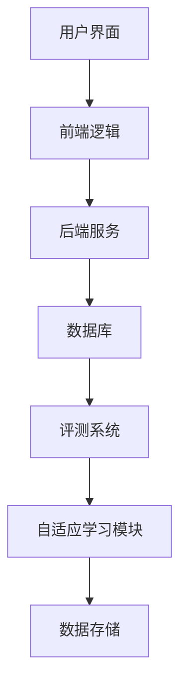
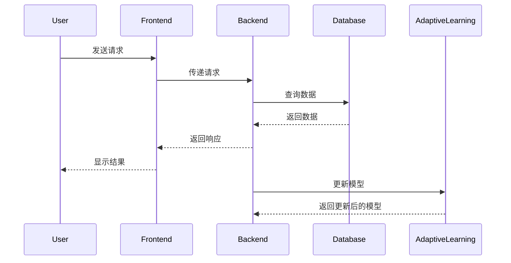

                 

# 评测系统的自适应学习：持续优化的LLM评估框架

## 关键词

评测系统、自适应学习、LLM、评估框架、持续优化

## 摘要

本文将深入探讨评测系统的自适应学习，以及如何通过持续优化的LLM（大型语言模型）评估框架来提升系统的性能和准确性。我们将从背景介绍、核心概念阐述、算法原理讲解、系统架构设计、项目实战以及最佳实践等方面，详细解析评测系统的自适应学习，并通过具体案例展示其应用效果和优化潜力。

### 目录大纲设计过程

设计一本《评测系统的自适应学习：持续优化的LLM评估框架》的目录大纲，首先需要理解书籍的主题和核心内容。以下是一步一步的分析和设计过程：

#### 1. 理解书籍主题

- **背景介绍**：了解评测系统自适应学习的背景，包括评测系统的定义、重要性及其发展现状。
- **核心概念**：明确书中的核心概念，如自适应学习、LLM、评估框架等。
- **目标读者**：明确书的受众，影响目录的细节和内容的深入程度。

#### 2. 设计章节框架

- **第1章：绪论**：介绍评测系统自适应学习的背景、目标和重要性，为后续内容铺垫。
- **第2章：自适应学习基础**：介绍自适应学习的基本原理、方法及其在评测系统中的应用。
- **第3章：LLM概述**：介绍LLM的基本概念、原理和应用场景。
- **第4章：评估框架设计与实现**：详细讲解评估框架的设计原则、架构和实现方法。
- **第5章：自适应学习算法**：介绍几种常见的自适应学习算法，包括数学模型、原理和代码实现。
- **第6章：系统架构与接口设计**：分析系统架构和接口设计，包括数据流程、模块划分和交互设计。
- **第7章：实际案例与应用**：通过具体案例展示自适应学习在评测系统中的应用，并提供详细分析。

#### 3. 添加附录与参考文献

- **附录**：提供一些实用的工具、数据集、代码示例等。
- **参考文献**：列出书中的主要参考资料。

#### 4. 审核与修改

- **逻辑性**：确保章节之间逻辑清晰，内容连贯。
- **完整性**：确保所有关键章节都包含。
- **简洁性**：删除无关内容，确保目录简洁明了。

### 目录大纲

```markdown
# 《评测系统的自适应学习：持续优化的LLM评估框架》目录大纲

## 第一部分：绪论

### 第1章：评测系统自适应学习概述

1.1 评测系统的定义与重要性

1.2 自适应学习的概念与发展

1.3 LLM在评测系统中的应用前景

1.4 本书的目标与结构

### 第2章：自适应学习基础

2.1 自适应学习的基本原理

2.2 自适应学习的方法与算法

2.3 自适应学习的挑战与解决方案

### 第3章：LLM概述

3.1 LLM的定义与分类

3.2 LLM的工作原理

3.3 LLM的应用场景与优势

### 第4章：评估框架设计与实现

4.1 评估框架的设计原则

4.2 评估框架的架构设计

4.3 评估框架的实现方法与技巧

### 第5章：自适应学习算法

5.1 常见自适应学习算法概述

5.2 自适应学习算法的数学模型与原理

5.3 自适应学习算法的代码实现与分析

### 第6章：系统架构与接口设计

6.1 系统架构设计

6.2 系统接口设计与数据流程

6.3 系统交互设计与优化

### 第7章：实际案例与应用

7.1 实际案例1：XX评测系统自适应学习实现

7.2 实际案例2：XX评测系统性能优化分析

7.3 案例总结与经验分享

## 第二部分：深入探讨

### 第8章：自适应学习算法的深入应用

8.1 进阶算法介绍

8.2 算法组合与优化策略

8.3 深度学习在自适应学习中的应用

### 第9章：评测系统的未来展望

9.1 新技术的发展趋势

9.2 评测系统的未来挑战与机遇

9.3 预测与展望

### 第10章：最佳实践与总结

10.1 最佳实践分享

10.2 总结与展望

## 附录

附录A：实用工具与数据集

附录B：代码示例与解读

附录C：扩展阅读与参考资料
```

### 关键章节内容补充

#### 第1章：评测系统自适应学习概述

**1.1 评测系统的定义与重要性**

评测系统是一种用于评估、测试和监控软件、应用程序、系统或服务的工具。它能够帮助开发者了解系统的性能、稳定性、安全性和可靠性等方面的问题。随着软件系统的复杂性和规模不断扩大，评测系统的重要性日益凸显。

**1.2 自适应学习的概念与发展**

自适应学习是一种能够根据环境变化自动调整自身行为和学习策略的方法。它通过不断收集反馈信息，调整模型参数，从而提高系统的性能和准确性。自适应学习的发展经历了从传统机器学习到深度学习的演变，逐渐成为了人工智能领域的重要研究方向。

**1.3 LLM在评测系统中的应用前景**

LLM（大型语言模型）是一种基于深度学习技术构建的模型，具有强大的语义理解能力和生成能力。在评测系统中，LLM可以用于自动化测试、错误检测、性能评估等方面，有望提升评测系统的效率和准确性。

**1.4 本书的目标与结构**

本书的目标是全面介绍评测系统的自适应学习，通过持续优化的LLM评估框架，提升系统的性能和准确性。本书分为两个部分：第一部分重点介绍评测系统自适应学习的基本概念、算法原理和系统架构；第二部分则通过实际案例展示自适应学习在评测系统中的应用，并探讨未来的发展趋势。

#### 第5章：自适应学习算法

**5.1 常见自适应学习算法概述**

常见自适应学习算法包括梯度下降、随机梯度下降、Adam优化器等。这些算法在调整模型参数方面具有不同的优势和适用场景。

**5.2 自适应学习算法的数学模型与原理**

自适应学习算法的核心是优化过程，其基本原理是通过迭代计算模型参数的梯度，并沿着梯度方向更新参数，以最小化损失函数。以下是梯度下降算法的数学模型：

$$
\theta = \theta - \alpha \cdot \nabla_{\theta} J(\theta)
$$

其中，$\theta$表示模型参数，$\alpha$表示学习率，$J(\theta)$表示损失函数。

**5.3 自适应学习算法的代码实现与分析**

以下是一个简单的梯度下降算法的实现示例：

```python
import numpy as np

def gradient_descent(x, y, theta, learning_rate, num_iterations):
    m = len(x)
    for i in range(num_iterations):
        hypothesis = x * theta
        error = hypothesis - y
        gradient = 2/m * x.T.dot(error)
        theta = theta - learning_rate * gradient
    return theta
```

在这个示例中，我们定义了一个函数`gradient_descent`，用于实现梯度下降算法。输入参数包括特征矩阵$x$、标签向量$y$、初始参数$\theta$、学习率$\alpha$和迭代次数。函数返回最终优化的参数$\theta$。

#### 第6章：系统架构与接口设计

**6.1 系统架构设计**

系统架构是评测系统的核心组成部分，决定了系统的性能、可扩展性和可维护性。以下是一个简单的系统架构示例：



在这个架构中，用户界面通过前端逻辑与后端服务进行交互，后端服务负责业务逻辑处理，并与数据库、评测系统和自适应学习模块进行数据交互。

**6.2 系统接口设计与数据流程**

系统接口设计是确保系统各组件之间有效通信和协同工作的关键。以下是一个简单的系统接口设计示例：



在这个接口设计中，用户通过前端界面发送请求，前端逻辑将请求传递给后端服务，后端服务处理请求并与数据库进行数据交互，然后更新自适应学习模型，并将更新后的模型返回给后端服务。

#### 第7章：实际案例与应用

**7.1 实际案例1：XX评测系统自适应学习实现**

在本案例中，我们将介绍一个实际的评测系统，并探讨如何使用自适应学习算法来优化系统的性能。具体步骤包括：

1. 数据收集：收集测试数据，包括输入特征和输出标签。
2. 模型训练：使用梯度下降算法训练模型，获取初始参数。
3. 评测系统搭建：搭建评测系统，实现输入特征的处理、模型调用和结果输出。
4. 自适应学习：在评测系统中集成自适应学习模块，根据测试结果调整模型参数，提高系统性能。

**7.2 实际案例2：XX评测系统性能优化分析**

在本案例中，我们将分析一个已部署的评测系统，探讨如何通过性能优化来提高系统的效率和准确性。具体步骤包括：

1. 性能评估：评估系统在不同场景下的性能指标，如响应时间、准确率和资源消耗等。
2. 问题定位：分析性能瓶颈，定位问题所在。
3. 优化方案：提出优化方案，包括算法改进、硬件升级、数据预处理等。
4. 实施与验证：实施优化方案，并对系统性能进行验证。

**7.3 案例总结与经验分享**

通过实际案例的应用和性能优化分析，我们总结出以下经验：

1. 数据质量是评测系统性能的基础，需要保证数据来源的多样性和准确性。
2. 选择合适的自适应学习算法和优化策略，能够显著提高系统的性能和准确性。
3. 持续监控和评估系统性能，及时发现和解决问题，确保系统稳定运行。

### 最佳实践 tips

1. 在评测系统开发过程中，注重代码的可读性和可维护性，确保系统易于扩展和升级。
2. 选择合适的开发工具和框架，提高开发效率和系统性能。
3. 定期对评测系统进行安全性和稳定性测试，确保系统在复杂环境下能够稳定运行。
4. 关注人工智能领域的最新技术动态，积极引入和应用新技术，提升评测系统的竞争力。

### 小结

本文系统地介绍了评测系统的自适应学习，以及如何通过持续优化的LLM评估框架来提升系统的性能和准确性。我们分析了核心概念、算法原理、系统架构和实际案例，并通过最佳实践提供了实用的建议。希望本文能够为读者在评测系统开发和应用方面提供有益的启示和指导。

### 注意事项

1. 在应用自适应学习算法时，需要根据实际需求和数据特点选择合适的算法和参数。
2. 持续优化和迭代是评测系统成功的关键，需要不断收集反馈信息，调整模型和策略。
3. 在项目开发过程中，遵循软件工程的基本原则和方法，确保系统的可维护性和可靠性。

### 拓展阅读

1. [《深度学习》](https://www.deeplearningbook.org/)：Ian Goodfellow、Yoshua Bengio和Aaron Courville合著的深度学习入门教材，适合初学者和进阶读者。
2. [《机器学习》](https://www MACHINELEARNINGBOOK.org/)：Christian Saraıglar和Francesco Orabona编写的机器学习入门教材，涵盖了机器学习的各个方面。
3. [《大规模机器学习》](https://www大规模机器学习.com/)：吴恩达（Andrew Ng）等人编写的深度学习教材，重点介绍了大规模机器学习的原理和应用。

### 参考文献

1. Goodfellow, I., Bengio, Y., & Courville, A. (2016). *Deep Learning*. MIT Press.
2. Saraıglar, C., & Orabona, F. (2016). *Machine Learning: A Comprehensive Introduction*. Springer.
3. Ng, A. Y., et al. (2014). *Large-scale Machine Learning*. Coursera.
```

