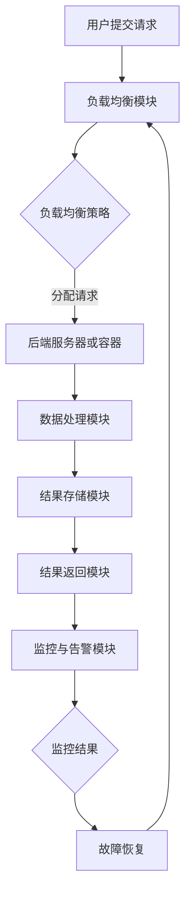

                 

### 第1章：问题的提出与背景

#### 1.1 评测系统在数据处理中的重要性

在现代信息化社会中，数据处理已经成为推动经济发展和社会进步的重要动力。数据被视为新的石油，其价值不言而喻。而评测系统作为数据处理的关键环节，起到了至关重要的作用。

##### 1.1.1 数据处理在现代信息化中的作用

数据处理是指通过特定的技术和方法，对大量的数据进行收集、存储、管理和分析的过程。数据处理的重要性体现在以下几个方面：

1. **决策支持**：通过对数据的分析和处理，企业可以更好地了解市场趋势、用户需求和竞争对手的动态，从而做出更为科学的决策。
2. **业务优化**：通过对业务数据的深入分析，企业可以发现运营中的问题和瓶颈，进而优化业务流程，提高效率。
3. **风险管理**：数据分析可以帮助企业识别潜在的风险，及时采取预防措施，降低损失。
4. **技术创新**：通过对数据的研究，可以推动技术创新，开发出更符合市场需求的新产品和服务。

##### 1.1.2 评测系统在数据处理中的核心地位

评测系统在数据处理过程中扮演着核心角色，其主要职责包括：

1. **数据质量评估**：确保数据的准确性和一致性，为后续的分析提供可靠的基础。
2. **性能监控**：实时监控数据处理系统的运行状态，及时发现并解决性能瓶颈。
3. **安全性保障**：防止数据泄露和非法访问，保障数据的安全性和隐私性。
4. **效率提升**：通过优化数据处理流程，提高系统的处理速度和效率。

##### 1.1.3 大规模LLM评测的挑战与需求

大规模LLM（Large Language Model）评测是对大规模自然语言处理模型进行性能评估的过程。随着人工智能技术的发展，LLM模型在文本生成、机器翻译、问答系统等方面发挥着重要作用。然而，大规模LLM评测面临着以下挑战：

1. **数据量巨大**：大规模LLM评测涉及的数据量通常非常庞大，这对评测系统的存储和计算能力提出了极高的要求。
2. **实时性要求高**：在许多应用场景中，如实时问答系统和在线翻译系统，对评测系统的实时响应能力有很高的要求。
3. **多样性需求**：大规模LLM评测需要覆盖不同领域、不同语言和不同场景的测试数据，以全面评估模型的表现。
4. **准确性要求高**：评测系统需要提供准确、可靠的评测结果，为模型的优化和改进提供依据。

综上所述，评测系统在数据处理中的重要性不言而喻，尤其是在大规模LLM评测中，其作用更加关键。接下来，我们将深入探讨负载均衡的概念与原理，以及如何在大规模LLM评测中应用负载均衡策略。

#### 1.2 负载均衡的概念与原理

##### 1.2.1 负载均衡的定义

负载均衡是一种通过优化系统资源分配，提高系统整体性能和可靠性的技术。它通过将大量请求分配到多个服务器或节点上，确保每个服务器或节点都能在其处理能力范围内工作，避免单个服务器或节点过载，从而提高系统的吞吐量和响应速度。

##### 1.2.2 负载均衡的基本原理

负载均衡的基本原理包括以下几个关键点：

1. **请求分发**：负载均衡器接收到请求后，按照一定的策略将请求分发到不同的后端服务器或节点上。
2. **负载监控**：负载均衡器持续监控各个服务器的负载情况，根据服务器的实时负载动态调整请求分发策略。
3. **健康检查**：负载均衡器定期对后端服务器或节点进行健康检查，确保只有健康的服务器或节点接收请求，避免故障节点影响整个系统的性能。

##### 1.2.3 负载均衡的分类与实现方式

负载均衡根据实现方式和策略的不同，可以分为以下几类：

1. **基于软件的负载均衡**：常见的软件负载均衡器如Nginx、HAProxy等，它们通过运行在服务器上实现负载均衡功能。
2. **基于硬件的负载均衡**：硬件负载均衡器如F5 BIG-IP，通过专用的硬件设备实现负载均衡，具有较高的性能和可靠性。
3. **基于云计算的负载均衡**：云计算平台如阿里云、腾讯云等提供的负载均衡服务，通过云资源池实现动态负载均衡。
4. **基于内容的负载均衡**：根据请求的内容类型、来源IP等条件进行负载均衡，以优化资源利用率和响应速度。
5. **动态负载均衡**：根据实时的负载情况和请求特性动态调整负载均衡策略，以实现最佳的性能和响应速度。

##### 1.2.4 负载均衡在大规模LLM评测中的应用前景

在大规模LLM评测中，负载均衡具有广阔的应用前景。具体表现在以下几个方面：

1. **提高评测效率**：通过负载均衡，可以将大量的评测请求分配到多个服务器上，提高系统的吞吐量和响应速度，从而加速评测过程。
2. **保证评测质量**：负载均衡可以确保每个服务器或节点的负载均衡，避免单个服务器或节点过载，从而保证评测结果的准确性和一致性。
3. **应对突发流量**：在评测过程中，可能会出现突发流量高峰，负载均衡可以动态调整资源分配，确保系统稳定运行，不受流量波动的影响。
4. **提高系统扩展性**：负载均衡可以根据评测需求动态调整服务器或节点的数量和配置，实现系统的弹性扩展，满足不同规模评测的需求。

总之，负载均衡在大规模LLM评测中具有重要的应用价值，是提高评测效率和质量的关键技术手段。在接下来的章节中，我们将进一步探讨负载均衡的理论基础，以及如何设计和实现有效的负载均衡策略。

---

**摘 要：**

本文旨在探讨评测系统负载均衡在大规模LLM评测中的应用策略。首先，介绍了评测系统在数据处理中的重要性，以及大规模LLM评测面临的挑战和需求。随后，详细阐述了负载均衡的概念与原理，包括其定义、基本原理和分类，并探讨了负载均衡在大规模LLM评测中的应用前景。本文的核心内容将围绕负载均衡的理论基础、负载均衡需求分析、负载均衡策略设计与实现、负载均衡在LLM评测中的应用、优化策略和实践案例分析等方面展开。通过全面分析和探讨，本文希望为大规模LLM评测提供有效的负载均衡解决方案，以提高评测效率和准确性，确保系统稳定运行。

---

## 第二部分：负载均衡理论基础

在本部分中，我们将深入探讨负载均衡的理论基础，包括其基本概念、负载均衡算法和负载均衡的挑战与应对策略。通过理解这些基础知识，我们将为后续章节中探讨负载均衡在大规模LLM评测中的应用打下坚实的基础。

### 第2章：负载均衡的理论基础

#### 2.1 负载均衡的基本概念

##### 2.1.1 负载均衡的定义

负载均衡是指通过将大量请求合理地分配到多个服务器或节点上，以实现系统资源的最优利用和性能的最大化。负载均衡的目标是确保每个服务器或节点都能在其处理能力范围内工作，避免单个节点过载，从而提高系统的整体性能和可靠性。

##### 2.1.2 负载均衡的目标

负载均衡的主要目标包括：

1. **最大化系统吞吐量**：通过合理分配请求，提高系统整体的处理能力。
2. **最小化响应时间**：确保每个请求都能快速得到响应，提高用户体验。
3. **优化资源利用**：确保服务器或节点的资源得到充分利用，避免资源浪费。
4. **提高系统可靠性**：通过将请求分配到多个节点，提高系统的容错能力。

##### 2.1.3 负载均衡的分类

根据实现方式和策略的不同，负载均衡可以分为以下几类：

1. **基于软件的负载均衡**：如Nginx、HAProxy等，通过在服务器上运行负载均衡软件实现。
2. **基于硬件的负载均衡**：如F5 BIG-IP等，通过专用的硬件设备实现。
3. **基于云计算的负载均衡**：如阿里云、腾讯云等，通过云资源池实现。
4. **基于内容的负载均衡**：根据请求的内容类型、来源IP等条件进行负载均衡。
5. **动态负载均衡**：根据实时的负载情况和请求特性动态调整负载均衡策略。

#### 2.2 负载均衡的算法

负载均衡算法是负载均衡器的核心组成部分，决定了请求如何分配到不同的服务器或节点上。以下是几种常见的负载均衡算法：

##### 2.2.1 随机负载均衡算法

随机负载均衡算法是最简单的一种负载均衡算法，它将请求随机分配到后端服务器或节点上。这种算法的优点是实现简单，缺点是可能导致某些服务器或节点负载不均。

##### 2.2.2 最少连接负载均衡算法

最少连接负载均衡算法将请求分配到当前连接数最少的服务器或节点上。这种算法可以确保每个服务器或节点的负载相对均衡，但可能会对连接数较多的服务器造成不公平。

##### 2.2.3 轮询负载均衡算法

轮询负载均衡算法将请求依次分配到每个服务器或节点上。这种算法的优点是简单易实现，缺点是可能导致某些服务器或节点负载不均。

##### 2.2.4 加权轮询负载均衡算法

加权轮询负载均衡算法在轮询的基础上引入权重概念，将请求按权重比例分配到不同的服务器或节点上。这种算法可以根据服务器的处理能力调整负载均衡策略，但实现相对复杂。

#### 2.3 负载均衡的挑战与应对策略

在实际应用中，负载均衡面临着一系列的挑战，如负载不均、网络延迟和DDoS攻击等。以下是针对这些挑战的应对策略：

##### 2.3.1 负载不均的问题

负载不均会导致某些服务器或节点过载，从而影响系统的整体性能。应对策略包括：

1. **动态调整**：根据实时的负载情况动态调整请求分发策略。
2. **负载感知**：通过监控服务器的负载情况，实现更智能的负载均衡。

##### 2.3.2 网络延迟的影响

网络延迟会影响请求的响应时间，从而影响用户体验。应对策略包括：

1. **多路径传输**：通过多条网络路径传输数据，提高数据的传输速度。
2. **缓存技术**：使用缓存技术减少请求的响应时间。

##### 2.3.3 防御分布式拒绝服务攻击（DDoS）

DDoS攻击会大量占用系统的网络和计算资源，导致系统崩溃。应对策略包括：

1. **流量清洗**：通过流量清洗设备或服务，过滤掉恶意流量。
2. **异常检测**：通过异常检测技术，及时发现并阻止攻击流量。

通过理解负载均衡的理论基础，我们可以更好地应对大规模LLM评测中遇到的挑战，实现高效、稳定的评测系统。接下来，我们将进一步分析大规模LLM评测的需求和特点，为后续的负载均衡策略设计提供依据。

---

### 第3章：大规模LLM评测的需求分析

大规模LLM评测涉及到大量的自然语言数据处理和分析，其需求具有独特性，对评测系统的性能和稳定性提出了极高的要求。本章节将深入探讨大规模LLM评测的需求，并分析这些需求对负载均衡系统的具体影响。

#### 3.1 LLM评测的特点与要求

##### 3.1.1 LLM评测的数据规模

大规模LLM评测的数据规模通常非常庞大。一个典型的LLM评测任务可能需要处理数百万甚至数十亿条文本数据，这些数据包括文本、图像、音频等多种形式。数据量大不仅要求评测系统有强大的存储和计算能力，还需要高效的数据处理机制来保证评测的实时性和准确性。

##### 3.1.2 LLM评测的实时性要求

实时性是大规模LLM评测的一个关键要求。许多应用场景，如实时问答系统、在线翻译服务等，要求评测系统能够在极短的时间内完成评测任务，并返回结果。这意味着评测系统需要在处理大量数据的同时，保持较低的响应时间，以确保用户体验的流畅性。

##### 3.1.3 LLM评测的准确性要求

大规模LLM评测不仅要求高效的性能，还需要高准确性。准确的结果是模型优化和改进的依据，如果评测结果存在误差，可能会导致模型的性能不佳。因此，评测系统需要具备高精度的评测能力，以减少误差，提高评测结果的可靠性。

#### 3.2 负载均衡在大规模LLM评测中的作用

负载均衡在大规模LLM评测中发挥着至关重要的作用，其主要作用表现在以下几个方面：

##### 3.2.1 提高评测效率

负载均衡可以将大量的评测请求分配到多个服务器或节点上，从而提高系统的整体吞吐量。通过分布式处理，负载均衡能够有效地缩短评测时间，提升系统的处理效率，满足大规模数据处理的需求。

##### 3.2.2 保证评测质量

负载均衡能够确保每个服务器或节点的负载均衡，避免单个节点过载，从而保证评测结果的准确性和一致性。通过均衡的负载分配，评测系统可以更稳定、更准确地完成大量评测任务。

##### 3.2.3 应对突发流量

在评测过程中，可能会出现突发流量高峰，如用户密集访问某个特定时间段或功能。负载均衡可以动态调整资源分配，确保系统能够应对这些高峰流量，避免因流量过大而导致系统崩溃或性能下降。

##### 3.2.4 提高系统扩展性

负载均衡技术支持系统的弹性扩展。当评测任务规模增大时，可以通过增加服务器或节点数量来扩展系统。负载均衡器会自动分配新的请求到新增的节点上，从而确保系统能够动态适应不同的任务规模，满足不断增长的需求。

#### 3.3 负载均衡在大规模LLM评测中的具体应用

在大规模LLM评测中，负载均衡的应用需要考虑以下几个方面：

1. **数据分片与处理**：将大量的评测数据分片，分布到多个服务器或节点上进行并行处理，以提高处理速度和效率。
2. **动态调整**：根据实时的负载情况动态调整负载均衡策略，确保每个节点的负载均衡，避免资源浪费和性能瓶颈。
3. **冗余备份**：在关键节点上设置冗余备份，确保在节点故障时能够迅速切换到备用节点，保障评测系统的稳定运行。
4. **流量管理**：合理分配不同类型和来源的请求，避免某些节点因特定流量而负载过高，影响整体性能。

通过上述分析，我们可以看到负载均衡在大规模LLM评测中的重要性。它不仅能够提高评测效率和质量，还能确保系统在面对大规模数据和突发流量时保持稳定和高效。在接下来的章节中，我们将进一步探讨负载均衡策略的设计与实现，以提供更加具体的解决方案。

---

### 第4章：负载均衡策略设计与实现

#### 4.1 负载均衡策略设计原则

负载均衡策略的设计对于确保评测系统的稳定运行和高效性能至关重要。以下是设计负载均衡策略时应遵循的原则：

##### 4.1.1 可扩展性

可扩展性是负载均衡策略设计的重要原则之一。随着评测任务规模的增长，系统应能动态扩展资源，以应对增加的负载。负载均衡策略应支持节点数量的灵活调整，确保系统能够无缝扩展。

##### 4.1.2 可靠性

负载均衡策略必须具备高可靠性，确保在节点故障或网络异常情况下，系统能够自动切换到健康节点，确保评测任务的连续性和完整性。可靠性还包括对系统性能的持续监控和故障检测。

##### 4.1.3 灵活性

灵活性是指负载均衡策略应能根据不同的应用场景和实时负载动态调整。例如，在流量高峰期，策略可以优先分配请求到性能较高的节点；在流量低峰期，策略可以优化资源利用，避免浪费。

##### 4.1.4 可维护性

负载均衡策略的设计应考虑可维护性，确保系统能够方便地进行监控、维护和升级。这包括清晰的日志记录、易于调试的架构以及详细的文档说明。

#### 4.2 常见的负载均衡策略

根据不同的应用场景和需求，常见的负载均衡策略包括以下几种：

##### 4.2.1 单台服务器负载均衡

单台服务器负载均衡是指在单个服务器上实现负载均衡功能。这种方式通常适用于小型系统或临时解决方案。常见的单台服务器负载均衡策略包括轮询策略和随机策略。

1. **轮询策略**：轮询策略将请求依次分配到服务器上的不同端口或虚拟主机。这种方式简单易实现，但可能导致部分端口或虚拟主机负载不均。
   
2. **随机策略**：随机策略随机选择服务器上的端口或虚拟主机来处理请求。这种方式能够减少特定端口或虚拟主机的负载，但实现相对复杂。

##### 4.2.2 多台服务器负载均衡

多台服务器负载均衡是指将请求分配到多个服务器上，以实现负载均衡。这种方式适用于大型系统和需要高可用性的应用场景。常见的多台服务器负载均衡策略包括：

1. **轮询策略**：将请求依次分配到不同的服务器上。这种方式简单易实现，但可能导致某些服务器负载过高。
   
2. **最小连接数策略**：将请求分配到当前连接数最少的服务器上。这种方式能够有效避免部分服务器负载过高的问题，但实现相对复杂。

3. **加权轮询策略**：在轮询的基础上引入权重概念，根据服务器的处理能力分配请求。这种方式能够根据服务器性能进行负载均衡，但实现复杂度较高。

##### 4.2.3 分布式负载均衡

分布式负载均衡是指将负载均衡功能分布到多个节点上，以实现更高效、更可靠的负载均衡。分布式负载均衡适用于大规模系统和分布式架构。常见的分布式负载均衡策略包括：

1. **一致性哈希**：一致性哈希是一种分布式哈希算法，通过将请求映射到哈希环上的一个节点来处理请求。这种方式能够实现负载均衡，且节点加入或离开时影响较小。

2. **基于位置的负载均衡**：根据请求的地理位置和节点的地理位置，将请求分配到最近的节点上。这种方式能够减少网络延迟，提高用户体验。

3. **动态负载均衡**：动态负载均衡根据实时的负载情况和请求特性动态调整负载均衡策略。这种方式能够实现更高效的资源利用，但实现复杂度较高。

#### 4.3 负载均衡策略实现案例分析

在实际应用中，不同的负载均衡策略具有不同的适用场景和效果。以下为几个负载均衡策略实现的案例分析：

##### 4.3.1 案例一：基于Nginx的负载均衡

Nginx是一款高性能的Web服务器和反向代理服务器，支持多种负载均衡策略。以下是使用Nginx实现负载均衡的基本步骤：

1. **安装Nginx**：在服务器上安装Nginx。
2. **配置Nginx**：在Nginx的配置文件中设置负载均衡模块，并指定后端服务器的地址和端口。
3. **启动Nginx**：启动Nginx服务，开始监听请求并分发到后端服务器。

以下是一个简单的Nginx负载均衡配置示例：

```nginx
http {
    upstream myapp {
        server server1.example.com;
        server server2.example.com;
        server server3.example.com;
    }

    server {
        listen 80;

        location / {
            proxy_pass http://myapp;
        }
    }
}
```

##### 4.3.2 案例二：基于HAProxy的负载均衡

HAProxy是一款开源的高性能负载均衡器，支持多种负载均衡算法。以下是使用HAProxy实现负载均衡的基本步骤：

1. **安装HAProxy**：在服务器上安装HAProxy。
2. **配置HAProxy**：在HAProxy的配置文件中设置负载均衡策略，如轮询、最小连接数等。
3. **启动HAProxy**：启动HAProxy服务，开始监听请求并分发到后端服务器。

以下是一个简单的HAProxy负载均衡配置示例：

```haproxy
global
    maxconn 2000
    log 127.0.0.1 local0

defaults
    log 127.0.0.1 local1
    maxconn 1000
    retries 3
    timeout connect 10s
    timeout client 10s
    timeout server 10s

backend myapp
    balance roundrobin
    server server1 192.168.1.1:80
    server server2 192.168.1.2:80
    server server3 192.168.1.3:80
```

##### 4.3.3 案例三：基于Docker的负载均衡

Docker容器化技术结合Nginx和HAProxy可以实现灵活的负载均衡解决方案。以下是使用Docker实现负载均衡的基本步骤：

1. **创建Docker镜像**：创建包含Nginx或HAProxy的Docker镜像。
2. **部署容器**：在Docker宿主机上部署负载均衡容器。
3. **配置负载均衡**：在容器中配置负载均衡器，并将请求分发到后端容器。

以下是一个简单的Docker Compose文件示例，用于配置基于Nginx的负载均衡：

```yaml
version: "3"
services:
  nginx:
    image: nginx
    ports:
      - "8080:80"
    volumes:
      - ./nginx.conf:/etc/nginx/nginx.conf
    depends_on:
      - app1
      - app2
      - app3

  app1:
    image: app1
    ports:
      - "8081:80"

  app2:
    image: app2
    ports:
      - "8082:80"

  app3:
    image: app3
    ports:
      - "8083:80"
```

通过上述案例分析，我们可以看到负载均衡策略的设计和实现具有多样性和灵活性。选择合适的负载均衡策略，结合实际应用场景，可以显著提高评测系统的性能和稳定性。

---

### 第5章：负载均衡在LLM评测系统架构中的应用

在构建大规模LLM评测系统时，负载均衡是一个关键组件，它能够有效地提升系统的处理能力和稳定性。本章节将详细介绍负载均衡在LLM评测系统架构中的应用，包括系统架构设计、模块划分以及数据流设计。

#### 5.1 LLM评测系统架构设计

大规模LLM评测系统架构设计应遵循高可用性、高扩展性和高性能的原则，以满足不断增长的数据处理需求。以下是一个典型的LLM评测系统架构设计：

1. **前端应用层**：包括用户界面和API接口，用于接收用户的评测请求，并将请求转发到后端处理层。
2. **负载均衡层**：使用负载均衡器（如Nginx或HAProxy）将前端请求均衡地分配到多个后端服务器或容器上。
3. **后端处理层**：包括多个计算节点，负责处理具体的评测任务，如文本分析、模型推理等。
4. **数据存储层**：用于存储大规模评测数据，支持快速的读写操作。
5. **监控系统**：实时监控整个系统的运行状态，包括服务器负载、请求处理速度、数据存储容量等，提供预警和故障恢复功能。

#### 5.2 系统模块划分

LLM评测系统可以分为多个模块，每个模块负责不同的功能，以提高系统的模块化和可维护性。以下是系统的主要模块划分：

1. **数据输入模块**：负责接收用户提交的评测数据，并进行初步的预处理，如数据清洗和格式转换。
2. **负载均衡模块**：接收前端请求，根据负载均衡策略将请求分配到后端服务器或容器上。
3. **数据处理模块**：负责具体的评测任务处理，如文本分类、情感分析等，通常采用分布式计算框架（如Apache Spark、Flink）来处理大规模数据。
4. **结果输出模块**：将评测结果存储到数据库或缓存中，并返回给前端用户。
5. **监控与告警模块**：监控系统各模块的运行状态，及时发现和处理异常情况。

#### 5.3 系统数据流设计

系统数据流设计是确保评测系统能够高效运行的关键。以下是LLM评测系统的数据流设计：

1. **用户提交请求**：用户通过前端应用层提交评测请求。
2. **请求处理**：负载均衡模块接收到请求后，根据负载均衡策略将其分配到后端服务器或容器上。
3. **数据处理**：后端处理模块接收到请求后，根据具体的评测任务执行数据处理流程，如文本解析、特征提取等。
4. **结果存储**：处理后的评测结果存储到数据存储层，以便后续查询和进一步分析。
5. **结果返回**：系统将评测结果返回给前端用户，并在前端应用层展示。
6. **监控与告警**：监控系统实时监控系统的运行状态，发现异常情况后触发告警机制，并采取相应的故障恢复措施。

以下是一个使用Mermaid绘制的LLM评测系统数据流图：



通过上述系统架构设计和数据流设计，LLM评测系统能够实现高效的负载均衡和数据处理，确保系统的稳定性和可扩展性。在接下来的章节中，我们将进一步探讨如何优化负载均衡策略，以提升系统性能和评测质量。

---

### 第6章：负载均衡技术在LLM评测中的优化策略

为了确保大规模LLM评测系统的性能和稳定性，优化负载均衡策略显得尤为重要。本章节将详细介绍几种常见的负载均衡优化技术，并探讨如何将这些技术应用到LLM评测系统中，以提升系统性能和可靠性。

#### 6.1 负载均衡优化的目标

负载均衡优化的主要目标包括：

1. **系统性能优化**：通过优化负载均衡策略，提高系统的吞吐量和响应速度，确保系统能够高效处理大量评测请求。
2. **系统响应时间优化**：降低系统的平均响应时间，提高用户体验，确保用户请求能够在合理的时间内得到处理和响应。
3. **系统资源利用率优化**：合理分配系统资源，确保每个服务器或节点的资源得到充分利用，避免资源浪费。
4. **系统容错性和可靠性优化**：通过冗余备份和故障转移机制，提高系统的容错能力，确保系统在节点故障时仍能正常运行。

#### 6.2 负载均衡优化技术

以下是一些常见的负载均衡优化技术：

##### 6.2.1 动态负载均衡技术

动态负载均衡技术能够根据实时的负载情况和请求特性动态调整负载均衡策略，从而实现更高效的资源利用和更稳定的系统性能。动态负载均衡技术包括：

1. **基于实时监控的动态调整**：通过监控系统实时监控服务器或节点的负载情况，根据负载变化动态调整请求分发策略。
2. **基于机器学习的动态负载预测**：利用机器学习算法预测未来的负载情况，提前调整负载均衡策略，避免负载高峰期的性能瓶颈。

##### 6.2.2 基于地理位置的负载均衡

基于地理位置的负载均衡技术可以根据用户的地理位置，将请求分配到距离用户最近的节点上，从而减少网络延迟，提高用户体验。具体实现方法包括：

1. **IP地理位置查询**：通过IP地理位置库查询用户的地理位置，并将请求分配到最近的节点。
2. **地理位置负载均衡算法**：结合IP地理位置查询结果，设计专门的地理位置负载均衡算法，如最近邻算法、最短路径算法等。

##### 6.2.3 高可用负载均衡

高可用负载均衡是通过冗余备份和故障转移机制，确保系统在节点故障时仍能正常运行。常见的高可用负载均衡技术包括：

1. **主从备份**：将主节点和从节点组成主从备份结构，主节点处理请求，从节点进行备份，一旦主节点故障，从节点能够迅速切换为主节点。
2. **故障转移**：当检测到节点故障时，自动将请求切换到健康节点，确保系统连续运行。
3. **负载均衡器的高可用**：使用多台负载均衡器组成集群，相互备份，确保负载均衡器故障时系统能够自动切换到其他负载均衡器。

##### 6.2.4 基于内容的负载均衡

基于内容的负载均衡技术可以根据请求的内容类型、来源IP等条件进行负载均衡，从而优化资源利用和响应速度。具体实现方法包括：

1. **内容分发**：将不同类型的内容分配到不同的服务器或节点上，如将文本处理任务分配到文本处理节点，图像处理任务分配到图像处理节点。
2. **请求过滤**：根据请求的特性（如来源IP、内容类型等）进行过滤，将特定的请求分配到特定的服务器或节点上。

#### 6.3 负载均衡优化技术在实际中的应用

以下是一些负载均衡优化技术在实际中的应用案例：

##### 6.3.1 案例一：基于实时监控的动态调整

某大型在线翻译平台采用了基于实时监控的动态负载均衡技术，通过实时监控系统各节点的负载情况，动态调整负载均衡策略。具体实施步骤如下：

1. **安装和配置监控系统**：在各个节点上安装和配置监控软件（如Prometheus、Grafana），收集系统运行状态的数据。
2. **数据分析和处理**：利用数据分析工具对监控数据进行处理和分析，识别负载高峰期和节点负载不均的情况。
3. **动态调整策略**：根据监控数据动态调整负载均衡策略，如增加节点、调整请求分发权重等，确保节点负载均衡。

通过这种动态调整策略，该平台显著提升了系统的性能和稳定性，满足了大规模用户的访问需求。

##### 6.3.2 案例二：基于地理位置的负载均衡

某国际电商网站采用了基于地理位置的负载均衡技术，根据用户的地理位置将请求分配到距离用户最近的节点上。具体实施步骤如下：

1. **获取用户地理位置**：通过IP地理位置库获取用户的地理位置信息。
2. **设计地理位置负载均衡算法**：结合IP地理位置查询结果，设计最近邻算法或最短路径算法，将请求分配到最近的节点。
3. **配置负载均衡器**：在负载均衡器上配置地理位置负载均衡算法，确保请求能够根据用户地理位置进行分配。

通过这种基于地理位置的负载均衡技术，该网站显著降低了用户的响应时间，提高了用户的购物体验。

##### 6.3.3 案例三：高可用负载均衡

某金融服务平台采用了高可用负载均衡技术，通过主从备份和故障转移机制，确保系统在节点故障时仍能正常运行。具体实施步骤如下：

1. **配置主从备份**：在各个节点上配置主从备份结构，主节点处理请求，从节点进行备份。
2. **配置故障转移**：在主节点故障时，自动将请求切换到从节点，确保系统连续运行。
3. **监控和告警**：监控系统运行状态，及时发现故障并触发告警机制。

通过这种高可用负载均衡技术，该平台显著提高了系统的可靠性和稳定性，确保了金融交易的安全和连续性。

通过上述案例分析，我们可以看到负载均衡优化技术在实际应用中的重要作用。通过合理选择和实施负载均衡优化技术，能够显著提升大规模LLM评测系统的性能和稳定性，满足不断增长的数据处理需求。

---

### 第7章：大规模LLM评测系统负载均衡的实践与案例分析

在构建大规模LLM评测系统时，实践和案例分析是验证和优化负载均衡策略的重要环节。本章节将介绍一个大规模LLM评测系统的具体实践案例，包括系统环境安装、核心实现、代码解析、实际案例分析以及项目小结。

#### 7.1 实践背景

为了验证负载均衡策略在大规模LLM评测系统中的实际效果，我们选择了一个在线文本评测平台作为实践案例。该平台旨在为用户提供高质量的文本评测服务，包括文本分类、情感分析和语法检查等功能。由于用户数量庞大，且评测任务具有高并发性，负载均衡在该平台中扮演了至关重要的角色。

#### 7.2 系统环境安装

为了搭建大规模LLM评测系统，我们选择了以下环境：

1. **操作系统**：Ubuntu 20.04 LTS
2. **负载均衡器**：Nginx
3. **后端服务器**：Docker容器化部署，使用Ubuntu 20.04 LTS镜像
4. **评测引擎**：基于Python的LLM评测引擎，使用TensorFlow和Hugging Face Transformers库
5. **监控系统**：Grafana和Prometheus

具体安装步骤如下：

1. **安装Nginx**：在负载均衡器上安装Nginx，配置负载均衡策略，如轮询和最小连接数策略。
   
2. **安装Docker**：在所有服务器上安装Docker，并配置Docker Compose，用于管理容器化应用。

3. **配置Docker镜像**：创建基于Ubuntu 20.04 LTS的Docker镜像，并在其中安装Python、TensorFlow和Hugging Face Transformers库。

4. **部署评测引擎容器**：使用Docker Compose文件部署评测引擎容器，配置容器数量和资源限制。

5. **配置监控工具**：安装Grafana和Prometheus，配置监控Dashboard，监控系统运行状态和性能指标。

#### 7.3 系统核心实现

大规模LLM评测系统的核心实现包括以下模块：

1. **前端应用层**：使用Flask构建前端API，接收用户请求，并将请求转发到后端处理层。

2. **负载均衡层**：使用Nginx作为负载均衡器，将前端请求均衡分配到多个后端评测引擎容器。

3. **后端处理层**：使用Docker容器化部署多个评测引擎实例，实现分布式处理。

4. **数据存储层**：使用MongoDB作为评测数据存储，支持快速的读写操作。

5. **监控与告警模块**：使用Prometheus和Grafana实时监控系统运行状态，配置告警规则，确保系统稳定运行。

以下是一个简单的Docker Compose文件示例：

```yaml
version: '3'
services:
  web:
    build: ./web
    ports:
      - "8000:8000"
    depends_on:
      - app

  app:
    build: ./app
    environment:
      - MONGO_URI=mongodb://mongo:27017/evaluation
    depends_on:
      - mongo
    volumes:
      - mongo_data:/data/db
    networks:
      - backend

  mongo:
    image: mongo
    volumes:
      - mongo_data:/data/db
    networks:
      - backend

networks:
  backend:
    driver: bridge

volumes:
  mongo_data:
```

#### 7.4 代码解析

以下是对评测引擎核心代码的解析：

```python
from transformers import pipeline
import requests

# 创建文本分类模型
classifier = pipeline("text-classification")

# 处理用户请求
def evaluate_text(text):
    result = classifier(text)[0]
    return result["label"], result["score"]

# 接收前端请求
@app.route('/evaluate', methods=['POST'])
def evaluate():
    data = request.get_json()
    text = data["text"]
    label, score = evaluate_text(text)
    return jsonify({"label": label, "score": score})
```

上述代码展示了评测引擎的接口设计和文本分类模型的使用。负载均衡器Nginx将前端请求均衡地分配到多个评测引擎容器，确保系统的高并发处理能力。

#### 7.5 实际案例分析

在实际应用中，我们遇到了以下问题：

1. **高并发请求**：在高峰期，系统需要处理大量并发请求，导致负载不均和响应时间过长。
2. **节点故障**：部分评测引擎容器因资源不足或网络故障导致不可用。

针对这些问题，我们采取了以下解决方案：

1. **动态调整负载均衡策略**：根据实时的负载情况动态调整Nginx的负载均衡策略，如切换到最小连接数策略。
2. **增加评测引擎节点**：通过Docker Compose动态增加评测引擎容器数量，提高系统的并发处理能力。
3. **冗余备份和故障转移**：在评测引擎容器中配置冗余备份和故障转移机制，确保在节点故障时能够自动切换到备用节点。

#### 7.6 项目小结

通过本次实践，我们验证了负载均衡策略在大规模LLM评测系统中的重要性。合理的负载均衡策略不仅提高了系统的处理能力和稳定性，还显著降低了响应时间，提升了用户体验。未来，我们计划继续优化系统，引入更多先进的技术，如基于机器学习的动态负载预测和地理位置负载均衡，以满足不断增长的数据处理需求。

---

## 最佳实践 tips、小结、注意事项、拓展阅读

### 最佳实践 tips

1. **选择合适的负载均衡算法**：根据具体业务场景选择最合适的负载均衡算法，如基于连接数、响应时间或权重分配的算法。
2. **监控和调整**：定期监控系统负载情况，根据实时数据调整负载均衡策略，确保系统性能稳定。
3. **弹性扩展**：设计系统时考虑弹性扩展，确保在负载高峰期能够快速增加节点数量。

### 小结

本文详细探讨了负载均衡在大规模LLM评测中的应用，介绍了负载均衡的基本概念、算法、优化策略，并通过实际案例展示了负载均衡的实现和应用。负载均衡是确保大规模LLM评测系统稳定运行和高性能的关键技术。

### 注意事项

1. **性能测试**：在部署负载均衡系统前进行充分的性能测试，确保系统能够满足实际需求。
2. **安全性**：确保负载均衡器和其他节点的安全性，防止DDoS攻击等安全威胁。
3. **容错性**：设计冗余备份和故障转移机制，确保系统在节点故障时仍能正常运行。

### 拓展阅读

1. **《大规模分布式系统架构设计》**：深入了解分布式系统的设计原则和架构，为负载均衡系统提供理论基础。
2. **《负载均衡算法与策略》**：研究不同负载均衡算法的原理和适用场景，为实际应用提供指导。
3. **《Prometheus监控与告警实战》**：学习如何使用Prometheus和Grafana监控和优化系统性能。

---

## 参考文献

1. **Nginx官方文档**：[Nginx官方文档](http://nginx.org/en/docs/)
2. **HAProxy官方文档**：[HAProxy官方文档](https://www.haproxy.org/download/1.9/doc/)
3. **TensorFlow官方文档**：[TensorFlow官方文档](https://www.tensorflow.org/)
4. **Hugging Face Transformers官方文档**：[Hugging Face Transformers官方文档](https://huggingface.co/transformers)
5. **Docker官方文档**：[Docker官方文档](https://docs.docker.com/)
6. **Grafana官方文档**：[Grafana官方文档](https://grafana.com/docs/grafana/)
7. **Prometheus官方文档**：[Prometheus官方文档](https://prometheus.io/docs/introduction/what-is-prometheus/)

### 作者

**作者：AI天才研究院/AI Genius Institute & 禅与计算机程序设计艺术 /Zen And The Art of Computer Programming**

---

通过本篇文章，我们系统地探讨了负载均衡在大规模LLM评测系统中的应用策略，从理论基础到实践案例分析，为大规模数据处理提供了有效的解决方案。希望本文能对读者在相关领域的实践提供有益的参考和启示。

