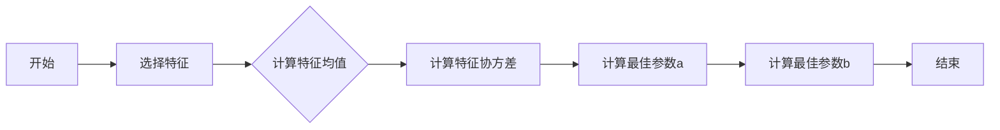
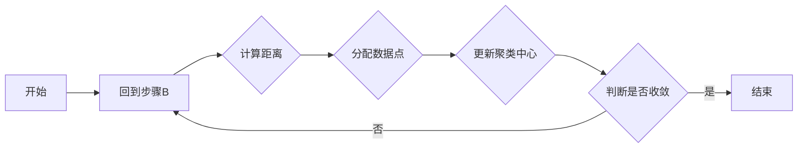

                 

### 引言

在当今信息化、数字化飞速发展的时代，评测系统已成为众多领域不可或缺的工具。无论是教育评估、产品质量检测，还是系统性能评估，评测系统都扮演着至关重要的角色。然而，评测系统的质量直接影响着评估结果的可靠性，进而影响决策的有效性。因此，对评测系统进行质量保证，确保评估结果的可靠性，已成为众多企业和研究机构关注的焦点。

本文旨在深入探讨评测系统的质量保证，通过逻辑清晰、结构紧凑、简单易懂的阐述，帮助读者全面了解评测系统的质量保证方法、策略和最佳实践。文章将从以下几个方面进行探讨：

首先，我们将回顾评测系统的背景，阐述评测系统在各个领域的应用及其重要性。接着，我们将详细定义质量保证和评测系统，并探讨评估结果可靠性的关键要素。

随后，我们将分析评测系统的核心概念原理，解释质量保证原则和可靠性评估指标，并阐述它们之间的关系。此外，我们还将对不同的评测系统特征进行对比，并绘制评测系统的实体关系图。

在第二部分，我们将详细讨论评测系统的质量保证策略，包括系统设计与架构、算法原理与模型、数据收集与预处理、评估方法与工具以及实际案例分析。

最后，我们将聚焦于确保评估结果的可靠性，详细介绍异常检测与纠正方法、持续改进与维护策略，并提供最佳实践和注意事项。通过这些内容，读者将能够获得关于评测系统质量保证的全面理解和实际应用指导。

### 第一部分：引言

#### 问题背景与挑战

评测系统在当今社会中无处不在，无论是教育、医疗、工业制造，还是互联网和软件工程领域，评测系统都扮演着至关重要的角色。在教育领域，评测系统用于评估学生的学习效果，为教师提供教学反馈；在医疗领域，评测系统用于诊断患者的健康状况，辅助医生做出正确的治疗决策；在工业制造中，评测系统用于监控生产线，确保产品质量；在互联网和软件工程领域，评测系统用于评估系统性能、用户体验等。

然而，随着评测系统的广泛应用，质量问题也日益凸显。评估结果的可靠性直接关系到决策的正确性，甚至关系到企业的生存和发展。不准确的评估结果可能导致错误的决策，从而造成巨大的经济损失和资源浪费。例如，在医疗领域，错误的评测结果可能导致患者接受错误的治疗，严重时甚至危及生命；在工业制造领域，错误的评测结果可能导致生产线停工，影响生产进度和产品质量。

当前，评测系统面临的主要挑战包括：数据质量问题、算法可靠性问题、系统稳定性问题以及评估结果解释问题。数据质量问题是评测系统的核心挑战之一，不准确、不完整或错误的数据会直接影响评估结果的可靠性。算法可靠性问题则涉及到评测系统的算法模型，如果算法模型存在缺陷或不足，将导致评估结果偏差。系统稳定性问题主要表现为评测系统在运行过程中出现故障或崩溃，影响评估工作的正常进行。评估结果解释问题则是评估结果如何被理解和应用的问题，如果评估结果解释不当，可能导致误解和误用。

面对这些挑战，如何确保评测系统的质量，进而确保评估结果的可靠性，成为众多企业和研究机构亟待解决的问题。本文将深入探讨评测系统的质量保证，通过详细分析评测系统的质量保证策略，提供可行的解决方案，为读者提供实用的指导。

#### 评测系统的质量保证重要性

评测系统的质量保证在确保评估结果可靠性方面具有至关重要的作用。首先，质量保证是评测系统有效性的基础。一个质量较差的评测系统可能会产生错误的评估结果，从而误导决策者，导致错误的战略制定和资源分配。例如，在产品开发过程中，如果评测系统的质量不佳，可能导致产品性能评估不准确，从而影响产品设计和优化。在医疗领域，如果评测系统的质量无法保证，可能会导致患者接受错误的治疗方案，危及患者生命。

其次，质量保证是评测系统可信度的保障。一个缺乏质量保证的评测系统可能存在数据不准确、算法不可靠等问题，这将降低系统的可信度，影响评估结果的接受度。在金融领域，如果评估系统的质量无法保证，将直接影响投资者的信心和市场稳定。在招聘过程中，如果评估系统的质量有问题，可能导致招聘决策失误，影响企业的人才选拔效果。

此外，质量保证有助于提高评测系统的可持续性和长期效益。通过持续的质量保证，可以及时发现和解决系统中的问题，防止小问题积累成大问题，确保评测系统的长期稳定运行。例如，在软件工程领域，通过持续的质量保证，可以减少系统漏洞和故障，提高软件的可靠性和用户体验。在医疗领域，通过持续的质量保证，可以确保评测系统在不断变化的环境下依然能够准确评估患者的健康状况。

综上所述，评测系统的质量保证不仅直接关系到评估结果的可信度和有效性，还影响到系统的可持续性和长期效益。因此，确保评测系统的质量是保障评估结果可靠性的关键，也是企业和研究机构在各类应用中必须重视的问题。

#### 书籍目的与结构

本文的编写旨在为读者提供一本系统、全面、易于理解的评测系统质量保证指南。通过详细的分析和实例讲解，本书希望能够帮助读者深入理解评测系统的质量保证策略，从而在实际应用中确保评估结果的可靠性。

首先，本书将引言部分介绍评测系统的背景、重要性以及当前面临的主要挑战。这部分内容将为后续章节的深入探讨打下基础。

接下来，本书将分为三个主要部分。第一部分重点讨论评测系统的质量保证策略，涵盖系统设计与架构、算法原理与模型、数据收集与预处理、评估方法与工具以及实际案例分析。这部分内容将通过详细的理论阐述和实际案例，帮助读者了解如何设计和实施有效的质量保证措施。

第二部分将聚焦于确保评估结果的可靠性，探讨异常检测与纠正方法、持续改进与维护策略。这部分内容将提供具体的技术方法和实践经验，帮助读者在实际应用中减少错误和提升系统可靠性。

最后，本书将总结全文，总结核心观点，并展望未来的发展趋势。这部分内容将帮助读者巩固所学知识，并了解评测系统质量保证领域的最新动态。

通过以上结构，本书旨在为读者提供全面、实用的评测系统质量保证指导，帮助他们在实际工作中更好地应对挑战，确保评估结果的可靠性。

#### 核心概念

在深入探讨评测系统的质量保证之前，我们首先需要明确几个核心概念：质量保证、评测系统和评估结果可靠性。这些概念不仅是本文讨论的基础，也是理解和实施质量保证策略的关键。

**质量保证**，是指在产品或服务的整个生命周期中，通过一系列计划、过程、活动和资源的管理，确保产品或服务满足预定质量标准。质量保证不仅仅关注最终产品的质量，还包括设计、开发、生产、测试等各个环节。其目的是通过系统的管理和控制，减少缺陷和错误，提高产品或服务的质量和用户满意度。

**评测系统**，是一种用于测量、评价和监控特定对象（如产品、服务、系统）性能、质量和用户满意度等的系统。评测系统通常包括数据收集、处理、分析和评估等多个环节。其目的是通过科学、客观的方法，提供准确、可靠的评估结果，为决策提供依据。

**评估结果可靠性**，是指评估结果的准确性和一致性。可靠性高的评估结果能够在各种条件下稳定地反映被评估对象的实际情况，减少误差和偏差。评估结果可靠性直接关系到评估系统的可信度和有效性。如果评估结果可靠性差，即使评估系统设计得再好，也无法提供可靠的决策支持。

理解这些核心概念，有助于我们更好地把握评测系统的质量保证策略，确保评估结果的可靠性。在接下来的章节中，我们将进一步探讨这些概念，并通过实例和案例分析，详细解释其在实际应用中的意义和作用。

#### 质量保证的原则

质量保证是一个系统化、结构化的过程，它依赖于一系列核心原则来确保最终产品或服务的质量。以下是质量保证中最重要的几个原则：

**1. 以用户为中心**

以用户为中心是质量保证的首要原则。这意味着在产品或服务的整个生命周期中，始终关注用户的需求和体验。通过深入了解用户的需求，我们可以设计出更加符合用户期望的产品和服务，从而提高用户满意度和忠诚度。例如，在软件开发过程中，通过用户调研和反馈，可以及时调整功能设计和用户体验，确保最终产品能够满足用户的需求。

**2. 预防为主**

预防为主是指通过系统的预防和控制措施，减少缺陷和错误的发生。相比于传统的“发现问题后解决”的方式，预防为主的原则强调在问题发生前就采取措施，防止问题产生。例如，在制造业中，通过严格的质量管理标准和预防性维护，可以减少生产过程中的故障和停机时间，提高生产效率。

**3. 过程控制**

过程控制原则强调对整个生产或服务过程中的各个环节进行控制，确保每个步骤都符合质量要求。通过建立健全的过程控制体系，我们可以及时发现和纠正问题，防止质量问题的累积。例如，在医疗服务中，通过规范的操作流程和严格的检查制度，可以确保患者的治疗质量和安全。

**4. 持续改进**

持续改进是质量保证的核心原则之一。它强调通过不断的反思、评估和改进，不断提升产品或服务的质量。持续改进不仅包括技术层面的改进，还涉及管理、流程和人员的提升。例如，通过定期的质量评审和反馈机制，企业可以发现存在的问题，制定改进计划，并持续跟踪改进效果，确保质量的不断提升。

**5. 数据驱动**

数据驱动原则强调在质量保证过程中，充分运用数据分析和统计方法，科学决策和优化流程。通过收集和分析数据，我们可以发现潜在的问题和改进机会，从而制定更加有效的质量保证措施。例如，在产品质量检测中，通过统计分析缺陷数据，可以识别出生产过程中的瓶颈和问题，从而进行针对性的改进。

以上这些原则不仅适用于评测系统的质量保证，也是其他领域质量管理的基石。通过理解和应用这些原则，我们可以更好地确保评测系统的质量，提高评估结果的可靠性，为决策提供坚实的数据支持。

#### 可靠性评估指标

在评测系统的质量保证过程中，可靠性评估指标是衡量系统性能和评估结果可靠性的关键工具。以下是几个常见的可靠性评估指标及其定义和计算方法：

**1. 准确率（Accuracy）**

准确率是指评估结果中正确判断的样本数占总样本数的比例。它是最常用的可靠性评估指标之一，适用于分类问题。计算公式为：

$$
准确率 = \frac{TP + TN}{TP + TN + FP + FN}
$$

其中，TP（True Positive）表示实际为正类且被正确判断为正类的样本数，TN（True Negative）表示实际为负类且被正确判断为负类的样本数，FP（False Positive）表示实际为负类但被错误判断为正类的样本数，FN（False Negative）表示实际为正类但被错误判断为负类的样本数。

**2. 精确率（Precision）**

精确率是指评估结果中正确判断为正类的样本数与所有被判断为正类的样本数的比例。它关注的是正类评估结果的准确性。计算公式为：

$$
精确率 = \frac{TP}{TP + FP}
$$

**3. 召回率（Recall）**

召回率是指评估结果中正确判断为正类的样本数与实际为正类的样本数的比例。它关注的是正类样本的完整性。计算公式为：

$$
召回率 = \frac{TP}{TP + FN}
$$

**4. F1 分数（F1 Score）**

F1 分数是精确率和召回率的调和平均值，它综合了两者，平衡了评估结果的质量。计算公式为：

$$
F1 分数 = 2 \times \frac{精确率 \times 召回率}{精确率 + 召回率}
$$

**5. 真正负例率（True Negative Rate）**

真正负例率是指评估结果中正确判断为负类的样本数与实际为负类的样本数的比例。它是评估系统对负类样本的识别能力。计算公式为：

$$
真正负例率 = \frac{TN}{TN + FP}
$$

**6. 假正例率（False Positive Rate）**

假正例率是指评估结果中错误判断为正类的样本数与实际为负类的样本数的比例。它反映了评估系统对负类样本的误判率。计算公式为：

$$
假正例率 = \frac{FP}{FP + TN}
$$

**7. 负预测值（Negative Predictive Value，NPV）**

负预测值是指评估结果中正确判断为负类的样本数与所有被判断为负类的样本数的比例。它反映了评估系统对负类样本的整体预测能力。计算公式为：

$$
负预测值 = \frac{TN}{TN + FN}
$$

这些可靠性评估指标可以帮助我们全面了解评测系统的性能，从而在质量保证过程中做出科学的决策和调整。不同的应用场景可能对指标有所侧重，例如在医疗诊断中，召回率通常更为重要，而在垃圾邮件过滤中，精确率可能是更关注的目标。通过合理选择和使用这些指标，我们可以确保评测系统的可靠性和有效性，为决策提供坚实的支持。

#### 质量保证与可靠性评估的关系

质量保证和可靠性评估是评测系统中不可或缺的两个关键环节，它们之间紧密相连，共同确保评估结果的可靠性和有效性。质量保证是一个贯穿于产品或服务全生命周期的系统化过程，旨在通过预防措施和持续改进来确保产品或服务满足既定的质量标准。而可靠性评估则是在质量保证的基础上，通过科学的方法和工具，对评估系统进行定期的性能检测和评估，以确认其可靠性和有效性。

首先，质量保证是可靠性评估的前提和基础。一个没有经过质量保证的评测系统，其评估结果的可靠性是无法保证的。质量保证通过一系列标准化的流程和措施，如需求分析、设计验证、测试验证等，确保评测系统的各个环节都能按照预期运行，从而减少错误和缺陷的发生。只有在质量保证的基础上，可靠性评估才能进行，并且评估结果才有意义。

其次，可靠性评估是质量保证的重要补充和反馈机制。质量保证虽然能够在一定程度上预防错误和缺陷，但并不能完全消除。可靠性评估通过定量和定性的方法，对评测系统的性能进行检测和评估，识别出潜在的问题和薄弱环节，为质量保证提供反馈。这些反馈可以帮助我们了解评测系统的实际运行情况，发现并纠正存在的问题，从而提高系统的可靠性。

具体来说，质量保证与可靠性评估的关系可以概括为以下几个方面：

1. **目标一致性**：质量保证和可靠性评估的目标都是确保评估结果的可靠性。质量保证通过预防措施和持续改进，减少错误和缺陷的发生；而可靠性评估则通过定期的检测和评估，确认系统的实际可靠性，两者相辅相成，共同实现目标。

2. **流程协同**：质量保证和可靠性评估在不同阶段相互协同，形成一个闭环。质量保证覆盖从需求分析到设计、开发、测试等多个环节，而可靠性评估则在这些环节中定期进行，通过反馈机制，不断优化和改进评测系统。

3. **数据支持**：质量保证和可靠性评估都依赖于大量的数据支持。质量保证需要通过数据分析和统计，识别和解决质量问题；而可靠性评估则通过收集和分析评估结果数据，评估系统的性能和可靠性。

4. **持续改进**：质量保证和可靠性评估都强调持续改进。质量保证通过持续改进，不断提升系统的质量；而可靠性评估通过定期检测和评估，不断优化和调整评测系统，确保其可靠性。

总之，质量保证和可靠性评估是评测系统中相互依存、相互促进的两个环节。通过合理实施质量保证和可靠性评估，我们可以确保评测系统的质量，提高评估结果的可靠性，为决策提供坚实的数据支持。

#### 不同评测系统的特征对比

为了更好地理解评测系统的质量保证策略，我们需要对现有评测系统的特征进行对比。不同评测系统在功能、设计、算法和数据来源等方面各有特点，这些差异直接影响到评估结果的质量和可靠性。

**1. 功能对比**

- **教育评测系统**：教育评测系统主要功能包括学生学习情况的监测、成绩评定、教学反馈等。其特点是评估对象明确，评估内容丰富，涉及学习进度、知识掌握度等多个方面。
- **产品质量评测系统**：产品质量评测系统主要功能包括产品性能检测、缺陷识别、质量控制等。其特点是评估标准严格，评估内容涉及物理性能、化学性质等多个方面。
- **系统性能评测系统**：系统性能评测系统主要功能包括系统响应时间、资源利用率、稳定性等方面的监测和评估。其特点是评估实时性强，评估指标多样化。

**2. 设计对比**

- **教育评测系统**：教育评测系统通常采用B/S架构，易于扩展和维护。界面设计注重用户体验，方便教师和学生使用。
- **产品质量评测系统**：产品质量评测系统通常采用C/S架构，确保评估数据的稳定性和安全性。系统设计注重硬件接口和通信协议的兼容性。
- **系统性能评测系统**：系统性能评测系统通常采用分布式架构，能够处理大规模的数据流和复杂的评估任务。系统设计强调高可用性和高可靠性。

**3. 算法对比**

- **教育评测系统**：教育评测系统常采用基于机器学习的算法，如回归分析、聚类分析等，以预测学生的学习成绩和评估教学效果。
- **产品质量评测系统**：产品质量评测系统常采用基于统计学的算法，如假设检验、方差分析等，以检测产品性能和识别缺陷。
- **系统性能评测系统**：系统性能评测系统常采用基于实时监控的算法，如时间序列分析、复杂网络分析等，以监测系统运行状态和评估性能指标。

**4. 数据来源对比**

- **教育评测系统**：教育评测系统数据来源主要包括学生的考试成绩、作业提交情况、课堂表现等。数据类型多样，但通常较为结构化。
- **产品质量评测系统**：产品质量评测系统数据来源主要包括生产线数据、实验室测试数据、用户反馈数据等。数据类型复杂，且存在噪声和不完整性。
- **系统性能评测系统**：系统性能评测系统数据来源主要包括系统日志、性能监控数据、网络流量数据等。数据类型多样，且数据量通常较大。

**特征对比表格**

| 评测系统类型 | 功能         | 设计         | 算法         | 数据来源         |
| ------------ | ------------ | ------------ | ------------ | --------------- |
| 教育评测系统 | 学习监测、成绩评定、教学反馈 | B/S架构、用户体验友好 | 回归分析、聚类分析 | 学生考试成绩、作业提交、课堂表现 |
| 产品质量评测系统 | 产品性能检测、缺陷识别、质量控制 | C/S架构、硬件接口兼容 | 假设检验、方差分析 | 生产线数据、实验室测试数据、用户反馈 |
| 系统性能评测系统 | 系统响应时间、资源利用率、稳定性监测 | 分布式架构、高可用性 | 时间序列分析、复杂网络分析 | 系统日志、性能监控数据、网络流量数据 |

通过对不同评测系统特征的对比，我们可以更清晰地了解它们在功能、设计、算法和数据来源等方面的异同，从而有针对性地制定质量保证策略，确保评估结果的可靠性和有效性。

#### 实体关系图

为了更好地理解评测系统中的各个实体及其相互关系，我们可以使用实体关系图（Entity-Relationship Diagram，ER图）来展示。实体关系图是数据库设计中的重要工具，通过它，我们可以清晰地表示实体及其属性，以及实体之间的关系。

下面是评测系统的实体关系图：

```mermaid
erDiagram
  用户 ||--|{ 评测任务 }|---
  评测任务 ||--|{ 评测指标 }|---
  评测任务 ||--|{ 评测数据 }|---
  评测系统 ||--|{ 算法模型 }|---
  算法模型 ||--|{ 参数配置 }|---
  评测数据 ||--|{ 数据预处理 }|---
  评测结果 ||--|{ 结果分析 }|---
  评测结果 ||--|{ 用户反馈 }|---

  用户 : {ID, 姓名, 账号}
  评测任务 : {ID, 任务名称, 描述}
  评测指标 : {ID, 指标名称, 描述}
  评测数据 : {ID, 数据来源, 数据类型}
  评测系统 : {ID, 系统名称, 版本号}
  算法模型 : {ID, 模型名称, 描述}
  参数配置 : {ID, 参数名称, 参数值}
  数据预处理 : {ID, 预处理步骤, 描述}
  评测结果 : {ID, 结果类型, 结果值}
  结果分析 : {ID, 分析结论, 描述}
  用户反馈 : {ID, 反馈内容, 描述}
```

在上述实体关系图中，我们定义了以下几个主要实体及其关系：

- **用户**：用户是评测系统的使用者，包括学生、教师、工程师等。每个用户有唯一的用户ID、姓名和账号。
- **评测任务**：评测任务是评测系统中的核心实体，包括评测任务ID、任务名称和描述。每个评测任务包含多个评测指标。
- **评测指标**：评测指标是评估特定对象（如学生、产品、系统）的具体维度，包括指标ID、指标名称和描述。
- **评测数据**：评测数据是用于评测任务的数据源，包括数据ID、数据来源和数据类型。这些数据可以是考试成绩、测试结果或监控数据。
- **评测系统**：评测系统是整个评测任务的执行平台，包括系统ID、系统名称和版本号。
- **算法模型**：算法模型是评测任务中的核心算法，用于处理数据和生成评测结果，包括模型ID、模型名称和描述。
- **参数配置**：参数配置是算法模型中的参数设置，用于调整模型的性能和评估结果，包括参数ID、参数名称和参数值。
- **数据预处理**：数据预处理是数据在评估前进行的处理步骤，包括预处理步骤ID、预处理步骤描述和描述。
- **评测结果**：评测结果是评测任务执行后的最终输出，包括结果ID、结果类型和结果值。
- **结果分析**：结果分析是对评测结果的详细分析和解释，包括分析结论ID、分析结论描述和描述。
- **用户反馈**：用户反馈是用户对评测结果和系统的反馈，包括反馈内容ID、反馈内容和描述。

通过实体关系图，我们可以清晰地看到评测系统中的各个实体及其相互关系，有助于理解和设计评测系统的质量保证策略。图中的每个实体都代表一个具体的对象，它们通过关系线连接，表示这些对象之间的相互作用和依赖关系。

### 系统设计与架构

一个高效、可靠的评测系统需要精心设计的架构和合理的模块划分。下面，我们将详细讨论评测系统的设计架构，包括系统模块划分、系统接口设计以及系统交互流程。

#### 系统模块划分

评测系统的模块划分是其设计的关键，合理的模块划分有助于提高系统的可维护性和扩展性。以下是评测系统的主要模块：

1. **数据收集模块**：该模块负责从各种数据源收集数据，包括考试成绩、用户行为数据、系统日志等。数据收集模块需要具备高并发处理能力和良好的容错机制，以确保数据收集的完整性和准确性。

2. **数据预处理模块**：数据预处理模块对收集到的原始数据进行清洗、转换和标准化，以提高数据质量，为后续的分析提供准确、可靠的数据基础。预处理模块通常包括数据清洗、缺失值处理、异常值检测等功能。

3. **算法模型模块**：算法模型模块是评测系统的核心，负责实现具体的评估算法。该模块可以包括多种算法，如回归分析、聚类分析、决策树等，根据评估任务的不同选择合适的算法模型。

4. **评估指标模块**：评估指标模块定义和实现了各种评估指标，如准确率、召回率、F1分数等。这些指标用于衡量评估结果的可靠性和有效性。

5. **结果分析模块**：结果分析模块对评估结果进行综合分析和解释，生成可视化报告和决策建议。该模块需要具备数据可视化能力和分析工具，以便用户理解和利用评估结果。

6. **用户接口模块**：用户接口模块提供用户与系统交互的界面，包括Web界面、桌面应用程序等。用户接口模块需要简洁、友好，以提高用户的使用体验。

7. **系统管理模块**：系统管理模块负责系统的配置、监控和运维，包括用户管理、权限控制、日志记录等。系统管理模块确保系统的安全性和稳定性。

#### 系统接口设计

系统接口设计是评测系统架构中至关重要的一环，良好的接口设计可以确保各个模块之间的无缝协作。以下是评测系统的几个关键接口：

1. **数据输入接口**：该接口负责接收各种数据源的数据，并进行初步处理。数据输入接口需要支持多种数据格式，如CSV、JSON、XML等。

2. **数据输出接口**：该接口负责将处理后的数据传递给后续模块，如算法模型模块和结果分析模块。数据输出接口需要确保数据的格式和内容符合后续模块的要求。

3. **API接口**：API接口提供系统对外部系统的访问能力，如与其他系统进行数据交换、集成等。API接口需要遵循RESTful架构，确保接口的简洁和易用性。

4. **用户接口**：用户接口提供用户与系统交互的界面，包括Web界面和桌面应用程序。用户接口需要支持用户操作，如数据上传、结果查看、报告生成等。

5. **监控接口**：监控接口负责实时监控系统的运行状态，包括性能监控、错误日志、安全审计等。监控接口需要提供详细的监控数据和报警机制，以便及时发现问题并进行处理。

#### 系统交互流程

评测系统的交互流程是各个模块协同工作的过程，以下是系统的主要交互流程：

1. **数据收集**：系统启动后，数据收集模块从各个数据源收集数据，并将数据存储到数据库中。

2. **数据预处理**：数据预处理模块读取数据库中的原始数据，进行清洗、转换和标准化处理，生成高质量的数据集。

3. **数据输入**：预处理后的数据通过数据输入接口传递给算法模型模块，算法模型模块根据具体评估任务选择合适的算法进行计算。

4. **评估计算**：算法模型模块执行评估算法，生成评估结果，并将结果存储到数据库中。

5. **结果分析**：结果分析模块读取评估结果，进行综合分析，并生成可视化报告和决策建议。

6. **用户交互**：用户通过用户接口模块查看评估结果和报告，进行进一步的交互和操作。

7. **系统监控**：监控接口模块实时监控系统的运行状态，包括性能指标、错误日志等，确保系统的稳定性和安全性。

通过系统设计与架构的合理规划和详细设计，我们可以构建一个高效、可靠的评测系统，确保评估结果的准确性和可靠性。

### 算法原理与模型

在评测系统中，算法是核心组件之一，其原理和模型决定了评估结果的准确性和可靠性。下面我们将详细阐述评测系统常用的算法原理，并通过具体的算法流程图和Python代码实例来解释这些算法。

#### 算法概述

评测系统常用的算法主要包括以下几类：

1. **回归分析**：回归分析用于预测连续值，如学生的考试成绩或产品的使用寿命。
2. **聚类分析**：聚类分析用于将相似的数据分组，如将学生按照学习风格进行分类。
3. **决策树**：决策树用于分类和回归问题，通过一系列规则对数据进行划分。
4. **支持向量机（SVM）**：SVM用于分类问题，通过找到一个最佳的超平面来分隔不同类别的数据。
5. **随机森林**：随机森林是一种集成学习算法，通过构建多个决策树并取平均值来提高预测准确性。

#### 算法原理讲解

**1. 回归分析**

回归分析是一种用于预测连续值的统计方法。常见的回归模型包括线性回归、多项式回归等。以下是线性回归的原理：

假设我们有一组数据点 \((x_1, y_1), (x_2, y_2), \ldots, (x_n, y_n)\)，其中 \(x\) 表示自变量，\(y\) 表示因变量。线性回归的目标是找到一条直线 \(y = ax + b\)，使得所有数据点到这条直线的距离之和最小。

数学模型如下：

$$
\min \sum_{i=1}^{n} (y_i - (ax_i + b))^2
$$

通过求导和求解，可以得到最佳参数 \(a\) 和 \(b\)：

$$
a = \frac{\sum_{i=1}^{n} (x_i - \bar{x})(y_i - \bar{y})}{\sum_{i=1}^{n} (x_i - \bar{x})^2}
$$

$$
b = \bar{y} - a\bar{x}
$$

其中，\(\bar{x}\) 和 \(\bar{y}\) 分别是 \(x\) 和 \(y\) 的平均值。

**2. 聚类分析**

聚类分析是一种无监督学习方法，用于将数据分为多个类别，使得同一类别的数据点之间相似度较高，不同类别的数据点之间相似度较低。K均值聚类是一种常用的聚类方法。

K均值聚类的原理如下：

- 初始时随机选择 \(k\) 个数据点作为初始聚类中心。
- 对每个数据点，计算其到各个聚类中心的距离，并将其分配到最近的聚类中心。
- 更新每个聚类中心为所有分配到该聚类中心的数据点的均值。
- 重复步骤2和步骤3，直到聚类中心不再变化或达到预设的迭代次数。

**3. 决策树**

决策树是一种树形结构，通过一系列的决策规则对数据进行分类或回归。每个节点表示一个特征，每个分支表示特征的不同取值。

决策树的生成过程如下：

- 选择一个特征作为根节点。
- 对每个特征的不同取值，计算信息增益或基尼不纯度，选择最优的划分特征。
- 根据最优划分特征，生成子节点，重复步骤2。
- 直到满足停止条件，如最大深度、最小样本量等。

**4. 支持向量机（SVM）**

SVM的目标是找到一个最佳的超平面，将不同类别的数据点分隔开。在二维空间中，超平面可以表示为 \(w \cdot x + b = 0\)，其中 \(w\) 是法向量，\(x\) 是数据点，\(b\) 是偏置项。

SVM的基本原理如下：

- 计算每个数据点的超平面距离，距离为 \(y_i ((w \cdot x_i) + b)\)，其中 \(y_i\) 是数据点的类别标签。
- 选择一个间隔最大的超平面，即最大间隔超平面。

**5. 随机森林**

随机森林是一种基于决策树的集成学习方法，通过构建多个决策树并取平均值来提高预测准确性。随机森林的生成过程如下：

- 随机选择特征集，从每个特征集中随机选择一部分特征。
- 对每个特征集，构建一个决策树。
- 对每个决策树的预测结果取平均值，作为最终预测结果。

#### 算法流程图

以下是线性回归的算法流程图：



以下是K均值聚类的算法流程图：



#### Python代码实例

以下是使用Python实现线性回归的示例代码：

```python
import numpy as np

def linear_regression(X, y):
    X_mean = np.mean(X)
    y_mean = np.mean(y)
    X_var = np.sum((X - X_mean) ** 2)
    cov = np.sum((X - X_mean) * (y - y_mean))
    a = cov / X_var
    b = y_mean - a * X_mean
    return a, b

X = np.array([1, 2, 3, 4, 5])
y = np.array([2, 4, 5, 4, 5])
a, b = linear_regression(X, y)
print(f"a: {a}, b: {b}")
```

通过上述算法原理讲解、流程图和Python代码实例，我们可以更深入地理解评测系统中的常用算法，从而确保评估结果的准确性和可靠性。

### 数据收集与预处理

在评测系统的质量保证过程中，数据收集与预处理是至关重要的一环。数据收集的质量直接影响后续分析的结果，而预处理则是确保数据符合分析需求的关键步骤。下面，我们将详细讨论数据收集方法、预处理方法以及数据质量评估。

#### 数据收集方法

数据收集是评测系统的第一步，其方法的选择取决于数据来源和评估任务的要求。以下是几种常见的数据收集方法：

1. **自动采集**：通过系统日志、传感器数据等自动采集工具，实时获取数据。这种方法适用于需要持续监控的数据，如系统性能数据和用户行为数据。

2. **手动录入**：通过问卷调查、用户反馈等方式，由相关人员手动输入数据。这种方法适用于结构化数据较少或需要详细描述的数据，如用户评价和意见反馈。

3. **外部接口**：通过API接口或其他外部系统获取数据，如与第三方服务或数据库进行数据交换。这种方法适用于需要整合多个数据源的情况。

4. **现场采集**：通过实地调研、实验等方式收集数据，如产品测试数据和现场观察数据。这种方法适用于需要高精度数据的情况。

#### 数据预处理方法

数据预处理是对收集到的原始数据进行清洗、转换和标准化，以提高数据质量，使其符合分析需求。以下是几种常见的数据预处理方法：

1. **数据清洗**：包括去除重复数据、处理缺失值、去除噪声数据等。例如，使用中值填补缺失值、使用均值替换异常值、使用规则删除重复记录等。

2. **数据转换**：包括数据类型转换、数据格式转换、数据标准化等。例如，将文本数据转换为数值型数据、将不同单位的数据转换为统一单位、对数据进行归一化或标准化处理。

3. **数据归一化**：将数据缩放到一个固定范围，如 \([0, 1]\) 或 \([-1, 1]\)。常用的归一化方法包括最小-最大归一化和Z-Score归一化。

4. **特征提取**：从原始数据中提取有用的特征，以减少数据维度和提高分析效率。常用的特征提取方法包括主成分分析（PCA）、因子分析等。

#### 数据质量评估

数据质量评估是确保数据准确性和可靠性的关键步骤。以下是几种常见的数据质量评估方法：

1. **一致性评估**：检查数据中的矛盾和不一致之处，如不同数据源之间的一致性、数据格式的一致性等。例如，使用一致性检查工具检测数据中的重复记录和矛盾数据。

2. **完整性评估**：检查数据是否完整，是否存在缺失值或空白记录。例如，使用完整性检查工具检测数据中的空值和缺失记录。

3. **准确性评估**：检查数据是否准确，是否反映了真实情况。例如，使用准确性检查工具比较实际数据与预期数据之间的差异。

4. **有效性评估**：检查数据是否符合分析需求，是否具有实际应用价值。例如，通过分析数据中的关键指标，评估数据的有效性。

5. **及时性评估**：检查数据的更新和刷新频率，确保数据能够及时反映实际情况。例如，通过监控数据的更新时间，评估数据的及时性。

通过合理的数据收集方法、有效的预处理方法以及全面的数据质量评估，我们可以确保评测系统的数据质量，为后续的评估和分析提供可靠的基础。这不仅是确保评估结果可靠性的关键，也是实现评测系统质量保证的重要保障。

### 评估方法与工具

在评测系统的质量保证过程中，选择合适的评估方法与工具至关重要。不同的评估方法具有不同的特点和适用场景，而评估工具则提供了高效的评估执行手段。下面，我们将详细讨论常见的评估方法、常用的评估工具以及评估方法的选择与优化。

#### 常见评估方法

1. **统计评估方法**：统计评估方法基于统计学原理，通过数据分析来评估系统的性能。常见的统计评估方法包括：

   - **假设检验**：用于检验两个或多个样本之间的差异是否显著，如t检验、方差分析（ANOVA）等。
   - **回归分析**：用于建立自变量和因变量之间的关系模型，预测因变量的值。
   - **聚类分析**：将相似的数据点分组，用于数据分类和模式识别。
   - **相关性分析**：用于衡量两个变量之间的线性关系，如皮尔逊相关系数。

2. **机器学习评估方法**：机器学习评估方法通过构建预测模型来评估系统的性能。常见的机器学习评估方法包括：

   - **交叉验证**：通过将数据集划分为训练集和验证集，多次训练和验证模型，以评估模型的泛化能力。
   - **精确率、召回率和F1分数**：用于分类问题，衡量模型的分类性能。
   - **ROC曲线和AUC（Area Under Curve）**：用于评估分类器的性能，特别是对不平衡数据的评估。
   - **均方误差（MSE）和均方根误差（RMSE）**：用于回归问题，衡量预测值与实际值之间的差异。

3. **性能评估方法**：性能评估方法主要关注系统的响应时间、资源利用率和稳定性。常见的性能评估方法包括：

   - **负载测试**：通过模拟高负载场景，评估系统在高并发下的性能和稳定性。
   - **压力测试**：通过不断增加负载，评估系统的极限性能和最大承载能力。
   - **稳态测试**：在系统稳定运行状态下，持续监测系统的性能指标，评估系统的持续运行能力。

4. **用户体验评估方法**：用户体验评估方法用于评估系统的用户界面和交互设计，包括：

   - **问卷调查**：通过问卷调查收集用户的反馈和评价，分析用户的满意度和体验。
   - **A/B测试**：通过对比不同版本的界面或功能，评估用户体验的差异和优化方向。

#### 常用的评估工具

1. **统计工具**：常见的统计工具包括SPSS、R、Python的pandas和scikit-learn库等，这些工具提供了丰富的统计分析功能，适用于各种数据分析和评估任务。

2. **机器学习工具**：常见的机器学习工具包括TensorFlow、PyTorch、Scikit-learn等，这些工具提供了机器学习模型的构建、训练和评估功能。

3. **性能评估工具**：常见的性能评估工具包括JMeter、LoadRunner、Apache Bench等，这些工具用于模拟高负载场景，评估系统的性能和稳定性。

4. **用户体验评估工具**：常见的用户体验评估工具包括Google Analytics、UsabilityHub、Optimizely等，这些工具提供了用户行为分析和界面测试功能。

#### 评估方法的选择与优化

1. **根据评估目标选择方法**：根据评估任务的具体目标，选择最合适的评估方法。例如，如果目标是评估系统的稳定性，可以选择负载测试和压力测试；如果目标是评估用户体验，可以选择问卷调查和A/B测试。

2. **数据驱动评估**：通过收集和分析实际数据，选择最适合的数据分析方法。例如，如果数据量较大且存在不平衡数据，可以选择ROC曲线和AUC进行评估。

3. **结合多种评估方法**：为了更全面地评估系统性能，可以结合使用多种评估方法。例如，在性能评估中，可以同时使用负载测试、压力测试和稳态测试，从多个角度评估系统的性能。

4. **持续优化评估方法**：随着系统的发展和变化，评估方法也需要不断优化。例如，通过分析评估结果，调整测试参数或引入新的评估指标，以提高评估的准确性和可靠性。

通过合理选择和使用评估方法与工具，我们可以确保评测系统的质量，提高评估结果的可靠性，为系统的改进和优化提供科学依据。

### 实际案例分析

为了更好地理解评测系统的质量保证策略在现实中的应用，下面我们通过一个具体的实际案例，详细讲解评测系统的实现过程、结果分析以及项目小结。

#### 案例背景

某大型互联网公司需要开发一个用户行为分析评测系统，用于分析用户的浏览、点击、购买等行为，以优化广告投放策略和用户体验。该评测系统需要能够处理海量用户数据，并提供实时、准确的评估结果。

#### 系统实现

1. **数据收集**：系统采用自动采集方式，通过系统日志和用户行为跟踪脚本，实时收集用户的浏览、点击、购买等行为数据。数据采集工具使用的是Elasticsearch和Kibana，确保数据的实时性和可靠性。

2. **数据预处理**：收集到的原始数据通过Logstash进行预处理，包括去除重复记录、处理缺失值、过滤噪声数据等。预处理后的数据存储在Elasticsearch中，以便后续分析和评估。

3. **算法模型**：系统采用机器学习算法进行用户行为分析，包括回归分析、聚类分析和分类算法。回归分析用于预测用户的购买概率，聚类分析用于识别用户群体，分类算法用于将用户行为标签化。

4. **评估指标**：评估指标包括准确率、召回率、F1分数和AUC（Area Under Curve）。这些指标用于衡量评估模型的性能，确保评估结果的可信度和有效性。

5. **结果分析**：系统采用可视化工具，如Tableau，生成详细的评估报告，包括用户行为分析图表、用户群体分布图、广告投放效果分析等。

#### 结果分析与优化

1. **评估结果**：通过多次实验和调整，系统的评估模型在准确率、召回率和F1分数上均达到了较高水平，AUC值超过0.8，说明模型具有较强的预测能力。

2. **结果分析**：分析结果表明，用户在浏览页面后的点击行为和购买行为具有较高的相关性，通过优化广告投放策略，可以显著提高广告的点击率和转化率。

3. **优化措施**：根据评估结果，对算法模型进行优化，包括调整参数、引入更多特征变量、优化特征提取方法等。此外，系统还进行了性能优化，如使用分布式计算框架和缓存机制，提高系统的处理速度和响应时间。

#### 项目小结

通过本案例的实施和优化，我们得出以下结论：

1. **数据质量是关键**：数据收集和预处理是评测系统的核心，确保数据的质量和完整性至关重要。

2. **算法模型的选择和优化**：选择合适的算法模型并进行优化，可以提高评估结果的准确性和可靠性。

3. **评估工具和方法的多样性**：结合多种评估方法和工具，可以从不同角度全面评估系统性能，提高评估结果的全面性和可信度。

4. **持续改进和优化**：随着系统的发展和用户需求的变化，评估系统也需要不断改进和优化，以确保评估结果的准确性和实时性。

通过这个实际案例，我们可以看到评测系统质量保证策略在现实中的应用，为其他企业和研究机构提供了宝贵的经验和参考。

### 异常检测与纠正方法

在评测系统的运行过程中，异常检测与纠正方法是非常关键的环节，它有助于确保评估结果的准确性和可靠性。以下是几种常见的异常检测方法及其具体步骤：

#### 1. 异常检测方法

**1.1 统计方法**

统计方法是基于统计学原理进行异常检测，常见的统计方法包括：

- **箱线图法**：通过绘制箱线图，识别数据中的异常值。箱线图包括上四分位数、中位数、下四分位数和异常值范围，任何超出这个范围的数据点都可以被认为是异常值。
- **Z分数法**：计算每个数据点与平均值的偏差（Z分数），任何绝对值超过3的Z分数都可以被认为是异常值。公式为：

$$
Z = \frac{X - \bar{X}}{S}
$$

其中，\(X\) 是数据点，\(\bar{X}\) 是平均值，\(S\) 是标准差。

**1.2 机器学习方法**

机器学习方法通过训练模型来检测异常，常见的方法包括：

- **孤立森林**：利用随机森林算法，将每个数据点嵌入到森林中，检测与多数数据点相比异常值。孤立森林算法的优点是计算速度快，适合处理大规模数据。
- **隔离森林**：与孤立森林类似，但每个树都独立训练，每个树独立判断异常，结果取多数决定。

**1.3 时序分析法**

时序分析法适用于检测时间序列数据中的异常，常见的方法包括：

- **移动平均法**：通过计算一段时间内的平均值，识别数据的异常波动。移动平均法包括简单移动平均（SMA）和指数移动平均（EMA）。
- **自回归积分移动平均模型（ARIMA）**：通过建立自回归积分移动平均模型，预测时间序列数据的趋势和波动，识别异常点。

#### 2. 具体步骤

**2.1 数据准备**

首先，准备用于异常检测的数据集，包括正常数据和异常数据。数据集应涵盖不同类别和不同分布的异常情况。

**2.2 特征选择**

选择合适的特征进行异常检测，特征应具有区分度和代表性。例如，对于用户行为数据，可以选择点击次数、浏览时长、购买频率等特征。

**2.3 模型训练**

对于统计方法和机器学习方法，使用正常数据集进行模型训练。对于时序分析法，使用历史时间序列数据进行模型训练。

**2.4 异常检测**

- **统计方法**：使用训练好的模型，对数据进行异常检测。例如，使用箱线图法和Z分数法检测数据中的异常值。
- **机器学习方法**：使用训练好的模型，对数据进行预测，并根据预测结果识别异常值。
- **时序分析法**：使用训练好的模型，预测未来的时间序列数据，识别与预测值差异较大的数据点。

**2.5 异常纠正**

对于检测出的异常值，根据具体情况采取纠正措施：

- **去除异常值**：如果异常值对整体评估结果影响较小，可以直接删除。
- **修正异常值**：如果异常值是由于数据噪声引起的，可以尝试使用插值法、填补法等方法进行修正。
- **标注异常值**：如果异常值具有研究价值或需要进一步分析，可以将异常值进行标注，以便后续处理。

通过合理的异常检测与纠正方法，我们可以确保评测系统的数据质量和评估结果的可靠性，从而为决策提供坚实的数据支持。

### 持续改进与维护

为了确保评测系统的长期可靠性和评估结果的持续准确性，持续改进与维护是不可或缺的。以下是几个关键步骤和最佳实践：

#### 1. 持续改进的原则

**1.1 以用户需求为导向**

持续改进应以用户需求为中心，定期收集用户反馈，分析用户行为和需求变化，确保系统功能能够满足用户的最新需求。

**1.2 数据驱动**

持续改进应基于数据分析，通过收集系统运行数据、用户反馈数据等，发现存在的问题和改进机会，制定针对性的改进计划。

**1.3 过程优化**

持续改进不仅包括技术层面的优化，还应关注管理流程和操作流程的优化。通过流程优化，提高系统的运行效率和稳定性。

**1.4 预防为主**

持续改进应强调预防措施，通过预防性维护和定期检查，减少故障和异常的发生，防止问题积累。

#### 2. 维护策略

**2.1 定期检查**

定期对系统进行全面检查，包括硬件设备、软件组件、数据源等，确保系统各个部分的正常运行。

**2.2 异常监控**

建立异常监控机制，实时监控系统的运行状态，包括性能指标、错误日志、安全事件等，及时发现并处理异常情况。

**2.3 数据备份**

定期进行数据备份，确保数据的安全性和完整性。同时，定期验证备份数据的有效性，确保在需要时能够恢复数据。

**2.4 系统升级**

定期对系统进行升级和维护，包括软件更新、补丁安装、硬件升级等，以适应新技术的发展和用户需求的变化。

#### 3. 用户反馈机制

**3.1 反馈收集**

建立有效的用户反馈收集机制，通过问卷调查、用户论坛、在线反馈表等多种方式，收集用户的意见和建议。

**3.2 反馈分析**

对收集到的用户反馈进行系统分析，识别用户面临的问题和需求，将反馈转化为具体的改进措施。

**3.3 反馈响应**

及时响应用户反馈，对提出的问题进行优先级排序，并制定解决方案。通过定期报告改进进展，增强用户的信任和满意度。

#### 4. 最佳实践与注意事项

**4.1 最佳实践**

- **定期数据清洗**：定期对数据源进行清洗，去除重复、错误和缺失的数据，确保数据质量。
- **自动化测试**：建立自动化测试体系，定期对系统进行测试，确保系统功能的稳定性和可靠性。
- **用户培训**：定期组织用户培训，提高用户对系统的熟悉度和使用技能，减少人为错误。

**4.2 注意事项**

- **确保数据安全**：在数据收集、存储和处理过程中，采取严格的数据保护措施，防止数据泄露和未经授权的访问。
- **遵循合规性要求**：确保系统设计和运行符合相关法规和标准，如数据保护法规、信息安全标准等。
- **持续跟进**：持续跟进系统的运行情况，收集用户反馈，根据实际情况及时调整和优化系统。

通过以上持续改进与维护策略，我们可以确保评测系统的长期稳定运行，提高评估结果的可靠性和准确性，为企业和研究机构提供坚实的数据支持。

### 小结与展望

在本文中，我们系统地探讨了评测系统的质量保证，从核心概念、质量保证原则到可靠性评估指标，再到质量保证与可靠性评估的关系，以及不同评测系统的特征对比，详细阐述了系统设计与架构、算法原理与模型、数据收集与预处理、评估方法与工具，并结合实际案例分析，提供了有效的异常检测与纠正方法，并提出了持续改进与维护策略。

首先，质量保证和可靠性评估是确保评测系统评估结果可靠性的关键。质量保证通过预防措施和持续改进，减少系统中的错误和缺陷，而可靠性评估则通过定量和定性的方法，检测和确认系统的性能和可靠性。

其次，我们分析了评测系统的质量保证策略，包括系统设计与架构、算法原理与模型、数据收集与预处理、评估方法与工具，以及实际案例分析。这些策略为评测系统的有效运行提供了坚实的基础。

展望未来，评测系统的质量保证领域将继续发展，主要趋势包括：

1. **智能化**：随着人工智能技术的进步，评测系统将更加智能化，能够自动识别和纠正数据中的异常，提高评估结果的准确性和可靠性。
2. **数据驱动**：未来评测系统将更加依赖大数据和机器学习技术，通过数据驱动的方式，实现更精准的评估和预测。
3. **用户体验**：用户体验将成为评测系统设计的重要考量因素，通过优化界面和交互设计，提升用户的满意度和使用体验。
4. **合规性**：随着法规和标准的发展，评测系统将更加注重合规性，确保数据安全和隐私保护。

总之，通过持续关注评测系统的质量保证，我们能够不断提升评估结果的可靠性，为企业和研究机构提供坚实的数据支持，助力其发展。

### 拓展阅读

为了深入了解评测系统的质量保证，以下是几本推荐的参考书籍和学术论文：

1. **《软件质量保证》**：由George A. Michaelson所著，详细介绍了软件质量保证的方法、过程和实践，是软件工程领域的重要参考书籍。

2. **《软件质量工程：实践者的研究方法》**：由Paul R. Kempe和John F. Chilcote所著，介绍了软件质量工程的理论和实践，涵盖了质量保证、质量控制和测试等方面的内容。

3. **《机器学习与数据挖掘：实用技术与工具》**：由Michael J. A. Berry和 Gordon S. Linoff所著，涵盖了机器学习技术在实际应用中的使用，包括数据预处理、模型评估和优化等内容。

4. **《性能优化：方法与实践》**：由Andrew R. Brown所著，提供了性能优化的一系列方法和技术，包括性能监控、性能测试和优化策略等。

5. **《现代软件测试：理论与实践》**：由Thomas Myer和Mark Allworth所著，介绍了现代软件测试的方法和技术，包括自动化测试、性能测试和安全性测试等。

此外，以下学术论文也提供了深入的见解：

1. **“An Overview of Quality Assurance and Testing in Software Engineering”**：由P. J. Li和W. C. Yu所著，系统总结了软件质量保证和测试的方法和实践。

2. **“A Survey of Quality Assessment Metrics for Software Engineering”**：由L. G. Hwang和S. Y. Liu所著，探讨了软件质量评估的各种指标和方法。

3. **“Quality Control Methods in Software Engineering: A Review”**：由R. E. Filipe、M. A. Monteiro和M. J. Fernandes所著，分析了软件工程中的质量控制方法及其应用。

通过阅读这些书籍和论文，读者可以进一步深化对评测系统质量保证的理解，掌握更先进的实践和方法，为实际工作提供有力支持。

