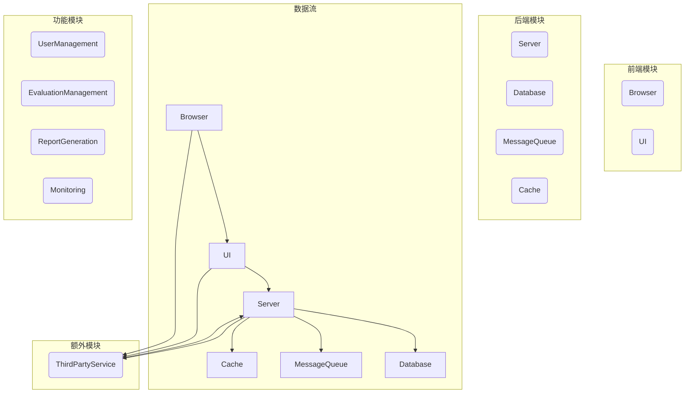

                 

**文章标题：**
评测系统的跨平台兼容性：支持多环境部署

**关键词：**
跨平台兼容性、多环境部署、评测系统、测试工具、系统架构设计

**摘要：**
本文将深入探讨评测系统的跨平台兼容性，并阐述其在多环境部署中的应用与实践。通过分析现有的兼容性挑战，介绍评估方法和关键技术，本文旨在为开发者提供一套系统的跨平台兼容性解决方案，助力构建稳定、高效的评测系统。

----------------------------------------------------------------

## 引言

### 1.1 跨平台兼容性的重要性

在当今快速发展的信息技术时代，软件系统必须具备跨平台兼容性，以满足不同操作系统、硬件环境和软件环境的运行需求。跨平台兼容性不仅关系到软件的可用性和用户体验，更直接影响到企业的业务连续性和市场竞争力。一个高度兼容的评测系统可以确保在不同环境中的一致性和准确性，从而提高开发效率、降低维护成本。

### 1.2 现有的兼容性挑战

尽管跨平台兼容性在理论上是一个广泛接受的需求，但在实际应用中仍然面临诸多挑战。首先，不同操作系统（如Windows、Linux、macOS）和硬件设备（如PC、手机、嵌入式设备）之间存在差异，这些差异可能导致软件在不同平台上运行时出现兼容性问题。其次，软件环境（如编译器版本、库依赖、配置参数）的不同也可能导致兼容性障碍。此外，随着技术的发展，新标准和协议的引入也带来了兼容性问题。

### 1.3 本书的目标和结构

本书旨在为开发者提供一套系统的跨平台兼容性解决方案，具体目标如下：

1. **理解跨平台兼容性的基本概念**：介绍跨平台兼容性的定义、层次和标准化。
2. **评估跨平台兼容性**：讨论评估标准、自动化测试工具及其应用。
3. **设计支持多环境部署的系统架构**：阐述系统架构设计原则和关键技术的应用。
4. **实战案例分析**：通过具体案例展示跨平台兼容性的实现过程。
5. **最佳实践和优化策略**：总结最佳实践，提出优化策略。

接下来的章节将按照上述目标逐步展开讨论，为开发者提供实用的指导和解决方案。

----------------------------------------------------------------

## 跨平台兼容性的基本概念

### 2.1 平台和环境的定义

在讨论跨平台兼容性之前，有必要明确平台和环境的定义。平台通常指运行软件的系统环境，包括操作系统、硬件配置、软件库和编译器等。而环境则是指特定的运行条件，如网络环境、配置参数和安全要求等。

不同平台之间的差异主要表现在以下几个方面：

1. **操作系统差异**：不同操作系统在内核、文件系统、进程管理和内存管理等方面存在差异，可能导致软件在不同平台上运行时出现兼容性问题。
2. **硬件差异**：不同硬件设备在处理器架构、内存容量、存储设备等方面存在差异，这可能导致软件在不同设备上运行时出现性能和兼容性问题。
3. **软件库差异**：不同操作系统和硬件设备可能预装了不同的软件库，这些库的版本和功能可能不同，可能导致软件在不同环境中运行时出现兼容性问题。

### 2.2 兼容性的层次

跨平台兼容性可以分为以下几个层次：

1. **功能兼容性**：软件在所有目标平台上能够实现相同的功能，且功能行为一致。
2. **性能兼容性**：软件在所有目标平台上能够达到预定的性能指标，如响应时间、吞吐量等。
3. **界面兼容性**：软件的用户界面在不同平台上看起来一致，且用户交互体验良好。
4. **部署兼容性**：软件能够在所有目标平台上顺利部署，包括安装、配置和运行。
5. **安全性兼容性**：软件在不同平台上的安全性表现一致，能够防范常见的网络攻击和漏洞。

### 2.3 标准化和规范化

标准化和规范化是确保跨平台兼容性的重要手段。标准化指的是通过制定统一的规范和标准来统一不同平台的行为和接口。规范化则是按照标准进行设计和开发，以确保软件在不同平台上的兼容性。

现有的标准化组织如ISO、IEEE、W3C等，已经制定了大量的标准和规范，如网络协议、文件格式、编程语言等。开发者应遵循这些标准和规范，以提高软件的兼容性。

在软件开发的各个阶段，标准化和规范化都发挥着重要作用。在需求分析阶段，应明确兼容性需求，并在设计阶段制定兼容性策略。在开发阶段，应使用标准化的编程语言和工具，并遵循规范进行编码。在测试阶段，应使用自动化测试工具对软件进行跨平台测试，以确保兼容性。

通过明确平台和环境的定义、理解兼容性的层次以及遵循标准化和规范化，开发者可以有效地解决跨平台兼容性问题，为构建高度兼容的评测系统奠定基础。

----------------------------------------------------------------

### 2.4 跨平台兼容性测试的策略和工具

在软件开发过程中，跨平台兼容性测试是确保软件在不同环境中稳定运行的关键环节。有效的兼容性测试策略和工具不仅能够发现和解决潜在的问题，还能够提高开发效率，降低维护成本。

#### 2.4.1 测试策略

1. **全面性**：测试应覆盖所有目标平台，包括操作系统、硬件设备和软件环境。
2. **层次性**：从功能测试、性能测试到界面测试，逐步深化测试层次。
3. **自动化**：使用自动化测试工具，减少人工测试的工作量，提高测试效率和覆盖范围。
4. **持续集成**：将兼容性测试集成到持续集成（CI）流程中，确保每次代码更改后都能进行全面的兼容性检查。

#### 2.4.2 常见的兼容性测试工具

1. **Selenium**：Selenium是一个开源的Web自动化测试工具，支持多种浏览器和操作系统，可以模拟用户的操作行为，进行功能测试和界面测试。
2. **Appium**：Appium是一个开源的移动应用自动化测试工具，支持多种操作系统（iOS、Android）和浏览器，可以用于移动应用的功能测试和兼容性测试。
3. **Jenkins**：Jenkins是一个开源的持续集成工具，可以与Selenium和Appium集成，实现自动化测试流程的集成和持续执行。
4. **VMware/VirtualBox**：通过虚拟化技术，创建多种操作系统和硬件环境的虚拟机，进行兼容性测试。

#### 2.4.3 测试流程

1. **需求分析**：明确兼容性测试的需求，包括测试的平台、软件功能、性能指标等。
2. **测试计划**：制定详细的测试计划，包括测试用例的设计、执行和报告。
3. **测试执行**：执行测试计划中的测试用例，记录测试结果。
4. **问题跟踪**：发现兼容性问题后，进行问题定位和跟踪，确保问题得到解决。
5. **回归测试**：在修改代码后，重新执行测试用例，验证修复后的兼容性。

通过有效的跨平台兼容性测试策略和工具，开发者可以确保软件在不同平台上的一致性和稳定性，从而提高软件的可靠性和用户体验。

### 2.5 跨平台兼容性的挑战与解决方案

#### 2.5.1 编译器差异

编译器差异是跨平台兼容性中常见的问题。不同操作系统和硬件设备的编译器可能支持不同的编程语言特性或编译选项，导致代码在不同平台上编译失败或运行异常。

**解决方案**：使用跨平台编译器，如GCC、Clang等，并确保编译器选项的一致性。同时，编写可移植的代码，避免使用特定编译器的特性。

#### 2.5.2 库依赖问题

库依赖问题是另一个挑战。不同操作系统和硬件设备可能预装了不同版本的库，这些库的API和行为可能不同，导致软件在不同环境中运行时出现兼容性问题。

**解决方案**：使用标准库或跨平台库，如Boost、Poco等，并确保库版本的一致性。使用依赖管理工具，如CMake、Maven等，自动化管理库依赖。

#### 2.5.3 环境配置问题

环境配置问题也是跨平台兼容性中的一个难题。不同操作系统的配置文件格式、路径和环境变量设置可能不同，导致软件在不同环境中无法正常运行。

**解决方案**：使用配置管理工具，如Ansible、Puppet等，自动化管理环境配置。编写平台无关的配置代码，通过环境变量动态调整配置。

通过解决编译器差异、库依赖问题和环境配置问题，开发者可以大幅提升软件的跨平台兼容性，确保软件在不同环境中的一致性和稳定性。

----------------------------------------------------------------

## 系统架构设计

### 3.1 系统架构概述

为了实现评测系统的跨平台兼容性和多环境部署，系统架构设计至关重要。本节将介绍系统架构的总体设计，包括其主要组件和功能。

#### 3.1.1 主要组件

1. **前端界面**：提供用户与系统交互的界面，支持多种浏览器的访问。
2. **后端服务**：处理业务逻辑和数据存储，支持RESTful API。
3. **数据库**：存储评测数据和系统配置信息。
4. **消息队列**：实现系统各组件之间的异步通信。
5. **缓存层**：提高系统性能，减少数据库访问压力。

#### 3.1.2 功能设计

1. **用户管理**：提供用户注册、登录和权限管理功能。
2. **评测管理**：支持评测创建、编辑、执行和结果分析。
3. **数据存储**：存储评测数据和系统日志。
4. **报告生成**：生成评测报告，支持多种格式导出。
5. **监控与报警**：实时监控系统性能，发送报警信息。

### 3.2 架构设计原则

在设计评测系统时，需要遵循以下架构设计原则，以确保系统的可扩展性、稳定性和跨平台兼容性：

1. **模块化**：将系统划分为多个模块，每个模块具有独立的功能和接口，便于维护和升级。
2. **分布式**：采用分布式架构，将系统分解为多个服务，提高系统的可用性和容错性。
3. **可扩展性**：设计可扩展的架构，支持系统规模的弹性扩展。
4. **高性能**：优化系统性能，提高响应速度和处理能力。
5. **安全性**：确保系统数据和用户信息的安全，防范网络攻击和数据泄露。

### 3.3 Mermaid架构图展示

为了更直观地展示系统架构，我们可以使用Mermaid绘制架构图。以下是评测系统的Mermaid架构图示例：

通过该架构图，我们可以清晰地看到评测系统的各个组件及其交互关系，有助于理解和设计系统的整体架构。

----------------------------------------------------------------

## 支持多环境部署的关键技术

### 4.1 环境配置管理

环境配置管理是确保评测系统在不同环境中正确运行的关键。环境配置包括操作系统设置、依赖库安装、环境变量配置等。为了简化环境配置过程，可以采用以下技术：

1. **脚本自动化**：使用脚本（如Shell、Python等）自动化安装依赖库、配置环境变量和初始化系统。
2. **配置管理工具**：使用配置管理工具（如Ansible、Puppet等）自动化管理环境配置，确保配置的一致性和可复现性。
3. **容器化**：使用容器（如Docker）封装应用程序及其依赖环境，实现环境的标准化和隔离。

### 4.2 虚拟化和容器化技术

虚拟化和容器化技术是实现多环境部署的重要手段。它们各有优缺点，适用于不同的场景：

#### 4.2.1 虚拟化技术

虚拟化技术通过创建虚拟机（VM）来实现操作系统和硬件资源的隔离和抽象。主要优点包括：

1. **资源隔离**：每个虚拟机拥有独立的操作系统和资源，提高系统的安全性和稳定性。
2. **可移植性**：虚拟机可以在不同的物理机和操作系统上运行，便于部署和维护。

主要缺点包括：

1. **性能开销**：虚拟化层引入了额外的性能开销，可能影响系统的性能。
2. **管理复杂度**：虚拟机管理较为复杂，需要专业的管理工具和技能。

#### 4.2.2 容器化技术

容器化技术通过创建容器（Container）来封装应用程序及其依赖环境。主要优点包括：

1. **轻量级**：容器比虚拟机更轻量，启动速度快，资源消耗低。
2. **可移植性**：容器可以在不同的操作系统和硬件上运行，具有高度的可移植性。
3. **一致性**：容器环境与宿主机环境一致，减少环境差异带来的兼容性问题。

主要缺点包括：

1. **资源隔离**：容器之间的资源隔离性较差，可能存在安全隐患。
2. **依赖管理**：需要确保容器内所有依赖库和配置的一致性。

### 4.3 Continuous Integration/Continuous Deployment (CI/CD)

Continuous Integration (CI) 和 Continuous Deployment (CD) 是自动化软件开发流程的重要部分。CI/CD 技术能够自动化构建、测试和部署过程，提高开发效率和软件质量。

1. **Continuous Integration**：通过自动化构建和测试，确保每次代码提交后都能快速发现问题并修复。CI 工具（如 Jenkins、Travis CI 等）可以实现自动化构建和测试。
2. **Continuous Deployment**：在通过 CI 测试后，自动部署到生产环境。CD 工具（如 Jenkins、Spinnaker 等）可以实现自动化部署。

CI/CD 技术能够提高软件的交付速度和质量，实现快速反馈和持续改进。

通过环境配置管理、虚拟化和容器化技术以及 CI/CD 流程，开发者可以轻松实现评测系统的多环境部署，确保系统在不同环境中的稳定运行和高效管理。

----------------------------------------------------------------

## 跨平台兼容性实战案例

### 6.1 案例一：Web应用的跨平台部署

#### 案例背景

某知名互联网公司开发了一款面向全球用户的Web应用，需要在Windows、Linux和macOS等多个操作系统上运行，支持多种浏览器，如Chrome、Firefox和Safari。为了保证应用的跨平台兼容性，公司决定采用以下策略：

#### 案例实施

1. **前端技术选型**：采用HTML5、CSS3和JavaScript等标准化技术，确保不同浏览器和操作系统的一致性。
2. **自动化测试**：使用Selenium自动化测试工具，编写跨浏览器和操作系统的测试脚本，确保功能和行为的一致性。
3. **容器化部署**：使用Docker容器化技术，将前端应用程序及其依赖环境封装在容器中，实现环境的标准化和隔离。
4. **CI/CD流程**：采用Jenkins实现自动化构建和部署，确保每次代码提交后都能自动进行测试和部署。

#### 案例结果

通过上述策略，Web应用在多个操作系统和浏览器上成功部署并运行，确保了跨平台兼容性。自动化测试和CI/CD流程显著提高了开发效率和软件质量，减少了兼容性问题。

### 6.2 案例二：移动应用的跨平台适配

#### 案例背景

某移动应用开发公司开发了一款面向iOS和Android平台的应用，需要在多个设备和操作系统版本上运行。为了实现跨平台适配，公司采用了以下方法：

#### 案例实施

1. **使用原生开发框架**：同时使用React Native和Flutter进行原生开发，确保在不同平台上的性能和体验。
2. **自动化UI测试**：使用Appium自动化测试工具，编写跨平台UI测试脚本，确保应用在不同设备和操作系统版本上的界面一致性。
3. **容器化和云部署**：使用Docker和Kubernetes容器化技术，将应用部署到云平台，实现灵活的扩缩容和高效管理。

#### 案例结果

通过原生开发框架和自动化UI测试，移动应用在iOS和Android多个设备和操作系统版本上成功适配。容器化和云部署提高了应用的扩展性和可靠性，降低了维护成本。

### 6.3 案例三：企业应用的多环境部署

#### 案例背景

某大型企业开发了一套企业应用，需要在不同业务部门的支持环境中部署，包括开发环境、测试环境和生产环境。为了确保多环境部署的兼容性，企业采用了以下策略：

#### 案例实施

1. **环境标准化**：使用Ansible和Puppet等配置管理工具，确保各环境配置的一致性。
2. **容器化和虚拟化**：结合使用Docker和VMware虚拟化技术，实现应用程序的容器化和环境隔离。
3. **持续集成和部署**：采用Jenkins和Spinnaker等CI/CD工具，实现自动化构建、测试和部署流程。

#### 案例结果

通过环境标准化、容器化和虚拟化技术以及CI/CD流程，企业应用在不同支持环境中顺利部署，确保了跨平台兼容性和高效管理。自动化测试和持续集成提高了软件质量，减少了部署风险。

通过这三个实战案例，我们可以看到跨平台兼容性在Web应用、移动应用和企业应用中的重要性，以及通过合适的策略和技术实现的可行性。

----------------------------------------------------------------

## 最佳实践与优化策略

### 7.1 性能优化技巧

为了确保评测系统的跨平台兼容性和性能，以下是一些性能优化技巧：

1. **代码优化**：编写高效、可移植的代码，避免使用特定平台或硬件的特定功能。
2. **缓存机制**：使用缓存减少数据库访问次数，提高系统响应速度。
3. **异步处理**：使用异步编程模型，减少同步操作等待时间，提高系统并发能力。
4. **负载均衡**：采用负载均衡技术，将请求分散到多个服务器上，提高系统的处理能力和可用性。
5. **内存管理**：合理分配和管理内存，避免内存泄漏和溢出，提高系统稳定性。

### 7.2 安全性和稳定性考虑

在设计和部署评测系统时，应考虑以下安全性和稳定性因素：

1. **访问控制**：实施严格的访问控制机制，确保只有授权用户可以访问系统资源。
2. **数据加密**：对敏感数据进行加密存储和传输，防止数据泄露。
3. **错误处理**：合理处理异常和错误，避免系统崩溃或泄露敏感信息。
4. **监控和日志**：实施实时监控和日志记录，及时发现并解决系统问题。
5. **备份和恢复**：定期备份系统数据，确保在发生故障时能够快速恢复。

### 7.3 维护和升级策略

为了确保评测系统的长期稳定运行，以下是一些维护和升级策略：

1. **版本控制**：使用版本控制系统（如Git），确保代码变更的可追踪性和可管理性。
2. **自动化测试**：建立自动化测试体系，确保每次升级或修复后系统的稳定性和兼容性。
3. **备份与回滚**：在升级或修复前备份系统，确保在出现问题时可以快速回滚。
4. **更新策略**：制定合理的更新计划，定期更新系统和依赖库，确保安全性和兼容性。
5. **文档和维护手册**：编写详细的文档和维护手册，帮助开发者和管理员理解和操作系统。

通过实施最佳实践和优化策略，开发者可以构建高效、稳定和兼容性强的评测系统，提高企业的竞争力。

----------------------------------------------------------------

## 小结与展望

### 8.1 总结与回顾

本文围绕评测系统的跨平台兼容性展开讨论，从基本概念、评估方法、系统架构设计到实战案例，再到最佳实践和优化策略，全面阐述了跨平台兼容性的重要性及其实现方法。通过分析现有挑战，介绍关键技术，本文为开发者提供了一套系统的解决方案，助力构建稳定、高效的评测系统。

### 8.2 未来发展趋势

随着技术的不断进步，跨平台兼容性将继续成为软件开发的重要方向。未来的发展趋势包括：

1. **云原生架构**：基于容器和微服务的云原生架构将进一步提升系统的跨平台兼容性和可扩展性。
2. **AI驱动的自动化测试**：利用人工智能和机器学习技术，实现更智能、更高效的自动化测试，减少人工干预。
3. **边缘计算**：边缘计算的发展将带来新的跨平台兼容性挑战，如边缘设备和中心服务之间的数据同步和一致性保证。

### 8.3 进一步研究方向

为了更好地应对未来的跨平台兼容性挑战，以下研究方向值得关注：

1. **跨平台性能优化**：深入研究跨平台性能优化技术，提高系统的响应速度和处理能力。
2. **安全性保障**：加强对跨平台兼容性下的安全威胁研究，提出更加有效的安全防护策略。
3. **多环境一致性**：探索如何在复杂的异构环境中实现系统配置的一致性，提高系统的可靠性。

通过不断探索和研究，我们将能够构建更加高效、稳定和兼容的评测系统，为软件开发和运维提供有力支持。

----------------------------------------------------------------

**作者：**AI天才研究院/AI Genius Institute & 禅与计算机程序设计艺术 /Zen And The Art of Computer Programming

---

本文通过对评测系统跨平台兼容性的深入探讨，从基本概念、评估方法、系统架构设计到实战案例，再到最佳实践和优化策略，全面阐述了实现多环境部署的解决方案。希望本文能为开发者提供有价值的参考和指导，助力构建高效、稳定和兼容的评测系统。未来，随着技术的不断发展，跨平台兼容性将面临更多挑战和机遇，期待更多人参与到这一领域中，共同推动软件技术的发展和创新。

