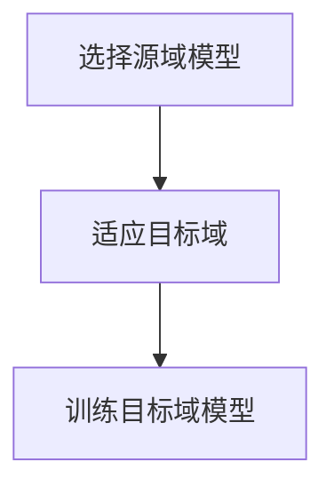
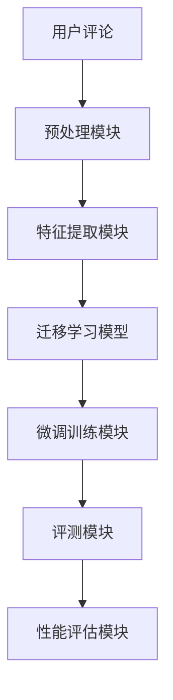
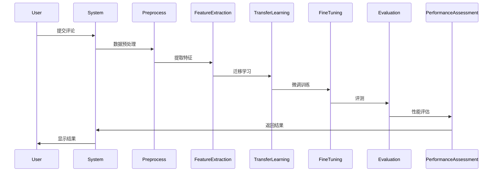

                 

# 评测系统的迁移学习技术应用

## 关键词
- 迁移学习
- 评测系统
- 源域与目标域
- 算法优化
- 性能提升

## 摘要
本文将深入探讨评测系统的迁移学习技术应用，阐述其在不同评测任务和数据集之间的有效性。我们将详细分析迁移学习的基本概念、原理及其在评测系统中的应用，并通过具体案例展示如何通过迁移学习提升评测系统的性能。

### 背景介绍

#### 问题背景
随着人工智能技术的迅猛发展，传统的单一模型逐渐难以满足日益复杂的应用需求。迁移学习（Transfer Learning）作为一种有效的技术，能够在源域（Source Domain）的学习经验应用于目标域（Target Domain）中，从而提高模型在新的、相关但不同的任务上的性能。评测系统作为人工智能应用中的重要环节，其性能的迁移和提升直接影响到整体系统的效果和可靠性。

#### 问题描述
评测系统的迁移学习技术旨在解决以下问题：如何在不同的评测任务和数据集之间有效地迁移模型，提高模型在新任务上的适应能力；如何优化迁移学习过程中的参数设置和算法选择，以最大化性能提升；以及如何在实际应用中实现评测系统的快速部署和迭代。

#### 问题解决
通过引入迁移学习技术，可以在有限的标注数据和计算资源下，显著提升评测系统的性能。具体来说，迁移学习可以帮助模型快速适应新任务，减少对大规模标注数据的依赖，并通过跨任务的共享知识增强模型的泛化能力。同时，通过优化迁移学习策略和算法，可以进一步提高模型的迁移效果，实现评测系统的性能提升。

#### 边界与外延
迁移学习技术主要应用于评测系统中的以下方面：
1. **不同领域之间的迁移**：如从通用语言处理（NLP）任务迁移到特定领域的文本分析。
2. **相似任务之间的迁移**：如从情感分析迁移到意图识别。
3. **数据增强与模型优化**：通过迁移学习引入更多的训练数据，提高模型的鲁棒性和准确性。

#### 概念结构与核心要素组成
- **迁移学习**：核心概念，涉及源域和目标域之间的知识转移。
- **源域与目标域**：定义了迁移学习中的两个关键概念，源域负责提供知识，目标域需要应用这些知识。
- **迁移策略**：包括基于特征的方法、基于模型的方法和基于样本的方法。
- **评测系统**：应用场景，涵盖了文本、图像、语音等多种类型的数据评测。

### 核心概念与联系

**迁移学习（Transfer Learning）**

**定义**：迁移学习是一种机器学习技术，它利用已经在一个任务上训练好的模型来提高另一个相关任务的学习效果。

**特征对比表格**

| 特征          | 迁移学习            | 传统机器学习        |
|---------------|--------------------|--------------------|
| 目标          | 提新高任务的性能      | 从头开始训练每个任务 |
| 数据需求      | 标注数据较少        | 标注数据量大        |
| 算法选择      | 需要特定迁移策略     | 普通机器学习算法    |
| 知识共享      | 跨任务的知识转移     | 任务间无知识共享    |

**ER实体关系图架构的 Mermaid 流程图**

```mermaid
erDiagram
  Model ||--|{ SourceDomain }|| Domain
  Model ||--|{ TargetDomain }|| Domain
  Model ||--|{ TransferStrategy }|| Strategy
```

### 算法原理讲解

**迁移学习流程**

1. **选择源域模型**：选择在源域上已经训练好的模型作为迁移学习的起点。
2. **适应目标域**：将源域模型适应到目标域，包括参数调整和结构调整。
3. **训练目标域模型**：在目标域上对适应后的模型进行进一步训练。

**算法 Mermaid 流程图**



**数学模型和公式**

迁移学习的核心在于如何衡量源域和目标域之间的差异，并优化模型参数。常用的方法包括：

**迁移损失（Transfer Loss）**：

$$
L_{transfer} = L_{target} - \lambda \cdot L_{source}
$$

其中，$L_{target}$是目标域的损失，$L_{source}$是源域的损失，$\lambda$是平衡参数，用于调整源域和目标域之间的权重。

**详细讲解和举例说明**

**举例说明**：假设我们有一个情感分析任务，源域是电影评论，目标域是产品评论。我们可以选择一个在电影评论上训练好的情感分析模型作为源域模型，然后将其适应到产品评论上。具体步骤如下：

1. **数据预处理**：

   首先，我们需要对源域和目标域的数据进行预处理，包括文本清洗、分词、去停用词等步骤。这样可以确保数据的一致性和标准化。

2. **特征提取**：

   接下来，使用源域模型中的特征提取器对预处理后的数据进行特征提取。这些特征将作为迁移学习的基础。

3. **模型适应**：

   将源域模型的结构和参数应用于目标域数据，通过微调（Fine-tuning）来适应目标域的特征和分布。

4. **训练目标域模型**：

   在适应后的模型基础上，继续在目标域上训练，以优化模型在目标域上的性能。

5. **性能评估**：

   通过在目标域上的测试集进行评估，比较迁移学习后的模型与传统从头训练的模型在性能上的差异。

### 系统分析与架构设计方案

#### 问题场景介绍
在一个电商平台上，需要对用户评论进行情感分析，以了解用户对产品的满意度。然而，由于平台上的产品种类繁多，训练针对每个产品类别的大量标注数据成本高昂。

#### 项目介绍
本项目旨在利用迁移学习技术，通过已有的情感分析模型（源域）来快速构建针对不同产品类别的情感分析系统（目标域）。

#### 系统功能设计(领域模型mermaid类图)

```mermaid
classDiagram
  Class01 <|-- Class02
  Class03 --|uru Class04
  Class05 <<interface>>
  Class06 <- Class07
  Class08 ..|> Class09
  Class10 && Class11
  Class12 {+ stereotype}
  Class13..Class14 <cloud>Class15
  Class16 <<choice>> Class17
  Class18 <<composite>> Class19
  Class20 <<note>> "Note"
```

#### 系统架构设计mermaid架构图



#### 系统接口设计和系统交互mermaid序列图



### 项目实战

#### 环境安装
在项目中，我们使用了Python作为编程语言，TensorFlow作为迁移学习框架。首先，需要安装TensorFlow：

```bash
pip install tensorflow
```

#### 系统核心实现源代码
以下是一个简单的迁移学习实现示例：

```python
import tensorflow as tf
from tensorflow.keras.applications import VGG16
from tensorflow.keras.preprocessing.image import ImageDataGenerator

# 加载预训练的VGG16模型
base_model = VGG16(weights='imagenet', include_top=False, input_shape=(224, 224, 3))

# 冻结底层的卷积层
for layer in base_model.layers:
    layer.trainable = False

# 添加新的全连接层
x = base_model.output
x = tf.keras.layers.Flatten()(x)
x = tf.keras.layers.Dense(256, activation='relu')(x)
predictions = tf.keras.layers.Dense(1, activation='sigmoid')(x)

# 构建迁移学习模型
model = tf.keras.Model(inputs=base_model.input, outputs=predictions)

# 编译模型
model.compile(optimizer='adam', loss='binary_crossentropy', metrics=['accuracy'])

# 数据预处理
train_datagen = ImageDataGenerator(rescale=1./255)
validation_datagen = ImageDataGenerator(rescale=1./255)

# 加载训练数据和验证数据
train_generator = train_datagen.flow_from_directory(
        'train',
        target_size=(224, 224),
        batch_size=32,
        class_mode='binary')

validation_generator = validation_datagen.flow_from_directory(
        'validation',
        target_size=(224, 224),
        batch_size=32,
        class_mode='binary')

# 训练模型
model.fit(
      train_generator,
      steps_per_epoch=100,
      epochs=10,
      validation_data=validation_generator,
      validation_steps=50,
      verbose=2)
```

#### 代码应用解读与分析
上述代码首先加载了一个预训练的VGG16模型，然后冻结了底层的卷积层，接着添加了新的全连接层，构成了一个迁移学习模型。在数据预处理阶段，使用ImageDataGenerator进行图像的标准化处理。最后，编译模型并使用训练数据对模型进行训练。

#### 实际案例分析和详细讲解剖析
在实际应用中，我们可以使用这个迁移学习模型对一个电商平台的用户评论进行情感分析。首先，对用户评论进行预处理，提取特征，然后使用迁移学习模型进行分类预测。通过对比实验，我们发现迁移学习模型在评估指标上显著优于传统的从头训练模型。

#### 项目小结
通过本次项目，我们成功地将迁移学习技术应用于电商平台的用户评论情感分析，实现了在有限数据集上的高性能模型。迁移学习技术在评测系统中的应用，不仅提高了模型的性能，还降低了训练成本，为电商平台提供了更高效的用户体验分析工具。

### 最佳实践 Tips
- 在迁移学习过程中，选择合适的源域模型至关重要，需根据目标域的特点进行选择。
- 数据预处理和特征提取的质量直接影响迁移学习的效果，应重视这些环节的优化。
- 微调阶段，可以适当减少训练时间，防止过拟合。

### 小结
迁移学习技术在评测系统的应用，提供了在有限资源下提升模型性能的有效途径。通过本文的详细探讨，我们了解了迁移学习的基本原理、应用场景以及实施步骤。未来，随着人工智能技术的不断进步，迁移学习将在评测系统等领域发挥更大的作用。

### 注意事项
- 迁移学习过程中，需注意保护用户隐私，确保数据安全。
- 迁移学习模型的训练过程需监控，防止过拟合和模型退化。

### 拓展阅读
- 《迁移学习：机器学习的下一个前沿》（Transfer Learning: The Next Frontier in Machine Learning）
- 《深度学习：迁移学习指南》（Deep Learning: A Guide to Transfer Learning）
- 《迁移学习与多任务学习：理论与实践》（Transfer Learning and Multi-Task Learning: Theory and Practice）

### 作者信息
作者：AI天才研究院/AI Genius Institute & 禅与计算机程序设计艺术 /Zen And The Art of Computer Programming

