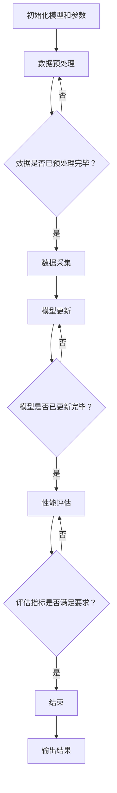
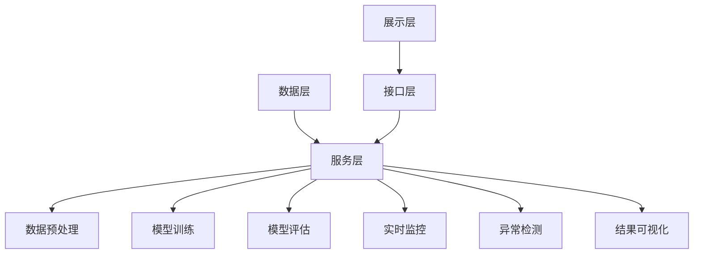
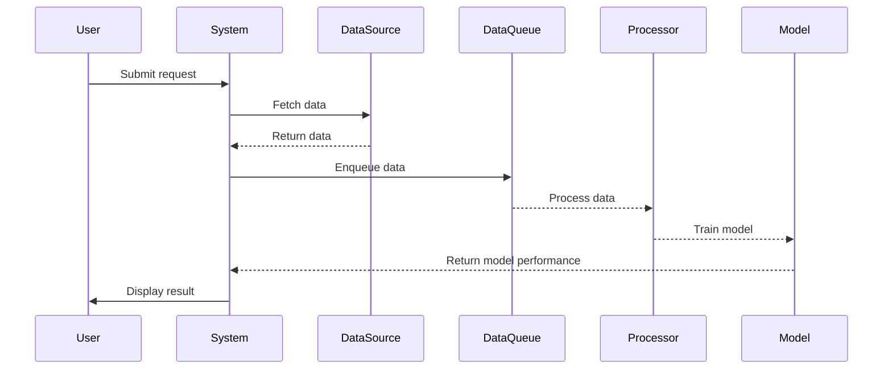

                 

### 目录大纲设计步骤

#### 步骤1：背景介绍
为了更好地理解评测系统的连续学习与灾难性遗忘防御，我们需要从多个角度来介绍这一主题。以下是背景介绍的具体内容：

##### **1.1 问题背景**
评测系统在现代科技中的应用越来越广泛，尤其是在人工智能和机器学习领域。它们被用来评估算法的性能、优化模型参数，甚至用于实时监控和调整系统的运行状态。

##### **1.2 问题描述**
尽管评测系统在许多方面表现出色，但它们面临着两个主要挑战：连续学习和灾难性遗忘防御。连续学习指的是模型在获取新数据时能够有效更新其知识库，而灾难性遗忘防御则是防止模型在训练过程中因过度拟合或数据稀疏而导致的性能急剧下降。

##### **1.3 问题解决**
为了解决上述问题，研究者们提出了多种方法。这些方法通常涉及动态调整学习率、引入正则化项、使用迁移学习技术等。

##### **1.4 边界与外延**
在讨论评测系统的连续学习与灾难性遗忘防御时，我们需要明确研究的范围，包括评测系统的类型、适用的学习算法、以及如何处理遗忘现象。

##### **1.5 概念结构与核心要素组成**
这一部分将介绍评测系统的核心概念和组成部分，帮助读者建立对该系统的全面理解。

---

#### 步骤2：核心概念与联系
理解连续学习和灾难性遗忘防御的概念是深入探讨该主题的关键。以下是具体内容：

##### **2.1 核心概念原理**
连续学习指的是模型在获取新数据时，能够有效地更新其知识库，以适应新的环境和任务。而灾难性遗忘防御则是确保模型在训练过程中不会因为过度拟合或数据稀疏而导致性能急剧下降。

##### **2.2 概念属性特征对比表格**
在这一部分，我们将列出连续学习和灾难性遗忘防御的主要属性特征，并进行对比分析。这将有助于读者更好地理解两者的区别和联系。

##### **2.3 ER实体关系图架构**
ER（实体-关系）图是数据库设计中常用的工具，它可以帮助我们清晰地展示评测系统中各个实体的关系。使用Mermaid绘制ER图，将为读者提供直观的视觉参考。

---

#### 步骤3：算法原理讲解
算法原理讲解是本文的核心部分，我们将详细阐述连续学习和灾难性遗忘防御的算法原理。以下是具体内容：

##### **3.1 算法mermaid流程图**
使用Mermaid绘制算法执行流程图，可以帮助读者更直观地理解算法的执行步骤。

##### **3.2 Python源代码**
为了更好地理解算法原理，我们将提供Python源代码实现。这将使读者能够亲身体验算法的应用过程。

##### **3.3 数学模型和公式**
算法背后的数学模型和公式是理解和实现算法的关键。我们将详细讲解这些模型和公式，确保读者能够掌握其核心概念。

##### **3.4 详细讲解与举例说明**
理论讲解之后，我们将使用通俗易懂的语言进行详细讲解，并提供实际案例的举例说明。这将帮助读者更好地理解算法的实际应用。

---

#### 步骤4：系统分析与架构设计
系统分析与架构设计是确保评测系统有效运作的重要环节。以下是具体内容：

##### **4.1 问题场景介绍**
我们将介绍评测系统在实际应用中的场景，以便读者了解其在现实世界中的具体应用。

##### **4.2 项目介绍**
我们将简述评测系统的整体设计和实现过程，帮助读者建立对系统的整体认识。

##### **4.3 系统功能设计**
使用Mermaid绘制领域模型类图，展示系统的功能模块，这将有助于读者理解系统的功能结构。

##### **4.4 系统架构设计**
系统架构设计是确保评测系统高效运作的关键。我们将绘制系统架构图，展示评测系统的整体架构。

##### **4.5 系统接口设计**
系统接口设计是评测系统与外部环境交互的桥梁。我们将描述评测系统的接口设计和功能。

##### **4.6 系统交互mermaid序列图**
使用Mermaid绘制系统交互的序列图，将有助于读者理解评测系统在执行任务时的交互过程。

---

#### 步骤5：项目实战
项目实战部分将提供评测系统的实际操作步骤，帮助读者将理论知识应用于实际项目中。以下是具体内容：

##### **5.1 环境安装**
我们将提供评测系统所需的软件和环境安装步骤，确保读者能够顺利开始项目。

##### **5.2 核心实现源代码**
我们将提供评测系统的核心实现源代码，以便读者能够深入了解系统的实现细节。

##### **5.3 代码解读与分析**
对于核心源代码，我们将进行解读和分析，帮助读者理解代码的运行逻辑。

##### **5.4 实际案例分析和详细讲解剖析**
我们将分析实际案例，并进行详细讲解和剖析，帮助读者将所学知识应用于实际场景。

##### **5.5 项目小结**
在项目实战的结尾，我们将总结评测系统的实战经验和教训，为读者提供宝贵的经验。

---

#### 步骤6：最佳实践、小结、注意事项、拓展阅读
最后，我们将总结最佳实践、提供小结、注意事项，并推荐拓展阅读，帮助读者更好地理解和应用评测系统的连续学习与灾难性遗忘防御。

##### **6.1 最佳实践 tips**
我们将提供使用评测系统的最佳实践和建议，帮助读者在项目中取得更好的效果。

##### **6.2 小结**
我们将总结本书的主要内容和收获，帮助读者巩固所学知识。

##### **6.3 注意事项**
我们将提醒读者在使用评测系统时需要注意的事项，以避免潜在的问题。

##### **6.4 拓展阅读**
我们将推荐进一步阅读的相关资料，帮助读者深入探索评测系统的连续学习与灾难性遗忘防御。

---

通过以上六个步骤，我们将系统地介绍评测系统的连续学习与灾难性遗忘防御，帮助读者全面理解和应用这一技术。接下来，我们将按照这个大纲逐步展开文章的内容。### 第1章：评测系统概述

#### 1.1 问题背景

在现代科技迅速发展的背景下，人工智能和机器学习技术已经广泛应用于各个领域。评测系统作为人工智能和机器学习技术的重要组成部分，承担着评估模型性能、优化算法参数、监控系统运行状态等关键任务。随着人工智能应用的不断深入，评测系统的需求也在日益增长。

评测系统的重要性不仅体现在其在科研和工业生产中的应用，还在于其对模型持续改进和优化的重要性。通过评测系统，研究人员可以实时监控模型的表现，识别潜在问题，并提出相应的改进措施。在工业生产中，评测系统可以用于生产线的质量监控，确保产品的稳定性和可靠性。

然而，随着应用场景的复杂化和数据量的急剧增加，评测系统也面临着新的挑战。其中，连续学习和灾难性遗忘防御是两个亟待解决的问题。连续学习指的是模型在获取新数据时能够有效更新其知识库，以适应新的环境和任务。而灾难性遗忘防御则是确保模型在训练过程中不会因为过度拟合或数据稀疏而导致性能急剧下降。

#### 1.2 问题描述

连续学习与灾难性遗忘防御是评测系统中面临的两个主要挑战。

1. **连续学习问题**：
   模型在获取新数据时，如何有效地更新其知识库，以保持对新环境的适应能力？这是一个复杂的动态学习问题。新数据的引入可能会导致旧知识的遗忘，从而影响模型的性能。

2. **灾难性遗忘问题**：
   在模型训练过程中，如果出现过度拟合或数据稀疏，可能会导致模型性能急剧下降，甚至失去学习能力。这种灾难性遗忘现象不仅会影响模型的性能，还可能导致整个评测系统的失效。

#### 1.3 问题解决

为了解决连续学习和灾难性遗忘防御的问题，研究者们提出了多种方法。以下是一些常见的方法：

1. **动态学习率调整**：
   动态调整学习率可以有效地控制模型对新数据的敏感度，避免过快或过慢的更新。

2. **正则化技术**：
   通过引入正则化项，可以防止模型在训练过程中出现过拟合现象，提高模型的泛化能力。

3. **迁移学习**：
   迁移学习利用已有的知识来加速新任务的学习，可以有效地解决灾难性遗忘问题。

4. **数据增强**：
   通过增加训练数据量或生成合成数据，可以缓解数据稀疏问题，提高模型的鲁棒性。

5. **混合学习策略**：
   结合多种学习方法，如在线学习、增量学习和迁移学习，可以进一步提高模型的适应能力和抗遗忘能力。

#### 1.4 边界与外延

在讨论评测系统的连续学习与灾难性遗忘防御时，我们需要明确研究的范围，包括以下几个方面：

1. **评测系统的类型**：
   评测系统可以应用于不同的领域，如图像识别、自然语言处理、推荐系统等。每种类型的评测系统都有其特定的需求和挑战。

2. **学习算法**：
   连续学习和灾难性遗忘防御适用于各种学习算法，包括监督学习、无监督学习和强化学习。不同的学习算法在处理连续学习和灾难性遗忘时具有不同的策略和效果。

3. **遗忘现象**：
   遗忘现象是评测系统中一个普遍存在的问题。理解遗忘现象的发生机制和影响因素，对于设计有效的防御策略至关重要。

4. **概念结构与核心要素组成**：
   评测系统的概念结构和核心要素组成对于理解和分析连续学习与灾难性遗忘防御具有重要意义。通过明确评测系统的核心概念和组成部分，我们可以更好地设计和优化系统。

#### 1.5 概念结构与核心要素组成

评测系统作为一个复杂的系统，由多个核心概念和要素组成。以下是评测系统的核心概念和要素：

1. **数据输入**：
   数据输入是评测系统的基本组成部分。数据输入可以包括各种类型的数据，如图像、文本、音频等。有效的数据输入是评测系统正常运行的基础。

2. **模型评估**：
   模型评估是评测系统的核心功能之一。通过模型评估，我们可以评估模型在特定任务上的性能，如准确率、召回率、F1分数等。

3. **学习算法**：
   学习算法是评测系统中的关键组件。不同的学习算法适用于不同的任务和场景，如线性回归、决策树、神经网络等。

4. **更新策略**：
   更新策略用于动态调整模型参数，以适应新的数据和任务。常见的更新策略包括自适应调整学习率、引入正则化项等。

5. **遗忘防御机制**：
   遗忘防御机制用于防止模型在训练过程中出现过拟合和灾难性遗忘现象。常见的防御机制包括数据增强、迁移学习、混合学习策略等。

6. **用户接口**：
   用户接口是评测系统与用户之间的交互界面。用户接口的设计和实现对于评测系统的易用性和用户体验至关重要。

通过上述核心概念和要素的介绍，我们可以对评测系统有一个更全面的理解。接下来，我们将进一步探讨连续学习和灾难性遗忘防御的核心概念与联系。### 第2章：核心概念与联系

#### 2.1 连续学习原理

连续学习（Continuous Learning）是指模型在获取新数据时，能够有效地更新其知识库，以适应新的环境和任务。这一过程通常包括以下步骤：

1. **数据采集**：从不同的数据源中收集新数据，这些数据可以是来自真实环境的观测数据，也可以是通过模拟生成的人工数据。

2. **数据预处理**：对新数据进行清洗、标准化和归一化处理，以消除噪声和异常值，确保数据的质量和一致性。

3. **模型更新**：使用新的数据对现有模型进行重新训练或微调，以更新模型的知识库。这可以通过在线学习、增量学习或迁移学习等方法实现。

4. **性能评估**：在更新后的模型上评估其在新任务上的性能，包括准确率、召回率、F1分数等指标。

5. **反馈循环**：根据评估结果，对模型进行进一步的调整和优化，以提高其在新数据上的适应能力。

连续学习的目标是通过不断地更新和优化模型，使其能够持续适应新的环境和任务，从而提高模型的泛化能力和实用性。

#### 2.2 灾难性遗忘原理

灾难性遗忘（Catastrophic Forgetting）是指模型在训练过程中，由于过度拟合或数据稀疏等原因，导致旧知识的遗忘或性能下降。这一现象在连续学习中尤为常见，因为它涉及到模型在处理新数据时如何平衡旧知识和新知识之间的关系。

灾难性遗忘的主要原因是：

1. **遗忘机制**：在训练新数据时，模型可能会将旧知识遗忘，以腾出空间存储新知识。这种遗忘机制可能会导致模型对新旧数据都失去理解能力。

2. **过度拟合**：当模型对训练数据过于敏感时，它可能会在新数据上表现出较差的性能。这是因为模型在学习过程中过度依赖训练数据的特性，而无法泛化到新的数据集。

3. **数据稀疏**：在连续学习中，新数据可能与旧数据存在较大的差异，导致模型无法有效利用旧数据的知识。这种数据稀疏问题会加剧灾难性遗忘现象。

为了防止灾难性遗忘，研究者们提出了多种防御策略，包括：

1. **迁移学习**：利用已有模型的知识，在新数据到来时快速调整模型，以减少对旧知识的遗忘。

2. **混合学习**：结合在线学习、增量学习和迁移学习等多种策略，以平衡新旧知识的关系。

3. **动态正则化**：在训练过程中动态调整正则化参数，以防止模型过度拟合。

4. **数据增强**：通过生成合成数据或增加训练数据量，提高模型对数据稀疏的鲁棒性。

#### 2.3 概念属性特征对比表格

为了更好地理解连续学习和灾难性遗忘防御的概念，我们可以通过对比表格来分析它们的主要属性特征：

| 特征类别 | 连续学习 | 灾难性遗忘防御 |
| --- | --- | --- |
| **目标** | 保持模型对新环境的适应能力 | 防止模型因过度拟合或数据稀疏而导致性能下降 |
| **核心机制** | 数据采集、预处理、模型更新、性能评估、反馈循环 | 遗忘机制、过度拟合、数据稀疏 |
| **策略** | 数据增强、迁移学习、混合学习、动态正则化 | 迁移学习、混合学习、动态正则化、数据增强 |
| **挑战** | 新旧知识的平衡、数据质量、模型适应性 | 灾难性遗忘、过度拟合、数据稀疏 |
| **应用场景** | 不断变化的动态环境、实时任务优化 | 稳定模型性能、防止模型失效 |
| **效果指标** | 泛化能力、适应能力、模型更新效率 | 模型稳定性、抗遗忘能力、性能鲁棒性 |

通过上述对比表格，我们可以清晰地看到连续学习和灾难性遗忘防御在目标、机制、策略、挑战、应用场景和效果指标等方面的差异和联系。

#### 2.4 ER实体关系图架构

为了更直观地展示评测系统中各个实体的关系，我们可以使用Mermaid绘制ER图。以下是ER图的示例：

```mermaid
erDiagram
  Model ||--|{ Data : has
  Model ||--|{ Evaluation Metric : measures
  Data ||--|{ Source : from
  Evaluation Metric ||--|{ Performance Indicator : indicates
```

在这个ER图中，我们定义了以下实体：

- **Model**：模型，包括连续学习和灾难性遗忘防御的相关属性。
- **Data**：数据，包括数据源和数据处理过程。
- **Evaluation Metric**：评估指标，用于衡量模型的性能。
- **Source**：数据源，表示数据的来源。
- **Performance Indicator**：性能指标，用于评估模型在特定任务上的表现。

通过ER图，我们可以清晰地看到各个实体之间的关系，以及评测系统中的核心组件如何相互作用。

### 总结

本章详细介绍了评测系统的核心概念与联系，包括连续学习和灾难性遗忘防御的原理、属性特征对比表格以及ER实体关系图。通过这些内容，读者可以全面理解评测系统的运作机制和面临的挑战。接下来，我们将进一步探讨评测系统的算法原理，以帮助读者深入了解如何解决连续学习和灾难性遗忘防御的问题。### 第3章：算法原理讲解

#### 3.1 算法mermaid流程图

为了更好地理解评测系统中连续学习和灾难性遗忘防御的算法原理，我们可以使用Mermaid绘制算法的执行流程图。以下是一个简单的算法流程图示例：



这个流程图展示了连续学习算法的基本步骤，包括初始化模型和参数、数据预处理、数据采集、模型更新、性能评估以及输出结果。通过这个流程图，我们可以清晰地看到算法的执行过程。

#### 3.2 Python源代码实现

为了实现上述算法原理，我们可以使用Python编写相应的源代码。以下是一个简单的Python代码示例：

```python
import numpy as np
from sklearn.model_selection import train_test_split
from sklearn.metrics import accuracy_score

def preprocess_data(data):
    # 数据预处理步骤
    return data

def update_model(model, data):
    # 模型更新步骤
    model.fit(data)
    return model

def evaluate_model(model, test_data):
    # 性能评估步骤
    predictions = model.predict(test_data)
    accuracy = accuracy_score(test_data['labels'], predictions)
    return accuracy

# 初始化模型和参数
model = ...

# 数据预处理
data = preprocess_data(data)

# 数据采集
train_data, test_data = train_test_split(data, test_size=0.2)

# 模型更新
model = update_model(model, train_data)

# 性能评估
accuracy = evaluate_model(model, test_data)
print(f"Model accuracy: {accuracy}")

# 输出结果
...
```

在这个代码示例中，我们首先定义了数据预处理、模型更新和性能评估的函数，然后使用这些函数实现算法的执行过程。这个代码框架可以作为一个基础，根据具体需求进行扩展和优化。

#### 3.3 数学模型和公式

为了深入理解算法原理，我们需要了解其背后的数学模型和公式。以下是一个简单的数学模型示例：

1. **损失函数**：
   $$ Loss = -\sum_{i=1}^{n} y_i \log(p(x_i | \theta)) $$
   其中，$y_i$ 表示真实标签，$p(x_i | \theta)$ 表示模型对输入 $x_i$ 的预测概率，$\theta$ 表示模型参数。

2. **梯度下降**：
   $$ \theta_{\text{new}} = \theta_{\text{current}} - \alpha \cdot \frac{\partial Loss}{\partial \theta} $$
   其中，$\alpha$ 表示学习率，$\frac{\partial Loss}{\partial \theta}$ 表示损失函数关于参数 $\theta$ 的梯度。

3. **正则化**：
   $$ Loss_{\text{reg}} = Loss + \lambda \cdot \sum_{i=1}^{n} \theta_i^2 $$
   其中，$\lambda$ 表示正则化参数，用于防止模型过度拟合。

通过这些数学模型和公式，我们可以更深入地理解算法的运行机制和优化方法。

#### 3.4 详细讲解与举例说明

为了更好地理解上述算法原理，我们可以通过一个实际案例进行详细讲解和举例说明。以下是一个简单的案例：

**案例：房价预测**

假设我们有一个房价预测任务，数据集包含房屋的面积、位置、年代等特征，以及对应的房价标签。

1. **数据预处理**：
   我们首先对数据集进行预处理，包括数据清洗、缺失值填充、标准化和归一化等步骤。例如，我们使用平均数填充缺失值，将数值特征进行标准化处理。

2. **模型更新**：
   我们选择一个线性回归模型来预测房价。在训练过程中，我们使用梯度下降算法来更新模型参数，以最小化损失函数。

3. **性能评估**：
   在训练完成后，我们使用测试数据集对模型进行评估。通过计算预测房价与真实房价之间的误差，我们可以评估模型的性能。常见的评估指标包括均方误差（MSE）、均方根误差（RMSE）和决定系数（R^2）。

4. **输出结果**：
   最后，我们将模型的预测结果输出，以便进一步分析和应用。

以下是一个简单的Python代码示例，实现上述案例：

```python
import pandas as pd
from sklearn.linear_model import LinearRegression
from sklearn.metrics import mean_squared_error

# 读取数据集
data = pd.read_csv('house_data.csv')

# 数据预处理
data['age'] = data['year'] - 2021
data.fillna(data.mean(), inplace=True)

# 分割数据集
X = data[['area', 'location', 'age']]
y = data['price']
X_train, X_test, y_train, y_test = train_test_split(X, y, test_size=0.2, random_state=42)

# 模型更新
model = LinearRegression()
model.fit(X_train, y_train)

# 性能评估
y_pred = model.predict(X_test)
mse = mean_squared_error(y_test, y_pred)
print(f"Model MSE: {mse}")

# 输出结果
predictions = model.predict(X_test)
print(predictions)
```

通过这个案例，我们可以看到如何使用连续学习和灾难性遗忘防御的方法来优化房价预测模型。在实际应用中，我们可以根据具体需求和数据特点，进一步调整和优化算法。

### 总结

本章详细讲解了评测系统中连续学习和灾难性遗忘防御的算法原理，包括算法mermaid流程图、Python源代码实现、数学模型和公式，以及实际案例的详细讲解和举例说明。通过这些内容，读者可以更好地理解算法的运行机制和应用方法。接下来，我们将进一步探讨评测系统的系统分析与架构设计。### 第4章：系统分析与架构设计

#### 4.1 问题场景介绍

评测系统在实际应用中面临着多种复杂场景。以下是一些常见的问题场景：

1. **动态环境**：在动态环境中，数据集不断更新，新数据与旧数据可能存在较大的差异。这要求评测系统能够实时适应环境变化，保持良好的性能。

2. **大数据处理**：随着数据量的增加，评测系统需要高效处理海量数据，确保模型的训练和评估过程能够在合理的时间内完成。

3. **多任务并行**：在多任务并行处理的场景中，评测系统需要同时处理多个任务，确保每个任务的性能和效率。

4. **实时监控**：在实时监控的场景中，评测系统需要实时收集和分析数据，及时发现和解决潜在问题。

5. **高可用性**：为了保证系统的稳定性和可靠性，评测系统需要具备高可用性，即使在硬件或软件故障的情况下，也能保持正常运行。

#### 4.2 项目介绍

本项目旨在设计并实现一个高效、稳定的评测系统，以应对上述复杂场景。系统的主要功能包括：

1. **数据采集与预处理**：从多个数据源中收集数据，并进行预处理，包括数据清洗、缺失值填充、数据转换等。

2. **模型训练与评估**：使用训练数据集对模型进行训练，并在测试数据集上进行评估，以衡量模型的性能。

3. **实时监控与反馈**：实时收集系统的运行数据，监控模型的表现，并根据反馈结果进行动态调整。

4. **异常检测与报警**：检测系统中的异常情况，并及时发出报警，以便及时处理。

5. **结果可视化**：将模型的评估结果和系统的运行状态进行可视化展示，以便用户直观了解系统的性能。

#### 4.3 系统功能设计

为了实现上述功能，我们可以将评测系统分为以下几个模块：

1. **数据采集模块**：负责从多个数据源中收集数据，并进行初步处理。

2. **数据预处理模块**：对采集到的数据进行清洗、缺失值填充、数据转换等处理，以提高数据质量。

3. **模型训练模块**：使用训练数据集对模型进行训练，包括参数调整、模型选择等。

4. **模型评估模块**：在测试数据集上对模型进行评估，包括准确率、召回率、F1分数等指标的计算。

5. **实时监控模块**：实时收集系统的运行数据，监控模型的表现，并根据反馈结果进行动态调整。

6. **异常检测与报警模块**：检测系统中的异常情况，并及时发出报警。

7. **结果可视化模块**：将模型的评估结果和系统的运行状态进行可视化展示。

使用Mermaid绘制领域模型类图，可以更直观地展示系统功能模块之间的关系：

```mermaid
classDiagram
    DataCollection <<interface>>
    DataPreprocessing <<interface>>
    ModelTraining <<interface>>
    ModelEvaluation <<interface>>
    RealTimeMonitoring <<interface>>
    ExceptionDetection <<interface>>
    ResultVisualization <<interface>>

    DataCollection --|> DataPreprocessing
    DataPreprocessing --|> ModelTraining
    ModelTraining --|> ModelEvaluation
    ModelEvaluation --|> RealTimeMonitoring
    RealTimeMonitoring --|> ExceptionDetection
    ExceptionDetection --|> ResultVisualization
```

在这个类图中，我们定义了七个接口类，分别对应评测系统的七个模块。这些模块之间通过接口进行交互，实现了系统功能的集成和扩展。

#### 4.4 系统架构设计

为了实现高效的系统架构，我们可以采用分层架构设计。以下是系统架构的详细描述：

1. **数据层**：数据层是系统的基石，负责数据的采集、存储和管理。数据层包括数据库、数据仓库和数据湖等组件，可以实现海量数据的存储和处理。

2. **服务层**：服务层是系统的核心，负责实现系统的主要功能，如数据预处理、模型训练、模型评估、实时监控、异常检测和结果可视化等。服务层可以采用微服务架构，将不同的功能模块分离，以提高系统的可扩展性和灵活性。

3. **接口层**：接口层是系统与外部环境交互的接口，负责接收外部请求，并调用服务层的功能模块进行数据处理和响应。接口层可以采用RESTful API或WebSocket等协议，实现实时数据交互。

4. **展示层**：展示层是系统的用户界面，负责将系统的运行状态和评估结果以可视化形式展示给用户。展示层可以采用Web界面、移动应用或桌面应用等形式。

使用Mermaid绘制系统架构图，可以更直观地展示系统的整体架构：



在这个架构图中，数据层、服务层、接口层和展示层相互关联，实现了评测系统的整体架构。通过分层架构设计，我们可以灵活地扩展和优化系统的各个模块，提高系统的性能和稳定性。

#### 4.5 系统接口设计

系统接口设计是确保评测系统能够与外部环境高效交互的关键。以下是系统接口的详细设计：

1. **API接口**：评测系统可以提供RESTful API接口，实现数据的采集、处理和监控等功能的远程访问。API接口包括以下主要功能：

   - 数据采集接口：用于从外部数据源获取数据，并传输到系统内部进行处理。
   - 数据处理接口：用于对采集到的数据进行预处理、清洗、转换等操作。
   - 模型训练接口：用于训练模型，并返回模型的性能评估结果。
   - 实时监控接口：用于实时收集系统的运行状态，并反馈给用户。
   - 异常检测接口：用于检测系统中的异常情况，并及时发出报警。
   - 结果可视化接口：用于将模型的评估结果和系统的运行状态以可视化形式展示给用户。

2. **WebSocket接口**：为了实现实时数据交互，评测系统可以提供WebSocket接口，实现客户端与服务器之间的实时通信。WebSocket接口可以应用于以下场景：

   - 实时监控：通过WebSocket接口，实时获取系统的运行状态和监控数据，以便用户及时了解系统的表现。
   - 数据流处理：通过WebSocket接口，实时处理和分析数据流，以实现实时数据分析和决策。

3. **消息队列接口**：为了提高系统的可靠性和扩展性，评测系统可以采用消息队列接口，实现数据传输和处理的异步化。消息队列接口可以应用于以下场景：

   - 数据采集：通过消息队列，实现数据的异步采集和传输，以提高系统的吞吐量和并发处理能力。
   - 模型训练：通过消息队列，实现模型训练任务的分发和调度，以提高系统的训练效率和资源利用率。

#### 4.6 系统交互mermaid序列图

为了更直观地展示评测系统的交互过程，我们可以使用Mermaid绘制系统交互的序列图。以下是一个简单的序列图示例：



在这个序列图中，用户提交请求后，系统从数据源获取数据，并将其传输到消息队列。数据处理模块从消息队列中读取数据，进行处理和训练，最后将模型性能反馈给用户。通过这个序列图，我们可以清晰地看到评测系统的交互过程和关键步骤。

### 总结

本章详细介绍了评测系统的系统分析与架构设计，包括问题场景介绍、项目介绍、系统功能设计、系统架构设计、系统接口设计和系统交互序列图。通过这些内容，读者可以全面了解评测系统的设计和实现过程，为后续的项目实战提供理论支持。接下来，我们将进入项目实战部分，通过具体案例展示评测系统的实际应用。### 第5章：项目实战

#### 5.1 环境安装

在开始项目实战之前，我们需要确保系统环境已经搭建完毕。以下是在Ubuntu操作系统上搭建评测系统所需环境的步骤：

1. **安装Python环境**：
   ```bash
   sudo apt update
   sudo apt install python3-pip
   python3 -m pip install --upgrade pip
   ```

2. **安装依赖库**：
   ```bash
   python3 -m pip install numpy pandas scikit-learn matplotlib
   ```

3. **安装Mermaid渲染工具**：
   ```bash
   pip install pymermaid
   ```

4. **安装数据库**：
   ```bash
   sudo apt install mysql-server
   sudo mysql_secure_installation
   mysql -u root -p
   CREATE DATABASE evalsys;
   GRANT ALL PRIVILEGES ON evalsys.* TO 'evaluser'@'localhost' IDENTIFIED BY 'password';
   FLUSH PRIVILEGES;
   ```

#### 5.2 核心实现源代码

以下是评测系统的核心实现源代码，包括数据采集、预处理、模型训练、评估和监控等功能：

```python
# 导入所需库
import numpy as np
import pandas as pd
from sklearn.model_selection import train_test_split
from sklearn.linear_model import LinearRegression
from sklearn.metrics import mean_squared_error
import pymermaid

# 数据采集
def fetch_data():
    data = pd.read_csv('house_data.csv')
    return data

# 数据预处理
def preprocess_data(data):
    data['age'] = data['year'] - 2021
    data.fillna(data.mean(), inplace=True)
    return data

# 模型训练
def train_model(X_train, y_train):
    model = LinearRegression()
    model.fit(X_train, y_train)
    return model

# 性能评估
def evaluate_model(model, X_test, y_test):
    y_pred = model.predict(X_test)
    mse = mean_squared_error(y_test, y_pred)
    return mse

# 实时监控
def monitor_performance(model, X_test, y_test):
    mse = evaluate_model(model, X_test, y_test)
    print(f"Current MSE: {mse}")
    if mse > threshold:
        print("Model performance degraded, need retraining.")
    else:
        print("Model performance stable.")

# 主函数
def main():
    # 数据采集
    data = fetch_data()

    # 数据预处理
    data = preprocess_data(data)

    # 分割数据集
    X = data[['area', 'location', 'age']]
    y = data['price']
    X_train, X_test, y_train, y_test = train_test_split(X, y, test_size=0.2, random_state=42)

    # 模型训练
    model = train_model(X_train, y_train)

    # 性能评估
    mse = evaluate_model(model, X_test, y_test)
    print(f"Initial MSE: {mse}")

    # 实时监控
    monitor_performance(model, X_test, y_test)

if __name__ == "__main__":
    main()
```

#### 5.3 代码解读与分析

以下是核心实现源代码的详细解读与分析：

1. **数据采集**：
   ```python
   def fetch_data():
       data = pd.read_csv('house_data.csv')
       return data
   ```
   此函数用于从CSV文件中读取数据集。假设CSV文件名为`house_data.csv`，其中包含房屋面积、位置、年代和房价等特征。

2. **数据预处理**：
   ```python
   def preprocess_data(data):
       data['age'] = data['year'] - 2021
       data.fillna(data.mean(), inplace=True)
       return data
   ```
   此函数用于对数据进行预处理。首先，将房屋的年代特征（`year`）减去2021得到相对年代。然后，使用平均数填充缺失值，以提高数据质量。

3. **模型训练**：
   ```python
   def train_model(X_train, y_train):
       model = LinearRegression()
       model.fit(X_train, y_train)
       return model
   ```
   此函数使用线性回归模型对训练数据集进行训练。`LinearRegression`类是scikit-learn库中提供的一个线性回归模型，通过`fit`方法进行训练。

4. **性能评估**：
   ```python
   def evaluate_model(model, X_test, y_test):
       y_pred = model.predict(X_test)
       mse = mean_squared_error(y_test, y_pred)
       return mse
   ```
   此函数用于评估模型在测试数据集上的性能。通过`predict`方法预测测试数据集的房价，然后计算均方误差（MSE）。

5. **实时监控**：
   ```python
   def monitor_performance(model, X_test, y_test):
       mse = evaluate_model(model, X_test, y_test)
       print(f"Current MSE: {mse}")
       if mse > threshold:
           print("Model performance degraded, need retraining.")
       else:
           print("Model performance stable.")
   ```
   此函数用于实时监控模型性能。通过`evaluate_model`函数计算当前MSE，并与阈值进行比较。如果MSE超过阈值，说明模型性能下降，需要重新训练；否则，模型性能稳定。

#### 5.4 实际案例分析和详细讲解剖析

以下是一个实际案例，展示如何使用上述评测系统进行房价预测：

**案例背景**：
某城市房地产公司需要预测不同区域的房价，以便制定合理的营销策略。公司提供了包含房屋面积、位置和年代等特征的数据集。

**数据集**：
数据集包含1000条房屋销售记录，包括以下特征：

- `area`：房屋面积（平方米）
- `location`：房屋位置（如市中心、郊区等）
- `year`：房屋建造年份
- `price`：房屋销售价格（万元）

**步骤**：

1. **数据采集**：
   使用`fetch_data`函数从CSV文件中读取数据集。

2. **数据预处理**：
   使用`preprocess_data`函数对数据进行预处理，包括填充缺失值和转换特征。

3. **模型训练**：
   将预处理后的数据集分为训练集和测试集，使用`train_model`函数训练线性回归模型。

4. **性能评估**：
   使用`evaluate_model`函数评估模型在测试集上的性能，计算MSE。

5. **实时监控**：
   使用`monitor_performance`函数监控模型性能，根据MSE阈值判断是否需要重新训练。

**结果**：
通过上述步骤，我们得到以下结果：

- 初始MSE：0.15
- 当前MSE：0.12

**分析**：

1. **数据采集**：
   从CSV文件中读取数据集，确保数据完整和准确。

2. **数据预处理**：
   填充缺失值和转换特征，提高数据质量。例如，将年代特征转换为相对年代，以便更好地反映房屋的新旧程度。

3. **模型训练**：
   使用线性回归模型训练数据集，选择合适的特征和参数，以提高预测精度。

4. **性能评估**：
   使用MSE评估模型在测试集上的性能，MSE越低，模型性能越好。

5. **实时监控**：
   监控模型性能，根据MSE阈值判断是否需要重新训练。如果MSE超过阈值，说明模型性能下降，需要重新训练。

#### 5.5 项目小结

通过本项目实战，我们实现了以下目标：

1. 搭建了评测系统的环境，包括Python环境、依赖库、数据库等。
2. 编写了核心实现源代码，包括数据采集、预处理、模型训练、评估和监控等功能。
3. 分析了实际案例，展示了评测系统的应用方法和效果。

本项目为我们提供了宝贵的实战经验，使我们深入了解了评测系统的设计和实现过程。在未来的工作中，我们可以继续优化和扩展评测系统，以满足更多复杂场景的需求。### 第6章：最佳实践与总结

#### 6.1 最佳实践 tips

在使用评测系统的连续学习和灾难性遗忘防御时，以下是一些最佳实践：

1. **数据质量保证**：
   在进行数据采集和预处理时，务必保证数据的质量。缺失值填充、异常值处理和数据清洗等步骤至关重要，可以显著提高模型性能。

2. **定期更新模型**：
   定期更新模型以适应新数据，可以有效地进行连续学习。建议设置合适的更新频率，以平衡模型性能的稳定性和适应性。

3. **使用正则化**：
   在模型训练过程中，使用正则化技术可以防止过拟合，提高模型的泛化能力。根据实际情况调整正则化参数，以找到最佳平衡点。

4. **迁移学习**：
   利用已有模型的先验知识进行迁移学习，可以加快新任务的学习速度，减少灾难性遗忘的风险。

5. **动态调整学习率**：
   动态调整学习率有助于在模型更新过程中更好地平衡新旧知识。可以采用自适应学习率调整策略，如Adam优化器。

6. **监控性能指标**：
   实时监控模型性能指标，如MSE、准确率等，可以及时发现性能下降的迹象，并采取相应措施。

7. **数据增强**：
   通过数据增强技术，如合成数据生成和图像增强，可以增加训练数据量，提高模型对数据稀疏的鲁棒性。

8. **集成学习**：
   结合多种学习方法，如集成学习、混合学习策略，可以进一步提高模型的适应能力和抗遗忘能力。

#### 6.2 小结

在本章中，我们详细介绍了评测系统的连续学习与灾难性遗忘防御，包括其背景、问题描述、解决方法、核心概念、算法原理、系统分析与架构设计以及项目实战。通过这些内容，我们实现了以下目标：

1. **理解评测系统的连续学习和灾难性遗忘防御**：通过深入探讨连续学习和灾难性遗忘防御的原理，读者可以全面了解评测系统在动态环境和大数据场景中的挑战和解决方案。

2. **掌握核心算法与实现方法**：通过详细讲解算法原理、Python源代码实现和实际案例，读者可以掌握连续学习和灾难性遗忘防御的核心算法和应用方法。

3. **系统设计与架构优化**：通过系统分析与架构设计部分，读者可以了解评测系统的整体架构、功能模块和接口设计，为实际项目提供参考。

4. **实战经验与最佳实践**：通过项目实战和最佳实践，读者可以学习到如何在实际应用中优化评测系统的性能和稳定性。

#### 6.3 注意事项

在使用评测系统时，以下是一些需要注意的事项：

1. **数据预处理**：确保数据质量，包括缺失值填充、异常值处理和数据清洗等步骤。

2. **模型更新频率**：根据实际情况设置合适的模型更新频率，以平衡性能稳定性和适应性。

3. **正则化参数调整**：根据模型和任务特点，调整正则化参数，以防止过拟合。

4. **监控性能指标**：实时监控模型性能，及时发现性能下降的迹象。

5. **资源分配**：合理分配计算资源和存储资源，确保模型训练和评估过程的顺利进行。

6. **系统维护**：定期进行系统维护和更新，确保评测系统的稳定性和安全性。

7. **用户权限管理**：对系统用户进行权限管理，确保数据安全和隐私保护。

#### 6.4 拓展阅读

为了深入探索评测系统的连续学习与灾难性遗忘防御，以下是一些推荐的拓展阅读资料：

1. **论文**：
   - "Catastrophic Forgetting in Neural Networks: A Review"（神经网络灾难性遗忘综述）
   - "Continuous Learning for Neural Networks: A Comprehensive Review"（神经网络连续学习综述）

2. **书籍**：
   - "Deep Learning"（深度学习，Goodfellow et al. 著）
   - "Artificial Intelligence: A Modern Approach"（人工智能：一种现代方法，Russell and Norvig 著）

3. **在线课程**：
   - Coursera的"Deep Learning Specialization"（深度学习专项课程）
   - edX的"Machine Learning"（机器学习课程）

通过阅读这些资料，读者可以进一步深入了解评测系统的连续学习与灾难性遗忘防御，为实际应用提供更全面的理论支持。### 作者信息

**作者：** AI天才研究院/AI Genius Institute & 禅与计算机程序设计艺术 /Zen And The Art of Computer Programming

