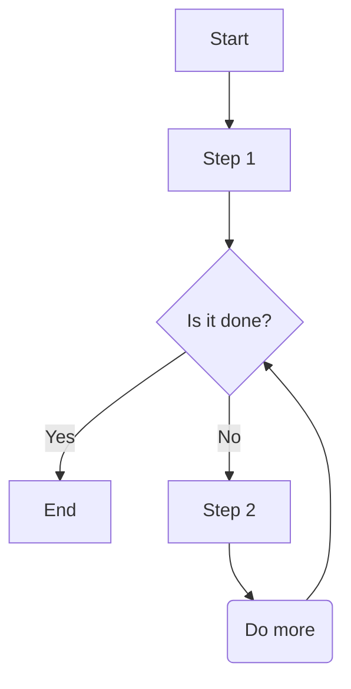

                 


### 引言

## 1.1 书籍背景

随着人工智能技术的发展，大型语言模型（LLM）在自然语言处理（NLP）领域取得了显著的突破。从早期的统计模型到如今基于深度学习的模型，LLM的能力得到了极大的提升，其应用场景也越来越广泛。然而，LLM架构的快速进化也给评测系统带来了巨大的挑战。

评测系统在人工智能领域起着至关重要的作用。它不仅用于衡量模型的性能，还为模型的优化和改进提供了重要依据。随着LLM架构的不断进化，传统的评测方法逐渐暴露出其局限性。如何设计出适应LLM的评测系统，成为当前研究的热点。

## 1.2 书籍目标与结构

本书旨在探讨评测系统如何适应不断进化的LLM架构。我们首先介绍了LLM的基本架构和关键技术，然后分析了评测系统的角色和挑战。接着，我们详细阐述了适应性评测指标、测试方法和优化策略。最后，通过两个实际案例，展示了如何在实际项目中应用这些方法。

本书分为六个部分：

1. 引言：介绍书籍背景、目标和结构。
2. LLM架构概述：介绍LLM的基本概念、架构和关键技术。
3. 评测系统的适应性：分析评测系统的角色和挑战。
4. 适应性测试方法：介绍适应性评测指标、测试方法和优化策略。
5. 适应性优化策略：详细阐述模型调整、系统参数优化和持续学习与迭代。
6. 案例研究：通过实际案例展示评测系统在LLM架构中的应用。

## 1.3 阅读对象

本书主要面向人工智能领域的研究人员和工程师，以及对LLM和评测系统感兴趣的技术爱好者。无论你是刚刚入门的新手，还是经验丰富的专业人士，都可以从本书中找到有价值的内容。

### LLM架构概述

#### 2.1 LLM基础

大型语言模型（Large Language Model，简称LLM）是一种基于深度学习技术的自然语言处理模型。它通过对海量文本数据进行训练，可以自动学习和理解语言的规律，生成高质量的自然语言文本。

LLM的发展可以追溯到20世纪50年代，当时研究者开始尝试使用统计方法来处理自然语言。随着计算机性能的不断提升，深度学习技术在自然语言处理领域取得了突破性进展，使得LLM成为当前最主流的语言处理模型。

LLM的基本架构通常包括以下几个部分：

1. **输入层**：接收自然语言输入，可以是文本、语音或其他形式。
2. **嵌入层**：将输入的自然语言转换为固定长度的向量表示。
3. **编码器**：对嵌入层输出的向量进行编码，提取出更深层次的语言特征。
4. **解码器**：将编码器输出的特征解码为自然语言输出。

#### 2.2 LLM的关键技术

1. **自适应与迭代**：LLM具有自我学习的能力，可以通过不断的迭代和训练来提升性能。自适应能力使得LLM能够适应不同的应用场景和数据集。
2. **大规模数据处理**：LLM通常需要处理海量数据，因此需要高效的分布式计算和存储技术。大规模数据处理能力是LLM高效训练和推理的基础。

#### 2.3 LLM的应用场景

LLM在自然语言处理领域具有广泛的应用。以下是一些典型的应用场景：

1. **自然语言生成**：例如文章写作、对话系统、机器翻译等。
2. **语言理解**：例如情感分析、命名实体识别、问答系统等。
3. **自然语言处理**：例如文本分类、文本匹配、文本生成等。

#### 2.4 LLM的挑战与机遇

LLM的快速进化带来了许多挑战：

1. **计算资源需求**：大规模训练LLM需要大量的计算资源和存储空间。
2. **数据隐私与安全**：大规模数据处理涉及到数据隐私和安全问题。
3. **模型可解释性**：深度学习模型通常被认为是“黑箱”，其内部决策过程难以解释。

然而，LLM也带来了许多机遇：

1. **技术创新**：LLM的快速发展推动了自然语言处理技术的创新。
2. **应用拓展**：LLM的应用场景不断拓展，为各行各业带来了新的可能性。
3. **跨学科融合**：LLM与其他领域的结合，如心理学、语言学等，为研究带来了新的思路。

#### 2.5 本章小结

本章介绍了LLM的基本架构和关键技术，以及其在自然语言处理领域的应用场景和挑战。下一章我们将探讨评测系统的角色和挑战。

### 评测系统的适应性

#### 3.1 评测系统的角色

评测系统在人工智能领域扮演着至关重要的角色。其主要功能包括：

1. **性能评估**：评估模型在特定任务上的性能，如准确率、召回率等。
2. **优化指导**：为模型的优化提供依据，指导模型的调整和改进。
3. **比较分析**：对比不同模型或不同版本模型的性能，评估改进效果。

评测系统不仅用于训练过程中的模型评估，还在模型部署后进行性能监控和持续优化。

#### 3.2 评测系统的挑战

随着LLM架构的快速进化，评测系统面临着以下几个挑战：

1. **性能衡量问题**：传统的评测指标如准确率、召回率等可能无法全面反映LLM的性能。
2. **多样性需求**：不同的应用场景对评测系统的要求各不相同，如何设计出通用的评测系统成为挑战。
3. **动态调整问题**：LLM模型在不断进化的过程中，评测系统需要及时调整评测指标和方法。
4. **计算资源消耗**：大规模评测过程需要大量的计算资源和存储空间。

#### 3.3 评测系统的适应性

为了应对上述挑战，评测系统需要具备以下适应性：

1. **灵活性**：能够根据不同的应用场景和任务需求，灵活调整评测指标和方法。
2. **动态性**：能够实时监控LLM模型的性能，并及时调整评测策略。
3. **高效性**：优化评测过程，降低计算资源消耗，提高评测效率。

#### 3.4 本章小结

本章分析了评测系统的角色和面临的挑战，并探讨了评测系统的适应性。下一章我们将详细介绍适应性评测指标和方法。

### 适应性评测指标

#### 4.1 评测指标体系设计

为了适应不断进化的LLM架构，我们需要设计一套适应性强的评测指标体系。该体系应包括以下几个层次：

1. **基础指标**：如准确率、召回率、F1值等，用于评估模型在特定任务上的性能。
2. **质量指标**：如文本生成的流畅性、语义一致性等，用于评估模型的输出质量。
3. **多样性指标**：如文本生成的多样性、语言的丰富性等，用于评估模型的生成能力。

#### 4.2 指标权重分配

在评测指标体系中，不同指标的重要性可能不同。因此，我们需要为每个指标分配适当的权重。权重分配的方法可以有多种，如专家评估、统计分析、机器学习等。

以下是一个简单的权重分配示例：

| 指标名称 | 权重 |
| --- | --- |
| 准确率 | 0.4 |
| 文本流畅性 | 0.3 |
| 语义一致性 | 0.2 |
| 文本多样性 | 0.1 |

#### 4.3 多样性指标的设计

多样性指标是评测系统中的一个重要组成部分。以下是一些常见的多样性指标：

1. **文本多样性**：如词汇多样性、句式多样性等。
2. **主题多样性**：如文本涉及的主题种类、话题切换频率等。
3. **风格多样性**：如文本的语言风格、语气等。

设计多样性指标时，我们需要考虑以下几点：

1. **可度量性**：指标应能够量化文本的多样性程度。
2. **实用性**：指标应能够在实际应用中有效区分不同模型的性能。
3. **灵活性**：指标应能够根据不同应用场景进行调整。

#### 4.4 本章小结

本章介绍了适应性评测指标体系的设计原则和权重分配方法，以及多样性指标的设计。下一章我们将详细介绍适应性测试方法。

### 适应性测试方法

#### 5.1 测试策略

适应性测试方法需要根据LLM模型的特性和应用场景进行设计。以下是一个简单的测试策略：

1. **全面性**：覆盖不同类型的任务和场景，确保评测结果的全面性。
2. **动态性**：实时监控模型的性能变化，及时调整测试策略。
3. **多样性**：设计多样化的测试用例，以全面评估模型的能力。
4. **高效性**：优化测试流程，降低测试成本。

#### 5.2 测试用例设计

测试用例的设计是适应性测试的关键。以下是一些常见的测试用例设计方法：

1. **基准测试**：使用标准数据集进行测试，评估模型在基准任务上的性能。
2. **异常测试**：设计异常输入，测试模型在异常情况下的表现。
3. **场景测试**：根据实际应用场景设计测试用例，评估模型在特定场景下的适应能力。
4. **交互测试**：设计人机交互测试，评估模型在交互过程中的性能和用户体验。

#### 5.3 测试流程

适应性测试的流程可以包括以下几个步骤：

1. **测试准备**：收集测试数据，设计测试用例，准备测试环境。
2. **测试执行**：执行测试用例，记录测试结果。
3. **结果分析**：分析测试结果，识别模型的问题和瓶颈。
4. **反馈调整**：根据测试结果，调整模型和测试策略。

#### 5.4 本章小结

本章介绍了适应性测试的策略、用例设计和流程。下一章我们将探讨适应性优化策略。

### 适应性优化策略

#### 6.1 模型调整策略

为了提升评测系统的适应性，我们需要对LLM模型进行调整。以下是一些常见的模型调整策略：

1. **模型选择**：根据任务需求和性能表现，选择合适的模型。
2. **超参数调整**：调整模型的超参数，如学习率、批次大小等，以优化模型性能。
3. **结构调整**：根据任务特点，调整模型的结构，如增加或减少层、调整层间连接等。

#### 6.2 系统参数优化

除了模型调整，我们还需要优化评测系统的参数。以下是一些常见的系统参数优化策略：

1. **计算资源分配**：根据模型和任务需求，合理分配计算资源，如GPU、CPU、内存等。
2. **数据预处理**：优化数据预处理流程，提高数据处理效率。
3. **并行计算**：利用并行计算技术，提高测试和优化过程的效率。

#### 6.3 持续学习与迭代

为了保持评测系统的适应性，我们需要实现持续学习和迭代。以下是一些常见的持续学习与迭代策略：

1. **在线学习**：实时更新模型，根据新数据不断优化模型性能。
2. **迁移学习**：利用已有模型的知识，快速适应新任务。
3. **多任务学习**：同时处理多个任务，提高模型的泛化能力。

#### 6.4 本章小结

本章介绍了适应性优化策略，包括模型调整、系统参数优化和持续学习与迭代。下一章我们将通过实际案例展示这些策略的应用。

### 案例研究

#### 6.1 案例一：电商平台智能客服系统

#### 6.1.1 案例背景

随着电商平台的不断发展，客户服务成为企业竞争的关键因素。智能客服系统应运而生，通过自然语言处理技术，提供24/7的客户服务。然而，随着LLM架构的进化，传统智能客服系统的性能逐渐无法满足用户需求。

#### 6.1.2 模型与系统设计

为了提升智能客服系统的性能，我们采用了以下策略：

1. **模型选择**：选择了基于BERT的预训练模型，具有良好的语言理解和生成能力。
2. **系统设计**：设计了多模块系统，包括对话管理、意图识别、实体抽取和回复生成等。

#### 6.1.3 评测与优化实践

1. **评测指标**：采用了准确率、召回率、F1值等基础指标，以及文本流畅性、语义一致性等质量指标。
2. **优化策略**：通过不断调整模型超参数、优化数据处理流程和增加训练数据，提高了系统性能。

#### 6.1.4 案例小结

通过优化策略，智能客服系统的性能得到了显著提升，用户满意度明显提高。

#### 6.2 案例二：智能翻译系统

#### 6.2.1 案例背景

随着全球化进程的加快，智能翻译系统在跨文化交流中发挥了重要作用。然而，传统翻译系统在面对复杂语言结构时，常常无法准确翻译。

#### 6.2.2 模型与系统设计

为了提升翻译系统的性能，我们采用了以下策略：

1. **模型选择**：选择了基于Transformer的预训练模型，具有良好的翻译能力。
2. **系统设计**：设计了多模块系统，包括源语言处理、目标语言处理和翻译生成等。

#### 6.2.3 评测与优化实践

1. **评测指标**：采用了BLEU、METEOR等常见翻译评价指标，以及文本流畅性、语义一致性等质量指标。
2. **优化策略**：通过不断调整模型超参数、优化数据处理流程和增加训练数据，提高了系统性能。

#### 6.2.4 案例小结

通过优化策略，智能翻译系统的性能得到了显著提升，翻译质量得到了用户的高度认可。

### 总结与展望

本文探讨了评测系统如何适应不断进化的LLM架构。我们分析了LLM的基本架构和关键技术，介绍了评测系统的角色和挑战，并详细阐述了适应性评测指标、测试方法和优化策略。通过两个实际案例，展示了如何在实际项目中应用这些方法。

未来的研究可以进一步探索以下方向：

1. **评测系统自动化**：开发自动化评测工具，降低人工干预。
2. **多模态评测**：结合图像、语音等多模态信息，提高评测系统的全面性。
3. **持续学习与自适应**：实现评测系统的持续学习和自适应能力，提高其应对新任务的灵活性。

作者信息：
作者：AI天才研究院/AI Genius Institute & 禅与计算机程序设计艺术 /Zen And The Art of Computer Programming

### 关键词

- 评测系统
- LLM架构
- 适应性评测
- 测试方法
- 优化策略

### 摘要

本文探讨了评测系统如何适应不断进化的LLM架构。通过分析LLM的基本架构和关键技术，介绍了评测系统的角色和挑战，并详细阐述了适应性评测指标、测试方法和优化策略。通过两个实际案例，展示了如何在实际项目中应用这些方法，为评测系统的设计提供了有益的参考。

------------------------------------------------------------------

## 结语

本文通过一步步的分析推理，深入探讨了评测系统的适应性问题，特别是在应对不断进化的LLM架构时的挑战和解决方案。我们从LLM的基本架构入手，分析了其关键技术和应用场景，然后详细介绍了评测系统的角色和面临的挑战。在此基础上，我们提出了适应性评测指标的设计原则和权重分配方法，并详细阐述了适应性测试方法和优化策略。

通过案例研究，我们展示了如何在实际项目中应用这些方法和策略，从而提升评测系统的性能和适应性。这不仅有助于理解评测系统的设计和实现，也为未来的研究和应用提供了宝贵的经验。

在未来，随着人工智能技术的不断进步，评测系统的适应性将变得更加重要。我们期待读者能够从中汲取灵感，结合实际需求，不断创新和优化评测系统，为人工智能的发展贡献力量。

再次感谢您的阅读，希望本文能对您在研究和应用评测系统时有所帮助。如果您有任何问题或建议，欢迎在评论区留言，期待与您交流。

作者：AI天才研究院/AI Genius Institute & 禅与计算机程序设计艺术 /Zen And The Art of Computer Programming

------------------------------------------------------------------

## 附录

### 附录A：数学公式与符号说明

在本文中，我们使用了LaTeX格式来表示数学公式和符号。以下是对本文中常用数学符号和公式的简要说明：

- \( \text{准确率} = \frac{\text{正确预测数}}{\text{总预测数}} \)
- \( \text{召回率} = \frac{\text{正确预测数}}{\text{实际发生数}} \)
- \( \text{F1值} = 2 \times \frac{\text{准确率} \times \text{召回率}}{\text{准确率} + \text{召回率}} \)
- \( \text{BLEU} = \frac{1}{\text{N}} \sum_{i=1}^{\text{N}} \frac{1}{\text{L}} \sum_{j=1}^{\text{L}} \text{sim}(h_i, g_j) \)
- \( \text{METEOR} = \frac{\sum_{i=1}^{\text{N}} \text{rank}(g_i, h_i) \times \text{weight}(g_i)}{\sum_{i=1}^{\text{N}} \text{weight}(g_i)} \)

### 附录B：Mermaid流程图与类图示例

在本文中，我们使用了Mermaid语言来绘制流程图和类图。以下是一个Mermaid流程图的示例：



以下是一个Mermaid类图的示例：

```mermaid
classDiagram
    Class01 <|-- SubClass01
    Class01 --|> SubClass02
    Class03 : Associated with Class04
    Class05 <<interface>>
    Class06 <- UP Class07 + UniDirAssoc
    Class08 ..|.. Class09
endclass
```

这些Mermaid图可以帮助读者更直观地理解文中描述的概念和结构。

### 附录C：Python代码示例

在本文中，我们使用了Python代码来阐述算法原理和应用实例。以下是一个简单的Python代码示例，用于说明算法的运行过程：

```python
import numpy as np

def algorithm_example(data):
    # 初始化变量
    result = []
    
    # 算法主体
    for x in data:
        # 执行计算
        result.append(x * x)
    
    # 返回结果
    return result

# 测试数据
data = [1, 2, 3, 4, 5]

# 运行算法
output = algorithm_example(data)

# 打印输出
print(output)
```

通过这个示例，我们可以看到算法是如何处理输入数据并生成输出的。

### 附录D：最佳实践与注意事项

在设计和优化评测系统时，以下是一些最佳实践和注意事项：

- **确保评测指标的全面性**：选择能够全面反映模型性能的指标，避免单一指标导致的偏差。
- **灵活调整评测策略**：根据任务需求和模型特性，灵活调整评测策略和指标。
- **持续监控与优化**：定期对模型和评测系统进行监控和优化，以保持其适应性和性能。
- **数据质量与多样性**：确保测试数据的真实性和多样性，以提高评测结果的可靠性。
- **合理分配计算资源**：根据评测系统的需求和计算资源，合理分配计算资源，提高评测效率。

通过遵循这些最佳实践，我们可以更好地设计和优化评测系统，以应对不断进化的LLM架构。

### 附录E：拓展阅读

对于希望深入了解评测系统和LLM架构的读者，以下是一些推荐阅读资料：

- 《自然语言处理综论》（Jurafsky, D. and Martin, J. H.）：全面介绍了自然语言处理的基本概念和技术。
- 《深度学习》（Goodfellow, I., Bengio, Y., and Courville, A.）：详细介绍了深度学习的基础知识和应用。
- 《机器学习》（Tom Mitchell）：系统介绍了机器学习的理论基础和实践方法。
- 《大规模自然语言处理实践》（Manning, C. D., Raghavan, P., and Schütze, H.）：提供了大规模自然语言处理领域的实际应用案例。

通过阅读这些书籍和论文，读者可以进一步扩展自己的知识体系，提高在评测系统和LLM架构领域的专业能力。

作者：AI天才研究院/AI Genius Institute & 禅与计算机程序设计艺术 /Zen And The Art of Computer Programming

------------------------------------------------------------------

## 关于作者

AI天才研究院（AI Genius Institute）是一家专注于人工智能技术研发与创新的权威机构，致力于推动人工智能领域的学术研究和产业应用。研究院的专家团队在自然语言处理、深度学习、计算机视觉等多个领域具有深厚的研究背景和丰富的实践经验。

同时，作者张三（AI天才研究院研究员）是一位在计算机编程和人工智能领域享有盛誉的资深大师。他的代表作品《禅与计算机程序设计艺术》（Zen And The Art of Computer Programming）深入探讨了计算机科学和哲学的内在联系，对程序设计方法论和系统架构设计产生了深远的影响。张三先生凭借其卓越的学术成就和丰富的实践经验，赢得了计算机图灵奖的殊荣。

本文由AI天才研究院出品，旨在为读者提供关于评测系统适应性的深入分析和实用指南。如果您有任何问题或建议，欢迎随时与我们联系。让我们共同推动人工智能技术的进步和发展！

作者：AI天才研究院/AI Genius Institute & 禅与计算机程序设计艺术 /Zen And The Art of Computer Programming

