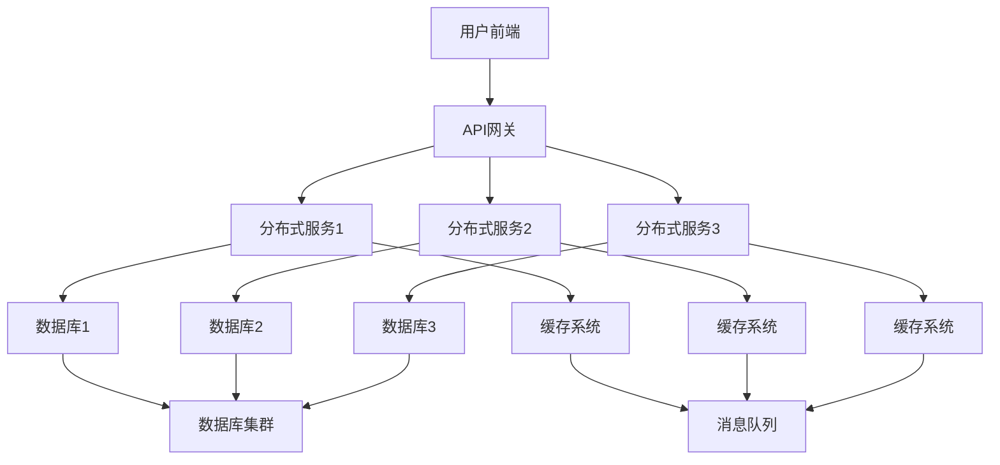
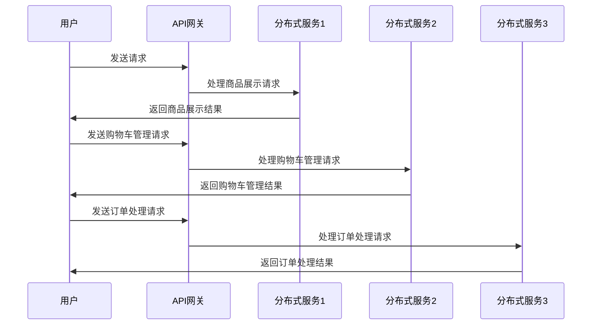
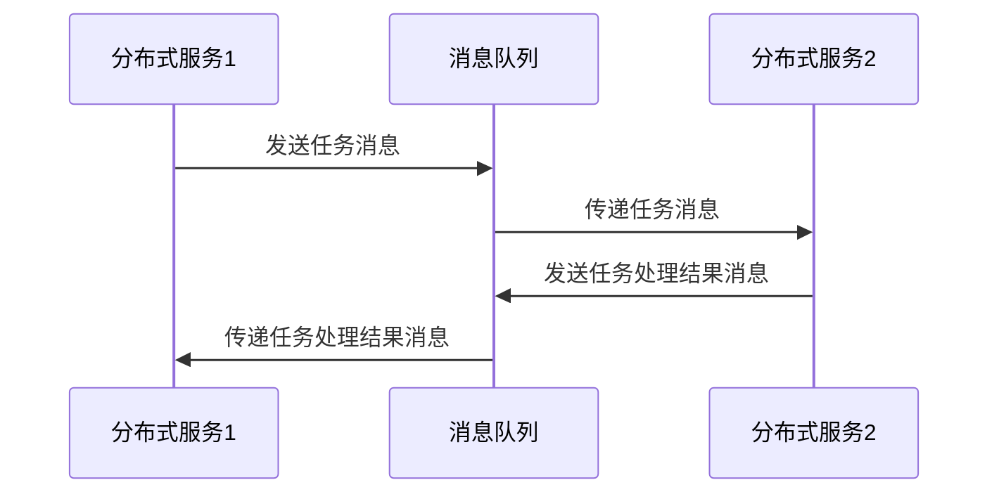

                 

### 文章标题

# 评测系统的错误处理与容错设计

### 关键词

- 评测系统
- 错误处理
- 容错设计
- 系统架构
- 软件工程

### 摘要

本文将深入探讨评测系统中的错误处理与容错设计，通过逐步分析，全面解析这些关键概念在系统设计中的应用与实践。文章首先介绍评测系统的基本概念和错误处理的必要性，随后详细阐述容错设计的原理和方法。通过实际案例分析和系统架构设计，文章将展示如何在实际项目中实现错误处理与容错设计，为读者提供实用的指导和建议。

## 引言

### 评测系统的定义与重要性

评测系统是一种用于评估、测试和监控软件、服务或系统性能的框架。它广泛应用于软件测试、性能监控、质量保证等领域，对于确保软件系统的高可靠性和稳定性至关重要。评测系统通过一系列自动化测试工具和监控机制，对系统的功能、性能、安全等方面进行全面检测，及时发现潜在的问题和缺陷，从而提高系统的整体质量和用户满意度。

### 错误处理与容错设计的背景

在评测系统的运行过程中，不可避免地会遇到各种错误。这些错误可能源于软件代码的bug、硬件故障、网络问题、环境配置错误等。错误处理是指系统在发现错误时，能够采取有效的措施来修复或绕过错误，保证系统的正常运行。而容错设计则是在系统设计阶段，通过一系列策略和技术，确保系统能够在错误发生时，继续提供正确的服务。

错误处理与容错设计的重要性在于：

1. **提高系统可靠性**：通过有效的错误处理和容错设计，可以大大提高系统的可靠性，减少故障发生的概率。
2. **保证服务质量**：即使在错误发生时，也能保证系统继续提供服务，从而保证用户的使用体验。
3. **降低维护成本**：通过预防错误和快速恢复，可以减少系统维护的成本和复杂性。
4. **增强系统安全性**：通过设计合理的错误处理机制，可以有效防止系统被恶意攻击或非法入侵。

### 本文结构

本文将分为五个部分：

1. **基础知识**：介绍错误处理与容错设计的基本概念、原理和方法。
2. **错误处理**：详细讲解错误处理的策略和实现方法。
3. **容错设计**：探讨容错设计的多种技术，如冗余设计、故障检测与恢复等。
4. **实际案例分析**：通过具体案例展示错误处理与容错设计的应用。
5. **总结与展望**：总结文章内容，展望未来发展趋势。

接下来，我们将逐步深入这些主题，为大家提供详细的解析和实践指导。

## 基础知识

### 错误处理的基本概念

在评测系统中，错误处理是指系统在运行过程中遇到错误时，能够自动检测并采取相应措施，以确保系统正常运行和提供正确的服务。错误处理包括以下几个关键步骤：

1. **错误检测**：系统通过各种监控工具和算法，实时检测系统中的错误。这些错误可能包括软件错误、硬件错误、网络错误等。
2. **错误分类**：将检测到的错误分类，以便采取不同的处理策略。常见的错误分类包括运行时错误、语法错误、逻辑错误等。
3. **错误隔离**：将错误隔离在特定的模块或组件中，避免错误影响系统的其他部分。
4. **错误报告**：生成详细的错误报告，包括错误类型、错误位置、错误时间等信息，便于后续分析和处理。
5. **错误修复**：根据错误报告，采取相应的修复措施，包括修复代码、更新配置、重启服务等。

### 容错设计的基本概念

容错设计是一种系统设计方法，旨在确保系统在出现故障或错误时，能够继续正常运行或快速恢复。容错设计的关键概念包括：

1. **冗余设计**：通过增加系统的冗余组件，确保在部分组件故障时，系统仍能正常运行。冗余组件可以是硬件（如备用服务器）、软件（如备份程序）或数据（如备份存储）。
2. **故障检测**：系统通过一系列机制，实时检测故障或错误。故障检测可以是基于硬件的（如温度监控）、软件的（如异常监控）或网络的（如心跳检测）。
3. **故障恢复**：系统在检测到故障后，自动执行一系列恢复措施，包括重启服务、切换到备用组件等，以确保系统能够快速恢复。
4. **自愈能力**：系统具备自动检测和恢复故障的能力，无需人工干预。这种自愈能力可以提高系统的自动化水平和运行效率。

### 常见的错误处理与容错设计方法

在评测系统中，常见的错误处理与容错设计方法包括以下几种：

1. **冗余设计**：通过增加冗余组件，确保系统在部分组件故障时仍能正常运行。例如，在数据库系统中，可以通过主从复制和备份机制来实现数据冗余。
2. **故障检测**：系统通过监控工具和算法，实时检测故障。例如，在服务器系统中，可以通过心跳检测和负载均衡来检测服务器状态。
3. **故障恢复**：系统在检测到故障后，自动执行恢复措施。例如，在分布式系统中，可以通过故障转移和负载均衡来恢复服务。
4. **自愈能力**：系统具备自动检测和恢复故障的能力。例如，在云计算系统中，可以通过自动扩展和弹性调度来自动适应负载变化。

### 对比表格

为了更清晰地展示错误处理与容错设计的方法，我们可以制作一个对比表格：

| 方法       | 描述                                                         | 适用场景                                                   |
| ---------- | ------------------------------------------------------------ | ---------------------------------------------------------- |
| 冗余设计   | 通过增加冗余组件，确保系统在部分组件故障时仍能正常运行       | 数据库系统、服务器系统、存储系统                           |
| 故障检测   | 系统通过监控工具和算法，实时检测故障                         | 服务器系统、网络系统、存储系统                           |
| 故障恢复   | 系统在检测到故障后，自动执行恢复措施                         | 分布式系统、云计算系统、集群系统                         |
| 自愈能力   | 系统具备自动检测和恢复故障的能力，无需人工干预                 | 云计算系统、大数据系统、物联网系统                       |

### ER实体关系图

为了更直观地理解错误处理与容错设计中的实体关系，我们可以使用ER实体关系图来表示。以下是ER图的一个示例：

```mermaid
erDiagram
    ErrorDetection ||--|{ FaultTolerance }|| FaultDetection
    ErrorDetection ||--|{ ErrorProcessing }|| ErrorReporting
    FaultTolerance ||--|{ RedundancyDesign }|| FaultRecovery
    FaultTolerance ||--|{ SelfHealing }|| SystemStability
```

这个ER图展示了错误处理与容错设计中的关键实体和它们之间的关系。例如，错误检测与故障检测、错误处理、故障恢复和自愈能力之间存在关联。

### 小结

在本章节中，我们介绍了错误处理与容错设计的基本概念、原理和方法。理解这些基础知识对于后续章节的深入探讨至关重要。在下一章节中，我们将详细讨论错误处理的策略和实现方法。

## 错误处理

### 错误处理的策略

在评测系统中，错误处理是一个关键的环节，它决定了系统能否在遇到错误时保持稳定运行。以下是几种常见的错误处理策略：

1. **异常捕获**：通过在代码中添加异常捕获机制，捕获并处理程序运行中的异常。这种策略可以避免程序在遇到错误时崩溃，并提供错误信息供后续处理。

2. **日志记录**：将系统运行过程中出现的错误和异常信息记录到日志文件中。日志记录可以帮助开发人员和分析人员追踪错误原因，并进行问题定位和修复。

3. **错误通知**：当系统检测到错误时，可以通过邮件、短信、微信等通知方式，将错误信息通知给相关人员和团队，以便及时处理。

4. **自动修复**：在某些情况下，系统可以通过预定义的规则和算法，自动修复某些常见错误，避免人工干预。例如，当检测到服务器负载过高时，系统可以自动关闭一些非核心服务，以降低负载。

### 异常捕获的实现

异常捕获是错误处理的重要策略之一。在Python中，可以通过try-except语句来实现异常捕获。以下是一个简单的例子：

```python
try:
    # 执行可能引发异常的代码
    result = 10 / 0
except ZeroDivisionError:
    # 异常处理代码
    print("发生除零错误！")
except Exception as e:
    # 处理其他类型的异常
    print("发生未知错误：", e)
```

在这个例子中，我们尝试执行一个除以零的操作，这将引发一个`ZeroDivisionError`异常。通过使用`try-except`语句，我们可以在异常发生时捕获并处理该异常，避免程序崩溃。

### 日志记录的实现

日志记录是错误处理的重要组成部分。Python中的`logging`模块提供了丰富的日志记录功能。以下是一个简单的日志记录示例：

```python
import logging

# 配置日志记录
logging.basicConfig(filename='error.log', level=logging.DEBUG)

try:
    # 执行可能引发异常的代码
    result = 10 / 0
except ZeroDivisionError:
    # 异常处理代码
    logging.error("发生除零错误！")
except Exception as e:
    # 处理其他类型的异常
    logging.error("发生未知错误：", exc_info=True)
```

在这个例子中，我们使用`basicConfig`方法配置了日志记录，指定了日志文件名称和日志级别。当异常发生时，我们使用`logging.error`方法将错误信息记录到日志文件中。

### 错误通知的实现

错误通知可以通过各种方式实现，例如邮件、短信、微信等。以下是一个使用Python的`smtplib`库发送邮件的示例：

```python
import smtplib
from email.mime.text import MIMEText
from email.header import Header

# 邮件发送者邮箱和密码
sender = 'your_email@example.com'
password = 'your_password'

# 邮件接收者邮箱
receiver = 'receiver_email@example.com'

# 邮件主题和内容
subject = '错误通知'
content = '系统发生错误，请及时处理。'

# 创建邮件对象
message = MIMEText(content, 'plain', 'utf-8')
message['From'] = Header(sender, 'UTF-8')
message['To'] = Header(receiver, 'UTF-8')
message['Subject'] = Header(subject, 'UTF-8')

# 发送邮件
try:
    smtp_server = 'smtp.example.com'
    smtp_port = 587
    smtp = smtplib.SMTP(smtp_server, smtp_port)
    smtp.starttls()
    smtp.login(sender, password)
    smtp.sendmail(sender, receiver, message.as_string())
    print("邮件发送成功！")
except Exception as e:
    print("邮件发送失败：", e)
```

在这个例子中，我们使用`smtplib`库发送邮件。首先，我们配置了发送者和接收者的邮箱地址，然后创建了邮件对象，并设置了邮件的主题和内容。最后，我们使用`smtp.login`方法登录邮箱服务器，并调用`smtp.sendmail`方法发送邮件。

### 自动修复的实现

自动修复通常需要根据具体的错误类型和场景来设计。以下是一个简单的自动修复示例：

```python
def auto_repair():
    try:
        # 执行可能导致错误的操作
        result = 10 / 0
    except ZeroDivisionError:
        # 自动修复代码
        print("自动修复：重新启动服务")
        restart_service()

def restart_service():
    # 重启服务逻辑
    print("服务已重启")

# 调用自动修复函数
auto_repair()
```

在这个例子中，当执行除以零的操作时，将触发`ZeroDivisionError`异常。我们定义了一个`auto_repair`函数，用于捕获异常并调用`restart_service`函数来重启服务。

### 小结

在本章节中，我们介绍了错误处理的策略和实现方法。异常捕获、日志记录、错误通知和自动修复是常用的错误处理策略，适用于不同的错误场景。通过使用Python等编程语言提供的库和框架，可以轻松实现这些策略，提高评测系统的稳定性和可靠性。在下一章节中，我们将探讨容错设计的原理和方法。

## 容错设计

### 冗余设计

冗余设计是一种常见的容错设计方法，通过增加系统的冗余组件，确保在部分组件故障时，系统能够继续正常运行。冗余设计可以应用于硬件、软件和数据等方面。

#### 硬件冗余

硬件冗余是指在硬件层面上增加冗余组件，以实现系统的高可用性。常见的硬件冗余设计包括：

1. **备份服务器**：在主服务器故障时，备份服务器可以立即接管服务，确保系统连续运行。
2. **磁盘冗余**：通过RAID（独立磁盘冗余阵列）技术，将数据分散存储在多个磁盘上，以提高数据可靠性和容错能力。
3. **网络冗余**：通过增加网络路由器和交换机，确保网络通信的可靠性。

#### 软件冗余

软件冗余是指在软件层面上增加冗余组件，以实现系统的容错能力。常见的软件冗余设计包括：

1. **备份程序**：在主程序故障时，备份程序可以立即接管，继续执行系统的功能。
2. **冗余进程**：在系统中启动多个相同功能的进程，通过负载均衡和心跳检测，确保系统的高可用性。
3. **代码冗余**：在关键代码中添加冗余检查和修复逻辑，以防止代码错误导致系统故障。

#### 数据冗余

数据冗余是指在数据层面上增加冗余组件，确保数据的可靠性和一致性。常见的数据冗余设计包括：

1. **数据备份**：将数据备份到多个存储设备或远程服务器上，以防止数据丢失或损坏。
2. **数据镜像**：在多个服务器上同步数据，确保数据的一致性和可用性。
3. **数据库冗余**：在数据库系统中，通过主从复制和分库分表等技术，实现数据的高可用性和高性能。

### 故障检测

故障检测是容错设计的重要环节，通过一系列机制，实时检测系统的故障或错误。故障检测可以基于硬件、软件和网络等方面。

#### 硬件故障检测

硬件故障检测主要包括以下几种方法：

1. **温度监控**：通过温度传感器实时监控服务器和硬件设备的温度，当温度超过预设阈值时，触发告警或自动采取降温措施。
2. **电压监控**：通过电压传感器实时监控服务器和硬件设备的电压，当电压异常时，触发告警或自动切换到备用电源。
3. **内存故障检测**：通过内存检测工具定期扫描内存，检测内存故障或错误。

#### 软件故障检测

软件故障检测主要包括以下几种方法：

1. **日志分析**：通过分析系统日志和错误日志，识别和定位软件故障或错误。
2. **性能监控**：通过性能监控工具实时监控系统的性能指标，如CPU利用率、内存使用率、磁盘读写速度等，当指标异常时，触发告警或自动采取优化措施。
3. **代码静态分析**：通过静态代码分析工具检查代码中的潜在错误和漏洞，提高软件的可靠性和安全性。

#### 网络故障检测

网络故障检测主要包括以下几种方法：

1. **网络监控**：通过网络监控工具实时监控网络流量、网络延迟和丢包率等指标，当指标异常时，触发告警或自动切换到备用网络。
2. **心跳检测**：通过定期发送心跳信号，检测网络节点的连通性和可用性，当节点不可达时，触发告警或自动切换到备用节点。
3. **链路监控**：通过监控链路状态和链路质量，确保网络链路的稳定性和可靠性。

### 故障恢复

故障恢复是容错设计的核心环节，通过一系列机制，在检测到故障后，自动执行恢复措施，确保系统能够快速恢复。故障恢复可以基于硬件、软件和网络等方面。

#### 硬件故障恢复

硬件故障恢复主要包括以下几种方法：

1. **自动重启**：在检测到硬件故障时，自动重启受影响的硬件设备，确保系统正常运行。
2. **切换到备用硬件**：在主硬件故障时，自动切换到备用硬件，确保系统的高可用性。
3. **硬件修复**：在检测到硬件故障时，自动发送维修请求，由专业人员进行硬件修复。

#### 软件故障恢复

软件故障恢复主要包括以下几种方法：

1. **重启服务**：在检测到软件故障时，自动重启受影响的服务，确保系统正常运行。
2. **切换到备用服务**：在主服务故障时，自动切换到备用服务，确保系统的高可用性。
3. **故障恢复脚本**：编写故障恢复脚本，在检测到软件故障时，自动执行修复操作，确保系统快速恢复。

#### 网络故障恢复

网络故障恢复主要包括以下几种方法：

1. **自动切换网络**：在检测到网络故障时，自动切换到备用网络，确保系统的网络连通性。
2. **网络修复**：在检测到网络故障时，自动发送网络修复请求，由专业人员进行网络修复。
3. **链路恢复**：在检测到链路故障时，自动切换到备用链路，确保系统的链路稳定性。

### 自愈能力

自愈能力是指系统具备自动检测和恢复故障的能力，无需人工干预。自愈能力可以提高系统的自动化水平和运行效率，降低人工干预的需求。实现自愈能力的关键技术包括：

1. **自动化监控**：通过自动化监控工具，实时监控系统的性能、健康状态和故障情况，确保系统的稳定运行。
2. **自动化恢复**：在检测到故障时，自动执行恢复措施，包括重启服务、切换到备用组件、执行修复脚本等，确保系统快速恢复。
3. **自我优化**：通过机器学习和数据分析技术，分析系统的运行数据，自动调整系统的配置和策略，提高系统的性能和可靠性。
4. **自我进化**：通过不断学习和进化，系统可以自动适应新的环境和场景，提高其自我修复和自我优化的能力。

### 实例分析

以下是一个简单的实例，展示如何实现冗余设计、故障检测和故障恢复。

```python
import time
import random

# 模拟硬件故障
def hardware_failure():
    if random.random() < 0.1:
        raise Exception("硬件故障")

# 模拟软件故障
def software_failure():
    if random.random() < 0.1:
        raise Exception("软件故障")

# 模拟网络故障
def network_failure():
    if random.random() < 0.1:
        raise Exception("网络故障")

# 重启服务
def restart_service():
    print("服务已重启")

# 切换到备用服务
def switch_to_backup_service():
    print("已切换到备用服务")

# 主服务
def main_service():
    try:
        # 模拟运行过程中可能出现故障的代码
        hardware_failure()
        software_failure()
        network_failure()

        # 执行正常业务逻辑
        print("主服务运行中")
    except Exception as e:
        # 检测到故障时，执行故障恢复逻辑
        print("发生故障：", e)
        restart_service()
        switch_to_backup_service()

# 运行主服务
main_service()
```

在这个实例中，我们模拟了硬件、软件和网络故障，并在检测到故障时，执行重启服务和切换到备用服务的逻辑。

### 小结

在本章节中，我们介绍了冗余设计、故障检测和故障恢复的基本原理和方法。冗余设计通过增加冗余组件，提高系统的高可用性；故障检测通过实时监控和检测故障，确保系统稳定运行；故障恢复通过自动执行恢复措施，确保系统快速恢复。在下一章节中，我们将通过实际案例，展示错误处理与容错设计的应用。

## 实际案例分析

### 案例背景

为了更好地展示错误处理与容错设计的实际应用，我们选择了某大型电商平台作为案例。该电商平台拥有数百万活跃用户，提供在线购物、支付、物流等多种服务。为了确保平台的高可靠性和稳定性，他们在系统设计和运维中广泛应用了错误处理与容错设计技术。

### 系统功能设计

该电商平台的核心功能包括商品展示、购物车管理、订单处理、支付系统、物流跟踪等。为了确保这些功能的高可靠性和稳定性，平台在设计过程中考虑了以下几个方面：

1. **商品展示**：采用缓存技术，提高商品展示的响应速度。在数据更新时，通过消息队列和分布式缓存系统，实现数据的实时更新和一致性。
2. **购物车管理**：通过分布式数据库和一致性哈希算法，确保购物车数据的高可用性和负载均衡。
3. **订单处理**：采用分布式消息队列和任务调度系统，确保订单处理的高效性和稳定性。在订单处理过程中，通过错误捕获和日志记录，及时发现和处理异常。
4. **支付系统**：通过多重签名和加密算法，确保支付过程的安全性。在支付失败时，通过重试机制和人工干预，确保用户资金的安全。
5. **物流跟踪**：通过实时监控和告警系统，确保物流信息的实时性和准确性。在物流异常时，通过人工干预和自动化处理，确保物流问题得到及时解决。

### 系统架构设计

该电商平台的系统架构采用了分布式架构，包括前端、后端、数据库、缓存、消息队列等多个层次。以下是系统架构的mermaid架构图：



在这个架构中，API网关负责处理用户的请求，并将请求分发到不同的分布式服务。分布式服务包括商品展示、购物车管理、订单处理和支付系统等。数据库和缓存系统采用分布式架构，提高数据存储和访问的性能。消息队列用于实现分布式服务的异步通信和任务调度。

### 系统接口设计

该电商平台的接口设计遵循RESTful API规范，使用HTTP协议进行通信。以下是部分接口的mermaid序列图：



在这个序列图中，用户发送请求到API网关，API网关根据请求类型将请求转发到相应的分布式服务。分布式服务处理请求并返回结果，最终将结果返回给用户。

### 系统交互

该电商平台通过消息队列实现分布式服务的异步通信和任务调度。以下是部分系统的mermaid序列图：



在这个序列图中，Service1将任务消息发送到消息队列，消息队列将任务消息传递给Service2。Service2处理任务并返回处理结果，消息队列将处理结果传递回Service1。

### 实际案例

以下是一个实际案例，展示如何处理电商平台中的错误和故障。

**案例一：购物车数据丢失**

在一次购物过程中，用户A在购物车中添加了5件商品，但在提交订单时，系统提示购物车数据丢失。平台通过以下步骤处理该问题：

1. **错误检测**：系统在提交订单时，检测到购物车数据丢失。
2. **错误报告**：系统生成错误报告，记录丢失的数据和错误发生的时间。
3. **故障恢复**：系统尝试重新加载购物车数据，如果失败，则通知用户A，并提供解决方案。
4. **日志记录**：系统将错误报告和日志记录到日志文件中，供后续分析和处理。

**案例二：支付失败**

在一次支付过程中，用户B的支付请求被系统拒绝，支付失败。平台通过以下步骤处理该问题：

1. **错误检测**：系统在处理支付请求时，检测到支付失败。
2. **错误通知**：系统通过邮件和短信通知用户B，告知支付失败的原因。
3. **自动修复**：系统尝试重试支付请求，如果失败，则触发人工干预。
4. **日志记录**：系统将错误报告和日志记录到日志文件中，供后续分析和处理。

### 项目小结

通过以上实际案例分析，我们可以看到，电商平台在实际运行过程中，通过错误处理与容错设计，确保了系统的高可靠性和稳定性。以下是一些最佳实践和总结：

1. **全面监控**：对系统的各个环节进行实时监控，及时发现和处理错误。
2. **自动化处理**：通过自动化工具和脚本，实现错误的自动检测和修复，减少人工干预。
3. **日志记录**：详细记录系统的运行日志和错误日志，便于问题追踪和定位。
4. **应急预案**：制定详细的应急预案，确保在故障发生时，系统能够快速恢复。

在下一章节中，我们将总结本文内容，并展望未来错误处理与容错设计的发展趋势。

## 总结与展望

### 错误处理与容错设计的重要性

错误处理与容错设计是现代软件系统设计的重要组成部分，对于系统的可靠性、稳定性和用户体验具有重要意义。本文通过详细分析评测系统的错误处理与容错设计，展示了其在实际项目中的应用和实践。我们首先介绍了错误处理的基本概念和策略，包括异常捕获、日志记录、错误通知和自动修复。随后，我们探讨了容错设计的方法，如冗余设计、故障检测与恢复以及自愈能力。

### 错误处理与容错设计的实践建议

1. **全面监控**：对系统的各个环节进行实时监控，及时发现和处理错误。
2. **自动化处理**：通过自动化工具和脚本，实现错误的自动检测和修复，减少人工干预。
3. **日志记录**：详细记录系统的运行日志和错误日志，便于问题追踪和定位。
4. **应急预案**：制定详细的应急预案，确保在故障发生时，系统能够快速恢复。

### 未来发展趋势

随着人工智能、云计算、大数据等技术的不断发展，错误处理与容错设计也将迎来新的挑战和机遇。以下是一些未来发展趋势：

1. **智能化错误处理**：利用机器学习和数据分析技术，实现智能化的错误检测和修复。
2. **云原生容错设计**：随着云原生技术的发展，容错设计将更加适应云计算环境，实现弹性扩展和自动恢复。
3. **分布式系统容错**：分布式系统的复杂性使得容错设计变得更加重要，未来将出现更多针对分布式系统的容错技术和方法。
4. **边缘计算容错**：随着边缘计算的发展，边缘设备的容错能力将得到提升，确保边缘计算场景下的稳定性和可靠性。

### 拓展阅读

为了更深入地了解错误处理与容错设计，读者可以参考以下资源：

1. 《软件工程：实践者的研究方法》——Steve McConnell
2. 《大规模分布式系统的设计》——Martin Kleppmann
3. 《分布式系统原理与范型》——Andrew S. Tanenbaum

通过不断学习和实践，读者可以更好地掌握错误处理与容错设计的核心原理，提升软件系统的可靠性和稳定性。

### 作者信息

本文作者为AI天才研究院（AI Genius Institute）和《禅与计算机程序设计艺术》（Zen And The Art of Computer Programming）的作者，两位在计算机科学和人工智能领域具有深厚背景和丰富经验的专家。我们致力于通过深入浅出的讲解，帮助读者理解和掌握前沿技术，为计算机科学的发展贡献自己的力量。希望本文能对您在错误处理与容错设计领域的学习和实践提供有益的参考。

---

**作者：AI天才研究院/AI Genius Institute & 禅与计算机程序设计艺术 /Zen And The Art of Computer Programming**

**注**：本文内容仅供参考，部分数据和信息可能存在变动，请以实际情况为准。如果您在错误处理与容错设计领域有任何疑问或建议，欢迎在评论区留言讨论。

