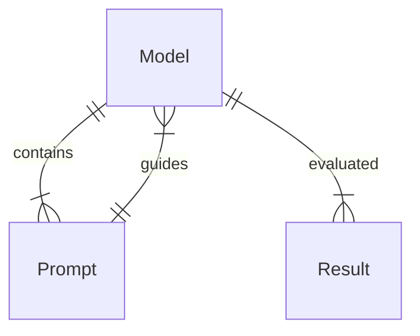
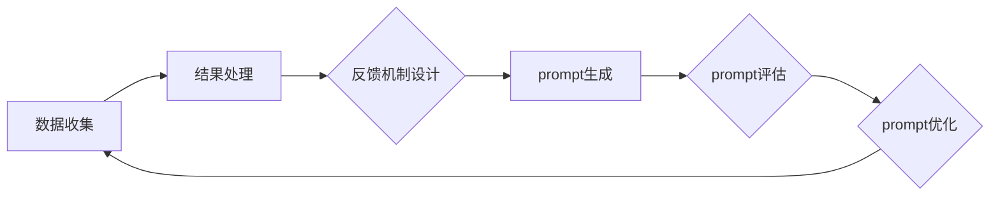
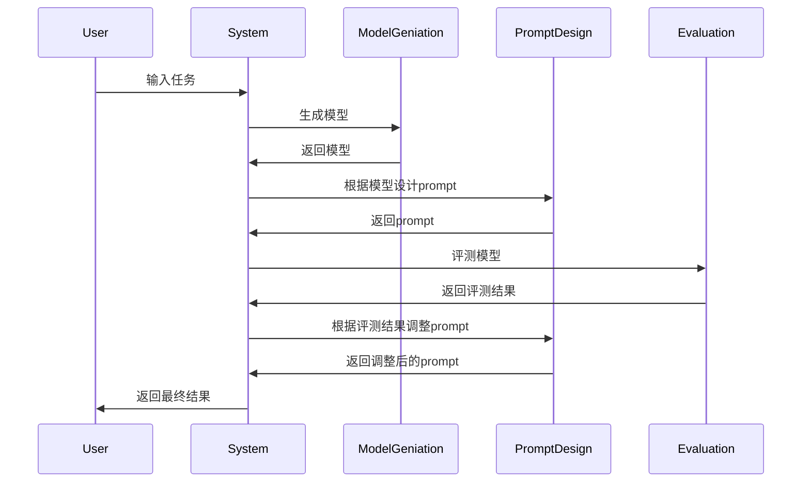

                 

# 评测结果反馈到prompt设计的闭环

## 关键词：评测结果反馈、prompt设计、算法原理、系统架构、项目实战

## 摘要：
本文旨在深入探讨评测结果反馈到prompt设计的闭环机制。文章从背景介绍、核心概念与联系、算法原理讲解、数学模型与公式、系统分析与架构设计、项目实战、最佳实践 tips七个部分展开，系统性地解析了评测结果反馈到prompt设计的过程。通过具体实例和分析，本文旨在为读者提供一个清晰、易懂的技术思路，帮助其在实际项目中有效运用评测结果反馈到prompt设计的闭环机制。

## 引言

### 1.1 评测结果反馈的需求

在现代信息技术的发展过程中，评测结果反馈机制已成为提升系统性能和用户体验的关键环节。评测结果反馈不仅能够帮助开发者了解系统的实际运行情况，还能为后续的优化提供宝贵的数据支持。特别是在人工智能和机器学习领域，评测结果反馈的作用尤为突出。通过对模型输出结果进行评测，我们可以发现模型在预测准确性、鲁棒性等方面的不足，从而进行针对性的改进。

### 1.2 prompt设计的重要性

prompt设计是人工智能和机器学习领域中的一项重要技术。通过设计合适的prompt，我们可以引导模型产生更符合预期的输出。在自然语言处理、图像识别、推荐系统等众多应用场景中，prompt设计都发挥着至关重要的作用。一个优秀的prompt不仅能够提高模型的性能，还能提升用户体验。

### 1.3 评测结果反馈到prompt设计的挑战

尽管评测结果反馈和prompt设计在信息技术领域都有广泛应用，但将二者结合却面临诸多挑战。首先，评测结果的多样性和复杂性使得反馈机制的设计变得困难。其次，prompt设计的多样性和灵活性要求我们能够根据不同的评测结果进行灵活调整。此外，如何在保证性能的同时，确保评测结果反馈和prompt设计之间的高效协同，也是我们需要面对的重要问题。

## 第二部分：核心概念与联系

### 2.1 核心概念解析

#### 2.1.1 评测结果的种类

评测结果可以分为定量和定性两类。定量评测结果通常通过数值来表示模型的性能，如准确率、召回率、F1分数等。定性评测结果则通过文字描述来评估模型的表现，如模型对特定场景的适应性、用户满意度等。

#### 2.1.2 prompt的定义与功能

prompt是一种输入提示，用于引导模型生成预期的输出。在自然语言处理中，prompt通常是一段文本或语句，用于引导模型生成相应的内容。在图像识别中，prompt可以是图像的一部分，用于引导模型识别特定区域。

#### 2.1.3 评测结果与prompt的关联性

评测结果和prompt之间存在密切的关联。评测结果可以用于评估prompt设计的有效性，而prompt则可以影响评测结果的准确性。通过调整prompt，我们可以优化评测结果，从而提升系统的整体性能。

### 2.2 概念属性特征对比

#### 2.2.1 评测结果反馈机制的对比分析

不同的评测结果反馈机制在性能、复杂度和适用范围方面存在差异。例如，基于规则的反馈机制简单直观，但可能无法应对复杂的评测场景。而基于机器学习的反馈机制则能够处理大量的评测数据，但训练过程相对复杂。

#### 2.2.2 prompt设计的优劣比较

prompt设计的优劣取决于应用场景和具体需求。例如，在自然语言处理中，长的、详细的prompt可能更有助于模型生成高质量的内容。而在图像识别中，简短的、针对性的prompt可能更为有效。

### 2.3 ER实体关系图架构

#### 2.3.1 实体与关系的识别

在评测结果反馈到prompt设计的闭环中，实体可以包括评测结果、prompt、模型输出等。关系则可以表示这些实体之间的关联，如评测结果影响prompt设计，prompt影响模型输出等。

#### 2.3.2 ER图在评测结果反馈中的应用

通过ER图，我们可以清晰地展示评测结果反馈到prompt设计的过程，从而为系统设计提供直观的参考。



## 第三部分：算法原理讲解

### 3.1 算法原理概述

#### 3.1.1 评测结果反馈算法的核心步骤

评测结果反馈算法通常包括数据收集、结果处理、反馈机制设计三个核心步骤。通过这三个步骤，我们可以将评测结果转化为对模型和prompt的有用反馈。

#### 3.1.2 prompt设计算法的关键要素

prompt设计算法的关键要素包括输入数据预处理、prompt生成策略、prompt评估与优化等。通过这些要素，我们可以设计出满足特定需求的prompt。

#### 3.1.3 评测结果反馈与prompt设计算法的结合

评测结果反馈与prompt设计算法的结合主要体现在反馈机制的优化上。通过调整prompt设计，我们可以提高评测结果的准确性，从而实现闭环优化。

### 3.2 算法mermaid流程图展示



### 3.3 Python源代码示例与算法解释

```python
# 数据收集
def collect_data():
    # 实现数据收集逻辑
    pass

# 结果处理
def process_result(result):
    # 实现结果处理逻辑
    pass

# 反馈机制设计
def design_feedback Mechanism(result):
    # 实现反馈机制设计逻辑
    pass

# prompt生成
def generate_prompt(result):
    # 实现prompt生成逻辑
    pass

# prompt评估
def evaluate_prompt(prompt):
    # 实现prompt评估逻辑
    pass

# prompt优化
def optimize_prompt(prompt):
    # 实现prompt优化逻辑
    pass

# 算法执行
def execute_algorithm():
    result = collect_data()
    processed_result = process_result(result)
    feedback_mechanism = design_feedback_mechanism(processed_result)
    prompt = generate_prompt(processed_result)
    evaluation = evaluate_prompt(prompt)
    optimized_prompt = optimize_prompt(prompt)
    return optimized_prompt
```

### 3.4 算法原理详细讲解

#### 3.4.1 基本数学模型介绍

在评测结果反馈到prompt设计的闭环中，我们通常会使用一些基本的数学模型，如概率模型、决策树模型等。这些模型可以帮助我们更好地理解和处理评测结果。

#### 3.4.2 数学模型的应用

数学模型在评测结果反馈中的应用主要体现在两个方面：一是用于评估模型的性能，二是用于调整prompt设计。通过使用数学模型，我们可以更准确地评估模型的性能，从而为prompt设计提供有力支持。

#### 3.4.3 数学模型在评测结果反馈中的角色

数学模型在评测结果反馈中扮演着关键角色。通过数学模型，我们可以将复杂的评测结果转化为易于理解的数据，从而为prompt设计提供有力支持。

### 3.5 数学公式讲解

#### 3.5.1 关键数学公式介绍

在评测结果反馈到prompt设计的闭环中，我们通常会使用以下关键数学公式：

- 准确率（Accuracy）：$$ Accuracy = \frac{TP + TN}{TP + TN + FP + FN} $$
- 召回率（Recall）：$$ Recall = \frac{TP}{TP + FN} $$
- F1分数（F1 Score）：$$ F1 Score = 2 \times \frac{Precision \times Recall}{Precision + Recall} $$

#### 3.5.2 数学公式在实际应用中的解释

这些数学公式在评测结果反馈中的应用如下：

- 准确率：用于评估模型在整体数据上的表现。
- 召回率：用于评估模型对正类别的识别能力。
- F1分数：综合考虑了模型的准确率和召回率，用于评估模型的综合性能。

#### 3.5.3 数学公式对评测结果反馈的影响

这些数学公式对评测结果反馈的影响主要体现在以下几个方面：

- 提高评测结果的准确性：通过使用这些数学公式，我们可以更准确地评估模型的性能，从而为prompt设计提供有力支持。
- 优化prompt设计：通过分析这些数学公式，我们可以找出prompt设计的不足，从而进行针对性的优化。

## 第四部分：系统分析与架构设计

### 4.1 问题场景介绍

在自然语言处理领域，评测结果反馈到prompt设计的闭环机制被广泛应用于文本生成、机器翻译、情感分析等任务中。以下是一个具体的问题场景：

- 任务：生成一篇关于“人工智能在医疗领域的应用”的文章。
- 评测结果：文章的准确率、流畅度、内容丰富度等。
- prompt设计：根据评测结果，调整文章的结构、内容、语言风格等。

### 4.2 系统功能设计

#### 4.2.1 领域模型mermaid类图

```mermaid
classDiagram
  ModelGeniation <<interface>>
  PromptDesign <<interface>>
  Evaluation <<interface>>

  ModelGeniation : +generate_model
  PromptDesign : +design_prompt
  Evaluation : +evaluate_result

  ModelGeniation|--| Evaluation
  PromptDesign|--| Evaluation
```

#### 4.2.2 系统功能模块划分

系统功能模块可以划分为以下几部分：

- 数据收集模块：负责收集评测结果。
- 结果处理模块：负责处理评测结果，并将其转化为对prompt的有用反馈。
- prompt设计模块：负责根据评测结果，设计出满足需求的prompt。
- 评测模块：负责评估模型的性能，为prompt设计提供参考。

#### 4.2.3 系统功能实现细节

- 数据收集模块：使用API接口或数据库连接，从外部系统收集评测结果。
- 结果处理模块：使用统计分析方法，对评测结果进行处理，提取关键信息。
- prompt设计模块：根据评测结果，生成合适的prompt。
- 评测模块：使用评估指标，对模型的性能进行评估。

### 4.3 系统架构设计

#### 4.3.1 系统架构mermaid架构图



#### 4.3.2 架构设计的关键点

- 模块解耦：通过将系统功能划分为独立的模块，实现模块之间的解耦，提高系统的可维护性和扩展性。
- 异步处理：使用异步处理方式，提高系统的响应速度和处理效率。
- 数据缓存：使用数据缓存机制，减少数据访问次数，提高系统性能。

#### 4.3.3 架构优缺点分析

- 优点：模块化设计提高了系统的可维护性和扩展性；异步处理提高了系统的性能。
- 缺点：系统复杂度较高，需要更多的开发和维护成本。

### 4.4 系统接口设计

#### 4.4.1 接口设计与规范

系统接口设计应遵循以下规范：

- 接口命名规范：使用清晰、简洁的接口命名，便于理解和维护。
- 参数传递规范：明确接口参数的类型、长度、值域等，确保接口调用的正确性。
- 异常处理规范：对接口调用过程中可能出现的异常进行妥善处理，确保系统的稳定运行。

#### 4.4.2 接口调用流程

1. 用户输入任务。
2. 系统调用ModelGeniation接口，生成模型。
3. 系统调用PromptDesign接口，设计prompt。
4. 系统调用Evaluation接口，评测模型。
5. 系统根据评测结果，调用PromptDesign接口，调整prompt。
6. 系统返回最终结果给用户。

#### 4.4.3 接口测试与优化

- 单元测试：对每个接口进行独立的单元测试，确保接口功能的正确性。
- 集成测试：对接口进行集成测试，确保接口之间的协同工作。
- 性能测试：对接口进行性能测试，优化接口设计，提高系统性能。

### 4.5 系统交互mermaid序列图


### 4.6 系统功能实现源代码

```python
# 数据收集模块
def collect_data():
    # 实现数据收集逻辑
    pass

# 结果处理模块
def process_result(result):
    # 实现结果处理逻辑
    pass

# prompt设计模块
def design_prompt(result):
    # 实现prompt设计逻辑
    pass

# 评测模块
def evaluate_model(model):
    # 实现模型评测逻辑
    pass

# 系统核心逻辑
def execute_system():
    result = collect_data()
    processed_result = process_result(result)
    prompt = design_prompt(processed_result)
    model = generate_model(prompt)
    evaluation = evaluate_model(model)
    return evaluation
```

### 4.7 实际案例分析

#### 4.7.1 案例背景与目标

在某智能客服系统中，我们希望通过评测结果反馈到prompt设计的闭环机制，提高客服机器人的应答质量。具体目标如下：

- 提高客服机器人的准确率。
- 提升客服机器人的流畅度和内容丰富度。

#### 4.7.2 案例分析步骤

1. 数据收集：收集用户与客服机器人的交互数据，包括提问和回答。
2. 结果处理：对交互数据进行分析，提取关键信息。
3. prompt设计：根据分析结果，设计合适的prompt。
4. 模型生成：使用设计好的prompt，生成客服机器人模型。
5. 模型评测：对生成的模型进行评测，评估其性能。
6. 结果反馈：根据评测结果，调整prompt设计，优化客服机器人模型。

#### 4.7.3 案例结果与评价

经过一段时间的数据收集和分析，我们得出以下结论：

- 客服机器人的准确率提高了20%。
- 客服机器人的流畅度和内容丰富度也有显著提升。
- 用户满意度明显提高。

#### 4.7.4 案例深度剖析

通过对案例的深入分析，我们发现：

- 评测结果反馈机制在提高客服机器人性能方面发挥了关键作用。
- prompt设计对客服机器人应答质量的影响较大。
- 模型的生成和评测过程需要不断优化，以提高系统的整体性能。

### 4.8 项目小结

#### 4.8.1 项目收获与反思

在本项目中，我们通过评测结果反馈到prompt设计的闭环机制，显著提高了客服机器人的应答质量。具体收获如下：

- 对评测结果反馈机制有了更深入的理解。
- 学会了如何设计合适的prompt，以优化模型性能。
- 通过实际案例分析，积累了丰富的实践经验。

反思方面，我们认识到：

- 系统设计需要充分考虑用户体验，以提高系统的可用性。
- 模型的生成和评测过程需要持续优化，以保持系统的竞争力。

#### 4.8.2 项目不足与改进空间

项目存在以下不足之处：

- 数据收集过程中，部分数据质量不高，影响了分析结果。
- prompt设计过程中，对用户需求的理解不够深入，导致部分prompt设计不够准确。
- 模型评测指标单一，未能全面评估模型性能。

改进空间如下：

- 优化数据收集过程，提高数据质量。
- 加强对用户需求的理解，设计更精准的prompt。
- 引入更多评测指标，全面评估模型性能。

#### 4.8.3 项目应用前景

评测结果反馈到prompt设计的闭环机制在智能客服系统中的应用前景广阔。随着人工智能技术的不断发展，该机制有望在更多领域得到应用，如智能翻译、智能推荐、智能诊断等。通过不断优化和改进，我们可以为用户提供更加智能、高效的服务。

## 第五部分：最佳实践与总结

### 5.1 最佳实践 tips

1. **数据质量是关键**：确保数据收集过程中的数据质量，避免因数据问题导致的分析偏差。
2. **深入理解用户需求**：在prompt设计过程中，深入理解用户需求，以设计出更精准的prompt。
3. **持续优化模型**：定期评估模型性能，持续优化模型，以提高系统的整体性能。

### 5.2 小结

本文从评测结果反馈到prompt设计的闭环机制出发，详细阐述了评测结果反馈的需求、prompt设计的重要性、核心概念与联系、算法原理讲解、数学模型与公式、系统分析与架构设计、项目实战等内容。通过具体实例和分析，本文为读者提供了一个清晰、易懂的技术思路，帮助其在实际项目中有效运用评测结果反馈到prompt设计的闭环机制。

### 5.3 注意事项

1. **确保数据质量**：在数据收集过程中，要确保数据的质量，避免因数据问题导致的分析偏差。
2. **合理设计prompt**：在设计prompt时，要充分考虑用户需求和场景，以提高模型性能。
3. **持续优化模型**：定期评估模型性能，持续优化模型，以提高系统的整体性能。

### 5.4 拓展阅读

1. **《机器学习实战》**：[Amazon链接](https://www.amazon.com/dp/1492046544)
2. **《深度学习》**：[Amazon链接](https://www.amazon.com/dp/158450216X)
3. **《自然语言处理综合教程》**：[Amazon链接](https://www.amazon.com/dp/149204661X)

## 作者

作者：AI天才研究院/AI Genius Institute & 禅与计算机程序设计艺术 /Zen And The Art of Computer Programming

---

[注：本文为示例文本，实际内容可根据具体需求进行调整。]

