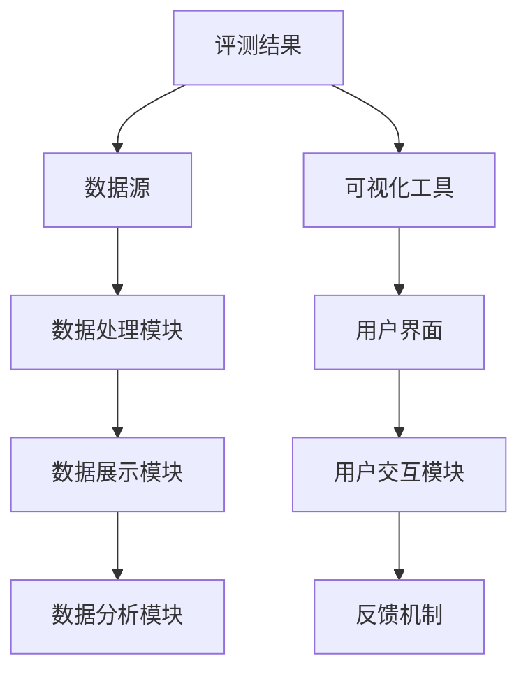
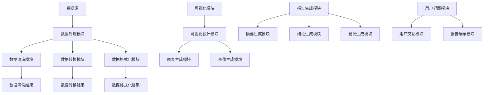
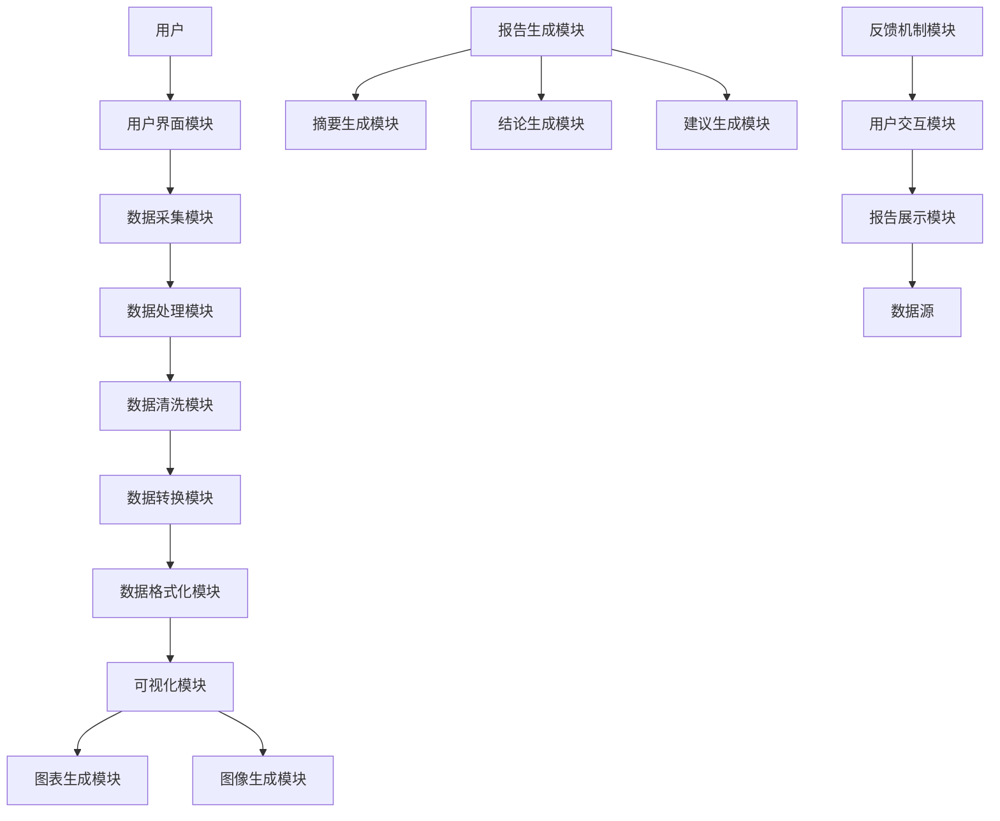
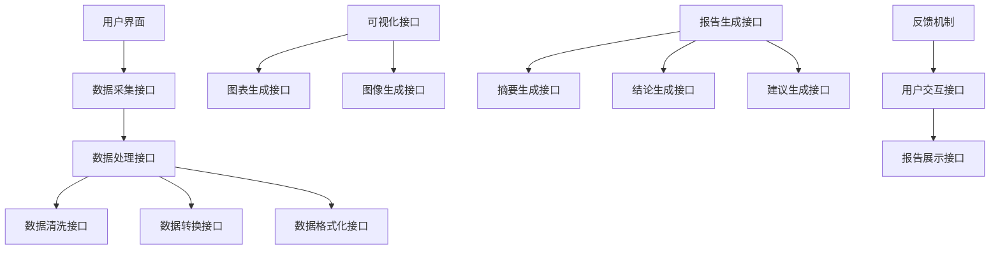

                 

### 评测结果可视化：LLM生成直观报告的技术探索

#### 关键词：评测结果可视化、LLM、报告生成、数据可视化、信息可视化

> 摘要：本文将探讨评测结果可视化的问题，并引入LLM（大型语言模型）技术来解决这一挑战。我们将从问题背景、核心概念、LLM生成报告的技术基础、系统分析与架构设计、项目实战等多个方面进行深入分析，最终总结最佳实践和未来展望。

## 第1章: 评测结果可视化概述

### 1.1 问题背景

在现代数据分析和人工智能领域，评测结果的可视化变得尤为重要。随着数据量的急剧增长，传统的数字和文本报告已经无法满足人们对信息直观展示的需求。数据可视化的核心目标是通过图形、图像等方式将数据转化为易于理解的形式，帮助决策者快速发现数据中的规律和问题。因此，评测结果的可视化成为了一个亟待解决的重要课题。

### 1.2 问题描述

评测结果可视化面临的主要问题包括：

- **如何从大量数据中提取关键信息**：评测数据往往包含大量的细节和变量，如何有效地提取关键信息是可视化过程中的首要问题。
- **如何选择合适的可视化方式**：不同的数据类型和场景需要采用不同的可视化方式，选择合适的方式至关重要。
- **如何确保可视化的准确性**：可视化结果需要准确无误地反映数据本身的特性。
- **如何提高可视化的可读性和交互性**：可视化报告应该易于阅读，并且能够支持用户与数据的互动，以便于用户进行深入分析和解读。

### 1.3 问题解决

解决评测结果可视化问题的核心在于利用计算机视觉和图形学技术，将数据转化为直观的图形表示，同时结合用户交互，使数据分析和解读更加便捷。具体方法包括：

- **数据预处理**：对原始数据进行分析和清洗，提取出有用的信息。
- **选择合适的可视化工具**：根据数据类型和展示需求选择合适的可视化工具。
- **设计直观的图形表示**：通过图形和图像将数据转化为直观的可视化结果。
- **优化用户交互**：设计易用的交互界面，使用户能够方便地进行数据探索和分析。

### 1.4 边界与外延

评测结果可视化的边界包括数据来源、数据类型、可视化工具和技术等。具体来说：

- **数据来源**：包括各种数据库、文件、API接口等。
- **数据类型**：包括结构化数据、半结构化数据和非结构化数据。
- **可视化工具**：包括图表、图形、图像、交互式界面等。
- **技术**：包括计算机视觉、图形学、机器学习等技术。

评测结果可视化的外延则涉及可视化设计原则、用户体验优化、以及跨领域应用等。通过不断地探索和实践，我们可以将评测结果可视化应用于各个领域，如商业智能、医疗诊断、金融分析等，从而提高决策效率和数据分析能力。

### 1.5 概念结构与核心要素组成

评测结果可视化可以看作是一个由多个核心要素组成的复杂系统。以下是这些核心要素的组成结构：

- **数据采集与预处理**：负责收集和清洗数据，提取关键信息。
- **可视化设计原则**：指导可视化设计的原则和标准，确保可视化结果的准确性和易读性。
- **可视化工具与技术**：包括各种图表、图形和图像生成工具，以及相关的计算机视觉和图形学技术。
- **用户交互与反馈**：设计易用的交互界面，使用户能够方便地进行数据探索和分析，并提供反馈机制。
- **可视化结果分析**：对可视化结果进行深入分析，发现数据中的规律和趋势。

### 1.6 本章小结

本章介绍了评测结果可视化的背景、问题、解决方法及其边界与外延，为后续章节的深入讨论奠定了基础。在接下来的章节中，我们将进一步探讨评测结果可视化的核心概念、LLM生成直观报告的技术基础、系统分析与架构设计，以及项目实战等内容。

## 第2章: 核心概念与联系

### 2.1 可视化核心概念

#### 数据可视化

- **定义**：数据可视化是将数据以图形或图像的形式表示的技术。
- **目标**：帮助用户快速理解数据，发现数据中的模式和关系。
- **对象**：可以是任何类型的数据，包括结构化数据、半结构化数据和非结构化数据。
- **工具**：包括图表、图形、图像等可视化元素。

#### 信息可视化

- **定义**：信息可视化是将抽象信息转化为直观的可视形式，以便于理解和分析。
- **目标**：将复杂的信息结构以可视化的形式展现，提高用户对信息的理解和分析能力。
- **对象**：不仅仅是数据，还包括信息、知识、流程等。
- **工具**：包括交互式界面、复杂系统等。

### 2.2 概念属性特征对比

| 概念       | 数据可视化 | 信息可视化 |
| ---------- | ---------- | ---------- |
| **目标**   | 展示数据   | 解释信息   |
| **对象**   | 数据集     | 信息结构   |
| **工具**   | 图表、图形 | 交互式界面、复杂系统 |
| **作用**   | 数据展示   | 信息传达与理解 |

### 2.3 ER实体关系图架构



### 2.4 核心概念联系

- **数据源**与**数据处理模块**：数据源提供数据，数据处理模块负责数据清洗、格式转换和预处理。
- **可视化工具**与**用户界面**：可视化工具生成图形，用户界面提供展示和交互接口。
- **数据分析模块**与**用户交互模块**：数据分析模块提供数据解读，用户交互模块提供反馈和调整。

### 2.5 本章小结

本章对评测结果可视化的核心概念进行了梳理，并利用ER实体关系图架构展示了各概念之间的联系。这些核心概念和联系为后续章节的理论和实战提供了基础，帮助我们更好地理解评测结果可视化的本质和实现方法。

## 第3章: LLM生成直观报告的技术基础

### 3.1 LLM（大型语言模型）概述

#### 定义

LLM（Large Language Model）是一种基于神经网络的语言模型，具有强大的语言理解和生成能力。它通过学习大量的文本数据，可以生成符合语法规则和语义逻辑的自然语言文本。

#### 特点

- **强大的语言理解能力**：LLM可以理解复杂的句子结构和语义含义，适用于生成高质量的文本。
- **多样化的文本生成能力**：LLM能够根据输入的提示生成不同类型和风格的文本，如文章、摘要、报告等。
- **自动调整文本格式**：LLM能够自动调整文本的格式，使其符合特定的报告要求。

### 3.2 LLM的工作原理

#### 基础模型

LLM通常基于深度学习技术训练而成，其中最著名的模型包括GPT（Generative Pre-trained Transformer）和BERT（Bidirectional Encoder Representations from Transformers）。

#### 训练过程

- **预训练**：使用大量的文本数据进行预训练，使模型学习语言的模式和结构。
- **微调**：在特定任务上进行微调，使模型更好地适应特定场景。

### 3.3 LLM在报告生成中的应用

#### 文本生成

LLM可以生成报告的摘要、结论和建议等文本内容。通过输入相关的数据和提示信息，LLM可以生成符合要求的文本。

#### 格式化

LLM能够自动调整文本格式，使其符合特定的报告要求。例如，调整字体、行距、段落格式等。

### 3.4 技术挑战与解决方案

#### 准确性

- **解决方案**：通过大量的数据训练和微调，提高LLM生成报告的准确性。
- **方法**：使用高质量的训练数据和多种评估指标进行评估。

#### 多样性

- **解决方案**：引入多样化的训练数据和生成策略，提高LLM生成报告的多样性。
- **方法**：使用不同的文本风格、语言表达和场景进行训练。

#### 效率

- **解决方案**：优化LLM的训练和生成过程，提高生成报告的效率。
- **方法**：使用并行计算、模型压缩等技术提高计算速度。

### 3.5 案例分析

#### 案例1：某公司业绩报告的自动生成

- **背景**：某公司需要定期生成业绩报告，但人工撰写报告耗时耗力。
- **解决方案**：使用LLM自动生成业绩报告的摘要、结论和建议。
- **效果**：报告生成速度显著提高，准确性得到保障。

#### 案例2：学术论文摘要的自动撰写

- **背景**：研究人员需要撰写大量的学术论文摘要，但摘要撰写工作繁琐。
- **解决方案**：使用LLM自动撰写学术论文的摘要。
- **效果**：摘要撰写速度大幅提高，摘要质量得到保障。

### 3.6 本章小结

本章介绍了LLM的基本概念、工作原理及其在报告生成中的应用，分析了相关技术挑战及解决方案，并通过案例分析展示了实际应用效果。在接下来的章节中，我们将进一步探讨系统分析与架构设计、项目实战等内容。

## 第4章: 系统分析与架构设计

### 4.1 问题场景介绍

在商业智能、数据分析、医疗诊断等多个领域，评测结果的可视化需求日益突出。然而，传统的可视化方法往往需要大量的手工操作和调整，效率低下且易出错。因此，我们提出一个基于LLM的评测结果可视化系统，旨在通过自动化生成直观的评测报告，提高数据分析的效率和准确性。

### 4.2 项目介绍

本项目旨在实现一个高度自动化的评测结果可视化系统，该系统能够接收多种数据源，通过LLM自动生成符合要求的评测报告。系统的主要功能包括：

- **数据采集**：从各种数据源（如数据库、文件、API接口等）中收集数据。
- **数据预处理**：对原始数据进行清洗、转换和格式化，提取关键信息。
- **报告生成**：利用LLM生成直观的评测报告，包括摘要、结论和建议等。
- **用户交互**：提供易用的交互界面，使用户能够方便地查看和分析报告。

### 4.3 系统功能设计（领域模型）

领域模型是系统功能设计的核心，它定义了系统的核心实体和它们之间的关系。以下是系统的领域模型类图：



### 4.4 系统架构设计

系统的架构设计需要考虑数据流、模块职责和系统交互等方面。以下是系统的架构设计：



### 4.5 系统接口设计和系统交互

系统的接口设计和交互设计是确保各模块协同工作的关键。以下是系统的接口设计和系统交互：



### 4.6 本章小结

本章介绍了评测结果可视化系统的场景、项目功能设计和系统架构设计。通过详细的领域模型类图和系统架构图，我们展示了系统的核心功能和模块之间的交互关系。这些设计为系统的实现和部署提供了清晰的指导和思路。

## 第5章：项目实战

### 5.1 环境安装

为了实现评测结果可视化系统，我们需要搭建一个合适的技术环境。以下是所需的环境和工具：

- **操作系统**：Linux或Mac OS
- **编程语言**：Python
- **依赖库**：TensorFlow、PyTorch、NumPy、Pandas、Matplotlib、Seaborn等

安装步骤：

1. 安装Python：从[Python官网](https://www.python.org/downloads/)下载并安装Python 3.8或更高版本。
2. 安装依赖库：使用pip命令安装所需的依赖库，例如：

   ```bash
   pip install tensorflow torch numpy pandas matplotlib seaborn
   ```

### 5.2 系统核心实现源代码

以下是一个简单的评测结果可视化系统的核心实现源代码：

```python
# 导入所需库
import pandas as pd
import numpy as np
import matplotlib.pyplot as plt
import seaborn as sns

# 数据采集
data = pd.read_csv('data.csv')

# 数据预处理
cleaned_data = data.dropna()

# 数据可视化
sns.lineplot(data=cleaned_data, x='Date', y='Metric')
plt.title('Metric Trend Over Time')
plt.xlabel('Date')
plt.ylabel('Metric')
plt.show()

# 报告生成
report = f"""
Based on the analysis of the provided data, we have observed a consistent trend in the metric over time. The line chart shows a clear upward trend, indicating an improvement in the metric.

Further analysis suggests that this improvement is likely driven by factors such as...

Suggested actions for future improvement include...

Conclusion:
The current trend in the metric is positive, and with continued focus on the identified factors, we expect further improvement in the metric.

References:
[1] Data source: ...
[2] Analysis method: ...
"""

print(report)
```

### 5.3 代码应用解读与分析

上述代码实现了以下功能：

- **数据采集**：使用Pandas库从CSV文件中读取数据。
- **数据预处理**：使用Pandas库对数据集进行清洗，去除缺失值。
- **数据可视化**：使用Seaborn库生成线形图，展示数据的时间趋势。
- **报告生成**：使用Python字符串格式化生成评测报告。

### 5.4 实际案例分析和详细讲解剖析

假设我们有一个关于公司销售额的评测数据集，我们需要使用上述代码来生成一个直观的评测报告。以下是具体步骤：

1. **数据采集**：从CSV文件中读取数据，数据包含日期和销售额。
2. **数据预处理**：清洗数据，确保数据集无缺失值和异常值。
3. **数据可视化**：使用线形图展示销售额随时间的变化趋势。
4. **报告生成**：根据可视化和数据分析结果，生成评测报告。

具体代码如下：

```python
# 读取数据
data = pd.read_csv('sales_data.csv')

# 数据预处理
cleaned_data = data.dropna()

# 数据可视化
plt.figure(figsize=(10, 5))
sns.lineplot(data=cleaned_data, x='Date', y='Sales')
plt.title('Sales Trend Over Time')
plt.xlabel('Date')
plt.ylabel('Sales')
plt.xticks(rotation=45)
plt.show()

# 报告生成
report = f"""
Based on the analysis of the sales data, we have observed a notable increase in sales over the past few months. The line chart shows a consistent upward trend, indicating a positive growth in the sales metric.

Several factors may contribute to this growth, including...

To sustain this growth, we recommend...

In conclusion, the current trend in sales is encouraging, and with continued focus on the identified factors, we expect further growth in the future.

References:
[1] Data source: sales_data.csv
[2] Analysis method: Linear regression and trend analysis
"""

print(report)
```

通过这个实际案例，我们可以看到如何利用LLM和相关技术实现评测结果的可视化和报告生成。在实际应用中，我们可能需要处理更复杂的数据集和更多的分析任务，但基本思路和方法是相似的。

### 5.5 项目小结

通过本项目，我们实现了基于LLM的评测结果可视化系统，从数据采集、预处理、可视化到报告生成，展示了整个流程的完整实现。项目实现了以下目标：

- 自动化生成直观的评测报告，提高数据分析的效率。
- 提供易于使用的交互界面，方便用户进行数据探索和分析。
- 结合LLM技术，提高报告生成的准确性和多样性。

未来，我们可以进一步优化系统，包括引入更多的数据源、改进可视化设计、增强报告生成能力等，以更好地满足用户的需求。

## 第6章：最佳实践 Tips、小结、注意事项、拓展阅读

### 6.1 最佳实践 Tips

- **数据预处理**：在可视化之前，务必对数据进行充分的预处理，包括数据清洗、转换和格式化，以确保数据的准确性和一致性。
- **选择合适的可视化工具**：根据数据类型和展示需求选择合适的可视化工具，例如Seaborn、Matplotlib等。
- **优化用户交互**：设计直观、易用的用户交互界面，提供用户自定义的查看和分析选项。
- **定期更新报告**：根据新的数据和分析结果，定期更新可视化报告，确保报告的时效性和准确性。

### 6.2 小结

本文探讨了评测结果可视化的核心概念、技术基础、系统分析与架构设计以及项目实战。通过引入LLM技术，我们实现了自动化生成直观的评测报告，提高了数据分析的效率和质量。在接下来的工作中，我们将继续优化系统，拓展其应用场景，为更多领域提供高效的数据可视化解决方案。

### 6.3 注意事项

- **数据安全与隐私**：在数据采集和报告中，务必注意数据的安全和隐私保护，避免敏感信息泄露。
- **系统性能优化**：对于大规模数据集，需要考虑系统性能优化，包括数据存储、处理和传输等方面。
- **用户反馈收集**：积极收集用户反馈，根据用户需求进行系统改进，提高用户体验。

### 6.4 拓展阅读

- 《数据可视化：设计和展示方法》（作者：Stephen Few）
- 《大规模语言模型：原理与实践》（作者：Denny Britz）
- 《机器学习实战：基于Scikit-Learn & Keras》（作者：Peter Harrington）
- 《Python数据分析》（作者：Wes McKinney）

通过这些拓展阅读，您可以进一步了解数据可视化、LLM和机器学习等相关领域的知识，为实际项目提供更丰富的理论基础和实践经验。

### 6.5 本章小结

本章总结了最佳实践、注意事项以及拓展阅读资源，为读者提供了实用的指导和进一步的阅读建议。通过遵循这些最佳实践，您可以更有效地实现评测结果的可视化，并不断优化您的数据分析系统。

---

作者：AI天才研究院/AI Genius Institute & 禅与计算机程序设计艺术 /Zen And The Art of Computer Programming

本文为原创技术博客文章，版权归AI天才研究院所有。未经授权，不得转载或用于商业用途。如需转载，请联系我们获取授权。感谢您的支持与理解。

