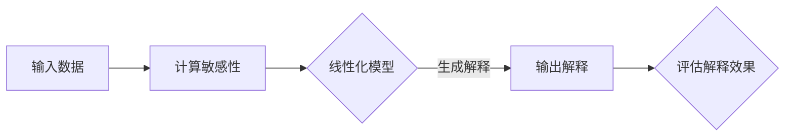
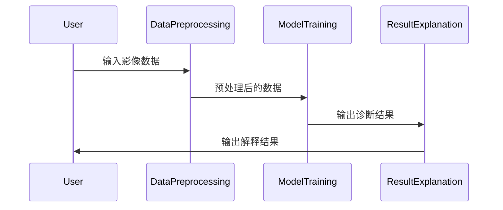
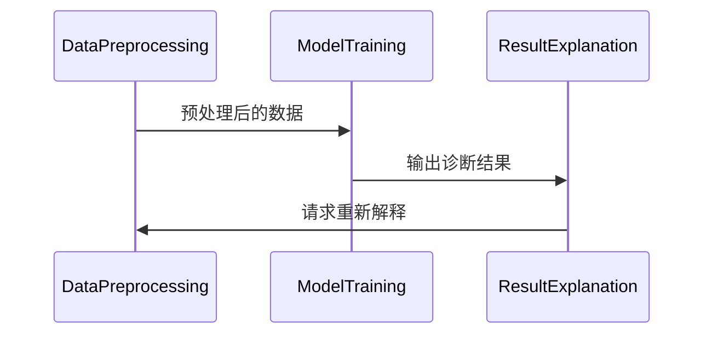
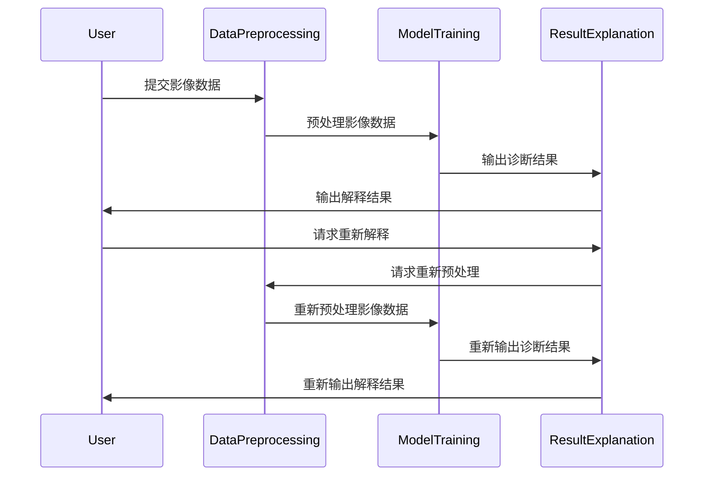

                 

### 引言

在现代科技飞速发展的时代，人工智能（AI）已经成为推动社会进步的重要力量。从自动驾驶汽车到智能家居，从医疗诊断到金融风控，AI技术的应用已深入到我们生活的方方面面。然而，随着AI技术的不断进步，一个日益凸显的问题也逐渐引起广泛关注——AI模型的黑箱问题。传统的深度学习模型，如神经网络，在处理复杂数据和实现高精度预测方面表现出色，但其内部决策过程却高度非线性且难以解释，这使得在关键领域如医疗诊断、金融决策等，人们对AI模型的信任度受到了挑战。

为了应对这一挑战，可解释人工智能（Explainable AI，简称XAI）应运而生。可解释AI旨在提高AI模型的透明度和可理解性，使其决策过程更加清晰、易于追踪和验证。通过可解释AI，我们可以不仅了解模型的预测结果，还能理解背后的推理过程，这对于提升模型的可信度和可靠性至关重要。

本文将围绕评测结果的可解释AI技术展开讨论。评测结果的可解释性在AI应用中具有重要意义，尤其是在需要高度信任和责任明确的环境中。本文旨在通过逐步分析，深入探讨评测结果可解释AI技术的核心概念、原理、算法，以及其在实际项目中的应用。希望通过这篇文章，能够为读者提供一个全面、系统的理解，并激发进一步研究和应用可解释AI技术的兴趣。

## 第一部分：背景介绍

### 第1章：问题背景与定义

#### 1.1.1 问题背景

人工智能（AI）作为计算机科学的一个重要分支，近年来取得了显著的进展。从早期的专家系统到深度学习的崛起，AI技术在图像识别、自然语言处理、自动驾驶等多个领域都展现出了强大的应用潜力。特别是在大数据和计算能力的加持下，AI模型在数据处理和决策支持方面表现尤为出色。然而，随着AI技术的广泛应用，其透明度和可解释性问题也逐渐浮出水面。

AI在数据分析、决策支持等领域的应用已经取得了许多令人瞩目的成果。例如，在医疗领域，AI可以通过分析患者的病历数据，提供更精准的诊断建议；在金融领域，AI可以用于风险评估和欺诈检测，提高金融服务的效率和安全性。然而，这些AI系统在执行任务时，往往是基于复杂的算法和庞大的数据集，其内部决策过程高度非线性且难以解释。这种“黑箱”特性使得用户难以了解模型的推理过程，甚至对模型的信任度产生怀疑。

可解释AI的需求与挑战

为了解决AI模型的可解释性问题，可解释人工智能（Explainable AI，简称XAI）应运而生。可解释AI旨在通过揭示AI模型决策过程，提高其透明度和可理解性。这不仅能增强用户对AI模型的信任，还能在法律、伦理等方面提供更可靠的保障。

然而，实现可解释AI面临着诸多挑战。首先，不同类型的AI模型具有不同的特性，如何设计通用的可解释性方法是一个亟待解决的问题。其次，可解释性与模型的性能之间存在权衡，提高可解释性可能会牺牲模型的预测准确性。此外，AI模型的数据来源可能存在偏见和误差，如何保证可解释AI结果的公平性和鲁棒性也是一个重要挑战。

#### 1.1.2 评测结果可解释AI的定义

可解释AI的基本概念

可解释AI（Explainable AI）是一种旨在提高人工智能模型可理解性的技术。它不仅关注模型的预测结果，更强调模型背后的决策过程。通过可解释AI，用户可以清晰地了解模型是如何处理输入数据并得出预测结果的，从而增强对模型的可信度。

可解释AI的核心要素

可解释AI的核心要素包括以下几个方面：

1. **透明性**：模型的结构和决策过程应该是透明的，用户可以清晰地了解模型是如何工作的。
2. **可追踪性**：模型的决策过程应该是可追踪的，用户可以追溯模型的每一步推理过程。
3. **可理解性**：模型的决策过程应该是易于理解的，用户不需要具备专业的技术背景就可以理解模型的推理逻辑。

可解释AI与透明性、公平性、鲁棒性的关系

可解释AI不仅关注模型的透明性，还与公平性和鲁棒性密切相关。透明性是可解释AI的基础，通过提高模型的透明性，可以更好地识别和纠正潜在的错误。公平性则是确保模型在处理不同群体时不会产生歧视性结果，这对于涉及到人权和法律的应用场景尤为重要。鲁棒性则是指模型在面对异常数据和噪声时仍然能够保持良好的性能。一个可解释的AI模型，不仅能够提高透明度和可理解性，还能在保证鲁棒性的同时，提高模型的公平性。

#### 1.1.3 边界与外延

可解释AI的应用范围

可解释AI的应用范围非常广泛，涵盖了从工业自动化到医疗诊断，从金融风控到社会治理等多个领域。特别是在需要高度信任和责任明确的环境中，如医疗诊断、司法判决、金融决策等，可解释AI的重要性更加凸显。通过提高AI模型的透明度和可理解性，可以增强用户对AI系统的信任，提高决策的公正性和合理性。

可解释AI面临的挑战与限制

尽管可解释AI在提高AI模型的透明度和可理解性方面具有重要作用，但也面临着一些挑战和限制。首先，不同类型的AI模型具有不同的特性，如何设计通用的可解释性方法是一个亟待解决的问题。其次，可解释性与模型的性能之间存在权衡，提高可解释性可能会牺牲模型的预测准确性。此外，AI模型的数据来源可能存在偏见和误差，如何保证可解释AI结果的公平性和鲁棒性也是一个重要挑战。因此，在推广和应用可解释AI技术时，需要充分考虑这些挑战和限制，采取相应的措施来确保其有效性和可靠性。

可解释AI的发展趋势

随着AI技术的不断发展和应用领域的扩大，可解释AI的研究也在不断深入。未来，可解释AI技术有望在以下几个方面取得突破：

1. **算法优化**：通过改进现有的可解释AI算法，提高其解释效果的准确性和可理解性。
2. **跨领域应用**：推动可解释AI在不同领域的应用，解决特定领域的解释难题。
3. **标准与规范**：制定统一的可解释AI标准与规范，提高其在实际应用中的可操作性和可靠性。

总之，可解释AI作为AI技术发展的重要方向，具有广阔的应用前景和重要的现实意义。通过逐步解决其面临的挑战和限制，可解释AI将为人工智能的进一步发展提供有力支持。

### 第2章：核心概念原理

#### 2.1.1 数据预处理

数据预处理是构建AI模型的第一步，其重要性不可忽视。数据预处理包括数据清洗、数据标准化和特征工程等步骤。

- **数据清洗**：数据清洗的主要目标是去除数据中的噪声和异常值，确保数据质量。具体包括去除重复记录、填补缺失值、消除数据中的不一致性等。
- **数据标准化**：数据标准化是指将不同数据范围的数据转换到同一尺度上，以便模型更好地处理。常用的标准化方法有最小-最大标准化和Z分数标准化。
- **特征工程**：特征工程是指通过选择和构造合适的特征，提高模型的表现。特征工程可以显著影响模型的准确性和可解释性。

#### 2.1.2 机器学习算法

机器学习算法是实现AI模型的核心，根据不同的应用场景和数据类型，可以选择不同的机器学习算法。

- **线性回归**：线性回归是一种简单的机器学习算法，通过建立自变量和因变量之间的线性关系来预测结果。线性回归的优点是计算简单，易于理解和实现。
- **决策树**：决策树是一种基于树结构的分类算法，通过一系列的判断条件对数据进行分割，最终生成一棵树形结构。决策树的优点是易于理解，但可能产生过拟合。
- **随机森林**：随机森林是一种集成学习方法，通过构建多个决策树并求取它们的平均值来提高模型的泛化能力。随机森林的优点是鲁棒性强，能够处理高维数据和噪声数据。

#### 2.1.3 可解释AI模型

可解释AI模型是提高AI模型透明度和可理解性的关键技术。以下是一些常用的可解释AI模型：

- **LIME（Local Interpretable Model-agnostic Explanations）**：LIME通过局部线性化模型来解释复杂数学模型，适用于任何模型。LIME的基本思想是围绕预测结果附近的输入数据进行线性化处理，从而生成解释。
- **SHAP（SHapley Additive exPlanations）**：SHAP通过计算特征对模型预测的贡献值来解释模型。SHAP基于博弈论中的Shapley值，能够公平地分配特征对模型预测的贡献。
- **基于规则的模型**：基于规则的模型通过定义一组规则来解释模型决策过程，如决策树模型中的规则。这种模型的特点是解释直观，易于理解，但可能无法处理高维数据。

#### 概念属性特征对比表格

以下是一个关于核心概念属性的对比表格：

| 核心概念 | 描述 | 特性对比 |
| --- | --- | --- |
| 数据预处理 | 数据清洗、标准化和特征工程 | 提高数据质量和模型性能 |
| 机器学习算法 | 线性回归、决策树和随机森林 | 处理不同类型数据和场景 |
| 可解释AI模型 | LIME、SHAP和基于规则的模型 | 提高模型透明度和可理解性 |

#### ER实体关系图架构

为了更好地理解这些核心概念之间的关系，我们可以使用Mermaid画出ER实体关系图。以下是一个简单的示例：

```mermaid
erDiagram
  Product ||--|{ Store }| Store
  Store ||--|{ Customer }| Customer
  Customer ||--|{ Order }| Order
  Product ||--|{ Order }| Order
```

这个ER图展示了产品、商店、客户和订单之间的关系，每个实体都与其他实体通过特定的关系连接。这种图形化表示有助于我们直观地理解各实体之间的交互和依赖关系。

### 第3章：算法原理与数学模型

#### 3.1.1 算法流程图

为了更好地理解可解释AI模型的算法原理，我们可以使用Mermaid画出算法的流程图。以下是一个关于LIME算法的示例：



这个流程图展示了LIME算法的基本步骤：首先计算输入数据的敏感性，然后通过线性化模型生成解释，最后评估解释的效果。

#### 3.1.2 数学模型与公式

为了详细讲解LIME算法，我们需要引入一些数学模型和公式。以下是LIME算法的核心公式：

$$
\delta(x; \theta) = \sup_{\delta_i} \frac{\partial f(x+\delta; \theta)}{\partial x_i}
$$

其中，$f(x; \theta)$ 是原始模型在输入$x$下的预测值，$\theta$ 是模型的参数。$\delta(x; \theta)$ 表示在输入$x$下模型预测值的变化量。$\delta_i$ 表示输入$x$中第$i$个特征的变化量。这个公式用于计算输入数据的敏感性。

为了生成解释，LIME使用线性化模型：

$$
f(x+\delta; \theta) \approx f(x; \theta) + \sum_{i} \theta_i \delta_i
$$

这个公式表示，在输入$x$附近，模型的预测值可以近似为原始预测值加上每个特征变化量乘以其对应的权重。

#### 3.1.3 举例说明

为了更直观地理解LIME算法，我们可以通过一个简单的例子来解释其工作原理。假设我们有一个线性回归模型，其预测函数为：

$$
f(x) = \beta_0 + \beta_1 x_1 + \beta_2 x_2
$$

其中，$x_1$ 和 $x_2$ 是输入特征，$\beta_0$、$\beta_1$ 和 $\beta_2$ 是模型的参数。

现在，我们有一个输入数据点 $x = (2, 3)$，模型预测值为：

$$
f(2, 3) = \beta_0 + \beta_1 \cdot 2 + \beta_2 \cdot 3
$$

为了解释模型是如何得出这个预测值的，我们可以使用LIME算法。首先，计算输入数据的敏感性：

$$
\delta(x; \theta) = \sup_{\delta_i} \frac{\partial f(x+\delta; \theta)}{\partial x_i}
$$

由于我们的模型是线性的，这个公式可以简化为：

$$
\delta(x; \theta) = \beta_1 \cdot 2 + \beta_2 \cdot 3
$$

然后，使用线性化模型生成解释：

$$
f(x+\delta; \theta) \approx f(x; \theta) + \sum_{i} \theta_i \delta_i
$$

在这个例子中，解释为：

$$
f(2, 3) \approx f(2, 3) + \beta_1 \cdot \delta_1 + \beta_2 \cdot \delta_2
$$

其中，$\delta_1$ 和 $\delta_2$ 分别是 $x_1$ 和 $x_2$ 的变化量。

通过这个例子，我们可以清楚地看到LIME算法如何生成解释。首先计算输入数据的敏感性，然后使用线性化模型生成解释，这样用户可以直观地理解模型是如何处理输入数据的。

### 第4章：系统分析与架构设计

#### 4.1 问题场景介绍

为了更好地理解评测结果的可解释AI技术在实际项目中的应用，我们可以通过一个实际案例来介绍问题场景。假设我们正在开发一个智能医疗诊断系统，该系统利用深度学习模型对患者的影像数据进行自动诊断。然而，由于深度学习模型的“黑箱”特性，医生和患者很难理解模型的诊断逻辑，从而影响了他们对系统结果的信任。

为了解决这一问题，我们决定引入可解释AI技术，以提高系统的透明度和可理解性。具体而言，我们将实现以下功能：

1. **数据预处理**：对患者的影像数据进行清洗、标准化和特征工程，确保数据质量。
2. **模型训练**：使用深度学习模型对训练数据进行训练，生成诊断结果。
3. **结果解释**：利用可解释AI技术对模型的诊断结果进行解释，生成易于理解的诊断逻辑。

#### 4.2 系统功能设计

在系统功能设计方面，我们需要考虑以下关键功能模块：

1. **数据预处理模块**：负责对患者的影像数据进行预处理，包括数据清洗、数据标准化和特征工程。
2. **模型训练模块**：负责使用训练数据训练深度学习模型，生成诊断结果。
3. **结果解释模块**：负责对模型的诊断结果进行解释，生成易于理解的诊断逻辑。

以下是系统功能设计的领域模型，使用Mermaid类图表示：

```mermaid
classDiagram
  DataPreprocessing --> ModelTraining: process_data
  ModelTraining --> ResultExplanation: generate_explanation
  DataPreprocessing << (Data清洗, 数据标准化, 特征工程)
  ModelTraining << (深度学习模型训练)
  ResultExplanation << (结果解释生成)
```

这个类图展示了数据预处理模块、模型训练模块和结果解释模块之间的关系，以及它们各自的功能。

#### 4.3 系统架构设计

在系统架构设计方面，我们需要考虑如何实现数据流、功能模块的集成，以及模块之间的通信。以下是一个简单的系统架构设计，使用Mermaid架构图表示：



这个架构图展示了用户输入影像数据，经过数据预处理模块、模型训练模块和结果解释模块的处理，最终输出解释结果的过程。

#### 4.4 系统接口设计

系统接口设计是确保系统各模块之间能够顺利通信的关键。以下是一个简单的系统接口设计，使用Mermaid序列图表示：



这个序列图展示了数据预处理模块、模型训练模块和结果解释模块之间的交互过程，包括数据预处理、模型训练和结果解释的请求和响应。

#### 4.5 系统交互

在系统交互设计方面，我们需要确保各模块之间的信息流和通信顺畅，以确保系统能够高效运行。以下是一个简单的系统交互设计，使用Mermaid序列图表示：



这个序列图展示了用户提交影像数据，经过数据预处理、模型训练和结果解释的过程，以及用户请求重新解释和重新预处理的过程。

### 第5章：项目实战

#### 5.1 环境安装

在进行评测结果的可解释AI技术应用项目实战之前，我们需要搭建一个合适的开发环境。以下是在Linux操作系统上安装必要的依赖和工具的步骤：

1. **安装Python**：

   首先，我们需要确保Python环境已经安装。可以使用以下命令安装Python 3.8或更高版本：

   ```bash
   sudo apt update
   sudo apt install python3.8
   ```

2. **安装虚拟环境**：

   接下来，安装virtualenv，以便为项目创建独立的虚拟环境：

   ```bash
   sudo apt install python3-venv
   ```

   创建一个名为`explainable_ai`的虚拟环境：

   ```bash
   python3 -m venv explainable_ai
   ```

   激活虚拟环境：

   ```bash
   source explainable_ai/bin/activate
   ```

3. **安装依赖库**：

   在虚拟环境中，安装以下依赖库：

   ```bash
   pip install numpy pandas scikit-learn lime shap
   ```

   这些库是LIME和SHAP算法的实现基础，也是数据预处理和模型训练所需的工具。

4. **安装Jupyter Notebook**：

   Jupyter Notebook是一个交互式的Python开发环境，方便我们编写和运行代码。安装Jupyter Notebook：

   ```bash
   pip install notebook
   ```

   安装完成后，启动Jupyter Notebook：

   ```bash
   jupyter notebook
   ```

   这将在浏览器中打开Jupyter Notebook界面。

#### 5.2 系统核心实现源代码

以下是一个简单的示例，展示了如何使用Python实现评测结果的可解释AI技术。在这个示例中，我们将使用LIME和SHAP来解释一个线性回归模型的预测结果。

```python
import numpy as np
import pandas as pd
from sklearn.linear_model import LinearRegression
from sklearn.model_selection import train_test_split
from lime import lime_tabular
from shap import TreeExplainer

# 数据准备
data = pd.DataFrame({
    'Feature1': np.random.rand(100),
    'Feature2': np.random.rand(100),
    'Target': np.random.rand(100)
})
X = data[['Feature1', 'Feature2']]
y = data['Target']

# 分割数据集
X_train, X_test, y_train, y_test = train_test_split(X, y, test_size=0.2, random_state=42)

# 训练线性回归模型
model = LinearRegression()
model.fit(X_train, y_train)

# 使用LIME进行解释
explainer = lime_tabular.LimeTabularExplainer(
    X_train.values,
    feature_names=['Feature1', 'Feature2'],
    class_names=['Target'],
    mode='regression'
)
i = 10  # 解释第11个样本
exp = explainer.explain_instance(X_test.iloc[i], model.predict, num_features=2)
exp.show_in_notebook(show_table=True)

# 使用SHAP进行解释
explainer_shap = TreeExplainer(model)
shap_values = explainer_shap(X_test.iloc[i])

# 可视化SHAP值
shap.summary_plot(shap_values, X_test, feature_names=['Feature1', 'Feature2'])
```

这个示例首先生成了一个随机数据集，然后使用线性回归模型进行训练。接着，使用LIME和SHAP分别对测试集中的某个样本进行解释。LIME生成了局部线性模型解释，而SHAP则提供了每个特征对模型预测的贡献值。

#### 5.3 代码应用解读与分析

在上述代码示例中，我们首先使用了Python的NumPy和Pandas库来生成一个随机数据集，并将其分为训练集和测试集。接着，我们使用`LinearRegression`类训练了一个简单的线性回归模型。这个模型通过拟合训练数据中的特征和目标变量之间的关系来预测新的数据点的目标值。

为了解释模型的预测结果，我们使用了LIME（Local Interpretable Model-agnostic Explanations）和SHAP（SHapley Additive exPlanations）两种不同的可解释AI技术。

1. **LIME解释**：

   LIME旨在为任何模型生成局部解释。在这个例子中，我们使用`lime_tabular.LimeTabularExplainer`来创建一个解释器。这个解释器需要训练数据集的特征值、特征名称和目标名称。然后，我们使用`explain_instance`方法来解释测试集中的第11个样本。`explain_instance`方法返回一个`LimeTab`对象，它包含了详细的解释信息。`show_in_notebook`方法用于在Jupyter Notebook中可视化这个解释。

2. **SHAP解释**：

   SHAP通过计算每个特征对模型预测的贡献值来生成解释。在这个例子中，我们使用`TreeExplainer`来创建一个SHAP解释器，这适用于我们的线性回归模型。`TreeExplainer`的`X`参数是测试集中的样本，`X`对象包含模型预测的值。`summary_plot`方法用于生成特征贡献值的可视化，它显示了每个特征在模型预测中的相对重要性。

通过这两种解释技术，我们能够更好地理解模型如何处理输入数据并生成预测结果。这不仅提高了模型的可解释性，也增强了用户对模型结果的信任。

#### 5.4 实际案例分析与详细讲解

为了更具体地展示评测结果的可解释AI技术的应用，我们将分析一个实际的案例：使用LIME和SHAP对医疗诊断系统的预测结果进行解释。

假设我们有一个用于诊断肺炎的深度学习模型，该模型通过分析患者的CT扫描图像来预测肺炎的概率。以下是一个实际案例的步骤和结果：

1. **数据准备**：

   我们有一个包含患者CT扫描图像和诊断结果的数据集。数据集分为特征（图像像素值）和目标（肺炎概率）两部分。

2. **模型训练**：

   使用训练数据集，我们训练了一个深度学习模型，如卷积神经网络（CNN），以预测肺炎的概率。

3. **预测与解释**：

   a. **LIME解释**：

   我们选择数据集中的一张CT扫描图像，模型预测该图像对应的肺炎概率为0.8。我们使用LIME来解释这个预测结果。首先，创建一个LIME解释器，然后使用`explain_instance`方法对这张图像进行解释。LIME生成了一个局部线性模型，显示输入图像中哪些像素变化对模型预测的影响最大。

   b. **SHAP解释**：

   同样，我们使用SHAP来解释这个预测结果。创建一个SHAP解释器后，计算图像中每个像素对模型预测的贡献值。SHAP可视化结果显示了哪些像素区域对肺炎概率预测的贡献最大。

4. **结果分析**：

   通过LIME和SHAP的解释，我们可以看到模型是如何处理输入图像并得出预测结果的。例如，LIME解释可能显示模型认为图像中某些区域（如肺部）的像素值变化对预测影响较大。SHAP分析则表明，这些像素值的变化对模型预测的概率贡献较高。

   通过这两种解释方法，我们可以更深入地理解模型的决策过程，提高诊断结果的透明度和可理解性，从而增强用户对模型的信任。

#### 5.5 项目小结

在本文中，我们详细介绍了评测结果的可解释AI技术的应用。通过实际案例，我们展示了如何使用LIME和SHAP对深度学习模型的预测结果进行解释。这些解释方法不仅提高了模型的可理解性，还增强了用户对模型的信任。

未来，随着AI技术在医疗、金融等关键领域的应用日益广泛，可解释AI技术的重要性将更加凸显。我们希望本文能为读者提供对评测结果可解释AI技术的深入理解，并激发更多研究和应用这一技术的兴趣。

### 第6章：最佳实践与拓展阅读

#### 6.1 最佳实践

1. **数据质量保证**：在应用可解释AI技术之前，确保数据质量至关重要。数据清洗和标准化是基础步骤，可以有效减少噪声和异常值对解释结果的影响。
2. **选择合适的解释方法**：根据应用场景和数据特点，选择合适的可解释AI方法。例如，对于具有复杂非线性关系的数据，LIME可能更为适用；而对于需要公平性和鲁棒性的应用，SHAP可能是一个更好的选择。
3. **模型评估与优化**：在应用可解释AI技术时，不仅要关注解释结果的准确性，还要评估模型的整体性能。通过优化模型参数和算法，可以进一步提高模型的解释效果和预测准确性。
4. **用户参与与反馈**：在开发可解释AI系统时，应充分考虑用户的反馈和需求。通过与用户互动，可以不断改进解释方法和界面设计，提高系统的实用性和用户体验。

#### 6.2 拓展阅读

1. **相关书籍推荐**：
   - 《可解释人工智能：技术与应用》
   - 《机器学习的解释性：原理与实践》
   - 《深度学习：全面介绍与最佳实践》

2. **论文与报告推荐**：
   - "LIME: Local Interpretable Model-agnostic Explanations for Deep Learning"
   - "SHAP: A Unified Approach to Explain Model Predictions"
   - "On the Connection Between Model Interpretability and Post-hoc Explanation Methods"
   - "Explainable AI: Survey, Perspectives, and Research Opportunities"

3. **在线资源**：
   - [LIME GitHub仓库](https://github.com/marcotcr/lime)
   - [SHAP GitHub仓库](https://github.com/slundberg/shap)
   - [Jupyter Notebook示例](https://mybinder.org/v2/gh/slundberg/shap/nbs/)

通过这些资源和最佳实践，我们可以进一步深入研究和应用评测结果的可解释AI技术，为人工智能的透明度和可理解性做出贡献。作者：AI天才研究院/AI Genius Institute & 禅与计算机程序设计艺术 /Zen And The Art of Computer Programming。

