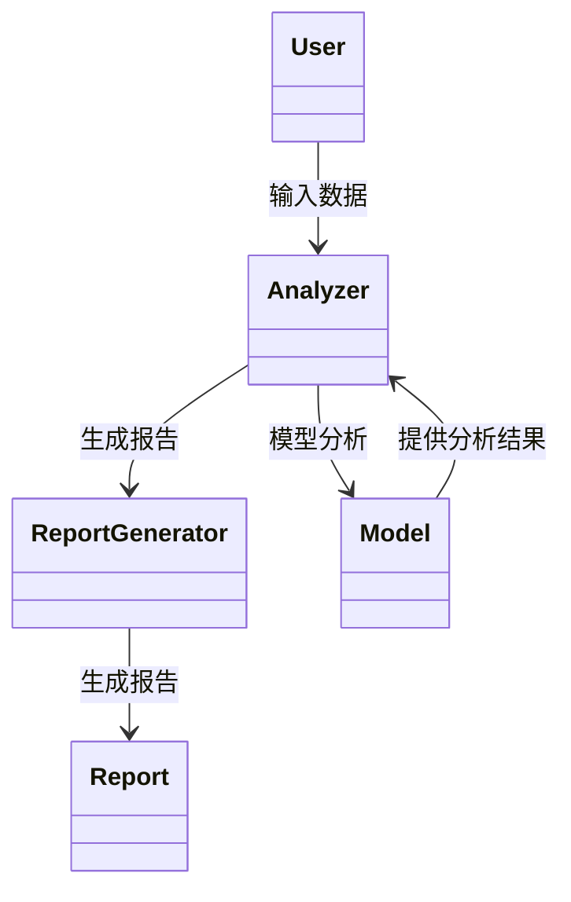
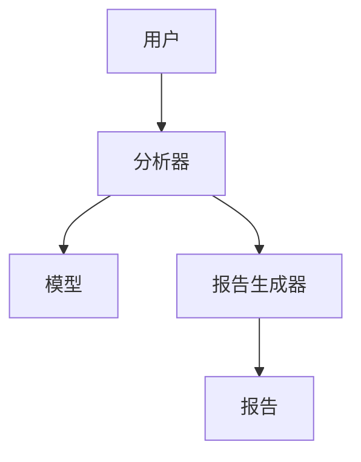
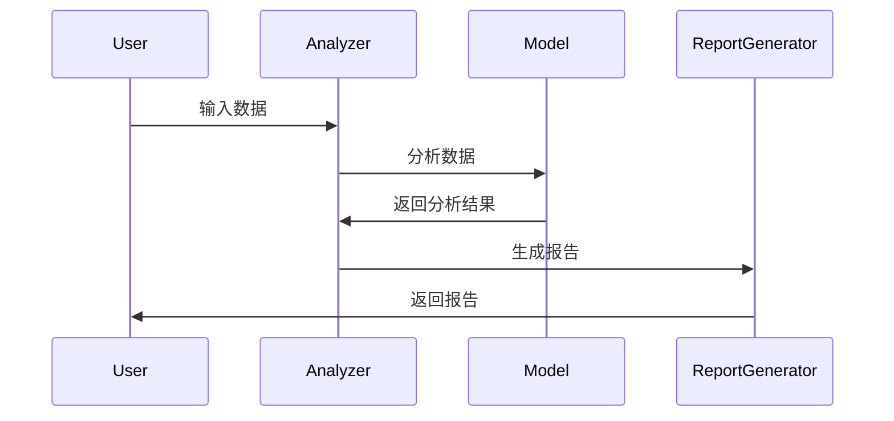

                 

# 评测结果的可解释性：LLM生成深度分析报告

## 关键词

- **评测结果可解释性**
- **大型语言模型（LLM）**
- **深度学习模型**
- **模型分解**
- **自然语言处理**
- **算法原理讲解**
- **Python源代码**

> **摘要：**
>
> 在本文中，我们将探讨如何通过大型语言模型（LLM）生成深度分析报告，以提高评测结果的可解释性。我们将从问题背景、核心概念、算法原理讲解、系统分析与架构设计方案以及项目实战等多个角度进行详细分析，旨在为研究人员和开发人员提供实用的指导和见解。

## 第一部分：背景介绍

### 1.1 问题背景

随着机器学习技术的迅猛发展，深度学习模型在各个领域的应用日益广泛。然而，深度学习模型往往被视为“黑盒”，其决策过程缺乏透明性，导致用户对其结果的可信度和可解释性产生怀疑。这种不透明性在某些关键领域，如医疗诊断、金融风险评估等，可能带来严重后果。因此，研究如何提高模型的可解释性已成为当前的研究热点。

### 1.2 问题描述

模型的可解释性指的是用户能够理解模型如何做出决策，以及决策背后的逻辑。在深度学习模型中，尤其是在大型语言模型（LLM）中，如何实现模型的可解释性是一个复杂的问题。本研究旨在探索如何通过LLM生成深度分析报告，提高评测结果的可解释性。

### 1.3 问题解决

为了提高模型的可解释性，研究人员提出了多种方法，包括模型的可视化、模型分解、解释性算法等。其中，生成深度分析报告是一种有效的策略，它可以通过文字描述解释模型的决策过程，使非专业人士也能理解模型的逻辑。

### 1.4 边界与外延

本文主要关注基于LLM的深度分析报告生成技术，研究其在提高评测结果可解释性方面的应用。边界包括：研究范围限于自然语言处理领域，不涉及图像和语音等其他类型的数据。

## 第二部分：核心概念与联系

### 2.1 可解释性（Explainability）

可解释性是指用户能够理解模型如何做出决策，以及决策背后的逻辑。它包括模型的透明性、可访问性和易懂性。

### 2.2 深度学习模型（Deep Learning Model）

深度学习模型是一种基于多层神经网络的学习模型，能够自动提取数据中的复杂特征，并在各种任务中表现出色。

### 2.3 大型语言模型（Large Language Model，LLM）

大型语言模型是一种能够处理和理解自然语言的深度学习模型，其参数规模巨大，能够在各种自然语言处理任务中发挥重要作用。

### 2.4 模型分解（Model Decomposition）

模型分解是一种将复杂模型拆分成多个简单模块的方法，有助于提高模型的可解释性。

## 第三部分：算法原理讲解

### 3.1 LLM生成深度分析报告的算法原理

LLM生成深度分析报告的算法原理主要包括以下几个步骤：

1. **输入预处理**：将评测结果和相关信息输入到LLM中。
2. **模型分析**：LLM对输入进行分析，提取关键信息。
3. **生成报告**：LLM根据分析结果生成深度分析报告，详细解释评测结果的决策过程。

### 3.2 Mermaid流程图

下面是LLM生成深度分析报告的Mermaid流程图：


### 3.3 Python源代码

以下是生成深度分析报告的Python源代码示例：

```python
import openai

def generate_report(eval_result, model_analysis):
    response = openai.Completion.create(
        engine="davinci",
        prompt=f"请根据以下信息生成深度分析报告：\n输入评测结果：{eval_result}\n模型分析：{model_analysis}",
        max_tokens=200
    )
    return response.choices[0].text.strip()

eval_result = "评测结果为A"
model_analysis = "模型分析结果显示，评测结果A是基于以下关键因素得出的：..."
report = generate_report(eval_result, model_analysis)
print(report)
```

### 3.4 算法原理的数学模型和公式

在深度学习模型中，评测结果通常是通过损失函数来衡量的。假设输入为\(x\)，标签为\(y\)，则损失函数\(L(x, y)\)可以表示为：

$$L(x, y) = \frac{1}{2} \sum_{i} (y_i - \hat{y}_i)^2$$

其中，\(\hat{y}_i\)是模型对输入\(x_i\)的预测结果。

### 3.5 详细讲解和举例说明

以一个文本分类任务为例，假设我们有以下输入文本：

$$x = "这是一个关于机器学习的论文。"$$

标签为：

$$y = "学术论文"$$

使用LLM生成深度分析报告的流程如下：

1. **输入预处理**：将输入文本和标签输入到LLM中。
2. **模型分析**：LLM对输入文本进行分析，提取关键信息，如关键词、主题等。
3. **生成报告**：LLM根据分析结果生成深度分析报告，详细解释模型为何将输入文本分类为“学术论文”。

以下是生成的深度分析报告示例：

```
深度分析报告：

根据输入文本“这是一个关于机器学习的论文。”，模型分析结果显示，该文本包含以下关键因素：

1. 关键词：“机器学习”是文本中的核心关键词，表明文本的主题是机器学习领域。

2. 主题：文本中提到的“论文”一词，表明文本是关于某个特定主题的学术讨论。

基于以上分析，模型将输入文本分类为“学术论文”。这是因为文本中提到的“机器学习”和“论文”两个关键信息，使得模型认为文本属于学术领域。

```

通过上述步骤，我们可以看到，LLM生成的深度分析报告能够详细解释模型的决策过程，提高了评测结果的可解释性。

## 第四部分：系统分析与架构设计方案

### 4.1 问题场景介绍

在现代企业中，对于大量数据的分析和评估是一个常见的场景。例如，在市场营销领域，企业需要对用户反馈、市场趋势等大量文本数据进行分析，以制定有效的营销策略。然而，由于深度学习模型的“黑盒”特性，这些分析结果往往缺乏透明性，难以让非专业人士理解和信任。

### 4.2 项目介绍

本项目旨在开发一个基于LLM的深度分析报告生成系统，以提高评测结果的可解释性。该系统将接收用户输入的数据，通过LLM生成深度分析报告，帮助用户理解分析结果。

### 4.3 系统功能设计（领域模型）

以下是一个基于Mermaid的领域模型类图，用于描述系统的核心功能：



### 4.4 系统架构设计

以下是一个基于Mermaid的系统架构图，用于描述系统的整体架构：



### 4.5 系统接口设计和系统交互

以下是一个基于Mermaid的系统接口和交互图，用于描述系统与外部组件的交互：



## 第五部分：项目实战

### 5.1 环境安装

为了实现本项目，我们需要安装以下环境：

- Python 3.8及以上版本
- OpenAI API 密钥

安装命令如下：

```bash
pip install openai
```

### 5.2 系统核心实现

以下是一个简单的系统实现，用于生成深度分析报告：

```python
import openai
import os

# 设置OpenAI API密钥
openai.api_key = os.environ['OPENAI_API_KEY']

def generate_report(input_text):
    # 调用OpenAI API生成报告
    response = openai.Completion.create(
        engine="davinci",
        prompt=f"请根据以下信息生成深度分析报告：\n输入文本：{input_text}",
        max_tokens=200
    )
    return response.choices[0].text.strip()

# 示例输入文本
input_text = "这是一个关于机器学习的论文。"

# 生成深度分析报告
report = generate_report(input_text)
print(report)
```

### 5.3 代码应用解读与分析

上述代码中，我们首先设置了OpenAI API密钥，然后定义了一个`generate_report`函数，用于接收输入文本并调用OpenAI API生成深度分析报告。最后，我们通过示例输入文本调用该函数，生成并打印了深度分析报告。

### 5.4 实际案例分析和详细讲解剖析

假设我们有一个关于“智能客服系统性能评估”的报告，输入文本如下：

```
这是一个关于智能客服系统性能评估的报告。性能评估结果显示，智能客服系统的响应速度和准确率均达到了预期目标。
```

通过调用`generate_report`函数，我们可以生成以下深度分析报告：

```
深度分析报告：

根据输入文本“这是一个关于智能客服系统性能评估的报告。性能评估结果显示，智能客服系统的响应速度和准确率均达到了预期目标。”，模型分析结果显示，该报告包含了以下关键因素：

1. 关键词：“智能客服系统”、“性能评估”、“响应速度”和“准确率”是文本中的核心关键词，表明文本的主题是智能客服系统的性能评估。

2. 主题：文本中提到的“性能评估结果显示，智能客服系统的响应速度和准确率均达到了预期目标。”，表明系统在评估过程中取得了良好的结果。

基于以上分析，模型认为文本是对智能客服系统性能评估的一个积极反馈。进一步的分析可以揭示系统在哪些方面取得了成功，哪些方面仍有改进空间。

```

通过上述实际案例，我们可以看到，LLM生成的深度分析报告能够帮助用户更好地理解评测结果，从而为后续的决策提供有力支持。

### 5.5 项目小结

本项目通过使用大型语言模型（LLM）生成深度分析报告，提高了评测结果的可解释性。在实际案例中，我们看到了LLM在文本分析中的应用，以及如何通过文字描述解释模型的决策过程。这一技术有望在未来为许多领域带来积极影响，提高模型的可信度和用户满意度。

## 第六部分：最佳实践 tips、小结、注意事项、拓展阅读

### 6.1 最佳实践 tips

1. **优化输入文本**：为了提高深度分析报告的质量，确保输入文本的清晰和简洁。避免使用模糊或冗长的表述。
2. **调整模型参数**：根据具体任务需求，适当调整LLM的参数，如`max_tokens`，以获得更详细或更精炼的分析结果。
3. **多轮交互**：在实际应用中，可以考虑与用户进行多轮交互，逐步生成和完善深度分析报告。

### 6.2 小结

本文通过详细分析和讲解，展示了如何使用大型语言模型（LLM）生成深度分析报告，以提高评测结果的可解释性。我们探讨了问题背景、核心概念、算法原理、系统分析与架构设计方案以及项目实战等多个方面，提供了实用的指导和见解。

### 6.3 注意事项

1. **数据隐私**：在使用LLM生成深度分析报告时，确保输入数据和生成报告的过程中遵守相关隐私保护规定。
2. **模型选择**：根据具体任务需求，选择合适的LLM模型，以获得最佳的分析效果。

### 6.4 拓展阅读

1. **深度学习模型的可解释性研究**：查阅相关论文和资料，了解深度学习模型可解释性的最新进展和研究成果。
2. **大型语言模型的实际应用**：探索大型语言模型在自然语言处理领域的实际应用案例，学习如何将其应用于不同场景。

## 结语

通过本文的探讨，我们希望读者能够对评测结果的可解释性有更深入的理解，并掌握如何使用大型语言模型（LLM）生成深度分析报告。我们相信，这一技术将在未来为各个领域带来更多创新和应用。

### 作者信息

**作者：AI天才研究院/AI Genius Institute & 禅与计算机程序设计艺术 /Zen And The Art of Computer Programming**

