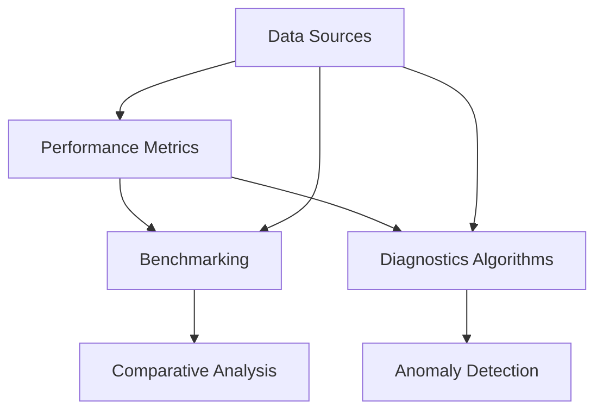

                 

### 引言

在当今信息技术飞速发展的时代，评测结果的差异化分析已成为提高软件性能、优化系统设计和保障高效运行的关键环节。特别是在人工智能领域，语言模型（Language Models，简称LLMs）的出现为评测结果的差异化分析带来了全新的机遇与挑战。LLMs，作为近年来人工智能研究的重要成果，以其强大的自然语言处理能力，正在逐步深入到各个技术领域，包括性能诊断、代码审查、文档生成等。然而，如何有效地利用LLMs进行性能诊断，如何理解LLMs在性能诊断中的作用和局限，成为了亟待解决的问题。

#### 1.1.1 评测结果的差异化分析的重要性

评测结果的差异化分析，简单来说，就是通过对评测结果进行深入分析和对比，找出不同系统和组件在性能上的差异，从而针对性地进行优化和改进。在软件工程中，这不仅仅是为了满足性能指标，更是为了提升用户体验、降低维护成本、延长系统寿命。随着软件系统的复杂性不断增加，传统的评测方法往往难以捕捉到深层次的性能问题，导致评测结果的不准确和不可靠。而LLMs的出现，为这一难题提供了一种新的解决方案。

#### 1.1.2 当前评测结果分析面临的挑战

首先，评测结果的多维度性是一个挑战。现代软件系统通常涉及多个性能指标，如响应时间、吞吐量、资源利用率等，这些指标之间可能存在冲突或相互影响。如何平衡这些指标，如何将评测结果进行统一和量化，是一个复杂的问题。其次，评测数据的多样性和复杂性也是一个挑战。不同系统、不同环境、不同负载下的评测数据可能千差万别，如何从中提取出有价值的信息，如何处理噪声和异常值，都是需要解决的问题。

#### 1.1.3 LLamas in AI: Powering Performance Diagnostics

LLMs，作为一种基于深度学习技术的自然语言处理模型，能够对大量非结构化数据进行分析和理解，从而提供有价值的洞察。在性能诊断中，LLMs可以用于以下几方面：

1. **自动化评测结果分析**：LLMs可以自动解析评测报告，提取关键性能指标，进行初步分析，从而减少人工工作量。
2. **多维度性能评估**：通过自然语言生成技术，LLMs可以将复杂的性能评测结果转化为易于理解的可视化图表或文本报告，帮助用户快速识别性能瓶颈。
3. **趋势预测和异常检测**：基于历史数据和实时监测数据，LLMs可以预测性能趋势，检测异常情况，提前预警潜在问题。

然而，LLMs在性能诊断中也面临一些挑战，如数据质量、模型解释性、计算资源需求等。如何充分发挥LLMs的优势，同时克服这些挑战，是本文要探讨的重点。

#### 1.2 LLMS: The Core Technology

##### 1.2.1 Definition and basics of Large Language Models (LLMs)

Large Language Models (LLMs) are artificial neural networks trained on vast amounts of text data to understand and generate human-like language. The most prominent example of an LLM is the Transformer architecture, introduced by Vaswani et al. in 2017, which has been the backbone of many subsequent models like BERT, GPT, and T5. LLMs can perform a wide range of natural language processing tasks, including text classification, machine translation, question answering, and summarization.

##### 1.2.2 Architectural characteristics of LLMs

LLMs are typically characterized by their deep architecture, with many layers of neural networks. Each layer processes the input text and generates an output representation, which is then used to produce the final output. The Transformer architecture, in particular, uses self-attention mechanisms to weigh the importance of different parts of the input text, allowing the model to capture long-range dependencies and context.

##### 1.2.3 Theoretical foundations of LLMs

The theoretical foundations of LLMs lie in the field of deep learning and neural networks. Key components include backpropagation, which enables the model to adjust its weights through gradient descent, and activation functions, which introduce non-linearities into the model. Additionally, the concept of attention, which allows the model to focus on relevant parts of the input, plays a crucial role in the effectiveness of LLMs.

### 1.3 Book Organization and Scope

##### 1.3.1 Overview of chapters and content

This book is organized into four main parts:

1. **Introduction**: Provides a background on the importance of performance diagnostics and an overview of LLMs.
2. **LLMs Performance Evaluation Principles**: Discusses the metrics and algorithms used to evaluate LLM performance.
3. **LLMs in Performance Diagnostics**: Explores the application of LLMs in performance diagnostics, with case studies and mathematical formulations.
4. **Practical Applications and Best Practices**: Provides practical insights and best practices for implementing LLM-based performance diagnostics.

##### 1.3.2 How to use this book

This book is intended for readers with a basic understanding of natural language processing and performance diagnostics. It can be used as a reference guide for researchers and practitioners working in these fields. Each chapter concludes with summaries, key takeaways, and exercises to reinforce learning.

### 1.4 Core Concepts and Relationships

##### 1.4.1 Key concepts in performance diagnostics

Key concepts in performance diagnostics include performance metrics, benchmarking, and diagnostics algorithms. Performance metrics are quantitative measures of system performance, such as response time and throughput. Benchmarking involves comparing the performance of different systems or components. Diagnostics algorithms are used to analyze performance data and identify bottlenecks or anomalies.

##### 1.4.2 Concept attributes and comparison table

The following table summarizes the attributes of key concepts in performance diagnostics:

| Concept | Attribute | Description |
| --- | --- | --- |
| Performance Metrics | Quantitative | Measures of system performance |
| Benchmarking | Comparative | Comparison of system performance |
| Diagnostics Algorithms | Analytical | Analysis of performance data |

##### 1.4.3 Entity relationship diagram for performance diagnostics

The following Mermaid diagram illustrates the relationships between key concepts in performance diagnostics:

### 1.5 Mathematics Behind Performance Diagnostics

##### 1.5.1 Introduction to mathematical models for performance analysis

Mathematical models are fundamental to performance analysis, as they allow us to quantify and predict system behavior. Common models include queuing theory, which analyzes the behavior of systems with queues, and stochastic processes, which model random phenomena. These models are used to derive performance metrics such as response time and throughput.

##### 1.5.2 Mathematical formulas in LaTeX

The following LaTeX formulas represent key mathematical models in performance diagnostics:

$$
\text{Response Time} = \text{Queueing Time} + \text{Processing Time}
$$

$$
\text{Throughput} = \frac{\text{Number of Jobs}}{\text{Time}}
$$

$$
\text{Service Rate} = \frac{1}{\text{Response Time}}
$$

##### 1.5.3 Examples and explanations

Let's consider a simple M/M/1 queuing system, where "M" denotes a Markovian arrival process and "1" denotes a single server. In this system, jobs arrive according to a Poisson process with rate $\lambda$ and are served by a single server with service rate $\mu$.

**Example 1: Response Time**

In this system, the response time can be calculated using the following formula:

$$
\text{Response Time} = \frac{1}{\mu - \lambda}
$$

If $\lambda = 2$ jobs per minute and $\mu = 3$ jobs per minute, the response time is:

$$
\text{Response Time} = \frac{1}{3 - 2} = 1 \text{ minute}
$$

**Example 2: Throughput**

The throughput of this system can be calculated as:

$$
\text{Throughput} = \frac{1}{\mu - \lambda} = \frac{1}{3 - 2} = 1 \text{ job per minute}
$$

These examples demonstrate how mathematical models can be used to analyze and predict performance in queuing systems.

### 1.6 Summary

In this chapter, we have introduced the key concepts and challenges of performance diagnostics, highlighted the role of LLMs in this domain, and provided an overview of the book's structure and scope. We have also discussed the mathematical foundations of performance analysis, illustrating the use of mathematical models in queuing theory. This chapter sets the stage for a deeper exploration of LLMs in performance diagnostics in the following chapters.

### Keywords

- **Performance Diagnostics**
- **LLMs**
- **Natural Language Processing**
- **Deep Learning**
- **Machine Learning Models**
- **System Performance Analysis**
- **Automated Analysis Tools**
- **Benchmarking**

### Abstract

This book provides a comprehensive guide to leveraging Large Language Models (LLMs) for performance diagnostics in software systems. It covers the theoretical foundations of LLMs, their performance evaluation principles, and practical applications in diagnosing system performance. Through case studies and mathematical formulations, the book demonstrates how LLMs can be used to analyze and optimize system performance, offering valuable insights and best practices for researchers and practitioners in the field.

