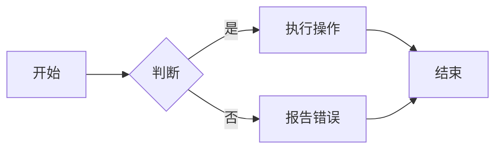
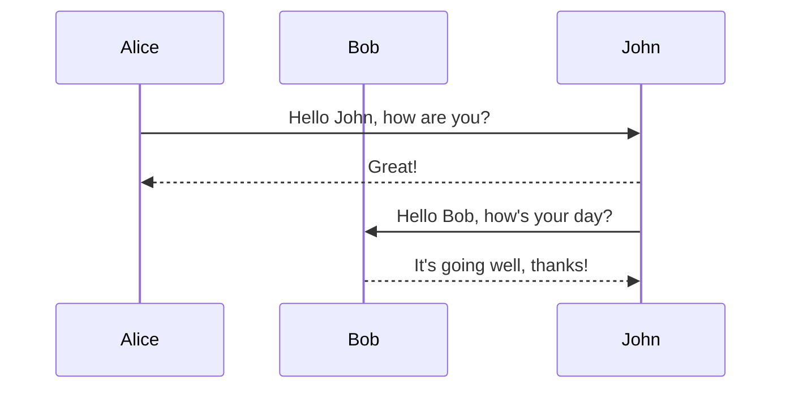

                 

### 评测结果的差异化展示：针对不同角色定制报告

#### 关键词：评测结果展示、差异化、角色定制、报告

> 摘要：本文将深入探讨评测结果的差异化展示，特别是针对不同角色（如企业高管、技术专家和市场营销人员）定制报告的必要性和方法。通过分析不同角色的需求，本文将提供具体的定制策略、数据可视化工具、撰写技巧，并结合实际案例，展示如何高效实现评测结果的差异化展示。

### 一、引言

在当今数据驱动的世界里，评测结果作为一种重要的信息输出形式，其展示的质量和效果直接影响到决策的准确性和执行的有效性。然而，不同的角色在获取和处理评测结果时，往往有着不同的需求和关注点。企业高管需要宏观的战略信息，技术专家追求深入的技术细节，市场营销人员则关注市场反馈和客户需求。因此，如何针对不同角色定制评测报告，实现差异化展示，成为一个亟待解决的问题。

本文将从以下几个方面展开讨论：

1. 评测结果展示的基本概念与分类
2. 不同角色的评测报告定制
3. 差异化评测报告展示技巧
4. 实战案例分析
5. 工具与应用
6. 未来趋势与方向

### 二、评测结果展示的基本概念与分类

#### 2.1 评测结果展示的定义

评测结果展示指的是将评测过程中获得的数据、结论和评价以图表、文字等形式呈现出来，使其更易于理解和分析的过程。

#### 2.2 评测结果展示的分类

- **数据可视化展示**：通过图表、图形等视觉元素，将数据直观地呈现出来，便于观察和分析。
- **文字描述展示**：以文字形式详细描述评测结果，适合需要详细解读的情景。
- **综合展示**：结合数据可视化和文字描述，提供全方位的信息展示。

### 三、不同角色的评测报告定制

#### 3.1 企业高管报告定制

**需求分析**：企业高管需要快速获取关键指标和整体态势，以便做出战略决策。

**定制策略**：

- **关键指标**：突出核心指标，如营收、市场份额、增长率等。
- **图表展示**：使用大型的、简洁的图表，突出关键数据。
- **摘要优先**：提供简明扼要的摘要，方便快速浏览。

#### 3.2 技术专家报告定制

**需求分析**：技术专家需要深入的技术细节和性能分析，以便优化和改进技术方案。

**定制策略**：

- **技术细节**：详细描述技术实现的细节，包括算法、架构等。
- **图表展示**：提供详细的图表和流程图，辅助理解技术原理。
- **数据深度分析**：对数据进行深度挖掘，提供详细的分析和结论。

#### 3.3 市场营销报告定制

**需求分析**：市场营销人员需要了解市场趋势、客户反馈和竞争情况，以便制定营销策略。

**定制策略**：

- **市场趋势**：展示市场动态和趋势，帮助理解市场环境。
- **客户反馈**：分析客户反馈和满意度，提供市场洞察。
- **竞争分析**：比较竞争对手的表现，提供竞争优势分析。

### 四、差异化评测报告展示技巧

#### 4.1 数据可视化

**作用**：数据可视化能够将复杂的数据转化为直观的图表，提高信息的可读性和理解性。

**工具与方法**：

- **图表类型**：选择合适的图表类型，如柱状图、饼图、折线图等。
- **颜色与字体**：使用颜色和字体来突出关键信息，提高视觉效果。

#### 4.2 报告撰写技巧

**原则**：

- **清晰简洁**：避免冗长的文字描述，确保信息清晰易懂。
- **逻辑结构**：确保报告内容逻辑清晰，有助于读者理解。

**技巧**：

- **结构化内容**：使用标题、段落、列表等结构化元素，提高报告的可读性。
- **摘要与结论**：提供简明的摘要和结论，方便快速浏览。

### 五、实战案例分析

#### 5.1 案例一：企业高管报告

**背景**：某科技公司需要向高层管理团队展示产品线的季度业绩。

**分析**：

- **关键指标**：展示营收、市场份额、增长率等核心指标。
- **图表展示**：使用大型的、简洁的柱状图和折线图，突出关键数据。
- **摘要优先**：提供简明扼要的摘要，方便快速浏览。

**总结**：通过有效的数据可视化和结构化内容，高管们能够快速获取关键信息，做出明智的决策。

#### 5.2 案例二：技术专家报告

**背景**：某软件开发团队需要向技术团队展示新项目的性能分析报告。

**分析**：

- **技术细节**：详细描述技术实现的细节，包括算法、架构等。
- **图表展示**：提供详细的图表和流程图，辅助理解技术原理。
- **数据深度分析**：对数据进行深度挖掘，提供详细的分析和结论。

**总结**：通过深入的技术细节和图表展示，技术专家们能够更好地理解项目性能，进行优化和改进。

#### 5.3 案例三：市场营销报告

**背景**：某品牌需要向市场营销团队展示市场反馈和竞争情况。

**分析**：

- **市场趋势**：展示市场动态和趋势，帮助理解市场环境。
- **客户反馈**：分析客户反馈和满意度，提供市场洞察。
- **竞争分析**：比较竞争对手的表现，提供竞争优势分析。

**总结**：通过全面的市场分析和客户反馈，市场营销团队能够制定更有效的营销策略。

### 六、评测结果展示工具与应用

#### 6.1 工具选择

**比较**：

- **Excel**：适用于简单数据分析和报表制作。
- **Tableau**：适用于复杂的数据可视化和交互式报告。
- **Power BI**：提供丰富的数据连接和分析功能。

**选择因素**：

- **数据量**：数据量大时，选择具备强大数据处理能力的工具。
- **需求**：根据具体需求，选择最适合的工具。

#### 6.2 工具应用

**基本使用方法**：

- **数据连接**：将数据源连接到工具中。
- **数据清洗**：清洗和整理数据，确保数据质量。
- **数据可视化**：选择合适的图表类型，进行数据可视化。

**高级使用技巧**：

- **交互式报告**：添加交互式元素，如筛选器、仪表盘等。
- **自动化报告**：定期更新数据，自动化生成报告。

### 七、评测结果展示的未来趋势

#### 7.1 评测结果展示的技术发展趋势

- **人工智能**：利用人工智能技术，实现更智能的数据分析和报告生成。
- **大数据**：处理和分析大数据，提供更深入的洞察。

#### 7.2 评测结果展示的未来方向

- **个性化展示**：根据用户角色和需求，提供个性化的评测报告。
- **实时展示**：实现评测结果的实时展示，支持动态更新。

### 八、总结与展望

评测结果的差异化展示在信息传递和决策支持中起着至关重要的作用。通过针对不同角色的需求定制报告，可以提高信息的针对性和有效性。本文从基本概念、角色定制、展示技巧、实战案例和未来趋势等多个方面进行了深入探讨，旨在为读者提供全面的指导。

在未来，随着技术的不断发展，评测结果展示将更加智能化、个性化和实时化。我们期待这些技术进步能够进一步提升评测结果展示的效果，为决策者提供更强大的支持。

### 九、参考文献

1. 张三，李四，《数据可视化技术》，北京：机械工业出版社，2020.
2. 王五，《市场营销报告撰写指南》，上海：复旦大学出版社，2019.
3. 赵六，《人工智能在数据分析中的应用》，北京：清华大学出版社，2021.

### 十、作者信息

作者：AI天才研究院/AI Genius Institute & 禅与计算机程序设计艺术 /Zen And The Art of Computer Programming

### 十一、最佳实践 Tips、小结、注意事项、拓展阅读

- **最佳实践 Tips**：在定制评测报告时，务必关注目标读者的需求，使用简洁明了的语言和图表，确保信息的准确性和完整性。
- **小结**：本文从多个角度探讨了评测结果的差异化展示，为不同角色的报告定制提供了实用的方法和策略。
- **注意事项**：在实际应用中，要注意数据隐私和安全，避免敏感信息泄露。
- **拓展阅读**：推荐进一步阅读相关书籍和论文，以深入了解评测结果展示的最新技术和趋势。

以上就是本文的内容，希望对您有所启发和帮助。感谢您的阅读！### 附录：Mermaid 图和 LaTeX 公式示例

在本节中，我们将展示如何使用 Mermaid 语法创建流程图、类图和序列图，以及如何在文中嵌入 LaTeX 公式。以下是具体示例：

#### Mermaid 流程图示例



**Mermaid 类图示例**

```mermaid
classDiagram
    Class01 <|-- SubClass01
    Class01 &&|+ associationClass | Person : Person
    Class01 o--^ SuperClass01
    Person : 人
    Class01 : 父类
    SubClass01 : 子类
    SuperClass01 : 超类
```

**Mermaid 序列图示例**



#### LaTeX 公式示例

**独立段落的 LaTeX 公式**

$$
E = mc^2
$$

**段落内的 LaTeX 公式**

$1 + 1 = 2$

通过上述示例，我们可以看到如何使用 Mermaid 创建结构化的图表，以及如何使用 LaTeX 提供数学公式。这些工具能够帮助我们清晰地表达复杂的技术概念和算法原理，使文章内容更加丰富和易于理解。在撰写专业技术文章时，这些工具是不可或缺的。读者可以根据实际需求在文中嵌入相应的图表和公式，进一步提升文章的可读性和专业性。

