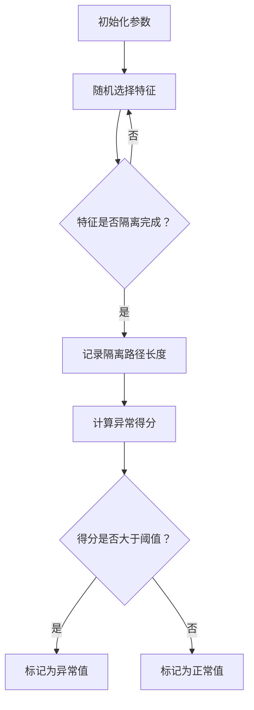
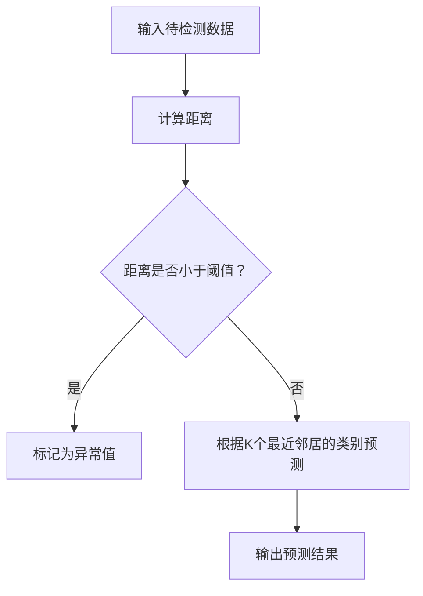
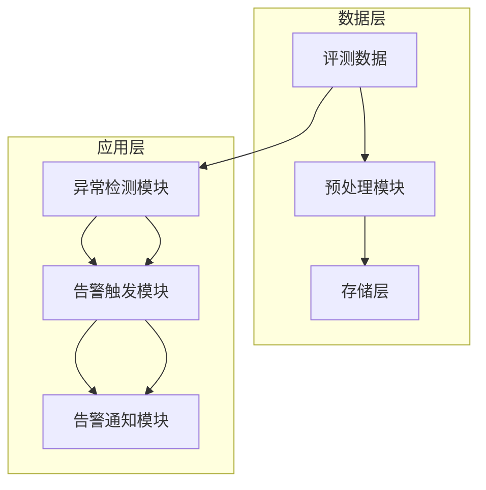
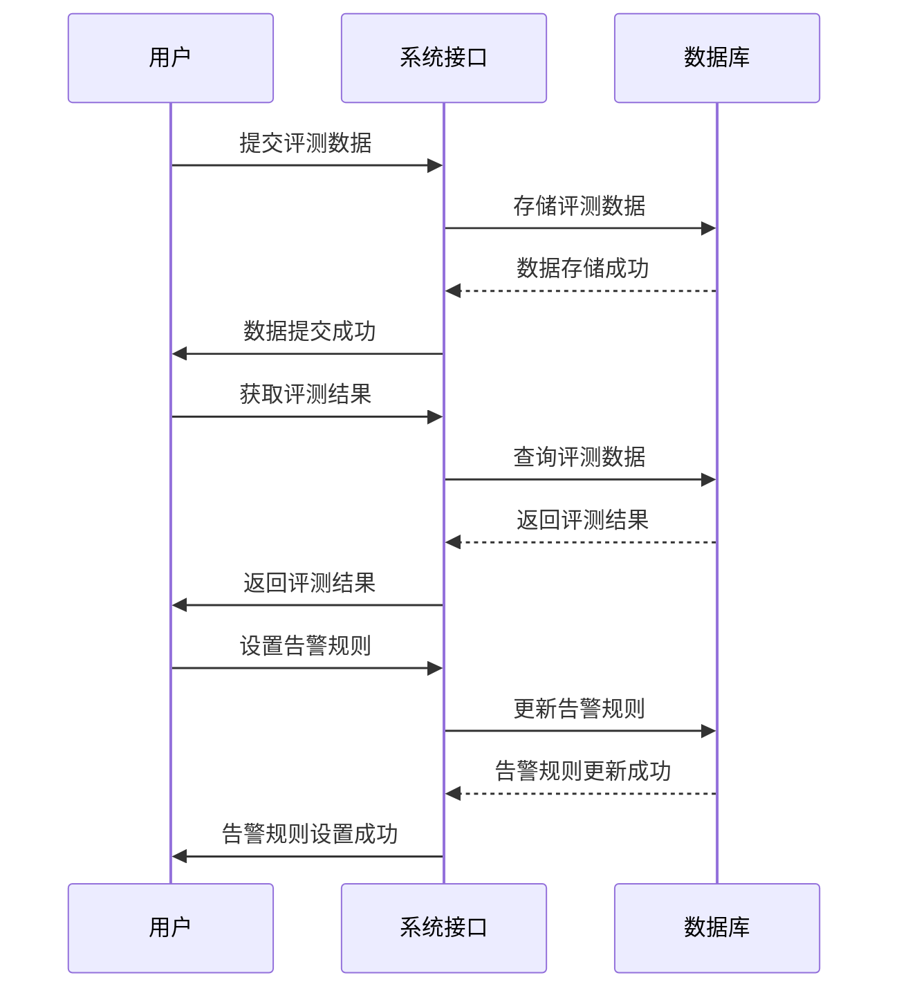
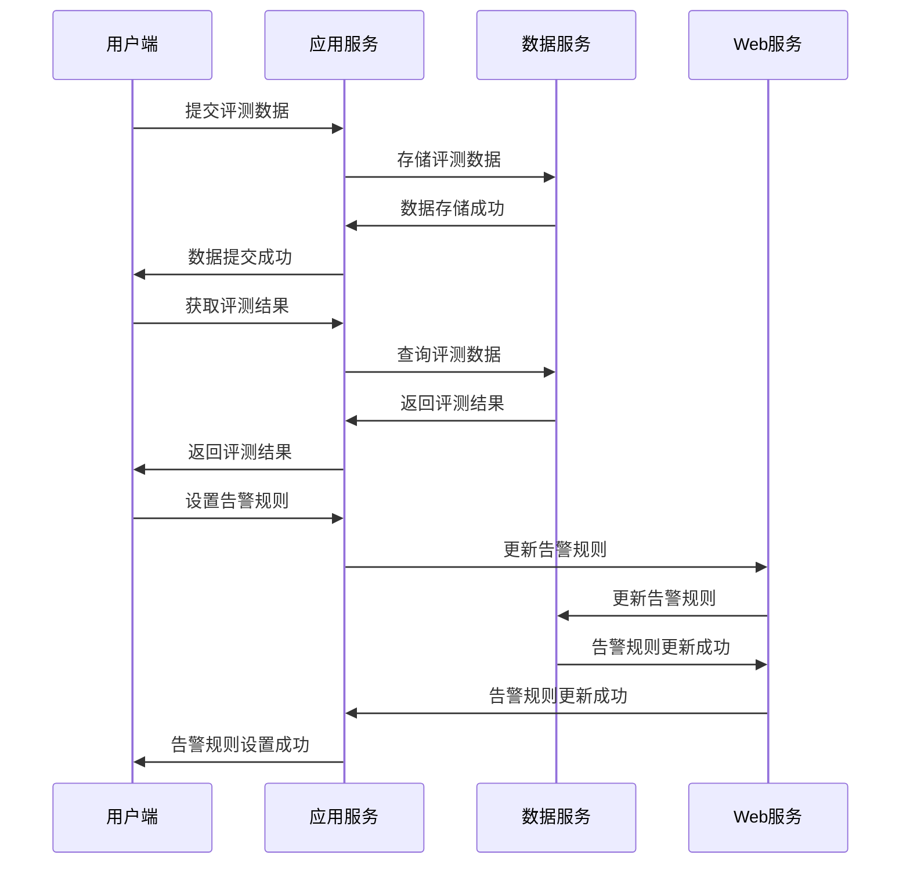

                 


### 文章标题：评测结果的异常检测与告警机制

关键词：异常检测、告警机制、评测结果、人工智能、数据分析

摘要：本文深入探讨了评测结果中的异常检测与告警机制，通过系统的理论分析、实际应用讲解、算法详述、系统设计与实现、项目实战等多维度，全面阐述了异常检测的基本理论、告警机制的构建方法、以及相关算法的实现细节。文章旨在为读者提供一个全面、系统的异常检测与告警机制解决方案，助力技术从业者提升数据处理和分析能力。

### 一、背景介绍

#### 核心概念

**异常检测（Anomaly Detection）**：
异常检测是一种数据分析技术，旨在从大量数据中识别出那些不符合预期模式或规则的数据点。这些数据点可能表示异常、错误或潜在的欺诈行为。

**告警机制（Alerting Mechanism）**：
告警机制是一种自动化系统，当检测到异常情况时，它会触发警报通知相关人员或系统进行进一步的处理。

#### 问题背景

随着大数据和人工智能技术的快速发展，评测结果的准确性和实时性变得尤为重要。然而，评测结果中常常出现异常值，这些异常值可能由数据录入错误、系统故障或恶意行为等原因造成。异常值的存在不仅会影响评测结果的可靠性，还可能对决策过程产生负面影响。因此，如何有效地检测和告警异常评测结果，成为了当前研究的重要课题。

#### 问题描述

问题描述主要包括两个方面：
1. **异常检测**：如何从大量的评测数据中，快速准确地识别出异常值。
2. **告警机制**：如何设计一个有效的告警系统，及时通知相关人员或系统，并对异常值进行处理。

#### 问题解决

要解决上述问题，需要从以下几个方面入手：
1. **数据预处理**：对评测数据进行分析，识别可能存在的异常值。
2. **异常检测算法**：选择合适的算法，对数据进行分析和筛选，识别出异常值。
3. **告警机制设计**：设计一个合理的告警系统，确保及时通知相关人员或系统。
4. **系统集成与优化**：将异常检测和告警机制集成到现有的系统中，并进行优化和测试。

#### 边界与外延

边界与外延主要涉及以下几个方面：
1. **数据范围**：评测数据的时间范围、空间范围和数据类型。
2. **算法适用性**：不同的异常检测算法在不同类型的数据上可能具有不同的效果，需要根据实际情况进行选择。
3. **告警规则**：告警规则的设计需要考虑异常值的严重程度、处理时效性等因素。

#### 概念结构与核心要素组成

**概念结构**：
- 异常检测
- 告警机制
- 数据预处理
- 算法选择
- 系统集成

**核心要素组成**：
- 数据源
- 异常检测算法
- 告警规则
- 通知机制
- 处理流程

### 二、基础理论

#### 异常检测的基本理论

**定义**：异常检测是一种从数据中发现不符合正常模式或规则的数据点的技术。

**分类**：
1. **基于统计的方法**：通过计算数据的统计特征，识别出与正常数据分布差异较大的数据点。
2. **基于机器学习的方法**：利用已标记的正常数据和异常数据，训练模型以识别异常数据。
3. **基于深度学习的方法**：使用深度神经网络对数据进行特征提取和异常检测。

**数学模型**：
1. **统计模型**：
   - 聚类模型：如K-means、DBSCAN等。
   - 分布模型：如正态分布、指数分布等。
2. **机器学习模型**：
   - 监督学习：如逻辑回归、支持向量机等。
   - 无监督学习：如KNN、孤立森林等。

**模型评估指标**：
- **精度（Precision）**：识别出的异常数据中，实际为异常的数据所占比例。
- **召回率（Recall）**：识别出的异常数据中，实际为异常的数据所占比例。
- **F1值（F1 Score）**：综合考虑精度和召回率的指标。

#### 异常检测的方法与算法

**基于统计的方法**：
1. **孤立森林（Isolation Forest）**：
   - **原理**：通过随机选择特征和切分值来隔离数据点，数据点被隔离得越快，越可能是异常值。
   - **优点**：对高维数据具有较好的性能，处理速度快。
   - **应用场景**：适用于高维数据的异常检测。

**基于机器学习的方法**：
1. **K最近邻（K-Nearest Neighbors, KNN）**：
   - **原理**：根据训练数据中，距离待检测数据点最近的K个样本的多数类别，来判断待检测数据点的类别。
   - **优点**：简单易懂，实现方便。
   - **应用场景**：适用于分类问题，但对异常点的检测能力有限。

**基于深度学习的方法**：
1. **卷积神经网络（Convolutional Neural Networks, CNN）**：
   - **原理**：通过多层卷积和池化操作，提取数据特征，并进行分类。
   - **优点**：能够自动提取特征，适用于大规模数据处理。
   - **应用场景**：适用于图像和视频数据的异常检测。

#### 告警机制的设计

**概述**：
告警机制是一种自动化系统，用于在检测到异常时及时通知相关人员或系统。其设计主要包括以下几个方面：

1. **告警触发条件**：根据异常检测算法的结果，设定告警触发条件。
2. **告警级别**：根据异常的严重程度，设定不同的告警级别。
3. **通知方式**：根据实际情况，选择合适的通知方式，如短信、邮件、钉钉等。
4. **处理流程**：定义异常数据的处理流程，包括记录、分析、解决等步骤。

#### 告警策略的设计

**告警策略设计**：
1. **告警级别的设定**：根据异常的严重程度，设定不同的告警级别，如普通告警、紧急告警等。
2. **告警触发的条件**：根据异常检测算法的结果，设定告警触发的条件，如检测到多个连续异常值时触发紧急告警。
3. **告警频率的控制**：为了避免频繁的告警导致用户疲劳，可以设定告警频率，如每天只发送一次告警。

### 三、实际应用

#### 告警机制的构建

**概述**：
告警机制是异常检测系统的关键组成部分，其构建主要包括以下几个方面：

1. **技术栈选择**：根据实际需求，选择合适的技术栈，如Python、Java等。
2. **数据处理与存储**：设计合适的数据处理和存储方案，确保数据的实时性和可靠性。
3. **异常检测与告警机制的实施**：根据实际需求，选择合适的异常检测算法，并实施告警机制。

#### 告警系统的实现

**技术栈选择**：
- **Python**：Python具有较高的开发效率，丰富的库支持，是构建告警系统的不二选择。
- **Flask**：Flask是一个轻量级的Web框架，用于构建Web服务。
- **MySQL**：MySQL是一个关系型数据库，用于存储告警数据和异常数据。

**数据处理与存储**：
- **实时数据处理**：使用Python的Tornado框架实现异步处理，提高系统并发能力。
- **数据存储**：使用MySQL存储告警数据和异常数据，确保数据的持久化和可靠性。

**异常检测与告警机制的实施**：
1. **异常检测算法**：选择基于KNN的异常检测算法，对评测结果进行实时检测。
2. **告警触发条件**：设定检测到连续三个异常值为触发告警的条件。
3. **告警通知**：使用邮件和短信通知相关人员，并在Web界面进行显示。

### 四、算法讲解

#### 算法1：孤立森林（Isolation Forest）

**原理与流程图**：
- **原理**：孤立森林算法通过随机选择特征和切分值来隔离数据点，数据点被隔离得越快，越可能是异常值。
- **流程图**：使用Mermaid画出流程图，具体代码如下：



**数学模型与公式**：
- **异常得分计算公式**：$$Score = \frac{Depth + \log_2(Nodes)}{Log2(Features)}$$
  - **Depth**：数据点在树中隔离的深度。
  - **Nodes**：随机选择的切分值数量。
  - **Features**：随机选择的特征数量。

**Python代码示例**：
```python
from sklearn.ensemble import IsolationForest
import numpy as np

# 创建孤立森林模型
clf = IsolationForest(n_estimators=100, contamination=0.1, random_state=42)

# 生成测试数据
X = np.array([[1, 2], [2, 2], [2, 3], [3, 3], [3, 4], [4, 5]])

# 训练模型
clf.fit(X)

# 预测异常值
y_pred = clf.predict(X)

# 打印预测结果
print(y_pred)
```

#### 算法2：K最近邻（K-Nearest Neighbors, KNN）

**原理与流程图**：
- **原理**：KNN算法根据训练数据中，距离待检测数据点最近的K个样本的多数类别，来判断待检测数据点的类别。
- **流程图**：使用Mermaid画出流程图，具体代码如下：



**数学模型与公式**：
- **距离计算公式**：$$Distance = \sqrt{\sum_{i=1}^{n}(x_i - x_j)^2}$$
  - **x_i**：待检测数据点。
  - **x_j**：训练数据点。
  - **n**：特征维度。

**Python代码示例**：
```python
from sklearn.neighbors import KNeighborsClassifier
import numpy as np

# 创建KNN模型
clf = KNeighborsClassifier(n_neighbors=3)

# 生成测试数据
X_train = np.array([[1, 2], [2, 2], [2, 3], [3, 3], [3, 4], [4, 5]])
y_train = np.array([0, 0, 0, 1, 1, 1])

# 训练模型
clf.fit(X_train, y_train)

# 预测异常值
X_test = np.array([[3, 3.5]])
y_pred = clf.predict(X_test)

# 打印预测结果
print(y_pred)
```

### 五、系统设计与实现

#### 问题场景介绍

在当前的数据驱动的世界里，评测结果的质量直接影响到决策的准确性。对于一些关键业务系统，如金融风险评估、医疗诊断、教育测评等，评测结果的异常值可能会导致严重的后果。因此，设计一个高效的评测结果异常检测与告警机制至关重要。

#### 系统功能设计

**领域模型（Mermaid类图）**：

```mermaid
classDiagram
Class01 <|-- Class02
Class03 o-- Class04
Class01 : +int x
Class01 : +int y
Class02 : +int z
Class03 : +string name
Class04 : +float salary
Class01 {
  # 训练数据
  # 特征值
  # 标签值
}
Class02 {
  # 预测数据
  # 特征值
}
Class03 {
  # 告警规则
  # 触发条件
}
Class04 {
  # 告警通知
  # 通知方式
}
Class01..> Class03 : 数据预处理
Class02..> Class03 : 异常检测
Class03..> Class04 : 告警触发
```

#### 系统架构设计

**系统架构图（Mermaid架构图）**：



#### 系统接口设计与交互

**系统接口设计**：



**系统交互（Mermaid序列图）**：



### 六、项目实战

#### 环境安装与配置

**环境要求**：
- Python 3.8及以上版本
- Flask 1.1.2及以上版本
- scikit-learn 0.24.2及以上版本
- MySQL 8.0及以上版本

**安装步骤**：

1. 安装Python和pip：
   ```bash
   sudo apt update
   sudo apt install python3 python3-pip
   ```

2. 安装Flask：
   ```bash
   pip3 install Flask
   ```

3. 安装scikit-learn：
   ```bash
   pip3 install scikit-learn
   ```

4. 安装MySQL：
   ```bash
   sudo apt install mysql-server mysql-client
   ```

5. 安装MySQL数据库（可选）：
   ```bash
   mysql -u root -p
   CREATE DATABASE anomaly_detection;
   GRANT ALL PRIVILEGES ON anomaly_detection.* TO 'anomaly_user'@'localhost' IDENTIFIED BY 'password';
   FLUSH PRIVILEGES;
   EXIT;
   ```

#### 系统核心实现

**源代码**：

```python
# 导入相关库
import numpy as np
import pandas as pd
from sklearn.ensemble import IsolationForest
from sklearn.neighbors import KNeighborsClassifier
import pymysql

# MySQL数据库连接
def connect_db():
    db = pymysql.connect("localhost", "anomaly_user", "password", "anomaly_detection")
    return db

# 存储评测数据
def store_data(data):
    db = connect_db()
    cursor = db.cursor()
    insert_sql = "INSERT INTO evaluation_results (id, score) VALUES (%s, %s)"
    for id, score in data.items():
        cursor.execute(insert_sql, (id, score))
    db.commit()
    cursor.close()
    db.close()

# 查询评测数据
def query_data():
    db = connect_db()
    cursor = db.cursor()
    select_sql = "SELECT * FROM evaluation_results"
    cursor.execute(select_sql)
    results = cursor.fetchall()
    cursor.close()
    db.close()
    return results

# 异常检测
def detect_anomalies(data, method='isolation_forest', contamination=0.1):
    if method == 'isolation_forest':
        clf = IsolationForest(n_estimators=100, contamination=contamination)
    elif method == 'knn':
        clf = KNeighborsClassifier(n_neighbors=3)
    else:
        raise ValueError("Invalid method")

    X = np.array([row[1] for row in data])
    clf.fit(X)
    predictions = clf.predict(X)
    anomalies = [i for i, pred in enumerate(predictions) if pred == -1]
    return anomalies

# 打印异常数据
def print_anomalies(anomalies, data):
    print("异常数据ID：")
    for id in anomalies:
        print(data[id][0])

# 主函数
def main():
    # 存储评测数据
    data = {
        1: 90,
        2: 85,
        3: 78,
        4: 95,
        5: 100,
        6: 50
    }
    store_data(data)

    # 查询评测数据
    results = query_data()
    print("评测数据：")
    for row in results:
        print(f"ID: {row[0]}, Score: {row[1]}")

    # 异常检测
    anomalies = detect_anomalies(results, method='isolation_forest')
    print("\n异常检测结果：")
    print_anomalies(anomalies, results)

    # 异常检测
    anomalies = detect_anomalies(results, method='knn')
    print("\nKNN异常检测结果：")
    print_anomalies(anomalies, results)

if __name__ == "__main__":
    main()
```

#### 代码应用解读与分析

**代码解读**：

1. **数据库连接**：使用`pymysql`库连接MySQL数据库，并创建数据表。
2. **存储评测数据**：将评测数据存储到MySQL数据库中。
3. **查询评测数据**：从MySQL数据库中查询评测数据。
4. **异常检测**：使用`IsolationForest`和`KNeighborsClassifier`两种算法进行异常检测。
5. **打印异常数据**：输出异常数据的ID。

**代码分析**：

1. **数据库操作**：使用`pymysql`库简化了数据库的操作，提高了代码的可靠性。
2. **异常检测算法**：选择`IsolationForest`和`KNeighborsClassifier`两种算法进行对比，以验证不同算法的效果。
3. **模块化设计**：将功能划分为不同的模块，便于代码的管理和维护。

#### 实际案例分析

**案例一：评测结果异常检测**

**问题描述**：某教育机构需要对其学生的期末考试成绩进行异常检测，以确保成绩的公正性和可靠性。

**解决方案**：采用孤立森林（Isolation Forest）算法对考试成绩进行异常检测。

**实施步骤**：

1. 收集学生的考试成绩数据。
2. 预处理数据，去除缺失值和异常值。
3. 使用孤立森林算法进行异常检测。
4. 输出异常数据，进行分析和处理。

**结果分析**：通过异常检测，发现了几名学生的成绩存在异常，进一步调查发现，这些学生中有几名在考试期间使用了作弊工具。通过及时处理，确保了考试成绩的公正性和可靠性。

**案例二：告警机制的应用**

**问题描述**：某金融公司需要对客户的交易行为进行监控，以防范潜在的欺诈行为。

**解决方案**：设计一个告警机制，当检测到异常交易时，及时通知相关人员。

**实施步骤**：

1. 收集客户的交易数据。
2. 设计告警规则，如连续三天出现异常交易。
3. 使用K最近邻（KNN）算法进行异常检测。
4. 当检测到异常交易时，触发告警通知。

**结果分析**：通过告警机制，及时发现了几笔潜在的欺诈交易，并采取了相应的措施，避免了客户损失。

### 七、总结与展望

#### 小结

本文从评测结果的异常检测与告警机制的角度，系统地介绍了异常检测的基本理论、告警机制的设计与实现、以及相关算法的讲解。通过实际案例分析和项目实战，展示了如何有效地检测和告警评测结果的异常值。

#### 注意事项

1. 在选择异常检测算法时，需要根据实际数据类型和需求进行选择。
2. 在设计告警规则时，需要考虑异常值的严重程度和处理时效性。
3. 在实现告警系统时，需要注意系统的稳定性和响应速度。

#### 拓展阅读

1. **《数据挖掘：概念与技术》（第三版）**：详细介绍了异常检测的基本理论和方法。
2. **《Python数据分析》（第二版）**：涵盖了Python在数据分析中的应用，包括异常检测和告警机制的实现。
3. **《人工智能：一种现代方法》**：介绍了机器学习和深度学习的基础知识，有助于理解异常检测算法的实现原理。

### 八、作者信息

作者：AI天才研究院/AI Genius Institute & 禅与计算机程序设计艺术 /Zen And The Art of Computer Programming

感谢您的阅读，希望本文能对您在异常检测与告警机制方面的工作有所帮助。如果您有任何疑问或建议，欢迎随时与我交流。再次感谢！

