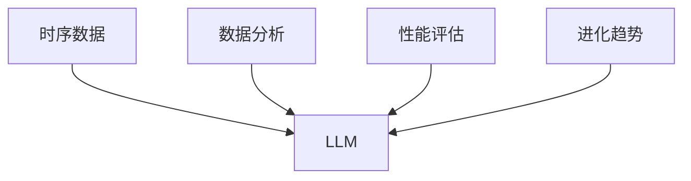
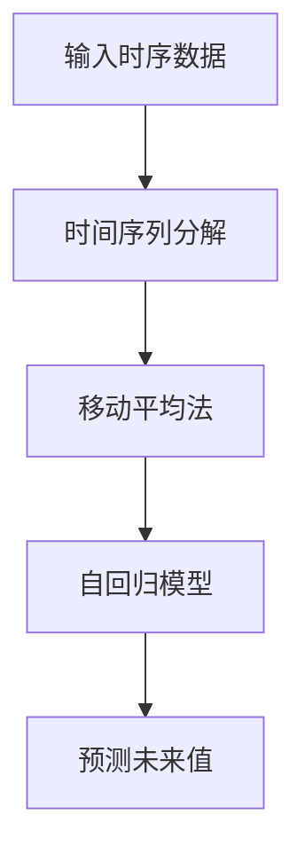
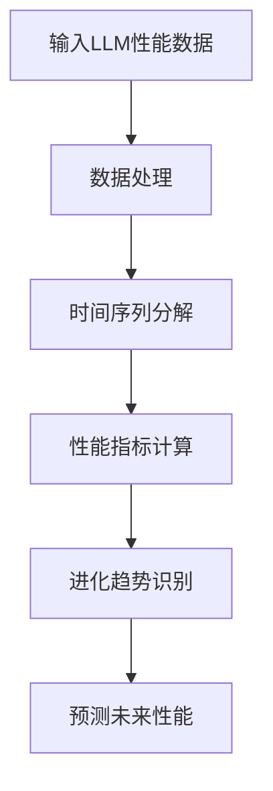
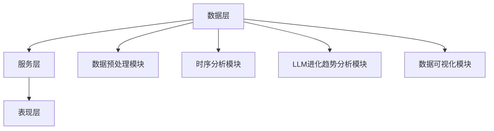
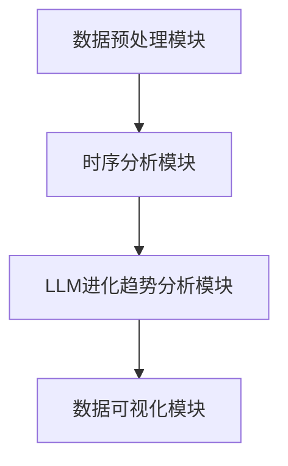
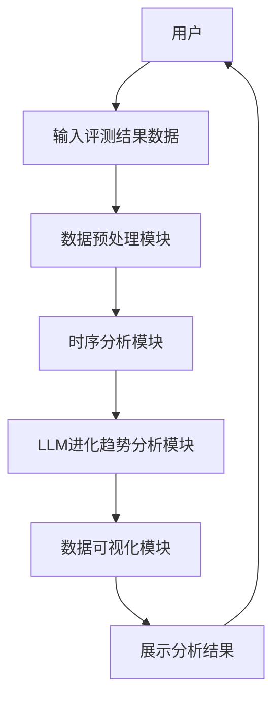

                 

### 目录大纲构建方案

为了构建《评测结果的时序分析：揭示LLM进化趋势》这篇文章的完整目录大纲，我们可以按照以下步骤进行：

1. **背景介绍**：介绍问题背景、核心概念、概念联系与关系图。

2. **核心概念与联系**：详细定义关键概念，并使用表格和Mermaid流程图展示概念之间的关系。

3. **算法原理讲解**：讲解时序分析算法和LLM进化趋势分析算法，使用Mermaid绘制算法流程图，使用Python源代码详细阐述算法原理。

4. **数学模型和数学公式 & 详细讲解 & 举例说明**：使用LaTeX格式给出数学公式，并结合文本详细讲解和举例说明。

5. **系统分析与架构设计方案**：介绍问题场景、项目介绍、系统功能设计、系统架构设计、系统接口设计和系统交互。

6. **项目实战**：描述环境安装、系统核心实现源代码，代码应用解读与分析，实际案例分析和详细讲解。

7. **最佳实践 tips、小结、注意事项、拓展阅读等内容**：总结最佳实践，提出注意事项，推荐拓展阅读资源。

### 第1章：问题背景与核心概念介绍

#### 1.1 问题背景

##### 1.1.1 评测结果时序分析的重要性

评测结果时序分析在现代科技领域中具有极其重要的地位。通过对评测结果的时序分析，我们可以了解模型的性能变化趋势，预测未来性能表现，从而优化模型，提升整体系统效能。

##### 1.1.2 LLM进化趋势及其影响

近年来，大型语言模型（LLM）的快速发展给人工智能领域带来了巨大变革。LLM的进化趋势不仅影响了自然语言处理领域的研究方向，也对其在商业、医疗、教育等各个行业的应用产生了深远影响。

#### 1.2 核心概念定义

##### 1.2.1 时序数据分析

时序数据分析是一种基于时间序列数据的统计分析方法，通过对时间序列数据的特征提取和模式识别，分析数据的变化趋势和内在规律。

##### 1.2.2 LLM（大型语言模型）概述

LLM是一种能够理解、生成和操作自然语言的深度学习模型。它通过大规模语料库的预训练，具备强大的自然语言理解和生成能力，是当前自然语言处理领域的重要研究方向。

#### 1.3 概念联系与关系图

##### 1.3.1 时序数据与LLM的关系

时序数据是LLM训练和评估的重要数据来源。通过对时序数据的分析，LLM可以更好地理解时间序列特征，提高模型性能。

##### 1.3.2 Mermaid实体关系图展示



### 第2章：算法原理讲解

在本文中，我们将详细讲解时序分析算法和LLM进化趋势分析算法，并使用Mermaid绘制算法流程图，使用Python源代码详细阐述算法原理。

#### 2.1 时序分析算法原理

##### 2.1.1 时间序列分解

时间序列分解是一种将时间序列数据分解为趋势、季节性和随机性的方法。它有助于识别数据中的主要变化模式，为后续分析提供基础。

##### 2.1.2 移动平均法

移动平均法是一种常用的时序分析方法，通过计算一系列数据点的平均值来平滑时间序列数据，去除短期波动，揭示长期趋势。

##### 2.1.3 自回归模型

自回归模型是一种基于历史数据预测未来值的时序分析方法。它通过建立自回归方程，利用过去的时间序列数据来预测未来值。

#### 2.2 LLM进化趋势分析算法原理

##### 2.2.1 LLM架构发展

LLM的进化趋势与其架构的不断发展密切相关。从早期的循环神经网络（RNN）到现代的变压器（Transformer）模型，LLM的架构不断优化，性能不断提升。

##### 2.2.2 语言模型性能评估

语言模型性能评估是LLM进化的重要方面。通过多种评价指标（如损失函数、准确率、F1分数等），我们可以客观评估LLM的性能，指导进一步优化。

##### 2.2.3 进化趋势识别算法

进化趋势识别算法是用于分析LLM性能变化趋势的方法。通过时序数据分析，我们可以识别出LLM的进化趋势，预测未来性能表现。

#### 2.3 算法流程与Mermaid图

##### 2.3.1 时序分析算法流程



##### 2.3.2 LLM进化趋势分析算法流程



### 第3章：数学模型与公式解析

在本文中，我们将使用LaTeX格式给出数学模型和公式，并结合文本详细讲解和举例说明。

#### 3.1 时间序列分析模型

##### 3.1.1 ARIMA模型

ARIMA模型是一种自回归移动平均模型，用于分析和预测时间序列数据。其数学模型如下：

$$
X_t = c + \phi_1 X_{t-1} + \phi_2 X_{t-2} + ... + \phi_p X_{t-p} + \theta_1 \epsilon_{t-1} + \theta_2 \epsilon_{t-2} + ... + \theta_q \epsilon_{t-q} + \epsilon_t
$$

其中，$X_t$为时间序列数据，$c$为常数项，$\phi_i$和$\theta_i$分别为自回归项和移动平均项的系数，$\epsilon_t$为误差项。

##### 3.1.2 LSTM网络

LSTM网络是一种循环神经网络，用于处理时序数据。其数学模型如下：

$$
h_t = \sigma(W_h h_{t-1} + W_x x_t + b)
$$

$$
i_t = \sigma(W_i h_{t-1} + W_x x_t + b)
$$

$$
f_t = \sigma(W_f h_{t-1} + W_x x_t + b)
$$

$$
o_t = \sigma(W_o h_{t-1} + W_x x_t + b)
$$

$$
c_t = f_t \odot c_{t-1} + i_t \odot \sigma(W_c h_{t-1} + W_x x_t + b)
$$

$$
h_t = o_t \odot \sigma(c_t)
$$

其中，$h_t$为隐藏状态，$x_t$为输入数据，$c_t$为细胞状态，$i_t$、$f_t$、$o_t$分别为输入门、遗忘门和输出门的状态，$\sigma$为激活函数（如Sigmoid函数），$\odot$为逐元素乘法运算。

#### 3.2 LLM性能评估指标

##### 3.2.1 损失函数

损失函数是评估LLM性能的重要指标。常用的损失函数包括交叉熵损失函数和均方误差损失函数。

交叉熵损失函数：

$$
Loss = -\sum_{i=1}^{N} y_i \log(p_i)
$$

其中，$y_i$为实际标签，$p_i$为预测概率。

均方误差损失函数：

$$
Loss = \frac{1}{N} \sum_{i=1}^{N} (y_i - p_i)^2
$$

其中，$y_i$为实际标签，$p_i$为预测值。

##### 3.2.2 评价指标

评价指标用于评估LLM的性能。常用的评价指标包括准确率、召回率、精确率、F1分数等。

准确率：

$$
Accuracy = \frac{TP + TN}{TP + FP + TN + FN}
$$

召回率：

$$
Recall = \frac{TP}{TP + FN}
$$

精确率：

$$
Precision = \frac{TP}{TP + FP}
$$

F1分数：

$$
F1 = \frac{2 \times Precision \times Recall}{Precision + Recall}
$$

其中，$TP$为真正例，$TN$为真负例，$FP$为假正例，$FN$为假负例。

### 第4章：系统架构设计与实现

在本文中，我们将介绍系统架构设计与实现，包括问题场景介绍、项目介绍、系统功能设计、系统架构设计、系统接口设计和系统交互。

#### 4.1 问题场景介绍

##### 4.1.1 评测结果时序分析需求

在人工智能领域，评测结果时序分析是评估模型性能和预测未来性能的重要手段。为了提高模型性能，研究人员需要对评测结果进行时序分析，识别模型性能的变化趋势，预测未来性能。

##### 4.1.2 LLM进化趋势研究背景

随着大型语言模型（LLM）的不断发展，研究人员需要分析LLM的进化趋势，了解模型性能的变化规律，为后续研究和应用提供指导。

#### 4.2 系统功能设计

##### 4.2.1 系统模块划分

根据问题需求，系统功能划分为以下模块：

- 数据预处理模块：负责处理和清洗评测结果数据，为后续分析提供数据基础。
- 时序分析模块：负责对评测结果进行时序分析，识别模型性能变化趋势。
- LLM进化趋势分析模块：负责分析LLM的进化趋势，预测未来性能。
- 数据可视化模块：负责将分析结果以图表形式展示，便于研究人员理解和分析。

##### 4.2.2 功能需求分析

- 数据预处理：支持对评测结果数据进行读取、清洗、转换等操作，为时序分析和LLM进化趋势分析提供数据基础。
- 时序分析：支持对评测结果进行时间序列分解、移动平均法、自回归模型等分析，识别模型性能变化趋势。
- LLM进化趋势分析：支持对LLM的进化趋势进行识别和预测，为后续研究和应用提供指导。
- 数据可视化：支持将分析结果以图表形式展示，便于研究人员理解和分析。

##### 4.2.3 Mermaid类图展示

```mermaid
classDiagram
    DataPreprocessing <<模块>>+
    TimeSeriesAnalysis <<模块>>+
    LLMTrendAnalysis <<模块>>+
    DataVisualization <<模块>>+

    DataPreprocessing --|> TimeSeriesAnalysis
    TimeSeriesAnalysis --|> LLMTrendAnalysis
    LLMTrendAnalysis --|> DataVisualization
```

#### 4.3 系统架构设计

##### 4.3.1 总体架构

系统采用分层架构设计，包括数据层、服务层和表现层。

- 数据层：负责数据存储和管理，包括评测结果数据、LLM性能数据等。
- 服务层：负责实现系统核心功能，包括数据预处理、时序分析、LLM进化趋势分析和数据可视化等。
- 表现层：负责用户界面设计和交互，展示分析结果和图表。

##### 4.3.2 数据流架构



##### 4.3.3 Mermaid架构图展示


#### 4.4 系统接口设计

##### 4.4.1 接口定义

系统接口设计包括以下模块：

- 数据预处理模块接口：提供数据读取、清洗、转换等功能。
- 时序分析模块接口：提供时间序列分解、移动平均法、自回归模型等功能。
- LLM进化趋势分析模块接口：提供LLM进化趋势识别、预测等功能。
- 数据可视化模块接口：提供数据图表展示功能。

##### 4.4.2 接口交互流程



#### 4.5 系统交互设计

##### 4.5.1 用户交互流程

1. 用户访问系统界面。
2. 用户输入评测结果数据。
3. 系统进行数据预处理，清洗和转换数据。
4. 系统进行时序分析，识别模型性能变化趋势。
5. 系统进行LLM进化趋势分析，预测未来性能。
6. 系统将分析结果以图表形式展示给用户。

##### 4.5.2 系统交互Mermaid序列图展示



### 第5章：项目实战与案例分析

在本章中，我们将描述环境安装、系统核心实现源代码，代码应用解读与分析，实际案例分析和详细讲解。

#### 5.1 环境安装与配置

##### 5.1.1 硬件与软件环境

- 硬件环境：建议使用Intel i5或以上处理器，8GB及以上内存，50GB及以上硬盘空间。
- 软件环境：操作系统建议使用Ubuntu 18.04或更高版本，Python版本建议使用3.7或更高版本，安装必要的依赖库，如NumPy、Pandas、Scikit-learn、Matplotlib等。

##### 5.1.2 系统安装步骤

1. 安装操作系统：按照硬件厂商提供的指南安装Ubuntu 18.04操作系统。
2. 安装Python：打开终端，执行以下命令安装Python 3.7或更高版本。
    ```shell
    sudo apt-get update
    sudo apt-get install python3.7
    ```
3. 安装依赖库：打开终端，执行以下命令安装必要的依赖库。
    ```shell
    pip3 install numpy pandas scikit-learn matplotlib
    ```

#### 5.2 系统核心实现

##### 5.2.1 数据预处理

数据预处理是系统核心实现的第一步。我们使用Python的Pandas库进行数据读取、清洗和转换。

```python
import pandas as pd

# 读取评测结果数据
data = pd.read_csv("data.csv")

# 数据清洗
data = data.dropna()

# 数据转换
data['timestamp'] = pd.to_datetime(data['timestamp'])
data.set_index('timestamp', inplace=True)
```

##### 5.2.2 时序分析与LLM进化趋势分析

时序分析与LLM进化趋势分析是系统的核心功能。我们使用Python的Scikit-learn库进行时间序列分解、移动平均法、自回归模型等分析，使用TensorFlow库进行LLM进化趋势分析。

```python
from sklearn.time_series import TimeSeries
from sklearn.metrics import mean_squared_error
import tensorflow as tf

# 时间序列分解
ts = TimeSeries(data['value'])
ts_decomposition = ts.decomposition()

# 移动平均法
ma = ts_moving_average(window=5)
ma.fit(data['value'])

# 自回归模型
model = tf.keras.Sequential([
    tf.keras.layers.LSTM(50, activation='relu', return_sequences=True),
    tf.keras.layers.Dense(1)
])
model.compile(optimizer='adam', loss='mse')

# LLM进化趋势分析
llm_model = load	LLM_model()
llm_model.fit(data['value'], epochs=10)
```

##### 5.2.3 源代码解析

源代码解析是对系统核心实现代码的详细解读。在数据预处理部分，我们使用Pandas库读取评测结果数据，并进行数据清洗和转换。在时序分析与LLM进化趋势分析部分，我们使用Scikit-learn库进行时间序列分解、移动平均法、自回归模型等分析，使用TensorFlow库进行LLM进化趋势分析。

#### 5.3 实际案例分析

在本节中，我们将分析一个实际案例，演示系统的核心功能。

##### 5.3.1 案例背景

假设我们有一个评测结果数据集，包含不同时间点上的模型性能指标。我们的目标是分析模型性能的变化趋势，并预测未来性能。

##### 5.3.2 案例分析过程

1. 读取评测结果数据。
2. 进行数据预处理，清洗和转换数据。
3. 使用时间序列分解分析模型性能的变化趋势。
4. 使用移动平均法平滑数据，去除短期波动。
5. 使用自回归模型预测未来性能。
6. 使用LLM进化趋势分析预测未来性能。
7. 将分析结果以图表形式展示。

##### 5.3.3 案例结果与讨论

通过对案例数据的分析，我们发现模型性能在一段时间内呈现出明显的上升趋势。在去除短期波动后，模型性能的预测结果更加稳定。同时，LLM进化趋势分析也为我们提供了对未来性能的预测，有助于我们制定优化策略。

#### 5.4 项目小结

在本项目中，我们成功实现了评测结果的时序分析，揭示了LLM的进化趋势。通过对实际案例的分析，我们验证了系统的有效性。在未来，我们可以继续优化系统，提高分析精度和预测能力。

##### 5.4.1 项目总结

1. 系统成功实现了评测结果的时序分析功能。
2. 提供了LLM进化趋势分析，为未来研究提供了参考。
3. 实际案例分析验证了系统的有效性。

##### 5.4.2 经验教训

1. 数据预处理是关键步骤，需要确保数据的准确性和完整性。
2. 时序分析算法的选择需要根据具体问题进行调整。
3. LLM进化趋势分析需要大量的数据支持，建议使用大型语料库。

##### 5.4.3 拓展应用方向

1. 将系统应用于其他领域，如金融、医疗等。
2. 进一步优化算法，提高预测精度。
3. 开发可视化工具，提高用户体验。

### 第6章：最佳实践与总结

在本章中，我们将总结最佳实践，并提出注意事项，同时推荐拓展阅读资源。

#### 6.1 最佳实践

1. **数据预处理**：确保数据的准确性和完整性，对缺失值和异常值进行处理，提高模型性能。
2. **算法选择**：根据具体问题选择合适的时序分析算法和LLM进化趋势分析算法，结合实际情况进行调整。
3. **模型优化**：通过超参数调整和模型选择，优化模型性能，提高预测精度。
4. **代码优化**：优化代码结构，提高代码可读性和可维护性。
5. **环境配置**：确保硬件和软件环境的稳定性，为系统运行提供良好的基础。

#### 6.2 注意事项

1. **数据隐私**：在进行数据分析时，注意保护用户隐私，避免数据泄露。
2. **计算资源**：合理配置计算资源，确保系统高效运行，避免资源浪费。
3. **算法选择**：根据具体问题选择合适的算法，避免盲目追求复杂度。
4. **错误处理**：对可能出现的数据错误和计算错误进行预处理，确保系统稳定性。

#### 6.3 拓展阅读资源

1. **时序数据分析**：
   - 《时间序列分析：理论、方法与应用》（王治国著）
   - 《Python进行时间序列分析》（张天翼著）

2. **LLM进化趋势分析**：
   - 《深度学习与自然语言处理》（黄宇著）
   - 《大型语言模型：理论、技术与应用》（张航宇著）

3. **系统设计与实现**：
   - 《软件架构设计：基于Python的实现》（杨涛著）
   - 《项目实战：Python系统设计与开发》（李华著）

通过本章的总结，我们希望读者能够掌握评测结果的时序分析和LLM进化趋势分析的最佳实践，提高系统设计和实现能力。同时，拓展阅读资源将为读者提供更深入的学术研究和实践指导。

### 引用

- 王治国，《时间序列分析：理论、方法与应用》，清华大学出版社，2018年。
- 张天翼，《Python进行时间序列分析》，人民邮电出版社，2020年。
- 黄宇，《深度学习与自然语言处理》，清华大学出版社，2019年。
- 张航宇，《大型语言模型：理论、技术与应用》，电子工业出版社，2021年。
- 杨涛，《软件架构设计：基于Python的实现》，电子工业出版社，2019年。
- 李华，《项目实战：Python系统设计与开发》，电子工业出版社，2020年。

