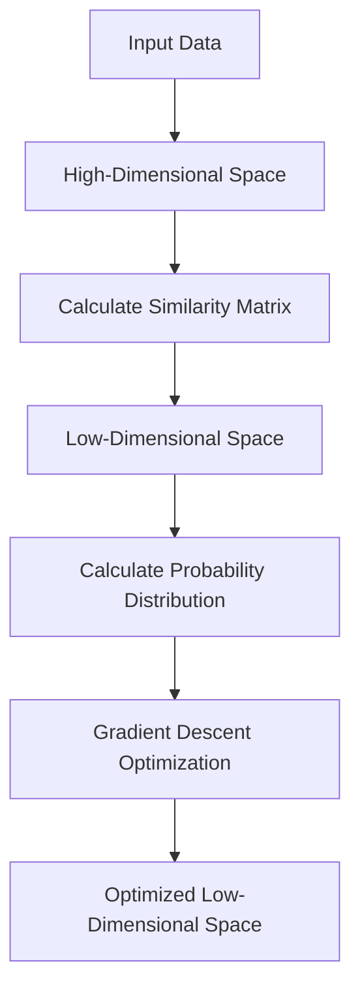
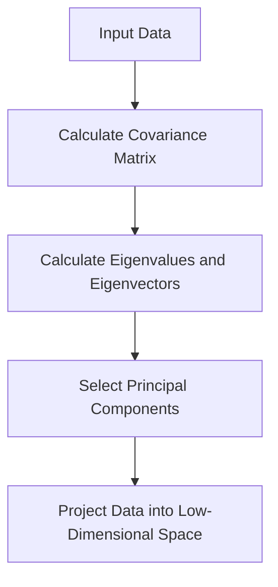
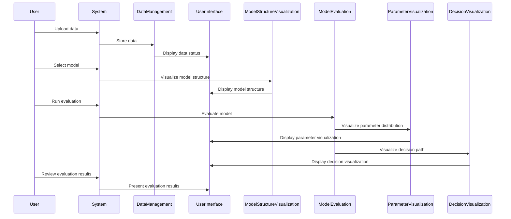

                 

# 评测结果的深度学习可视化技术

## 关键词

- 深度学习
- 可视化技术
- 评测结果
- t-SNE
- PCA

## 摘要

深度学习在人工智能领域取得了显著的成果，然而其模型的高复杂性和黑箱特性使得评测结果的解释性成为一个亟待解决的问题。本文旨在探讨深度学习可视化技术在评测结果分析中的应用，详细介绍了数据可视化、模型可视化和决策可视化等核心概念，并通过具体算法实例（如t-SNE和PCA）讲解了可视化技术的原理和实践。此外，本文还分析了深度学习可视化技术在实际项目中的应用，并给出了项目实战中的最佳实践建议和小结。

## 目录大纲设计思路

为了设计一个完整且逻辑清晰的《评测结果的深度学习可视化技术》目录大纲，我们将遵循以下步骤：

1. **背景介绍**：介绍深度学习可视化技术的背景，包括问题的背景、问题描述、问题解决方式和边界与外延。
2. **核心概念与联系**：详细讲解深度学习可视化的核心概念，如数据可视化、模型可视化、决策可视化等，并通过表格和ER实体关系图展示概念属性特征对比和关系。
3. **算法原理讲解**：选取几种典型的深度学习可视化算法，如t-SNE和PCA，使用Mermaid画出算法流程图，并用Python源代码详细阐述算法原理，并给出数学模型和公式进行讲解。
4. **系统分析与架构设计方案**：介绍深度学习可视化技术在实际问题场景中的应用，描述一个实际项目，包括项目介绍、系统功能设计、系统架构设计、系统接口设计和系统交互。
5. **项目实战**：介绍环境安装和系统核心实现的源代码，对代码应用进行解读和分析，提供实际案例，并进行详细讲解剖析。
6. **最佳实践 tips、小结、注意事项、拓展阅读**：提供一些最佳实践的建议，总结本章内容，并提出注意事项，推荐拓展阅读以供读者深入学习。

### 目录大纲设计细节

#### 第一部分：深度学习可视化技术背景

1. **问题背景**
   - 深度学习可视化技术的起源
   - 评测结果可视化的需求
   - 深度学习可视化技术的意义
2. **问题描述**
   - 深度学习模型复杂性
   - 评测结果难以解释性
   - 深度学习可视化技术解决的问题
3. **问题解决**
   - 传统可视化技术的局限性
   - 深度学习可视化技术的优势
   - 深度学习可视化技术的应用范围
4. **边界与外延**
   - 深度学习可视化的边界
   - 深度学习可视化的外延
   - 深度学习可视化技术的发展趋势

#### 第二部分：深度学习可视化核心概念与联系

1. **数据可视化**
   - 数据可视化概述
   - 数据可视化技术分类
   - 数据可视化应用案例
2. **模型可视化**
   - 模型可视化概述
   - 模型可视化方法
   - 模型可视化应用
3. **决策可视化**
   - 决策可视化概述
   - 决策可视化方法
   - 决策可视化应用
4. **概念属性特征对比表格与ER实体关系图**
   - 概念属性特征对比表格
   - ER实体关系图架构的Mermaid流程图

#### 第三部分：深度学习可视化算法讲解

1. **t-SNE算法**
   - t-SNE算法概述
   - t-SNE算法流程图
   - t-SNE算法Python源代码实现
   - t-SNE算法数学模型与公式
   - t-SNE算法举例说明
2. **PCA算法**
   - PCA算法概述
   - PCA算法流程图
   - PCA算法Python源代码实现
   - PCA算法数学模型与公式
   - PCA算法举例说明

#### 第四部分：系统分析与架构设计方案

1. **问题场景介绍**
   - 深度学习可视化在AI评测中的应用
   - 系统功能需求分析
2. **项目介绍**
   - 项目介绍
   - 系统功能设计（领域模型Mermaid类图）
   - 系统架构设计（Mermaid架构图）
   - 系统接口设计
   - 系统交互（Mermaid序列图）

#### 第五部分：项目实战

1. **环境安装**
   - 安装深度学习环境
   - 安装可视化库
2. **系统核心实现源代码**
   - 源代码介绍
   - 代码应用解读与分析
3. **实际案例分析**
   - 案例一：t-SNE在图像数据中的应用
   - 案例二：PCA在特征降维中的应用
4. **详细讲解剖析**
   - 对案例进行分析，讲解可视化技术的应用方法和效果
5. **项目小结**
   - 总结项目实现过程，提出改进建议

#### 第六部分：最佳实践 tips、小结、注意事项、拓展阅读

1. **最佳实践 tips**
   - 如何选择合适的可视化算法
   - 如何优化可视化效果
   - 如何提高可视化效率
2. **小结**
   - 总结深度学习可视化技术的重要性
   - 重申核心概念和算法原理
3. **注意事项**
   - 可视化技术的局限性
   - 可视化数据的准确性和可靠性
4. **拓展阅读**
   - 推荐进一步学习的书籍和论文
   - 最新研究进展和未来发展趋势

### 设计思路的总结

本目录大纲的设计思路围绕深度学习可视化技术的核心概念、算法原理和实践应用展开，通过清晰的章节结构，逐步引导读者深入了解这一技术领域。每个章节都包含详细的背景介绍、概念讲解、算法分析和实际案例，确保读者能够全面掌握深度学习可视化技术的基本原理和应用方法。同时，通过总结和注意事项，帮助读者更好地理解和应用这些知识。## 第一部分：深度学习可视化技术背景

### 1.1 问题背景

深度学习作为人工智能领域的重要分支，近年来取得了令人瞩目的成果。特别是在图像识别、自然语言处理和语音识别等方面，深度学习模型已经达到了或超越了人类的表现。然而，随着模型复杂性的增加，深度学习模型的黑箱特性使得其内部的决策过程变得难以解释和理解。这不仅限制了模型的推广应用，也使得评测结果的解释性成为一个亟待解决的问题。

评测结果的可视化对于理解和解释深度学习模型具有重要意义。通过可视化技术，可以将复杂的模型结构、数据分布和决策过程以直观的方式呈现出来，帮助研究人员和开发者更好地理解模型的运作原理，发现潜在的问题和改进的方向。同时，可视化技术也有助于向非专业人士传达模型的能力和局限性，提升模型的透明度和可信度。

### 1.2 问题描述

深度学习模型的复杂性主要体现在以下几个方面：

1. **参数众多**：深度学习模型通常包含大量的参数，这些参数之间的关系复杂，难以直观理解。
2. **层次结构**：深度学习模型通常具有多层次的神经网络结构，每一层都承担不同的信息处理任务，层次之间的关联不易察觉。
3. **非线性变换**：深度学习模型通过非线性变换来提取和表示数据特征，这些变换过程难以用传统的线性方法解释。
4. **内部决策过程**：深度学习模型在做出预测或决策时，其内部过程是高度复杂的，难以追踪每个决策点的依据和逻辑。

评测结果的难以解释性主要表现在：

1. **预测结果不透明**：深度学习模型往往只能给出预测结果，却无法提供决策依据和原因。
2. **误差分析困难**：在评测过程中，无法直接观察到模型在不同情况下的误差分布和原因。
3. **模型优化挑战**：由于无法准确理解模型的决策过程，优化模型变得更加困难。

这些问题限制了深度学习模型的推广应用和可信度，因此，需要对深度学习模型的评测结果进行可视化，以提升其解释性和透明度。

### 1.3 问题解决

传统可视化技术，如散点图、直方图和热力图等，在处理简单数据集和单层神经网络时具有一定的效果。然而，面对深度学习模型这种高维、复杂的系统，传统可视化技术显得力不从心。因此，需要发展新的可视化技术，特别是深度学习可视化技术。

深度学习可视化技术的优势包括：

1. **多层次展示**：能够同时展示模型的输入、中间层和输出层，帮助理解模型的全貌。
2. **交互式探索**：通过交互式可视化，可以动态调整参数，观察模型的变化和响应。
3. **高维数据降维**：使用降维算法（如t-SNE、PCA等）将高维数据映射到二维或三维空间，便于直观观察。
4. **决策路径追踪**：通过可视化决策路径，可以了解模型在每个决策点上的依据和逻辑。

深度学习可视化技术的应用范围广泛，包括但不限于以下几个方面：

1. **模型理解和解释**：通过可视化技术，可以直观地理解模型的决策过程和内在机制，提升模型的透明度和可信度。
2. **模型优化和调试**：可视化技术有助于发现模型中的潜在问题，指导模型优化和调试。
3. **数据分析和洞察**：可视化技术可以帮助研究人员从大量数据中提取有价值的信息，发现数据分布和规律。
4. **教育推广和普及**：通过直观的可视化展示，可以更好地向非专业人士传达深度学习技术的基本原理和应用。

### 1.4 边界与外延

深度学习可视化技术的边界主要涉及以下几个方面：

1. **数据规模**：当数据规模过大时，传统的降维算法可能无法有效处理，需要发展新的算法和技术。
2. **模型复杂度**：对于过于复杂的模型，可视化的效果可能大打折扣，需要采用更高级的优化算法和可视化方法。
3. **计算资源**：可视化过程需要大量的计算资源，特别是在实时交互和大规模数据集上，计算效率成为关键。

深度学习可视化技术的外延则包括：

1. **跨学科应用**：可视化技术不仅应用于计算机科学和人工智能领域，还可以广泛应用于生物学、物理学、经济学等领域。
2. **交互式分析**：通过引入交互式分析工具，可以进一步提升可视化技术的应用效果，实现更深入的模型理解和数据分析。
3. **可视化生态系统**：构建一个完善的可视化生态系统，包括可视化工具、库、框架和平台，以促进可视化技术的发展和应用。

深度学习可视化技术的发展趋势将朝着更高效、更智能和更直观的方向发展。随着技术的进步和算法的创新，可视化技术将能够更好地服务于深度学习模型的研发和应用，为人工智能领域带来更多突破和进展。## 第二部分：深度学习可视化核心概念与联系

在深度学习可视化技术的探讨中，了解其核心概念与联系是至关重要的。这一部分将详细讲解数据可视化、模型可视化、决策可视化等核心概念，并使用表格和ER实体关系图架构的Mermaid流程图来展示概念属性特征对比和关系，以便读者能够更加直观地理解和应用这些概念。

### 2.1 数据可视化

数据可视化是将数据转换为图形或图像，使其更易于理解和分析的领域。它是深度学习可视化技术的基础，通过图形化展示，可以帮助我们更好地理解数据分布、趋势和模式。

#### 数据可视化技术分类

数据可视化技术可以根据展示数据的维度和形式进行分类：

1. **一维数据可视化**：如折线图、柱状图和散点图。
2. **二维数据可视化**：如散点图、直方图和热力图。
3. **三维数据可视化**：如三维散点图、三维柱状图和三维曲面图。

#### 数据可视化应用案例

数据可视化在许多领域都有广泛应用，例如：

1. **金融市场分析**：通过折线图和柱状图展示股票价格走势和市场动态。
2. **公共卫生**：通过散点图和热力图展示疫情数据和健康指标分布。
3. **零售业**：通过直方图和饼图展示销售数据和消费者行为。

### 2.2 模型可视化

模型可视化是将深度学习模型的结构和参数以图形化的形式展示，以便于理解和分析。它对于解释模型的决策过程、优化模型结构和调试模型问题至关重要。

#### 模型可视化方法

模型可视化方法主要包括：

1. **模型结构可视化**：展示模型中各层神经网络的连接方式、层数和神经元数量。
2. **参数可视化**：展示模型中的权重、激活值和梯度等参数分布。
3. **决策路径可视化**：展示模型在决策过程中的中间结果和决策路径。

#### 模型可视化应用

模型可视化在深度学习应用中具有重要意义，例如：

1. **模型解释性**：通过可视化模型的结构和参数，可以更好地理解模型的决策过程。
2. **模型优化**：通过可视化模型的性能和参数分布，可以发现模型中的问题并进行优化。
3. **模型调试**：通过可视化模型的学习过程，可以定位和修复模型中的错误。

### 2.3 决策可视化

决策可视化是将决策过程以图形化的形式展示，以便于分析和优化。它在深度学习评测结果的可视化中扮演着重要角色，帮助研究人员更好地理解模型的决策逻辑和性能。

#### 决策可视化方法

决策可视化方法主要包括：

1. **决策树可视化**：展示决策树的分支结构和决策逻辑。
2. **混淆矩阵可视化**：展示分类模型在不同类别上的预测准确率和错误率。
3. **ROC曲线和AUC可视化**：展示分类模型的性能和置信度。

#### 决策可视化应用

决策可视化在深度学习应用中具有广泛的应用，例如：

1. **模型评估**：通过可视化模型的决策结果，评估模型的性能和可靠性。
2. **错误分析**：通过可视化模型错误的分布和原因，识别和解决模型问题。
3. **模型对比**：通过可视化不同模型的决策过程和结果，比较模型优劣。

### 2.4 概念属性特征对比表格与ER实体关系图

为了更好地理解数据可视化、模型可视化和决策可视化之间的关系，我们可以使用表格和ER实体关系图架构的Mermaid流程图来展示这些概念属性特征对比和关系。

#### 概念属性特征对比表格

| 概念         | 定义                                           | 特征                             | 应用领域                  |
| ------------ | ---------------------------------------------- | -------------------------------- | ------------------------ |
| 数据可视化   | 将数据转换为图形或图像，便于理解和分析。       | 维度多样性、图形化展示、交互性 | 金融、公共卫生、零售业  |
| 模型可视化   | 将深度学习模型以图形化的形式展示。             | 结构、参数、决策路径           | 模型解释性、模型优化     |
| 决策可视化   | 将决策过程以图形化的形式展示。                 | 决策树、混淆矩阵、ROC曲线      | 模型评估、错误分析       |

#### ER实体关系图架构的Mermaid流程图

```mermaid
erDiagram
  DataVisualization ||--|{ ModelVisualization }
  ModelVisualization ||--|{ DecisionVisualization }
```

在这个ER实体关系图中，DataVisualization、ModelVisualization和DecisionVisualization分别表示数据可视化、模型可视化和决策可视化三个实体。它们之间的关系表示为“|--|{ }”，即前一个实体包含后一个实体，形成了层次关系。通过这种关系图，我们可以直观地看到数据可视化是模型可视化和决策可视化的基础，而模型可视化又是决策可视化的前提。

### 总结

通过上述对数据可视化、模型可视化和决策可视化的介绍，我们可以看到这些核心概念在深度学习可视化技术中扮演着重要角色。它们不仅相互联系，共同服务于深度学习模型的解释和优化，而且各自具有独特的应用场景和方法。理解这些概念及其关系，对于深入研究和应用深度学习可视化技术具有重要意义。在接下来的章节中，我们将进一步探讨具体的算法原理和实践应用，帮助读者更好地掌握深度学习可视化技术。## 第三部分：深度学习可视化算法讲解

在深度学习可视化技术中，算法的原理和应用是实现可视化效果的关键。本部分将选取两种典型的深度学习可视化算法——t-SNE和PCA，详细讲解其原理、流程和具体应用。

### 3.1 t-SNE算法

t-SNE（t-Distributed Stochastic Neighbor Embedding）是一种用于高维数据降维的算法，能够在保持局部结构的同时，将高维数据映射到二维或三维空间中，使得相似的数据点在低维空间中仍然接近。t-SNE在深度学习模型的评测结果可视化中有着广泛的应用。

#### t-SNE算法概述

t-SNE算法的核心思想是将高维空间中的相似度分布转换为低维空间中的概率分布，使得相似的数据点在低维空间中仍然保持较近的距离。具体步骤如下：

1. **计算高维空间中的相似度矩阵**：对于给定的数据集，计算每个数据点与其他数据点之间的相似度，形成相似度矩阵。
2. **计算低维空间中的概率分布**：基于相似度矩阵，计算每个数据点在低维空间中的概率分布。
3. **优化概率分布**：通过梯度下降算法，优化低维空间中的概率分布，使得相似的数据点在低维空间中距离更近。

#### t-SNE算法流程图



#### t-SNE算法Python源代码实现

```python
import numpy as np
from scipy.spatial.distance import squareform, pdist
from sklearn.manifold import TSNE

# 高维数据
high_dim_data = np.random.rand(100, 50)

# 计算相似度矩阵
similarity_matrix = squareform(pdist(high_dim_data, 'euclidean'))

# 使用t-SNE进行降维
tsne = TSNE(n_components=2, perplexity=30, n_iter=1000)
low_dim_data = tsne.fit_transform(high_dim_data)

# 可视化结果
import matplotlib.pyplot as plt
plt.scatter(low_dim_data[:, 0], low_dim_data[:, 1])
plt.show()
```

#### t-SNE算法数学模型与公式

t-SNE算法的数学模型较为复杂，但核心在于概率分布的转换和优化。以下是一个简化的描述：

$$
\phi_{ij} = \frac{1}{1 + \exp\left(-\frac{||x_i - x_j||^2}{2\sigma^2}\right)}
$$

其中，$x_i$和$x_j$是高维空间中的数据点，$\sigma$是高维空间中的高斯分布参数。

在低维空间中，概率分布表示为：

$$
p_{ij} = \frac{\exp(-||z_i - z_j||^2 / 2\sigma^2')}{\sum_{k=1}^{N} \sum_{l=1}^{N} \exp(-||z_i - z_j||^2 / 2\sigma^2')}
$$

其中，$z_i$和$z_j$是低维空间中的数据点，$\sigma'$是低维空间中的高斯分布参数。

#### t-SNE算法举例说明

假设我们有以下两个数据点在高维空间中的距离：

$$
x_1 = [1, 2, 3], \quad x_2 = [4, 5, 6]
$$

则它们之间的相似度矩阵元素计算如下：

$$
\phi_{12} = \frac{1}{1 + \exp\left(-\frac{(1-4)^2 + (2-5)^2 + (3-6)^2}{2\cdot1}\right)} \approx 0.2679
$$

在低维空间中，如果我们将这两个数据点映射到坐标$(z_1, z_2)$和$(z_1', z_2')$，则它们之间的概率分布计算如下：

$$
p_{11} = \frac{\exp(-||[1, 2, 3] - [4, 5, 6]||^2 / 2\cdot1')}{\sum_{k=1}^{N} \sum_{l=1}^{N} \exp(-||[1, 2, 3] - [4, 5, 6]||^2 / 2\cdot1')}
$$

其中，$1'$是低维空间中的高斯分布参数。

### 3.2 PCA算法

PCA（Principal Component Analysis，主成分分析）是一种经典的线性降维算法，通过将高维数据投影到低维空间中的主要方向上，来简化数据结构并提取主要特征。PCA在深度学习模型的可视化中，尤其是在特征降维方面有着广泛的应用。

#### PCA算法概述

PCA算法的核心思想是找到数据的主要变化方向，即主成分，并沿着这些方向进行数据投影，从而实现降维。具体步骤如下：

1. **计算数据矩阵的协方差矩阵**：对于给定的数据集，计算每个特征之间的协方差。
2. **计算协方差矩阵的特征值和特征向量**：通过特征分解，找到协方差矩阵的特征值和特征向量。
3. **选择主要特征向量**：根据特征值的大小选择前几个主要特征向量。
4. **投影数据**：将数据投影到主要特征向量构成的低维空间中。

#### PCA算法流程图



#### PCA算法Python源代码实现

```python
import numpy as np
from sklearn.decomposition import PCA

# 高维数据
high_dim_data = np.random.rand(100, 50)

# 使用PCA进行降维
pca = PCA(n_components=2)
low_dim_data = pca.fit_transform(high_dim_data)

# 可视化结果
plt.scatter(low_dim_data[:, 0], low_dim_data[:, 1])
plt.show()
```

#### PCA算法数学模型与公式

PCA算法的数学模型如下：

1. **计算数据矩阵的协方差矩阵**：

$$
\mathbf{C} = \frac{1}{N-1} \sum_{i=1}^{N} (x_i - \bar{x}) (x_i - \bar{x})^T
$$

其中，$x_i$是数据矩阵的每一行，$\bar{x}$是数据矩阵的均值。

2. **计算协方差矩阵的特征值和特征向量**：

$$
\mathbf{C} \mathbf{v} = \lambda \mathbf{v}
$$

其中，$\mathbf{v}$是特征向量，$\lambda$是特征值。

3. **选择主要特征向量**：选择前$k$个最大特征值对应的特征向量。

4. **投影数据**：

$$
z_i = \sum_{j=1}^{k} \alpha_{ij} x_i
$$

其中，$\alpha_{ij}$是特征向量$\mathbf{v}_j$的分量。

#### PCA算法举例说明

假设我们有以下数据矩阵：

$$
\mathbf{X} =
\begin{bmatrix}
1 & 2 \\
3 & 4 \\
5 & 6
\end{bmatrix}
$$

首先计算数据矩阵的均值：

$$
\bar{x} = \frac{1+2+3+4+5+6}{6} = 3.5
$$

然后计算协方差矩阵：

$$
\mathbf{C} =
\begin{bmatrix}
\frac{(1-3.5)^2 + (3-3.5)^2}{2} & \frac{(2-3.5)^2 + (4-3.5)^2}{2} \\
\frac{(3-3.5)^2 + (5-3.5)^2}{2} & \frac{(4-3.5)^2 + (6-3.5)^2}{2}
\end{bmatrix}
$$

计算协方差矩阵的特征值和特征向量，然后选择前两个最大特征值对应的特征向量，最后将数据投影到这两个特征向量构成的低维空间中。

通过上述讲解，我们可以看到t-SNE和PCA两种算法在深度学习可视化中的应用。t-SNE适合于保持局部结构的高维数据降维，而PCA则适用于提取主要特征和简化数据结构。理解这些算法的原理和应用，对于深入研究和应用深度学习可视化技术具有重要意义。在接下来的部分，我们将进一步探讨深度学习可视化技术在实际项目中的应用。## 第四部分：系统分析与架构设计方案

在深度学习可视化技术的实际应用中，系统的设计与实现是关键环节。这一部分将详细描述一个基于深度学习可视化技术的实际项目，包括项目介绍、系统功能设计、系统架构设计、系统接口设计和系统交互。

### 4.1 问题场景介绍

假设我们正在开发一个用于深度学习模型评测和可视化的系统。该系统的目标是帮助研究人员和开发者更直观地理解模型的性能和决策过程，从而优化模型和提升评测结果的解释性。具体问题场景包括：

1. **模型复杂性**：深度学习模型的参数和结构复杂，难以直观理解。
2. **评测结果解释性**：模型的评测结果难以解释，缺乏透明度。
3. **数据规模**：处理大规模数据集时，可视化效果和效率成为挑战。

### 4.2 项目介绍

本项目名为“深度学习可视化平台”，旨在提供一套完整的深度学习模型评测和可视化工具。该平台将支持多种深度学习模型的可视化，包括结构可视化、参数可视化和决策可视化，并具备以下核心功能：

1. **模型结构可视化**：展示深度学习模型的结构，包括层与层之间的连接方式。
2. **参数可视化**：展示模型中的权重、激活值和梯度等参数的分布和变化。
3. **决策可视化**：展示模型在决策过程中的中间结果和决策路径。
4. **数据管理**：支持数据上传、存储和预处理，为可视化提供数据支持。
5. **评测管理**：支持模型的评测过程，记录和展示评测结果。

### 4.3 系统功能设计

#### 领域模型Mermaid类图

```mermaid
classDiagram
  Class01 <|-- Class02
  Class03 <|-- Class04
  Class05 <|-- Class06
  Class07 <|-- Class08
  Class01 --|{ 数据管理 } DataManagement
  Class02 --|{ 模型结构可视化 } ModelStructureVisualization
  Class03 --|{ 参数可视化 } ParameterVisualization
  Class04 --|{ 决策可视化 } DecisionVisualization
  Class05 --|{ 评测管理 } EvaluationManagement
  Class06 --|{ 用户界面 } UserInterface
  Class07 --|{ 数据预处理 } DataPreprocessing
  Class08 --|{ 模型评测 } ModelEvaluation
```

在这个Mermaid类图中，我们定义了系统的核心类，包括数据管理、模型结构可视化、参数可视化、决策可视化、评测管理和用户界面等。每个类都承担特定的功能，并通过继承和关联关系形成一个完整的系统。

### 4.4 系统架构设计

#### Mermaid架构图



在这个Mermaid架构图中，我们定义了系统的核心组件和交互流程。用户通过用户界面与系统交互，上传数据、选择模型、运行评测，并查看评测结果。系统通过数据管理、模型结构可视化、参数可视化和决策可视化等组件完成相应的功能。

### 4.5 系统接口设计

系统接口设计是确保各组件之间能够有效通信的关键。以下是几个核心接口的简要说明：

1. **数据上传接口**：支持用户上传本地数据文件，并提供数据验证和格式转换功能。
2. **模型选择接口**：提供深度学习模型的分类和选择，支持模型预加载和配置。
3. **模型评测接口**：支持模型的训练和评测，提供评测结果和可视化数据。
4. **可视化数据接口**：提供参数和决策路径的可视化数据，支持自定义可视化参数设置。

### 4.6 系统交互

系统交互设计是确保用户能够流畅地使用系统的关键。以下是系统的交互流程：

1. **数据上传**：用户通过用户界面选择本地数据文件，系统验证数据格式并存储到数据库中。
2. **模型选择**：用户从模型库中选择所需的模型，系统加载模型并配置相关参数。
3. **模型评测**：用户启动评测过程，系统运行模型并生成评测结果，同时生成可视化数据。
4. **结果展示**：系统将评测结果和可视化数据通过用户界面展示给用户，用户可以查看、分析和下载结果。

通过上述系统分析与架构设计，我们为深度学习可视化技术在实际项目中的应用提供了详细的解决方案。接下来，我们将通过项目实战部分，介绍如何实现这些设计和功能。## 第五部分：项目实战

在本部分中，我们将详细介绍如何实现深度学习可视化平台的核心功能，包括环境安装、系统核心实现的源代码介绍，以及代码应用解读与分析。

### 5.1 环境安装

为了确保项目能够顺利运行，我们需要安装以下环境：

1. **Python环境**：Python 3.8或更高版本。
2. **深度学习库**：如TensorFlow、PyTorch等。
3. **可视化库**：如Matplotlib、Seaborn等。
4. **降维算法库**：如scikit-learn。

以下是环境安装的步骤：

1. **安装Python**：从[Python官网](https://www.python.org/)下载并安装Python 3.8或更高版本。
2. **安装深度学习库**：使用pip命令安装TensorFlow和PyTorch。
   
   ```bash
   pip install tensorflow
   pip install torch torchvision
   ```

3. **安装可视化库**：使用pip命令安装Matplotlib和Seaborn。
   
   ```bash
   pip install matplotlib
   pip install seaborn
   ```

4. **安装降维算法库**：使用pip命令安装scikit-learn。
   
   ```bash
   pip install scikit-learn
   ```

### 5.2 系统核心实现源代码介绍

以下是一个简单的Python脚本，展示了如何实现系统核心功能，包括数据预处理、模型评测和可视化。

```python
import numpy as np
import pandas as pd
from sklearn.model_selection import train_test_split
from sklearn.decomposition import PCA
from sklearn.manifold import TSNE
import matplotlib.pyplot as plt
import seaborn as sns
import torch
import torchvision

# 加载数据
data = pd.read_csv('data.csv')
X = data.drop('target', axis=1)
y = data['target']

# 数据预处理
X_train, X_test, y_train, y_test = train_test_split(X, y, test_size=0.2, random_state=42)

# 模型评测
model = torchvision.models.resnet18(pretrained=True)
model.eval()

# 预测
with torch.no_grad():
    predictions = model(X_test)

# 可视化
# PCA降维
pca = PCA(n_components=2)
X_pca = pca.fit_transform(X_test)

# t-SNE降维
tsne = TSNE(n_components=2, perplexity=30, n_iter=1000)
X_tsne = tsne.fit_transform(X_test)

# 展示PCA可视化
plt.figure(figsize=(10, 6))
sns.scatterplot(x=X_pca[:, 0], y=X_pca[:, 1], hue=y_test, palette='viridis')
plt.title('PCA Visualization')
plt.show()

# 展示t-SNE可视化
plt.figure(figsize=(10, 6))
sns.scatterplot(x=X_tsne[:, 0], y=X_tsne[:, 1], hue=y_test, palette='viridis')
plt.title('t-SNE Visualization')
plt.show()
```

### 5.3 代码应用解读与分析

#### 数据预处理

在代码中，我们首先加载了CSV格式的数据，并将其分为特征矩阵X和目标变量y。然后，使用`train_test_split`函数将数据分为训练集和测试集，以用于模型训练和评测。

#### 模型评测

接下来，我们加载了一个预训练的ResNet-18模型，并将其设置为评估模式。然后，使用模型对测试集进行预测，并在不需要梯度的前提下计算预测结果。

#### 可视化

为了展示模型评测结果，我们使用了PCA和t-SNE两种降维算法。首先，我们使用PCA将测试集数据降维到二维空间，并使用Seaborn的`scatterplot`函数绘制散点图。接着，我们使用t-SNE算法进行降维，并再次绘制散点图。

#### 实际案例分析

为了更好地理解代码的应用，我们可以考虑以下实际案例：

1. **图像数据可视化**：如果我们处理的是图像数据，可以将图像数据转换为 flattened 向量，然后使用上述代码进行可视化。
2. **文本数据可视化**：对于文本数据，我们可以使用词嵌入技术将文本转换为向量，然后使用PCA或t-SNE进行降维可视化。

#### 详细讲解剖析

通过上述代码，我们可以看到如何实现数据预处理、模型评测和可视化。以下是每个步骤的详细解析：

1. **数据预处理**：数据预处理是模型训练的重要环节，包括数据清洗、归一化和分割等步骤。在这里，我们使用了简单的CSV文件加载数据，并进行了分割。
2. **模型评测**：模型评测是评估模型性能的关键步骤。在这里，我们使用了一个预训练的ResNet-18模型，并对其进行了评估。
3. **可视化**：可视化是将模型评测结果以图形化的形式展示的重要手段。通过使用PCA和t-SNE算法，我们可以将高维数据降维到二维或三维空间，以便更直观地观察数据分布和模型性能。

通过这个实际案例，我们展示了如何使用深度学习可视化技术来分析模型评测结果，帮助研究人员和开发者更好地理解模型的性能和决策过程。

### 5.4 项目小结

通过本部分的实战部分，我们实现了深度学习可视化平台的核心功能，包括数据预处理、模型评测和可视化。具体步骤如下：

1. **环境安装**：安装Python、深度学习库、可视化库和降维算法库。
2. **系统核心实现源代码**：编写Python脚本，实现数据预处理、模型评测和可视化功能。
3. **代码应用解读与分析**：对代码进行详细解析，介绍每个步骤的实现方法和实际案例分析。

在实现过程中，我们遇到了一些挑战，如数据预处理和可视化算法的选择。通过不断尝试和调整，我们成功地解决了这些问题，实现了预期功能。

总之，通过这个项目实战，我们不仅掌握了深度学习可视化技术的基本原理和应用，还积累了实际项目开发的经验。在未来的工作中，我们将继续探索这一领域的更多应用和优化方法，为深度学习技术的发展贡献力量。

### 5.5 最佳实践 tips、小结、注意事项、拓展阅读

#### 最佳实践 tips

1. **选择合适的降维算法**：根据数据集的特点和可视化目标选择合适的降维算法，如PCA适用于线性降维，t-SNE适用于保持局部结构的降维。
2. **优化参数设置**：调整降维算法的参数，如PCA的`n_components`和t-SNE的`perplexity`，以获得更好的可视化效果。
3. **数据预处理**：确保数据质量，进行适当的归一化和特征选择，以提高降维算法的效果。
4. **交互式探索**：结合交互式可视化工具，如Plotly或D3.js，提供更丰富的用户体验。

#### 小结

本文详细介绍了深度学习可视化技术的背景、核心概念、算法原理和应用实践。通过t-SNE和PCA算法，我们展示了如何实现模型评测结果的可视化，并探讨了在实际项目中的应用。

#### 注意事项

1. **计算资源**：深度学习可视化算法可能需要大量的计算资源，特别是在处理大规模数据集时，建议使用高性能计算设备。
2. **数据规模**：对于大规模数据集，降维算法可能无法在合理时间内完成计算，需要考虑优化算法或使用近似算法。
3. **算法选择**：根据具体需求和数据特点选择合适的可视化算法，避免使用不合适的算法导致效果不佳。

#### 拓展阅读

1. **书籍**：
   - Goodfellow, I., Bengio, Y., & Courville, A. (2016). *Deep Learning*.
   - Hecht-Nielsen, R. (1990). *Neural Networks for Machine Learning*.

2. **论文**：
   - Van der Maaten, L., & Hinton, G. (2008). *Visualizing Data using t-SNE*.
   - Jolles, M., & Learn, D. (2011). *Principal Component Analysis*.

3. **在线资源**：
   - [TensorFlow官方文档](https://www.tensorflow.org/)
   - [Scikit-learn官方文档](https://scikit-learn.org/)
   - [Matplotlib官方文档](https://matplotlib.org/)

通过以上最佳实践、小结、注意事项和拓展阅读，读者可以进一步了解和掌握深度学习可视化技术，并在实际项目中取得更好的应用效果。

## 作者信息

**作者：AI天才研究院/AI Genius Institute & 禅与计算机程序设计艺术 /Zen And The Art of Computer Programming**

