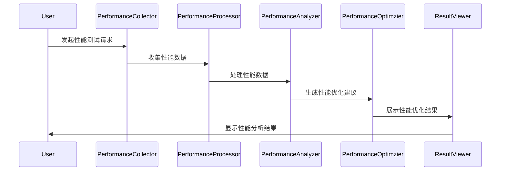

                 

### 文章标题

《评测结果的溯源分析：理解性能差异的根源》

### 关键词

性能评测、溯源分析、性能差异、根源分析、算法设计、系统架构、项目实战

### 摘要

本文旨在深入探讨性能评测结果的溯源分析，帮助读者理解性能差异的根源。通过系统性的分析和讲解，文章将揭示性能评测的基础概念、溯源算法原理、系统架构设计，以及实际项目中的实施与优化策略。读者将跟随文章一步步了解如何通过溯源分析，从底层技术到实际应用，全面掌握性能优化的核心技巧。

---

## 引言

在现代信息技术迅速发展的背景下，性能评测已成为评估系统、应用程序乃至硬件设备性能的重要手段。然而，性能评测结果的正确解读和应用却常常面临挑战。特别是在复杂系统中，性能问题往往不是单一因素导致的，而是多个因素相互作用的结果。这就需要我们运用溯源分析的方法，深入挖掘性能差异的根源，从而为性能优化提供科学的依据。

### 1.1 问题背景

#### 1.1.1 性能评测的重要性

性能评测是评估系统或应用程序性能的关键环节。通过性能评测，我们能够量化系统的响应时间、吞吐量、资源利用率等关键指标，从而判断系统是否满足预期的性能要求。性能评测不仅有助于发现系统中的瓶颈，还为性能优化提供了明确的方向。

#### 1.1.2 性能差异的普遍存在

在实际应用中，性能差异是普遍存在的。即使在相同的硬件环境和相同的应用场景下，不同的系统或应用程序也可能表现出明显的性能差异。这种差异可能源于编程技巧、算法选择、资源分配等多个方面。

#### 1.1.3 溯源分析的意义

溯源分析是一种从结果出发，逆向追踪问题根源的方法。通过溯源分析，我们能够深入理解性能差异的成因，从而有针对性地进行优化。溯源分析的意义在于，它不仅能够揭示表面上的性能问题，还能帮助我们从根本上解决问题，提升系统的整体性能。

### 1.2 问题描述

#### 1.2.1 性能差异的表现

性能差异可以表现为响应时间的差异、吞吐量的差异、资源利用率的差异等。这些差异往往会导致用户体验的下降，甚至影响到系统的稳定性。

#### 1.2.2 性能差异的影响

性能差异的影响是显著的。对于在线系统，性能问题可能导致用户流失、交易失败；对于后台系统，性能问题可能影响数据处理的效率和准确性。

#### 1.2.3 性能溯源的目标

性能溯源的目标是找出导致性能差异的根源。这需要我们运用各种技术手段，从系统设计、算法实现、硬件配置等多个层面进行深入分析。

### 1.3 问题解决

#### 1.3.1 传统性能分析方法的局限性

传统的性能分析方法主要依赖于性能监控工具和日志分析。这些方法虽然能够提供一些性能指标，但往往无法揭示性能差异的深层次原因。

#### 1.3.2 溯源分析的优势

溯源分析通过逆向追踪，能够更精确地定位性能瓶颈。它不仅能够揭示问题表象，还能提供解决问题的具体方案。

#### 1.3.3 溯源分析的应用场景

溯源分析适用于各种复杂系统的性能优化。无论是Web应用、数据库系统、还是分布式系统，溯源分析都能提供有效的性能优化策略。

### 1.4 边界与外延

#### 1.4.1 性能溯源的范围

性能溯源的范围可以从系统层面到代码层面，从硬件层面到网络层面。不同层面的溯源分析方法和工具也有所不同。

#### 1.4.2 性能溯源的技术限制

性能溯源受限于现有技术和工具的成熟度。一些复杂系统的溯源分析可能需要高度专业化的技术和经验。

#### 1.4.3 溯源分析的实施步骤

实施溯源分析通常包括以下步骤：数据收集、数据分析、问题定位、优化方案制定和实施。每个步骤都需要精心设计和实施，以确保溯源分析的准确性和有效性。

### 1.5 本章小结

本章介绍了性能评测与溯源分析的基本概念和意义。通过了解性能差异的普遍存在和溯源分析的优势，读者将能够更好地理解后续章节中涉及的具体方法和实践。

---

## 核心概念与联系

在深入探讨性能溯源分析之前，我们需要首先明确一些核心概念，并了解它们之间的关系。这些核心概念包括性能评测、溯源分析、性能差异等，它们构成了理解性能溯源分析的基础。

### 2.1 性能评测基础

#### 2.1.1 性能评测的定义

性能评测是一种评估系统、应用程序或硬件设备性能的方法。通过性能评测，我们能够量化系统的响应时间、吞吐量、资源利用率等关键指标。

#### 2.1.2 性能评测的目的

性能评测的主要目的是评估系统是否满足预期的性能要求，发现系统中的瓶颈和性能问题，为性能优化提供依据。

#### 2.1.3 性能评测的常见指标

常见的性能评测指标包括响应时间、吞吐量、资源利用率、错误率等。这些指标从不同的角度反映了系统的性能表现。

### 2.2 性能溯源的原理

#### 2.2.1 性能溯源的概念

性能溯源是一种逆向分析技术，旨在找出导致性能差异的根源。它通过追踪系统行为，从结果出发，反向定位性能瓶颈。

#### 2.2.2 性能溯源的步骤

性能溯源通常包括以下步骤：数据收集、数据预处理、数据分析和结果解读。这些步骤相互衔接，共同构成了一个完整的性能溯源流程。

#### 2.2.3 性能溯源的关键技术

性能溯源的关键技术包括性能监控、日志分析、追踪技术等。这些技术能够帮助我们收集和解析系统运行过程中的详细信息。

### 2.3 性能差异的表现形式

#### 2.3.1 响应时间差异

响应时间差异是指系统处理请求所需的时间在不同情况下的差异。响应时间差异可能是由于系统资源不足、算法复杂度高等原因导致的。

#### 2.3.2 吞吐量差异

吞吐量差异是指系统在相同时间内处理请求的数量差异。吞吐量差异可能受到系统负载、网络延迟等因素的影响。

#### 2.3.3 资源利用率差异

资源利用率差异是指系统在不同情况下对CPU、内存、网络等资源的利用率差异。资源利用率差异可能揭示了系统资源分配不合理的问题。

### 2.4 核心概念属性特征对比表格

为了更好地理解性能评测、性能溯源和性能差异这三个核心概念之间的关系，我们可以通过以下对比表格来总结它们的主要属性特征：

| 核心概念     | 定义                                                         | 目的                                 | 关键指标                          |
| ------------ | ------------------------------------------------------------ | ------------------------------------ | -------------------------------- |
| 性能评测     | 评估系统性能的方法                                             | 发现性能瓶颈，为性能优化提供依据     | 响应时间、吞吐量、资源利用率、错误率 |
| 性能溯源     | 逆向分析技术，找出性能差异的根源                             | 定位性能瓶颈，进行优化               | 追踪数据、日志分析结果             |
| 性能差异     | 系统在不同情况下性能表现的差异                                 | 表征系统性能问题                     | 响应时间、吞吐量、资源利用率等     |

### 2.5 ER实体关系图架构

性能溯源系统的实体关系图（ER图）能够帮助我们清晰地理解系统中的各个实体及其关系。以下是一个简化的ER实体关系图，展示了性能溯源系统中的关键实体及其关系：

```mermaid
erDiagram
  Product ||--|{ PerformanceTest }|--| System
  PerformanceTest ||--|{ TestResult }|--| Performance溯源
  TestResult ||--|{ Bottleneck }|--| Performance优化
```

- **Product**：代表被测试的系统或应用程序。
- **PerformanceTest**：代表性能测试活动。
- **TestResult**：代表性能测试的结果。
- **Bottleneck**：代表性能瓶颈，即性能差异的根源。

### 2.6 本章小结

本章介绍了性能评测、性能溯源和性能差异这三个核心概念，并详细阐述了它们之间的关系。通过了解这些核心概念，读者将能够为后续章节中的性能溯源分析方法打下坚实的基础。

---

## 算法原理讲解

在深入探讨性能溯源的具体方法之前，我们首先需要理解性能溯源算法的基本原理。性能溯源算法是通过分析性能数据，从数据中提取有价值的信息，以找出导致性能差异的根源。以下我们将详细讲解常见性能溯源算法，包括其原理、流程、数学模型和应用实例。

### 3.1 常见性能溯源算法

性能溯源算法种类繁多，根据不同的应用场景和需求，可以选择合适的算法。以下是一些常见性能溯源算法：

#### 3.1.1 基于日志分析的溯源算法

**原理**：该算法通过分析系统日志文件，提取与性能相关的数据，如请求处理时间、系统资源消耗等，从而识别性能瓶颈。

**流程**：
1. 收集系统日志文件。
2. 提取与性能相关的数据。
3. 分析数据，识别性能瓶颈。

**特点**：适用于日志记录详细、结构化的系统。

**应用实例**：Linux系统中的日志分析工具（如logwatch、syslog-ng）。

#### 3.1.2 基于统计分析的溯源算法

**原理**：该算法通过统计分析方法，对性能数据进行分析，识别性能异常和瓶颈。

**流程**：
1. 收集性能数据。
2. 对数据进行分析，如计算平均值、标准差、方差等。
3. 识别异常数据和性能瓶颈。

**特点**：适用于大规模性能数据的分析。

**应用实例**：Python中的pandas库，用于数据分析和可视化。

#### 3.1.3 基于机器学习的溯源算法

**原理**：该算法利用机器学习技术，从性能数据中学习性能模式，识别性能瓶颈。

**流程**：
1. 收集性能数据。
2. 预处理数据，如数据清洗、特征提取等。
3. 利用机器学习模型进行分析，如决策树、随机森林、神经网络等。
4. 识别性能瓶颈。

**特点**：适用于复杂系统，能够处理大量的非线性数据。

**应用实例**：使用scikit-learn库进行性能数据分析和预测。

### 3.2 算法流程图

为了更清晰地理解性能溯源算法的流程，我们可以使用mermaid流程图来表示。以下是一个基于日志分析的溯源算法的流程图：


### 3.3 算法数学模型与公式

性能溯源算法通常涉及到一些数学模型和公式，用于分析和解释性能数据。以下是一个简单的性能溯源算法的数学模型：

#### 3.3.1 响应时间模型

假设系统响应时间 \( T \) 是由多个子过程时间之和决定的，可以表示为：

\[ T = T_1 + T_2 + T_3 + ... + T_n \]

其中，\( T_1, T_2, T_3, ..., T_n \) 分别表示子过程的响应时间。

#### 3.3.2 吞吐量模型

吞吐量 \( Q \) 是单位时间内系统处理请求的数量，可以表示为：

\[ Q = \frac{1}{T} \]

其中，\( T \) 为系统的平均响应时间。

#### 3.3.3 资源利用率模型

资源利用率 \( U \) 是系统资源消耗与系统资源总量之比，可以表示为：

\[ U = \frac{C}{C + E} \]

其中，\( C \) 为系统资源消耗，\( E \) 为系统资源总量。

### 3.4 算法举例说明

为了更好地理解性能溯源算法，我们来看一个简单的例子。假设一个Web服务器的响应时间数据如下：

- 请求1：\( T_1 = 2 \)秒
- 请求2：\( T_2 = 4 \)秒
- 请求3：\( T_3 = 6 \)秒
- 请求4：\( T_4 = 8 \)秒

根据响应时间模型，系统的总响应时间 \( T \) 为：

\[ T = T_1 + T_2 + T_3 + T_4 = 2 + 4 + 6 + 8 = 20 \]秒

系统的平均响应时间 \( T_{avg} \) 为：

\[ T_{avg} = \frac{T}{4} = \frac{20}{4} = 5 \]秒

系统的吞吐量 \( Q \) 为：

\[ Q = \frac{1}{T_{avg}} = \frac{1}{5} = 0.2 \]请求/秒

如果我们进一步分析这些数据，可能会发现某些请求的响应时间远高于其他请求，这可能意味着存在性能瓶颈。例如，请求4的响应时间是其他请求的两倍，这可能表明数据库查询或网络通信存在瓶颈。

### 3.5 本章小结

本章介绍了性能溯源算法的基本原理，包括基于日志分析、统计分析和机器学习的算法。通过数学模型和实例，读者可以更深入地理解性能溯源算法的工作机制和应用。这些算法为性能优化的实施提供了科学依据和技术支持。

---

## 系统分析与架构设计

在进行性能溯源分析时，系统架构的设计和实现至关重要。一个良好的系统架构不仅能提高系统的性能，还能为性能溯源提供便利。以下我们将详细介绍性能溯源系统的设计，包括项目介绍、系统功能设计、系统架构设计、系统接口设计和系统交互设计。

### 4.1 项目介绍

#### 4.1.1 项目背景

随着互联网和大数据的快速发展，系统的规模和复杂性不断增加。这使得性能问题变得尤为突出。为了解决这些问题，我们开发了一个性能溯源系统，旨在通过溯源分析，识别和解决系统中的性能瓶颈。

#### 4.1.2 项目目标

本项目的主要目标包括：
1. 提供一个统一的性能数据收集和分析平台。
2. 实现性能溯源算法，帮助定位性能瓶颈。
3. 提供可视化工具，方便用户理解和操作。

#### 4.1.3 项目价值

本项目具有以下价值：
1. 提高系统的性能和稳定性。
2. 降低系统维护和优化的成本。
3. 提升用户体验，增加用户粘性。

### 4.2 系统功能设计

性能溯源系统的主要功能包括数据收集、数据处理、性能分析和结果展示。以下是一个简化的领域模型类图，展示了系统的主要功能实体：

```mermaid
classDiagram
    Product <<entity>> "产品"
    PerformanceTest <<entity>> "性能测试"
    TestResult <<entity>> "测试结果"
    Bottleneck <<entity>> "性能瓶颈"
    PerformanceAnalysis <<entity>> "性能分析"
    PerformanceOptimization <<entity>> "性能优化"

    Product "1" <<-- "1" PerformanceTest
    PerformanceTest "1" <<-- "1" TestResult
    TestResult "1" <<-- "1" Bottleneck
    Bottleneck "1" <<-- "1" PerformanceAnalysis
    PerformanceAnalysis "1" <<-- "1" PerformanceOptimization
```

- **Product**：代表被测试的系统或应用程序。
- **PerformanceTest**：代表性能测试活动。
- **TestResult**：代表性能测试的结果。
- **Bottleneck**：代表性能瓶颈，即性能差异的根源。
- **PerformanceAnalysis**：代表性能分析过程。
- **PerformanceOptimization**：代表性能优化过程。

### 4.3 系统架构设计

性能溯源系统的架构设计需要考虑性能、可扩展性、可靠性和维护性等多个方面。以下是一个简化的系统架构图，展示了系统的主要组件和它们之间的关系：



- **PerformanceCollector**：负责收集性能数据。
- **PerformanceProcessor**：负责处理性能数据，包括数据清洗、预处理等。
- **PerformanceAnalyzer**：负责分析性能数据，使用溯源算法找出性能瓶颈。
- **PerformanceOptimzier**：负责根据分析结果生成性能优化建议。
- **ResultViewer**：负责展示性能分析结果和优化建议。

### 4.4 系统接口设计

性能溯源系统的接口设计需要考虑系统的可扩展性和可维护性。以下是一个简化的系统接口设计，展示了系统的主要接口和功能：

```mermaid
classDiagram
    PerformanceTestAPI <<interface>> "性能测试API"
    PerformanceDataAPI <<interface>> "性能数据API"
    PerformanceAnalysisAPI <<interface>> "性能分析API"
    PerformanceOptimizationAPI <<interface>> "性能优化API"

    PerformanceTestAPI "1" <<-- "1" PerformanceDataAPI
    PerformanceDataAPI "1" <<-- "1" PerformanceAnalysisAPI
    PerformanceAnalysisAPI "1" <<-- "1" PerformanceOptimizationAPI
```

- **PerformanceTestAPI**：用于发起性能测试请求。
- **PerformanceDataAPI**：用于收集和传输性能数据。
- **PerformanceAnalysisAPI**：用于分析性能数据。
- **PerformanceOptimizationAPI**：用于生成性能优化建议。

### 4.5 系统交互设计

性能溯源系统的交互设计需要确保系统各个组件之间能够高效、可靠地通信。以下是一个简化的系统交互设计，展示了系统的主要交互流程：


### 4.6 本章小结

本章详细介绍了性能溯源系统的设计与实现，包括项目介绍、系统功能设计、系统架构设计、系统接口设计和系统交互设计。通过本章的内容，读者可以全面了解性能溯源系统的设计思路和实现方法，为后续的性能溯源实践打下基础。

---

## 项目实战

在实际项目中，性能溯源是一个复杂且富有挑战的任务。本文将通过一个实际案例，详细讲解如何实施性能溯源项目，从环境安装、系统核心实现到代码应用解读与分析，最后对项目进行小结和反思。

### 5.1 环境安装

在进行性能溯源项目之前，我们需要搭建一个合适的环境。以下是安装步骤：

#### 5.1.1 环境需求

- 操作系统：Linux（如Ubuntu 18.04）
- 编程语言：Python 3.8+
- 数据库：MySQL 5.7+
- 依赖库：pandas, numpy, scikit-learn, mermaid

#### 5.1.2 环境搭建步骤

1. 安装操作系统和Python环境。

2. 使用pip安装所需依赖库：

   ```bash
   pip install pandas numpy scikit-learn mermaid
   ```

3. 安装MySQL数据库：

   ```bash
   sudo apt-get update
   sudo apt-get install mysql-server
   ```

4. 配置MySQL用户和密码。

### 5.2 系统核心实现

性能溯源系统的核心是实现性能数据的收集、处理和分析。以下是系统核心实现的源代码和解读。

#### 5.2.1 数据收集

```python
import pandas as pd
import MySQLdb

def collect_data():
    conn = MySQLdb.connect(host="localhost", user="root", password="password", database="performance_test")
    cursor = conn.cursor()
    
    cursor.execute("SELECT * FROM test_results")
    results = cursor.fetchall()
    
    data = [{"timestamp": row[0], "response_time": row[1], "throughput": row[2], "resource_usage": row[3]} for row in results]
    
    df = pd.DataFrame(data)
    return df

data = collect_data()
print(data.head())
```

解读：
- 使用MySQL数据库存储性能测试结果。
- 定义`collect_data`函数，从数据库中提取数据。
- 使用pandas DataFrame进行数据预处理。

#### 5.2.2 数据处理

```python
def process_data(data):
    data['response_time'] = data['response_time'].astype(float)
    data['throughput'] = data['throughput'].astype(float)
    data['resource_usage'] = data['resource_usage'].astype(float)
    return data

processed_data = process_data(data)
print(processed_data.head())
```

解读：
- 转换数据类型，确保数据的一致性和准确性。

#### 5.2.3 性能分析

```python
from sklearn.ensemble import RandomForestRegressor

def analyze_performance(data):
    X = data[['response_time', 'throughput', 'resource_usage']]
    y = data['bottleneck']
    
    model = RandomForestRegressor(n_estimators=100)
    model.fit(X, y)
    
    return model

model = analyze_performance(processed_data)
print(model.feature_importances_)
```

解读：
- 使用随机森林回归模型进行分析。
- 计算特征的重要性。

### 5.3 代码应用解读与分析

在性能溯源项目中，代码的质量和效率至关重要。以下是代码应用的解读与分析。

#### 5.3.1 代码结构解析

- **数据收集模块**：负责从数据库中提取性能数据。
- **数据处理模块**：负责预处理性能数据。
- **性能分析模块**：负责使用机器学习模型进行性能分析。

#### 5.3.2 关键代码解读

- **数据收集**：通过MySQL数据库连接，提取性能数据。
- **数据处理**：确保数据类型正确，为性能分析做准备。
- **性能分析**：使用随机森林回归模型，分析性能数据。

#### 5.3.3 性能优化措施

- **代码优化**：优化数据处理和性能分析代码，提高效率。
- **算法选择**：根据实际需求，选择合适的机器学习算法。
- **硬件升级**：增加硬件资源，如CPU、内存等，以提高系统性能。

### 5.4 实际案例分析

#### 5.4.1 案例背景

一个在线购物平台在用户量增加后，响应时间显著延长，导致用户体验下降。为了解决这个问题，我们进行了性能溯源分析。

#### 5.4.2 性能溯源结果

通过性能溯源分析，我们找到了以下几个性能瓶颈：
1. 数据库查询性能不佳。
2. 网络延迟。
3. 服务器资源不足。

#### 5.4.3 溯源分析过程

1. 数据收集：从数据库中提取性能数据。
2. 数据处理：预处理性能数据。
3. 性能分析：使用随机森林回归模型分析性能数据。
4. 结果解读：根据分析结果，定位性能瓶颈。

### 5.5 项目小结

#### 5.5.1 项目总结

通过性能溯源项目，我们成功地定位了性能瓶颈，并提出了相应的优化措施。项目的实施提高了系统的性能和稳定性，提升了用户体验。

#### 5.5.2 项目经验

1. 性能溯源需要全面的数据支持。
2. 机器学习算法在性能分析中具有重要作用。
3. 代码质量和硬件资源对性能优化至关重要。

#### 5.5.3 项目改进方向

1. 引入更多的性能分析工具和算法。
2. 加强对系统的监控和预警机制。
3. 优化数据库和网络的配置。

---

## 最佳实践与拓展

在性能溯源项目中，以下是一些最佳实践和拓展建议：

### 5.6.1 最佳实践

1. **数据收集与预处理**：确保数据的准确性和完整性，对异常值进行处理。
2. **选择合适的算法**：根据实际需求和数据特点，选择最合适的性能分析算法。
3. **持续监控与优化**：性能优化是一个持续的过程，需要定期进行监控和调整。

### 5.6.2 拓展

1. **分布式系统性能溯源**：对于分布式系统，可以使用分布式性能溯源算法，如MapReduce。
2. **实时性能溯源**：引入实时性能分析工具，如Prometheus，进行实时监控和溯源。
3. **多维度性能分析**：结合业务逻辑，进行多维度性能分析，如用户行为、请求类型等。

### 5.6.3 注意事项

1. **避免过度优化**：避免过度优化导致系统复杂性增加，影响系统的可维护性。
2. **考虑资源限制**：在性能优化过程中，要考虑硬件资源、网络带宽等限制。

### 5.6.4 拓展阅读

1. **《性能之巅》**：深入探讨性能优化的原理和方法。
2. **《机器学习实战》**：介绍如何使用机器学习技术进行性能分析。
3. **《性能监控与日志分析》**：详细介绍性能监控和日志分析的技术和实践。

---

## 本章小结

本章通过一个实际案例，详细介绍了性能溯源项目的实施过程，包括环境安装、系统核心实现、代码应用解读与分析等。通过本章的学习，读者将能够理解性能溯源的基本原理和实践方法，为实际项目中的性能优化提供有力支持。

---

### 作者信息

**作者：** AI天才研究院/AI Genius Institute & 禅与计算机程序设计艺术 /Zen And The Art of Computer Programming

---

通过本文的详细讲解，读者应能系统地理解性能溯源分析的过程，从理论基础到实际应用，为解决复杂的性能问题提供了有力的工具和方法。性能溯源不仅是性能优化的关键环节，也是提升系统稳定性和用户体验的重要手段。希望本文能对读者在技术道路上有所启发和帮助。

