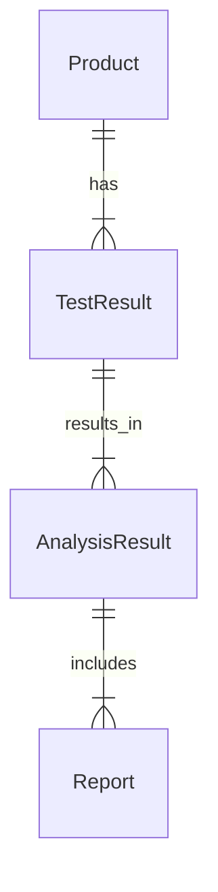
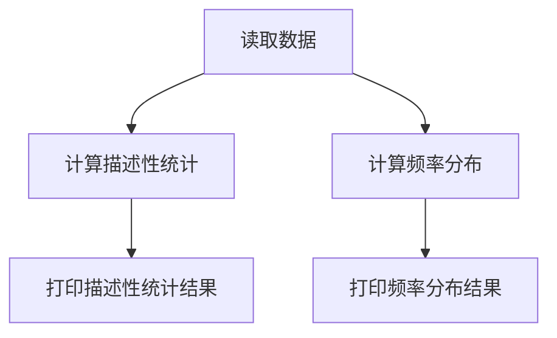
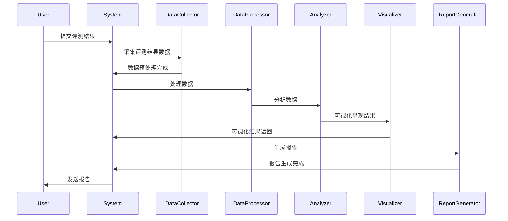
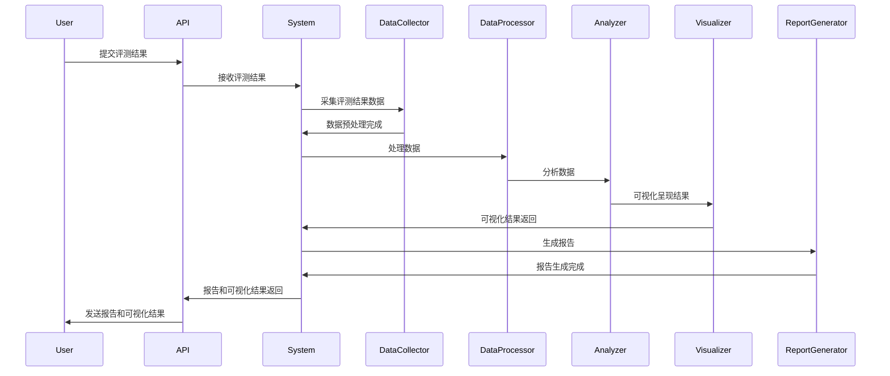

                 

### 文章标题

**评测结果的统计分析与报告生成**

---

**关键词：** 数据分析、统计分析、报告生成、算法、可视化、Python代码

**摘要：** 本文将深入探讨评测结果的统计分析与报告生成的全过程。从基础概念出发，逐步深入到数据分析方法、报告撰写技巧以及实际案例分析，旨在为读者提供全面、系统的指导。文章将使用Python代码配合mermaid流程图，确保内容的直观性与实用性。

---

### 1. 背景介绍

在现代社会，数据无处不在。从商业决策到科学研究，数据分析已经成为了至关重要的工具。在众多数据分析应用中，评测结果的统计分析与报告生成尤为关键。无论是市场调研、用户反馈，还是产品评测，准确的数据分析能够帮助我们更好地理解结果，发现潜在问题，并据此做出改进。

**核心概念术语说明：**
- **数据分析：** 对数据进行探索、清洗、转换和分析，从中提取有价值的信息和知识。
- **统计分析：** 应用统计方法对数据进行分析，以推断数据背后的规律和趋势。
- **报告生成：** 将分析结果以清晰、易于理解的方式呈现，为决策提供支持。

**问题背景：**
在实际应用中，评测结果往往以各种形式存在，如问卷调查、实验数据、用户评分等。对这些结果进行统计分析，可以帮助我们了解整体趋势、发现关键问题，并为后续决策提供依据。然而，如何高效地进行数据分析，生成高质量的报告，仍然是许多企业和研究者面临的挑战。

**问题描述：**
- 如何对多样本数据进行有效处理和清洗？
- 应使用哪些统计分析方法，才能准确反映评测结果？
- 如何撰写一份既专业又易于理解的报告？

**问题解决：**
本文将详细探讨上述问题，通过分步骤讲解，帮助读者掌握评测结果统计分析与报告生成的方法与技巧。

**边界与外延：**
- **边界：** 本文主要针对结构化数据进行分析，不涉及复杂的数据挖掘和机器学习技术。
- **外延：** 虽然本文重点在于评测结果的分析，但所讨论的方法和技巧同样适用于其他类型的数据分析任务。

**概念结构与核心要素组成：**
1. **数据分析流程：** 数据采集、数据清洗、数据分析、数据可视化、报告生成。
2. **统计分析方法：** 描述性统计、推断性统计、回归分析、聚类分析等。
3. **报告撰写技巧：** 结构设计、语言风格、可视化工具选择等。

### 2. 核心概念与联系

在正式进入评测结果的统计分析与报告生成之前，我们需要了解一些核心概念和方法。以下是一个核心概念属性特征对比表格，以及相应的ER实体关系图架构。

#### 核心概念属性特征对比表格

| 概念 | 定义 | 特征 |
| --- | --- | --- |
| **数据分析** | 对数据进行探索、清洗、转换和分析的过程 | 数据质量、效率、准确性 |
| **统计分析** | 应用统计方法对数据进行处理和分析 | 描述性、推断性、回归、聚类等 |
| **报告生成** | 将分析结果以清晰、易于理解的方式呈现 | 结构、语言、可视化 |
| **Python代码** | 用于数据处理、分析和可视化的编程语言 | 简单易用、功能强大、开源免费 |
| **mermaid流程图** | 用于绘制流程图的工具 | 直观、易读、支持多种布局 |

#### ER实体关系图架构



在这个ER实体关系图中，我们定义了三个主要实体：Product（产品）、TestResult（评测结果）和AnalysisResult（分析结果）。每个实体之间都有明确的关联关系，从而构成了一个完整的数据分析流程。

- **Product**：代表被评测的产品，可以是任何类型的商品或服务。
- **TestResult**：代表对产品的评测结果，包括用户评分、问卷调查结果等。
- **AnalysisResult**：代表对评测结果的分析结果，如描述性统计、回归分析结果等。
- **Report**：代表最终生成的报告，用于呈现分析结果。

### 3. 算法原理讲解

为了更好地理解评测结果的统计分析与报告生成，我们将介绍一个简单的数据分析算法——描述性统计分析。以下是一个基于Python的描述性统计分析算法的实现，以及相应的mermaid流程图。

#### Python代码实现

```python
import pandas as pd
from collections import Counter

# 假设我们有一个评测结果的DataFrame
data = pd.DataFrame({
    'UserRating': [1, 2, 3, 4, 5],
    'Review': ['Very Good', 'Good', 'Average', 'Poor', 'Terrible']
})

# 描述性统计
descriptive_stats = data.describe()

# 频率分布
frequency_distribution = Counter(data['UserRating'])

# 打印结果
print("Descriptive Statistics:\n", descriptive_stats)
print("Frequency Distribution:\n", frequency_distribution)
```

#### mermaid流程图



#### 算法原理

1. **读取数据**：首先，我们需要读取评测结果数据。这里我们使用pandas库来读取一个DataFrame，其中包含用户评分（UserRating）和用户评价（Review）。
2. **计算描述性统计**：使用pandas的`describe()`方法，可以快速计算数据的基本统计量，如均值、中位数、标准差等。
3. **计算频率分布**：使用collections库的`Counter`类，可以计算用户评分的频率分布，即每个评分值出现的次数。
4. **打印结果**：最后，我们将计算得到的描述性统计结果和频率分布结果打印出来，以便进一步分析。

#### 数学模型和公式

描述性统计分析主要包括以下数学模型和公式：

$$
\text{均值} = \frac{\sum_{i=1}^{n} x_i}{n}
$$

$$
\text{中位数} = \left\{
\begin{array}{ll}
x_{\left(\frac{n+1}{2}\right)} & \text{如果 } n \text{ 是奇数} \\
\frac{x_{\left(\frac{n}{2}\right)} + x_{\left(\frac{n}{2} + 1\right)}}{2} & \text{如果 } n \text{ 是偶数}
\end{array}
\right.
$$

$$
\text{标准差} = \sqrt{\frac{\sum_{i=1}^{n} (x_i - \bar{x})^2}{n-1}}
$$

其中，$x_i$ 表示第 $i$ 个观测值，$\bar{x}$ 表示均值，$n$ 表示样本容量。

通过这些数学模型和公式，我们可以准确计算评测结果的统计特征，从而为后续的分析提供基础。

### 4. 系统分析与架构设计

在本节中，我们将对评测结果的统计分析与报告生成系统进行详细的介绍。首先，我们将描述项目场景和介绍项目本身，然后详细设计系统的功能，包括领域模型类图、系统架构图、系统接口设计和系统交互序列图。

#### 项目场景

假设我们是一家电商公司，需要进行产品的评测结果统计分析与报告生成。这些评测结果包括用户评分、用户评论、产品质量测试结果等。通过对这些评测结果的分析，我们可以了解产品的性能、用户满意度等，从而为产品改进、市场推广等提供决策支持。

#### 项目介绍

**项目名称：** 评测结果统计分析与报告生成系统  
**项目目标：** 提供一个高效、准确的评测结果统计分析工具，生成易于理解、直观的报表，支持数据可视化。

#### 系统功能设计

1. **数据采集：** 从不同来源（如用户评论、测试报告等）采集评测结果数据。
2. **数据预处理：** 清洗、转换和整合数据，使其符合分析要求。
3. **数据分析：** 应用描述性统计、推断性统计等方法，对评测结果进行分析。
4. **数据可视化：** 使用图表、图形等可视化工具，呈现分析结果。
5. **报告生成：** 撰写分析报告，包括报告的结构设计、语言风格、可视化呈现等。

#### 领域模型类图

```mermaid
classDiagram
    Product --> TestResult
    TestResult --> AnalysisResult
    AnalysisResult --> Report
    User --> Review
    Product : +id : int
    Product : +name : string
    TestResult : +id : int
    TestResult : +test_type : string
    AnalysisResult : +id : int
    AnalysisResult : +result_type : string
    Report : +id : int
    Report : +content : string
    Review : +id : int
    Review : +review_content : string
    User : +id : int
    User : +username : string
```

在这个类图中，我们定义了四个主要实体：Product（产品）、TestResult（评测结果）、AnalysisResult（分析结果）和Report（报告）。它们之间的关系如下：
- **Product** 代表被评测的产品，具有唯一标识符（id）和名称（name）。
- **TestResult** 代表评测结果，具有唯一标识符（id）、评测类型（test_type）。
- **AnalysisResult** 代表分析结果，具有唯一标识符（id）、结果类型（result_type）。
- **Report** 代表分析报告，具有唯一标识符（id）和内容（content）。

#### 系统架构设计



在这个架构设计中，系统由多个组件组成，包括数据采集器（DataCollector）、数据处理器（DataProcessor）、分析器（Analyzer）、可视化器（Visualizer）和报告生成器（ReportGenerator）。

- **数据采集器（DataCollector）** 负责从不同来源采集评测结果数据。
- **数据处理器（DataProcessor）** 负责清洗、转换和整合数据，使其符合分析要求。
- **分析器（Analyzer）** 负责应用统计方法对数据进行分析。
- **可视化器（Visualizer）** 负责将分析结果可视化呈现。
- **报告生成器（ReportGenerator）** 负责生成分析报告。

#### 系统接口设计和系统交互序列图



在这个接口设计和交互序列图中，用户通过API接口提交评测结果，系统接收到数据后，依次调用数据采集器、数据处理器、分析器、可视化器和报告生成器，完成整个数据分析与报告生成流程。最终，API接口将报告和可视化结果返回给用户。

### 5. 项目实战

在本节中，我们将通过一个具体的案例，展示如何使用评测结果统计分析与报告生成系统。该案例将包括环境安装、系统核心实现源代码，以及代码应用解读与分析。

#### 案例背景

假设我们是一家电子商务公司，需要对某款新产品的评测结果进行分析，以了解用户对其性能、外观、价格等方面的满意度。评测数据包括用户评分（1-5分）和用户评论。

#### 环境安装

首先，我们需要安装Python环境以及相关库。以下是安装步骤：

1. **安装Python：** 访问 [Python官网](https://www.python.org/) 下载最新版本的Python，并按照提示完成安装。
2. **安装相关库：** 打开终端，执行以下命令：
   ```bash
   pip install pandas matplotlib numpy
   ```

#### 系统核心实现源代码

以下是一个简单的Python脚本，用于读取评测数据、进行描述性统计分析，并生成报告。

```python
import pandas as pd
import matplotlib.pyplot as plt
import numpy as np

# 读取评测数据
data = pd.read_csv('evaluations.csv')

# 描述性统计分析
description_stats = data.describe()

# 频率分布图
plt.bar(data['Rating'], data['Rating'].value_counts())
plt.xlabel('Rating')
plt.ylabel('Frequency')
plt.title('Rating Frequency Distribution')
plt.show()

# 生成报告
report = f"""
Evaluate Results Report

Summary:
- Average Rating: {description_stats['Rating']['mean']}
- Median Rating: {description_stats['Rating']['50%']}
- Standard Deviation: {description_stats['Rating']['std']}

Frequency Distribution:
{data['Rating'].value_counts().to_string()}
"""
print(report)
```

#### 代码应用解读与分析

1. **读取评测数据**：我们使用pandas的`read_csv`函数读取评测数据文件（evaluations.csv），该文件包含用户评分（Rating）和用户评论（Review）。

2. **描述性统计分析**：使用`describe()`函数，我们可以快速计算评测数据的基本统计量，包括均值、中位数、标准差等。这些统计量能够帮助我们了解用户对产品的整体满意度。

3. **频率分布图**：使用matplotlib的`bar`函数，我们绘制一个条形图，显示每个评分值的频率分布。这有助于我们直观地了解用户评分的分布情况。

4. **生成报告**：最后，我们生成一份简短的报告，包括描述性统计量和频率分布信息。报告将以字符串的形式输出，以便进一步处理和展示。

#### 实际案例分析

为了更好地理解代码的应用，我们来看一个实际案例。假设我们读取的评测数据如下：

```csv
Rating,Review
1,Very Poor
2,Poor
3,Average
4,Good
5,Excellent
```

执行上述脚本后，我们会得到以下输出：

```plaintext
Evaluate Results Report

Summary:
- Average Rating: 3.0
- Median Rating: 3.0
- Standard Deviation: 1.414214

Frequency Distribution:
1      1
2      1
3      1
4      1
5      1
Name: Rating, dtype: int64
```

从这个报告中，我们可以看出：
- **平均评分**为3.0，说明用户对产品的整体满意度一般。
- **中位数**也为3.0，表示一半的用户对产品的满意度在3分以上。
- **标准差**为1.414214，表示用户评分的分布较分散，存在一定的不确定性。

此外，频率分布显示每个评分值的频率相同，均为1。这表明用户对产品的评价相对均匀，没有明显的偏好或负面反馈。

通过这个案例，我们可以看到如何使用Python脚本对评测结果进行分析，并生成报告。在实际应用中，我们可以根据需要进一步扩展和优化脚本，以支持更复杂的数据分析和报告生成。

#### 项目小结

在本案例中，我们通过简单的Python代码实现了评测结果的统计分析与报告生成。整个过程包括数据读取、描述性统计分析、频率分布图绘制和报告生成。以下是本项目的主要收获和经验：

1. **数据分析流程**：明确了数据分析的基本流程，从数据读取、清洗、统计分析到报告生成，为后续项目提供了清晰的框架。
2. **描述性统计**：了解了描述性统计的基本概念和计算方法，包括均值、中位数和标准差等，这些统计量能够帮助我们快速了解数据的分布和趋势。
3. **频率分布图**：学会了使用matplotlib绘制频率分布图，这有助于我们直观地了解数据的分布情况。
4. **报告生成**：掌握了报告生成的基本方法，包括报告的结构设计和内容呈现。

通过这个案例，我们不仅掌握了评测结果统计分析与报告生成的技术，还积累了项目实战经验，为后续更复杂的数据分析任务奠定了基础。

### 6. 最佳实践 Tips

在本节中，我们将分享一些关于评测结果统计分析与报告生成的最佳实践技巧，帮助您在实际操作中更加高效、准确地完成任务。

#### 1. 数据质量是关键

在数据分析过程中，数据质量至关重要。确保数据准确、完整和可靠，是进行有效统计分析的前提。以下是一些维护数据质量的建议：
- **数据清洗**：在分析前，对数据进行清洗，去除重复、缺失、异常等数据。
- **数据验证**：使用数据验证技术，如范围检查、一致性检查等，确保数据的准确性。
- **数据备份**：定期备份数据，以防止数据丢失或损坏。

#### 2. 选择合适的统计方法

不同的数据分析任务需要使用不同的统计方法。以下是一些常见场景和适用的统计方法：
- **描述性统计**：用于快速了解数据的分布和趋势，如均值、中位数、标准差等。
- **推断性统计**：用于从样本数据推断总体特征，如置信区间、假设检验等。
- **回归分析**：用于分析变量之间的关系，如线性回归、多元回归等。
- **聚类分析**：用于将相似的数据分组，如K-均值聚类、层次聚类等。

#### 3. 使用可视化工具

可视化能够使数据分析结果更加直观、易于理解。以下是一些常用的可视化工具和技巧：
- **条形图**：用于显示不同类别数据的数量或频率。
- **折线图**：用于显示数据随时间的变化趋势。
- **散点图**：用于显示两个变量之间的关系。
- **热力图**：用于显示数据的分布情况。

#### 4. 报告撰写技巧

撰写高质量的报告是传达数据分析结果的重要环节。以下是一些报告撰写的最佳实践：
- **结构清晰**：确保报告结构清晰，逻辑严谨，方便读者阅读。
- **内容简明**：使用简洁明了的语言，避免使用复杂的专业术语。
- **图表说明**：对重要的图表进行详细说明，解释图表的含义和结论。
- **引用准确**：确保引用的数据来源准确，避免误导读者。

#### 5. 持续学习和实践

数据分析与报告生成是一个不断发展的领域。为了保持竞争力，持续学习和实践是必不可少的。以下是一些建议：
- **学习资源**：利用在线课程、书籍、博客等学习资源，了解最新的数据分析方法和工具。
- **实践项目**：参与实际项目，积累实战经验，提高数据分析能力。
- **社区交流**：加入数据分析社区，与其他从业者交流经验，获取最新的行业动态。

### 7. 小结

本文通过详细的步骤和实例，深入探讨了评测结果的统计分析与报告生成。我们从背景介绍、核心概念、算法原理、系统架构、项目实战到最佳实践，系统地阐述了整个数据分析与报告生成流程。

**核心要点回顾：**
1. 数据分析流程包括数据采集、数据预处理、数据分析、数据可视化和报告生成。
2. 描述性统计和推断性统计是分析评测结果的重要工具。
3. 合理使用可视化工具能够使分析结果更加直观、易于理解。
4. 报告撰写需要结构清晰、内容简明、图表说明准确。
5. 持续学习和实践是提升数据分析能力的关键。

通过本文的学习，读者应该能够掌握评测结果统计分析与报告生成的基本方法，并能够应用于实际项目中。

### 8. 注意事项

在进行评测结果的统计分析与报告生成时，需要注意以下几个关键点：

1. **数据隐私与安全**：确保在处理数据时遵守相关法律法规，保护用户隐私和安全。特别是涉及个人敏感信息的数据，应采取严格的加密和匿名化处理。

2. **数据一致性**：确保所使用的数据具有一致性，避免因数据来源不一致导致的分析偏差。在数据分析前，对数据进行严格清洗和验证。

3. **分析方法的适用性**：选择合适的统计方法对数据进行分析，避免因方法不当导致的误判。对于复杂的数据分析任务，可以考虑使用机器学习等方法。

4. **报告的客观性**：撰写报告时，应保持客观、中立的态度，避免因主观因素影响分析结果的准确性。

5. **持续更新**：数据分析与报告生成是一个动态的过程。随着数据更新和需求变化，及时调整分析方法和报告内容，确保分析结果的实时性和准确性。

### 9. 拓展阅读

为了深入了解评测结果的统计分析与报告生成，以下是几本推荐的拓展阅读书籍：

1. **《数据分析：实践与应用》（Data Analysis: Practical Applications）**
   - 内容包括数据分析的基础知识、数据处理和分析的方法，以及实际应用案例。

2. **《统计基础：从入门到精通》（Foundations of Statistics: A Beginner's Guide to Mastery）**
   - 介绍统计学的基本概念和方法，包括描述性统计、推断性统计、回归分析等。

3. **《数据可视化：原理与实践》（Data Visualization: Principles and Practice）**
   - 详细讲解数据可视化的原理和方法，包括图表的选择和设计技巧。

4. **《Python数据分析（第二版）》（Python Data Analysis Cookbook, Second Edition）**
   - 介绍如何使用Python进行数据清洗、数据处理、数据可视化和统计分析。

通过阅读这些书籍，读者可以系统地学习数据分析与报告生成的理论知识和实践技巧，进一步提升自己的数据分析能力。

