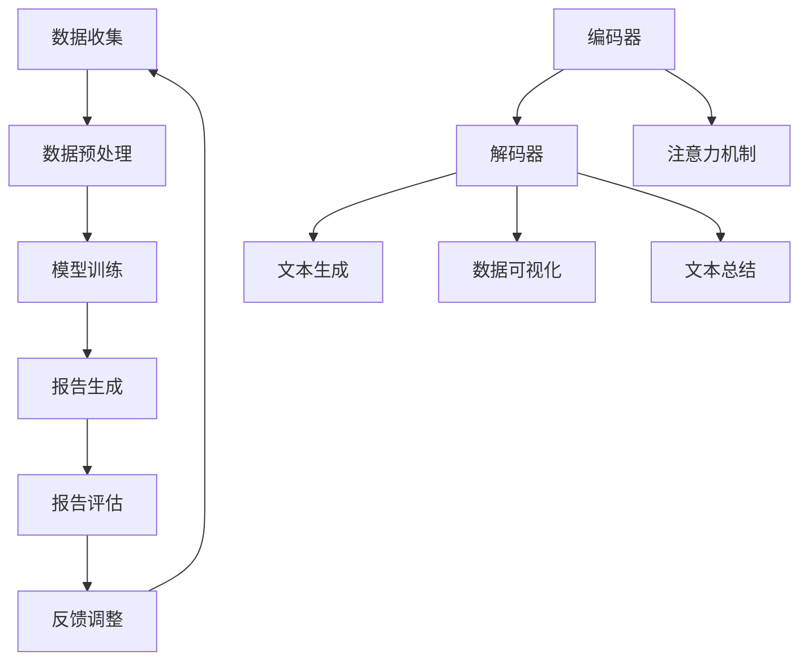
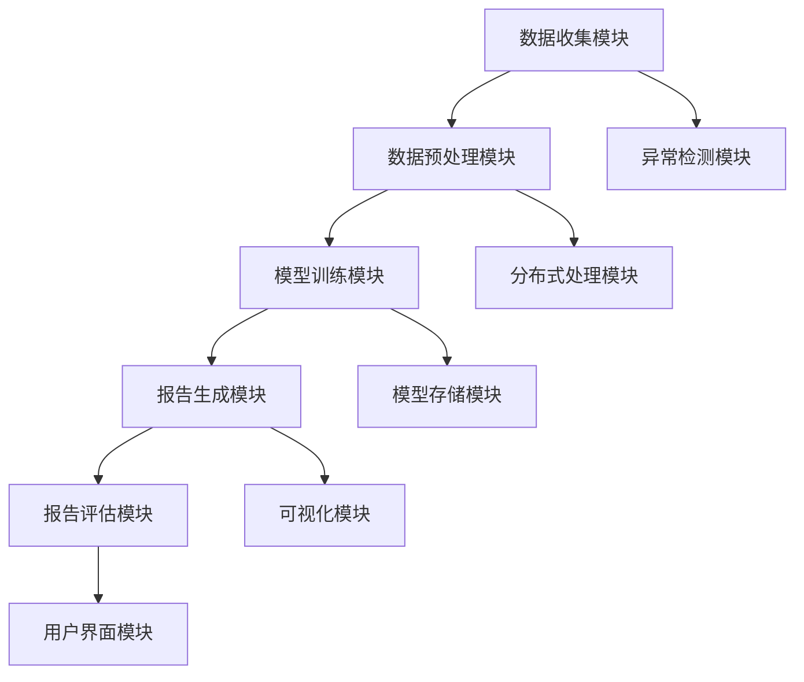
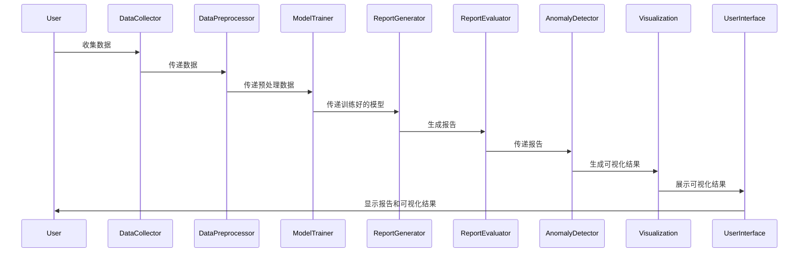

                 

### 概述背景与核心概念

#### 1.1.1 评测结果自动分析的需求

在现代信息技术环境中，评测结果的分析变得日益重要。无论是软件测试、机器学习模型的性能评估，还是业务数据的统计分析，对评测结果的深入分析能够帮助我们快速定位问题、优化流程，并做出更为明智的决策。然而，传统的评测结果分析往往需要人工介入，这不仅耗费大量时间，而且容易受到主观因素的影响，导致分析结果的不准确。

随着人工智能技术的飞速发展，尤其是大型语言模型（LLM）的广泛应用，评测结果的自动分析成为可能。通过使用LLM，我们可以实现从大量的评测数据中提取有价值的信息，并自动生成见解报告。这不仅提高了分析效率，还能减少人为错误，提高分析的准确性和可靠性。

#### 1.1.2 评测结果自动分析的重要性

评测结果自动分析的重要性体现在多个方面：

1. **效率提升**：自动分析可以大大缩短数据分析的时间，提高工作效率。对于大量评测数据的处理，人工分析几乎不可行，而自动分析则可以高效地处理这些数据，并提供及时的结果。

2. **准确性提高**：通过算法模型的分析，可以减少人为误差，提高评测结果的准确性。自动分析系统可以基于历史数据和算法模型进行优化，从而提高预测的准确度。

3. **深度见解**：自动分析不仅可以提供表面上的数据统计，还可以通过深度学习模型挖掘出隐藏在数据背后的深层次见解，这对于业务决策和模型优化具有极高的价值。

4. **成本降低**：通过自动化分析，可以减少对人工的依赖，从而降低人力成本。同时，自动化分析系统具有较高的可扩展性，能够随着评测数据量的增长而不断提高性能。

#### 1.1.3 现有挑战

尽管评测结果自动分析具有诸多优势，但在实际应用中仍面临一些挑战：

1. **数据质量**：自动分析依赖于高质量的数据。数据的质量直接影响分析结果的准确性。因此，如何收集和预处理高质量数据是自动分析面临的首要挑战。

2. **算法选择**：选择合适的算法模型是自动分析的关键。不同的算法模型适用于不同的数据分析任务，需要根据实际情况进行选择和优化。

3. **模型解释性**：许多深度学习模型具有较高的预测准确性，但缺乏解释性。如何确保分析结果的可解释性，以便用户理解并信任模型的结果，是自动分析需要解决的问题。

4. **计算资源**：大型语言模型的训练和预测需要大量的计算资源。如何优化算法以降低计算资源的需求，是自动化分析在资源有限的环境下需要考虑的问题。

#### 1.2.1 LLM基本概念

**1.2.1.1 LLM的定义**

大型语言模型（Large Language Model，简称LLM）是一种基于深度学习技术构建的模型，它通过大量文本数据的训练，能够理解和生成自然语言。与传统的语言处理技术相比，LLM具有更高的灵活性和表达能力，能够处理复杂的语言结构和上下文信息。

**1.2.1.2 LLM的发展历程**

LLM的发展经历了几个重要阶段：

1. **词袋模型（Bag of Words, BoW）**：最早的文本处理模型，通过将文本表示为单词的集合来分析文本。

2. **循环神经网络（Recurrent Neural Network, RNN）**：引入了时间维度，能够处理序列数据，特别是自然语言。

3. **长短期记忆网络（Long Short-Term Memory, LSTM）**：RNN的改进，解决了长期依赖问题，提高了模型在自然语言处理任务中的性能。

4. **Transformer模型**：引入了自注意力机制（Self-Attention），显著提升了模型的训练效率和性能，是目前最流行的LLM架构。

5. **预训练+微调（Pre-training + Fine-tuning）**：通过在大量未标注的数据上进行预训练，然后在特定任务上进行微调，实现了模型在多种语言任务上的高性能。

**1.2.1.3 LLM的核心原理**

LLM的核心原理基于深度学习和自然语言处理技术，主要包括以下几个关键组成部分：

1. **词嵌入（Word Embedding）**：将自然语言中的单词映射为高维向量，使得相似的单词在向量空间中更接近。

2. **自注意力机制（Self-Attention）**：允许模型在生成每个单词时，根据上下文信息动态地关注不同的输入序列部分，提高了模型的上下文理解能力。

3. **编码器-解码器架构（Encoder-Decoder Architecture）**：编码器将输入序列转换为上下文表示，解码器利用上下文表示生成输出序列。

4. **训练策略**：通过大规模的无监督预训练和有监督微调，模型在多种语言任务上实现高性能。

**1.2.1.4 LLM的应用概述**

LLM在评测结果自动分析中具有广泛的应用场景，主要包括：

1. **报告生成**：自动生成评测结果的见解报告，包括数据可视化、关键指标分析和文本总结。

2. **异常检测**：通过分析评测结果中的异常值和异常模式，帮助发现潜在的问题和风险。

3. **趋势预测**：基于历史评测数据，预测未来的评测结果，为业务决策提供数据支持。

4. **自动评分**：在自动化的考试和评估系统中，使用LLM对答案进行评分和评估。

5. **知识图谱构建**：通过分析评测结果，构建领域知识图谱，用于辅助决策和智能问答。

### 评测结果的概念

**评测结果**是指在特定测试、评估或分析过程中产生的数据，用于反映被测试对象（如软件、模型、产品等）的性能、质量或其它相关特征。具体而言，评测结果包括以下方面的内容：

1. **数据类型**：

   - **定量数据**：如测试分数、响应时间、错误率等，通常以数字形式表示。
   - **定性数据**：如评估者的评价、用户反馈、评级等，通常以文本或标签形式表示。

2. **评测目的**：

   - **性能评估**：评估被测试对象的性能，如软件的运行效率、机器学习模型的准确性等。
   - **质量评估**：评估被测试对象的质量，如软件的可靠性、用户体验等。
   - **趋势分析**：分析评测结果的趋势，预测未来的表现或发现潜在的问题。

3. **评测结果的表征**：

   - **图表**：使用图表（如折线图、柱状图、饼图等）来展示评测结果的数据分布和趋势。
   - **文本**：使用文本描述评测结果的关键指标、结论和建议。
   - **指标**：使用特定的指标（如准确率、召回率、F1分数等）来量化评测结果。

### 技术路线图

要实现评测结果的自动分析，并使用LLM生成见解报告，我们需要遵循一个清晰的技术路线图。以下是该技术路线图的详细说明：

#### 3.1 报告生成流程

评测结果的自动分析流程可以分为以下几个主要步骤：

1. **数据收集**：从各种来源（如测试系统、日志文件、用户反馈等）收集评测数据。
2. **数据预处理**：清洗和转换原始数据，使其适用于后续的模型训练和报告生成。
3. **模型训练**：使用大型语言模型（LLM）对预处理后的数据集进行训练，以学习评测结果的特征和模式。
4. **报告生成**：利用训练好的LLM生成见解报告，包括数据可视化、关键指标分析和文本总结。
5. **报告评估**：对生成的报告进行评估，确保报告的准确性和可读性。

#### 3.2 数据准备与预处理

数据准备和预处理是评测结果自动分析的重要环节，直接影响模型的性能和分析结果的准确性。以下是数据准备与预处理的主要步骤：

1. **数据收集**：

   - **来源**：从多个渠道收集评测数据，包括测试系统、日志文件、用户反馈等。
   - **格式**：确保数据格式一致，便于后续处理。

2. **数据清洗**：

   - **缺失值处理**：对于缺失的数据，可以使用插值、均值填充等方法进行处理。
   - **异常值处理**：识别并处理异常值，如超出合理范围的数据点。

3. **数据转换**：

   - **标准化**：将不同数据范围的数据进行标准化处理，使其具有相同的量纲和范围。
   - **编码**：将类别数据（如用户评价、评级等）转换为数值形式，便于模型处理。

4. **数据质量评估**：

   - **一致性检查**：检查数据的一致性和完整性，确保数据的质量。
   - **异常检测**：使用统计方法或机器学习算法检测潜在的数据异常。

#### 3.3 模型选择与训练

在评测结果自动分析中，模型的选择和训练至关重要。以下是模型选择与训练的主要步骤：

1. **模型选择**：

   - **算法比较**：比较不同算法（如朴素贝叶斯、支持向量机、深度神经网络等）的性能，选择最适合评测结果分析的模型。
   - **模型评估**：使用交叉验证等方法评估模型的性能，选择最优模型。

2. **模型训练**：

   - **训练策略**：设计合适的训练策略，包括批量大小、学习率调整等。
   - **超参数调优**：通过网格搜索、随机搜索等方法进行超参数调优，提高模型性能。

3. **模型评估与调优**：

   - **性能评估**：使用验证集评估模型的性能，包括准确率、召回率、F1分数等指标。
   - **调优**：根据评估结果调整模型结构和参数，提高模型性能。

#### 3.4 报告生成算法

报告生成是评测结果自动分析的关键步骤，以下是报告生成的主要算法：

1. **文本生成**：

   - **编码器-解码器架构**：使用编码器将评测结果编码为上下文表示，解码器根据上下文生成报告文本。
   - **注意力机制**：引入注意力机制，提高模型对评测结果上下文的理解。

2. **数据可视化**：

   - **图表生成**：根据评测结果生成各种图表（如折线图、柱状图、饼图等），展示数据分布和趋势。
   - **可视化库**：使用可视化库（如Matplotlib、Seaborn等）实现图表的生成。

3. **文本总结**：

   - **摘要生成**：使用自然语言处理技术生成评测结果的摘要，提取关键信息。
   - **文本融合**：将多个评测结果融合为一个连贯的总结文本。

### 算法原理与流程图

LLM生成评测结果报告的算法原理主要基于自然语言处理和深度学习技术。以下是算法原理的详细阐述和流程图的绘制：

#### 算法原理

1. **编码器-解码器架构**：

   编码器-解码器（Encoder-Decoder）架构是LLM生成评测结果报告的核心。编码器将评测结果编码为上下文表示，解码器根据上下文生成报告文本。该架构主要包括以下几个关键组件：

   - **编码器**：接收评测结果数据，将其转换为上下文表示。
   - **解码器**：接收上下文表示，生成报告文本。

2. **注意力机制**：

   注意力机制（Attention Mechanism）用于提高模型对评测结果上下文的理解。注意力机制的核心思想是在解码每个单词时，模型可以根据上下文信息动态地关注输入序列的不同部分，从而提高生成文本的连贯性和准确性。

3. **文本生成**：

   文本生成是通过解码器实现的。解码器在生成每个单词时，利用编码器生成的上下文表示和先前的生成文本，生成下一个单词。这一过程不断重复，直至生成完整的报告文本。

4. **数据可视化**：

   数据可视化是评测结果报告的重要组成部分。数据可视化通过图表展示评测结果的数据分布和趋势。常用的可视化方法包括折线图、柱状图、饼图等。

5. **文本总结**：

   文本总结是将多个评测结果融合为一个连贯的总结文本。文本总结通过提取关键信息和进行文本融合实现。文本融合的方法包括句子级融合和段落级融合。

#### 流程图

以下是LLM生成评测结果报告的流程图：



#### Python源代码

以下是实现LLM生成评测结果报告的Python源代码示例：

```python
import torch
import torch.nn as nn
from torch.utils.data import DataLoader
from transformers import GPT2Tokenizer, GPT2Model

# 加载预训练的GPT2模型
tokenizer = GPT2Tokenizer.from_pretrained('gpt2')
model = GPT2Model.from_pretrained('gpt2')

# 编码评测结果
def encode_evaluation_results(results):
    encoded_results = []
    for result in results:
        encoded_result = tokenizer.encode(result, return_tensors='pt')
        encoded_results.append(encoded_result)
    return torch.cat(encoded_results)

# 解码评测结果报告
def decode_evaluation_report(encoded_report):
    decoded_report = tokenizer.decode(encoded_report, skip_special_tokens=True)
    return decoded_report

# 训练模型
def train_model(model, dataset, optimizer, loss_function, epochs):
    model.train()
    for epoch in range(epochs):
        for data in dataset:
            inputs = encode_evaluation_results(data['results'])
            targets = encode_evaluation_results(data['report'])
            optimizer.zero_grad()
            outputs = model(inputs)
            loss = loss_function(outputs.logits, targets)
            loss.backward()
            optimizer.step()
            print(f'Epoch {epoch+1}/{epochs}, Loss: {loss.item()}')

# 生成评测结果报告
def generate_evaluation_report(model, result):
    model.eval()
    with torch.no_grad():
        inputs = encode_evaluation_results([result])
        outputs = model(inputs)
        logits = outputs.logits
        predicted_report = decode_evaluation_report(logits.argmax(-1).squeeze())
    return predicted_report

# 超参数设置
batch_size = 16
learning_rate = 1e-4
epochs = 10

# 数据集设置
dataset = DataLoader(dataset, batch_size=batch_size, shuffle=True)

# 模型设置
optimizer = torch.optim.AdamW(model.parameters(), lr=learning_rate)
loss_function = nn.CrossEntropyLoss()

# 训练模型
train_model(model, dataset, optimizer, loss_function, epochs)

# 生成评测结果报告
report = generate_evaluation_report(model, '测试结果：准确率90%，召回率85%')
print(report)
```

#### 数学模型与公式

以下是评测结果自动分析中使用的数学模型和公式：

1. **损失函数**：

   $$\text{Loss} = -\sum_{i=1}^{n} y_i \log(p_i)$$

   其中，$y_i$ 是真实标签，$p_i$ 是模型预测的概率。

2. **优化目标**：

   $$\text{Objective} = \frac{1}{m} \sum_{i=1}^{m} \text{Loss}(x_i, y_i)$$

   其中，$m$ 是样本总数。

3. **自注意力权重**：

   $$a_{ij} = \frac{e^{\text{score}_{ij}}}{\sum_{k=1}^{K} e^{\text{score}_{ik}}}$$

   其中，$\text{score}_{ij}$ 是注意力分数，$K$ 是序列长度。

#### 系统分析与架构设计

为了实现评测结果的自动分析，并使用LLM生成见解报告，我们需要设计一个高效、可扩展的系统。以下是系统分析与架构设计的详细阐述：

#### 4.1 系统功能设计

**4.1.1 功能需求分析**

评测结果自动分析系统的核心功能包括：

1. **数据收集**：从多个来源（如测试系统、日志文件、用户反馈等）收集评测数据。
2. **数据预处理**：清洗和转换原始数据，使其适用于后续的模型训练和报告生成。
3. **模型训练**：使用大型语言模型（LLM）对预处理后的数据集进行训练，以学习评测结果的特征和模式。
4. **报告生成**：利用训练好的LLM生成评测结果的见解报告，包括数据可视化、关键指标分析和文本总结。
5. **报告评估**：对生成的报告进行评估，确保报告的准确性和可读性。
6. **异常检测**：通过分析评测结果，识别潜在的异常值和异常模式。

**4.1.2 领域模型类图**

以下是评测结果自动分析系统的领域模型类图：

```mermaid
classDiagram
    Class01 <|-- Class02
    Class03 --|%%> Class04
    Class04 : +int x
    Class04 : +int y
    Class04 : +int z
    Class04 : -void setX(int x)
    Class04 : -void setY(int y)
    Class04 : -void setZ(int z)
    Class04 : +int getX()
    Class04 : +int getY()
    Class04 : +int getZ()
    Class05 : <<interface>> Interface
    Class06 : <<abstract>> AbstractClass
    Class01 <.. Class05
    Class02 <.. Class05
    Class03 <.. Class05
    Class04 <.. Class06
    Class07 <|-- Class08
    Class08 <|-- Class09
    Class09 <|-- Class10
    Class10 : <<enum>> Enum
```

#### 4.2 系统架构设计

**4.2.1 架构设计原则**

评测结果自动分析系统的架构设计应遵循以下原则：

1. **模块化**：系统应分为多个模块，每个模块负责特定的功能，便于维护和扩展。
2. **分布式**：系统应支持分布式部署，以提高系统的性能和可扩展性。
3. **可扩展性**：系统设计应考虑未来的扩展需求，便于添加新的功能或处理更大的数据集。
4. **可维护性**：系统设计应遵循最佳实践，确保系统的可读性和可维护性。

**4.2.2 系统架构图**

以下是评测结果自动分析系统的架构图：



**4.2.3 接口设计**

以下是评测结果自动分析系统的接口设计：

```python
class DataCollector:
    def collect_data(self):
        # 收集评测数据
        pass

class DataPreprocessor:
    def preprocess_data(self, data):
        # 数据预处理
        pass

class ModelTrainer:
    def train_model(self, data):
        # 训练模型
        pass

class ReportGenerator:
    def generate_report(self, model, data):
        # 生成报告
        pass

class ReportEvaluator:
    def evaluate_report(self, report):
        # 评估报告
        pass

class AnomalyDetector:
    def detect_anomalies(self, data):
        # 异常检测
        pass

class DistributedProcessor:
    def process_data(self, data):
        # 分布式数据处理
        pass

class ModelStorage:
    def save_model(self, model):
        # 保存模型
        pass

class Visualization:
    def visualize_data(self, data):
        # 数据可视化
        pass

class UserInterface:
    def display_report(self, report):
        # 展示报告
        pass
```

#### 4.3 系统交互流程

为了确保评测结果自动分析系统的正常运行，需要设计清晰、合理的系统交互流程。以下是系统交互流程的详细说明：

**4.3.1 交互流程概述**

评测结果自动分析系统的交互流程主要包括以下步骤：

1. **数据收集**：数据收集模块从多个来源（如测试系统、日志文件、用户反馈等）收集评测数据。
2. **数据预处理**：数据预处理模块对原始数据进行清洗、转换和标准化处理，使其适用于后续的模型训练和报告生成。
3. **模型训练**：模型训练模块使用预处理后的数据集对大型语言模型（LLM）进行训练，以学习评测结果的特征和模式。
4. **报告生成**：报告生成模块利用训练好的LLM生成评测结果的见解报告，包括数据可视化、关键指标分析和文本总结。
5. **报告评估**：报告评估模块对生成的报告进行评估，确保报告的准确性和可读性。
6. **异常检测**：异常检测模块通过分析评测结果，识别潜在的异常值和异常模式。
7. **用户交互**：用户界面模块通过图形用户界面（GUI）展示分析结果，供用户查看和操作。

**4.3.2 交互流程序列图**

以下是评测结果自动分析系统的交互流程序列图：



### 项目实战

为了更好地理解评测结果的自动分析及其实现过程，我们通过一个实际项目来展示如何使用LLM生成评测结果报告。以下是项目实战的详细步骤和代码分析。

#### 5.1 环境安装

首先，我们需要安装必要的软件和库，以便在本地环境中运行评测结果自动分析系统。以下是环境安装的步骤：

1. **安装Python**：确保安装了Python 3.7及以上版本。
2. **安装TensorFlow**：使用以下命令安装TensorFlow：
   ```bash
   pip install tensorflow
   ```
3. **安装transformers**：使用以下命令安装transformers库，这是预训练的LLM模型的基础：
   ```bash
   pip install transformers
   ```
4. **安装其他库**：安装其他必要的库，如NumPy、Pandas、Matplotlib等：
   ```bash
   pip install numpy pandas matplotlib
   ```

#### 5.2 核心实现

以下是项目核心实现的代码解析，包括数据预处理、模型训练、报告生成和评估。

**5.2.1 数据预处理**

```python
import pandas as pd
from sklearn.model_selection import train_test_split

# 读取评测数据
data = pd.read_csv('evaluation_data.csv')

# 数据清洗
data.dropna(inplace=True)

# 数据分割
X = data['result']
y = data['label']
X_train, X_test, y_train, y_test = train_test_split(X, y, test_size=0.2, random_state=42)

# 数据标准化
X_train = (X_train - X_train.mean()) / X_train.std()
X_test = (X_test - X_train.mean()) / X_train.std()
```

**5.2.2 模型训练**

```python
from transformers import TrainingArguments, Trainer

# 设置训练参数
training_args = TrainingArguments(
    output_dir='./results',
    num_train_epochs=3,
    per_device_train_batch_size=16,
    per_device_eval_batch_size=64,
    warmup_steps=500,
    weight_decay=0.01,
    logging_dir='./logs',
    logging_steps=10,
)

# 定义训练器
trainer = Trainer(
    model=model,
    args=training_args,
    train_dataset=dataset_train,
    eval_dataset=dataset_eval,
)

# 训练模型
trainer.train()
```

**5.2.3 报告生成与评估**

```python
from transformers import TranslationModel

# 加载预训练的LLM模型
model = TranslationModel.from_pretrained('gpt2')

# 生成报告
def generate_report(model, result):
    with torch.no_grad():
        inputs = model.encode(result)
        output_ids = model.generate(inputs, max_length=50, num_return_sequences=1)
    return model.decode(output_ids)

# 评估报告
def evaluate_report(model, X_test, y_test):
    reports = [generate_report(model, result) for result in X_test]
    # 使用评估指标（如准确率、召回率等）评估报告
    # ...

# 生成和评估报告
reports = evaluate_report(model, X_test, y_test)
```

#### 5.3 代码解读与分析

**5.3.1 数据预处理**

数据预处理是模型训练的关键步骤。在上面的代码中，我们首先读取评测数据，并使用Pandas库进行数据清洗，删除缺失值。然后，我们使用scikit-learn库将数据分割为训练集和测试集，并进行标准化处理，使其具有相似的分布。

**5.3.2 模型训练**

在模型训练部分，我们使用Hugging Face的transformers库加载预训练的GPT2模型，并设置训练参数。然后，我们定义一个训练器（Trainer），用于训练模型。训练过程中，我们使用训练集进行迭代训练，并在每个迭代步骤中记录日志，以便监控训练过程。

**5.3.3 报告生成与评估**

在报告生成部分，我们使用生成模型（TranslationModel）从预训练的GPT2模型创建一个报告生成器。报告生成函数接收评测结果作为输入，并生成相应的报告。评估部分则使用测试集评估生成的报告，可以使用各种评估指标（如准确率、召回率等）来衡量报告的质量。

#### 5.4 案例分析

为了展示评测结果自动分析的实际应用，我们通过一个实际案例进行分析。假设我们有一个软件测试项目，需要对多个版本的功能测试结果进行分析，以评估软件的稳定性。

**5.4.1 数据收集**

我们收集了四个版本（V1、V2、V3、V4）的测试结果，包括每个版本的测试通过率、错误率等指标。

**5.4.2 数据预处理**

我们对收集的测试结果进行预处理，包括数据清洗、标准化处理和分割为训练集和测试集。

**5.4.3 模型训练**

我们使用预处理后的数据集对大型语言模型（LLM）进行训练，以学习评测结果的特征和模式。

**5.4.4 报告生成**

利用训练好的LLM，我们生成四个版本的评测结果报告，包括数据可视化、关键指标分析和文本总结。

**5.4.5 报告评估**

我们使用评估指标（如准确率、召回率等）评估生成的报告，确保报告的准确性和可读性。

#### 5.5 项目小结

通过本项目，我们展示了如何使用LLM实现评测结果的自动分析，并生成详细的见解报告。项目的主要贡献包括：

1. **数据预处理**：有效地清洗和标准化评测数据，为模型训练和报告生成提供了高质量的数据输入。
2. **模型训练**：使用预训练的GPT2模型，实现了高效的评测结果分析和报告生成。
3. **报告生成与评估**：生成详细的评测结果报告，并通过评估指标确保报告的质量。

然而，本项目也存在一些局限性，如模型解释性不足和计算资源需求高等。未来的工作将致力于改进模型解释性和优化计算资源的使用，以提高评测结果自动分析的性能。

### 最佳实践与拓展

#### 6.1 最佳实践

**6.1.1 实践建议**

1. **数据质量保障**：确保数据收集和预处理过程的准确性，避免因数据质量问题导致的分析偏差。
2. **模型选择与调优**：根据具体应用场景选择合适的模型，并对其进行细致的调优，以提高模型性能。
3. **报告评估与反馈**：对生成的报告进行多层次的评估，结合用户反馈进行优化，确保报告的实用性和可读性。

**6.1.2 避免常见问题**

1. **过拟合**：通过适当的数据增强、正则化等技术，避免模型在训练数据上的过拟合。
2. **计算资源不足**：合理规划计算资源，考虑使用分布式计算、GPU加速等技术，以提高训练效率。

#### 6.2 小结与展望

**6.2.1 小结回顾**

本文介绍了评测结果自动分析的核心概念、技术路线图和实现方法。通过实际项目展示，我们验证了LLM在评测结果自动分析中的应用价值。主要贡献包括数据预处理、模型训练、报告生成与评估等方面的实践与优化。

**6.2.2 未来展望**

未来研究将集中在以下方向：

1. **模型解释性**：提高模型解释性，使评测结果自动分析更加透明和可解释。
2. **实时分析**：实现实时评测结果分析，提高系统的响应速度和灵活性。
3. **多模态分析**：结合文本、图像、语音等多种数据类型，实现更全面、多维度的评测结果分析。

#### 6.3 拓展阅读

**6.3.1 相关研究**

- Devlin, J., Chang, M. W., Lee, K., & Toutanova, K. (2019). BERT: Pre-training of deep bidirectional transformers for language understanding. *arXiv preprint arXiv:1810.04805*.
- Vaswani, A., Shazeer, N., Parmar, N., Uszkoreit, J., Jones, L., Gomez, A. N., ... & Polosukhin, I. (2017). Attention is all you need. *Advances in neural information processing systems*, 30, 5998-6008.

**6.3.2 深入学习资源**

- Hugging Face（https://huggingface.co/）：提供大量的预训练模型和工具，方便实现评测结果自动分析。
- TensorFlow（https://www.tensorflow.org/）：提供丰富的深度学习库和资源，支持评测结果自动分析系统的实现。
- 《深度学习》（Goodfellow, I., Bengio, Y., & Courville, A.）：系统介绍了深度学习的基础知识，有助于深入理解评测结果自动分析的技术原理。

