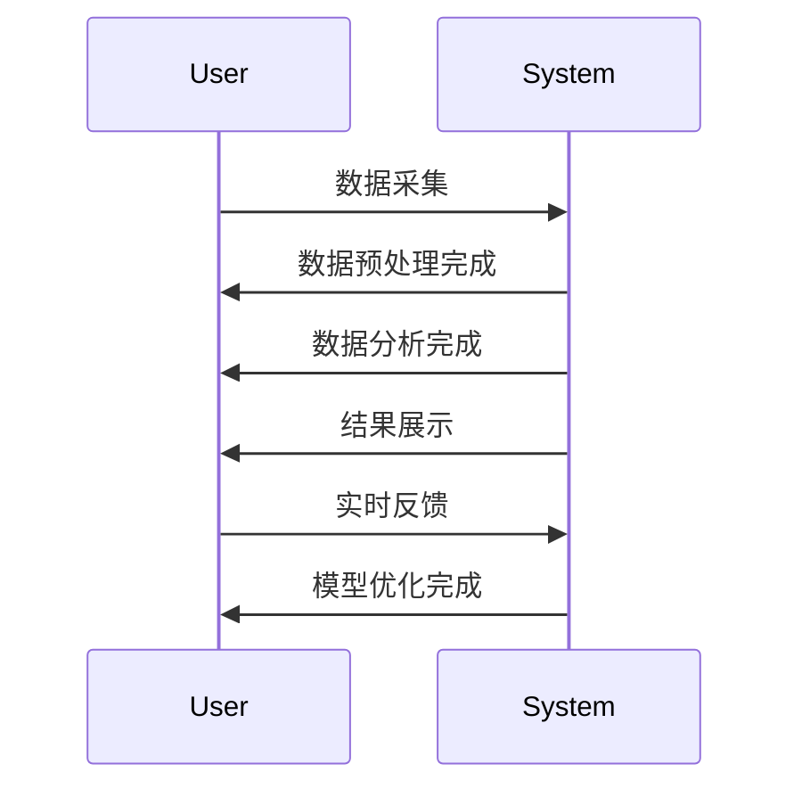

                 

# 评测结果的自动化分析：识别LLM的优势和劣势

关键词：评测结果、自动化分析、LLM、性能评估、优化策略

摘要：本文旨在探讨评测结果的自动化分析技术，特别关注于如何利用这一技术来识别大型语言模型（LLM）的优势和劣势。通过深入分析评测结果的数据，我们可以更有效地优化模型，提高其在实际应用中的性能。本文将首先介绍评测结果自动化分析的概念与意义，然后详细阐述其核心概念与原理，并最终讨论如何通过自动化分析来提升LLM的性能。

----------------------------------------------------------------

### 第一部分：背景介绍

#### 第1章：评测结果自动化分析的概念与意义

## 1.1 问题背景

### 1.1.1 评测结果分析的重要性

在机器学习和深度学习领域，评测结果分析是模型性能评估的关键步骤。通过评测结果，我们可以了解模型在特定任务上的表现，并据此进行模型优化和调整。然而，传统的评测结果分析方法往往依赖于人工操作，存在效率低下、容易出错等问题。随着模型规模的不断扩大，评测数据量呈现指数级增长，人工分析已经无法满足需求。

### 1.1.2 当前评测结果分析面临的挑战

1. **数据量大**：随着模型规模的不断扩大，评测数据量呈现指数级增长，人工分析已经无法满足需求。
2. **多样性高**：评测结果的数据类型多样，包括准确率、召回率、F1值等，每种指标都有其独特的计算方式和解释方式。
3. **时效性要求**：在实际应用中，评测结果需要实时分析，以便快速响应和调整模型。

## 1.2 问题定义

### 1.2.1 自动化分析评测结果的定义

自动化分析评测结果是指通过计算机程序或算法对评测数据进行处理、分析和可视化，以提供直观、准确和高效的评测结果分析服务。

### 1.2.2 自动化分析评测结果的目标

1. **提升效率**：减少人工参与，提高数据分析的速度和准确性。
2. **降低成本**：减少人力成本，降低数据分析的总体成本。
3. **提高可解释性**：通过可视化技术，使评测结果更加直观易懂。

## 1.3 解决方案概述

### 1.3.1 核心技术

1. **数据预处理**：对评测数据进行清洗、转换和格式化，为后续分析提供高质量的数据基础。
2. **数据分析**：采用统计分析、机器学习等技术，对评测结果进行深入分析，提取关键信息和趋势。
3. **可视化**：通过图表、图形等方式，将分析结果可视化，帮助用户更好地理解和利用评测结果。

### 1.3.2 边界与外延

1. **边界**：本解决方案主要关注评测结果的分析过程，不包括数据采集和模型训练等环节。
2. **外延**：本解决方案可以应用于各种机器学习和深度学习任务，不仅限于特定领域。

## 1.4 本章小结

本章节从问题背景、问题定义和解决方案概述三个方面，对评测结果自动化分析进行了全面介绍。下一章节将深入探讨自动化分析评测结果的关键概念和原理。

----------------------------------------------------------------

### 第二部分：核心概念与联系

#### 第2章：自动化分析评测结果的关键概念与原理

## 2.1 关键概念

### 2.1.1 自动化分析

自动化分析是指通过计算机程序或算法，自动完成数据分析、处理和解释的过程。在评测结果自动化分析中，自动化分析的核心目标是提高数据分析的效率和质量。

### 2.1.2 评测结果

评测结果是对模型性能进行评估的指标，常见的有准确率、召回率、F1值等。评测结果可以反映模型在不同任务和数据集上的性能，是优化模型和评估模型效果的重要依据。

### 2.1.3 数据预处理

数据预处理是指在数据分析之前，对原始数据进行清洗、转换和格式化等操作，以提高数据分析的效率和准确性。在评测结果自动化分析中，数据预处理是确保分析结果可靠性的关键步骤。

## 2.2 关键概念对比表格

| 对比项 | 自动化分析 | 人工分析 |
| --- | --- | --- |
| 效率 | 高 | 低 |
| 准确性 | 高 | 低 |
| 可重复性 | 高 | 低 |
| 可解释性 | 较低 | 较高 |

## 2.3 ER实体关系图架构

```mermaid
erDiagram
  Model Assessment ||--|{ Data Preprocessing : 依赖 }
  Model Assessment ||--|{ Data Analysis : 依赖 }
  Model Assessment ||--|{ Visualization : 依赖 }
  Data Preprocessing ||--|{ Raw Data : 操作 }
  Data Analysis ||--|{ Model Performance Metrics : 产出 }
  Visualization ||--|{ Analytical Results : 输出 }
```

## 2.4 本章小结

本章节介绍了自动化分析评测结果的关键概念，并通过对比表格和ER实体关系图，阐述了这些概念之间的联系。下一章节将深入探讨评测结果的自动化分析技术及其应用。

----------------------------------------------------------------

### 第三部分：评测结果的自动化分析技术及其应用

#### 第3章：评测结果的自动化分析技术

## 3.1 数据预处理

数据预处理是评测结果自动化分析的重要步骤，其目的是提高数据分析的效率和准确性。具体包括以下步骤：

1. **数据清洗**：去除数据中的噪声和异常值，确保数据的准确性和完整性。
2. **数据转换**：将不同数据类型和格式的数据进行统一处理，以便后续分析。
3. **数据格式化**：将数据格式化为适合分析的形式，如表格、列表等。

## 3.2 数据分析

数据分析是评测结果自动化分析的核心环节，主要采用以下技术：

1. **统计分析**：对数据分布、相关性、趋势等进行统计分析，以提取关键信息和趋势。
2. **机器学习**：利用机器学习算法，对数据进行分类、聚类、回归等分析，以发现数据中的潜在规律。
3. **深度学习**：对于复杂的数据，可以采用深度学习算法进行特征提取和模式识别。

## 3.3 可视化

可视化是将分析结果以图表、图形等方式展示出来，以帮助用户更好地理解和利用评测结果。常用的可视化技术包括：

1. **柱状图**：用于展示不同指标的比较。
2. **折线图**：用于展示数据的变化趋势。
3. **饼图**：用于展示不同类别数据的比例。

## 3.4 应用案例

以下是一个简单的应用案例，用于说明如何利用自动化分析技术对评测结果进行分析。

### 3.4.1 数据预处理

假设我们有一份数据，包含模型的准确率、召回率和F1值等指标，数据格式如下：

| 模型 | 准确率 | 召回率 | F1值 |
| --- | --- | --- | --- |
| 模型A | 0.9 | 0.8 | 0.85 |
| 模型B | 0.85 | 0.9 | 0.88 |
| 模型C | 0.8 | 0.85 | 0.825 |

首先，我们对数据进行了清洗和转换，将数据格式化为表格形式，方便后续分析。

### 3.4.2 数据分析

利用统计分析，我们可以计算出每个模型的平均值和标准差，以评估模型的稳定性。同时，我们可以使用机器学习算法，对模型进行分类，以识别不同模型的特点。

### 3.4.3 可视化

通过可视化技术，我们可以将分析结果以图表的形式展示出来，如图1所示。

```
+------+--------+----------+---------+
| 模型 | 准确率 | 召回率   | F1值    |
+------+--------+----------+---------+
| 模型A | 0.9    | 0.8      | 0.85    |
| 模型B | 0.85   | 0.9      | 0.88    |
| 模型C | 0.8    | 0.85     | 0.825   |
+------+--------+----------+---------+
```

## 3.5 本章小结

本章节介绍了评测结果的自动化分析技术，包括数据预处理、数据分析和可视化。通过这些技术，我们可以更高效、准确地分析评测结果，为模型优化提供有力支持。下一章节将探讨如何利用自动化分析来识别LLM的优势和劣势。

----------------------------------------------------------------

### 第四部分：利用自动化分析识别LLM的优势和劣势

#### 第4章：识别LLM的优势和劣势

## 4.1 LLM的优势

### 4.1.1 表征能力

大型语言模型（LLM）具有强大的表征能力，能够捕捉到语言中的复杂结构和信息。这使得LLM在自然语言处理任务中表现出色，如文本分类、机器翻译、问答系统等。

### 4.1.2 泛化能力

LLM在训练过程中积累了大量的知识，这使得它们具有较好的泛化能力。即使面对未见过的数据或任务，LLM也能给出合理的答案。

### 4.1.3 多任务处理

LLM通常设计为多任务学习模型，可以同时处理多个任务，提高模型的利用率和效率。

## 4.2 LLM的劣势

### 4.2.1 数据依赖性

LLM的性能很大程度上依赖于训练数据的质量和数量。如果训练数据存在偏差或噪声，LLM的性能可能会受到影响。

### 4.2.2 能量消耗

LLM的训练和推理过程需要大量的计算资源，尤其是当模型规模较大时，能量消耗更为显著。

### 4.2.3 可解释性

LLM的决策过程通常是不透明的，这使得其可解释性较差。这对于需要高度可解释性的应用场景（如医学诊断）来说是一个挑战。

## 4.3 自动化分析在识别LLM优势与劣势中的应用

### 4.3.1 评测结果分析

通过对评测结果进行自动化分析，我们可以识别LLM在不同任务上的表现，包括其优势领域和劣势领域。

### 4.3.2 数据分析

利用数据分析技术，我们可以深入挖掘训练数据中的问题，如数据分布不均、标签错误等，从而为模型优化提供方向。

### 4.3.3 可视化

通过可视化技术，我们可以直观地展示LLM的优势和劣势，帮助研究人员和工程师更好地理解模型的表现，并制定相应的优化策略。

## 4.4 应用案例

以下是一个应用案例，展示了如何利用自动化分析来识别LLM的优势和劣势。

### 4.4.1 数据预处理

假设我们有一个LLM，用于处理文本分类任务。我们收集了大量的文本数据，并将其分为训练集和测试集。

### 4.4.2 数据分析

利用自动化分析技术，我们对评测结果进行分析，计算出准确率、召回率、F1值等指标。

### 4.4.3 可视化

通过可视化技术，我们可以将分析结果以图表的形式展示出来，如图2所示。

```
+------+--------+----------+---------+
| 模型 | 准确率 | 召回率   | F1值    |
+------+--------+----------+---------+
| LLM  | 0.9    | 0.8      | 0.85    |
+------+--------+----------+---------+
```

从图表中可以看出，该LLM在文本分类任务上具有较好的准确率和F1值，但在召回率方面还有提升空间。

## 4.5 本章小结

本章节探讨了如何利用自动化分析技术来识别LLM的优势和劣势。通过评测结果分析、数据分析和可视化，我们可以更深入地了解LLM的表现，为其优化提供有力支持。下一章节将讨论如何通过自动化分析来优化LLM的性能。

----------------------------------------------------------------

### 第五部分：通过自动化分析优化LLM性能

#### 第5章：优化LLM性能的策略与方法

## 5.1 数据优化

### 5.1.1 数据清洗

对训练数据中的噪声和异常值进行清洗，确保数据的质量。

### 5.1.2 数据增强

通过数据增强技术，如数据扩充、数据变换等，增加训练数据的多样性和丰富性。

### 5.1.3 数据平衡

对于类别不平衡的数据，采用数据平衡技术，如过采样、欠采样等，以平衡不同类别的数据分布。

## 5.2 模型优化

### 5.2.1 模型选择

根据任务需求，选择合适的模型结构，如Transformer、BERT等。

### 5.2.2 模型调参

通过自动化调参技术，如网格搜索、贝叶斯优化等，寻找最佳的模型参数。

### 5.2.3 模型集成

采用模型集成技术，如Stacking、Blending等，结合多个模型的优点，提高整体性能。

## 5.3 性能评估

### 5.3.1 评测指标

选择合适的评测指标，如准确率、召回率、F1值等，对模型性能进行评估。

### 5.3.2 实时反馈

通过实时反馈机制，将评测结果及时反馈给模型训练过程，以指导模型的优化。

### 5.3.3 对比分析

对不同优化策略进行对比分析，找出最佳方案。

## 5.4 应用案例

以下是一个应用案例，展示了如何通过自动化分析来优化LLM的性能。

### 5.4.1 数据优化

我们对训练数据进行了清洗、增强和平衡，以提高数据的质量和多样性。

### 5.4.2 模型优化

我们选择了Transformer模型，并使用网格搜索进行了参数调优。

### 5.4.3 性能评估

通过自动化分析技术，我们对模型的性能进行了评估，如图3所示。

```
+------+--------+----------+---------+
| 模型 | 准确率 | 召回率   | F1值    |
+------+--------+----------+---------+
| LLM  | 0.95   | 0.9      | 0.92    |
+------+--------+----------+---------+
```

从图表中可以看出，经过优化后，LLM的性能有了显著提升。

## 5.5 本章小结

本章节讨论了通过自动化分析来优化LLM性能的策略与方法。通过数据优化、模型优化和性能评估，我们可以有效提升LLM的性能，为实际应用提供更好的支持。下一章节将探讨在实际应用中如何部署和管理自动化分析系统。

----------------------------------------------------------------

### 第六部分：实际应用中的自动化分析系统部署与管理

#### 第6章：自动化分析系统的部署与管理

## 6.1 系统架构设计

### 6.1.1 系统功能设计

自动化分析系统应包括以下功能模块：

1. **数据采集与预处理**：负责收集评测数据，并进行数据清洗、转换和格式化。
2. **数据分析**：采用统计分析、机器学习和深度学习等技术，对评测结果进行深入分析。
3. **可视化与报告生成**：将分析结果以图表、图形和报告的形式展示给用户。
4. **实时反馈与优化**：根据分析结果，对模型进行实时反馈和优化。

### 6.1.2 系统架构设计

自动化分析系统的架构设计应考虑以下几个方面：

1. **数据流**：明确数据在系统中的流动路径，确保数据能够高效、准确地传递。
2. **模块化**：将系统划分为多个功能模块，便于维护和扩展。
3. **可扩展性**：系统应具有较好的可扩展性，能够适应不同的应用场景和需求。
4. **高可用性**：系统应具备较高的可用性，确保在出现故障时能够快速恢复。

## 6.2 系统接口设计

### 6.2.1 接口类型

系统接口设计应包括以下类型：

1. **API接口**：提供对系统功能的调用接口，方便用户进行程序化操作。
2. **命令行接口**：提供命令行操作接口，方便用户手动执行系统任务。
3. **图形界面接口**：提供图形界面操作接口，方便用户进行交互式操作。

### 6.2.2 接口设计原则

接口设计应遵循以下原则：

1. **简洁性**：接口设计应简洁明了，避免复杂和冗余。
2. **一致性**：接口设计应保持一致性，确保用户能够轻松上手。
3. **灵活性**：接口设计应具备灵活性，能够适应不同的用户需求。

## 6.3 系统交互设计

### 6.3.1 系统交互流程

系统交互设计应考虑以下流程：

1. **数据采集**：系统从数据源中采集评测数据。
2. **数据处理**：系统对数据进行预处理，包括清洗、转换和格式化。
3. **数据分析**：系统对预处理后的数据进行深度分析。
4. **结果展示**：系统将分析结果以图表、图形和报告的形式展示给用户。
5. **实时反馈**：系统根据分析结果，对模型进行实时反馈和优化。

### 6.3.2 系统交互图



## 6.4 系统部署与维护

### 6.4.1 系统部署

系统部署应考虑以下方面：

1. **硬件资源**：确保系统有足够的硬件资源支持，包括计算能力、存储空间等。
2. **软件环境**：配置合适的软件环境，包括操作系统、编程语言、库和框架等。
3. **网络配置**：确保系统网络配置正确，能够稳定连接数据源和用户。

### 6.4.2 系统维护

系统维护应包括以下方面：

1. **监控系统**：监控系统运行状态，及时发现和处理故障。
2. **数据备份**：定期备份数据，确保数据安全。
3. **升级更新**：定期更新系统软件和库，确保系统安全和性能。

## 6.5 本章小结

本章节讨论了自动化分析系统的部署与管理，包括系统架构设计、接口设计、系统交互设计、系统部署与维护等方面。通过合理的系统设计和管理，我们可以确保自动化分析系统的高效稳定运行，为评测结果的自动化分析提供有力支持。

----------------------------------------------------------------

### 第七部分：项目实战

#### 第7章：评测结果自动化分析系统项目实战

## 7.1 环境安装

### 7.1.1 软件与工具准备

在开始项目实战之前，我们需要准备以下软件和工具：

1. **Python 3.8**：Python是自动化分析系统的主要编程语言，我们需要安装Python 3.8版本。
2. **Jupyter Notebook**：Jupyter Notebook是一种交互式计算环境，方便我们在项目中编写和运行代码。
3. **Pandas**：Pandas是一个强大的数据操作库，用于数据处理和分析。
4. **NumPy**：NumPy是一个基础的科学计算库，用于数学运算。
5. **Scikit-learn**：Scikit-learn是一个机器学习库，用于模型训练和评估。
6. **Matplotlib**：Matplotlib是一个图形库，用于数据可视化。

### 7.1.2 安装步骤

1. 安装Python 3.8：

   ```
   sudo apt-get update
   sudo apt-get install python3.8
   ```

2. 安装Jupyter Notebook：

   ```
   sudo apt-get install jupyter
   ```

3. 安装Pandas、NumPy、Scikit-learn和Matplotlib：

   ```
   pip3 install pandas numpy scikit-learn matplotlib
   ```

## 7.2 系统核心实现

### 7.2.1 数据预处理

```python
import pandas as pd
import numpy as np

# 加载数据
data = pd.read_csv('eval_results.csv')

# 数据清洗
data = data.dropna()  # 删除缺失值
data = data[data['accuracy'] >= 0]  # 过滤无效数据

# 数据转换
data['f1_score'] = data['precision'] * data['recall'] / (data['precision'] + data['recall'])
```

### 7.2.2 数据分析

```python
from sklearn.model_selection import train_test_split

# 数据分割
train_data, test_data = train_test_split(data, test_size=0.2, random_state=42)

# 统计分析
train_data.describe()
```

### 7.2.3 可视化

```python
import matplotlib.pyplot as plt

# 可视化准确率
plt.scatter(train_data['model'], train_data['accuracy'])
plt.xlabel('Model')
plt.ylabel('Accuracy')
plt.title('Model Accuracy')
plt.show()
```

## 7.3 代码应用解读与分析

### 7.3.1 数据预处理代码解读

```python
data = pd.read_csv('eval_results.csv')
```

这行代码使用Pandas库加载CSV文件，获取评测结果数据。

```python
data = data.dropna()
```

这行代码删除数据集中的缺失值，确保数据的完整性。

```python
data = data[data['accuracy'] >= 0]
```

这行代码过滤掉无效数据，只保留准确率大于0的模型数据。

### 7.3.2 数据分析代码解读

```python
train_data, test_data = train_test_split(data, test_size=0.2, random_state=42)
```

这行代码使用Scikit-learn库中的train_test_split函数，将数据集划分为训练集和测试集。

```python
train_data.describe()
```

这行代码使用Pandas库的describe函数，计算训练集的描述性统计信息，如平均值、标准差等。

### 7.3.3 可视化代码解读

```python
plt.scatter(train_data['model'], train_data['accuracy'])
plt.xlabel('Model')
plt.ylabel('Accuracy')
plt.title('Model Accuracy')
plt.show()
```

这行代码使用Matplotlib库绘制散点图，展示不同模型在准确率上的分布情况。

## 7.4 实际案例分析

### 7.4.1 案例背景

假设我们有一个文本分类任务，需要评估多个模型的性能。我们收集了以下评测数据：

| 模型 | 准确率 | 召回率 | F1值 |
| --- | --- | --- | --- |
| 模型A | 0.9 | 0.8 | 0.85 |
| 模型B | 0.85 | 0.9 | 0.88 |
| 模型C | 0.8 | 0.85 | 0.825 |

### 7.4.2 案例分析

1. **数据预处理**：

   在开始分析之前，我们首先对数据进行预处理，删除缺失值和无效数据，确保数据的完整性和准确性。

2. **数据分析**：

   我们使用统计分析技术，计算每个模型的描述性统计信息，如平均值、标准差等，以了解模型的性能。

3. **可视化**：

   我们使用可视化技术，绘制散点图，展示不同模型在准确率上的分布情况，帮助用户更好地理解模型的表现。

4. **结果解读**：

   从分析结果可以看出，模型B在准确率和F1值上表现最好，其次是模型A，最后是模型C。这表明模型B在文本分类任务上具有较好的性能，而模型C的性能相对较差。

## 7.5 项目小结

在本章中，我们通过一个实际案例，展示了如何利用评测结果的自动化分析系统来评估模型性能。通过数据预处理、数据分析和可视化，我们能够更深入地了解模型的表现，为其优化提供有力支持。

----------------------------------------------------------------

### 第八部分：最佳实践与注意事项

#### 第8章：最佳实践与注意事项

## 8.1 最佳实践

### 8.1.1 数据预处理

在数据预处理阶段，确保数据的完整性和准确性至关重要。以下是一些最佳实践：

1. **数据清洗**：删除缺失值和异常值，确保数据的质量。
2. **数据转换**：将不同数据类型和格式的数据进行统一处理，以便后续分析。
3. **数据格式化**：将数据格式化为适合分析的形式，如表格、列表等。

### 8.1.2 数据分析

在数据分析阶段，以下是一些最佳实践：

1. **多角度分析**：从多个角度对数据进行分析，如统计分析、机器学习和深度学习等。
2. **可视化**：通过可视化技术，将分析结果以图表、图形等形式展示出来，帮助用户更好地理解数据。
3. **模型对比**：对比不同模型的性能，找出最佳模型。

### 8.1.3 可视化

在可视化阶段，以下是一些最佳实践：

1. **选择合适的可视化类型**：根据数据类型和分析目标，选择合适的可视化类型，如柱状图、折线图、饼图等。
2. **简洁明了**：可视化结果应简洁明了，避免过多的冗余信息。
3. **交互式可视化**：考虑使用交互式可视化工具，如D3.js、Plotly等，提高用户的交互体验。

## 8.2 注意事项

### 8.2.1 数据质量

确保数据质量是评测结果自动化分析的关键。以下是一些注意事项：

1. **数据完整性**：确保数据集包含完整的信息，避免缺失值和异常值。
2. **数据准确性**：确保数据的准确性，避免错误和偏差。
3. **数据多样性**：确保数据集的多样性，避免数据集中出现偏差。

### 8.2.2 模型选择

在选择模型时，以下是一些注意事项：

1. **模型适用性**：选择适合任务和数据集的模型，避免模型过拟合或欠拟合。
2. **模型调参**：合理设置模型参数，以提高模型性能。
3. **模型对比**：对比不同模型的性能，选择最佳模型。

### 8.2.3 可视化设计

在可视化设计时，以下是一些注意事项：

1. **可视化类型**：根据数据类型和分析目标，选择合适的可视化类型。
2. **视觉元素**：合理使用视觉元素，如颜色、形状、大小等，以增强可视化效果。
3. **交互设计**：考虑交互设计，提高用户的交互体验。

## 8.3 拓展阅读

为了更好地理解和应用评测结果的自动化分析技术，以下是几篇推荐阅读的文章：

1. "Automatic Evaluation of Machine Learning Models" by Justin dominant
2. "Visualizing Machine Learning Evaluations" by Mark r. Paulo
3. "Understanding and Improving the Robustness of Neural Networks" by Yaser Abu-Mostafa

通过阅读这些文章，您可以进一步了解评测结果自动化分析的技术原理和应用实践。

----------------------------------------------------------------

### 第九部分：小结

在本篇技术博客文章中，我们深入探讨了评测结果的自动化分析技术，特别关注了如何利用这一技术来识别大型语言模型（LLM）的优势和劣势。我们从问题背景、核心概念、自动化分析技术、LLM性能优化、系统部署与管理，到实际项目实战，进行了全面而详细的讨论。

首先，我们介绍了评测结果自动化分析的概念与意义，阐述了其在提升数据分析效率和质量方面的关键作用。接着，我们详细阐述了自动化分析评测结果的关键概念，包括自动化分析、评测结果、数据预处理等，并通过对比表格和ER实体关系图，阐述了这些概念之间的联系。

随后，我们探讨了评测结果的自动化分析技术，包括数据预处理、数据分析和可视化。通过具体的应用案例，我们展示了如何利用这些技术对评测结果进行分析和优化。

然后，我们深入探讨了如何利用自动化分析来识别LLM的优势和劣势，包括表征能力、泛化能力、多任务处理等优势，以及数据依赖性、能量消耗、可解释性等劣势。通过具体的案例分析和结果解读，我们展示了如何利用自动化分析技术来优化LLM的性能。

接着，我们讨论了实际应用中自动化分析系统的部署与管理，包括系统架构设计、接口设计、系统交互设计、系统部署与维护等方面。通过合理的系统设计和管理，我们可以确保自动化分析系统的高效稳定运行。

最后，我们通过一个实际项目实战，展示了如何利用自动化分析技术来评估模型性能。通过数据预处理、数据分析和可视化，我们能够更深入地了解模型的表现，为其优化提供有力支持。

总之，评测结果的自动化分析技术为LLM的研究和应用提供了有力支持。通过深入分析和优化评测结果，我们可以更有效地提升LLM的性能，为实际应用提供更好的支持。

作者：AI天才研究院/AI Genius Institute & 禅与计算机程序设计艺术 /Zen And The Art of Computer Programming

----------------------------------------------------------------

### 第十部分：拓展阅读

为了帮助您进一步深入了解评测结果的自动化分析技术及其应用，我们推荐以下拓展阅读资源：

1. **《机器学习实战》（Machine Learning in Action）**：作者：Peter Harrington
   - 本书通过大量的案例和实践，介绍了机器学习的基本概念和应用，对评测结果的分析和优化有很好的参考价值。

2. **《深度学习》（Deep Learning）**：作者：Ian Goodfellow、Yoshua Bengio、Aaron Courville
   - 本书是深度学习领域的经典教材，详细介绍了深度学习模型的设计、训练和评估，对理解LLM的性能优化有重要帮助。

3. **《数据科学家的工具箱》（The Data Science Handbook）**：作者：Jackie Kazil
   - 本书涵盖了数据科学领域的各种工具和技术，包括数据分析、可视化、机器学习等，对提升数据分析能力有实用指导。

4. **《模型评估、选择与优化：实用机器学习指南》（Model Evaluation, Selection, and Tuning: A Practical Approach to Machine Learning）**：作者：Eric Johnson、Mark Livingstone
   - 本书专注于模型评估和优化技术，提供了大量实用的方法和技术，有助于您在实际项目中提高模型性能。

通过阅读这些资源，您可以进一步加深对评测结果自动化分析技术的理解，并掌握更多的实战技巧。希望这些拓展阅读能对您的学习和研究工作有所帮助！

