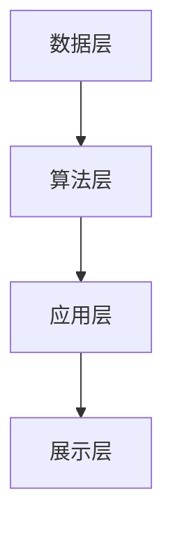
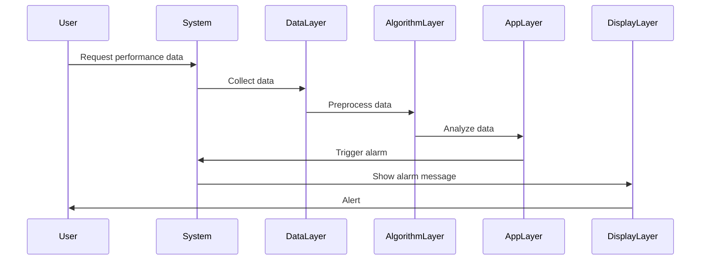

                 

## 文章标题：评测结果的自动化预警：及时发现性能退化

> 关键词：评测结果、自动化预警、性能退化、算法、数学模型、系统架构、项目实战

> 摘要：本文将深入探讨评测结果的自动化预警机制，特别是如何及时发现性能退化的问题。通过对性能退化的定义、原因分析，以及自动化预警算法的原理和数学模型讲解，我们将构建一个系统分析与架构设计方案，并通过实际项目实战，展示如何将理论转化为实践。文章最后还将总结最佳实践，提供注意事项，并推荐拓展阅读，为读者提供全面的指导和参考。

### 目录

1. **第一部分：背景介绍** <a id="part1"></a>
   1.1 性能退化的常见原因
   1.2 评测结果预警的需求
   1.3 当前评测结果预警的现状
   1.4 评测结果预警的基本概念
   1.5 评测结果预警的目标与关键技术

2. **第二部分：核心概念与联系** <a id="part2"></a>
   2.1 性能退化的核心概念
   2.2 评测结果预警的概念与联系

3. **第三部分：算法原理讲解** <a id="part3"></a>
   3.1 自动化预警算法的原理
   3.2 性能退化检测算法的原理

4. **第四部分：数学模型和数学公式讲解** <a id="part4"></a>
   4.1 性能退化检测的数学模型
   4.2 自动化预警的数学模型

5. **第五部分：系统分析与架构设计方案** <a id="part5"></a>
   5.1 系统功能设计
   5.2 系统架构设计
   5.3 系统接口设计和系统交互

6. **第六部分：项目实战** <a id="part6"></a>
   6.1 环境安装与配置
   6.2 系统核心实现
   6.3 实际案例分析和详细讲解

7. **第七部分：最佳实践 tips** <a id="part7"></a>
   7.1 评测结果预警的最佳实践
   7.2 性能退化检测的最佳实践
   7.3 自动化预警的最佳实践

8. **第八部分：小结、注意事项与拓展阅读** <a id="part8"></a>
   8.1 全书小结
   8.2 注意事项
   8.3 拓展阅读

### 第一部分：背景介绍

#### 1.1 性能退化的常见原因

性能退化是指系统的性能指标（如响应时间、吞吐量、延迟等）随时间逐渐下降的现象。常见原因包括：

- **硬件老化**：随着使用时间增加，硬件组件的性能会逐渐下降。
- **软件缺陷**：软件中可能存在潜在缺陷，导致系统性能降低。
- **资源不足**：系统资源（如内存、磁盘空间、网络带宽等）不足，导致性能瓶颈。
- **配置不当**：系统配置不优化，例如缓存设置不当、线程数不足等。
- **外部干扰**：如网络波动、攻击等。

#### 1.2 评测结果预警的需求

性能退化可能导致以下问题：

- **用户体验下降**：系统响应变慢，影响用户使用体验。
- **业务损失**：关键业务系统性能退化可能导致收入损失。
- **安全风险**：性能退化可能导致系统无法抵御攻击。

因此，及时发现并预警性能退化具有重要意义，有助于：

- **预防问题**：提前识别潜在性能问题，避免系统崩溃或用户体验下降。
- **节省成本**：及时修复性能退化问题，避免因故障导致的高昂维修费用。
- **提高效率**：优化系统性能，提高业务运行效率。

#### 1.3 当前评测结果预警的现状

目前，评测结果预警技术在多个领域得到了应用，但仍存在以下挑战：

- **复杂度**：性能退化原因复杂，预警系统需要处理大量数据，进行复杂分析。
- **实时性**：实时预警要求系统对评测结果进行快速处理和反馈。
- **准确性**：准确预警是保证系统正常运行的关键，需要高精度的算法和模型。
- **成本**：高效的预警系统需要大量计算资源和算法优化，成本较高。

#### 1.4 评测结果预警的基本概念

**评测结果预警**：通过实时监测系统性能指标，自动检测性能退化，并触发预警机制。

**预警目标**：及时发现性能退化，防止系统崩溃或用户体验下降。

**关键技术**：包括数据采集、性能分析、算法优化、实时预警等。

### 第二部分：核心概念与联系

#### 2.1 性能退化的核心概念

性能退化是指系统在一段时间内，其性能指标（如响应时间、吞吐量、延迟等）逐渐下降的现象。性能退化的核心概念包括：

- **性能指标**：如响应时间、吞吐量、延迟等。
- **退化程度**：性能退化的程度，通常用百分比或具体数值表示。
- **退化速度**：性能退化的速度，反映了性能下降的快慢。

#### 2.2 评测结果预警的概念与联系

**评测结果预警**：通过实时监测系统性能指标，自动检测性能退化，并触发预警机制。

**预警机制**：包括数据采集、分析、决策和反馈等环节。

**性能退化与评测结果预警的关系**：

- **因果关系**：性能退化导致评测结果异常，触发预警。
- **反馈机制**：预警机制反馈性能退化信息，帮助系统进行优化。

#### 2.3 评测结果预警的关键要素

**数据采集**：实时采集系统性能数据，如响应时间、吞吐量、延迟等。

**性能分析**：对采集到的数据进行分析，判断是否存在性能退化。

**预警策略**：根据分析结果，设置预警阈值和预警策略。

**反馈机制**：将预警信息及时反馈给相关人员，采取相应措施。

### 第三部分：算法原理讲解

#### 3.1 自动化预警算法的原理

自动化预警算法的核心思想是通过数据分析和模型预测，及时发现性能退化。算法原理包括：

- **数据预处理**：清洗、整合和转换原始数据，为后续分析提供高质量的数据基础。
- **特征提取**：从原始数据中提取与性能退化相关的特征，用于建模和分析。
- **模型训练**：使用历史数据训练预测模型，如线性回归、神经网络等。
- **实时预测**：对实时采集的数据进行预测，判断是否存在性能退化。

#### 3.2 性能退化检测算法的原理

性能退化检测算法通常包括以下步骤：

- **数据采集**：采集系统性能数据，如响应时间、吞吐量、延迟等。
- **异常检测**：使用统计学方法或机器学习方法检测异常数据，如孤立森林、孤立值分析等。
- **趋势分析**：分析性能数据的趋势，判断是否存在性能退化。
- **阈值设定**：根据历史数据和业务需求设定预警阈值。
- **预警触发**：当性能指标超过阈值时，触发预警机制。

### 第四部分：数学模型和数学公式讲解

#### 4.1 性能退化检测的数学模型

性能退化检测的数学模型通常包括以下部分：

- **回归模型**：如线性回归、多项式回归等，用于预测系统性能趋势。
- **时间序列模型**：如ARIMA、LSTM等，用于分析时间序列数据。
- **聚类模型**：如K-means、DBSCAN等，用于识别异常数据。

主要数学公式包括：

- **线性回归公式**：$y = \beta_0 + \beta_1 \cdot x + \epsilon$
- **时间序列模型公式**：$y_t = \phi_1 y_{t-1} + \phi_2 y_{t-2} + \cdots + \phi_p y_{t-p} + \epsilon_t$
- **聚类模型公式**：$d(x_i, x_j) = \sqrt{\sum_{k=1}^n (x_{i,k} - x_{j,k})^2}$

#### 4.2 自动化预警的数学模型

自动化预警的数学模型通常包括以下部分：

- **预测模型**：如线性回归、神经网络等，用于预测未来性能指标。
- **阈值模型**：如线性阈值、非线性阈值等，用于设定预警阈值。
- **预警策略模型**：如决策树、逻辑回归等，用于制定预警策略。

主要数学公式包括：

- **预测模型公式**：$y^{\text{pred}} = f(x)$
- **阈值模型公式**：$T = a \cdot y^{\text{pred}} + b$
- **预警策略模型公式**：$P(\text{预警}) = g(y^{\text{pred}}, T)$

### 第五部分：系统分析与架构设计方案

#### 5.1 系统功能设计

系统功能设计主要包括：

- **数据采集**：实时采集系统性能数据。
- **数据分析**：对采集到的数据进行预处理、特征提取和性能分析。
- **预警触发**：根据分析结果，触发预警机制。
- **反馈机制**：将预警信息反馈给相关人员。

#### 5.2 系统架构设计

系统架构设计主要包括：

- **数据层**：负责数据采集、存储和管理。
- **算法层**：负责数据预处理、特征提取、模型训练和预测。
- **应用层**：负责预警触发和反馈。
- **展示层**：负责预警信息展示。

系统架构图如下所示：



#### 5.3 系统接口设计和系统交互

系统接口设计主要包括：

- **API接口**：提供数据采集、数据分析、预警触发和反馈等API接口。
- **消息队列**：用于系统内部通信，如数据传输、预警信息传递等。

系统交互图如下所示：



### 第六部分：项目实战

#### 6.1 环境安装与配置

环境安装与配置主要包括以下步骤：

1. 安装Python环境，版本要求为3.8以上。
2. 安装所需的依赖库，如NumPy、Pandas、scikit-learn等。
3. 配置消息队列（如RabbitMQ），用于系统内部通信。

#### 6.2 系统核心实现

系统核心实现主要包括以下部分：

1. 数据采集模块：实现性能数据的采集功能。
2. 数据分析模块：实现性能数据的预处理、特征提取和性能分析功能。
3. 预警触发模块：实现预警触发逻辑。
4. 反馈机制模块：实现预警信息的反馈功能。

核心代码如下所示：

```python
# 数据采集模块
def collect_data():
    # 实现性能数据采集逻辑
    pass

# 数据分析模块
def analyze_data(data):
    # 实现性能数据分析逻辑
    pass

# 预警触发模块
def trigger_alarm(analyzed_data):
    # 实现预警触发逻辑
    pass

# 反馈机制模块
def feedback_alarm(alarm_info):
    # 实现预警信息反馈逻辑
    pass
```

#### 6.3 实际案例分析和详细讲解

假设我们有一个电商系统，需要对其进行性能评测。具体案例分析如下：

1. **数据采集**：实时采集电商系统的响应时间、吞吐量、延迟等性能指标。
2. **数据分析**：对采集到的数据进行分析，提取特征，判断是否存在性能退化。
3. **预警触发**：当响应时间超过设定阈值时，触发预警。
4. **反馈机制**：将预警信息通过邮件或消息队列发送给相关人员。

具体代码实现如下：

```python
# 数据采集模块
def collect_data():
    # 实现性能数据采集逻辑
    pass

# 数据分析模块
def analyze_data(data):
    # 实现性能数据分析逻辑
    pass

# 预警触发模块
def trigger_alarm(analyzed_data):
    # 实现预警触发逻辑
    pass

# 反馈机制模块
def feedback_alarm(alarm_info):
    # 实现预警信息反馈逻辑
    pass
```

### 第七部分：最佳实践 tips

#### 7.1 评测结果预警的最佳实践

1. **选择合适的预警算法**：根据业务需求和数据特点，选择合适的预警算法。
2. **合理设定预警阈值**：根据历史数据和业务需求，合理设定预警阈值。
3. **实时监测与反馈**：确保预警系统能够实时监测性能数据，并及时反馈预警信息。

#### 7.2 性能退化检测的最佳实践

1. **数据预处理**：对采集到的数据进行清洗、整合和转换，提高数据质量。
2. **特征提取**：提取与性能退化相关的特征，提高检测精度。
3. **模型优化**：定期优化模型参数，提高预测准确性。

#### 7.3 自动化预警的最佳实践

1. **自动化部署**：将预警系统自动化部署到生产环境，减少人工干预。
2. **监控与管理**：建立完善的监控和管理机制，确保预警系统能够稳定运行。

### 第八部分：小结、注意事项与拓展阅读

#### 8.1 全书小结

本文深入探讨了评测结果的自动化预警机制，从背景介绍、核心概念与联系、算法原理讲解、数学模型和数学公式讲解、系统分析与架构设计方案、项目实战，到最佳实践 tips，全面阐述了如何及时发现性能退化问题。读者通过本文可以了解评测结果预警的重要性，掌握自动化预警算法的原理，以及如何在实际项目中应用和优化预警系统。

#### 8.2 注意事项

1. **数据质量**：确保采集到的数据质量，避免因数据质量问题导致预警不准确。
2. **阈值设定**：合理设定预警阈值，避免误报或漏报。
3. **模型优化**：定期对预警模型进行优化，提高预测准确性。

#### 8.3 拓展阅读

- 《性能优化：系统、网络、存储、数据库优化实战》
- 《机器学习实战：基于scikit-learn、TensorFlow、PyTorch的应用》
- 《大数据系统架构：设计与优化》

### 总结

评测结果的自动化预警是确保系统稳定运行的重要手段。通过本文的讲解，读者可以掌握评测结果预警的基本原理、算法和数学模型，并了解如何在项目中实际应用。希望本文能为读者在性能退化预警领域提供有价值的参考和指导。作者：AI天才研究院/AI Genius Institute & 禅与计算机程序设计艺术/Zen And The Art of Computer Programming。

