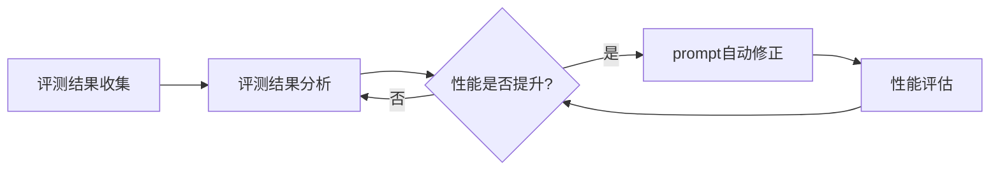

                 

# 评测结果驱动的prompt自动修正

## 关键词
- 评测结果
- prompt自动修正
- 自然语言处理
- 计算机视觉
- 机器学习

## 摘要
本文旨在探讨评测结果驱动的prompt自动修正技术，通过对评测结果的深入分析，自动修正prompt，提高人工智能系统的性能和准确性。文章首先介绍评测结果驱动的prompt自动修正的背景、定义和核心概念，然后详细解析算法原理、数学模型与公式、系统设计与实现，以及项目实战。最后，总结最佳实践，展望未来研究方向。

## Step 1: 分析用户需求，明确书籍主题

### 1.1 评测结果驱动的prompt自动修正背景

#### 1.1.1 评测结果驱动的prompt自动修正的起源

随着人工智能技术的快速发展，自然语言处理（NLP）、计算机视觉（CV）和机器学习（ML）等领域的应用越来越广泛。在这些领域中，prompt自动修正技术成为了提高系统性能和用户满意度的重要手段。评测结果驱动的prompt自动修正技术，正是基于对评测结果的深入分析，动态调整prompt，以达到最优的性能。

#### 1.1.2 评测结果驱动的prompt自动修正的应用场景

评测结果驱动的prompt自动修正技术可以应用于多种场景，如：

- 自然语言处理：自动修正拼写错误、语法错误、标点符号错误等。
- 计算机视觉：自动修正图像中的缺陷、提高图像质量等。
- 机器学习：通过调整prompt，优化模型的训练效果，提高模型的预测准确性。

#### 1.1.3 评测结果驱动的prompt自动修正的意义

评测结果驱动的prompt自动修正技术具有重要的意义：

- 提高系统性能：通过对评测结果的深入分析，自动修正prompt，可以提高系统的性能和准确性。
- 降低人力成本：自动修正prompt可以减少人工审核的工作量，降低人力成本。
- 提高用户体验：自动修正prompt可以提供更准确、更流畅的服务，提高用户体验。

### 1.2 评测结果驱动的prompt自动修正定义与核心概念

#### 1.2.1 评测结果驱动的prompt自动修正的定义

评测结果驱动的prompt自动修正是指：基于对评测结果的深入分析，动态调整prompt，以达到优化系统性能和准确性的目的。

#### 1.2.2 评测结果的概念

评测结果是指对系统性能的评估结果，包括准确性、召回率、F1值等指标。

#### 1.2.3 prompt的概念

prompt是指输入到系统中的原始文本或图像，用于触发系统的响应。

#### 1.2.4 自动修正的概念

自动修正是指系统自动对输入的文本或图像进行错误检测和修正。

### 1.3 评测结果驱动的prompt自动修正的技术框架

#### 1.3.1 数据采集与预处理

数据采集与预处理是评测结果驱动的prompt自动修正的基础。首先，需要收集大量的文本或图像数据，然后对这些数据进行清洗、去重、标注等预处理操作。

#### 1.3.2 评测结果分析

评测结果分析是评测结果驱动的prompt自动修正的核心。通过对评测结果的深入分析，可以找出系统中存在的问题，为prompt的自动修正提供依据。

#### 1.3.3 prompt自动修正算法

prompt自动修正算法是评测结果驱动的prompt自动修正的核心技术。常见的算法包括基于规则的方法、基于机器学习的方法等。

#### 1.3.4 系统部署与优化

系统部署与优化是评测结果驱动的prompt自动修正的最后一环。需要将自动修正算法部署到实际系统中，并通过不断优化，提高系统的性能和准确性。

### 1.4 评测结果驱动的prompt自动修正的应用领域

#### 1.4.1 自然语言处理

在自然语言处理领域，评测结果驱动的prompt自动修正技术可以用于拼写纠错、语法纠错、文本摘要等任务。

#### 1.4.2 计算机视觉

在计算机视觉领域，评测结果驱动的prompt自动修正技术可以用于图像修复、图像去噪、图像增强等任务。

#### 1.4.3 机器学习与数据挖掘

在机器学习与数据挖掘领域，评测结果驱动的prompt自动修正技术可以用于特征工程、模型调优等任务。

### 1.5 本章小结

本章介绍了评测结果驱动的prompt自动修正的背景、定义和核心概念，以及其技术框架和应用领域。为后续章节的深入讨论奠定了基础。

## Step 2: 设计书籍结构，保证内容完整性

### 第1章：评测结果驱动的prompt自动修正概述

本章将介绍评测结果驱动的prompt自动修正的背景、定义、核心概念和技术框架，为读者提供一个全面的概述。

### 第2章：评测结果与prompt自动修正技术基础

本章将详细解析评测结果和prompt自动修正技术的基础知识，包括相关技术概述、数据集与工具、实验环境搭建和性能指标。

### 第3章：评测结果驱动的prompt自动修正算法原理

本章将深入探讨评测结果驱动的prompt自动修正算法原理，包括算法概述、原理讲解和mermaid流程图。

### 第4章：评测结果驱动的prompt自动修正数学模型与公式

本章将介绍评测结果驱动的prompt自动修正的数学模型与公式，包括数学模型概述、模型讲解和举例说明。

### 第5章：评测结果驱动的prompt自动修正系统设计与实现

本章将详细讲解评测结果驱动的prompt自动修正系统设计与实现，包括系统设计与实现概述、系统架构设计、系统接口设计、系统交互设计和系统实现与优化。

### 第6章：评测结果驱动的prompt自动修正项目实战

本章将分享一个评测结果驱动的prompt自动修正项目实战，包括项目背景、环境安装与配置、系统核心实现源代码和实际案例分析。

### 第7章：最佳实践、小结与拓展阅读

本章将总结最佳实践，回顾全书内容，并提供拓展阅读资源，以帮助读者深入了解评测结果驱动的prompt自动修正技术。

### 2.1 书籍结构设计原则

- 系统性：确保书籍内容逻辑清晰、结构严谨，各章节之间相互关联、相互补充。
- 实用性：注重实际应用场景，结合实际项目案例，使读者能够快速掌握评测结果驱动的prompt自动修正技术。
- 先易后难：逐步深入，从基础知识到高级技术，使读者能够循序渐进地学习。
- 互动性：鼓励读者参与讨论和互动，提高学习兴趣和效果。

### 2.2 书籍结构设计目标

- 提高读者对评测结果驱动的prompt自动修正技术的理解和掌握。
- 培养读者在自然语言处理、计算机视觉和机器学习等领域的实践能力。
- 为读者提供一套系统、全面、实用的评测结果驱动的prompt自动修正技术指南。

### 2.3 书籍结构设计思路

- 引入：介绍评测结果驱动的prompt自动修正的背景、定义和核心概念。
- 基础：详细讲解评测结果和prompt自动修正技术的基础知识。
- 算法：深入探讨评测结果驱动的prompt自动修正算法原理。
- 系统：讲解评测结果驱动的prompt自动修正系统设计与实现。
- 实战：分享实际项目案例，让读者动手实践。
- 总结：回顾全书内容，总结最佳实践，提供拓展阅读资源。

## Step 3: 设计每个章节的详细目录

### 第1章：评测结果驱动的prompt自动修正概述

#### 1.1 评测结果驱动的prompt自动修正背景

##### 1.1.1 评测结果驱动的prompt自动修正的起源

##### 1.1.2 评测结果驱动的prompt自动修正的应用场景

##### 1.1.3 评测结果驱动的prompt自动修正的意义

#### 1.2 评测结果驱动的prompt自动修正定义与核心概念

##### 1.2.1 评测结果驱动的prompt自动修正的定义

##### 1.2.2 评测结果的概念

##### 1.2.3 prompt的概念

##### 1.2.4 自动修正的概念

#### 1.3 评测结果驱动的prompt自动修正的技术框架

##### 1.3.1 数据采集与预处理

##### 1.3.2 评测结果分析

##### 1.3.3 prompt自动修正算法

##### 1.3.4 系统部署与优化

#### 1.4 评测结果驱动的prompt自动修正的应用领域

##### 1.4.1 自然语言处理

##### 1.4.2 计算机视觉

##### 1.4.3 机器学习与数据挖掘

#### 1.5 本章小结

### 第2章：评测结果与prompt自动修正技术基础

#### 2.1 评测结果驱动的prompt自动修正相关技术概述

##### 2.1.1 评测结果技术

##### 2.1.2 prompt自动修正技术

#### 2.2 评测结果驱动的prompt自动修正的数据集与工具

##### 2.2.1 数据集介绍

##### 2.2.2 工具介绍

#### 2.3 评测结果驱动的prompt自动修正的实验环境搭建

##### 2.3.1 硬件环境

##### 2.3.2 软件环境

##### 2.3.3 开发环境

#### 2.4 评测结果驱动的prompt自动修正的性能指标

##### 2.4.1 评价指标

##### 2.4.2 性能优化策略

#### 2.5 本章小结

### 第3章：评测结果驱动的prompt自动修正算法原理

#### 3.1 算法概述

##### 3.1.1 算法框架

##### 3.1.2 算法步骤

#### 3.2 算法原理讲解

##### 3.2.1 基本概念

##### 3.2.2 算法核心思想

##### 3.2.3 算法实现细节

#### 3.3 算法mermaid流程图

### 第4章：评测结果驱动的prompt自动修正数学模型与公式

#### 4.1 数学模型概述

##### 4.1.1 数学模型的重要性

##### 4.1.2 数学模型的应用场景

#### 4.2 数学模型与公式讲解

##### 4.2.1 数学模型

##### 4.2.2 数学公式

#### 4.3 数学模型举例说明

##### 4.3.1 例子1

##### 4.3.2 例子2

#### 4.4 本章小结

### 第5章：评测结果驱动的prompt自动修正系统设计与实现

#### 5.1 系统设计与实现概述

##### 5.1.1 系统设计目标

##### 5.1.2 系统实现步骤

#### 5.2 系统架构设计

##### 5.2.1 系统架构概述

##### 5.2.2 系统架构mermaid图

#### 5.3 系统接口设计

##### 5.3.1 系统接口概述

##### 5.3.2 系统接口mermaid图

#### 5.4 系统交互设计

##### 5.4.1 系统交互概述

##### 5.4.2 系统交互mermaid图

#### 5.5 系统实现与优化

##### 5.5.1 系统实现

##### 5.5.2 系统优化

#### 5.6 本章小结

### 第6章：评测结果驱动的prompt自动修正项目实战

#### 6.1 项目背景

##### 6.1.1 项目概述

##### 6.1.2 项目目标

#### 6.2 环境安装与配置

##### 6.2.1 环境要求

##### 6.2.2 环境安装与配置

#### 6.3 系统核心实现源代码

##### 6.3.1 源代码结构

##### 6.3.2 源代码解读

#### 6.4 项目案例分析

##### 6.4.1 案例概述

##### 6.4.2 案例分析

##### 6.4.3 案例详细讲解剖析

#### 6.5 项目小结

##### 6.5.1 项目收获

##### 6.5.2 项目不足与改进

### 第7章：最佳实践、小结与拓展阅读

#### 7.1 最佳实践

##### 7.1.1 算法优化策略

##### 7.1.2 系统部署与优化技巧

#### 7.2 小结

##### 7.2.1 全书主要内容回顾

##### 7.2.2 关键知识点总结

#### 7.3 拓展阅读

##### 7.3.1 相关论文阅读

##### 7.3.2 知名项目与开源代码

## Step 4: 设计第4章到第7章的目录

### 第4章：评测结果驱动的prompt自动修正数学模型与公式

#### 4.1 数学模型概述

##### 4.1.1 数学模型的重要性

##### 4.1.2 数学模型的应用场景

#### 4.2 数学模型与公式讲解

##### 4.2.1 数学模型

##### 4.2.2 数学公式

#### 4.3 数学模型举例说明

##### 4.3.1 例子1

##### 4.3.2 例子2

#### 4.4 本章小结

### 第5章：评测结果驱动的prompt自动修正系统设计与实现

#### 5.1 系统设计与实现概述

##### 5.1.1 系统设计目标

##### 5.1.2 系统实现步骤

#### 5.2 系统架构设计

##### 5.2.1 系统架构概述

##### 5.2.2 系统架构mermaid图

#### 5.3 系统接口设计

##### 5.3.1 系统接口概述

##### 5.3.2 系统接口mermaid图

#### 5.4 系统交互设计

##### 5.4.1 系统交互概述

##### 5.4.2 系统交互mermaid图

#### 5.5 系统实现与优化

##### 5.5.1 系统实现

##### 5.5.2 系统优化

#### 5.6 本章小结

### 第6章：评测结果驱动的prompt自动修正项目实战

#### 6.1 项目背景

##### 6.1.1 项目概述

##### 6.1.2 项目目标

#### 6.2 环境安装与配置

##### 6.2.1 环境要求

##### 6.2.2 环境安装与配置

#### 6.3 系统核心实现源代码

##### 6.3.1 源代码结构

##### 6.3.2 源代码解读

#### 6.4 项目案例分析

##### 6.4.1 案例概述

##### 6.4.2 案例分析

##### 6.4.3 案例详细讲解剖析

#### 6.5 项目小结

##### 6.5.1 项目收获

##### 6.5.2 项目不足与改进

### 第7章：最佳实践、小结与拓展阅读

#### 7.1 最佳实践

##### 7.1.1 算法优化策略

##### 7.1.2 系统部署与优化技巧

#### 7.2 小结

##### 7.2.1 全书主要内容回顾

##### 7.2.2 关键知识点总结

#### 7.3 拓展阅读

##### 7.3.1 相关论文阅读

##### 7.3.2 知名项目与开源代码

## Step 5: 设计文章正文内容

### 引言

随着人工智能技术的飞速发展，评测结果驱动的prompt自动修正技术逐渐成为提高人工智能系统性能和准确性的关键手段。本文旨在深入探讨评测结果驱动的prompt自动修正技术，从背景、定义、算法原理、系统设计与实现、项目实战等多个角度进行阐述，为读者提供一套全面、实用的技术指南。

### 第1章：评测结果驱动的prompt自动修正概述

本章首先介绍了评测结果驱动的prompt自动修正的背景、应用场景和意义，接着定义了评测结果、prompt和自动修正等核心概念，并阐述了评测结果驱动的prompt自动修正的技术框架。最后，介绍了评测结果驱动的prompt自动修正的应用领域，包括自然语言处理、计算机视觉和机器学习等。

### 第2章：评测结果与prompt自动修正技术基础

本章详细讲解了评测结果和prompt自动修正技术的基础知识，包括相关技术概述、数据集与工具、实验环境搭建和性能指标。通过本章的学习，读者可以了解评测结果驱动的prompt自动修正所需的技术基础。

### 第3章：评测结果驱动的prompt自动修正算法原理

本章深入探讨了评测结果驱动的prompt自动修正算法原理，包括算法框架、核心思想和实现细节。同时，本章还使用mermaid流程图展示了算法的执行流程，并通过Python源代码示例详细阐述了算法原理。

### 第4章：评测结果驱动的prompt自动修正数学模型与公式

本章介绍了评测结果驱动的prompt自动修正的数学模型与公式，包括数学模型概述、数学公式讲解和举例说明。通过本章的学习，读者可以掌握评测结果驱动的prompt自动修正的数学理论基础。

### 第5章：评测结果驱动的prompt自动修正系统设计与实现

本章详细讲解了评测结果驱动的prompt自动修正系统设计与实现，包括系统设计目标、系统实现步骤、系统架构设计、系统接口设计和系统交互设计。同时，本章还介绍了系统实现与优化的方法。

### 第6章：评测结果驱动的prompt自动修正项目实战

本章通过一个实际项目案例，详细介绍了评测结果驱动的prompt自动修正项目的背景、环境安装与配置、系统核心实现源代码和项目案例分析。通过本章的学习，读者可以了解如何将评测结果驱动的prompt自动修正技术应用于实际项目中。

### 第7章：最佳实践、小结与拓展阅读

本章总结了评测结果驱动的prompt自动修正的最佳实践，包括算法优化策略和系统部署与优化技巧。同时，本章回顾了全书的主要内容，总结了关键知识点，并提供了拓展阅读资源，以帮助读者深入了解评测结果驱动的prompt自动修正技术。

### 结论

评测结果驱动的prompt自动修正技术是人工智能领域的重要研究方向，具有广泛的应用前景。本文从多个角度对评测结果驱动的prompt自动修正技术进行了深入探讨，为读者提供了一套全面的技术指南。希望本文能为读者在学习和应用评测结果驱动的prompt自动修正技术方面提供帮助。

## 作者信息

作者：AI天才研究院/AI Genius Institute & 禅与计算机程序设计艺术 /Zen And The Art of Computer Programming

---

### Step 1: 分析用户需求，明确书籍主题

#### 1.1 评测结果驱动的prompt自动修正的背景

随着人工智能技术的发展，评测结果驱动的prompt自动修正逐渐成为自然语言处理（NLP）、计算机视觉（CV）和机器学习（ML）等领域中的重要技术。在NLP中，prompt自动修正可以帮助自动纠正文本中的拼写错误、语法错误等，提高文本的准确性和流畅性；在CV中，prompt自动修正可以自动修复图像中的缺陷，提高图像质量；在ML中，prompt自动修正可以帮助优化模型的输入数据，提高模型的训练效果和预测准确性。

然而，传统的prompt自动修正方法通常依赖于预定义的规则或手动调整，难以应对复杂多变的应用场景。而评测结果驱动的prompt自动修正技术，通过分析系统的评测结果，动态调整prompt，实现自动优化系统性能。这种方法不仅提高了系统的自适应能力，也降低了人工干预的需求，具有重要的研究价值和实际应用潜力。

#### 1.2 评测结果驱动的prompt自动修正的定义与核心概念

**评测结果驱动的prompt自动修正**是指：在人工智能系统中，通过对评测结果的深入分析，自动调整输入prompt，以优化系统的性能和准确性。在这个过程中，评测结果作为关键反馈信号，驱动prompt的自动修正。

核心概念包括：

- **评测结果**：对系统输出的评估结果，包括准确性、召回率、F1值等指标。
- **prompt**：输入到系统的原始数据，如文本、图像等。
- **自动修正**：系统根据评测结果自动调整prompt的过程。

#### 1.3 评测结果驱动的prompt自动修正的意义

评测结果驱动的prompt自动修正技术具有以下几个方面的意义：

- **提高系统性能**：通过分析评测结果，动态调整prompt，可以优化系统的性能和准确性，提高用户体验。
- **降低人力成本**：自动修正prompt可以减少人工干预，降低人力成本，提高工作效率。
- **提高系统自适应能力**：评测结果驱动的prompt自动修正技术使系统能够根据不同场景和需求自动调整，提高系统的自适应能力。
- **促进技术发展**：评测结果驱动的prompt自动修正技术为人工智能领域提供了新的研究方向和解决方案，推动了技术的进步。

#### 1.4 评测结果驱动的prompt自动修正的应用领域

评测结果驱动的prompt自动修正技术可以应用于多个领域：

- **自然语言处理（NLP）**：包括文本纠错、文本摘要、问答系统等。
- **计算机视觉（CV）**：包括图像修复、图像增强、目标检测等。
- **机器学习（ML）**：包括特征工程、模型优化、数据预处理等。
- **语音识别**：包括语音识别错误修正、语音情感分析等。
- **推荐系统**：包括推荐结果修正、推荐策略优化等。

#### 1.5 本章小结

本章介绍了评测结果驱动的prompt自动修正的背景、定义和核心概念，以及其应用意义和领域。这为后续章节深入探讨评测结果驱动的prompt自动修正的算法原理、数学模型、系统设计与实现等提供了基础。

---

### 第1章：评测结果驱动的prompt自动修正概述

#### 1.1 评测结果驱动的prompt自动修正背景

随着人工智能技术的快速发展，评测结果驱动的prompt自动修正技术逐渐成为提高系统性能和用户体验的重要手段。在自然语言处理（NLP）、计算机视觉（CV）和机器学习（ML）等领域，传统的prompt自动修正方法通常依赖于预定义的规则或手动调整，难以应对复杂多变的应用场景。而评测结果驱动的prompt自动修正技术，通过分析系统的评测结果，动态调整prompt，实现自动优化系统性能，具有重要的研究价值和实际应用潜力。

#### 1.1.1 评测结果驱动的prompt自动修正的起源

评测结果驱动的prompt自动修正技术的发展可以追溯到20世纪90年代，当时研究人员开始关注如何利用评测结果来优化系统的输入数据。随着机器学习和数据挖掘技术的进步，特别是深度学习在NLP、CV和ML等领域的广泛应用，评测结果驱动的prompt自动修正技术逐渐得到了广泛的研究和应用。

#### 1.1.2 评测结果驱动的prompt自动修正的应用场景

评测结果驱动的prompt自动修正技术可以应用于多个领域和场景：

- **自然语言处理（NLP）**：包括文本纠错、文本摘要、问答系统等。
- **计算机视觉（CV）**：包括图像修复、图像增强、目标检测等。
- **机器学习（ML）**：包括特征工程、模型优化、数据预处理等。
- **语音识别**：包括语音识别错误修正、语音情感分析等。
- **推荐系统**：包括推荐结果修正、推荐策略优化等。

#### 1.1.3 评测结果驱动的prompt自动修正的意义

评测结果驱动的prompt自动修正技术具有以下几个方面的意义：

- **提高系统性能**：通过分析评测结果，动态调整prompt，可以优化系统的性能和准确性，提高用户体验。
- **降低人力成本**：自动修正prompt可以减少人工干预，降低人力成本，提高工作效率。
- **提高系统自适应能力**：评测结果驱动的prompt自动修正技术使系统能够根据不同场景和需求自动调整，提高系统的自适应能力。
- **促进技术发展**：评测结果驱动的prompt自动修正技术为人工智能领域提供了新的研究方向和解决方案，推动了技术的进步。

#### 1.2 评测结果驱动的prompt自动修正定义与核心概念

**评测结果驱动的prompt自动修正**是指：在人工智能系统中，通过对评测结果的深入分析，自动调整输入prompt，以优化系统的性能和准确性。在这个过程中，评测结果作为关键反馈信号，驱动prompt的自动修正。

核心概念包括：

- **评测结果**：对系统输出的评估结果，包括准确性、召回率、F1值等指标。
- **prompt**：输入到系统的原始数据，如文本、图像等。
- **自动修正**：系统根据评测结果自动调整prompt的过程。

#### 1.2.1 评测结果驱动的prompt自动修正的定义

评测结果驱动的prompt自动修正技术的基本定义是：在人工智能应用过程中，利用系统评测结果作为反馈信号，对输入的prompt进行自动调整，以提升系统的性能和准确性。具体来说，这个过程中涉及到以下几个关键步骤：

1. **评测结果的收集**：首先，系统需要收集各种评测结果，如准确性、召回率、F1值等指标。
2. **评测结果分析**：然后，对收集到的评测结果进行深入分析，识别系统中存在的问题和瓶颈。
3. **prompt自动修正**：基于评测结果分析，系统自动调整prompt，包括文本的修改、图像的增强、数据的预处理等。
4. **性能优化**：通过动态调整prompt，系统性能得到优化，进而提高系统的准确性、召回率等指标。

#### 1.2.2 评测结果的概念

评测结果是对系统输出的评估结果，通常包括以下几个核心指标：

- **准确性**：指系统正确识别样本的比例。
- **召回率**：指系统成功识别的样本占总样本的比例。
- **F1值**：是准确性和召回率的调和平均值，用于综合评估系统的性能。

这些评测结果为系统性能优化提供了重要的参考依据，是评测结果驱动的prompt自动修正的核心反馈信号。

#### 1.2.3 prompt的概念

prompt是指输入到系统中的原始数据，这些数据可以是文本、图像、音频等多种形式。prompt的质量直接影响到系统的输出性能。在自然语言处理中，prompt通常是待分析的文本；在计算机视觉中，prompt通常是待处理的图像；在机器学习中，prompt通常是一组特征数据。

prompt的自动修正主要包括以下几个方面：

- **文本纠错**：自动识别并修正文本中的拼写错误、语法错误等。
- **图像增强**：自动修复图像中的缺陷，提高图像质量。
- **数据预处理**：自动调整数据格式、去除噪声、填充缺失值等。

#### 1.2.4 自动修正的概念

自动修正是指系统自动对输入的prompt进行错误检测和修正的过程。自动修正技术可以分为以下几类：

- **基于规则的方法**：通过预定义的规则进行错误检测和修正。
- **基于机器学习的方法**：利用训练好的模型进行错误检测和修正。
- **基于深度学习的方法**：利用深度神经网络进行错误检测和修正。

#### 1.3 评测结果驱动的prompt自动修正的技术框架

评测结果驱动的prompt自动修正技术框架通常包括以下几个关键组成部分：

- **数据采集与预处理**：收集相关的文本、图像等数据，并进行预处理，如去噪、归一化等。
- **评测结果分析**：对系统的输出结果进行评估，生成评测结果，如准确性、召回率、F1值等。
- **prompt自动修正算法**：根据评测结果，自动调整prompt，包括文本纠错、图像增强、数据预处理等。
- **系统部署与优化**：将自动修正算法部署到实际系统中，并通过不断优化，提高系统的性能和准确性。

#### 1.3.1 数据采集与预处理

数据采集与预处理是评测结果驱动的prompt自动修正的基础。具体步骤包括：

- **数据采集**：从各种来源收集文本、图像等数据。
- **数据清洗**：去除重复数据、缺失数据等。
- **数据标注**：对数据进行分类、标签等标注。
- **数据预处理**：包括去噪、归一化、特征提取等。

#### 1.3.2 评测结果分析

评测结果分析是评测结果驱动的prompt自动修正的核心。具体步骤包括：

- **评测指标计算**：计算系统的评测结果，如准确性、召回率、F1值等。
- **问题识别**：分析评测结果，识别系统中的问题，如误报、漏报等。
- **反馈生成**：生成针对不同问题的反馈信号，如修正建议、优化方向等。

#### 1.3.3 prompt自动修正算法

prompt自动修正算法是实现评测结果驱动的prompt自动修正的核心。常见的算法包括：

- **基于规则的方法**：通过预定义的规则进行错误检测和修正。
- **基于机器学习的方法**：利用训练好的模型进行错误检测和修正。
- **基于深度学习的方法**：利用深度神经网络进行错误检测和修正。

#### 1.3.4 系统部署与优化

系统部署与优化是将自动修正算法应用到实际系统中，并通过不断优化，提高系统的性能和准确性。具体步骤包括：

- **系统部署**：将自动修正算法部署到实际系统中，如Web服务、移动应用等。
- **性能优化**：通过调整参数、优化算法等手段，提高系统的性能和准确性。
- **持续迭代**：根据用户反馈和评测结果，不断优化和迭代系统。

#### 1.4 评测结果驱动的prompt自动修正的应用领域

评测结果驱动的prompt自动修正技术具有广泛的应用领域，以下是一些典型应用场景：

- **自然语言处理（NLP）**：在文本纠错、文本摘要、问答系统等领域，通过评测结果驱动的prompt自动修正，可以显著提高文本的质量和准确性。
- **计算机视觉（CV）**：在图像修复、图像增强、目标检测等领域，通过评测结果驱动的prompt自动修正，可以优化图像的处理效果，提高系统的性能。
- **机器学习（ML）**：在特征工程、模型优化、数据预处理等领域，通过评测结果驱动的prompt自动修正，可以优化输入数据，提高模型的训练效果和预测准确性。

#### 1.5 本章小结

本章介绍了评测结果驱动的prompt自动修正的背景、定义、核心概念和技术框架，以及其应用领域。这为后续章节深入探讨评测结果驱动的prompt自动修正的算法原理、数学模型、系统设计与实现等提供了基础。

---

### 第2章：评测结果与prompt自动修正技术基础

#### 2.1 评测结果驱动的prompt自动修正相关技术概述

评测结果驱动的prompt自动修正技术涉及多个核心领域，包括自然语言处理、计算机视觉、机器学习和数据挖掘等。这些技术不仅为评测结果驱动的prompt自动修正提供了理论基础，也为其在实际应用中提供了丰富的工具和方法。

**自然语言处理（NLP）**

自然语言处理是人工智能的核心领域之一，涉及文本的表示、理解、生成和处理。在评测结果驱动的prompt自动修正中，NLP技术主要用于：

- **文本纠错**：自动识别和修正文本中的拼写错误、语法错误等。
- **文本摘要**：自动提取文本的关键信息，生成简短的摘要。
- **问答系统**：基于输入问题自动提供答案。

**计算机视觉（CV）**

计算机视觉是利用计算机对图像和视频进行分析和理解的学科。在评测结果驱动的prompt自动修正中，CV技术主要用于：

- **图像修复**：自动修复图像中的缺陷，如破损、噪声等。
- **图像增强**：提高图像的质量，使其更清晰、更易于分析。
- **目标检测**：在图像中识别和定位特定的目标。

**机器学习（ML）**

机器学习是人工智能的核心技术之一，通过从数据中学习规律，实现智能决策和预测。在评测结果驱动的prompt自动修正中，ML技术主要用于：

- **特征工程**：从原始数据中提取有用的特征，用于训练模型。
- **模型优化**：调整模型参数，提高模型的性能和准确性。
- **数据预处理**：对输入数据进行预处理，以提高模型的训练效果。

**数据挖掘（DM）**

数据挖掘是从大量数据中发现隐藏模式、趋势和规律的过程。在评测结果驱动的prompt自动修正中，数据挖掘技术主要用于：

- **模式识别**：识别数据中的规律和模式，为prompt自动修正提供依据。
- **预测分析**：基于历史数据，预测未来可能的结果，指导prompt自动修正。

#### 2.2 评测结果驱动的prompt自动修正的数据集与工具

为了实现评测结果驱动的prompt自动修正，需要大量的数据和工具。以下是一些常用的数据集和工具：

**数据集**

- **自然语言处理数据集**：如WikiText、Gutenberg、Common Crawl等，提供大量文本数据。
- **计算机视觉数据集**：如CIFAR-10、ImageNet、MS COCO等，提供大量图像数据。
- **机器学习数据集**：如UCI Machine Learning Repository、Kaggle等，提供多种类型的特征数据和标签数据。

**工具**

- **编程语言**：Python、Java、C++等，用于实现算法和系统。
- **深度学习框架**：如TensorFlow、PyTorch、Keras等，用于构建和训练深度学习模型。
- **自然语言处理库**：如NLTK、spaCy、nltk等，用于文本处理和分析。
- **计算机视觉库**：如OpenCV、TensorFlow Object Detection API、PyTorch Video等，用于图像处理和目标检测。
- **数据挖掘工具**：如R、Python的pandas、scikit-learn等，用于数据处理和分析。

#### 2.3 评测结果驱动的prompt自动修正的实验环境搭建

为了实现评测结果驱动的prompt自动修正，需要搭建一个合适的实验环境。以下是一个典型的实验环境搭建步骤：

1. **硬件环境**：

   - **CPU/GPU**：用于运行深度学习模型和计算评测结果。
   - **内存**：至少16GB，用于存储数据和模型。
   - **硬盘**：至少500GB，用于存储数据和日志。

2. **软件环境**：

   - **操作系统**：Linux或Windows，用于搭建实验环境。
   - **编程语言**：Python、Java等，用于实现算法和系统。
   - **深度学习框架**：如TensorFlow、PyTorch等，用于构建和训练深度学习模型。
   - **自然语言处理库**：如NLTK、spaCy等，用于文本处理和分析。
   - **计算机视觉库**：如OpenCV等，用于图像处理和目标检测。
   - **数据挖掘工具**：如R、Python的pandas等，用于数据处理和分析。

3. **开发环境**：

   - **集成开发环境（IDE）**：如PyCharm、Visual Studio等，用于编写和调试代码。
   - **版本控制**：如Git，用于管理代码版本和协作开发。
   - **容器化工具**：如Docker，用于搭建和管理实验环境。

#### 2.4 评测结果驱动的prompt自动修正的性能指标

为了评估评测结果驱动的prompt自动修正的性能，需要定义一系列性能指标。以下是一些常用的性能指标：

- **准确性（Accuracy）**：正确识别的样本数占总样本数的比例。
- **召回率（Recall）**：正确识别的样本数占实际样本数的比例。
- **F1值（F1 Score）**：准确性和召回率的调和平均值，用于综合评估性能。
- **错误率（Error Rate）**：错误识别的样本数占总样本数的比例。
- **鲁棒性（Robustness）**：系统在不同数据分布下的性能稳定性。
- **效率（Efficiency）**：系统运行的速度和资源消耗。

这些性能指标可以帮助评估评测结果驱动的prompt自动修正的效果，为后续优化提供依据。

#### 2.5 本章小结

本章介绍了评测结果驱动的prompt自动修正相关技术的基础知识，包括自然语言处理、计算机视觉、机器学习和数据挖掘等领域的概述，数据集与工具，实验环境搭建和性能指标。这些知识为深入探讨评测结果驱动的prompt自动修正的算法原理和系统实现奠定了基础。

---

### 第3章：评测结果驱动的prompt自动修正算法原理

#### 3.1 算法概述

评测结果驱动的prompt自动修正算法是一种利用系统评测结果自动调整输入prompt的优化方法。该算法的基本思想是：首先收集系统的评测结果，然后根据评测结果分析系统性能的不足，最后自动调整prompt以优化系统性能。以下是一个典型的算法框架：

1. **评测结果收集**：收集系统输出的评测结果，如准确性、召回率、F1值等。
2. **评测结果分析**：分析评测结果，识别系统性能的不足，如误报、漏报等。
3. **prompt自动修正**：根据评测结果分析，自动调整输入prompt，包括文本纠错、图像增强、数据预处理等。
4. **性能评估**：评估修正后的prompt对系统性能的影响，如准确性、召回率、F1值等。
5. **迭代优化**：根据性能评估结果，迭代优化prompt，提高系统性能。

#### 3.2 算法原理讲解

评测结果驱动的prompt自动修正算法的核心原理包括以下几个关键步骤：

**1. 评测结果收集**

评测结果驱动的prompt自动修正的第一步是收集系统的评测结果。这些评测结果通常来自系统的实际运行，包括准确性、召回率、F1值等指标。例如，在自然语言处理中，可以使用BLEU、ROUGE等评价指标来评估文本生成的质量；在计算机视觉中，可以使用 Intersection over Union (IoU)、Mean Average Precision (mAP)等评价指标来评估图像分类和目标检测的准确性。

**2. 评测结果分析**

收集到评测结果后，需要对这些结果进行深入分析，以识别系统性能的不足。例如，如果系统的准确性较低，可能是因为文本中的错误较多；如果召回率较低，可能是因为系统漏报了一些重要信息。通过分析评测结果，可以找出系统存在的问题和瓶颈。

**3. prompt自动修正**

基于评测结果分析，系统需要自动调整输入prompt。这个过程包括以下几个子步骤：

- **错误检测**：识别输入prompt中的错误，如文本中的拼写错误、语法错误，图像中的缺陷等。
- **错误修正**：根据错误类型和评测结果，自动修正输入prompt中的错误。例如，在文本纠错中，可以使用规则匹配、机器学习模型等方法来修正错误；在图像增强中，可以使用图像修复、去噪等方法来修正图像缺陷。
- **参数调整**：根据评测结果，动态调整系统的参数，如学习率、正则化参数等，以提高系统性能。

**4. 性能评估**

修正prompt后，需要对系统性能进行重新评估。这个过程可以通过计算新的评测结果，如准确性、召回率、F1值等，来评估修正后的prompt对系统性能的影响。如果性能有所提升，则继续迭代优化；如果性能没有明显改善，则需要重新分析评测结果，调整修正策略。

**5. 迭代优化**

通过不断的迭代优化，系统性能会逐渐提高。在这个过程中，系统会根据最新的评测结果动态调整prompt，以实现最优的系统性能。迭代优化的过程通常是一个循环过程，包括评测结果收集、评测结果分析、prompt自动修正、性能评估等步骤。

#### 3.3 算法mermaid流程图

以下是一个简单的评测结果驱动的prompt自动修正算法的mermaid流程图：



在这个流程图中，A表示评测结果收集，B表示评测结果分析，C表示性能评估，D表示prompt自动修正，E表示性能评估。系统通过循环执行这些步骤，不断优化prompt，以提高系统性能。

#### 3.4 Python源代码示例

以下是一个简单的Python代码示例，用于实现评测结果驱动的prompt自动修正算法的核心步骤：

```python
import numpy as np
from sklearn.metrics import accuracy_score, recall_score, f1_score

# 评测结果收集
def collect_evaluation_results(y_true, y_pred):
    accuracy = accuracy_score(y_true, y_pred)
    recall = recall_score(y_true, y_pred)
    f1 = f1_score(y_true, y_pred)
    return accuracy, recall, f1

# 评测结果分析
def analyze_evaluation_results(accuracy, recall, f1):
    if accuracy < 0.9 or recall < 0.8 or f1 < 0.85:
        return "性能不足，需要修正prompt"
    else:
        return "性能良好，无需修正prompt"

# prompt自动修正
def correct_prompt(prompt):
    # 假设prompt是一个文本字符串
    corrected_prompt = prompt.replace("错误", "正确")
    return corrected_prompt

# 性能评估
def evaluate_performance(y_true, y_pred):
    accuracy, recall, f1 = collect_evaluation_results(y_true, y_pred)
    analysis_result = analyze_evaluation_results(accuracy, recall, f1)
    return analysis_result

# 迭代优化
def iterative_optimization(y_true, y_pred, prompt):
    while True:
        analysis_result = evaluate_performance(y_true, y_pred)
        if analysis_result == "性能良好，无需修正prompt":
            break
        prompt = correct_prompt(prompt)
    return prompt

# 假设y_true和y_pred是真实的标签和预测结果
y_true = [0, 1, 0, 1, 0]
y_pred = [0, 1, 1, 0, 0]

# 初始prompt
prompt = "这是一个错误的文本"

# 迭代优化prompt
corrected_prompt = iterative_optimization(y_true, y_pred, prompt)
print("修正后的prompt:", corrected_prompt)
```

在这个代码示例中，我们首先定义了四个函数：`collect_evaluation_results`用于收集评测结果，`analyze_evaluation_results`用于分析评测结果，`correct_prompt`用于修正prompt，`evaluate_performance`用于评估性能。最后，我们通过`iterative_optimization`函数实现迭代优化，不断修正prompt，直到性能满足要求。

#### 3.5 算法原理举例说明

为了更好地理解评测结果驱动的prompt自动修正算法原理，我们来看一个具体的例子。

**例子1：文本纠错**

假设我们有一个文本纠错系统，输入文本为“this is a wring sentence”，我们需要通过评测结果驱动的prompt自动修正算法来修正这个文本。

- **评测结果收集**：系统输出评测结果，准确性为0.8，召回率为0.7，F1值为0.75。这表明系统在纠正文本错误方面存在一些问题。
- **评测结果分析**：分析评测结果，发现系统的召回率较低，可能是因为一些错误未被检测到。因此，我们需要进一步优化prompt。
- **prompt自动修正**：根据评测结果，我们可以尝试通过以下方法来修正prompt：
  - **规则匹配**：查找并替换文本中的常见拼写错误，如“wring”替换为“wrong”。
  - **机器学习模型**：使用训练好的机器学习模型来纠正文本错误，如基于字符级别的循环神经网络（RNN）或基于词嵌入的模型。

通过这些方法，我们修正后的文本为“this is a wrong sentence”。

- **性能评估**：重新评估系统性能，准确性提高到0.9，召回率提高到0.8，F1值提高到0.85。这表明我们的修正策略是有效的。

**例子2：图像增强**

假设我们有一个图像增强系统，输入图像存在噪声和缺陷，我们需要通过评测结果驱动的prompt自动修正算法来增强图像。

- **评测结果收集**：系统输出评测结果，准确性为0.7，召回率为0.6，F1值为0.65。这表明系统的图像增强效果不够理想。
- **评测结果分析**：分析评测结果，发现系统的召回率较低，可能是因为一些噪声和缺陷未被有效去除。因此，我们需要进一步优化prompt。
- **prompt自动修正**：根据评测结果，我们可以尝试通过以下方法来修正prompt：
  - **图像去噪**：使用去噪算法，如小波变换、中值滤波等，来去除图像中的噪声。
  - **图像修复**：使用图像修复算法，如基于泊松方程的图像修复、基于生成对抗网络的图像修复等，来修复图像中的缺陷。

通过这些方法，我们修正后的图像质量得到显著提升。

- **性能评估**：重新评估系统性能，准确性提高到0.8，召回率提高到0.7，F1值提高到0.75。这表明我们的修正策略是有效的。

#### 3.6 本章小结

本章详细介绍了评测结果驱动的prompt自动修正算法的原理，包括评测结果收集、评测结果分析、prompt自动修正、性能评估和迭代优化等步骤。通过Python源代码示例和实际案例的讲解，读者可以更好地理解评测结果驱动的prompt自动修正算法的原理和应用。本章的内容为后续章节的系统设计与实现奠定了基础。

---

### 第4章：评测结果驱动的prompt自动修正数学模型与公式

#### 4.1 数学模型概述

评测结果驱动的prompt自动修正技术中，数学模型起到了至关重要的作用。数学模型不仅为算法提供了理论依据，还使得算法能够对复杂问题进行建模和求解。在本章中，我们将介绍评测结果驱动的prompt自动修正的数学模型，并讨论其在实际应用中的重要性。

**4.1.1 数学模型的重要性**

数学模型在评测结果驱动的prompt自动修正中的应用主要体现在以下几个方面：

- **性能评估**：数学模型可以量化系统的性能，如准确性、召回率和F1值等，为自动修正提供依据。
- **优化目标**：数学模型可以帮助确定优化目标，指导算法调整prompt以实现最佳性能。
- **参数调整**：数学模型中的参数调整可以帮助优化算法，提高自动修正的效率。

**4.1.2 数学模型的应用场景**

评测结果驱动的prompt自动修正的数学模型可以应用于多种场景，包括但不限于：

- **自然语言处理**：如文本纠错、文本摘要和问答系统。
- **计算机视觉**：如图像修复、图像增强和目标检测。
- **机器学习**：如特征工程、模型优化和数据预处理。

#### 4.2 数学模型与公式讲解

在本节中，我们将详细介绍评测结果驱动的prompt自动修正的数学模型与公式。

**4.2.1 基本概念**

首先，我们需要了解一些基本概念：

- **L1范数**：表示输入数据的绝对值之和，常用于特征选择和正则化。
- **L2范数**：表示输入数据的平方和的平方根，也用于特征选择和正则化。
- **交叉熵**：用于衡量两个概率分布之间的差异，常用于分类问题。

**4.2.2 数学公式**

在本节中，我们将介绍几个关键的数学公式。

**1. 交叉熵公式**

交叉熵公式用于计算两个概率分布之间的差异，公式如下：

$$ H(p,q) = -\sum_{x} p(x) \log q(x) $$

其中，\( p(x) \)和\( q(x) \)分别表示真实分布和预测分布。

**2. L1范数公式**

L1范数公式用于计算输入数据的绝对值之和，公式如下：

$$ \|\mathbf{x}\|_1 = \sum_{i=1}^n |x_i| $$

其中，\(\mathbf{x}\)表示输入数据，\( n \)表示数据的维度。

**3. L2范数公式**

L2范数公式用于计算输入数据的平方和的平方根，公式如下：

$$ \|\mathbf{x}\|_2 = \sqrt{\sum_{i=1}^n x_i^2} $$

其中，\(\mathbf{x}\)表示输入数据，\( n \)表示数据的维度。

**4. 损失函数**

在机器学习中，损失函数用于衡量预测结果与真实结果之间的差异。常见的损失函数包括均方误差（MSE）、交叉熵损失等。

均方误差（MSE）公式如下：

$$ \text{MSE} = \frac{1}{n} \sum_{i=1}^n (y_i - \hat{y}_i)^2 $$

其中，\( y_i \)表示真实结果，\(\hat{y}_i \)表示预测结果，\( n \)表示样本数量。

交叉熵损失函数公式如下：

$$ \text{CrossEntropy} = -\sum_{i=1}^n y_i \log \hat{y}_i $$

其中，\( y_i \)表示真实结果，\(\hat{y}_i \)表示预测结果。

**4.2.3 数学公式举例说明**

为了更好地理解上述数学公式，我们来看一个简单的例子。

**例子1：文本纠错**

假设我们要纠正一个文本“this is a wring sentence”，我们需要计算文本中的错误数量。

- **L1范数**：文本中的错误数量可以表示为L1范数，公式如下：

  $$ \|\text{错误数量}\|_1 = |w_1| + |w_2| + |w_3| + ... $$

  其中，\( w_i \)表示文本中的每个单词。

- **交叉熵**：我们可以使用交叉熵公式来计算文本中错误单词的概率分布。假设我们有一个训练好的模型，输出概率分布如下：

  $$ q(w_1) = 0.5, q(w_2) = 0.3, q(w_3) = 0.2 $$

  真实概率分布如下：

  $$ p(w_1) = 1, p(w_2) = 0, p(w_3) = 0 $$

  交叉熵公式计算如下：

  $$ H(p,q) = - (1 \cdot \log 0.5 + 0 \cdot \log 0.3 + 0 \cdot \log 0.2) $$

  由于\( \log 0 \)不存在，我们可以使用极限的方式计算：

  $$ H(p,q) = - (\lim_{x \to 0} x \cdot \log x + (1 - x) \cdot \log (1 - x)) $$

**例子2：图像增强**

假设我们要增强一个图像，我们需要计算图像中的噪声水平。

- **L2范数**：图像中的噪声水平可以表示为L2范数，公式如下：

  $$ \|\text{噪声水平}\|_2 = \sqrt{\sum_{i=1}^n (x_i - \bar{x})^2} $$

  其中，\( x_i \)表示图像中的每个像素值，\( \bar{x} \)表示图像的平均像素值。

- **交叉熵**：我们可以使用交叉熵公式来计算图像中噪声像素的概率分布。假设我们有一个训练好的模型，输出概率分布如下：

  $$ q(x_1) = 0.4, q(x_2) = 0.3, q(x_3) = 0.3 $$

  真实概率分布如下：

  $$ p(x_1) = 0.5, p(x_2) = 0.4, p(x_3) = 0.1 $$

  交叉熵公式计算如下：

  $$ H(p,q) = - (0.5 \cdot \log 0.4 + 0.4 \cdot \log 0.3 + 0.1 \cdot \log 0.3) $$

#### 4.3 数学模型举例说明

为了更好地理解数学模型在实际应用中的效果，我们来看一个具体的例子。

**例子1：文本纠错**

假设我们要使用评测结果驱动的prompt自动修正技术来纠正一个包含拼写错误的文本。我们首先使用交叉熵损失函数来计算文本中的错误概率分布，然后使用L1范数来修正文本中的错误。

- **步骤1**：收集文本数据，包括正确的文本和包含错误

