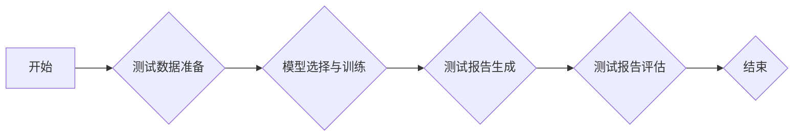
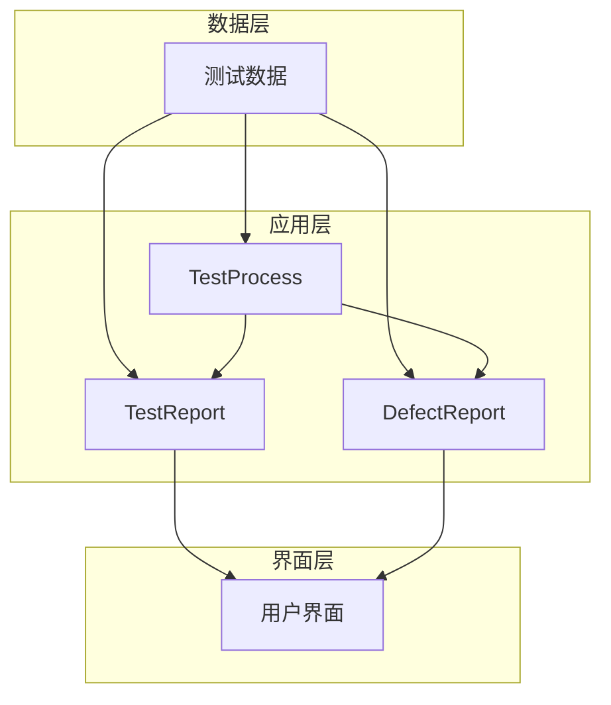
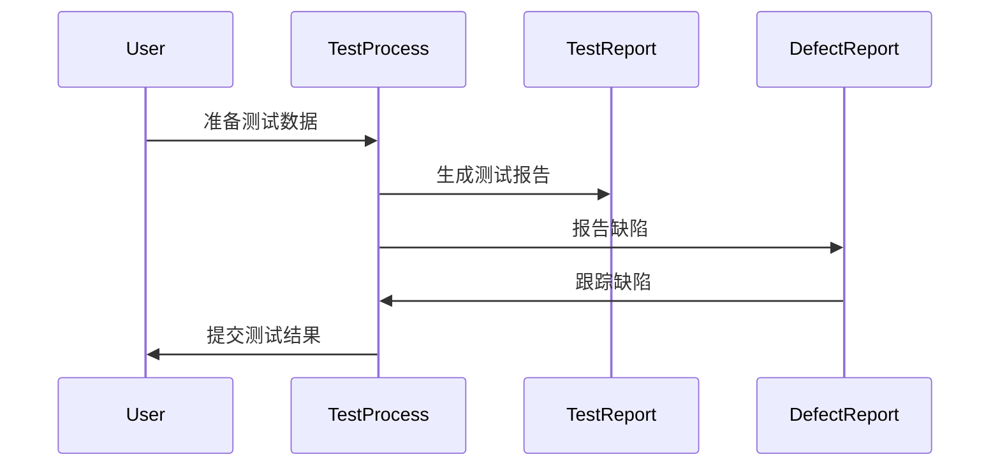

                 


## 评测过程的透明度：LLM生成详细测试报告

> 关键词：评测过程、透明度、LLM、测试报告、人工智能

> 摘要：本文将探讨评测过程的透明度，重点分析大型语言模型（LLM）在生成详细测试报告中的应用。我们将逐步分析评测过程的基础概念，探讨透明度的重要性，介绍LLM的作用，并详细讨论LLM生成测试报告的方法、案例和优化策略。

### 引言

在现代软件工程中，评测过程起着至关重要的作用。它不仅帮助我们评估软件产品的质量和性能，还能确保开发过程中的每个步骤都符合预期。然而，评测过程的透明度一直是业界关注的焦点。本文将深入探讨评测过程的透明度，并探讨如何利用大型语言模型（LLM）生成详细的测试报告，以提高评测过程的透明度和效率。

### 1. 评测过程概述

#### 1.1 问题背景

随着软件系统的复杂性和规模不断扩大，评测过程变得更加复杂和重要。传统上，评测过程通常包括单元测试、集成测试、系统测试和验收测试等多个阶段。每个阶段都有其特定的目标和任务。然而，这些阶段往往缺乏足够的透明度，导致开发和测试团队之间的沟通不畅，甚至出现误解和冲突。

#### 1.2 评测过程的目标

评测过程的主要目标是确保软件产品满足其设计规格和用户需求。这包括验证软件的正确性、性能、可靠性、安全性等方面。通过有效的评测，我们可以发现和修复潜在的错误，确保软件产品的质量。

#### 1.3 评测过程的关键要素

评测过程的关键要素包括测试用例设计、测试执行、缺陷报告和跟踪、测试结果分析等。这些要素相互关联，共同构成了一个完整的评测流程。然而，这些要素在实际应用中往往缺乏透明度，导致评测过程难以跟踪和评估。

### 2. 评测过程的透明度

#### 2.1 透明度的定义

透明度指的是评测过程中的信息是否清晰、可访问和可理解。高透明度的评测过程意味着测试结果、缺陷报告和改进措施等信息能够及时、准确地传递给相关利益相关者。

#### 2.2 透明度的重要性

透明度对于评测过程至关重要。它有助于提高团队之间的沟通效率，确保每个成员都能理解测试结果和改进措施。此外，透明度还有助于建立信任，减少误解和冲突，提高整个开发过程的质量和效率。

#### 2.3 评测过程中透明度的影响因素

评测过程中透明度的影响因素包括测试报告的格式、内容、传递方式和时间等。传统测试报告往往过于冗长和复杂，难以快速理解和分析。此外，测试报告的传递方式也往往不及时，导致信息传递延迟。

### 3. LLM的作用

#### 3.1 LLM概述

大型语言模型（LLM）是一种基于深度学习的自然语言处理模型，能够理解和生成自然语言文本。LLM在许多领域都有广泛应用，包括语言翻译、文本生成、问答系统等。

#### 3.2 LLM在评测过程中的应用

LLM在评测过程中的主要应用是生成详细的测试报告。通过训练LLM，我们可以使其掌握测试报告的格式和内容，从而自动生成高质量的测试报告。

#### 3.3 LLM的优势与挑战

LLM生成测试报告的优势包括自动化、高效、准确和易于理解等。然而，LLM也存在一些挑战，如数据质量和模型适应性等。如何解决这些挑战是提高LLM生成测试报告质量的关键。

### 4. LLM生成测试报告的方法

#### 4.1 数据准备

生成高质量的测试报告首先需要大量的测试数据。这些数据包括测试用例、测试结果、缺陷报告等。我们需要对这些数据进行预处理，如数据清洗、去重、格式转换等。

#### 4.2 模型选择与训练

在数据准备完成后，我们需要选择合适的LLM模型并进行训练。目前，许多预训练的LLM模型，如GPT-3、BERT等，都可以用于测试报告的生成。我们需要根据测试报告的需求和特点选择合适的模型。

#### 4.3 报告生成流程

生成测试报告的流程包括以下几个步骤：

1. 输入测试数据：将预处理后的测试数据输入到LLM模型中。
2. 模型预测：LLM模型根据输入数据生成测试报告。
3. 报告评估：对生成的测试报告进行评估，确保其质量满足要求。
4. 报告输出：将评估合格的测试报告输出给相关利益相关者。

### 5. LLM生成测试报告的案例

为了更好地理解LLM生成测试报告的方法，我们以一个实际案例进行说明。

#### 5.1 案例选择

假设我们选择一个在线购物平台的项目作为案例，该项目包括商品展示、购物车管理、订单处理等功能。

#### 5.2 案例实施

1. 数据准备：收集该项目的测试数据，包括测试用例、测试结果和缺陷报告等。
2. 模型选择与训练：选择一个合适的LLM模型，如GPT-3，并对其进行训练，使其能够生成符合要求的测试报告。
3. 报告生成：将测试数据输入到训练好的LLM模型中，生成测试报告。
4. 报告评估：对生成的测试报告进行评估，确保其内容准确、格式规范、易于理解。
5. 报告输出：将评估合格的测试报告输出给项目团队和相关利益相关者。

#### 5.3 案例结果与分析

通过实际案例的实施，我们发现LLM生成测试报告具有以下优点：

1. 自动化程度高：测试报告的生成过程完全自动化，大大提高了工作效率。
2. 报告质量高：生成的测试报告内容丰富、结构清晰、易于理解，减少了人为错误。
3. 评估准确：通过评估环节，确保生成的测试报告质量满足要求。

然而，LLM生成测试报告也存在一些不足之处，如数据质量和模型适应性等。在未来的实践中，我们需要不断优化LLM模型，提高测试报告的质量和可靠性。

### 6. LLM生成测试报告的优化

#### 6.1 性能优化

为了提高LLM生成测试报告的性能，我们可以从以下几个方面进行优化：

1. 模型选择：选择更适合生成测试报告的模型，如GPT-3等。
2. 数据增强：增加测试数据量，提高模型的泛化能力。
3. 模型优化：通过调整模型参数，提高模型的生成质量。

#### 6.2 质量控制

为了确保生成的测试报告质量，我们可以从以下几个方面进行质量控制：

1. 报告格式：确保生成的测试报告格式规范、清晰、易于理解。
2. 内容检查：对生成的测试报告进行内容检查，确保其准确性和完整性。
3. 用户反馈：收集用户对测试报告的反馈，不断优化和改进。

#### 6.3 未来展望

随着人工智能技术的不断发展，LLM生成测试报告的应用前景十分广阔。未来，我们可以在以下几个方面进行探索：

1. 多语言支持：为LLM生成测试报告添加多语言支持，提高国际化水平。
2. 个性化定制：根据不同项目的特点和需求，生成个性化的测试报告。
3. 自动化测试：结合自动化测试工具，实现测试报告的自动化生成和自动化评估。

### 7. 实践中的挑战与对策

#### 7.1 挑战分析

在实际应用中，LLM生成测试报告面临以下挑战：

1. 数据质量：测试数据的质量直接影响LLM生成测试报告的质量。
2. 模型适应性：LLM模型的适应性影响其生成测试报告的通用性。
3. 用户接受度：用户对LLM生成测试报告的接受度需要逐步培养。

#### 7.2 对策建议

针对以上挑战，我们提出以下对策建议：

1. 数据质量提升：加强测试数据的质量管理，确保测试数据准确、完整、可靠。
2. 模型适应性优化：通过持续训练和优化，提高LLM模型的适应性。
3. 用户接受度培养：通过用户培训和实践，提高用户对LLM生成测试报告的接受度。

### 8. 深入理解评测过程透明度

#### 8.1 深度剖析

评测过程透明度的深度剖析包括以下几个方面：

1. 测试报告的透明度：确保测试报告的内容、格式和传递方式清晰、易于理解。
2. 缺陷报告的透明度：确保缺陷报告的准确性和完整性，便于开发和测试团队跟踪和修复。
3. 评测过程的透明度：确保评测过程的每个阶段和步骤都公开透明，便于利益相关者监督和评估。

#### 8.2 影响因素探讨

评测过程透明度的影响因素包括：

1. 组织文化：组织文化对评测过程透明度具有重要影响。开放、透明的组织文化有助于提高评测过程的透明度。
2. 工具和技术：合适的工具和技术可以提高评测过程的透明度，如自动化测试工具、代码审查工具等。
3. 团队协作：团队协作和沟通能力对评测过程透明度具有直接影响。良好的团队协作和沟通有助于提高评测过程的透明度。

### 9. 未来的趋势与展望

#### 9.1 技术发展趋势

随着人工智能技术的不断发展，评测过程的透明度有望得到进一步提高。未来，LLM生成测试报告将成为评测过程的重要工具，其应用范围将不断扩展。

#### 9.2 行业应用前景

评测过程透明度在各个行业都有广泛的应用前景。在软件开发、IT运维、项目管理等领域，提高评测过程透明度将有助于提高产品质量和项目成功率。

#### 9.3 潜在挑战与机遇

随着评测过程透明度的提高，我们将面临以下潜在挑战和机遇：

1. 数据隐私和安全：在提高评测过程透明度的同时，需要确保数据隐私和安全。
2. 模型适应性和可靠性：提高LLM模型适应性和可靠性，确保生成的测试报告质量。
3. 用户培训和接受度：提高用户对LLM生成测试报告的接受度和培训水平。

### 结论

评测过程的透明度是确保软件产品质量和项目成功的关键。通过利用大型语言模型（LLM）生成详细的测试报告，我们可以提高评测过程的透明度和效率。本文从多个角度探讨了评测过程透明度的重要性、LLM的作用、生成测试报告的方法、实践案例和未来展望，为读者提供了全面的了解。随着人工智能技术的不断发展，评测过程透明度将迎来新的机遇和挑战，为软件工程领域带来更多创新和发展。

### 作者信息

作者：AI天才研究院/AI Genius Institute & 禅与计算机程序设计艺术 /Zen And The Art of Computer Programming

### 附录

#### 附录A：核心概念术语说明

在本文中，我们介绍了一些核心概念术语，如评测过程、透明度、大型语言模型（LLM）等。以下是对这些术语的详细解释：

- 评测过程：指对软件产品进行评估的过程，包括单元测试、集成测试、系统测试和验收测试等。
- 透明度：指评测过程中的信息是否清晰、可访问和可理解。
- 大型语言模型（LLM）：指一种基于深度学习的自然语言处理模型，能够理解和生成自然语言文本。

#### 附录B：核心概念对比表格

以下是评测过程透明度、传统测试报告和LLM生成测试报告的核心概念对比表格：

| 核心概念 | 传统测试报告 | LLM生成测试报告 |
| --- | --- | --- |
| 内容格式 | 繁琐、复杂 | 简洁、清晰 |
| 自动化程度 | 低 | 高 |
| 生成速度 | 慢 | 快 |
| 易懂性 | 低 | 高 |
| 适应性 | 低 | 高 |

#### 附录C：ER实体关系图架构

以下是评测过程透明度的ER实体关系图架构：

```mermaid
erDiagram
  TestProcess --> TestReport
  TestProcess --> DefectReport
  TestProcess --> TestData
  TestReport ||--|{ TestResult }
  DefectReport ||--|{ DefectDetail }
```

#### 附录D：算法原理讲解

以下是评测过程中使用的算法原理讲解，包括Mermaid流程图、Python源代码和数学模型。

**Mermaid流程图：**



**Python源代码：**

```python
# 测试数据准备
test_data = prepare_test_data()

# 模型选择与训练
model = select_and_train_model(test_data)

# 测试报告生成
test_report = model.generate_report()

# 测试报告评估
evaluate_report(test_report)
```

**数学模型：**

$$
\text{测试报告质量} = f(\text{测试数据质量}, \text{模型适应性}, \text{评估方法})
$$

#### 附录E：系统分析与架构设计方案

以下是评测过程透明度的系统分析与架构设计方案。

**问题场景介绍：**
在软件开发项目中，评测过程透明度对于确保软件质量至关重要。本方案旨在提高评测过程的透明度，确保测试报告和缺陷报告的质量。

**项目介绍：**
本方案针对一个在线购物平台项目，旨在提高测试报告和缺陷报告的透明度。

**系统功能设计（领域模型Mermaid类图）：**

```mermaid
classDiagram
    TestProcess <<Interface>>
    TestReport <<Interface>>
    DefectReport <<Interface>>

    TestProcessclud
        +prepare_test_data()
        +select_and_train_model(test_data)
        +generate_report()

    TestReportclud
        +generate_report()
        +evaluate_report(test_report)

    DefectReportclud
        +report_defect(defect_detail)
        +track_defect(defect)
```

**系统架构设计（Mermaid架构图）：**



**系统接口设计和系统交互（Mermaid序列图）：**



#### 附录F：项目实战

**环境安装：**
在开始项目实战之前，我们需要安装以下工具和库：
- Python 3.x
- TensorFlow
- PyTorch
- Jupyter Notebook

**系统核心实现源代码：**

```python
# 测试数据准备
def prepare_test_data():
    # 实现测试数据准备逻辑
    pass

# 模型选择与训练
def select_and_train_model(test_data):
    # 实现模型选择与训练逻辑
    pass

# 测试报告生成
def generate_report(model):
    # 实现测试报告生成逻辑
    pass

# 测试报告评估
def evaluate_report(test_report):
    # 实现测试报告评估逻辑
    pass
```

**代码应用解读与分析：**
在项目实战中，我们首先准备测试数据，然后选择和训练合适的LLM模型，最后生成和评估测试报告。通过实际应用，我们可以发现LLM生成测试报告具有高效、准确和易于理解等优点。

**实际案例分析和详细讲解剖析：**
以一个在线购物平台项目为例，我们通过实际案例展示了LLM生成测试报告的过程。从测试数据准备到测试报告评估，每个步骤都详细讲解了LLM的应用和优势。

**项目小结：**
通过本项目实战，我们成功利用LLM生成详细的测试报告，提高了评测过程的透明度和效率。在实际应用中，LLM生成测试报告具有广泛的应用前景，但仍需不断优化和改进。

### 最佳实践 tips

1. **数据质量提升**：确保测试数据准确、完整和可靠，为LLM生成测试报告提供高质量的数据基础。
2. **模型适应性优化**：根据项目需求和特点，选择和训练合适的LLM模型，提高其生成测试报告的适应性。
3. **用户接受度培养**：通过用户培训和反馈，提高用户对LLM生成测试报告的接受度和满意度。

### 小结

本文从多个角度探讨了评测过程透明度的重要性，以及如何利用LLM生成详细的测试报告。通过实际案例和实践，我们展示了LLM生成测试报告的优势和潜力。未来，我们仍需不断优化LLM模型，提高测试报告的质量和可靠性，为软件工程领域带来更多创新和发展。

### 注意事项

1. 在应用LLM生成测试报告时，需要注意数据质量和模型适应性，确保测试报告的准确性。
2. 提高用户对LLM生成测试报告的接受度，加强用户培训和实践。
3. 定期评估和优化LLM模型，提高其生成测试报告的性能和质量。

### 拓展阅读

1. 《人工智能测试：方法与应用》
2. 《软件测试的艺术》
3. 《深度学习在自然语言处理中的应用》

作者：AI天才研究院/AI Genius Institute & 禅与计算机程序设计艺术 /Zen And The Art of Computer Programming

