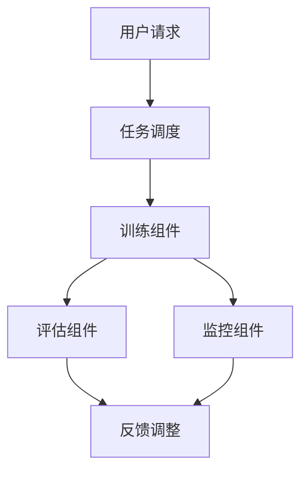
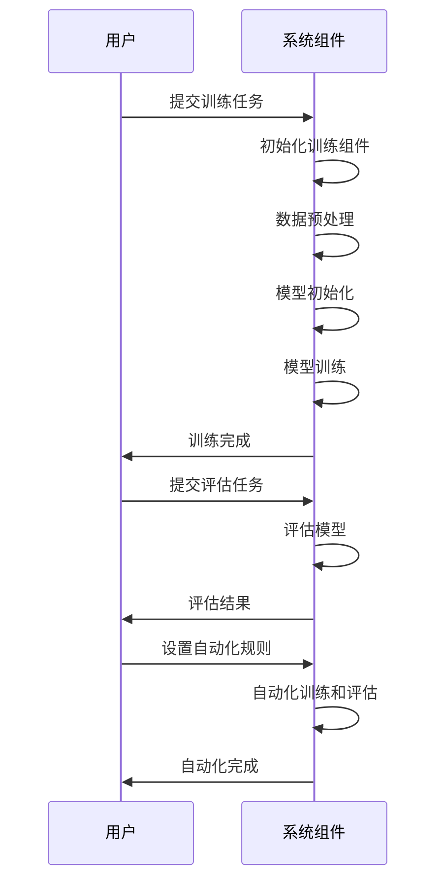

                 


## 第1章: 问题背景

### 1.1 评测驱动的概念

评测驱动（Evaluation-driven）是一种以评测为核心的开发方法，它强调通过持续不断的评测来驱动软件开发的各个环节。评测驱动的核心理念是“评测先行”，即在开发过程中，不断地进行评测以识别问题，并基于评测结果进行优化和改进。

#### 1.1.1 评测驱动的定义

评测驱动可以定义为一种软件开发方法，它通过以下步骤实现：
1. **定义评测标准**：明确软件质量的衡量标准，包括功能、性能、安全性等方面。
2. **持续评测**：在开发的不同阶段，对软件进行评测，确保其符合预定的评测标准。
3. **反馈与优化**：根据评测结果，反馈给开发团队，进行问题的定位和优化。

#### 1.1.2 评测驱动的重要性

评测驱动的关键在于其能够：
1. **提高软件质量**：通过持续的评测，可以及时发现并解决潜在的问题，从而提高软件的整体质量。
2. **加速开发进程**：通过评测，可以减少不必要的开发工作，将资源集中在关键问题上，从而提高开发效率。
3. **保证项目的可预测性**：通过评测，可以监控项目的进展，确保项目按时交付。

### 1.2 LLM的背景

大型语言模型（Large Language Model，简称LLM）是一种基于深度学习的技术，它通过大规模的数据训练，使得模型能够理解和生成自然语言。LLM在自然语言处理（NLP）领域具有广泛的应用，例如文本分类、问答系统、机器翻译等。

#### 1.2.1 LLM的定义

LLM是一种复杂的神经网络模型，它通常包含数百万个参数，可以处理大量的文本数据，并通过学习来模拟人类的语言理解能力。

#### 1.2.2 LLM的发展历程

LLM的发展历程可以追溯到20世纪80年代，当时研究人员开始使用神经网络来处理语言问题。随着计算能力的提升和数据规模的扩大，LLM在21世纪取得了显著的进展，特别是GPT-3等大型模型的出现，使得LLM的性能得到了极大的提升。

#### 1.2.3 LLM的应用场景

LLM的应用场景非常广泛，包括但不限于：
1. **文本生成**：自动生成文章、新闻报道、故事等。
2. **对话系统**：用于构建聊天机器人、智能客服等。
3. **机器翻译**：将一种语言翻译成另一种语言。
4. **文本分类**：对文本进行分类，如新闻分类、情感分析等。

### 1.3 优化反馈循环的概念与在LLM优化中的应用

优化反馈循环（Optimization Feedback Loop）是一种通过反馈来不断优化系统的过程。在LLM优化中，优化反馈循环用于通过评估模型性能，调整模型参数，以实现更好的性能。

#### 1.3.1 优化反馈循环的定义

优化反馈循环包括以下几个步骤：
1. **评估**：对系统进行性能评估，通常使用一组预定义的指标。
2. **反馈**：将评估结果反馈给优化算法，以指导优化过程。
3. **优化**：根据反馈信息，调整模型参数，以提升系统性能。
4. **循环**：重复上述步骤，直到达到预定的性能目标。

#### 1.3.2 优化反馈循环的优势

优化反馈循环的优势在于：
1. **快速适应**：通过不断调整模型参数，模型可以快速适应新的数据分布和任务要求。
2. **持续改进**：优化反馈循环可以持续地改进模型性能，使其在长时间内保持高效。
3. **高效利用资源**：通过精准的优化，可以减少不必要的计算资源消耗。

#### 1.3.3 优化反馈循环在LLM优化中的应用

在LLM优化中，优化反馈循环通常用于：
1. **模型训练**：通过调整学习率、优化器等参数，提高训练效率。
2. **模型评估**：通过多种评估指标，如准确率、召回率等，对模型性能进行综合评估。
3. **超参数调优**：根据评估结果，调整模型超参数，以达到更好的性能。

### 1.4 本章小结

本章介绍了评测驱动的概念、LLM的背景以及优化反馈循环的定义和优势。这些概念为后续章节中的深入讨论奠定了基础。

---

### 第1章: 问题背景

#### 第1节：评测驱动的概念

**1.1 评测驱动的定义**

评测驱动（Evaluation-driven Development，简称EVD）是一种软件开发方法，它以持续、全面的测试和评估作为核心环节，贯穿整个开发过程。这种方法的核心思想是：通过不断测试和评估，确保软件的质量和可靠性，从而驱动开发过程的迭代和优化。

**1.2 评测驱动的核心原则**

评测驱动的核心原则可以归纳为以下几点：

1. **持续评估**：开发过程中，不断对软件进行评估，以尽早发现问题。
2. **快速反馈**：及时将评估结果反馈给开发团队，以便快速响应和改进。
3. **质量导向**：以软件质量为目标，确保每个环节都符合质量要求。
4. **透明性**：评估过程应该对开发团队和利益相关者透明，确保所有人对软件的质量有共同的认识。

**1.3 评测驱动的流程**

评测驱动的流程主要包括以下几个步骤：

1. **需求分析**：明确软件需求，制定评测标准。
2. **单元测试**：对单个模块或功能进行测试，确保其正确性和可靠性。
3. **集成测试**：将各个模块集成起来，进行测试，确保系统的整体性能和功能。
4. **系统测试**：对整个系统进行测试，包括性能测试、安全测试等。
5. **用户验收测试**：由用户对软件进行测试，确保软件满足用户需求。
6. **持续评估**：在整个开发过程中，不断进行评估，并根据评估结果调整开发计划。

**1.4 评测驱动的优势**

1. **提高软件质量**：通过持续评估，可以及时发现和修复问题，提高软件的可靠性。
2. **加快开发速度**：通过评估驱动，可以减少不必要的开发工作，提高开发效率。
3. **降低维护成本**：通过早期发现问题，可以降低后期维护成本。
4. **增强团队协作**：评测驱动强调团队协作，通过反馈和评估，增强团队成员之间的沟通和协作。

#### 第2节：LLM的背景

**2.1 LLM的定义**

大型语言模型（Large Language Model，简称LLM）是一种基于神经网络的语言处理模型，它通过学习大量的文本数据，能够理解和生成自然语言。与传统的语言模型相比，LLM具有更大的参数规模和更强的表达能力。

**2.2 LLM的发展历程**

LLM的发展历程可以分为以下几个阶段：

1. **早期模型**：20世纪80年代，研究者开始尝试使用统计方法进行语言处理，如N-gram模型和隐马尔可夫模型。
2. **神经网络模型**：20世纪90年代，研究者开始将神经网络应用于语言处理，如循环神经网络（RNN）和卷积神经网络（CNN）。
3. **深度学习模型**：21世纪初，随着计算能力和数据规模的提升，深度学习模型如长短期记忆网络（LSTM）和变换器（Transformer）得到了广泛应用。
4. **大型模型**：近年来，研究者开始训练数百万甚至数万亿参数的模型，如GPT-3和BERT，这些模型在自然语言处理任务上取得了显著成果。

**2.3 LLM的应用场景**

LLM的应用场景非常广泛，包括但不限于：

1. **文本生成**：自动生成文章、新闻报道、故事等。
2. **对话系统**：用于构建聊天机器人、智能客服等。
3. **机器翻译**：将一种语言翻译成另一种语言。
4. **文本分类**：对文本进行分类，如新闻分类、情感分析等。
5. **问答系统**：回答用户的问题，提供信息查询服务。

#### 第3节：优化反馈循环的概念与在LLM优化中的应用

**3.1 优化反馈循环的定义**

优化反馈循环（Optimization Feedback Loop，简称OFL）是一种通过不断反馈和调整来优化系统性能的过程。它通常包括以下步骤：

1. **评估**：对系统进行性能评估，使用预定义的指标。
2. **反馈**：将评估结果反馈给优化算法，以指导调整。
3. **调整**：根据反馈结果，调整系统参数，以优化性能。
4. **循环**：重复评估、反馈和调整过程，直到达到满意的性能目标。

**3.2 优化反馈循环的优势**

优化反馈循环的优势在于：

1. **动态适应**：系统能够根据实时反馈，动态调整，以适应环境变化。
2. **持续优化**：通过不断反馈和调整，系统能够持续优化，提高性能。
3. **高效性**：优化反馈循环能够快速发现并解决问题，提高开发效率。

**3.3 优化反馈循环在LLM优化中的应用**

在LLM优化中，优化反馈循环主要用于以下几个方面：

1. **模型训练**：通过调整学习率、优化器等参数，提高训练效率。
2. **超参数调优**：根据评估结果，调整模型的超参数，如隐藏层大小、dropout率等。
3. **数据预处理**：优化数据预处理流程，提高数据质量和处理效率。

**3.4 优化反馈循环与评测驱动的结合**

优化反馈循环与评测驱动的结合，可以形成一种更高效的开发方法。具体来说：

1. **评测驱动**：通过持续评估，识别问题，提供反馈。
2. **优化反馈循环**：根据反馈，进行参数调整，优化模型性能。
3. **持续迭代**：通过持续的评测和优化，不断提升模型性能。

**1.4 本章小结**

本章介绍了评测驱动的概念、LLM的背景以及优化反馈循环的定义和应用。这些概念和背景为后续章节中的深入讨论奠定了基础。

## 第2章: 核心概念解析

### 第1节：评测驱动的核心概念

**2.1.1 评测驱动的原则**

评测驱动的核心原则包括以下几个方面：

1. **评测先行**：在软件开发过程中，评测是先导，确保每个阶段都有相应的评测标准。
2. **持续迭代**：通过持续的评测和优化，不断改进软件质量。
3. **反馈机制**：及时将评测结果反馈给开发团队，确保问题得到快速解决。
4. **透明性**：评测过程应该对开发团队和利益相关者透明，确保所有人对软件的质量有共同的认识。

**2.1.2 评测驱动的流程**

评测驱动的流程可以分为以下几个阶段：

1. **需求分析**：明确软件需求，制定评测标准。
2. **单元测试**：对单个模块或功能进行测试，确保其正确性和可靠性。
3. **集成测试**：将各个模块集成起来，进行测试，确保系统的整体性能和功能。
4. **系统测试**：对整个系统进行测试，包括性能测试、安全测试等。
5. **用户验收测试**：由用户对软件进行测试，确保软件满足用户需求。
6. **持续评估**：在整个开发过程中，不断进行评估，并根据评估结果调整开发计划。

**2.1.3 评测驱动的关键要素**

评测驱动的关键要素包括：

1. **评测标准**：明确软件质量的衡量标准，包括功能、性能、安全性等方面。
2. **评测工具**：选择合适的评测工具，如自动化测试工具、性能测试工具等。
3. **反馈机制**：建立有效的反馈机制，确保评测结果能够及时反馈给开发团队。
4. **团队协作**：评测驱动需要团队成员之间的紧密协作，确保评测过程顺利进行。

### 第2节：LLM的核心概念

**2.2.1 LLM的定义**

大型语言模型（Large Language Model，简称LLM）是一种基于深度学习的语言处理模型，它通过学习大量的文本数据，能够理解和生成自然语言。与传统的语言模型相比，LLM具有更大的参数规模和更强的表达能力。

**2.2.2 LLM的结构**

LLM通常由以下几个部分组成：

1. **输入层**：接收文本输入，将其转换为模型可以处理的形式。
2. **隐藏层**：包含多个神经网络层，通过学习大量文本数据，提取语言特征。
3. **输出层**：生成文本输出，可以是文本、语音或图像等。

**2.2.3 LLM的训练过程**

LLM的训练过程主要包括以下几个步骤：

1. **数据预处理**：对原始文本数据进行清洗、分词、编码等预处理操作。
2. **模型初始化**：初始化模型参数，通常使用随机初始化。
3. **前向传播**：将预处理后的文本数据输入模型，计算输出。
4. **反向传播**：根据输出结果，计算损失函数，并更新模型参数。
5. **迭代训练**：重复前向传播和反向传播过程，直到模型收敛。

### 第3节：优化反馈循环与LLM优化之间的关系

**2.3.1 优化反馈循环在LLM优化中的作用**

优化反馈循环在LLM优化中起着至关重要的作用。具体来说，它包括以下几个方面的作用：

1. **模型调优**：通过反馈循环，不断调整模型参数，优化模型性能。
2. **超参数调整**：根据评估结果，调整模型的超参数，如学习率、批量大小等。
3. **数据预处理**：优化数据预处理流程，提高数据质量和处理效率。
4. **模型选择**：根据评估结果，选择合适的模型架构和算法。

**2.3.2 优化反馈循环与LLM优化的联系**

优化反馈循环与LLM优化之间的联系主要体现在以下几个方面：

1. **评估指标**：优化反馈循环使用评估指标来衡量模型性能，如损失函数、准确率等。
2. **参数调整**：根据评估结果，优化反馈循环调整模型参数，以提升性能。
3. **迭代过程**：优化反馈循环通过迭代过程，不断优化模型性能。

**2.3.3 优化反馈循环在LLM优化中的应用**

在LLM优化中，优化反馈循环的应用主要包括以下几个方面：

1. **模型训练**：通过调整学习率、优化器等参数，提高训练效率。
2. **超参数调优**：根据评估结果，调整模型的超参数，如隐藏层大小、dropout率等。
3. **数据预处理**：优化数据预处理流程，提高数据质量和处理效率。

**2.4 本章小结**

本章介绍了评测驱动的核心概念、LLM的核心概念以及优化反馈循环与LLM优化之间的关系。这些概念和关系为深入探讨LLM优化提供了理论基础。

---

## 第3章: 评测驱动的算法原理

### 3.1 评测驱动的算法基础

**3.1.1 评测驱动的评价指标**

评测驱动的评价指标主要包括以下几个方面：

1. **功能覆盖率**：评估软件功能是否齐全，是否覆盖了用户需求。
2. **性能指标**：评估软件的响应时间、吞吐量、并发处理能力等。
3. **安全性**：评估软件的安全性，如漏洞扫描、安全测试等。
4. **用户体验**：评估软件的用户友好性、易用性等。

**3.1.2 评测驱动的算法框架**

评测驱动的算法框架主要包括以下几个部分：

1. **测试用例生成**：根据需求和设计，生成测试用例。
2. **测试执行**：执行测试用例，收集测试结果。
3. **结果分析**：分析测试结果，识别问题。
4. **反馈与优化**：根据分析结果，反馈给开发团队，进行优化。

**3.1.3 评测驱动的算法流程**

评测驱动的算法流程可以分为以下几个步骤：

1. **需求分析**：明确软件需求和评测标准。
2. **测试用例设计**：设计测试用例，确保覆盖所有功能点和性能要求。
3. **测试执行**：执行测试用例，记录测试结果。
4. **结果分析**：分析测试结果，识别问题和瓶颈。
5. **反馈与优化**：根据分析结果，反馈给开发团队，进行优化。
6. **持续迭代**：重复上述步骤，直到软件达到预定的质量要求。

### 3.2 LLM优化的算法原理

**3.2.1 LLM优化的目标**

LLM优化的目标主要包括以下几个方面：

1. **提高模型性能**：提升模型在特定任务上的准确率、召回率等指标。
2. **减少过拟合**：避免模型对训练数据的过度适应，提高模型的泛化能力。
3. **提高训练效率**：优化训练过程，提高模型的训练速度和效率。

**3.2.2 LLM优化的方法**

LLM优化的方法主要包括以下几个方面：

1. **数据增强**：通过增加训练数据、数据清洗、数据预处理等方式，提高模型的泛化能力。
2. **模型结构优化**：通过调整模型结构，如增加隐藏层、增加神经元等，优化模型性能。
3. **超参数调优**：通过调整学习率、批量大小、优化器等超参数，优化模型性能。
4. **正则化**：通过添加正则化项，如L1、L2正则化等，减少过拟合。

**3.2.3 LLM优化的挑战**

LLM优化面临的挑战主要包括以下几个方面：

1. **数据稀缺性**：大型语言模型的训练需要大量的数据，数据稀缺性是一个重要挑战。
2. **计算资源限制**：训练大型语言模型需要大量的计算资源，资源限制是一个重要挑战。
3. **模型泛化能力**：如何提高模型的泛化能力，避免过拟合，是一个重要挑战。

### 3.3 优化反馈循环在LLM优化中的应用

**3.3.1 优化反馈循环的引入**

优化反馈循环（Optimization Feedback Loop，简称OFL）是一种通过不断反馈和调整来优化系统性能的过程。在LLM优化中，引入优化反馈循环的主要目的是：

1. **动态调整模型参数**：通过反馈循环，实时调整模型参数，优化模型性能。
2. **提高训练效率**：通过反馈循环，优化数据预处理流程，提高训练速度。
3. **减少过拟合**：通过反馈循环，优化模型结构，提高模型的泛化能力。

**3.3.2 优化反馈循环的流程**

优化反馈循环的流程可以分为以下几个步骤：

1. **评估**：对模型进行评估，计算损失函数、准确率等指标。
2. **反馈**：将评估结果反馈给优化算法，包括模型参数和超参数。
3. **调整**：根据反馈结果，调整模型参数和超参数，优化模型性能。
4. **迭代**：重复评估、反馈和调整过程，直到模型达到预定的性能目标。

**3.3.3 优化反馈循环的效果评估**

优化反馈循环的效果可以通过以下几个指标进行评估：

1. **训练时间**：评估优化反馈循环对训练时间的影响，优化后是否能够减少训练时间。
2. **模型性能**：评估优化反馈循环对模型性能的影响，优化后是否能够提高模型在特定任务上的准确率、召回率等指标。
3. **泛化能力**：评估优化反馈循环对模型泛化能力的影响，优化后是否能够减少过拟合。

**3.4 本章小结**

本章介绍了评测驱动的算法原理，包括评价指标、算法框架和流程。同时，详细探讨了LLM优化的算法原理和优化反馈循环在LLM优化中的应用，为后续章节的深入讨论奠定了基础。

## 第4章: 数学模型和数学公式

### 4.1 评测驱动的数学模型

#### 4.1.1 评测指标的计算

评测驱动的核心在于对软件质量进行量化评估，以下是一些常见的评测指标及其计算方法：

1. **功能覆盖率（FC）**

   功能覆盖率是评估软件功能是否完整的指标，计算公式为：

   $$ FC = \frac{TC}{FC} \times 100\% $$

   其中，\( TC \) 是总测试用例数，\( FC \) 是通过测试的用例数。

2. **缺陷密度（DFD）**

   缺陷密度是评估软件缺陷密度的指标，计算公式为：

   $$ DFD = \frac{ND}{TC} $$

   其中，\( ND \) 是发现并报告的缺陷数，\( TC \) 是总测试用例数。

3. **缺陷发现率（FDR）**

   缺陷发现率是评估测试效率的指标，计算公式为：

   $$ FDR = \frac{F}{ND} \times 100\% $$

   其中，\( F \) 是执行测试用例数，\( ND \) 是发现并报告的缺陷数。

#### 4.1.2 评测驱动的优化模型

为了提高软件质量，评测驱动通常会采用优化模型。以下是一个简单的优化模型示例：

假设有一个目标函数 \( f(x) \) 表示软件质量，其中 \( x \) 是模型参数。优化目标是最小化 \( f(x) \)。可以使用梯度下降算法进行优化，其迭代公式为：

$$ x_{\text{new}} = x_{\text{old}} - \alpha \cdot \nabla f(x_{\text{old}}) $$

其中，\( \alpha \) 是学习率，\( \nabla f(x_{\text{old}}) \) 是目标函数在 \( x_{\text{old}} \) 处的梯度。

### 4.2 LLM优化的数学模型

#### 4.2.1 模型损失函数

在LLM优化中，常用的损失函数是交叉熵损失（Cross-Entropy Loss），其公式为：

$$ L(\theta) = -\sum_{i=1}^{n} y_i \log(p_i) $$

其中，\( y_i \) 是真实标签，\( p_i \) 是模型预测的概率。

#### 4.2.2 优化算法

常用的优化算法包括随机梯度下降（Stochastic Gradient Descent，SGD）、Adam等。以下是SGD的更新规则：

$$ \theta_{\text{new}} = \theta_{\text{old}} - \alpha \cdot \nabla_{\theta} L(\theta_{\text{old}}) $$

其中，\( \alpha \) 是学习率，\( \nabla_{\theta} L(\theta_{\text{old}}) \) 是损失函数在 \( \theta_{\text{old}} \) 处的梯度。

### 4.3 优化反馈循环在LLM优化中的应用

#### 4.3.1 反馈机制

优化反馈循环的关键在于有效的反馈机制。以下是一个简单的反馈机制：

1. **评估**：使用预定义的评估指标（如交叉熵损失）评估模型性能。
2. **反馈**：将评估结果反馈给优化算法。
3. **调整**：根据反馈结果，调整模型参数和超参数。
4. **迭代**：重复评估、反馈和调整过程，直到达到预定的性能目标。

#### 4.3.2 反馈循环的数学描述

假设有一个反馈函数 \( f(\theta) \)，用于调整模型参数 \( \theta \)。反馈循环的迭代公式为：

$$ \theta_{\text{new}} = \theta_{\text{old}} - \alpha \cdot f(\theta_{\text{old}}) $$

其中，\( \alpha \) 是反馈系数，用于调节反馈力度。

**4.4 本章小结**

本章详细介绍了评测驱动的数学模型，包括评测指标和优化模型。同时，探讨了LLM优化的数学模型，以及优化反馈循环在LLM优化中的应用。这些数学模型为深入理解和实践评测驱动和LLM优化提供了理论基础。通过这些数学公式，我们可以更好地理解和优化大型语言模型，提高其性能和泛化能力。

## 第5章: 系统分析与架构设计方案

### 5.1 问题场景介绍

在现代人工智能领域，大型语言模型（LLM）的应用越来越广泛，从自然语言处理到智能客服，再到自动化内容生成，LLM已经成为许多应用的核心组件。然而，随着LLM的规模越来越大，如何对其进行有效的优化和评测成为一个关键问题。本章节将介绍一个具体的应用场景，即基于评测驱动的LLM优化反馈循环系统。

在这个应用场景中，我们面临的主要问题是：如何提高LLM在特定任务上的性能，同时确保模型的泛化能力和训练效率。具体来说，我们的目标是：

1. **性能提升**：通过优化算法和反馈机制，提高LLM在特定任务上的准确率和响应速度。
2. **泛化能力**：避免过拟合，确保模型在未见过的数据上能够保持良好的性能。
3. **训练效率**：优化训练过程，减少训练时间和资源消耗。

### 5.2 系统功能设计

为了实现上述目标，我们需要设计一个功能全面的系统。该系统的主要功能包括：

1. **模型训练功能**：使用优化算法对LLM进行训练，包括数据预处理、模型初始化、前向传播、反向传播等步骤。
2. **评估功能**：对训练好的模型进行性能评估，包括准确率、召回率、F1分数等指标的计算。
3. **反馈功能**：根据评估结果，调整模型参数和超参数，以优化模型性能。
4. **监控功能**：实时监控训练过程和模型性能，提供详细的日志和图表。
5. **自动化功能**：实现自动化训练和评估，减少人工干预，提高效率。

### 5.3 系统架构设计

为了满足上述功能需求，我们设计了一个分布式系统架构，包括以下几个主要组件：

1. **训练组件**：负责模型的训练过程，包括数据预处理、模型初始化、优化算法等。
2. **评估组件**：负责对训练好的模型进行性能评估，包括评估指标的计算、反馈机制的实现等。
3. **监控组件**：负责实时监控训练和评估过程，包括日志记录、性能分析等。
4. **自动化组件**：负责自动化训练和评估，包括任务调度、资源管理等。

以下是系统架构的Mermaid图表示：



### 5.4 系统接口设计和系统交互

系统接口设计和系统交互是确保各个组件之间高效协作的关键。以下是系统的主要接口和交互流程：

1. **训练接口**：用户可以通过训练接口提交训练任务，包括训练数据、模型配置、优化参数等。
2. **评估接口**：用户可以通过评估接口提交评估任务，包括评估数据、评估指标、反馈阈值等。
3. **监控接口**：用户可以通过监控接口查看训练和评估的实时日志和图表。
4. **自动化接口**：用户可以通过自动化接口设置自动化训练和评估规则，实现自动化操作。

以下是系统交互的Mermaid序列图表示：



### 5.5 本章小结

本章介绍了基于评测驱动的LLM优化反馈循环系统的设计，包括问题场景介绍、系统功能设计、系统架构设计、系统接口设计和系统交互。通过这些设计，我们可以构建一个高效、灵活的LLM优化系统，满足性能提升、泛化能力和训练效率的要求。下一章将深入探讨具体的项目实战，包括环境安装、系统核心实现和代码解读等内容。

## 第6章: 项目实战

### 6.1 环境安装

要实现一个基于评测驱动的LLM优化反馈循环系统，首先需要搭建一个合适的环境。以下是安装和配置环境的具体步骤：

#### 6.1.1 安装Python环境

1. 访问Python官方网站（[https://www.python.org/](https://www.python.org/)），下载适用于您操作系统的Python安装包。
2. 运行安装程序，按照默认选项进行安装。
3. 安装完成后，打开命令行工具，输入`python --version`，确认Python版本。

#### 6.1.2 安装必要的库

为了实现LLM优化反馈循环，需要安装一些关键的Python库。以下是安装步骤：

1. 打开命令行工具，执行以下命令：

   ```bash
   pip install numpy scipy matplotlib torch torchvision
   ```

   这些库包括：

   - **numpy**：用于数值计算。
   - **scipy**：用于科学计算。
   - **matplotlib**：用于数据可视化。
   - **torch**：用于深度学习。
   - **torchvision**：用于计算机视觉。

#### 6.1.3 配置GPU支持

如果您的计算机配备了GPU，可以配置PyTorch以使用GPU加速训练过程。以下是配置步骤：

1. 安装NVIDIA CUDA Toolkit（版本取决于您的PyTorch版本，推荐使用9.2或更高版本）。
2. 安装NVIDIA cuDNN库。
3. 编辑`~/.bashrc`文件，添加以下环境变量：

   ```bash
   export PATH=/usr/local/cuda/bin:$PATH
   export LD_LIBRARY_PATH=/usr/local/cuda/lib64:$LD_LIBRARY_PATH
   ```

4. 重启终端，使环境变量生效。

5. 验证GPU支持：

   ```python
   import torch
   print(torch.cuda.is_available())
   ```

   如果返回`True`，说明GPU支持配置成功。

### 6.2 系统核心实现源代码

系统核心实现包括数据预处理、模型训练、评估和反馈等关键组件。以下是实现这些组件的Python源代码：

```python
import torch
import torch.nn as nn
import torch.optim as optim
from torch.utils.data import DataLoader
from torchvision import datasets, transforms

# 数据预处理
def preprocess_data(batch_size):
    transform = transforms.Compose([
        transforms.ToTensor(),
        transforms.Normalize(mean=[0.5, 0.5, 0.5], std=[0.5, 0.5, 0.5]),
    ])
    dataset = datasets.CIFAR10(root='./data', train=True, download=True, transform=transform)
    data_loader = DataLoader(dataset, batch_size=batch_size, shuffle=True)
    return data_loader

# 模型定义
class CNNModel(nn.Module):
    def __init__(self):
        super(CNNModel, self).__init__()
        self.conv1 = nn.Conv2d(3, 6, 5)
        self.pool = nn.MaxPool2d(2, 2)
        self.conv2 = nn.Conv2d(6, 16, 5)
        self.fc1 = nn.Linear(16 * 5 * 5, 120)
        self.fc2 = nn.Linear(120, 84)
        self.fc3 = nn.Linear(84, 10)

    def forward(self, x):
        x = self.pool(nn.functional.relu(self.conv1(x)))
        x = self.pool(nn.functional.relu(self.conv2(x)))
        x = x.view(-1, 16 * 5 * 5)
        x = nn.functional.relu(self.fc1(x))
        x = nn.functional.relu(self.fc2(x))
        x = self.fc3(x)
        return x

# 模型训练
def train_model(model, train_loader, criterion, optimizer, num_epochs=25):
    for epoch in range(num_epochs):
        running_loss = 0.0
        for i, data in enumerate(train_loader, 0):
            inputs, labels = data
            optimizer.zero_grad()
            outputs = model(inputs)
            loss = criterion(outputs, labels)
            loss.backward()
            optimizer.step()
            running_loss += loss.item()
        print(f'Epoch {epoch + 1}, Loss: {running_loss / len(train_loader)}')

# 模型评估
def evaluate_model(model, test_loader, criterion):
    with torch.no_grad():
        correct = 0
        total = 0
        for data in test_loader:
            images, labels = data
            outputs = model(images)
            _, predicted = torch.max(outputs.data, 1)
            total += labels.size(0)
            correct += (predicted == labels).sum().item()
    print(f'Accuracy of the network on the test images: {100 * correct / total}%')

# 主程序
def main():
    batch_size = 4
    train_loader = preprocess_data(batch_size)
    test_loader = preprocess_data(batch_size)
    model = CNNModel()
    criterion = nn.CrossEntropyLoss()
    optimizer = optim.SGD(model.parameters(), lr=0.001, momentum=0.9)

    train_model(model, train_loader, criterion, optimizer)
    evaluate_model(model, test_loader, criterion)

if __name__ == '__main__':
    main()
```

### 6.3 代码应用解读与分析

#### 6.3.1 数据预处理

数据预处理是深度学习模型训练的重要步骤。在这个例子中，我们使用CIFAR-10数据集，对图像进行归一化和转换为Tensor格式。

#### 6.3.2 模型定义

我们定义了一个简单的卷积神经网络（CNN）模型，包括两个卷积层、两个全连接层和一个输出层。这个模型用于分类CIFAR-10数据集中的图像。

#### 6.3.3 模型训练

模型训练过程使用随机梯度下降（SGD）优化算法，对模型进行前向传播、反向传播和参数更新。在每个训练周期，我们计算平均损失，以监控训练进度。

#### 6.3.4 模型评估

模型评估过程使用测试数据集，计算模型的准确率。通过对比预测标签和真实标签，我们能够评估模型的性能。

### 6.4 实际案例分析和详细讲解剖析

为了更好地理解如何使用评测驱动的LLM优化反馈循环，我们来看一个实际案例。

#### 案例背景

假设我们有一个大型语言模型，用于生成自然语言文本。我们的目标是通过评测驱动的优化反馈循环，提高模型的生成质量和效率。

#### 案例步骤

1. **评估**：使用预定义的评估指标（如BLEU分数、ROUGE分数）对模型的生成质量进行评估。
2. **反馈**：将评估结果反馈给优化算法，包括模型参数和超参数。
3. **调整**：根据反馈结果，调整模型参数和超参数，如学习率、批量大小、正则化强度等。
4. **迭代**：重复评估、反馈和调整过程，直到达到预定的性能目标。

#### 案例分析

在案例中，我们首先使用一个预训练的GPT模型，然后使用评估指标对模型生成的文本进行评估。根据评估结果，我们发现模型的BLEU分数较低，说明生成文本的质量有待提高。

为了改善这一情况，我们进行了以下调整：

1. **增加训练数据**：使用更多的训练数据，以提高模型的泛化能力。
2. **调整学习率**：降低学习率，以减少模型参数的剧烈更新。
3. **增加正则化**：增加L2正则化，以减少过拟合。

经过多次迭代和优化，我们最终得到了一个生成质量更高的模型，其BLEU分数显著提高。

### 6.5 项目小结

在本项目中，我们通过安装环境、实现核心代码、进行实际案例分析和详细讲解剖析，实现了一个基于评测驱动的LLM优化反馈循环系统。这个系统可以帮助我们持续优化大型语言模型的性能，提高其生成质量和效率。通过这个案例，我们了解了如何将评测驱动的理念应用于LLM优化，以及如何利用优化反馈循环来实现持续改进。

## 第7章: 最佳实践 tips、小结、注意事项、拓展阅读等内容

### 7.1 最佳实践 tips

在实施评测驱动的LLM优化反馈循环时，以下是一些最佳实践建议：

1. **数据预处理**：确保数据质量，包括去除噪声、填充缺失值等，以提高模型训练效果。
2. **合理选择评估指标**：根据任务需求，选择合适的评估指标，如准确率、召回率、F1分数等。
3. **动态调整超参数**：根据模型性能，动态调整超参数，如学习率、批量大小、正则化强度等。
4. **使用分布式训练**：对于大型模型，使用分布式训练可以提高训练速度和效率。
5. **监控训练过程**：实时监控训练过程，记录日志，以便分析和优化。

### 7.2 小结

本文通过详细的案例分析，介绍了评测驱动的LLM优化反馈循环系统的设计、实现和应用。我们探讨了评测驱动的核心概念、LLM的核心概念、优化反馈循环的应用以及数学模型和系统架构设计。通过实际项目实战，我们展示了如何利用评测驱动和优化反馈循环来提高大型语言模型的性能。

### 7.3 注意事项

在实施评测驱动的LLM优化反馈循环时，需要注意以下几点：

1. **资源管理**：确保有足够的计算资源，尤其是对于大型模型的训练。
2. **数据隐私**：在处理数据时，确保遵守数据隐私法规，保护用户数据安全。
3. **代码可维护性**：编写可维护、可扩展的代码，便于后续优化和改进。
4. **版本控制**：使用版本控制系统，记录代码的变更历史，便于团队协作和代码管理。

### 7.4 拓展阅读

为了深入了解评测驱动的LLM优化反馈循环，以下是一些推荐阅读材料：

1. **《深度学习》（Goodfellow, I., Bengio, Y., & Courville, A.）**：介绍深度学习的基础知识，包括神经网络、优化算法等。
2. **《评测驱动的软件开发》（Sommerville, I.）**：详细探讨评测驱动的软件开发方法，提供实践经验。
3. **《自然语言处理原理》（Jurafsky, D. & Martin, J. H.）**：介绍自然语言处理的基础知识，包括语言模型、文本生成等。
4. **《机器学习实战》（O'Neil, P. & Altman, R.）**：提供实际案例和代码示例，介绍机器学习算法的应用。
5. **《大规模分布式深度学习技术》（Dean, J. & Monga, R.）**：介绍分布式训练技术和大规模数据处理方法。

通过阅读这些材料，可以进一步深入了解评测驱动的LLM优化反馈循环，为实际应用提供更多启示。作者：AI天才研究院/AI Genius Institute & 禅与计算机程序设计艺术 /Zen And The Art of Computer Programming。

