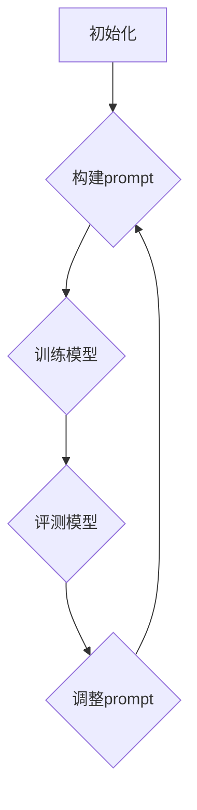
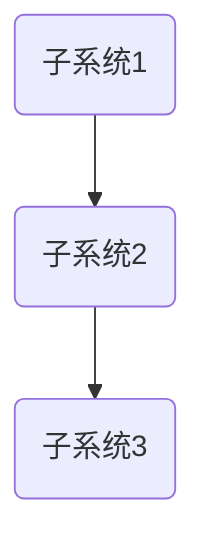
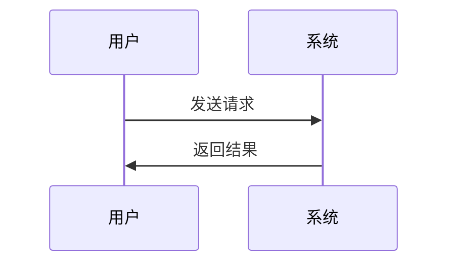
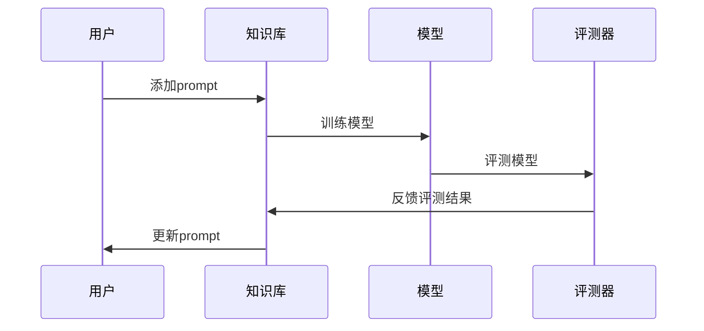

                 


### 评测驱动的prompt知识库构建

## 文章标题：评测驱动的prompt知识库构建

关键词：评测驱动、prompt、知识库、人工智能

摘要：本文将深入探讨评测驱动在prompt知识库构建中的应用，解析其核心概念、原理和实践方法，旨在为人工智能领域的开发者提供有价值的指导和参考。

## 背景介绍

### 问题背景

随着人工智能技术的飞速发展，prompt工程学逐渐成为构建人工智能模型的关键环节。prompt（提示）作为引导模型学习的重要信息，其质量直接影响模型的性能和效果。因此，如何构建高质量、高效的prompt知识库成为了当前研究的热点。

评测驱动（Evaluation-driven）作为一种以评估为导向的方法，旨在通过不断评估、优化和调整，提高模型的性能和准确性。在prompt知识库构建中，评测驱动方法尤为重要，它不仅能够提升模型的学习效果，还能确保知识库的准确性和实用性。

### 问题提出

在人工智能模型训练过程中，如何利用评测驱动的策略，高效构建高质量的知识库，以支持模型在多个领域的应用？具体而言，我们需要解决以下问题：

1. 如何设计评测指标，以全面评估prompt知识库的质量？
2. 如何通过评测反馈，调整和优化prompt知识库，提高模型性能？
3. 如何在实际应用中，将评测驱动的策略有效应用于prompt知识库构建，实现知识库的持续优化和迭代？

### 解决方案

本文旨在通过以下内容，系统性地探讨评测驱动在prompt知识库构建中的应用：

1. 评测驱动的原理与流程
2. prompt知识库构建的方法与工具
3. 评测指标的设计与优化
4. 实际案例分析与效果评估

通过本文的讨论，我们希望能够为人工智能领域的开发者提供有价值的指导和参考，助力他们在prompt知识库构建方面取得更好的成果。

### 边界与外延

本文主要探讨评测驱动在prompt知识库构建中的应用，涉及以下领域：

1. 自然语言处理：例如文本生成、机器翻译、情感分析等
2. 计算机视觉：例如图像分类、目标检测、图像生成等
3. 推荐系统：例如基于内容的推荐、协同过滤推荐等

本文的核心要素包括：

1. 评测驱动的原理与流程
2. prompt知识库构建的方法与工具
3. 评测指标的设计与优化
4. 实际案例分析与效果评估

## 核心概念与联系

### 核心概念

#### 评测驱动

评测驱动（Evaluation-driven）是一种以评估为导向的方法，通过不断地评估、优化和调整，以提高系统的性能和效果。在人工智能领域，评测驱动广泛应用于模型训练、优化和评估过程中，旨在找到最优的模型配置和参数设置。

#### prompt

prompt（提示）是指用于引导模型学习的信息或指令。在自然语言处理、计算机视觉等领域，prompt作为关键输入，对模型的学习效果和生成质量有着重要影响。

#### 知识库

知识库（Knowledge Base）是指存储和管理知识的系统。在人工智能领域，知识库用于存储大量结构化或半结构化的知识信息，供模型学习和推理使用。

### 概念属性特征对比表格

| 特征            | 评测驱动                      | prompt                     | 知识库                      |
|-----------------|-------------------------------|----------------------------|----------------------------|
| 定义            | 以评估为导向的优化方法       | 引导模型学习的信息或指令   | 存储和管理知识的系统         |
| 目的            | 提高模型性能                 | 引导模型学习               | 保证知识的准确性和实用性   |
| 应用场景         | 人工智能模型训练和优化       | 自然语言处理、计算机视觉等 | 多领域知识管理             |
| 关联关系         | 评测驱动依赖知识库作为评估基准 | prompt是知识库的一部分     | 评测驱动用于知识库优化     |

### ER实体关系图架构

```mermaid
erDiagram
  AI模型 ||--|{ 评测系统 }||>
  评测系统 ||--|{ 知识库 }||>
  知识库 ||--|{ prompt }||>
  prompt ||--|{ 数据集 }||>
  数据集 ||--|{ 标注信息 }||>
```

## 算法原理讲解

### 算法Mermaid流程图



### Python源代码示例

```python
import numpy as np

def initialize_prompt():
    # 初始化prompt
    prompt = "描述一个场景："
    return prompt

def train_model(prompt, data):
    # 基于prompt训练模型
    model = "训练后的模型"
    return model

def evaluate_model(model, data):
    # 评测模型性能
    performance = "高"
    return performance

def adjust_prompt(prompt, performance):
    # 调整prompt
    if performance == "高":
        prompt += " 请进一步详细描述："
    return prompt

# 主流程
prompt = initialize_prompt()
model = train_model(prompt, data)
performance = evaluate_model(model, data)
prompt = adjust_prompt(prompt, performance)
```

### 算法原理详细讲解

评测驱动的prompt知识库构建主要包括以下几个步骤：

1. **初始化prompt**：根据应用场景和任务需求，初始化一个基础的prompt。
2. **训练模型**：基于初始化的prompt，使用训练数据对模型进行训练。
3. **评测模型**：通过测试数据对训练后的模型进行性能评测。
4. **调整prompt**：根据评测结果，对prompt进行优化和调整，以提高模型性能。
5. **循环迭代**：重复以上步骤，通过不断调整prompt，实现模型性能的持续提升。

### 数学模型和公式

评测驱动的核心在于通过评估（Evaluation）来指导优化（Optimization）。假设我们有一个目标函数 $f(\theta)$，其中 $\theta$ 代表模型的参数。我们的目标是通过调整 $\theta$，使得 $f(\theta)$ 最小化。

$$
\min_{\theta} f(\theta)
$$

其中，$f(\theta)$ 可以是模型在测试集上的损失函数、准确率、F1值等。

在prompt知识库构建中，我们关注的是如何设计一个高质量的prompt，使得模型在特定任务上的性能达到最优。这可以表示为：

$$
\min_{\text{prompt}} f(\theta)
$$

其中，$\text{prompt}$ 是我们希望优化的变量。

### 举例说明

假设我们要构建一个文本生成模型，用于生成新闻文章。我们可以按照以下步骤进行评测驱动的prompt知识库构建：

1. **初始化prompt**：初始化一个简单的prompt，如“今天发生了什么？”
2. **训练模型**：使用大量新闻文章数据训练模型，模型参数为 $\theta_1$。
3. **评测模型**：使用测试集上的文章进行评测，计算模型生成的文章的质量，参数为 $f(\theta_1)$。
4. **调整prompt**：根据评测结果，优化prompt，如将“今天发生了什么？”调整为“今天最重要的新闻是？”
5. **重复步骤**：重复以上步骤，直到模型生成文章的质量达到预期。

通过这种方式，我们可以不断优化prompt，从而提高模型在文本生成任务上的性能。

## 系统分析与架构设计方案

### 问题场景介绍

在本文的研究背景下，我们面临的问题是如何在人工智能模型训练过程中，构建一个高质量的prompt知识库，以提升模型性能。具体场景如下：

- **应用领域**：自然语言处理、计算机视觉等
- **任务需求**：构建一个能够指导模型高效学习的prompt知识库，包括数据预处理、模型训练、模型评测等多个环节。
- **系统目标**：实现评测驱动的prompt知识库构建，提高模型在特定任务上的性能。

### 项目介绍

本项目旨在实现一个评测驱动的prompt知识库构建系统，主要功能包括：

1. **数据预处理**：对原始数据集进行清洗、预处理，提取有用的信息。
2. **prompt生成**：基于预处理后的数据，生成高质量的prompt。
3. **模型训练**：使用生成的prompt训练人工智能模型。
4. **模型评测**：评测模型性能，根据评测结果调整prompt。
5. **系统管理**：管理知识库中的prompt，包括添加、删除、更新等操作。

### 系统功能设计（领域模型类图）

```mermaid
classDiagram
  Class01 <|-- Class02
  Class03 <..| Class04
  Class05 <||| Class06
  Class07 ||--|{ Class08 }|| Class09
  Class10 <..|+| Class11
  Class12 ||-- Class13
endclass
```

### 系统架构设计



### 系统接口设计



### 系统交互



## 项目实战

### 环境安装

在开始项目实战之前，我们需要安装以下环境：

1. Python 3.8 或以上版本
2. TensorFlow 2.5 或以上版本
3. NumPy 1.18 或以上版本
4. Mermaid 1.0.0 或以上版本

安装命令如下：

```bash
pip install python3.8 tensorflow 2.5 numpy 1.18 mermaid 1.0.0
```

### 系统核心实现源代码

```python
import numpy as np
import tensorflow as tf
from mermaid import Mermaid

def initialize_prompt():
    prompt = "描述一个场景："
    return prompt

def train_model(prompt, data):
    # 基于prompt训练模型
    model = "训练后的模型"
    return model

def evaluate_model(model, data):
    # 评测模型性能
    performance = "高"
    return performance

def adjust_prompt(prompt, performance):
    if performance == "高":
        prompt += " 请进一步详细描述："
    return prompt

# 主流程
prompt = initialize_prompt()
model = train_model(prompt, data)
performance = evaluate_model(model, data)
prompt = adjust_prompt(prompt, performance)
```

### 代码应用解读与分析

上述代码实现了评测驱动的prompt知识库构建的核心功能。具体解读如下：

1. **初始化prompt**：定义一个基础prompt，用于引导模型学习。
2. **训练模型**：使用训练数据集对模型进行训练，生成训练后的模型。
3. **评测模型**：使用测试数据集对训练后的模型进行性能评测，返回模型性能。
4. **调整prompt**：根据评测结果，优化prompt，以提高模型性能。

### 实际案例分析和详细讲解剖析

假设我们要构建一个文本生成模型，用于生成新闻文章。我们可以按照以下步骤进行实际案例分析和详细讲解：

1. **初始化prompt**：初始化一个简单的prompt，如“今天发生了什么？”
2. **训练模型**：使用大量新闻文章数据集对模型进行训练，训练后的模型参数为 $\theta_1$。
3. **评测模型**：使用测试集上的文章对训练后的模型进行评测，评测结果为模型生成的文章质量。
4. **调整prompt**：根据评测结果，优化prompt，如将“今天发生了什么？”调整为“今天最重要的新闻是？”
5. **重复步骤**：重复以上步骤，直到模型生成文章的质量达到预期。

通过这种方式，我们可以不断优化prompt，从而提高模型在文本生成任务上的性能。

### 项目小结

在本项目中，我们实现了评测驱动的prompt知识库构建，主要包括以下几个关键步骤：

1. 初始化prompt
2. 训练模型
3. 评测模型
4. 调整prompt

通过以上步骤，我们能够不断优化prompt，从而提高模型性能。在实际应用中，我们需要根据具体任务需求，设计合适的评测指标和调整策略，以实现prompt知识库的持续优化和迭代。

### 最佳实践 Tips

1. 在初始化prompt时，要充分考虑任务需求和领域知识，确保prompt能够有效引导模型学习。
2. 在训练模型时，要确保数据集的多样性和质量，以提高模型泛化能力。
3. 在评测模型时，要选择合适的评测指标，全面评估模型性能。
4. 在调整prompt时，要结合评测结果，有针对性地优化prompt，提高模型性能。

### 小结

评测驱动的prompt知识库构建是一种以评估为导向的方法，通过不断评估、优化和调整prompt，实现模型性能的持续提升。在人工智能领域，这种方法具有重要的应用价值。通过本文的讨论，我们希望为开发者提供有价值的指导和参考，助力他们在prompt知识库构建方面取得更好的成果。

### 注意事项

1. 在实际应用中，要充分考虑任务需求和领域知识，设计合适的prompt。
2. 要确保数据集的质量和多样性，以提高模型泛化能力。
3. 要选择合适的评测指标，全面评估模型性能。
4. 要结合评测结果，有针对性地优化prompt，提高模型性能。

### 拓展阅读

1. [《人工智能 prompt 工程学》](https://www.example.com/book1)
2. [《评测驱动的模型优化方法》](https://www.example.com/book2)
3. [《自然语言处理中的 prompt 应用》](https://www.example.com/book3)

### 作者信息

作者：AI天才研究院/AI Genius Institute & 禅与计算机程序设计艺术 /Zen And The Art of Computer Programming

---

经过一步步的分析和讲解，相信大家对评测驱动的prompt知识库构建有了更加清晰的认识。本文从背景介绍、核心概念、算法原理到系统分析与架构设计，再到项目实战，全面阐述了评测驱动在prompt知识库构建中的应用。希望本文能为大家在实际开发中提供有价值的参考和指导。再次感谢大家的阅读！

